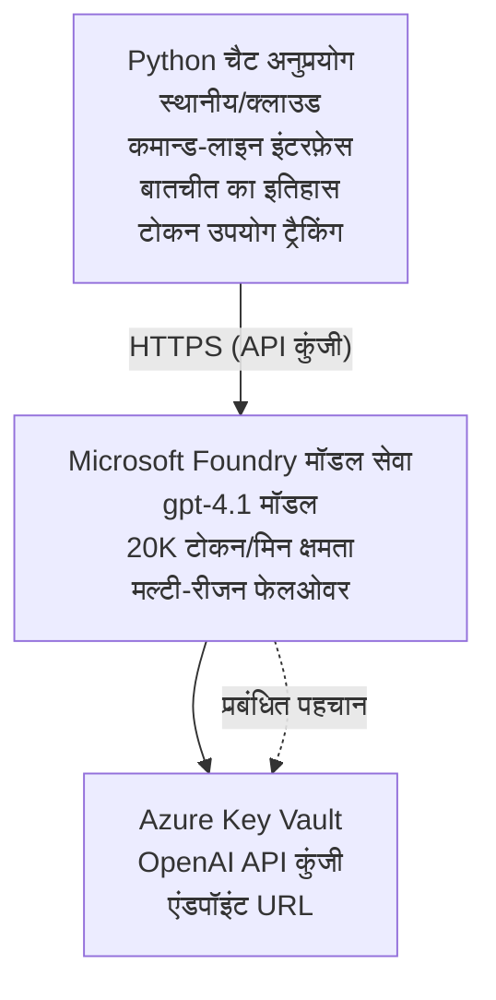

# Microsoft Foundry Models चैट एप्लिकेशन

**सीखने का पथ:** मध्यम स्तर ⭐⭐ | **समय:** 35-45 मिनट | **लागत:** $50-200/month

Azure Developer CLI (azd) का उपयोग करके परिनियोजित एक पूर्ण Microsoft Foundry Models चैट एप्लिकेशन। यह उदाहरण gpt-4.1 परिनियोजन, सुरक्षित API एक्सेस, और एक सरल चैट इंटरफ़ेस प्रदर्शित करता है।

## 🎯 आप क्या सीखेंगे

- Microsoft Foundry Models सेवा को gpt-4.1 मॉडल के साथ परिनियोजित करना  
- Key Vault के साथ OpenAI API कुंजियों को सुरक्षित करना  
- Python के साथ एक सरल चैट इंटरफ़ेस बनाना  
- टोकन उपयोग और लागत की निगरानी करना  
- रेट लिमिटिंग और त्रुटि हैंडलिंग लागू करना

## 📦 क्या शामिल है

✅ **Microsoft Foundry Models Service** - gpt-4.1 मॉडल परिनियोजन  
✅ **Python Chat App** - सरल कमांड-लाइन चैट इंटरफ़ेस  
✅ **Key Vault Integration** - सुरक्षित API कुंजी भंडारण  
✅ **ARM Templates** - संपूर्ण इन्फ्रास्ट्रक्चर कोड  
✅ **Cost Monitoring** - टोकन उपयोग ट्रैकिंग  
✅ **Rate Limiting** - कोटा समाप्ति से बचाव  

## Architecture



## पूर्वापेक्षाएँ

### आवश्यक

- **Azure Developer CLI (azd)** - [इंस्टॉल गाइड](https://learn.microsoft.com/azure/developer/azure-developer-cli/install-azd)
- **Azure subscription** with OpenAI access - [एक्सेस का अनुरोध करें](https://aka.ms/oai/access)
- **Python 3.9+** - [Python स्थापित करें](https://www.python.org/downloads/)

### पूर्वापेक्षाएँ सत्यापित करें

```bash
# azd संस्करण की जाँच करें (1.5.0 या उच्चतर आवश्यक)
azd version

# Azure लॉगिन सत्यापित करें
azd auth login

# Python संस्करण की जाँच करें
python --version  # या python3 --version

# OpenAI एक्सेस सत्यापित करें (Azure पोर्टल में जाँचें)
az cognitiveservices account list-skus \
  --kind OpenAI \
  --location eastus
```

> **⚠️ महत्वपूर्ण:** Microsoft Foundry Models को आवेदन स्वीकृति की आवश्यकता है। यदि आपने आवेदन नहीं किया है, तो जाएँ [aka.ms/oai/access](https://aka.ms/oai/access)। स्वीकृति सामान्यतः 1-2 कार्यदिवस लेती है।

## ⏱️ परिनियोजन समयरेखा

| चरण | समयावधि | क्या होता है |
|-------|----------|--------------|
| पूर्वापेक्षाएँ जांच | 2-3 minutes | OpenAI कोटा उपलब्धता सत्यापित करें |
| Deploy infrastructure | 8-12 minutes | Create OpenAI, Key Vault, model deployment |
| Configure application | 2-3 minutes | पर्यावरण और निर्भरताएँ सेट करें |
| **कुल** | **12-18 minutes** | gpt-4.1 के साथ चैट करने के लिए तैयार |

**नोट:** पहली बार OpenAI परिनियोजन मॉडल प्रावधान के कारण अधिक समय ले सकता है।

## त्वरित आरंभ

```bash
# उदाहरण पर जाएँ
cd examples/azure-openai-chat

# वातावरण प्रारंभ करें
azd env new myopenai

# सब कुछ तैनात करें (बुनियादी ढाँचा + विन्यास)
azd up
# आपसे पूछा जाएगा:
# 1. Azure सब्सक्रिप्शन चुनें
# 2. OpenAI उपलब्धता वाले स्थान का चयन करें (उदा., eastus, eastus2, westus)
# 3. तैनाती के लिए 12-18 मिनट प्रतीक्षा करें

# Python निर्भरताएँ स्थापित करें
pip install -r requirements.txt

# चैट शुरू करें!
python chat.py
```

**अपेक्षित आउटपुट:**
```
🤖 Microsoft Foundry Models Chat Application
Connected to: gpt-4.1 (eastus)
Type your message (or 'quit' to exit)

You: Hello! Tell me about Microsoft Foundry Models.
Assistant: Microsoft Foundry Models Service provides REST API access to OpenAI's powerful language models including gpt-4.1, GPT-3.5-Turbo, and Embeddings...

[Tokens used: 145 | Estimated cost: $0.0044]
```

## ✅ डिप्लॉयमेंट सत्यापित करें

### चरण 1: Azure संसाधनों की जाँच करें

```bash
# तैनात संसाधनों को देखें
azd show

# अपेक्षित आउटपुट दिखता है:
# - OpenAI सेवा: (संसाधन नाम)
# - Key Vault: (संसाधन नाम)
# - तैनाती: gpt-4.1
# - स्थान: eastus (या आपका चयनित क्षेत्र)
```

### चरण 2: OpenAI API का परीक्षण करें

```bash
# OpenAI एंडपॉइंट और कुंजी प्राप्त करें
OPENAI_ENDPOINT=$(azd env get-value AZURE_OPENAI_ENDPOINT)
OPENAI_KEY=$(azd env get-value AZURE_OPENAI_API_KEY)

# API कॉल का परीक्षण करें
curl "$OPENAI_ENDPOINT/openai/deployments/gpt-4.1/chat/completions?api-version=2024-08-01-preview" \
  -H "Content-Type: application/json" \
  -H "api-key: $OPENAI_KEY" \
  -d '{
    "messages": [{"role": "user", "content": "Say hello!"}],
    "max_tokens": 50
  }'
```

**अपेक्षित प्रतिक्रिया:**
```json
{
  "choices": [
    {
      "message": {
        "role": "assistant",
        "content": "Hello! How can I assist you today?"
      }
    }
  ],
  "usage": {
    "prompt_tokens": 8,
    "completion_tokens": 9,
    "total_tokens": 17
  }
}
```

### चरण 3: Key Vault पहुँच सत्यापित करें

```bash
# Key Vault में सीक्रेट्स सूचीबद्ध करें
KV_NAME=$(azd env get-value AZURE_KEY_VAULT_NAME)

az keyvault secret list \
  --vault-name $KV_NAME \
  --query "[].name" \
  --output table
```

**अपेक्षित सीक्रेट्स:**
- `openai-api-key`
- `openai-endpoint`

**सफलता मानदंड:**
- ✅ OpenAI सेवा gpt-4.1 के साथ परिनियोजित है
- ✅ API कॉल मान्य उत्तर लौटाती है
- ✅ सीक्रेट्स Key Vault में संग्रहित हैं
- ✅ टोकन उपयोग ट्रैकिंग काम करती है

## प्रोजेक्ट संरचना

```
azure-openai-chat/
├── README.md                   ✅ This guide
├── azure.yaml                  ✅ AZD configuration
├── infra/                      ✅ Infrastructure as Code
│   ├── main.bicep             ✅ Main Bicep template
│   ├── main.parameters.json   ✅ Parameters
│   └── openai.bicep           ✅ OpenAI resource definition
├── src/                        ✅ Application code
│   ├── chat.py                ✅ Chat interface
│   ├── config.py              ✅ Configuration loader
│   └── requirements.txt       ✅ Python dependencies
└── .gitignore                  ✅ Git ignore rules
```

## एप्लिकेशन विशेषताएँ

### चैट इंटरफ़ेस (`chat.py`)

चैट एप्लिकेशन में शामिल हैं:

- **कन्वर्सेशन इतिहास** - संदेशों के बीच संदर्भ बनाए रखता है  
- **टोकन गिनती** - उपयोग को ट्रैक करता है और लागत का अनुमान लगाता है  
- **त्रुटि हैंडलिंग** - रेट लिमिट और API त्रुटियों को सुचारू रूप से संभालना  
- **लागत अनुमान** - प्रति संदेश वास्तविक समय में लागत गणना  
- **स्ट्रीमिंग समर्थन** - वैकल्पिक स्ट्रीमिंग प्रतिक्रियाएँ

### कमांड्स

चैट करते समय, आप उपयोग कर सकते हैं:
- `quit` or `exit` - सत्र समाप्त करें  
- `clear` - कन्वर्सेशन इतिहास साफ़ करें  
- `tokens` - कुल टोकन उपयोग दिखाएँ  
- `cost` - अनुमानित कुल लागत दिखाएँ

### कॉन्फ़िगरेशन (`config.py`)

पर्यावरण वेरिएबल्स से कॉन्फ़िगरेशन लोड करता है:
```python
AZURE_OPENAI_ENDPOINT  # कुंजी भंडार से
AZURE_OPENAI_API_KEY   # कुंजी भंडार से
AZURE_OPENAI_MODEL     # डिफ़ॉल्ट: gpt-4.1
AZURE_OPENAI_MAX_TOKENS # डिफ़ॉल्ट: 800
```

## उपयोग के उदाहरण

### बेसिक चैट

```bash
python chat.py
```

### कस्टम मॉडल के साथ चैट

```bash
export AZURE_OPENAI_MODEL=gpt-35-turbo
python chat.py
```

### स्ट्रीमिंग के साथ चैट

```bash
python chat.py --stream
```

### उदाहरण वार्तालाप

```
You: Explain Microsoft Foundry Models Service in 3 sentences.
Assistant: Microsoft Foundry Models Service is Microsoft Azure's cloud platform offering 
that provides access to OpenAI's powerful language models. It enables developers 
to integrate capabilities like gpt-4.1 into their applications with enterprise-grade 
security and compliance. The service includes features for content filtering, 
abuse monitoring, and responsible AI practices.

[Tokens used: 89 | Estimated cost: $0.0027]

You: What models are available?
Assistant: Microsoft Foundry Models Service offers several model families including gpt-4.1 
(most capable), GPT-3.5-Turbo (faster and cost-effective), and Embeddings models 
for vector search. Each model has different capabilities, pricing, and token limits.

[Tokens used: 67 | Estimated cost: $0.0020]

Total session: 156 tokens | $0.0047
```

## लागत प्रबंधन

### टोकन मूल्य निर्धारण (gpt-4.1)

| मॉडल | इनपुट (प्रति 1K टोकन) | आउटपुट (प्रति 1K टोकन) |
|-------|----------------------|------------------------|
| gpt-4.1 | $0.03 | $0.06 |
| GPT-3.5-Turbo | $0.0015 | $0.002 |

### अनुमानित मासिक लागत

उपयोग पैटर्न के आधार पर:

| उपयोग स्तर | संदेश/दिन | टोकन/दिन | मासिक लागत |
|-------------|--------------|------------|--------------|
| **हल्का** | 20 संदेश | 3,000 टोकन | $3-5 |
| **मध्यम** | 100 संदेश | 15,000 टोकन | $15-25 |
| **भारी** | 500 संदेश | 75,000 टोकन | $75-125 |

**बेस इन्फ्रास्ट्रक्चर लागत:** $1-2/माह (Key Vault + न्यूनतम कंप्यूट)

### लागत अनुकूलन सुझाव

```bash
# 1. सरल कार्यों के लिए GPT-3.5-Turbo का उपयोग करें (20 गुना सस्ता)
export AZURE_OPENAI_MODEL=gpt-35-turbo

# 2. छोटे उत्तरों के लिए अधिकतम टोकन कम करें
export AZURE_OPENAI_MAX_TOKENS=400

# 3. टोकन उपयोग की निगरानी करें
python chat.py --show-tokens

# 4. बजट अलर्ट सेट करें
az consumption budget create \
  --budget-name "openai-budget" \
  --amount 50 \
  --time-grain Monthly
```

## निगरानी

### टोकन उपयोग देखें

```bash
# Azure पोर्टल में:
# OpenAI संसाधन → मेट्रिक्स → "टोकन लेनदेन" चुनें

# या Azure CLI के माध्यम से:
az monitor metrics list \
  --resource $(azd env get-value AZURE_OPENAI_RESOURCE_ID) \
  --metric "TokenTransaction" \
  --start-time $(date -u -d '1 hour ago' '+%Y-%m-%dT%H:%M:%S') \
  --interval PT1M
```

### API लॉग देखें

```bash
# डायग्नोस्टिक लॉग स्ट्रीम करें
az monitor diagnostic-settings create \
  --resource $(azd env get-value AZURE_OPENAI_RESOURCE_ID) \
  --name openai-logs \
  --logs '[{"category": "Audit", "enabled": true}]' \
  --workspace $(azd env get-value LOG_ANALYTICS_WORKSPACE_ID)

# क्वेरी लॉग्स
az monitor log-analytics query \
  --workspace $(azd env get-value LOG_ANALYTICS_WORKSPACE_ID) \
  --analytics-query "AzureDiagnostics | where Category == 'Audit' | top 10 by TimeGenerated"
```

## समस्या निवारण

### समस्या: "Access Denied" त्रुटि

**लक्षण:** API कॉल करते समय 403 Forbidden

**समाधान:**
```bash
# 1. सत्यापित करें कि OpenAI एक्सेस अनुमोदित है
az cognitiveservices account show \
  --name $(azd env get-value AZURE_OPENAI_NAME) \
  --resource-group $(azd env get-value AZURE_RESOURCE_GROUP)

# 2. जांचें कि API कुंजी सही है
azd env get-value AZURE_OPENAI_API_KEY

# 3. सत्यापित करें कि endpoint URL का प्रारूप सही है
azd env get-value AZURE_OPENAI_ENDPOINT
# होना चाहिए: https://[name].openai.azure.com/
```

### समस्या: "Rate Limit Exceeded"

**लक्षण:** 429 Too Many Requests

**समाधान:**
```bash
# 1. वर्तमान कोटा जांचें
az cognitiveservices account deployment show \
  --name $(azd env get-value AZURE_OPENAI_NAME) \
  --resource-group $(azd env get-value AZURE_RESOURCE_GROUP) \
  --deployment-name gpt-4.1

# 2. कोटा वृद्धि का अनुरोध करें (यदि आवश्यक हो)
# Azure पोर्टल पर जाएँ → OpenAI संसाधन → कोटा → वृद्धि का अनुरोध

# 3. पुनः प्रयास लॉजिक लागू करें (यह पहले से chat.py में मौजूद है)
# एप्लिकेशन स्वचालित रूप से घातीय बैकऑफ के साथ पुनः प्रयास करता है
```

### समस्या: "Model Not Found"

**लक्षण:** परिनियोजन के लिए 404 त्रुटि

**समाधान:**
```bash
# 1. उपलब्ध डिप्लॉयमेंट सूचीबद्ध करें
az cognitiveservices account deployment list \
  --name $(azd env get-value AZURE_OPENAI_NAME) \
  --resource-group $(azd env get-value AZURE_RESOURCE_GROUP)

# 2. पर्यावरण में मॉडल का नाम सत्यापित करें
echo $AZURE_OPENAI_MODEL

# 3. सही डिप्लॉयमेंट नाम में अपडेट करें
export AZURE_OPENAI_MODEL=gpt-4.1  # या gpt-35-turbo
```

### समस्या: उच्च विलंब

**लक्षण:** धीमे प्रतिक्रिया समय (>5 सेकंड)

**समाधान:**
```bash
# 1. क्षेत्रीय विलंबता जांचें
# उपयोगकर्ताओं के सबसे नज़दीकी क्षेत्र में तैनात करें

# 2. तेज़ उत्तरों के लिए max_tokens घटाएँ
export AZURE_OPENAI_MAX_TOKENS=400

# 3. बेहतर उपयोगकर्ता अनुभव के लिए स्ट्रीमिंग का उपयोग करें
python chat.py --stream
```

## सुरक्षा सर्वोत्तम प्रथाएँ

### 1. API कुंजियों की सुरक्षा करें

```bash
# कुंजियों को सोर्स कंट्रोल में कभी कमिट न करें
# Key Vault का उपयोग करें (पहले से कॉन्फ़िगर किया गया)

# कुंजियों को नियमित रूप से बदलें
az cognitiveservices account keys regenerate \
  --name $(azd env get-value AZURE_OPENAI_NAME) \
  --resource-group $(azd env get-value AZURE_RESOURCE_GROUP) \
  --key-name key1
```

### 2. सामग्री फ़िल्टरिंग लागू करें

```python
# Microsoft Foundry Models में अंतर्निहित सामग्री फ़िल्टरिंग शामिल है
# Azure पोर्टल में कॉन्फ़िगर करें:
# OpenAI संसाधन → सामग्री फ़िल्टर → कस्टम फ़िल्टर बनाएं

# श्रेणियाँ: घृणा, यौन, हिंसा, आत्म-हानि
# स्तर: कम, मध्यम, उच्च फ़िल्टरिंग
```

### 3. मैनेज्ड आइडेंटिटी का उपयोग करें (प्रोडक्शन)

```bash
# उत्पादन परिनियोजन के लिए, प्रबंधित पहचान का उपयोग करें
# API कुंजियों के बजाय (Azure पर ऐप होस्टिंग की आवश्यकता है)

# infra/openai.bicep को अपडेट करें ताकि इसमें निम्न शामिल हो:
# identity: { type: 'SystemAssigned' }
```

## डेवलपमेंट

### स्थानीय रूप से चलाएँ

```bash
# निर्भरता स्थापित करें
pip install -r src/requirements.txt

# पर्यावरण चर सेट करें
export AZURE_OPENAI_ENDPOINT="https://[name].openai.azure.com/"
export AZURE_OPENAI_API_KEY="your-api-key"
export AZURE_OPENAI_MODEL="gpt-4.1"

# एप्लिकेशन चलाएँ
python src/chat.py
```

### परीक्षण चलाएँ

```bash
# परीक्षण निर्भरता स्थापित करें
pip install pytest pytest-cov

# परीक्षण चलाएँ
pytest tests/ -v

# कवरेज के साथ
pytest tests/ --cov=src --cov-report=html
```

### मॉडल परिनियोजन अपडेट करें

```bash
# विभिन्न मॉडल संस्करण तैनात करें
az cognitiveservices account deployment create \
  --name $(azd env get-value AZURE_OPENAI_NAME) \
  --resource-group $(azd env get-value AZURE_RESOURCE_GROUP) \
  --deployment-name gpt-35-turbo \
  --model-name gpt-35-turbo \
  --model-version "0613" \
  --model-format OpenAI \
  --sku-capacity 20 \
  --sku-name "Standard"
```

## साफ़ करें

```bash
# सभी Azure संसाधनों को हटाएँ
azd down --force --purge

# यह निम्न को हटाता है:
# - OpenAI सेवा
# - Key Vault (90-दिन की सॉफ्ट-डिलीट के साथ)
# - संसाधन समूह
# - सभी तैनातियाँ और विन्यास
```

## अगले कदम

### इस उदाहरण का विस्तार करें

1. **वेब इंटरफ़ेस जोड़ें** - React/Vue फ्रंटएंड बनाएं  
   ```bash
   # azure.yaml में फ्रंटएंड सेवा जोड़ें
   # Azure Static Web Apps पर तैनात करें
   ```

2. **RAG लागू करें** - Azure AI Search के साथ दस्तावेज़ खोज जोड़ें  
   ```python
   # Azure AI Search को एकीकृत करें
   # दस्तावेज़ अपलोड करें और वेक्टर इंडेक्स बनाएं
   ```

3. **फ़ंक्शन कॉलिंग जोड़ें** - टूल उपयोग सक्षम करें  
   ```python
   # chat.py में फ़ंक्शन परिभाषित करें
   # gpt-4.1 को बाहरी API कॉल करने की अनुमति दें
   ```

4. **मल्टी-मॉडल समर्थन** - कई मॉडल परिनियोजित करें  
   ```bash
   # gpt-35-turbo और एम्बेडिंग मॉडल जोड़ें
   # मॉडल राउटिंग लॉजिक लागू करें
   ```

### संबंधित उदाहरण

- **[Retail Multi-Agent](../retail-scenario.md)** - उन्नত मल्टी-एजेंट आर्किटेक्चर  
- **[Database App](../../../../examples/database-app)** - स्थायी स्टोरेज जोड़ें  
- **[Container Apps](../../../../examples/container-app)** - कंटेनराइज़्ड सेवा के रूप में परिनियोजित करें

### लर्निंग संसाधन

- 📚 [AZD For Beginners Course](../../README.md) - मुख्य कोर्स होम  
- 📚 [Microsoft Foundry Models Documentation](https://learn.microsoft.com/azure/ai-services/openai/) - आधिकारिक दस्तावेज़  
- 📚 [OpenAI API Reference](https://platform.openai.com/docs/api-reference) - API विवरण  
- 📚 [Responsible AI](https://www.microsoft.com/ai/responsible-ai) - सर्वोत्तम प्रथाएँ

## अतिरिक्त संसाधन

### दस्तावेज़ीकरण
- **[Microsoft Foundry Models Service](https://learn.microsoft.com/azure/ai-services/openai/)** - पूर्ण गाइड  
- **[gpt-4.1 Models](https://learn.microsoft.com/azure/ai-services/openai/concepts/models)** - मॉडल क्षमताएँ  
- **[Content Filtering](https://learn.microsoft.com/azure/ai-services/openai/concepts/content-filter)** - सुरक्षा सुविधाएँ  
- **[Azure Developer CLI](https://learn.microsoft.com/azure/developer/azure-developer-cli/)** - azd संदर्भ

### ट्यूटोरियल्स
- **[OpenAI Quickstart](https://learn.microsoft.com/azure/ai-services/openai/quickstart)** - पहला परिनियोजन  
- **[Chat Completions](https://learn.microsoft.com/azure/ai-services/openai/how-to/chatgpt)** - चैट ऐप्स बनाना  
- **[Function Calling](https://learn.microsoft.com/azure/ai-services/openai/how-to/function-calling)** - उन्नत सुविधाएँ

### उपकरण
- **[Microsoft Foundry Models Studio](https://oai.azure.com/)** - वेब-आधारित प्लेग्राउंड  
- **[Prompt Engineering Guide](https://platform.openai.com/docs/guides/prompt-engineering)** - बेहतर प्रॉम्प्ट लिखना  
- **[Token Calculator](https://platform.openai.com/tokenizer)** - टोकन उपयोग का अनुमान लगाएँ

### समुदाय
- **[Azure AI Discord](https://discord.gg/azure)** - समुदाय से मदद लें  
- **[GitHub Discussions](https://github.com/Azure-Samples/openai/discussions)** - प्रश्नोत्तर फोरम  
- **[Azure Blog](https://azure.microsoft.com/blog/tag/azure-openai-service/)** - नवीनतम अपडेट

---

**🎉 सफलता!** आपने Microsoft Foundry Models परिनियोजित कर लिया है और एक काम करने वाला चैट एप्लिकेशन बनाया है। gpt-4.1 की क्षमताओं का अन्वेषण करें और विभिन्न प्रॉम्प्ट्स और उपयोग मामलों के साथ प्रयोग करें।

**प्रश्न?** [Open an issue](https://github.com/microsoft/AZD-for-beginners/issues) या [FAQ](../../resources/faq.md) देखें

**लागत चेतावनी:** परीक्षण समाप्त होने पर चल रहे शुल्क से बचने के लिए `azd down` चलाना याद रखें (~$50-100/माह सक्रिय उपयोग के लिए).

---

<!-- CO-OP TRANSLATOR DISCLAIMER START -->
**अस्वीकरण**:
इस दस्तावेज़ का अनुवाद AI अनुवाद सेवा [Co-op Translator](https://github.com/Azure/co-op-translator) का उपयोग करके किया गया है। जबकि हम सटीकता के लिए प्रयास करते हैं, कृपया ध्यान दें कि स्वचालित अनुवादों में त्रुटियाँ या अशुद्धियाँ हो सकती हैं। मूल दस्तावेज़ अपनी मूल भाषा में ही प्रामाणिक स्रोत माना जाना चाहिए। महत्वपूर्ण जानकारी के लिए, पेशेवर मानव अनुवाद की सिफारिश की जाती है। इस अनुवाद के उपयोग से उत्पन्न किसी भी गलतफहमी या गलत व्याख्या के लिए हम उत्तरदायी नहीं हैं।
<!-- CO-OP TRANSLATOR DISCLAIMER END -->