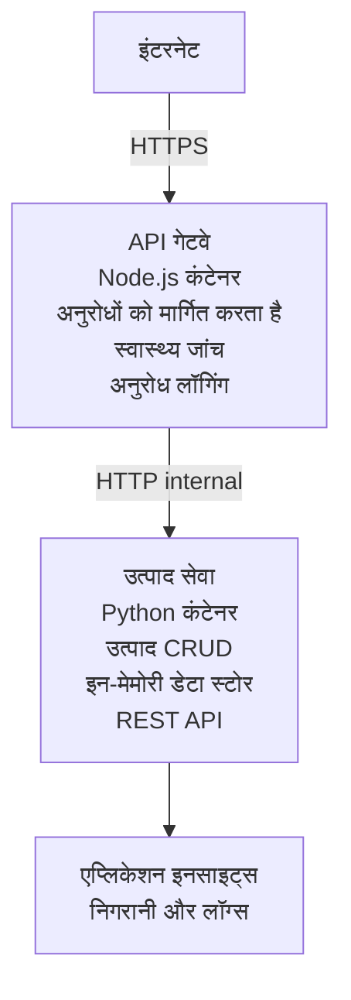

# माइक्रोसर्विस आर्किटेक्चर - कंटेनर ऐप उदाहरण

⏱️ **अनुमानित समय**: 25-35 मिनट | 💰 **अनुमानित लागत**: ~$50-100/महीना | ⭐ **जटिलता**: उन्नत

एक **सरल लेकिन कार्यात्मक** माइक्रोसर्विस आर्किटेक्चर जिसे AZD CLI का उपयोग करके Azure Container Apps पर तैनात किया गया है। यह उदाहरण सेवा-से-सेवा संचार, कंटेनर ऑर्केस्ट्रेशन, और मॉनीटरिंग को एक व्यावहारिक 2-सर्विस सेटअप के साथ दिखाता है।

> **📚 सीखने का तरीका**: यह उदाहरण एक न्यूनतम 2-सर्विस आर्किटेक्चर (API Gateway + Backend Service) से शुरू होता है जिसे आप वास्तव में तैनात करके सीख सकते हैं। इस आधार को मास्टर करने के बाद, हम एक पूर्ण माइक्रोसर्विस इकोसिस्टम में विस्तार करने के लिए मार्गदर्शन प्रदान करते हैं।

## आप क्या सीखेंगे

इस उदाहरण को पूरा करके, आप:
- Azure Container Apps पर कई कंटेनरों को तैनात करेंगे
- आंतरिक नेटवर्किंग के साथ सेवा-से-सेवा संचार लागू करेंगे
- पर्यावरण-आधारित स्केलिंग और हेल्थ चेक कॉन्फ़िगर करेंगे
- Application Insights के साथ वितरित अनुप्रयोगों की निगरानी करेंगे
- माइक्रोसर्विसेस तैनाती पैटर्न और सर्वोत्तम प्रथाओं को समझेंगे
- सरल से जटिल आर्किटेक्चर तक प्रगतिशील विस्तार सीखेंगे

## आर्किटेक्चर

### चरण 1: हम क्या बना रहे हैं (इस उदाहरण में शामिल)


**सरल से क्यों शुरू करें?**
- ✅ जल्दी तैनात करें और समझें (25-35 मिनट)
- ✅ बिना जटिलता के कोर माइक्रोसर्विस पैटर्न सीखें
- ✅ कार्यशील कोड जिसे आप संशोधित और प्रयोग कर सकते हैं
- ✅ सीखने के लिए कम लागत (~$50-100/महीना बनाम $300-1400/महीना)
- ✅ डेटाबेस और मैसेज कतारें जोड़ने से पहले आत्मविश्वास बनाएं

**उपमा**: इसे ड्राइव करना सीखने जैसा समझें। आप खाली पार्किंग लॉट (2 सर्विस) से शुरू करते हैं, मूल बातें मास्टर करते हैं, फिर शहर के ट्रैफिक (5+ सेवाएँ डेटाबेस के साथ) की ओर बढ़ते हैं।

### चरण 2: भविष्य का विस्तार (संदर्भ आर्किटेक्चर)

एक बार जब आप 2-सर्विस आर्किटेक्चर में माहिर हो जाते हैं, तो आप विस्तार कर सकते हैं:

```
Full Architecture (Not Included - For Reference)
├── API Gateway (✅ Included)
├── Product Service (✅ Included)
├── Order Service (🔜 Add next)
├── User Service (🔜 Add next)
├── Notification Service (🔜 Add last)
├── Azure Service Bus (🔜 For async communication)
├── Cosmos DB (🔜 For product persistence)
├── Azure SQL (🔜 For order management)
└── Azure Storage (🔜 For file storage)
```

अंत में चरण-दर-चरण निर्देशों के लिए "Expansion Guide" अनुभाग देखें।

## शामिल सुविधाएँ

✅ **सेवा खोज**: कंटेनरों के बीच स्वचालित DNS-आधारित खोज  
✅ **लोड बैलेंसिंग**: रेप्लिका के पार बिल्ट-इन लोड बैलेंसिंग  
✅ **ऑटो-स्केलिंग**: HTTP अनुरोधों के आधार पर प्रत्येक सेवा के लिए स्वतंत्र स्केलिंग  
✅ **हेल्थ मॉनिटरिंग**: दोनों सेवाओं के लिए लिवनेस और रीडिनेस प्रोब्स  
✅ **वितरित लॉगिंग**: Application Insights के साथ केंद्रीकृत लॉगिंग  
✅ **आंतरिक नेटवर्किंग**: सुरक्षित सेवा-से-सेवा संचार  
✅ **कंटेनर ऑर्केस्ट्रेशन**: स्वचालित तैनाती और स्केलिंग  
✅ **ज़ीरो-डाउनटाइम अपडेट्स**: रिविजन प्रबंधन के साथ रोलिंग अपडेट्स  

## पूर्वापेक्षाएँ

### आवश्यक उपकरण

शुरू करने से पहले, सत्यापित करें कि आपके पास ये उपकरण इंस्टॉल हैं:

1. **[Azure Developer CLI (azd)](https://learn.microsoft.com/azure/developer/azure-developer-cli/install-azd)** (संस्करण 1.0.0 या उच्चतर)
   ```bash
   azd version
   # अपेक्षित आउटपुट: azd संस्करण 1.0.0 या उच्चतर
   ```

2. **[Azure CLI](https://learn.microsoft.com/cli/azure/install-azure-cli)** (संस्करण 2.50.0 या उच्चतर)
   ```bash
   az --version
   # अपेक्षित आउटपुट: azure-cli 2.50.0 या उससे ऊपर
   ```

3. **[Docker](https://www.docker.com/get-started)** (लोकल विकास/टेस्टिंग के लिए - वैकल्पिक)
   ```bash
   docker --version
   # अपेक्षित आउटपुट: Docker संस्करण 20.10 या उससे ऊपर
   ```

### Azure आवश्यकताएँ

- एक सक्रिय **Azure सदस्यता** ([नि:शुल्क खाता बनाएं](https://azure.microsoft.com/free/))
- आपकी सदस्यता में संसाधन बनाने की अनुमति
- सदस्यता या संसाधन समूह पर **Contributor** भूमिका

### ज्ञान पूर्वापेक्षाएँ

यह एक **उन्नत-स्तर** उदाहरण है। आपके पास होना चाहिए:
- [Simple Flask API example](../../../../../examples/container-app/simple-flask-api) पूरा किया हुआ
- माइक्रोसर्विस आर्किटेक्चर की मौलिक समझ
- REST APIs और HTTP से परिचय
- कंटेनर कॉन्सेप्ट्स की समझ

**Container Apps में नए हैं?** बेसिक्स सीखने के लिए पहले [Simple Flask API example](../../../../../examples/container-app/simple-flask-api) से शुरुआत करें।

## त्वरित शुरुआत (कदम-दर-कदम)

### चरण 1: क्लोन और नेविगेट करें

```bash
git clone https://github.com/microsoft/AZD-for-beginners.git
cd AZD-for-beginners/examples/container-app/microservices
```

**✓ सफलता जांच**: सुनिश्चित करें कि आप `azure.yaml` देखते हैं:
```bash
ls
# अपेक्षित: README.md, azure.yaml, infra/, src/
```

### चरण 2: Azure के साथ प्रमाणीकृत करें

```bash
azd auth login
```

यह Azure प्रमाणीकरण के लिए आपका ब्राउज़र खोलता है। अपने Azure क्रेडेंशियल्स से साइन इन करें।

**✓ सफलता जांच**: आपको यह दिखना चाहिए:
```
Logged in to Azure.
```

### चरण 3: पर्यावरण प्रारंभ करें

```bash
azd init
```

**आपको दिखाई देने वाले संकेत**:
- **Environment name**: एक छोटा नाम दर्ज करें (उदा., `microservices-dev`)
- **Azure subscription**: अपनी सदस्यता चुनें
- **Azure location**: एक क्षेत्र चुनें (उदा., `eastus`, `westeurope`)

**✓ सफलता जांच**: आपको यह दिखना चाहिए:
```
SUCCESS: New project initialized!
```

### चरण 4: अवसंरचना और सेवाएँ तैनात करें

```bash
azd up
```

**क्या होता है** (लगभग 8-12 मिनट लेता है):
1. Container Apps पर्यावरण बनाता है
2. मॉनीटरिंग के लिए Application Insights बनाता है
3. API Gateway कंटेनर बनाता है (Node.js)
4. Product Service कंटेनर बनाता है (Python)
5. दोनों कंटेनरों को Azure पर तैनात करता है
6. नेटवर्किंग और हेल्थ चेक कॉन्फ़िगर करता है
7. मॉनीटरिंग और लॉगिंग सेटअप करता है

**✓ सफलता जांच**: आपको यह दिखना चाहिए:
```
SUCCESS: Your application was deployed to Azure in X minutes Y seconds.
Endpoint: https://api-gateway-<unique-id>.azurecontainerapps.io
```

**⏱️ समय**: 8-12 मिनट

### चरण 5: तैनाती का परीक्षण करें

```bash
# गेटवे एंडपॉइंट प्राप्त करें
GATEWAY_URL=$(azd env get-values | grep API_GATEWAY_URL | cut -d '=' -f2 | tr -d '"')

# API गेटवे के स्वास्थ्य की जाँच करें
curl $GATEWAY_URL/health

# अपेक्षित आउटपुट:
# {"स्थिति":"स्वस्थ","सेवा":"एपीआई-गेटवे","टाइमस्टैम्प":"2025-11-19T10:30:00Z"}
```

**गेटवे के माध्यम से प्रोडक्ट सेवा का परीक्षण**:
```bash
# उत्पादों की सूची
curl $GATEWAY_URL/api/products

# अपेक्षित आउटपुट:
# [
#   {"id":1,"name":"Laptop","price":999.99,"stock":50},
#   {"id":2,"name":"Mouse","price":29.99,"stock":200},
#   {"id":3,"name":"Keyboard","price":79.99,"stock":150}
# ]
```

**✓ सफलता जांच**: दोनों एंडपॉइंट JSON डेटा बिना त्रुटियों के लौटाते हैं।

---

**🎉 बधाई!** आपने Azure पर एक माइक्रोसर्विस आर्किटेक्चर तैनात कर दिया है!

## प्रोजेक्ट संरचना

सभी कार्यान्वयन फ़ाइलें शामिल हैं—यह एक पूर्ण, कार्यशील उदाहरण है:

```
microservices/
│
├── README.md                         # This file
├── azure.yaml                        # AZD configuration
├── .gitignore                        # Git ignore patterns
│
├── infra/                           # Infrastructure as Code (Bicep)
│   ├── main.bicep                   # Main orchestration
│   ├── abbreviations.json           # Naming conventions
│   ├── core/                        # Shared infrastructure
│   │   ├── container-apps-environment.bicep  # Container environment + registry
│   │   └── monitor.bicep            # Application Insights + Log Analytics
│   └── app/                         # Service definitions
│       ├── api-gateway.bicep        # API Gateway container app
│       └── product-service.bicep    # Product Service container app
│
└── src/                             # Application source code
    ├── api-gateway/                 # Node.js API Gateway
    │   ├── app.js                   # Express server with routing
    │   ├── package.json             # Node dependencies
    │   └── Dockerfile               # Container definition
    └── product-service/             # Python Product Service
        ├── main.py                  # Flask API with product data
        ├── requirements.txt         # Python dependencies
        └── Dockerfile               # Container definition
```

**प्रत्येक घटक क्या करता है:**

**Infrastructure (infra/)**:
- `main.bicep`: सभी Azure संसाधनों और उनकी निर्भरताओं का समन्वय करता है
- `core/container-apps-environment.bicep`: Container Apps पर्यावरण और Azure Container Registry बनाता है
- `core/monitor.bicep`: वितरित लॉगिंग के लिए Application Insights सेटअप करता है
- `app/*.bicep`: स्केलिंग और हेल्थ चेक के साथ व्यक्तिगत कंटेनर ऐप परिभाषाएँ

**API Gateway (src/api-gateway/)**:
- सार्वजनिक-मैत्री सेवा जो बैकएंड सेवाओं को अनुरोध रूट करती है
- लॉगिंग, त्रुटि हैंडलिंग, और अनुरोध अग्रेषण लागू करता है
- सेवा-से-सेवा HTTP संचार का प्रदर्शन करता है

**Product Service (src/product-service/)**:
- इन-मेमोरी उत्पाद कैटलॉग के साथ आंतरिक सेवा (सरलता के लिए)
- REST API के साथ हेल्थ चेक
- बैकएंड माइक्रोसर्विस पैटर्न का उदाहरण

## सेवाओं का अवलोकन

### API Gateway (Node.js/Express)

**पोर्ट**: 8080  
**पहुंच**: सार्वजनिक (बाहरी ingress)  
**उद्देश्य**: आने वाले अनुरोधों को उपयुक्त बैकएंड सेवाओं को मार्गित करना  

**एंडपॉइंट्स**:
- `GET /` - सेवा जानकारी
- `GET /health` - हेल्थ चेक एंडपॉइंट
- `GET /api/products` - प्रोडक्ट सेवा को अग्रेषित करें (सभी सूची)
- `GET /api/products/:id` - प्रोडक्ट सेवा को अग्रेषित करें (ID द्वारा प्राप्त करें)

**मुख्य विशेषताएँ**:
- axios के साथ अनुरोध रूटिंग
- केंद्रीकृत लॉगिंग
- त्रुटि हैंडलिंग और टाइमआउट प्रबंधन
- परिवेश वेरिएबल्स के माध्यम से सेवा खोज
- Application Insights एकीकरण

**कोड हाइलाइट** (`src/api-gateway/app.js`):
```javascript
// आंतरिक सेवा संचार
app.get('/api/products', async (req, res) => {
  const response = await axios.get(`${PRODUCT_SERVICE_URL}/products`);
  res.json(response.data);
});
```

### Product Service (Python/Flask)

**पोर्ट**: 8000  
**पहुंच**: केवल आंतरिक (किसी भी बाहरी इनग्रेशन के बिना)  
**उद्देश्य**: इन-मेमोरी डेटा के साथ उत्पाद कैटलॉग का प्रबंधन  

**एंडपॉइंट्स**:
- `GET /` - सेवा जानकारी
- `GET /health` - हेल्थ चेक एंडपॉइंट
- `GET /products` - सभी उत्पाद सूची
- `GET /products/<id>` - ID द्वारा उत्पाद प्राप्त करें

**मुख्य विशेषताएँ**:
- Flask के साथ RESTful API
- इन-मेमोरी उत्पाद स्टोर (सरल, किसी डेटाबेस की आवश्यकता नहीं)
- प्रोब्स के साथ हेल्थ मॉनिटरिंग
- संरचित लॉगिंग
- Application Insights एकीकरण

**डेटा मॉडल**:
```python
{
  "id": 1,
  "name": "Laptop",
  "description": "High-performance laptop",
  "price": 999.99,
  "stock": 50
}
```

**क्यों केवल आंतरिक?**
प्रोडक्ट सेवा सार्वजनिक रूप से एक्सपोज़ नहीं है। सभी अनुरोधों को API Gateway के माध्यम से होना चाहिए, जो प्रदान करता है:
- सुरक्षा: नियंत्रित एक्सेस पॉइंट
- लचीलापन: बैकएंड को बदले बिना क्लाइंट पर असर नहीं पड़ता
- निगरानी: केंद्रीकृत अनुरोध लॉगिंग

## सेवा संचार को समझना

### सेवाएँ एक-दूसरे से कैसे बात करती हैं

इस उदाहरण में, API Gateway प्रोडक्ट सेवा के साथ **आंतरिक HTTP कॉल्स** का उपयोग करके संवाद करता है:

```javascript
// API गेटवे (src/api-gateway/app.js)
const PRODUCT_SERVICE_URL = process.env.PRODUCT_SERVICE_URL;

// आंतरिक HTTP अनुरोध करें
const response = await axios.get(`${PRODUCT_SERVICE_URL}/products`);
```

**मुख्य बिंदु**:

1. **DNS-आधारित खोज**: Container Apps स्वचालित रूप से आंतरिक सेवाओं के लिए DNS प्रदान करता है
   - Product Service FQDN: `product-service.internal.<environment>.azurecontainerapps.io`
   - सरलीकृत रूप में: `http://product-service` (Container Apps इसे हल करता है)

2. **कोई सार्वजनिक एक्सपोज़र नहीं**: Bicep में Product Service के लिए `external: false` है
   - केवल Container Apps पर्यावरण के भीतर पहुंच योग्य
   - इंटरनेट से पहुँचा नहीं जा सकता

3. **पर्यावरण वेरिएबल्स**: सेवा URLs तैनाती के समय इंजेक्ट किए जाते हैं
   - Bicep गेटवे को आंतरिक FQDN पास करता है
   - एप्लिकेशन कोड में कोई हार्डकोडेड URL नहीं

**उपमा**: इसे ऑफिस के कमरे की तरह समझें। API Gateway रिसेप्शन डेस्क है (सार्वजनिक), और Product Service एक ऑफिस रूम है (केवल आंतरिक)। किसी भी कमरे तक पहुंचने के लिए विजिटर्स को रिसेप्शन से गुजरना होगा।

## तैनाती विकल्प

### पूर्ण तैनाती (अनुशंसित)

```bash
# बुनियादी संरचना और दोनों सेवाओं को तैनात करें
azd up
```

यह तैनात करता है:
1. Container Apps पर्यावरण
2. Application Insights
3. Container Registry
4. API Gateway कंटेनर
5. Product Service कंटेनर

**समय**: 8-12 मिनट

### व्यक्तिगत सेवा तैनात करें

```bash
# केवल एक सेवा डिप्लॉय करें (प्रारंभिक azd up के बाद)
azd deploy api-gateway

# या प्रोडक्ट सेवा डिप्लॉय करें
azd deploy product-service
```

**उपयोग का मामला**: जब आपने किसी एक सेवा में कोड अपडेट किया हो और केवल उस सेवा को पुनःतैनात करना चाहते हों।

### कॉन्फ़िगरेशन अपडेट करें

```bash
# स्केलिंग पैरामीटर बदलें
azd env set GATEWAY_MAX_REPLICAS 30

# नई कॉन्फ़िगरेशन के साथ पुनः तैनात करें
azd up
```

## कॉन्फ़िगरेशन

### स्केलिंग कॉन्फ़िगरेशन

दोनों सेवाएँ अपने Bicep फ़ाइलों में HTTP-आधारित ऑटोस्केलिंग के साथ कॉन्फ़िगर की गई हैं:

**API Gateway**:
- न्यूनतम रिप्लिका: 2 (उपलब्धता के लिए हमेशा कम से कम 2)
- अधिकतम रिप्लिका: 20
- स्केल ट्रिगर: प्रति रिप्लिका 50 समवर्ती अनुरोध

**Product Service**:
- न्यूनतम रिप्लिका: 1 (आवश्यकता पड़ने पर शून्य तक स्केल कर सकता है)
- अधिकतम रिप्लिका: 10
- स्केल ट्रिगर: प्रति रिप्लिका 100 समवर्ती अनुरोध

**स्केलिंग अनुकूलित करें** (in `infra/app/*.bicep`):
```bicep
scale: {
  minReplicas: 1
  maxReplicas: 10
  rules: [
    {
      name: 'http-scale-rule'
      http: {
        metadata: {
          concurrentRequests: '100'  // Adjust this
        }
      }
    }
  ]
}
```

### संसाधन आवंटन

**API Gateway**:
- CPU: 1.0 vCPU
- मेमोरी: 2 GiB
- कारण: सभी बाहरी ट्रैफ़िक को संभालता है

**Product Service**:
- CPU: 0.5 vCPU
- मेमोरी: 1 GiB
- कारण: हल्के इन-मेमोरी ऑपरेशंस

### हेल्थ चेक्स

दोनों सेवाओं में लिवनेस और रीडिनेस प्रोब्स शामिल हैं:

```bicep
probes: [
  {
    type: 'Liveness'
    httpGet: {
      path: '/health'
      port: 8080
    }
    initialDelaySeconds: 10
    periodSeconds: 30
  }
  {
    type: 'Readiness'
    httpGet: {
      path: '/health'
      port: 8080
    }
    initialDelaySeconds: 5
    periodSeconds: 10
  }
]
```

**इसका क्या मतलब है**:
- **लाइवनेस**: यदि हेल्थ चेक विफल होता है, तो Container Apps कंटेनर को पुनःप्रारंभ करता है
- **रीडिनेस**: यदि तैयार नहीं है, तो Container Apps उस रेप्लिका को ट्रैफ़िक रूटिंग से रोक देता है


## मॉनिटरिंग और ऑब्ज़र्वेबिलिटी

### सेवा लॉग देखें

```bash
# azd monitor का उपयोग करके लॉग देखें
azd monitor --logs

# या विशिष्ट कंटेनर ऐप्स के लिए Azure CLI का उपयोग करें:
# API Gateway से लॉग स्ट्रीम करें
az containerapp logs show --name api-gateway --resource-group $RG_NAME --follow

# हाल के उत्पाद सेवा लॉग देखें
az containerapp logs show --name product-service --resource-group $RG_NAME --tail 100
```

**अपेक्षित आउटपुट**:
```
[api-gateway] API Gateway listening on port 8080
[api-gateway] Product Service URL: http://product-service
[api-gateway] GET /api/products 200 - 45ms
[product-service] Retrieved 5 products
```

### Application Insights क्वेरीज़

Azure पोर्टल में Application Insights एक्सेस करें, फिर इन क्वेरियों को चलाएँ:

**धीमी अनुरोध ढूंढें**:
```kusto
requests
| where timestamp > ago(1h)
| where duration > 1000  // Requests taking >1 second
| summarize count() by name, cloud_RoleName
| order by count_ desc
```

**सेवा-से-सेवा कॉल ट्रैक करें**:
```kusto
dependencies
| where timestamp > ago(1h)
| where type == "Http"
| project timestamp, name, target, duration, success
| order by timestamp desc
```

**सेवा द्वारा त्रुटि दर**:
```kusto
exceptions
| where timestamp > ago(24h)
| summarize errorCount = count() by cloud_RoleName, type
| order by errorCount desc
```

**समय के साथ अनुरोध मात्रा**:
```kusto
requests
| where timestamp > ago(1h)
| summarize requestCount = count() by bin(timestamp, 5m), cloud_RoleName
| render timechart
```

### मॉनिटरिंग डैशबोर्ड तक पहुंच

```bash
# Application Insights के विवरण प्राप्त करें
azd env get-values | grep APPLICATIONINSIGHTS

# Azure पोर्टल में मॉनिटरिंग खोलें
az monitor app-insights component show \
  --app $(azd env get-values | grep APPLICATIONINSIGHTS_CONNECTION_STRING | cut -d '=' -f2) \
  --resource-group $(azd env get-values | grep AZURE_RESOURCE_GROUP | cut -d '=' -f2) \
  --query "appId" -o tsv
```

### लाइव मैट्रिक्स

1. Azure पोर्टल में Application Insights पर जाएँ
2. "Live Metrics" पर क्लिक करें
3. रीयल-टाइम अनुरोध, विफलताएँ, और प्रदर्शन देखें
4. इस कमांड को चलाकर परीक्षण करें: `curl $(azd env get-values | grep API_GATEWAY_URL | cut -d '=' -f2 | tr -d '"')/api/products`

## व्यावहारिक अभ्यास

[Note: विस्तृत चरण-दर-चरण अभ्यासों के लिए "Practical Exercises" सेक्शन में ऊपर पूर्ण अभ्यास देखें, जिनमें तैनाती सत्यापन, डेटा संशोधन, ऑटोस्केलिंग परीक्षण, त्रुटि हैंडलिंग, और तीसरी सेवा जोड़ना शामिल हैं।]

## लागत विश्लेषण

### अनुमानित मासिक लागत (इस 2-सर्विस उदाहरण के लिए)

| संसाधन | कॉन्फ़िगरेशन | अनुमानित लागत |
|----------|--------------|----------------|
| API Gateway | 2-20 रिप्लिकाएँ, 1 vCPU, 2GB RAM | $30-150 |
| Product Service | 1-10 रिप्लिकाएँ, 0.5 vCPU, 1GB RAM | $15-75 |
| Container Registry | बेसिक टियर | $5 |
| Application Insights | 1-2 GB/महीना | $5-10 |
| Log Analytics | 1 GB/महीना | $3 |
| **कुल** | | **$58-243/महीना** |

**उपयोग के अनुसार लागत विभाजन**:
- **कम ट्रैफ़िक** (टेस्टिंग/सीखने के लिए): ~$60/महीना
- **मध्यम ट्रैफ़िक** (छोटे प्रोडक्शन): ~$120/महीना
- **उच्च ट्रैफ़िक** (व्यस्त अवधियाँ): ~$240/महीना

### लागत अनुकूलन सुझाव

1. **डेवलपमेंट के लिए ज़ीरो तक स्केल करें**:
   ```bicep
   scale: {
     minReplicas: 0  // Save $30-40/month when not in use
     maxReplicas: 10
   }
   ```

2. **Cosmos DB के लिए Consumption Plan का उपयोग करें** (जब आप इसे जोड़ें):
   - आप केवल उपयोग के लिए भुगतान करें
   - कोई न्यूनतम शुल्क नहीं

3. **Application Insights सैंपलिंग सेट करें**:
   ```javascript
   appInsights.defaultClient.config.samplingPercentage = 50; // अनुरोधों के 50% का नमूना लें
   ```

4. **जब आवश्यक न हो तो साफ़ करें**:
   ```bash
   azd down
   ```

### मुफ्त स्तर विकल्प

अध्ययन/परीक्षण के लिए, विचार करें:
- Azure निःशुल्क क्रेडिट का उपयोग करें (पहले 30 दिन)
- न्यूनतम रेप्लिकास रखें
- परीक्षण के बाद हटाएँ (कोई चल रहे शुल्क नहीं)

---

## सफाई

चल रहे शुल्क से बचने के लिए, सभी संसाधनों को हटाएँ:

```bash
azd down --force --purge
```

**पुष्टिकरण संकेत**:
```
? Total resources to delete: 6, are you sure you want to continue? (y/N)
```

पुष्टि करने के लिए `y` टाइप करें।

**क्या हटाया जाएगा**:
- Container Apps Environment
- Both Container Apps (gateway & product service)
- Container Registry
- Application Insights
- Log Analytics Workspace
- Resource Group

**✓ क्लीनअप सत्यापित करें**:
```bash
az group list --query "[?starts_with(name,'rg-microservices')]" --output table
```

खाली लौटना चाहिए।

---

## विस्तार मार्गदर्शिका: 2 से 5+ सेवाओं तक

एक बार जब आप इस 2-सेवा आर्किटेक्चर में निपुण हो जाएं, तो इसे कैसे बढ़ाएँ:

### चरण 1: डेटाबेस स्थायित्व जोड़ें (अगला कदम)

**Product Service के लिए Cosmos DB जोड़ें**:

1. बनाएँ `infra/core/cosmos.bicep`:
   ```bicep
   resource cosmosAccount 'Microsoft.DocumentDB/databaseAccounts@2023-04-15' = {
     name: name
     location: location
     kind: 'GlobalDocumentDB'
     properties: {
       databaseAccountOfferType: 'Standard'
       locations: [{ locationName: location, failoverPriority: 0 }]
     }
   }
   ```

2. product service को इन-मेमोरी डेटा के बजाय Cosmos DB का उपयोग करने के लिए अपडेट करें

3. अनुमानित अतिरिक्त लागत: ~$25/माह (सर्वरलेस)

### चरण 2: तीसरी सेवा जोड़ें (Order Management)

**Order Service बनाएँ**:

1. नया फ़ोल्डर: `src/order-service/` (Python/Node.js/C#)
2. नया Bicep: `infra/app/order-service.bicep`
3. API Gateway को `/api/orders` रूट करने के लिए अपडेट करें
4. ऑर्डर स्थायित्व के लिए Azure SQL Database जोड़ें

**आर्किटेक्चर बन जाता है**:
```
API Gateway → Product Service (Cosmos DB)
           → Order Service (Azure SQL)
```

### चरण 3: असिंक्रोनस संचार जोड़ें (Service Bus)

**इवेंट-ड्रिवन आर्किटेक्चर लागू करें**:

1. Azure Service Bus जोड़ें: `infra/core/servicebus.bicep`
2. Product Service "ProductCreated" इवेंट प्रकाशित करता है
3. Order Service उत्पाद इवेंट्स को सब्सक्राइब करता है
4. इवेंट्स को प्रोसेस करने के लिए Notification Service जोड़ें

**पैटर्न**: अनुरोध/प्रतिक्रिया (HTTP) + इवेंट-ड्रिवन (Service Bus)

### चरण 4: उपयोगकर्ता प्रमाणीकरण जोड़ें

**User Service लागू करें**:

1. बनाएं `src/user-service/` (Go/Node.js)
2. Azure AD B2C या कस्टम JWT प्रमाणीकरण जोड़ें
3. API Gateway टोकन सत्यापित करता है
4. सेवाएँ उपयोगकर्ता अनुमतियों की जाँच करती हैं

### चरण 5: प्रोडक्शन-तैयारी

**इन घटकों को जोड़ें**:
- Azure Front Door (ग्लोबल लोड बैलेंसिंग)
- Azure Key Vault (सीक्रेट प्रबंधन)
- Azure Monitor Workbooks (कस्टम डैशबोर्ड)
- CI/CD पाइपलाइन (GitHub Actions)
- Blue-Green Deployments
- सभी सेवाओं के लिए Managed Identity

**पूर्ण प्रोडक्शन आर्किटेक्चर लागत**: ~$300-1,400/माह

---

## और जानें

### संबंधित दस्तावेज़
- [Azure Container Apps दस्तावेज़ीकरण](https://learn.microsoft.com/azure/container-apps/)
- [Microservices आर्किटेक्चर गाइड](https://learn.microsoft.com/azure/architecture/guide/architecture-styles/microservices)
- [डिस्ट्रीब्यूटेड ट्रेसिंग के लिए Application Insights](https://learn.microsoft.com/azure/azure-monitor/app/distributed-tracing)
- [Azure Developer CLI दस्तावेज़](https://learn.microsoft.com/azure/developer/azure-developer-cli/)

### इस कोर्स के अगले कदम
- ← पिछला: [Simple Flask API](../../../../../examples/container-app/simple-flask-api) - शुरुआती एक-कंटेनर उदाहरण
- → अगला: [AI Integration Guide](../../../../../examples/docs/ai-foundry) - AI क्षमताएँ जोड़ें
- 🏠 [कोर्स होम](../../README.md)

### तुलना: कब किसका उपयोग करें

**सिंगल कंटेनर ऐप** (Simple Flask API example):
- ✅ सरल एप्लिकेशन
- ✅ मोनोलिथिक आर्किटेक्चर
- ✅ तेज़ तैनाती
- ❌ सीमित स्केलेबिलिटी
- **लागत**: ~$15-50/माह

**माइक्रोसर्विसेस** (इस उदाहरण में):
- ✅ जटिल एप्लिकेशन
- ✅ प्रत्येक सेवा के लिए स्वतंत्र स्केलिंग
- ✅ टीम स्वतंत्रता (विभिन्न सेवाएँ, विभिन्न टीमें)
- ❌ प्रबंधन के लिए अधिक जटिल
- **लागत**: ~$60-250/माह

**Kubernetes (AKS)**:
- ✅ अधिकतम नियंत्रण और लचीलापन
- ✅ मल्टी-क्लाउड पोर्टेबिलिटी
- ✅ उन्नत नेटवर्किंग
- ❌ Kubernetes विशेषज्ञता आवश्यक
- **लागत**: ~$150-500/माह न्यूनतम

**सिफारिश**: Container Apps (इस उदाहरण) के साथ शुरू करें, केवल तब AKS पर जाएँ जब आपको Kubernetes-विशिष्ट सुविधाओं की आवश्यकता हो।

---

## अक्सर पूछे जाने वाले प्रश्न

**प्रश्न: 5+ के बजाय केवल 2 सेवाएँ क्यों?**  
उत्तर: शैक्षिक प्रगति। जटिलता जोड़ने से पहले एक सरल उदाहरण के साथ मूल बातें (सेवा संचार, निगरानी, स्केलिंग) मास्टर करें। यहाँ सीखे गए पैटर्न 100-सेवा आर्किटेक्चर पर भी लागू होते हैं।

**प्रश्न: क्या मैं खुद और सेवाएँ जोड़ सकता हूँ?**  
उत्तर: बिल्कुल! ऊपर दी गई विस्तार मार्गदर्शिका का पालन करें। प्रत्येक नई सेवा वही पैटर्न अपनाती है: src फ़ोल्डर बनाएं, Bicep फ़ाइल बनाएं, azure.yaml अपडेट करें, डिप्लॉय करें।

**प्रश्न: क्या यह प्रोडक्शन-रेडी है?**  
उत्तर: यह एक ठोस आधार है। प्रोडक्शन के लिए जोड़ें: managed identity, Key Vault, persistent डेटाबेस, CI/CD पाइपलाइन, मॉनिटरिंग अलर्ट, और बैकअप रणनीति।

**प्रश्न: Dapr या अन्य सर्विस मेष क्यों नहीं उपयोग करें?**  
उत्तर: सीखने के लिए इसे सरल रखें। एक बार जब आप native Container Apps नेटवर्किंग समझ लें, तो उन्नत परिदृश्यों के लिए Dapr जोड़ सकते हैं।

**प्रश्न: मैं लोकली कैसे डीबग करूँ?**  
उत्तर: Docker के साथ सेवाओं को लोकली चलाएँ:
```bash
cd src/api-gateway
docker build -t local-gateway .
docker run -p 8080:8080 -e PRODUCT_SERVICE_URL=http://localhost:8000 local-gateway
```

**प्रश्न: क्या मैं अलग प्रोग्रामिंग भाषाएँ उपयोग कर सकता हूँ?**  
उत्तर: हाँ! यह उदाहरण Node.js (gateway) + Python (product service) दिखाता है। आप किसी भी ऐसी भाषाएँ मिला सकते हैं जो कंटेनरों में चलती हैं।

**प्रश्न: अगर मेरे पास Azure क्रेडिट नहीं हैं तो क्या?**  
उत्तर: Azure फ्री टियर का उपयोग करें (नए खातों के लिए पहले 30 दिन) या छोटे परीक्षण अवधि के लिए तैनात करें और तुरंत हटाएँ।

---

> **🎓 सीखने का मार्ग सारांश**: आपने स्वत: स्केलिंग, आंतरिक नेटवर्किंग, केंद्रीकृत मॉनिटरिंग, और प्रोडक्शन-रेडी पैटर्न के साथ एक बहु-सेवा आर्किटेक्चर डिप्लॉय करना सीखा है। यह आधार आपको जटिल वितरित प्रणालियों और एंटरप्राइज़ माइक्रोसर्विस आर्किटेक्चर के लिए तैयार करता है।

**📚 कोर्स नेविगेशन:**
- ← पिछला: [Simple Flask API](../../../../../examples/container-app/simple-flask-api)
- → अगला: [डेटाबेस इंटीग्रेशन उदाहरण](../../../../../examples/database-app)
- 🏠 [कोर्स होम](../../../README.md)
- 📖 [Container Apps सर्वोत्तम अभ्यास](../../../docs/chapter-04-infrastructure/deployment-guide.md)

---

<!-- CO-OP TRANSLATOR DISCLAIMER START -->
**अस्वीकरण**:
यह दस्तावेज़ AI अनुवाद सेवा [Co-op Translator](https://github.com/Azure/co-op-translator) का उपयोग करके अनुवादित किया गया है। जबकि हम सटीकता के लिए प्रयास करते हैं, कृपया ध्यान रखें कि स्वचालित अनुवादों में त्रुटियाँ या असंगतियाँ हो सकती हैं। मूल दस्तावेज़ उसकी मूल भाषा में प्राधिकृत स्रोत माना जाना चाहिए। महत्वपूर्ण जानकारी के लिए, पेशेवर मानव अनुवाद की सलाह दी जाती है। इस अनुवाद के उपयोग से उत्पन्न किसी भी गलतफहमी या गलत व्याख्या के लिए हम उत्तरदायी नहीं हैं।
<!-- CO-OP TRANSLATOR DISCLAIMER END -->