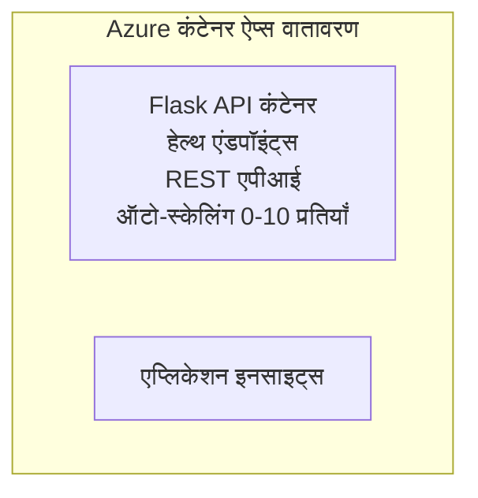

# सरल Flask API - Container App उदाहरण

**सीखने का मार्ग:** प्रारंभिक ⭐ | **समय:** 25-35 मिनट | **लागत:** $0-15/महीना

एक पूर्ण, कार्यशील Python Flask REST API जिसे Azure Developer CLI (azd) का उपयोग करके Azure Container Apps पर डिप्लॉय किया गया है। यह उदाहरण कंटेनर तैनाती, ऑटो-स्केलिंग, और मॉनिटरिंग के बुनियादी सिद्धांतों को दर्शाता है।

## 🎯 आप क्या सीखेंगे

- Azure पर कंटेनरीकृत Python एप्लिकेशन तैनात करना
- स्केल-टू-ज़ीरो के साथ ऑटो-स्केलिंग कॉन्फ़िगर करना
- हेल्थ प्रोब्स और रेडीनेस चेक्स लागू करना
- एप्लिकेशन लॉग्स और मेट्रिक्स की निगरानी करना
- तेज़ तैनाती के लिए Azure Developer CLI का उपयोग करना

## 📦 क्या शामिल है

✅ **Flask Application** - CRUD ऑपरेशंस के साथ पूर्ण REST API (`src/app.py`)  
✅ **Dockerfile** - प्रोडक्शन-तैयार कंटेनर कॉन्फ़िगरेशन  
✅ **Bicep Infrastructure** - Container Apps वातावरण और API तैनाती  
✅ **AZD Configuration** - एक-कमान वाली तैनाती सेटअप  
✅ **Health Probes** - Liveness और readiness चेक कॉन्फ़िगर किए गए  
✅ **Auto-scaling** - HTTP लोड के आधार पर 0-10 प्रतिकृतियाँ  

## Architecture


## पूर्वापेक्षाएँ

### आवश्यक
- **Azure Developer CLI (azd)** - [इंस्टॉल गाइड](https://learn.microsoft.com/azure/developer/azure-developer-cli/install-azd)
- **Azure subscription** - [मुफ्त खाता](https://azure.microsoft.com/free/)
- **Docker Desktop** - [Install Docker](https://www.docker.com/products/docker-desktop/) (स्थानीय परीक्षण के लिए)

### पूर्वापेक्षाएँ सत्यापित करें

```bash
# azd संस्करण जांचें (आवश्यक: 1.5.0 या उससे उच्चतर)
azd version

# Azure लॉगिन सत्यापित करें
azd auth login

# Docker जांचें (वैकल्पिक, स्थानीय परीक्षण के लिए)
docker --version
```

## ⏱️ तैनाती समयरेखा

| चरण | अवधि | क्या होता है |
|-------|----------|--------------||
| Environment setup | 30 seconds | Create azd environment |
| Build container | 2-3 minutes | Docker build Flask app |
| Provision infrastructure | 3-5 minutes | Create Container Apps, registry, monitoring |
| Deploy application | 2-3 minutes | Push image and deploy to Container Apps |
| **कुल** | **8-12 मिनट** | पूर्ण तैनाती तैयार |

## त्वरित शुरुआत

```bash
# उदाहरण पर जाएँ
cd examples/container-app/simple-flask-api

# पर्यावरण प्रारंभ करें (एक अद्वितीय नाम चुनें)
azd env new myflaskapi

# सब कुछ परिनियोजित करें (इन्फ्रास्ट्रक्चर + एप्लिकेशन)
azd up
# आपसे पूछा जाएगा:
# 1. Azure सदस्यता चुनें
# 2. स्थान चुनें (उदा., eastus2)
# 3. परिनियोजन के लिए 8-12 मिनट प्रतीक्षा करें

# अपना API एंडपॉइंट प्राप्त करें
azd env get-values

# API का परीक्षण करें
curl $(azd env get-value API_ENDPOINT)/health
```

**अपेक्षित आउटपुट:**
```json
{
  "status": "healthy",
  "timestamp": "2025-11-19T10:30:00Z",
  "service": "simple-flask-api",
  "version": "1.0.0"
}
```

## ✅ तैनाती सत्यापित करें

### चरण 1: तैनाती की स्थिति जाँचें

```bash
# डिप्लॉय की गई सेवाओं को देखें
azd show

# अपेक्षित आउटपुट दिखाता है:
# - सेवा: api
# - एंडपॉइंट: https://ca-api-[env].xxx.azurecontainerapps.io
# - स्थिति: चालू
```

### चरण 2: API एंडपॉइंट्स का परीक्षण करें

```bash
# API एंडपॉइंट प्राप्त करें
API_URL=$(azd env get-value API_ENDPOINT)

# स्वास्थ्य की जाँच करें
curl $API_URL/health

# रूट एंडपॉइंट की जाँच करें
curl $API_URL/

# एक आइटम बनाएं
curl -X POST $API_URL/api/items \
  -H "Content-Type: application/json" \
  -d '{"name": "Test Item", "description": "My first item"}'

# सभी आइटम प्राप्त करें
curl $API_URL/api/items
```

**सफलता मानदंड:**
- ✅ हेल्थ एंडपॉइंट HTTP 200 लौटाता है
- ✅ रूट एंडपॉइंट API जानकारी दिखाता है
- ✅ POST आइटम बनाता है और HTTP 201 लौटाता है
- ✅ GET बनाए गए आइटम लौटाता है

### चरण 3: लॉग देखें

```bash
# azd monitor का उपयोग करके लाइव लॉग स्ट्रीम करें
azd monitor --logs

# या Azure CLI का उपयोग करें:
az containerapp logs show --name api --resource-group $RG_NAME --follow

# आपको दिखाई देना चाहिए:
# - Gunicorn स्टार्टअप संदेश
# - HTTP अनुरोध लॉग
# - एप्लिकेशन जानकारी लॉग
```

## प्रोजेक्ट संरचना

```
simple-flask-api/
├── azure.yaml              # AZD configuration
├── infra/
│   ├── main.bicep         # Main infrastructure
│   ├── main.parameters.json
│   └── app/
│       ├── container-env.bicep
│       └── api.bicep
└── src/
    ├── app.py             # Flask application
    ├── requirements.txt
    └── Dockerfile
```

## API एंडपॉइंट्स

| एंडपॉइंट | मेथड | विवरण |
|----------|--------|-------------|
| `/health` | GET | हेल्थ चेक |
| `/api/items` | GET | सभी आइटम सूचीबद्ध करें |
| `/api/items` | POST | नया आइटम बनाएं |
| `/api/items/{id}` | GET | किसी विशेष आइटम को प्राप्त करें |
| `/api/items/{id}` | PUT | आइटम अपडेट करें |
| `/api/items/{id}` | DELETE | आइटम हटाएं |

## कॉन्फ़िगरेशन

### पर्‍यावरण वेरिएबल्स

```bash
# कस्टम कॉन्फ़िगरेशन सेट करें
azd env set PORT 8000
azd env set LOG_LEVEL info
azd env set MAX_REPLICAS 20
```

### स्केलिंग कॉन्फ़िगरेशन

API HTTP ट्रैफ़िक के आधार पर स्वचालित रूप से स्केल होती है:
- **न्यूनतम प्रतिकृतियाँ**: 0 (idle होने पर शून्य तक स्केल करता है)
- **अधिकतम प्रतिकृतियाँ**: 10
- **प्रति प्रतिकृति समवर्ती अनुरोध**: 50

## विकास

### स्थानीय रूप से चलाएँ

```bash
# निर्भरता स्थापित करें
cd src
pip install -r requirements.txt

# ऐप चलाएँ
python app.py

# स्थानीय रूप से परीक्षण करें
curl http://localhost:8000/health
```

### कंटेनर बनाएं और परीक्षण करें

```bash
# Docker इमेज बनाएं
docker build -t flask-api:local ./src

# स्थानीय रूप से कंटेनर चलाएं
docker run -p 8000:8000 flask-api:local

# कंटेनर का परीक्षण करें
curl http://localhost:8000/health
```

## तैनाती

### पूर्ण तैनाती

```bash
# इन्फ्रास्ट्रक्चर और एप्लिकेशन तैनात करें
azd up
```

### केवल कोड तैनाती

```bash
# केवल एप्लिकेशन कोड तैनात करें (इन्फ्रास्ट्रक्चर अपरिवर्तित)
azd deploy api
```

### कॉन्फ़िगरेशन अपडेट करें

```bash
# पर्यावरण चर अद्यतन करें
azd env set API_KEY "new-api-key"

# नए विन्यास के साथ पुनः तैनात करें
azd deploy api
```

## मॉनिटरिंग

### लॉग देखें

```bash
# azd monitor का उपयोग करके लाइव लॉग स्ट्रीम करें
azd monitor --logs

# या Container Apps के लिए Azure CLI का उपयोग करें:
az containerapp logs show --name api --resource-group $RG_NAME --follow

# आखिरी 100 लाइनें देखें
az containerapp logs show --name api --resource-group $RG_NAME --tail 100
```

### मेट्रिक्स मॉनिटर करें

```bash
# Azure Monitor डैशबोर्ड खोलें
azd monitor --overview

# विशिष्ट मेट्रिक्स देखें
az monitor metrics list \
  --resource $(azd show --output json | jq -r '.services.api.resourceId') \
  --metric "Requests,ResponseTime"
```

## परीक्षण

### हेल्थ चेक

```bash
curl $(azd show --output json | jq -r '.services.api.endpoint')/health
```

अपेक्षित प्रतिक्रिया:
```json
{
  "status": "healthy",
  "timestamp": "2025-11-19T10:30:00Z"
}
```

### आइटम बनाएं

```bash
curl -X POST $(azd show --output json | jq -r '.services.api.endpoint')/api/items \
  -H "Content-Type: application/json" \
  -d '{"name": "Test Item", "description": "A test item"}'
```

### सभी आइटम प्राप्त करें

```bash
curl $(azd show --output json | jq -r '.services.api.endpoint')/api/items
```

## लागत अनुकूलन

यह तैनाती स्केल-टू-ज़ीरो का उपयोग करती है, इसलिए आप केवल तभी भुगतान करते हैं जब API अनुरोधों को प्रोसेस कर रही हो:

- **Idle लागत**: ~$0/महीना (शून्य पर स्केल)
- **Active लागत**: ~$0.000024/second प्रति प्रतिकृति
- **अपेक्षित मासिक लागत** (हल्का उपयोग): $5-15

### लागत और कम करें

```bash
# डेव के लिए अधिकतम रेप्लिकाएँ घटाएँ
azd env set MAX_REPLICAS 3

# छोटी निष्क्रिय समय-सीमा का उपयोग करें
azd env set SCALE_TO_ZERO_TIMEOUT 300  # 5 मिनट
```

## समस्या निवारण

### कंटेनर शुरू नहीं हो रहा

```bash
# Azure CLI का उपयोग करके कंटेनर लॉग्स की जाँच करें
az containerapp logs show --name api --resource-group $RG_NAME --tail 100

# स्थानीय रूप से Docker इमेज के बिल्ड होने की पुष्टि करें
docker build -t test ./src
```

### API सुलभ नहीं है

```bash
# पुष्टि करें कि इनग्रेस बाहरी है
az containerapp show --name api --resource-group rg-simple-flask-api \
  --query properties.configuration.ingress.external
```

### उच्च प्रतिक्रिया समय

```bash
# CPU/मेमोरी उपयोग की जाँच करें
az monitor metrics list \
  --resource $(azd show --output json | jq -r '.services.api.resourceId') \
  --metric "CPUPercentage,MemoryPercentage"

# आवश्यक होने पर संसाधनों को बढ़ाएँ
az containerapp update --name api --resource-group rg-simple-flask-api \
  --cpu 1.0 --memory 2Gi
```

## साफ़ करें

```bash
# सभी संसाधनों को हटाएँ
azd down --force --purge
```

## अगले कदम

### इस उदाहरण को विस्तारित करें

1. **डेटाबेस जोड़ें** - Azure Cosmos DB या SQL Database एकीकृत करें
   ```bash
   # Cosmos DB मॉड्यूल को infra/main.bicep में जोड़ें
   # app.py को डेटाबेस कनेक्शन के साथ अपडेट करें
   ```

2. **प्रमाणीकरण जोड़ें** - Azure AD या API keys लागू करें
   ```python
   # app.py में प्रमाणीकरण मिडलवेयर जोड़ें
   from functools import wraps
   ```

3. **CI/CD सेटअप करें** - GitHub Actions वर्कफ़्लो
   ```yaml
   # Create .github/workflows/deploy.yml
   name: Deploy to Azure
   on: [push]
   ```

4. **मैनेज्ड आइडेंटिटी जोड़ें** - Azure सेवाओं तक सुरक्षित पहुँच
   ```bicep
   # Update infra/app/api.bicep
   identity: { type: 'SystemAssigned' }
   ```

### संबंधित उदाहरण

- **[डेटाबेस ऐप](../../../../../examples/database-app)** - SQL Database के साथ पूर्ण उदाहरण
- **[माइक्रोसर्विसेस](../../../../../examples/container-app/microservices)** - मल्टी-सर्विस आर्किटेक्चर
- **[Container Apps मास्टर गाइड](../README.md)** - सभी कंटेनर पैटर्न

### सीखने के संसाधन

- 📚 [AZD For Beginners Course](../../../README.md) - मुख्य कोर्स होम
- 📚 [Container Apps Patterns](../README.md) - और अधिक तैनाती पैटर्न
- 📚 [AZD Templates Gallery](https://azure.github.io/awesome-azd/) - समुदाय टेम्पलेट्स

## अतिरिक्त संसाधन

### दस्तावेज़
- **[Flask Documentation](https://flask.palletsprojects.com/)** - Flask फ्रेमवर्क गाइड
- **[Azure Container Apps](https://learn.microsoft.com/azure/container-apps/)** - आधिकारिक Azure डॉक्स
- **[Azure Developer CLI](https://learn.microsoft.com/azure/developer/azure-developer-cli/)** - azd कमांड संदर्भ

### ट्यूटोरियल्स
- **[Container Apps Quickstart](https://learn.microsoft.com/azure/container-apps/quickstart-portal)** - अपना पहला ऐप तैनात करें
- **[Python on Azure](https://learn.microsoft.com/azure/developer/python/)** - Python विकास मार्गदर्शिका
- **[Bicep Language](https://learn.microsoft.com/azure/azure-resource-manager/bicep/)** - इन्फ्रास्ट्रक्चर ऐज़ कोड

### उपकरण
- **[Azure Portal](https://portal.azure.com)** - संसाधनों का दृश्य प्रबंधन
- **[VS Code Azure Extension](https://marketplace.visualstudio.com/items?itemName=ms-azuretools.vscode-azurecontainerapps)** - IDE इंटीग्रेशन

---

**🎉 बधाई हो!** आपने ऑटो-स्केलिंग और मॉनिटरिंग के साथ Azure Container Apps पर एक प्रोडक्शन-तैयार Flask API तैनात कर लिया है।

**प्रश्न?** [Open an issue](https://github.com/microsoft/AZD-for-beginners/issues) या [FAQ](../../../resources/faq.md) देखें

---

<!-- CO-OP TRANSLATOR DISCLAIMER START -->
**अस्वीकरण**:
यह दस्तावेज़ AI अनुवाद सेवा [Co-op Translator](https://github.com/Azure/co-op-translator) का उपयोग करके अनुवादित किया गया है। जबकि हम सटीकता के लिए प्रयास करते हैं, कृपया ध्यान दें कि स्वचालित अनुवादों में त्रुटियाँ या असत्यताएँ हो सकती हैं। मूल दस्तावेज़ को इसकी मूल भाषा में प्रामाणिक स्रोत माना जाना चाहिए। महत्वपूर्ण जानकारी के लिए पेशेवर मानव अनुवाद की सलाह दी जाती है। इस अनुवाद के उपयोग से उत्पन्न होने वाली किसी भी गलतफहमी या गलत व्याख्या के लिए हम उत्तरदायी नहीं हैं।
<!-- CO-OP TRANSLATOR DISCLAIMER END -->