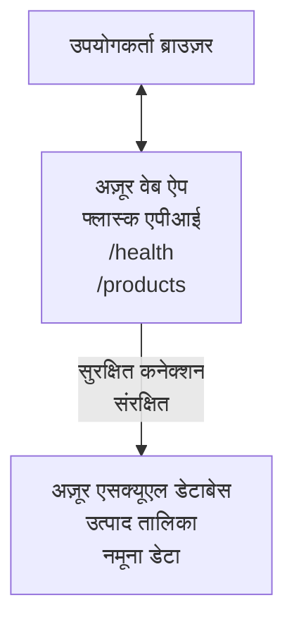

# AZD के साथ Microsoft SQL डेटाबेस और वेब ऐप को डिप्लॉय करना

⏱️ **अनुमानित समय**: 20-30 मिनट | 💰 **अनुमानित लागत**: ~$15-25/महीना | ⭐ **जटिलता**: मध्यम

यह **पूर्ण, कार्यरत उदाहरण** दिखाता है कि [Azure Developer CLI (azd)](https://learn.microsoft.com/azure/developer/azure-developer-cli/) का उपयोग करके Microsoft SQL डेटाबेस के साथ एक Python Flask वेब एप्लिकेशन को Azure पर कैसे डिप्लॉय किया जाए। सभी कोड शामिल हैं और परीक्षण किए गए हैं—कोई बाहरी निर्भरता आवश्यक नहीं है।

## आप क्या सीखेंगे

इस उदाहरण को पूरा करके, आप:
- इन्फ्रास्ट्रक्चर-एज़-कोड का उपयोग करके एक मल्टी-टियर एप्लिकेशन (वेब ऐप + डेटाबेस) डिप्लॉय करेंगे
- बिना हार्डकोड किए सुरक्षित डेटाबेस कनेक्शन कॉन्फ़िगर करेंगे
- Application Insights के साथ एप्लिकेशन की सेहत की निगरानी करेंगे
- AZD CLI के साथ Azure संसाधनों का कुशलतापूर्वक प्रबंधन करेंगे
- सुरक्षा, लागत अनुकूलन, और निरीक्षण के लिए Azure सर्वोत्तम प्रथाओं का पालन करेंगे

## परिदृश्य का अवलोकन
- **वेब ऐप**: डेटाबेस कनेक्टिविटी के साथ Python Flask REST API
- **डेटाबेस**: सैंपल डेटा के साथ Azure SQL डेटाबेस
- **इन्फ्रास्ट्रक्चर**: Bicep (मॉड्यूलर, पुन: उपयोग योग्य टेम्पलेट) का उपयोग करके तैयार किया गया
- **डिप्लॉयमेंट**: `azd` कमांड के साथ पूरी तरह स्वचालित
- **निगरानी**: लॉग और टेलीमेट्री के लिए Application Insights

## आवश्यकताएं

### आवश्यक उपकरण

शुरू करने से पहले, सुनिश्चित करें कि आपके पास ये उपकरण इंस्टॉल हैं:

1. **[Azure CLI](https://learn.microsoft.com/cli/azure/install-azure-cli)** (संस्करण 2.50.0 या ऊपर)
   ```sh
   az --version
   # अपेक्षित आउटपुट: azure-cli 2.50.0 या उससे ऊपर
   ```

2. **[Azure Developer CLI (azd)](https://learn.microsoft.com/azure/developer/azure-developer-cli/install-azd)** (संस्करण 1.0.0 या ऊपर)
   ```sh
   azd version
   # अपेक्षित आउटपुट: azd संस्करण 1.0.0 या उससे उच्चतर
   ```

3. **[Python 3.8+](https://www.python.org/downloads/)** (स्थानीय विकास के लिए)
   ```sh
   python --version
   # अपेक्षित आउटपुट: पाइथन 3.8 या उससे ऊपर
   ```

4. **[Docker](https://www.docker.com/get-started)** (वैकल्पिक, स्थानीय कंटेनर विकास के लिए)
   ```sh
   docker --version
   # अपेक्षित आउटपुट: Docker संस्करण 20.10 या उससे उच्चतर
   ```

### Azure आवश्यकताएँ

- एक सक्रिय **Azure सदस्यता** ([मुफ्त खाता बनाएं](https://azure.microsoft.com/free/))
- सदस्यता में संसाधन बनाने के अनुमतियाँ
- सदस्यता या संसाधन समूह पर **मालिक** या **योगदानकर्ता** भूमिका

### ज्ञान आवश्यकताएँ

यह एक **मध्यम-स्तरीय** उदाहरण है। आपको निम्न में परिचित होना चाहिए:
- मूल कमांड-लाइन ऑपरेशन
- मौलिक क्लाउड अवधारणाएं (संसाधन, संसाधन समूह)
- वेब एप्लिकेशन और डेटाबेस की मूल समझ

**AZD में नए हैं?** पहले [Getting Started गाइड](../../docs/chapter-01-foundation/azd-basics.md) से शुरू करें।

## वास्तुकला

यह उदाहरण एक दो-टियर वास्तुकला डिप्लॉय करता है जिसमें एक वेब एप्लिकेशन और SQL डेटाबेस है:


**संसाधन डिप्लॉयमेंट:**
- **संसाधन समूह**: सभी संसाधनों के लिए कंटेनर
- **ऐप सेवा योजना**: लिनक्स-आधारित होस्टिंग (लागत प्रभावशीलता के लिए B1 टियर)
- **वेब ऐप**: Python 3.11 रनटाइम के साथ Flask एप्लिकेशन
- **SQL सर्वर**: TLS 1.2 न्यूनतम के साथ प्रबंधित डेटाबेस सर्वर
- **SQL डेटाबेस**: बेसिक टियर (2GB, विकास/परीक्षण के लिए उपयुक्त)
- **Application Insights**: निगरानी और लॉगिंग
- **Log Analytics कार्यक्षेत्र**: केंद्रीकृत लॉग संग्रहण

**रूपक**: इसे एक रेस्तरां (वेब ऐप) समझें जिसमें एक वॉक-इन फ्रीज़र (डेटाबेस) है। ग्राहक मेनू से ऑर्डर करते हैं (API एंडपॉइंट), और किचन (Flask ऐप) फ्रीज़र से सामग्रियां (डेटा) लाता है। रेस्तरां प्रबंधक (Application Insights) हर घटना का ट्रैक रखता है।

## फ़ोल्डर संरचना

इस उदाहरण में सभी फाइलें शामिल हैं—कोई बाहरी निर्भरता आवश्यक नहीं है:

```
examples/database-app/
│
├── README.md                    # This file
├── azure.yaml                   # AZD configuration file
├── .env.sample                  # Sample environment variables
├── .gitignore                   # Git ignore patterns
│
├── infra/                       # Infrastructure as Code (Bicep)
│   ├── main.bicep              # Main orchestration template
│   ├── abbreviations.json      # Azure naming conventions
│   └── resources/              # Modular resource templates
│       ├── sql-server.bicep    # SQL Server configuration
│       ├── sql-database.bicep  # Database configuration
│       ├── app-service-plan.bicep  # Hosting plan
│       ├── app-insights.bicep  # Monitoring setup
│       └── web-app.bicep       # Web application
│
└── src/
    └── web/                    # Application source code
        ├── app.py              # Flask REST API
        ├── requirements.txt    # Python dependencies
        └── Dockerfile          # Container definition
```

**प्रत्येक फ़ाइल क्या करती है:**
- **azure.yaml**: AZD को बताता है कि क्या और कहाँ डिप्लॉय करना है
- **infra/main.bicep**: सभी Azure संसाधनों का संयोजन करता है
- **infra/resources/*.bicep**: व्यक्तिगत संसाधन परिभाषाएँ (पुन: उपयोग के लिए मॉड्यूलर)
- **src/web/app.py**: डेटाबेस लॉजिक के साथ Flask एप्लिकेशन
- **requirements.txt**: Python पैकेज निर्भरताएं
- **Dockerfile**: डिप्लॉयमेंट के लिए कंटेनरीकरण निर्देश

## त्वरित प्रारंभ (चरण-दर-चरण)

### चरण 1: क्लोन और नेविगेट करें

```sh
git clone https://github.com/microsoft/AZD-for-beginners.git
cd AZD-for-beginners/examples/database-app
```

**✓ सफलता जांचें**: सुनिश्चित करें कि आप `azure.yaml` और `infra/` फ़ोल्डर देखते हैं:
```sh
ls
# अपेक्षित: README.md, azure.yaml, infra/, src/
```

### चरण 2: Azure के साथ प्रमाणीकरण करें

```sh
azd auth login
```

यह आपके ब्राउज़र को Azure प्रमाणीकरण के लिए खोलता है। अपने Azure क्रेडेंशियल्स से साइन इन करें।

**✓ सफलता जांचें**: आपको यह देखना चाहिए:
```
Logged in to Azure.
```

### चरण 3: पर्यावरण प्रारंभ करें

```sh
azd init
```

**क्या होता है**: AZD आपकी डिप्लॉयमेंट के लिए स्थानीय कॉन्फ़िगरेशन बनाता है।

**आपसे निम्न पूछे जाएंगे**:
- **पर्यावरण का नाम**: एक छोटा नाम दर्ज करें (जैसे, `dev`, `myapp`)
- **Azure सदस्यता**: सूची से अपनी सदस्यता चुनें
- **Azure स्थान**: एक क्षेत्र चुनें (जैसे, `eastus`, `westeurope`)

**✓ सफलता जांचें**: आपको यह देखना चाहिए:
```
SUCCESS: New project initialized!
```

### चरण 4: Azure संसाधन तैयार करें

```sh
azd provision
```

**क्या होता है**: AZD सभी इन्फ्रास्ट्रक्चर को डिप्लॉय करता है (5-8 मिनट लगते हैं):
1. संसाधन समूह बनाता है
2. SQL सर्वर और डेटाबेस बनाता है
3. ऐप सेवा योजना बनाता है
4. वेब ऐप बनाता है
5. Application Insights बनाता है
6. नेटवर्किंग और सुरक्षा कॉन्फ़िगर करता है

**आपसे पूछा जाएगा**:
- **SQL एडमिन यूजरनाम**: एक यूजरनाम दर्ज करें (जैसे, `sqladmin`)
- **SQL एडमिन पासवर्ड**: एक मजबूत पासवर्ड दर्ज करें (इसे सुरक्षित रखें!)

**✓ सफलता जांचें**: आपको यह देखना चाहिए:
```
SUCCESS: Your application was provisioned in Azure in X minutes Y seconds.
You can view the resources created under the resource group rg-<env-name> in Azure Portal:
https://portal.azure.com/#@/resource/subscriptions/.../resourceGroups/rg-<env-name>
```

**⏱️ समय**: 5-8 मिनट

### चरण 5: एप्लिकेशन डिप्लॉय करें

```sh
azd deploy
```

**क्या होता है**: AZD आपका Flask एप्लिकेशन build और डिप्लॉय करता है:
1. Python एप्लिकेशन पैकेज करता है
2. Docker कंटेनर बनाता है
3. Azure वेब ऐप पर पुश करता है
4. डेटाबेस में सैंपल डेटा इनिशियलाइज़ करता है
5. एप्लिकेशन शुरू करता है

**✓ सफलता जांचें**: आपको यह देखना चाहिए:
```
SUCCESS: Your application was deployed to Azure in X minutes Y seconds.
You can view the resources created under the resource group rg-<env-name> in Azure Portal:
https://portal.azure.com/#@/resource/subscriptions/.../resourceGroups/rg-<env-name>
```

**⏱️ समय**: 3-5 मिनट

### चरण 6: एप्लिकेशन ब्राउज़ करें

```sh
azd browse
```

यह आपके डिप्लॉय किए गए वेब ऐप को ब्राउज़र में खोलता है: `https://app-<unique-id>.azurewebsites.net`

**✓ सफलता जांचें**: आपको JSON आउटपुट देखना चाहिए:
```json
{
  "message": "Welcome to the Database App API",
  "endpoints": {
    "/": "This help message",
    "/health": "Health check endpoint",
    "/products": "List all products",
    "/products/<id>": "Get product by ID"
  }
}
```

### चरण 7: API एंडपॉइंट्स का परीक्षण करें

**हेल्थ चेक** (डेटाबेस कनेक्शन सत्यापित करें):
```sh
curl https://app-<your-id>.azurewebsites.net/health
```

**अपेक्षित प्रतिक्रिया**:
```json
{
  "status": "healthy",
  "database": "connected"
}
```

**प्रोडक्ट्स की सूची** (सैंपल डेटा):
```sh
curl https://app-<your-id>.azurewebsites.net/products
```

**अपेक्षित प्रतिक्रिया**:
```json
[
  {
    "id": 1,
    "name": "Laptop",
    "description": "High-performance laptop",
    "price": 1299.99,
    "created_at": "2025-11-19T10:30:00"
  },
  ...
]
```

**एकल प्रोडक्ट प्राप्त करें**:
```sh
curl https://app-<your-id>.azurewebsites.net/products/1
```

**✓ सफलता जांचें**: सभी एंडपॉइंट बिना त्रुटि के JSON डेटा लौटाते हैं।

---

**🎉 बधाई हो!** आपने AZD का उपयोग करके Azure पर एक वेब एप्लिकेशन और डेटाबेस सफलतापूर्वक डिप्लॉय किया है।

## कॉन्फ़िगरेशन गहन-दृष्टि

### पर्यावरण चर

सिकरेट्स Azure App Service कॉन्फ़िगरेशन के जरिए सुरक्षित रूप से प्रबंधित होते हैं—**कभी भी सोर्स कोड में हार्डकोड नहीं किए जाते**।

**स्वचालित रूप से AZD द्वारा कॉन्फ़िगर किए गए**:
- `SQL_CONNECTION_STRING`: एन्क्रिप्टेड प्रमाणपत्रों के साथ डेटाबेस कनेक्शन
- `APPLICATIONINSIGHTS_CONNECTION_STRING`: निगरानी टेलीमेट्री एंडपॉइंट
- `SCM_DO_BUILD_DURING_DEPLOYMENT`: स्वचालित निर्भरता स्थापना सक्षम करता है

**सिकरेट्स कहाँ संग्रहित होते हैं**:
1. `azd provision` के दौरान, आप सुरक्षित प्रॉम्प्ट के माध्यम से SQL क्रेडेंशियल्स प्रदान करते हैं
2. AZD इन्हें आपकी स्थानीय `.azure/<env-name>/.env` फ़ाइल में संग्रहीत करता है (git-ignored)
3. AZD इन्हें Azure App Service कॉन्फ़िगरेशन में इंजेक्ट करता है (एन्क्रिप्टेड अवस्था में)
4. एप्लिकेशन रनटाइम में `os.getenv()` के जरिए इन्हें पढ़ता है

### स्थानीय विकास

स्थानीय परीक्षण के लिए, सैंपल से `.env` फ़ाइल बनाएं:

```sh
cp .env.sample .env
# अपनी स्थानीय डेटाबेस कनेक्शन के साथ .env संपादित करें
```

**स्थानीय विकास वर्कफ़्लो**:
```sh
# निर्भरताएँ स्थापित करें
cd src/web
pip install -r requirements.txt

# पर्यावरण चर सेट करें
export SQL_CONNECTION_STRING="your-local-connection-string"

# आवेदन चलाएँ
python app.py
```

**स्थानीय परीक्षण करें**:
```sh
curl http://localhost:8000/health
# अपेक्षित: {"status": "स्वस्थ", "database": "संपर्कित"}
```

### इन्फ्रास्ट्रक्चर ऐज़ कोड

सभी Azure संसाधन **Bicep टेम्पलेट्स** (`infra/` फ़ोल्डर) में परिभाषित हैं:

- **मॉड्यूलर डिज़ाइन**: प्रत्येक संसाधन प्रकार की अपनी फाइल है पुन: उपयोग के लिए
- **पैरामीटराइज्ड**: SKU, क्षेत्र, नामकरण अनुकरण कस्टमाइज़ करें
- **सर्वोत्तम प्रथाएं**: Azure नामकरण मानकों और सुरक्षा डिफ़ॉल्ट का पालन
- **संस्करण नियंत्रित**: इन्फ्रास्ट्रक्चर परिवर्तन Git में ट्रैक किए जाते हैं

**कस्टमाइज़ेशन उदाहरण**:
डेटाबेस टियर बदलने के लिए, `infra/resources/sql-database.bicep` संपादित करें:
```bicep
sku: {
  name: 'Standard'  // Changed from 'Basic'
  tier: 'Standard'
  capacity: 10
}
```

## सुरक्षा सर्वोत्तम प्रथाएं

यह उदाहरण Azure सुरक्षा सर्वोत्तम प्रथाओं का पालन करता है:

### 1. **सोर्स कोड में कोई सीक्रेट्स नहीं**
- ✅ क्रेडेंशियल्स Azure App Service कॉन्फ़िगरेशन में संग्रहीत (संरक्षित)
- ✅ `.env` फाइलें Git में शामिल नहीं (gitignore)
- ✅ सुरक्षा वाले पैरामीटर के जरिए प्रोविजनिंग में सीक्रेट्स पास होते हैं

### 2. **एन्क्रिप्टेड कनेक्शन**
- ✅ SQL सर्वर के लिए TLS 1.2 न्यूनतम
- ✅ वेब ऐप के लिए केवल HTTPS अनिवार्य
- ✅ डेटाबेस कनेक्शन एन्क्रिप्टेड चैनल का उपयोग करते हैं

### 3. **नेटवर्क सुरक्षा**
- ✅ SQL सर्वर फ़ायरवॉल Azure सेवाओं को केवल अनुमति देता है
- ✅ सार्वजनिक नेटवर्क एक्सेस प्रतिबंधित (प्राइवेट एंडपॉइंट के साथ और लॉक किया जा सकता है)
- ✅ वेब ऐप पर FTPS अक्षम

### 4. **प्रमाणीकरण और प्राधिकरण**
- ⚠️ **वर्तमान**: SQL प्रमाणीकरण (यूजरनाम/पासवर्ड)
- ✅ **प्रोडक्शन अनुशंसा**: पासवर्डलेस प्रमाणीकरण के लिए Azure Managed Identity का उपयोग करें

**प्रोडक्शन के लिए Managed Identity पर अपग्रेड करने के लिए**:
1. वेब ऐप पर Managed Identity सक्षम करें
2. SQL अनुमतियां पहचान को दें
3. कनेक्शन स्ट्रिंग को Managed Identity के लिए अपडेट करें
4. पासवर्ड-आधारित प्रमाणीकरण हटाएं

### 5. **ऑडिटिंग और अनुपालन**
- ✅ Application Insights सभी अनुरोध और त्रुटि लॉग करता है
- ✅ SQL डेटाबेस ऑडिटिंग सक्षम (अनुपालन के लिए कॉन्फ़िगर किया जा सकता है)
- ✅ सभी संसाधनों पर गवर्नेंस टैग्स लगाए गए हैं

**प्रोडक्शन से पहले सुरक्षा चेकलिस्ट**:
- [ ] SQL के लिए Azure Defender सक्षम करें
- [ ] SQL डेटाबेस के लिए प्राइवेट एंडपॉइंट्स कॉन्फ़िगर करें
- [ ] वेब एप्लिकेशन फ़ायरवॉल (WAF) लागू करें
- [ ] सिकरेट रोटेशन के लिए Azure Key Vault लागू करें
- [ ] Azure AD प्रमाणीकरण कॉन्फ़िगर करें
- [ ] सभी संसाधनों के लिए डायग्नोस्टिक लॉगिंग सक्षम करें

## लागत अनुकूलन

**अनुमानित मासिक लागतें** (नवंबर 2025 तक):

| संसाधन | SKU/टियर | अनुमानित लागत |
|----------|----------|----------------|
| ऐप सेवा योजना | B1 (बेसिक) | ~$13/महीना |
| SQL डेटाबेस | बेसिक (2GB) | ~$5/महीना |
| Application Insights | उपयोग आधार पर भुगतान | ~$2/महीना (कम ट्रैफ़िक) |
| **कुल** | | **~$20/महीना** |

**💡 लागत बचाने के सुझाव**:

1. **सीखने के लिए मुफ्त टियर का उपयोग करें**:
   - ऐप सेवा: F1 टियर (मुफ्त, सीमित घंटे)
   - SQL डेटाबेस: Azure SQL Database serverless का उपयोग करें
   - Application Insights: 5GB/महीना मुफ्त इनगेश्न

2. **जब उपयोग में न हो तो संसाधन रोकें**:
   ```sh
   # वेब ऐप को बंद करें (डेटाबेस अभी भी शुल्क लगेगा)
   az webapp stop --name <app-name> --resource-group <rg-name>
   
   # जब आवश्यक हो पुनः प्रारंभ करें
   az webapp start --name <app-name> --resource-group <rg-name>
   ```

3. **परीक्षण के बाद सब कुछ हटाएं**:
   ```sh
   azd down
   ```
   इससे सभी संसाधन हट जाएंगे और शुल्क रुक जाएंगे।

4. **विकास बनाम प्रोडक्शन SKU**:
   - **विकास**: बेसिक टियर (इस उदाहरण में उपयोग किया गया)
   - **प्रोडक्शन**: स्टैंडर्ड/प्रीमियम टियर के साथ Redundancy

**लागत निगरानी**:
- लागत देखें [Azure Cost Management](https://portal.azure.com/#view/Microsoft_Azure_CostManagement)
- अप्रत्याशित व्यय से बचने के लिए लागत अलर्ट सेट करें
- ट्रैकिंग के लिए सभी संसाधनों पर `azd-env-name` टैग लगाएं

**मुफ्त टियर विकल्प**:
सीखने के उद्देश्य से, आप `infra/resources/app-service-plan.bicep` संशोधित कर सकते हैं:
```bicep
sku: {
  name: 'F1'  // Free tier
  tier: 'Free'
}
```
**ध्यान दें**: मुफ्त टियर में सीमाएं हैं (60 मिनट/दिन CPU, हमेशा-ऑन नहीं)।

## निगरानी और निरीक्षण

### Application Insights एकीकरण

यह उदाहरण **Application Insights** को शामिल करता है व्यापक निगरानी के लिए:

**क्या मॉनिटर किया जाता है**:
- ✅ HTTP अनुरोध (विलंब, स्थिति कोड, एंडपॉइंट)
- ✅ एप्लिकेशन त्रुटियां और अपवाद
- ✅ Flask ऐप से कस्टम लॉगिंग
- ✅ डेटाबेस कनेक्शन की स्थिति
- ✅ प्रदर्शन मीट्रिक्स (CPU, मेमोरी)

**Application Insights एक्सेस करें**:
1. [Azure पोर्टल](https://portal.azure.com) खोलें
2. अपने संसाधन समूह (`rg-<env-name>`) पर नेविगेट करें
3. Application Insights संसाधन (`appi-<unique-id>`) क्लिक करें

**उपयोगी क्वेरीज़** (Application Insights → लॉग):

**सभी अनुरोध देखें**:
```kusto
requests
| where timestamp > ago(1h)
| order by timestamp desc
| project timestamp, name, url, resultCode, duration
```

**त्रुटि खोजें**:
```kusto
exceptions
| where timestamp > ago(24h)
| order by timestamp desc
| project timestamp, type, outerMessage, operation_Name
```

**हेल्थ एंडपॉइंट जांचें**:
```kusto
requests
| where name contains "health"
| summarize count() by resultCode, bin(timestamp, 1h)
```

### SQL डेटाबेस ऑडिटिंग

**SQL डेटाबेस ऑडिटिंग सक्षम है** ताकि ट्रैक किया जा सके:
- डेटाबेस एक्सेस पैटर्न
- असफल लॉगिन प्रयास
- स्कीमा परिवर्तन
- डेटा एक्सेस (अनुपालन के लिए)

**ऑडिट लॉग एक्सेस करें**:
1. Azure पोर्टल → SQL डेटाबेस → ऑडिटिंग
2. लॉग एनालिटिक्स कार्यक्षेत्र में लॉग देखें

### रियल-टाइम निगरानी

**लाइव मीट्रिक्स देखें**:
1. Application Insights → लाइव मीट्रिक्स
2. रीयल-टाइम में अनुरोध, विफलताएं, और प्रदर्शन देखें

**अलर्ट सेट करें**:
महत्वपूर्ण घटनाओं हेतु अलर्ट बनाएं:
- HTTP 500 त्रुटियां > 5 बार 5 मिनट में
- डेटाबेस कनेक्शन विफलताएं
- उच्च प्रतिक्रिया समय (>2 सेकंड)

**अलर्ट बनाने का उदाहरण**:
```sh
az monitor metrics alert create \
  --name "High-Response-Time" \
  --resource-group <rg-name> \
  --scopes <app-insights-resource-id> \
  --condition "avg requests/duration > 2000" \
  --description "Alert when response time exceeds 2 seconds"
```

## समस्या निवारण
### सामान्य समस्याएं और समाधान

#### 1. `azd provision` "Location not available" के साथ विफल होता है

**लक्षण**:
```
Error: The subscription is not registered for the resource type 'components' in the location 'centralus'.
```

**समाधान**:
कोई अन्य Azure क्षेत्र चुनें या संसाधन प्रदाता को पंजीकृत करें:
```sh
az provider register --namespace Microsoft.Insights
```

#### 2. तैनाती के दौरान SQL कनेक्शन विफल होता है

**लक्षण**:
```
pyodbc.OperationalError: ('08001', '[08001] [Microsoft][ODBC Driver 18 for SQL Server]TCP Provider...')
```

**समाधान**:
- सुनिश्चित करें कि SQL Server फ़ायरवॉल Azure सेवाओं की अनुमति देता है (स्वचालित रूप से कॉन्फ़िगर किया गया)
- जांचें कि `azd provision` के दौरान SQL व्यवस्थापक पासवर्ड सही तरीके से दर्ज किया गया था
- सुनिश्चित करें कि SQL Server पूरी तरह से प्रोविजन किया गया है (2-3 मिनट लग सकते हैं)

**कनेक्शन सत्यापित करें**:
```sh
# Azure पोर्टल से, SQL डेटाबेस → क्वेरी संपादक पर जाएँ
# अपने क्रेडेंशियल्स के साथ कनेक्ट करने का प्रयास करें
```

#### 3. वेब ऐप "Application Error" दिखाता है

**लक्षण**:
ब्राउज़र सामान्य त्रुटि पृष्ठ दिखाता है।

**समाधान**:
एप्लिकेशन लॉग जांचें:
```sh
# हाल के लॉग देखें
az webapp log tail --name <app-name> --resource-group <rg-name>
```

**सामान्य कारण**:
- पर्यावरण चर गायब हैं (App Service → Configuration देखें)
- Python पैकेज इंस्टॉलेशन विफल हुआ (तैनाती लॉग देखें)
- डेटाबेस प्रारंभिककरण त्रुटि (SQL कनेक्टिविटी जांचें)

#### 4. `azd deploy` "Build Error" के साथ विफल होता है

**लक्षण**:
```
Error: Failed to build project
```

**समाधान**:
- सुनिश्चित करें कि `requirements.txt` में कोई सिंटैक्स त्रुटि नहीं है
- जांचें कि `infra/resources/web-app.bicep` में Python 3.11 निर्दिष्ट है
- Dockerfile में सही बेस इमेज है यह सत्यापित करें

**स्थानीय रूप से डिबग करें**:
```sh
cd src/web
docker build -t test-app .
docker run -p 8000:8000 test-app
```

#### 5. AZD कमांड चलाने पर "Unauthorized"

**लक्षण**:
```
ERROR: (Unauthorized) The client '<id>' with object id '<id>' does not have authorization
```

**समाधान**:
Azure के साथ पुनः प्रमाणीकरण करें:
```sh
# AZD वर्कफ़्लो के लिए आवश्यक
azd auth login

# वैकल्पिक यदि आप सीधे Azure CLI कमांड भी उपयोग कर रहे हैं
az login
```

सुनिश्चित करें कि आपको सदस्यता पर सही अनुमतियाँ (Contributor भूमिका) प्राप्त हैं।

#### 6. उच्च डेटाबेस लागत

**लक्षण**:
अनपेक्षित Azure बिल।

**समाधान**:
- जांचें कि परीक्षण के बाद आपने `azd down` चलाना नहीं भूल गए हैं
- सुनिश्चित करें कि SQL डेटाबेस Basic tier का उपयोग कर रहा है (Premium नहीं)
- Azure Cost Management में लागतों की समीक्षा करें
- लागत अलर्ट सेटअप करें

### मदद प्राप्त करें

**सभी AZD पर्यावरण चर देखें**:
```sh
azd env get-values
```

**तैनाती स्थिति जांचें**:
```sh
az webapp show --name <app-name> --resource-group <rg-name> --query state
```

**एप्लिकेशन लॉग तक पहुँचें**:
```sh
az webapp log download --name <app-name> --resource-group <rg-name> --log-file app-logs.zip
```

**अधिक मदद चाहिए?**
- [AZD Troubleshooting Guide](../../docs/chapter-07-troubleshooting/common-issues.md)
- [Azure App Service Troubleshooting](https://learn.microsoft.com/azure/app-service/troubleshoot-diagnostic-logs)
- [Azure SQL Troubleshooting](https://learn.microsoft.com/azure/azure-sql/database/troubleshoot-common-errors-issues)

## व्यावहारिक अभ्यास

### अभ्यास 1: अपनी तैनाती सत्यापित करें (प्रारंभिक)

**लक्ष्य**: पुष्टि करें कि सभी संसाधन तैनात हैं और एप्लिकेशन काम कर रहा है।

**चरण**:
1. अपनी संसाधन समूह में सभी संसाधनों को सूचीबद्ध करें:
   ```sh
   az resource list --resource-group rg-<env-name> --output table
   ```
   **अपेक्षित**: 6-7 संसाधन (Web App, SQL Server, SQL Database, App Service Plan, Application Insights, Log Analytics)

2. सभी API एंडपॉइंट्स का परीक्षण करें:
   ```sh
   curl https://app-<your-id>.azurewebsites.net/
   curl https://app-<your-id>.azurewebsites.net/health
   curl https://app-<your-id>.azurewebsites.net/products
   curl https://app-<your-id>.azurewebsites.net/products/1
   ```
   **अपेक्षित**: सभी मान्य JSON लौटाएं बिना त्रुटियों के

3. Application Insights जांचें:
   - Azure पोर्टल में Application Insights पर जाएं
   - "Live Metrics" में जाएं
   - वेब ऐप पर अपना ब्राउज़र रिफ्रेश करें
   **अपेक्षित**: रियल-टाइम में अनुरोध दिखाई देने लगें

**सफलता मानदंड**: सभी 6-7 संसाधन मौजूद हों, सभी एंडपॉइंट्स डेटा लौटाएं, Live Metrics सक्रियता दिखाए।

---

### अभ्यास 2: नया API एंडपॉइंट जोड़ें (मध्यम)

**लक्ष्य**: Flask एप्लिकेशन को एक नए एंडपॉइंट के साथ विस्तारित करें।

**प्रारंभिक कोड**: वर्तमान एंडपॉइंट `src/web/app.py` में हैं

**चरण**:
1. `src/web/app.py` संपादित करें और `get_product()` फ़ंक्शन के बाद नया एंडपॉइंट जोड़ें:
   ```python
   @app.route('/products/search/<keyword>')
   def search_products(keyword):
       """Search products by name or description."""
       try:
           conn = get_db_connection()
           cursor = conn.cursor()
           cursor.execute(
               "SELECT id, name, description, price, created_at FROM products WHERE name LIKE ? OR description LIKE ?",
               (f'%{keyword}%', f'%{keyword}%')
           )
           
           products = []
           for row in cursor.fetchall():
               products.append({
                   'id': row[0],
                   'name': row[1],
                   'description': row[2],
                   'price': float(row[3]) if row[3] else None,
                   'created_at': row[4].isoformat() if row[4] else None
               })
           
           cursor.close()
           conn.close()
           
           logger.info(f"Search for '{keyword}' returned {len(products)} results")
           return jsonify(products), 200
           
       except Exception as e:
           logger.error(f"Error searching products: {str(e)}")
           return jsonify({'error': str(e)}), 500
   ```

2. अपडेटेड एप्लिकेशन तैनात करें:
   ```sh
   azd deploy
   ```

3. नए एंडपॉइंट का परीक्षण करें:
   ```sh
   curl https://app-<your-id>.azurewebsites.net/products/search/laptop
   ```
   **अपेक्षित**: "laptop" से मेल खाने वाले उत्पाद लौटाएं

**सफलता मानदंड**: नया एंडपॉइंट काम करता है, फ़िल्टर किए गए परिणाम लौटाता है, Application Insights लॉग में दिखता है।

---

### अभ्यास 3: मॉनिटरिंग और अलर्ट सेट करें (उन्नत)

**लक्ष्य**: सक्रिय मॉनिटरिंग सेट करें और अलर्ट बनाएं।

**चरण**:
1. HTTP 500 त्रुटियों के लिए अलर्ट बनाएं:
   ```sh
   # एप्लिकेशन इनसाइट्स संसाधन आईडी प्राप्त करें
   AI_ID=$(az monitor app-insights component show \
     --app appi-<your-id> \
     --resource-group rg-<env-name> \
     --query id -o tsv)
   
   # अलर्ट बनाएं
   az monitor metrics alert create \
     --name "High-Error-Rate" \
     --resource-group rg-<env-name> \
     --scopes $AI_ID \
     --condition "count requests/failed > 5" \
     --window-size 5m \
     --evaluation-frequency 1m \
     --description "Alert when >5 failed requests in 5 minutes"
   ```

2. त्रुटियों को उत्पन्न करके अलर्ट ट्रिगर करें:
   ```sh
   # एक अप्राप्य उत्पाद के लिए अनुरोध करें
   for i in {1..10}; do curl https://app-<your-id>.azurewebsites.net/products/999; done
   ```

3. जांचें कि अलर्ट सक्रिय हुआ:
   - Azure पोर्टल → Alerts → Alert Rules
   - अपना ईमेल जांचें (यदि कॉन्फ़िगर किया हो)

**सफलता मानदंड**: अलर्ट नियम बनाया गया, त्रुटियों पर ट्रिगर होता है, सूचनाएं प्राप्त होती हैं।

---

### अभ्यास 4: डेटाबेस स्कीमा परिवर्तन (उन्नत)

**लक्ष्य**: एक नई तालिका जोड़ें और एप्लिकेशन को इसे उपयोग करने के लिए संशोधित करें।

**चरण**:
1. Azure पोर्टल Query Editor के माध्यम से SQL डेटाबेस से कनेक्ट करें

2. एक नई `categories` तालिका बनाएं:
   ```sql
   CREATE TABLE categories (
       id INT PRIMARY KEY IDENTITY(1,1),
       name NVARCHAR(50) NOT NULL,
       description NVARCHAR(200)
   );
   
   INSERT INTO categories (name, description) VALUES
   ('Electronics', 'Electronic devices and accessories'),
   ('Office Supplies', 'Office equipment and supplies');
   
   -- Add category to products table
   ALTER TABLE products ADD category_id INT;
   UPDATE products SET category_id = 1; -- Set all to Electronics
   ```

3. `src/web/app.py` को अपडेट करें ताकि प्रतिक्रिया में श्रेणी की जानकारी शामिल हो

4. तैनात करें और परीक्षण करें

**सफलता मानदंड**: नई तालिका मौजूद हो, उत्पाद श्रेणी जानकारी दिखाएं, एप्लिकेशन अभी भी काम करता हो।

---

### अभ्यास 5: कैशिंग लागू करें (विशेषज्ञ)

**लक्ष्य**: प्रदर्शन सुधारने के लिए Azure Redis Cache जोड़ें।

**चरण**:
1. `infra/main.bicep` में Redis Cache जोड़ें
2. `src/web/app.py` को अपडेट करें ताकि उत्पाद क्वेरीज कैश हों
3. Application Insights के साथ प्रदर्शन सुधार मापें
4. कैशिंग से पहले/बाद प्रतिक्रिया समय की तुलना करें

**सफलता मानदंड**: Redis तैनात हो, कैशिंग काम करे, प्रतिक्रिया समय में >50% सुधार हो।

**संकेत**: [Azure Cache for Redis documentation](https://learn.microsoft.com/azure/azure-cache-for-redis/) से शुरू करें।

---

## सफ़ाई

लगातार शुल्क से बचने के लिए, समाप्त होने पर सभी संसाधन हटा दें:

```sh
azd down
```

**पुष्टि संकेत**:
```
? Total resources to delete: 7, are you sure you want to continue? (y/N)
```

सत्यापित करने के लिए `y` टाइप करें।

**✓ सफलता जांच**: 
- सभी संसाधन Azure पोर्टल से हटा दिए गए हैं
- कोई चल रहे शुल्क नहीं हैं
- स्थानीय `.azure/<env-name>` फ़ोल्डर हटाया जा सकता है

**वैकल्पिक** (इन्फ्रास्ट्रक्चर रखें, डेटा हटाएं):
```sh
# केवल रिसोर्स ग्रुप को हटाएं (AZD कॉन्फ़िग्रेशन को बनाए रखें)
az group delete --name rg-<env-name> --yes
```
## अधिक जानें

### संबंधित दस्तावेज़ीकरण
- [Azure Developer CLI Documentation](https://learn.microsoft.com/azure/developer/azure-developer-cli/)
- [Azure SQL Database Documentation](https://learn.microsoft.com/azure/azure-sql/database/)
- [Azure App Service Documentation](https://learn.microsoft.com/azure/app-service/)
- [Application Insights Documentation](https://learn.microsoft.com/azure/azure-monitor/app/app-insights-overview)
- [Bicep Language Reference](https://learn.microsoft.com/azure/azure-resource-manager/bicep/)

### इस पाठ्यक्रम के अगले चरण
- **[Container Apps Example](../../../../examples/container-app)**: Azure Container Apps के साथ माइक्रोसर्विसेस तैनात करें
- **[AI Integration Guide](../../../../docs/ai-foundry)**: अपने एप्लिकेशन में AI क्षमताएँ जोड़ें
- **[Deployment Best Practices](../../docs/chapter-04-infrastructure/deployment-guide.md)**: प्रोडक्शन तैनाती पैटर्न

### उन्नत विषय
- **Managed Identity**: पासवर्ड हटाएं और Azure AD प्रमाणीकरण का उपयोग करें
- **Private Endpoints**: वर्चुअल नेटवर्क के भीतर डेटाबेस कनेक्शन सुरक्षित करें
- **CI/CD Integration**: GitHub Actions या Azure DevOps के साथ तैनाती स्वचालित करें
- **Multi-Environment**: dev, staging और production वातावरण सेट करें
- **Database Migrations**: Alembic या Entity Framework का उपयोग करें स्कीमा संस्करण के लिए

### अन्य विधियों की तुलना

**AZD बनाम ARM Templates**:
- ✅ AZD: उच्च-स्तरीय अमूर्तता, सरल कमांड
- ⚠️ ARM: अधिक विस्तृत, सूक्ष्म नियंत्रण

**AZD बनाम Terraform**:
- ✅ AZD: Azure-नेटिव, Azure सेवाओं के साथ एकीकृत
- ⚠️ Terraform: मल्टी-क्लाउड सपोर्ट, बड़ा इकोसिस्टम

**AZD बनाम Azure Portal**:
- ✅ AZD: पुनरावृत्ति योग्य, संस्करण नियंत्रित, स्वचालित
- ⚠️ Portal: मैनुअल क्लिक, पुनरुत्पादन कठिन

**AZD के बारे में सोचें**: Azure के लिए Docker Compose — जटिल तैनातियों के लिए सरल कॉन्फ़िगरेशन।

---

## अक्सर पूछे जाने वाले प्रश्न

**प्रश्न: क्या मैं कोई अन्य प्रोग्रामिंग भाषा उपयोग कर सकता हूँ?**  
उत्तर: हाँ! `src/web/` को Node.js, C#, Go, या किसी भी भाषा से बदलें। `azure.yaml` और Bicep को तदनुसार अपडेट करें।

**प्रश्न: मैं अधिक डेटाबेस कैसे जोड़ूं?**  
उत्तर: `infra/main.bicep` में एक और SQL Database मॉड्यूल जोड़ें या Azure Database सेवाओं से PostgreSQL/MySQL का उपयोग करें।

**प्रश्न: क्या मैं इसे प्रोडक्शन के लिए उपयोग कर सकता हूँ?**  
उत्तर: यह एक प्रारंभिक बिंदु है। प्रोडक्शन के लिए: managed identity, private endpoints, redundancy, बैकअप रणनीति, WAF, और उन्नत मॉनिटरिंग जोड़ें।

**प्रश्न: अगर मैं कोड तैनाती के बजाय कंटेनर का उपयोग करना चाहूँ?**  
उत्तर: [Container Apps Example](../../../../examples/container-app) देखें, जो पूरी तरह Docker कंटेनरों का उपयोग करता है।

**प्रश्न: मैं अपने स्थानीय मशीन से डेटाबेस से कैसे कनेक्ट करूँ?**  
उत्तर: SQL Server फ़ायरवॉल में अपना IP जोड़ें:
```sh
az sql server firewall-rule create \
  --resource-group rg-<env-name> \
  --server sql-<unique-id> \
  --name AllowMyIP \
  --start-ip-address <your-ip> \
  --end-ip-address <your-ip>
```

**प्रश्न: क्या मैं नया डेटाबेस बनाए बिना मौजूदा डेटाबेस का उपयोग कर सकता हूँ?**  
उत्तर: हाँ, `infra/main.bicep` को संशोधित करें ताकि एक मौजूदा SQL Server का संदर्भ लिया जा सके और कनेक्शन स्ट्रिंग पैरामीटर अपडेट करें।

---

> **ध्यान दें:** यह उदाहरण AZD के साथ डेटाबेस वाले वेब ऐप को तैनात करने के सर्वोत्तम प्रथाओं को प्रदर्शित करता है। इसमें कार्यशील कोड, व्यापक दस्तावेज़ीकरण, और सीखने को मजबूत करने के लिए व्यावहारिक अभ्यास शामिल हैं। प्रोडक्शन तैनाती के लिए, अपनी संगठन की सुरक्षा, स्केलिंग, अनुपालन, और लागत आवश्यकताओं की समीक्षा करें।

**📚 पाठ्यक्रम नेविगेशन:**
- ← पिछला: [Container Apps Example](../../../../examples/container-app)
- → अगला: [AI Integration Guide](../../../../docs/ai-foundry)
- 🏠 [पाठ्यक्रम होम](../../README.md)

---

<!-- CO-OP TRANSLATOR DISCLAIMER START -->
**अस्वीकरण**:  
इस दस्तावेज़ का अनुवाद AI अनुवाद सेवा [Co-op Translator](https://github.com/Azure/co-op-translator) का उपयोग करके किया गया है। जबकि हम सटीकता के लिए प्रयासरत हैं, कृपया ध्यान दें कि स्वचालित अनुवादों में त्रुटियाँ या गलतियाँ हो सकती हैं। मूल दस्तावेज़ अपनी मूल भाषा में प्रामाणिक स्रोत माना जाना चाहिए। महत्वपूर्ण जानकारी के लिए, पेशेवर मानव अनुवाद की अनुशंसा की जाती है। इस अनुवाद के उपयोग से उत्पन्न किसी भी गलतफहमी या गलत व्याख्या के लिए हम जिम्मेदार नहीं हैं।
<!-- CO-OP TRANSLATOR DISCLAIMER END -->