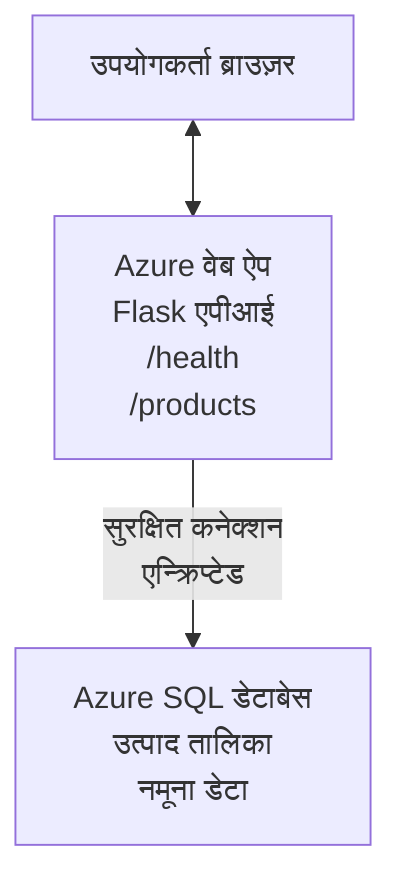

# AZD के साथ Microsoft SQL डेटाबेस और वेब ऐप को डिप्लॉय करना

⏱️ **अनुमानित समय**: 20-30 मिनट | 💰 **अनुमानित लागत**: ~$15-25/महीना | ⭐ **जटिलता**: मध्यवर्ती

यह **पूरा, कार्यशील उदाहरण** दर्शाता है कि [Azure Developer CLI (azd)](https://learn.microsoft.com/azure/developer/azure-developer-cli/) का उपयोग करके Python Flask वेब एप्लिकेशन को Microsoft SQL डेटाबेस के साथ Azure पर कैसे डिप्लॉय किया जा सकता है। सभी कोड शामिल और परीक्षण किए गए हैं—कोई बाहरी निर्भरता आवश्यक नहीं है।

## आप क्या सीखेंगे

इस उदाहरण को पूरा करके, आप:
- इन्फ्रास्ट्रक्चर-एज़-कोड का उपयोग करके एक मल्टी-टियर एप्लिकेशन (वेब ऐप + डेटाबेस) डिप्लॉय करना सीखेंगे
- सीक्रेट्स को हार्डकोड किए बिना सुरक्षित डेटाबेस कनेक्शन कॉन्फ़िगर करना
- Application Insights के साथ एप्लिकेशन स्वास्थ्य की निगरानी करना
- AZD CLI के साथ Azure संसाधनों का कुशलतापूर्वक प्रबंधन करना
- सुरक्षा, लागत अनुकूलन और ऑब्ज़रवेबिलिटी के लिए Azure सर्वोत्तम प्रथाओं का पालन करना

## परिदृश्य अवलोकन
- **वेब ऐप**: डेटाबेस कनेक्टिविटी के साथ Python Flask REST API
- **डेटाबेस**: नमूना डेटा के साथ Azure SQL Database
- **इन्फ्रास्ट्रक्चर**: Bicep का उपयोग करके प्रोविजन (मॉड्यूलर, पुन: प्रयोज्य टेम्पलेट)
- **डिप्लॉयमेंट**: `azd` कमांड्स के साथ पूरी तरह स्वचालित
- **निगरानी**: लॉग और टेलीमेट्री के लिए Application Insights

## पूर्वापेक्षाएँ

### आवश्यक टूल

शुरू करने से पहले, सुनिश्चित करें कि आपके पास ये टूल इंस्टॉल हैं:

1. **[Azure CLI](https://learn.microsoft.com/cli/azure/install-azure-cli)** (संस्करण 2.50.0 या उच्चतर)
   ```sh
   az --version
   # अपेक्षित आउटपुट: azure-cli 2.50.0 या उससे अधिक
   ```

2. **[Azure Developer CLI (azd)](https://learn.microsoft.com/azure/developer/azure-developer-cli/install-azd)** (संस्करण 1.0.0 या उच्चतर)
   ```sh
   azd version
   # अपेक्षित आउटपुट: azd संस्करण 1.0.0 या उससे ऊपर
   ```

3. **[Python 3.8+](https://www.python.org/downloads/)** (लोकल डेवलपमेंट के लिए)
   ```sh
   python --version
   # अपेक्षित आउटपुट: Python 3.8 या उससे ऊपर
   ```

4. **[Docker](https://www.docker.com/get-started)** (वैकल्पिक, लोकल कंटेनरीकृत डेवलपमेंट के लिए)
   ```sh
   docker --version
   # अपेक्षित आउटपुट: Docker संस्करण 20.10 या उससे ऊपर
   ```

### Azure आवश्यकताएँ

- एक सक्रिय **Azure subscription** ([मुफ्त खाता बनाएं](https://azure.microsoft.com/free/))
- आपकी सब्सक्रिप्शन में संसाधन बनाने की अनुमति
- सब्सक्रिप्शन या रिसोर्स ग्रुप पर **Owner** या **Contributor** भूमिका

### ज्ञान पूर्वापेक्षाएँ

यह एक **मध्यम-स्तर** का उदाहरण है। आपको निम्न चीजों की जानकारी होनी चाहिए:
- बुनियादी कमांड-लाइन ऑपरेशन्स
- क्लाउड के मूलभूत सिद्धांत (संसाधन, रिसोर्स ग्रुप)
- वेब एप्लिकेशन और डेटाबेस की मूल समझ

**AZD में नए हैं?** पहले [Getting Started guide](../../docs/chapter-01-foundation/azd-basics.md) से शुरू करें।

## आर्किटेक्चर

यह उदाहरण एक दो-टियर आर्किटेक्चर डिप्लॉय करता है जिसमें एक वेब एप्लिकेशन और SQL डेटाबेस शामिल हैं:



**Resource Deployment:**
- **Resource Group**: सभी संसाधनों के लिए कंटेनर
- **App Service Plan**: Linux-आधारित होस्टिंग (लागत-कुशलता के लिए B1 टियर)
- **Web App**: Flask एप्लिकेशन के साथ Python 3.11 रनटाइम
- **SQL Server**: TLS 1.2 न्यूनतम के साथ प्रबंधित डेटाबेस सर्वर
- **SQL Database**: Basic टियर (2GB, विकास/परीक्षण के लिए उपयुक्त)
- **Application Insights**: मॉनिटरिंग और लॉगिंग
- **Log Analytics Workspace**: केंद्रीकृत लॉग स्टोरेज

**उपमा**: इसे ऐसे सोचें जैसे एक रेस्टोरेंट (वेब एप) जिसमें एक वॉक-इन फ्रीज़र (डेटाबेस) है। ग्राहक मेनू (API endpoints) से ऑर्डर करते हैं, और किचन (Flask ऐप) फ्रीज़र (डेटा) से सामग्री प्राप्त करता है। रेस्टोरेंट मैनेजर (Application Insights) सब कुछ ट्रैक करता है।

## फ़ोल्डर संरचना

इस उदाहरण में सभी फाइलें शामिल हैं—कोई बाहरी निर्भरता आवश्यक नहीं:

```
examples/database-app/
│
├── README.md                    # This file
├── azure.yaml                   # AZD configuration file
├── .env.sample                  # Sample environment variables
├── .gitignore                   # Git ignore patterns
│
├── infra/                       # Infrastructure as Code (Bicep)
│   ├── main.bicep              # Main orchestration template
│   ├── abbreviations.json      # Azure naming conventions
│   └── resources/              # Modular resource templates
│       ├── sql-server.bicep    # SQL Server configuration
│       ├── sql-database.bicep  # Database configuration
│       ├── app-service-plan.bicep  # Hosting plan
│       ├── app-insights.bicep  # Monitoring setup
│       └── web-app.bicep       # Web application
│
└── src/
    └── web/                    # Application source code
        ├── app.py              # Flask REST API
        ├── requirements.txt    # Python dependencies
        └── Dockerfile          # Container definition
```

**प्रत्येक फ़ाइल क्या करती है:**
- **azure.yaml**: AZD को बताता है कि क्या डिप्लॉय करना है और कहाँ
- **infra/main.bicep**: सभी Azure संसाधनों का समन्वयन करता है
- **infra/resources/*.bicep**: व्यक्तिगत संसाधन परिभाषाएँ (पुन: उपयोग के लिए मॉड्यूलर)
- **src/web/app.py**: डेटाबेस लॉजिक के साथ Flask एप्लिकेशन
- **requirements.txt**: Python पैकेज निर्भरताएँ
- **Dockerfile**: डिप्लॉयमेंट के लिए कंटेनरीकरण निर्देश

## त्वरित आरंभ (कदम-दर-कदम)

### चरण 1: क्लोन और नेविगेट करें

```sh
git clone https://github.com/microsoft/AZD-for-beginners.git
cd AZD-for-beginners/examples/database-app
```

**✓ सफलता जांच**: सत्यापित करें कि आप `azure.yaml` और `infra/` फ़ोल्डर देखते हैं:
```sh
ls
# अपेक्षित: README.md, azure.yaml, infra/, src/
```

### चरण 2: Azure के साथ प्रमाणीकरण करें

```sh
azd auth login
```

यह आपके ब्राउज़र में Azure प्रमाणीकरण खोलता है। अपने Azure क्रेडेंशियल्स से साइन इन करें।

**✓ सफलता जांच**: आपको यह दिखना चाहिए:
```
Logged in to Azure.
```

### चरण 3: एनवायरनमेंट इनिशियलाइज़ करें

```sh
azd init
```

**क्या होता है**: AZD आपके डिप्लॉयमेंट के लिए एक लोकल कॉन्फ़िगरेशन बनाता है।

**प्रॉम्प्ट जो आप देखेंगे**:
- **Environment name**: एक छोटा नाम दर्ज करें (उदा., `dev`, `myapp`)
- **Azure subscription**: सूची में से अपनी सब्सक्रिप्शन चुनें
- **Azure location**: एक रीजन चुनें (उदा., `eastus`, `westeurope`)

**✓ सफलता जांच**: आपको यह दिखना चाहिए:
```
SUCCESS: New project initialized!
```

### चरण 4: Azure संसाधन प्रोविजन करें

```sh
azd provision
```

**क्या होता है**: AZD सभी इन्फ्रास्ट्रक्चर को डिप्लॉय करता है (5-8 मिनट लगते हैं):
1. रिसोर्स ग्रुप बनाता है
2. SQL Server और Database बनाता है
3. App Service Plan बनाता है
4. Web App बनाता है
5. Application Insights बनाता है
6. नेटवर्किंग और सुरक्षा कॉन्फ़िगर करता है

**आपसे पूछा जाएगा**:
- **SQL admin username**: एक यूजरनाम दर्ज करें (उदा., `sqladmin`)
- **SQL admin password**: एक मजबूत पासवर्ड दर्ज करें (इसे सुरक्षित रखें!)

**✓ सफलता जांच**: आपको यह दिखना चाहिए:
```
SUCCESS: Your application was provisioned in Azure in X minutes Y seconds.
You can view the resources created under the resource group rg-<env-name> in Azure Portal:
https://portal.azure.com/#@/resource/subscriptions/.../resourceGroups/rg-<env-name>
```

**⏱️ समय**: 5-8 मिनट

### चरण 5: एप्लिकेशन डिप्लॉय करें

```sh
azd deploy
```

**क्या होता है**: AZD आपके Flask एप्लिकेशन को बिल्ड और डिप्लॉय करता है:
1. Python एप्लिकेशन को पैकेज करता है
2. Docker कंटेनर बनाता है
3. Azure Web App पर पुश करता है
4. डेटाबेस को नमूना डेटा के साथ इनिशियलाइज़ करता है
5. एप्लिकेशन को स्टार्ट करता है

**✓ सफलता जांच**: आपको यह दिखना चाहिए:
```
SUCCESS: Your application was deployed to Azure in X minutes Y seconds.
You can view the resources created under the resource group rg-<env-name> in Azure Portal:
https://portal.azure.com/#@/resource/subscriptions/.../resourceGroups/rg-<env-name>
```

**⏱️ समय**: 3-5 मिनट

### चरण 6: एप्लिकेशन ब्राउज़ करें

```sh
azd browse
```

यह आपके डिप्लॉय किए गए वेब ऐप को ब्राउज़र में खोलता है: `https://app-<unique-id>.azurewebsites.net`

**✓ सफलता जांच**: आपको JSON आउटपुट दिखना चाहिए:
```json
{
  "message": "Welcome to the Database App API",
  "endpoints": {
    "/": "This help message",
    "/health": "Health check endpoint",
    "/products": "List all products",
    "/products/<id>": "Get product by ID"
  }
}
```

### चरण 7: API एंडपॉइंट्स का परीक्षण करें

**Health Check** (डेटाबेस कनेक्शन सत्यापित करें):
```sh
curl https://app-<your-id>.azurewebsites.net/health
```

**अपेक्षित प्रतिक्रिया**:
```json
{
  "status": "healthy",
  "database": "connected"
}
```

**List Products** (नमूना डेटा):
```sh
curl https://app-<your-id>.azurewebsites.net/products
```

**अपेक्षित प्रतिक्रिया**:
```json
[
  {
    "id": 1,
    "name": "Laptop",
    "description": "High-performance laptop",
    "price": 1299.99,
    "created_at": "2025-11-19T10:30:00"
  },
  ...
]
```

**Get Single Product**:
```sh
curl https://app-<your-id>.azurewebsites.net/products/1
```

**✓ सफलता जांच**: सभी एंडपॉइंट्स बिना त्रुटि के JSON डेटा लौटाते हैं।

---

**🎉 बधाई हो!** आपने सफलतापूर्वक AZD का उपयोग करके Azure पर डेटाबेस के साथ एक वेब एप्लिकेशन डिप्लॉय कर लिया है।

## कॉन्फ़िगरेशन गहराई से

### एनवायरनमेंट वेरिएबल्स

सीक्रेट्स Azure App Service कॉन्फ़िगरेशन के माध्यम से सुरक्षित रूप से प्रबंधित होते हैं—**कभी स्रोत कोड में हार्डकोड न करें**।

**AZD द्वारा स्वचालित रूप से कॉन्फ़िगर किए गए**:
- `SQL_CONNECTION_STRING`: एन्क्रिप्टेड क्रेडेंशियल्स के साथ डेटाबेस कनेक्शन
- `APPLICATIONINSIGHTS_CONNECTION_STRING`: मॉनिटरिंग टेलीमेट्री एंडपॉइंट
- `SCM_DO_BUILD_DURING_DEPLOYMENT`: स्वचालित निर्भरता इंस्टॉलेशन सक्षम करता है

**सीक्रेट्स कहाँ स्टोर होते हैं**:
1. `azd provision` के दौरान, आप सुरक्षित प्रॉम्प्ट के माध्यम से SQL क्रेडेंशियल्स प्रदान करते हैं
2. AZD इन्हें आपके लोकल `.azure/<env-name>/.env` फ़ाइल में स्टोर करता है (git-ignored)
3. AZD इन्हें Azure App Service कॉन्फ़िगरेशन में इंजेक्ट करता है (rest पर एन्क्रिप्टेड)
4. एप्लिकेशन रनटाइम पर `os.getenv()` के माध्यम से इन्हें पढ़ता है

### लोकल डेवलपमेंट

लोकल परीक्षण के लिए, सैंपल से एक `.env` फ़ाइल बनाएँ:

```sh
cp .env.sample .env
# .env को अपने स्थानीय डेटाबेस कनेक्शन के साथ संपादित करें
```

**लोकल डेवलपमेंट वर्कफ़्लो**:
```sh
# निर्भरता स्थापित करें
cd src/web
pip install -r requirements.txt

# पर्यावरण चर सेट करें
export SQL_CONNECTION_STRING="your-local-connection-string"

# एप्लिकेशन चलाएँ
python app.py
```

**लोकल पर परीक्षण करें**:
```sh
curl http://localhost:8000/health
# अपेक्षित: {"status": "healthy", "database": "connected"}
```

### इन्फ्रास्ट्रक्चर एज़ कोड

सभी Azure संसाधन **Bicep टेम्पलेट्स** (`infra/` फ़ोल्डर) में परिभाषित हैं:

- **मॉड्यूलर डिज़ाइन**: प्रत्येक संसाधन प्रकार के लिए उसका अपना फ़ाइल है, जिससे पुन: उपयोग आसान होता है
- **पैरामीटराइज़्ड**: SKUs, रीजन, नामकरण कन्वेंशन्स को अनुकूलित करें
- **सर्वोत्तम अभ्यास**: Azure नामकरण मानकों और सुरक्षा डिफ़ॉल्ट का पालन करता है
- **वर्ज़न कंट्रोल्ड**: इन्फ्रास्ट्रक्चर परिवर्तन Git में ट्रैक किए जाते हैं

**कस्टमाइज़ेशन उदाहरण**:
डेटाबेस टियर बदलने के लिए `infra/resources/sql-database.bicep` को एडिट करें:
```bicep
sku: {
  name: 'Standard'  // Changed from 'Basic'
  tier: 'Standard'
  capacity: 10
}
```

## सुरक्षा सर्वोत्तम अभ्यास

यह उदाहरण Azure सुरक्षा सर्वोत्तम प्रथाओं का पालन करता है:

### 1. **स्रोत कोड में कोई सीक्रेट नहीं**
- ✅ क्रेडेंशियल्स Azure App Service कॉन्फ़िगरेशन में स्टोर्ड होते हैं (एन्क्रिप्टेड)
- ✅ `.env` फ़ाइलें `.gitignore` के माध्यम से Git से बाहर रखी जाती हैं
- ✅ प्रोविजनिंग के दौरान सुरक्षित पैरामीटर के माध्यम से सीक्रेट्स पास किए जाते हैं

### 2. **एन्क्रिप्टेड कनेक्शन**
- ✅ SQL Server के लिए TLS 1.2 न्यूनतम
- ✅ Web App के लिए केवल HTTPS लागू
- ✅ डेटाबेस कनेक्शन्स एन्क्रिप्टेड चैनलों का उपयोग करते हैं

### 3. **नेटवर्क सुरक्षा**
- ✅ SQL Server फ़ायरवॉल को केवल Azure सेवाओं की अनुमति के लिए कॉन्फ़िगर किया गया
- ✅ सार्वजनिक नेटवर्क एक्सेस सीमित किया गया है (Private Endpoints के साथ और लॉक किया जा सकता है)
- ✅ Web App पर FTPS अक्षम

### 4. **प्रमाणीकरण और प्राधिकरण**
- ⚠️ **वर्तमान**: SQL प्रमाणीकरण (username/password)
- ✅ **प्रोडक्शन सिफारिश**: पासवर्ड-रहित प्रमाणीकरण के लिए Azure Managed Identity का उपयोग करें

**Managed Identity पर अपग्रेड करने के लिए** (प्रोडक्शन के लिए):
1. Web App पर managed identity सक्षम करें
2. आईडेंटिटी को SQL अनुमतियाँ दें
3. कनेक्शन स्ट्रिंग को managed identity उपयोग करने के लिए अपडेट करें
4. पासवर्ड-आधारित प्रमाणीकरण हटाएँ

### 5. **ऑडिटिंग और अनुपालन**
- ✅ Application Insights सभी अनुरोध और त्रुटियों को लॉग करता है
- ✅ SQL Database ऑडिटिंग सक्षम है (अनुपालन के लिए कॉन्फ़िगर किया जा सकता है)
- ✅ सभी संसाधनों को शासन के लिए टैग किया गया है

**प्रोडक्शन से पहले सुरक्षा चेकलिस्ट**:
- [ ] SQL के लिए Azure Defender सक्षम करें
- [ ] SQL Database के लिए Private Endpoints कॉन्फ़िगर करें
- [ ] Web Application Firewall (WAF) सक्षम करें
- [ ] सीक्रेट रोटेशन के लिए Azure Key Vault लागू करें
- [ ] Microsoft Entra ID प्रमाणीकरण कॉन्फ़िगर करें
- [ ] सभी संसाधनों के लिए डायग्नोस्टिक लॉगिंग सक्षम करें

## लागत अनुकूलन

**अनुमानित मासिक लागतें** (नवंबर 2025 के अनुसार):

| Resource | SKU/Tier | Estimated Cost |
|----------|----------|----------------|
| App Service Plan | B1 (Basic) | ~$13/month |
| SQL Database | Basic (2GB) | ~$5/month |
| Application Insights | Pay-as-you-go | ~$2/month (low traffic) |
| **Total** | | **~$20/month** |

**💡 लागत-बचत सुझाव**:

1. **सीखने के लिए फ्री टियर का उपयोग करें**:
   - App Service: F1 टियर (मुफ्त, सीमित घंटे)
   - SQL Database: Azure SQL Database serverless का उपयोग करें
   - Application Insights: 5GB/माह फ्री इनजेशन

2. **जब उपयोग में न हो तो संसाधनों को रोकें**:
   ```sh
   # वेब ऐप रोकें (डेटाबेस के लिए शुल्क तब भी लगता रहेगा)
   az webapp stop --name <app-name> --resource-group <rg-name>
   
   # जब आवश्यकता हो तो पुनः शुरू करें
   az webapp start --name <app-name> --resource-group <rg-name>
   ```

3. **परीक्षण के बाद सब कुछ हटा दें**:
   ```sh
   azd down
   ```
   इससे सभी संसाधन हट जाएंगे और चार्ज बंद हो जाएंगे।

4. **डेवलपमेंट बनाम प्रोडक्शन SKUs**:
   - **डेवलपमेंट**: Basic टियर (इस उदाहरण में उपयोग किया गया)
   - **प्रोडक्शन**: redundancy के साथ Standard/Premium टियर

**लागत मॉनिटरिंग**:
- [Azure Cost Management](https://portal.azure.com/#view/Microsoft_Azure_CostManagement) में लागत देखें
- आश्चर्यों से बचने के लिए लागत अलर्ट सेट करें
- ट्रैकिंग के लिए सभी संसाधनों पर `azd-env-name` टैग लगाएं

**फ्री टियर विकल्प**:
सीखने के उद्देश्यों के लिए, आप `infra/resources/app-service-plan.bicep` को संशोधित कर सकते हैं:
```bicep
sku: {
  name: 'F1'  // Free tier
  tier: 'Free'
}
```
**ध्यान**: फ्री टियर की सीमाएँ हैं (60 min/day CPU, हमेशा-ऑन नहीं)।

## मॉनिटरिंग और ऑब्ज़रवेबिलिटी

### Application Insights एकीकरण

यह उदाहरण व्यापक मॉनिटरिंग के लिए **Application Insights** शामिल करता है:

**क्या मॉनिटर किया जाता है**:
- ✅ HTTP अनुरोध (लेटेंसी, स्टेटस कोड, एंडपॉइंट्स)
- ✅ एप्लिकेशन त्रुटियाँ और अपवाद
- ✅ Flask ऐप से कस्टम लॉगिंग
- ✅ डेटाबेस कनेक्शन स्वास्थ्य
- ✅ प्रदर्शन मेट्रिक्स (CPU, मेमोरी)

**Application Insights एक्सेस करें**:
1. [Azure Portal](https://portal.azure.com) खोलें
2. अपने रिसोर्स ग्रुप (`rg-<env-name>`) पर नेविगेट करें
3. Application Insights रिसोर्स (`appi-<unique-id>`) पर क्लिक करें

**उपयोगी क्वेरीज़** (Application Insights → Logs):

**सभी अनुरोध देखें**:
```kusto
requests
| where timestamp > ago(1h)
| order by timestamp desc
| project timestamp, name, url, resultCode, duration
```

**त्रुटियाँ खोजें**:
```kusto
exceptions
| where timestamp > ago(24h)
| order by timestamp desc
| project timestamp, type, outerMessage, operation_Name
```

**Health Endpoint जांचें**:
```kusto
requests
| where name contains "health"
| summarize count() by resultCode, bin(timestamp, 1h)
```

### SQL Database ऑडिटिंग

**SQL Database ऑडिटिंग सक्षम है** ताकि ट्रैक किया जा सके:
- डेटाबेस एक्सेस पैटर्न
- असफल लॉगिन प्रयास
- स्कीमा परिवर्तन
- डेटा एक्सेस (अनुपालन के लिए)

**ऑडिट लॉग्स एक्सेस करें**:
1. Azure Portal → SQL Database → Auditing
2. Log Analytics workspace में लॉग देखें

### रियल-टाइम मॉनिटरिंग

**लाइव मेट्रिक्स देखें**:
1. Application Insights → Live Metrics
2. रियल-टाइम में अनुरोध, फेल्यर और प्रदर्शन देखें

**अलर्ट सेट अप करें**:
महत्वपूर्ण घटनाओं के लिए अलर्ट बनाएं:
- HTTP 500 त्रुटियाँ > 5 5 मिनट में
- डेटाबेस कनेक्शन फेल्योर
- उच्च प्रतिक्रिया समय (>2 सेकंड)

**अलर्ट निर्माण का उदाहरण**:
```sh
az monitor metrics alert create \
  --name "High-Response-Time" \
  --resource-group <rg-name> \
  --scopes <app-insights-resource-id> \
  --condition "avg requests/duration > 2000" \
  --description "Alert when response time exceeds 2 seconds"
```

## समस्या निवारण
### सामान्य समस्याएं और समाधान

#### 1. `azd provision` "Location not available" के साथ विफल होता है

**लक्षण**:
```
Error: The subscription is not registered for the resource type 'components' in the location 'centralus'.
```

**समाधान**:
किसी अलग Azure क्षेत्र को चुनें या resource provider को पंजीकृत करें:
```sh
az provider register --namespace Microsoft.Insights
```

#### 2. तैनाती के दौरान SQL कनेक्शन विफल होता है

**लक्षण**:
```
pyodbc.OperationalError: ('08001', '[08001] [Microsoft][ODBC Driver 18 for SQL Server]TCP Provider...')
```

**समाधान**:
- सत्यापित करें कि SQL Server फ़ायरवॉल Azure सेवाओं को अनुमति देता है (स्वचालित रूप से कॉन्फ़िगर किया जाता है)
- यह सुनिश्चित करें कि SQL admin पासवर्ड `azd provision` के दौरान सही रूप से दर्ज किया गया था
- सुनिश्चित करें कि SQL Server पूरी तरह provision हो चुका है (2-3 मिनट लग सकते हैं)

**कनेक्शन सत्यापित करें**:
```sh
# Azure पोर्टल से SQL डेटाबेस → क्वेरी संपादक पर जाएँ
# अपने प्रमाण-पत्रों के साथ कनेक्ट करने का प्रयास करें
```

#### 3. Web App "Application Error" दिखाता है

**लक्षण**:
ब्राउज़र सामान्य त्रुटि पृष्ठ दिखाता है।

**समाधान**:
एप्लिकेशन लॉग जाँचें:
```sh
# हाल के लॉग देखें
az webapp log tail --name <app-name> --resource-group <rg-name>
```

**सामान्य कारण**:
- पर्यावरण चर गायब (App Service → Configuration जांचें)
- Python पैकेज इंस्टॉलेशन विफल (डिप्लॉयमेंट लॉग्स जांचें)
- डेटाबेस इनिशियलाइज़ेशन त्रुटि (SQL कनेक्टिविटी जांचें)

#### 4. `azd deploy` "Build Error" के साथ विफल होता है

**लक्षण**:
```
Error: Failed to build project
```

**समाधान**:
- सुनिश्चित करें कि `requirements.txt` में कोई सिंटैक्स त्रुटि नहीं है
- जांचें कि `infra/resources/web-app.bicep` में Python 3.11 निर्दिष्ट है
- सत्यापित करें कि Dockerfile में बेस इमेज सही है

**स्थानीय रूप से डीबग करें**:
```sh
cd src/web
docker build -t test-app .
docker run -p 8000:8000 test-app
```

#### 5. AZD कमांड चलाने पर "Unauthorized"

**लक्षण**:
```
ERROR: (Unauthorized) The client '<id>' with object id '<id>' does not have authorization
```

**समाधान**:
Azure के साथ पुनः प्रमाणीकरण करें:
```sh
# AZD वर्कफ़्लोज़ के लिए आवश्यक
azd auth login

# यदि आप Azure CLI कमांडों का सीधे उपयोग भी कर रहे हैं तो यह वैकल्पिक है
az login
```

सुनिश्चित करें कि आपके पास सब्सक्रिप्शन पर सही अनुमति है (Contributor भूमिका)।

#### 6. डेटाबेस लागत अधिक

**लक्षण**:
अनपेक्षित Azure बिल।

**समाधान**:
- जांचें कि क्या आपने परीक्षण के बाद `azd down` चलाना भूल गए थे
- सत्यापित करें कि SQL Database Basic tier का उपयोग कर रहा है (Premium नहीं)
- Azure Cost Management में लागत की समीक्षा करें
- लागत अलर्ट सेट करें

### मदद प्राप्त करें

**सभी AZD पर्यावरण चर देखें**:
```sh
azd env get-values
```

**डिप्लॉयमेंट स्थिति जांचें**:
```sh
az webapp show --name <app-name> --resource-group <rg-name> --query state
```

**एप्लिकेशन लॉग्स तक पहुँचें**:
```sh
az webapp log download --name <app-name> --resource-group <rg-name> --log-file app-logs.zip
```

**और मदद चाहिए?**
- [AZD समस्या निवारण मार्गदर्शिका](../../docs/chapter-07-troubleshooting/common-issues.md)
- [Azure App Service समस्या निवारण](https://learn.microsoft.com/azure/app-service/troubleshoot-diagnostic-logs)
- [Azure SQL समस्या निवारण](https://learn.microsoft.com/azure/azure-sql/database/troubleshoot-common-errors-issues)

## व्यावहारिक अभ्यास

### अभ्यास 1: अपनी तैनाती सत्यापित करें (शुरुआती)

**लक्ष्य**: सुनिश्चित करें कि सभी संसाधन तैनात हैं और एप्लिकेशन काम कर रहा है।

**कदम**:
1. अपनी resource group में सभी संसाधनों की सूची बनाएं:
   ```sh
   az resource list --resource-group rg-<env-name> --output table
   ```
   **अपेक्षित**: 6-7 संसाधन (Web App, SQL Server, SQL Database, App Service Plan, Application Insights, Log Analytics)

2. सभी API एंडपॉइंट्स का परीक्षण करें:
   ```sh
   curl https://app-<your-id>.azurewebsites.net/
   curl https://app-<your-id>.azurewebsites.net/health
   curl https://app-<your-id>.azurewebsites.net/products
   curl https://app-<your-id>.azurewebsites.net/products/1
   ```
   **अपेक्षित**: सभी बिना त्रुटियों के वैध JSON लौटाएं

3. Application Insights जांचें:
   - Azure Portal में Application Insights पर जाएँ
   - "Live Metrics" पर जाएँ
   - वेब ऐप पर अपने ब्राउज़र को रिफ्रेश करें
   **अपेक्षित**: वास्तविक समय में अनुरोध दिखाई दें

**सफलता मापदंड**: सभी 6-7 संसाधन मौजूद हों, सभी एंडपॉइंट्स डेटा लौटाएं, Live Metrics गतिविधि दिखाए।

---

### अभ्यास 2: नया API एंडपॉइंट जोड़ें (मध्यम)

**लक्ष्य**: Flask एप्लिकेशन को एक नए एंडपॉइंट के साथ बढ़ाएँ।

**स्टार्टर कोड**: वर्तमान एंडपॉइंट `src/web/app.py` में हैं

**कदम**:
1. `src/web/app.py` संपादित करें और `get_product()` फ़ंक्शन के बाद एक नया एंडपॉइंट जोड़ें:
   ```python
   @app.route('/products/search/<keyword>')
   def search_products(keyword):
       """Search products by name or description."""
       try:
           conn = get_db_connection()
           cursor = conn.cursor()
           cursor.execute(
               "SELECT id, name, description, price, created_at FROM products WHERE name LIKE ? OR description LIKE ?",
               (f'%{keyword}%', f'%{keyword}%')
           )
           
           products = []
           for row in cursor.fetchall():
               products.append({
                   'id': row[0],
                   'name': row[1],
                   'description': row[2],
                   'price': float(row[3]) if row[3] else None,
                   'created_at': row[4].isoformat() if row[4] else None
               })
           
           cursor.close()
           conn.close()
           
           logger.info(f"Search for '{keyword}' returned {len(products)} results")
           return jsonify(products), 200
           
       except Exception as e:
           logger.error(f"Error searching products: {str(e)}")
           return jsonify({'error': str(e)}), 500
   ```

2. अपडेट किया गया एप्लिकेशन तैनात करें:
   ```sh
   azd deploy
   ```

3. नए एंडपॉइंट का परीक्षण करें:
   ```sh
   curl https://app-<your-id>.azurewebsites.net/products/search/laptop
   ```
   **अपेक्षित**: "laptop" से मेल खाने वाले उत्पाद लौटाता है

**सफलता मापदंड**: नया एंडपॉइंट काम करता है, फ़िल्टर किए गए परिणाम लौटाता है, Application Insights लॉग्स में दिखता है।

---

### अभ्यास 3: मॉनिटरिंग और अलर्ट जोड़ें (उन्नत)

**लक्ष्य**: अलर्ट के साथ सक्रिय निगरानी सेट करें।

**कदम**:
1. HTTP 500 त्रुटियों के लिए एक अलर्ट बनाएं:
   ```sh
   # Application Insights संसाधन आईडी प्राप्त करें
   AI_ID=$(az monitor app-insights component show \
     --app appi-<your-id> \
     --resource-group rg-<env-name> \
     --query id -o tsv)
   
   # अलर्ट बनाएं
   az monitor metrics alert create \
     --name "High-Error-Rate" \
     --resource-group rg-<env-name> \
     --scopes $AI_ID \
     --condition "count requests/failed > 5" \
     --window-size 5m \
     --evaluation-frequency 1m \
     --description "Alert when >5 failed requests in 5 minutes"
   ```

2. त्रुटियाँ पैदा करके अलर्ट ट्रिगर करें:
   ```sh
   # अस्तित्व में नहीं होने वाले उत्पाद का अनुरोध करें
   for i in {1..10}; do curl https://app-<your-id>.azurewebsites.net/products/999; done
   ```

3. जाँचें कि अलर्ट फायर हुआ:
   - Azure Portal → Alerts → Alert Rules
   - अपना ईमेल चेक करें (यदि कॉन्फ़िगर किया गया हो)

**सफलता मापदंड**: अलर्ट नियम बनाया गया है, त्रुटियों पर ट्रिगर होता है, सूचनाएँ प्राप्त होती हैं।

---

### अभ्यास 4: डेटाबेस स्कीमा परिवर्तन (उन्नत)

**लक्ष्य**: एक नई तालिका जोड़ें और एप्लिकेशन को इसका उपयोग करने के लिए संशोधित करें।

**कदम**:
1. Azure Portal Query Editor के माध्यम से SQL Database से कनेक्ट करें

2. एक नया `categories` तालिका बनाएं:
   ```sql
   CREATE TABLE categories (
       id INT PRIMARY KEY IDENTITY(1,1),
       name NVARCHAR(50) NOT NULL,
       description NVARCHAR(200)
   );
   
   INSERT INTO categories (name, description) VALUES
   ('Electronics', 'Electronic devices and accessories'),
   ('Office Supplies', 'Office equipment and supplies');
   
   -- Add category to products table
   ALTER TABLE products ADD category_id INT;
   UPDATE products SET category_id = 1; -- Set all to Electronics
   ```

3. `src/web/app.py` को अपडेट करें ताकि प्रतिक्रियाओं में category जानकारी शामिल हो

4. तैनात करें और परीक्षण करें

**सफलता मापदंड**: नई तालिका मौजूद हो, उत्पादों में category जानकारी दिखाई दे, एप्लिकेशन अभी भी काम करे।

---

### अभ्यास 5: कैशिंग लागू करें (विशेषज्ञ)

**लक्ष्य**: प्रदर्शन बेहतर करने के लिए Azure Redis Cache जोड़ें।

**कदम**:
1. `infra/main.bicep` में Redis Cache जोड़ें
2. `src/web/app.py` को अपडेट करें ताकि उत्पाद क्वेरीज़ कैश हों
3. Application Insights के साथ प्रदर्शन में सुधार मापें
4. कैशिंग से पहले/बाद में प्रतिक्रिया समय की तुलना करें

**सफलता मापदंड**: Redis तैनात है, कैशिंग काम करती है, प्रतिक्रिया समय >50% सुधरता है।

**संकेत**: शुरू करें [Azure Cache for Redis documentation](https://learn.microsoft.com/azure/azure-cache-for-redis/) से।

---

## सफाई

लगातार शुल्क से बचने के लिए, समाप्त होने पर सभी संसाधनों को हटा दें:

```sh
azd down
```

**पुष्टि संकेत**:
```
? Total resources to delete: 7, are you sure you want to continue? (y/N)
```

पुष्टि करने के लिए `y` टाइप करें।

**✓ सफलता जांच**: 
- सभी संसाधन Azure Portal से हटाए गए हों
- कोई लगातार शुल्क न हो
- स्थानीय `.azure/<env-name>` फ़ोल्डर हटाया जा सके

**वैकल्पिक** (इन्फ्रास्ट्रक्चर रखें, डेटा हटाएँ):
```sh
# केवल संसाधन समूह को हटाएँ (AZD कॉन्फ़िग रखें)
az group delete --name rg-<env-name> --yes
```
## और जानें

### संबंधित प्रलेखन
- [Azure Developer CLI प्रलेखन](https://learn.microsoft.com/azure/developer/azure-developer-cli/)
- [Azure SQL Database प्रलेखन](https://learn.microsoft.com/azure/azure-sql/database/)
- [Azure App Service प्रलेखन](https://learn.microsoft.com/azure/app-service/)
- [Application Insights प्रलेखन](https://learn.microsoft.com/azure/azure-monitor/app/app-insights-overview)
- [Bicep भाषा संदर्भ](https://learn.microsoft.com/azure/azure-resource-manager/bicep/)

### इस कोर्स में अगले कदम
- **[Container Apps उदाहरण](../../../../examples/container-app)**: Azure Container Apps के साथ माइक्रोसर्विसेज तैनात करें
- **[AI एकीकरण मार्गदर्शिका](../../../../docs/ai-foundry)**: अपने ऐप में AI क्षमताएँ जोड़ें
- **[तैनाती सर्वोत्तम प्रथाएँ](../../docs/chapter-04-infrastructure/deployment-guide.md)**: प्रोडक्शन तैनाती के पैटर्न

### उन्नत विषय
- **Managed Identity**: पासवर्ड हटाएँ और Microsoft Entra ID प्रमाणीकरण का उपयोग करें
- **Private Endpoints**: वर्चुअल नेटवर्क के भीतर डेटाबेस कनेक्शनों को सुरक्षित करें
- **CI/CD Integration**: GitHub Actions या Azure DevOps के साथ तैनाती को स्वचालित करें
- **Multi-Environment**: dev, staging, और production वातावरण सेट करें
- **Database Migrations**: स्कीमा versioning के लिए Alembic या Entity Framework का उपयोग करें

### अन्य दृष्टिकोणों से तुलना

**AZD vs. ARM Templates**:
- ✅ AZD: उच्च-स्तरीय एब्स्ट्रैक्शन, सरल कमांड
- ⚠️ ARM: अधिक विस्तृत, सूक्ष्म नियंत्रण

**AZD vs. Terraform**:
- ✅ AZD: Azure-नैटिव, Azure सेवाओं के साथ एकीकृत
- ⚠️ Terraform: मल्टि-क्लाउड समर्थन, बड़ा इकोसिस्टम

**AZD vs. Azure Portal**:
- ✅ AZD: दोहराने योग्य, वर्ज़न-नियंत्रित, ऑटोमेटेबल
- ⚠️ Portal: मैन्युअल क्लिक, पुनरुत्पादन कठिन

**AZD के बारे में सोचें**: Azure के लिए Docker Compose—जटिल डिप्लॉयमेंट के लिए सरल कॉन्फ़िगरेशन।

---

## अक्सर पूछे जाने वाले प्रश्न

**Q: क्या मैं कोई अलग प्रोग्रामिंग भाषा उपयोग कर सकता हूँ?**  
A: हाँ! `src/web/` को Node.js, C#, Go, या किसी भी भाषा से बदलें। `azure.yaml` और Bicep को तदनुसार अपडेट करें।

**Q: मैं और डेटाबेस कैसे जोड़ूँ?**  
A: `infra/main.bicep` में एक और SQL Database मॉड्यूल जोड़ें या Azure Database सेवाओं से PostgreSQL/MySQL का उपयोग करें।

**Q: क्या मैं इसे प्रोडक्शन के लिए उपयोग कर सकता हूँ?**  
A: यह एक शुरुआत बिंदु है। प्रोडक्शन के लिए, जोड़ें: managed identity, private endpoints, redundancy, बैकअप रणनीति, WAF, और उन्नत मॉनिटरिंग।

**Q: अगर मैं कंटेनरों का उपयोग करना चाहता हूँ ब्रैक-इन-प्लेस के बजाय?**  
A: देखें [Container Apps Example](../../../../examples/container-app) जो पूरे में Docker कंटेनरों का उपयोग करता है।

**Q: मैं अपने स्थानीय मशीन से डेटाबेस से कैसे कनेक्ट करूँ?**  
A: अपने IP को SQL Server फ़ायरवॉल में जोड़ें:
```sh
az sql server firewall-rule create \
  --resource-group rg-<env-name> \
  --server sql-<unique-id> \
  --name AllowMyIP \
  --start-ip-address <your-ip> \
  --end-ip-address <your-ip>
```

**Q: क्या मैं एक मौजूदा डेटाबेस का उपयोग कर सकता हूँ बजाय नए बनाने के?**  
A: हाँ, `infra/main.bicep` को संशोधित करें ताकि मौजूदा SQL Server का संदर्भ लिया जा सके और कनेक्शन स्ट्रिंग पैरामीटर्स अपडेट करें।

---

> **नोट:** यह उदाहरण AZD का उपयोग करके डेटाबेस के साथ वेब ऐप तैनात करने के लिए सर्वोत्तम प्रथाओं को दर्शाता है। इसमें कार्यशील कोड, व्यापक प्रलेखन, और सीखने को मजबूत करने के लिए व्यावहारिक अभ्यास शामिल हैं। उत्पादन तैनाती के लिए, अपनी संगठन की सुरक्षा, स्केलिंग, अनुपालन, और लागत आवश्यकताओं की समीक्षा करें।

**📚 कोर्स नेविगेशन:**
- ← पिछला: [Container Apps उदाहरण](../../../../examples/container-app)
- → अगला: [AI एकीकरण मार्गदर्शिका](../../../../docs/ai-foundry)
- 🏠 [Course Home](../../README.md)

---

<!-- CO-OP TRANSLATOR DISCLAIMER START -->
**अस्वीकरण**:
इस दस्तावेज़ का अनुवाद AI अनुवाद सेवा [Co-op Translator](https://github.com/Azure/co-op-translator) का उपयोग करके किया गया है। जबकि हम सटीकता के लिए प्रयास करते हैं, कृपया ध्यान दें कि स्वचालित अनुवादों में त्रुटियाँ या अशुद्धियाँ हो सकती हैं। मूल दस्तावेज़ अपनी मूल भाषा में ही प्रामाणिक स्रोत माना जाना चाहिए। महत्वपूर्ण जानकारी के लिए, पेशेवर मानव अनुवाद की सिफारिश की जाती है। इस अनुवाद के उपयोग से उत्पन्न किसी भी गलतफहमी या गलत व्याख्या के लिए हम उत्तरदायी नहीं हैं।
<!-- CO-OP TRANSLATOR DISCLAIMER END -->