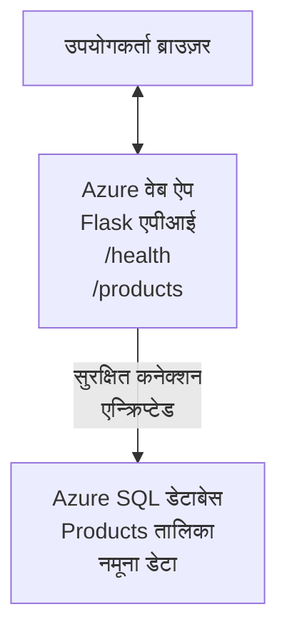

# AZD के साथ Microsoft SQL डेटाबेस और वेब ऐप को तैनात करना

⏱️ **अनुमानित समय**: 20-30 मिनट | 💰 **अनुमानित लागत**: ~$15-25/माह | ⭐ **जटिलता**: मध्यम

यह **पूर्ण, कार्यशील उदाहरण** दर्शाता है कि [Azure Developer CLI (azd)](https://learn.microsoft.com/azure/developer/azure-developer-cli/) का उपयोग करके Microsoft SQL Database के साथ एक Python Flask वेब एप्लिकेशन को Azure पर कैसे तैनात किया जाए। सभी कोड शामिल और परीक्षण किए गए हैं—बाहरी निर्भरताओं की आवश्यकता नहीं है।

## आप क्या सीखेंगे

इस उदाहरण को पूरा करके, आप:
- इन्फ्रास्ट्रक्टचर-एज़-कोड का उपयोग करके मल्टी-टियर एप्लिकेशन (वेब ऐप + डेटाबेस) तैनात करेंगे
- हार्डकोड किए बिना सुरक्षित डेटाबेस कनेक्शनों को कॉन्फ़िगर करेंगे
- Application Insights के साथ एप्लिकेशन स्वास्थ्य की निगरानी करेंगे
- AZD CLI के साथ Azure संसाधनों का कुशलतापूर्वक प्रबंधन करेंगे
- सुरक्षा, लागत अनुकूलन, और ऑब्ज़र्वेबिलिटी के लिए Azure सर्वोत्तम प्रथाओं का पालन करेंगे

## परिदृश्य का अवलोकन
- **वेब ऐप**: डेटाबेस कनेक्टिविटी के साथ Python Flask REST API
- **डेटाबेस**: नमूना डेटा के साथ Azure SQL Database
- **इन्फ्रास्ट्रक्चर**: Bicep का उपयोग करके प्रोविजन किया गया (मॉड्यूलर, पुन: उपयोग योग्य टेम्पलेट)
- **डिप्लॉयमेंट**: `azd` कमांड्स के साथ पूर्ण रूप से स्वचालित
- **मॉनिटरिंग**: लॉग और टेलीमीट्री के लिए Application Insights

## पूर्वापेक्षाएँ

### आवश्यक उपकरण

शुरू करने से पहले, सुनिश्चित करें कि आपके पास ये टूल इंस्टॉल हैं:

1. **[Azure CLI](https://learn.microsoft.com/cli/azure/install-azure-cli)** (संस्करण 2.50.0 या उच्चतर)
   ```sh
   az --version
   # अपेक्षित आउटपुट: azure-cli 2.50.0 या उच्चतर
   ```

2. **[Azure Developer CLI (azd)](https://learn.microsoft.com/azure/developer/azure-developer-cli/install-azd)** (संस्करण 1.0.0 या उच्चतर)
   ```sh
   azd version
   # अपेक्षित आउटपुट: azd संस्करण 1.0.0 या उससे ऊपर
   ```

3. **[Python 3.8+](https://www.python.org/downloads/)** (लोकल विकास के लिए)
   ```sh
   python --version
   # अपेक्षित आउटपुट: Python 3.8 या उससे ऊपर
   ```

4. **[Docker](https://www.docker.com/get-started)** (वैकल्पिक, स्थानीय कंटेनर विकास के लिए)
   ```sh
   docker --version
   # अपेक्षित आउटपुट: Docker संस्करण 20.10 या उच्चतर
   ```

### Azure आवश्यकताएँ

- एक सक्रिय **Azure subscription** ([free account बनाएँ](https://azure.microsoft.com/free/))
- अपनी subscription में संसाधन बनाने की अनुमतियाँ
- सब्सक्रिप्शन या रिसोर्स ग्रुप पर **Owner** या **Contributor** रोल

### ज्ञान पूर्वापेक्षाएँ

यह एक **मध्यम-स्तर** का उदाहरण है। आपको इन चीजों का परिचय होना चाहिए:
- बुनियादी कमांड-लाइन संचालन
- क्लाउड की मूलभूत अवधारणाएँ (ресोर्सेज़, रिसोर्स ग्रुप)
- वेब एप्लिकेशन और डेटाबेस की बुनियादी समझ

**AZD में नए हैं?** पहले [Getting Started guide](../../docs/chapter-01-foundation/azd-basics.md) से शुरू करें।

## आर्किटेक्चर

यह उदाहरण वेब एप्लिकेशन और SQL डेटाबेस के साथ दो-टियर आर्किटेक्चर तैनात करता है:


**रिसोर्स तैनाती:**
- **Resource Group**: सभी संसाधनों के लिए कंटेनर
- **App Service Plan**: Linux-आधारित होस्टिंग (लागत-कुशलता के लिए B1 टियर)
- **Web App**: Flask एप्लिकेशन के साथ Python 3.11 रनटाइम
- **SQL Server**: TLS 1.2 न्यूनतम के साथ मैनेज्ड डेटाबेस सर्वर
- **SQL Database**: बेसिक टियर (2GB, विकास/परीक्षण के लिए उपयुक्त)
- **Application Insights**: निगरानी और लॉगिंग
- **Log Analytics Workspace**: केंद्रीयकृत लॉग भंडारण

**रूपक**: इसे एक रेस्तरां (वेब ऐप) की तरह सोचें जिसमें एक वॉक-इन फ्रीज़र (डेटाबेस) है। ग्राहक मेनू (API endpoints) से ऑर्डर करते हैं, और किचन (Flask ऐप) फ्रीज़र से सामग्री (डेटा) निकालता है। रेस्तरां प्रबंधक (Application Insights) सब कुछ ट्रैक करता है।

## फ़ोल्डर संरचना

इस उदाहरण में सभी फाइलें शामिल हैं—बाहरी निर्भरताएँ आवश्यक नहीं हैं:

```
examples/database-app/
│
├── README.md                    # This file
├── azure.yaml                   # AZD configuration file
├── .env.sample                  # Sample environment variables
├── .gitignore                   # Git ignore patterns
│
├── infra/                       # Infrastructure as Code (Bicep)
│   ├── main.bicep              # Main orchestration template
│   ├── abbreviations.json      # Azure naming conventions
│   └── resources/              # Modular resource templates
│       ├── sql-server.bicep    # SQL Server configuration
│       ├── sql-database.bicep  # Database configuration
│       ├── app-service-plan.bicep  # Hosting plan
│       ├── app-insights.bicep  # Monitoring setup
│       └── web-app.bicep       # Web application
│
└── src/
    └── web/                    # Application source code
        ├── app.py              # Flask REST API
        ├── requirements.txt    # Python dependencies
        └── Dockerfile          # Container definition
```

**प्रत्येक फ़ाइल क्या करती है:**
- **azure.yaml**: AZD को बताता है कि क्या तैनात करना है और कहाँ
- **infra/main.bicep**: सभी Azure संसाधनों का समन्वय करता है
- **infra/resources/*.bicep**: व्यक्तिगत रिसोर्स परिभाषाएँ (पुन: उपयोग के लिए मॉड्यूलर)
- **src/web/app.py**: डेटाबेस लॉजिक के साथ Flask एप्लिकेशन
- **requirements.txt**: Python पैकेज निर्भरताएँ
- **Dockerfile**: तैनाती के लिए कंटेनरीकरण निर्देश

## क्विकस्टार्ट (स्टेप-बाय-स्टेप)

### स्टेप 1: क्लोन और नेविगेट करें

```sh
git clone https://github.com/microsoft/AZD-for-beginners.git
cd AZD-for-beginners/examples/database-app
```

**✓ सफलता चेक**: सत्यापित करें कि आप `azure.yaml` और `infra/` फ़ोल्डर देखते हैं:
```sh
ls
# अपेक्षित: README.md, azure.yaml, infra/, src/
```

### स्टेप 2: Azure में ऑथेंटिकेट करें

```sh
azd auth login
```

यह आपके ब्राउज़र को Azure प्रमाणीककरण के लिए खोलता है। अपने Azure क्रेडेंशियल्स से साइन इन करें।

**✓ सफलता चेक**: आपको यह दिखाई देना चाहिए:
```
Logged in to Azure.
```

### स्टेप 3: वातावरण प्रारंभ करें

```sh
azd init
```

**क्या होता है**: AZD आपकी तैनाती के लिए एक स्थानीय कॉन्फ़िगरेशन बनाता है।

**आप जो प्रम्प्ट देखेंगे**:
- **Environment name**: एक छोटा नाम दर्ज करें (उदा., `dev`, `myapp`)
- **Azure subscription**: सूची से अपनी subscription चुनें
- **Azure location**: एक क्षेत्र चुनें (उदा., `eastus`, `westeurope`)

**✓ सफलता चेक**: आपको यह दिखाई देना चाहिए:
```
SUCCESS: New project initialized!
```

### स्टेप 4: Azure संसाधन प्रोविजन करें

```sh
azd provision
```

**क्या होता है**: AZD सभी इन्फ्रास्ट्रक्चर तैनात करता है (5-8 मिनट लेते हैं):
1. रिसोर्स ग्रुप बनाता है
2. SQL Server और Database बनाता है
3. App Service Plan बनाता है
4. Web App बनाता है
5. Application Insights बनाता है
6. नेटवर्किंग और सुरक्षा कॉन्फ़िगर करता है

**आपसे पूछा जाएगा**:
- **SQL admin username**: एक उपयोगकर्ता नाम दर्ज करें (उदा., `sqladmin`)
- **SQL admin password**: एक मजबूत पासवर्ड दर्ज करें (इसे सहेजें!)

**✓ सफलता चेक**: आपको यह दिखाई देना चाहिए:
```
SUCCESS: Your application was provisioned in Azure in X minutes Y seconds.
You can view the resources created under the resource group rg-<env-name> in Azure Portal:
https://portal.azure.com/#@/resource/subscriptions/.../resourceGroups/rg-<env-name>
```

**⏱️ समय**: 5-8 मिनट

### स्टेप 5: एप्लिकेशन तैनात करें

```sh
azd deploy
```

**क्या होता है**: AZD आपके Flask एप्लिकेशन का बिल्ड और डिप्लॉय करता है:
1. Python एप्लिकेशन को पैकेज करता है
2. Docker कंटेनर बनाता है
3. Azure Web App पर पुश करता है
4. नमूना डेटा के साथ डेटाबेस इनिशियलाइज़ करता है
5. एप्लिकेशन शुरू करता है

**✓ सफलता चेक**: आपको यह दिखाई देना चाहिए:
```
SUCCESS: Your application was deployed to Azure in X minutes Y seconds.
You can view the resources created under the resource group rg-<env-name> in Azure Portal:
https://portal.azure.com/#@/resource/subscriptions/.../resourceGroups/rg-<env-name>
```

**⏱️ समय**: 3-5 मिनट

### स्टेप 6: एप्लिकेशन ब्राउज़ करें

```sh
azd browse
```

यह आपके तैनात वेब ऐप को ब्राउज़र में खोलता है `https://app-<unique-id>.azurewebsites.net`

**✓ सफलता चेक**: आपको JSON आउटपुट दिखाई देना चाहिए:
```json
{
  "message": "Welcome to the Database App API",
  "endpoints": {
    "/": "This help message",
    "/health": "Health check endpoint",
    "/products": "List all products",
    "/products/<id>": "Get product by ID"
  }
}
```

### स्टेप 7: API एंडपॉइंट्स का परीक्षण करें

**हेल्थ चेक** (डेटाबेस कनेक्शन सत्यापित करें):
```sh
curl https://app-<your-id>.azurewebsites.net/health
```

**अपेक्षित प्रतिक्रिया**:
```json
{
  "status": "healthy",
  "database": "connected"
}
```

**लिस्ट प्रोडक्ट्स** (नमूना डेटा):
```sh
curl https://app-<your-id>.azurewebsites.net/products
```

**अपेक्षित प्रतिक्रिया**:
```json
[
  {
    "id": 1,
    "name": "Laptop",
    "description": "High-performance laptop",
    "price": 1299.99,
    "created_at": "2025-11-19T10:30:00"
  },
  ...
]
```

**सिंगल प्रोडक्ट प्राप्त करें**:
```sh
curl https://app-<your-id>.azurewebsites.net/products/1
```

**✓ सफलता चेक**: सभी एंडपॉइंट्स JSON डेटा बिना त्रुटियों के लौटाते हैं।

---

**🎉 बधाई हो!** आपने AZD का उपयोग करके सफलतापूर्वक Azure पर डेटाबेस के साथ एक वेब एप्लिकेशन तैनात कर लिया है।

## कॉन्फ़िगरेशन डीप-डाइव

### एनवायरनमेंट वेरिएबल्स

सीक्रेट्स को सुरक्षित रूप से Azure App Service कॉन्फ़िगरेशन के माध्यम से प्रबंधित किया जाता है—**कभी भी स्रोत कोड में हार्डकोड न करें**।

**AZD द्वारा स्वचालित रूप से कॉन्फ़िगर किए गए:**
- `SQL_CONNECTION_STRING`: एन्क्रिप्टेड क्रेडेंशियल्स के साथ डेटाबेस कनेक्शन
- `APPLICATIONINSIGHTS_CONNECTION_STRING`: मॉनिटरिंग टेलीमीट्री एंडपॉइंट
- `SCM_DO_BUILD_DURING_DEPLOYMENT`: स्वचालित निर्भरताएँ इंस्टॉल करने को सक्षम करता है

**सीक्रेट्स कहाँ संग्रहीत हैं**:
1. `azd provision` के दौरान, आप सुरक्षित प्रम्प्ट्स के माध्यम से SQL क्रेडेंशियल्स प्रदान करते हैं
2. AZD इन्हें आपकी स्थानीय `.azure/<env-name>/.env` फ़ाइल में स्टोर करता है (git-ignored)
3. AZD इन्हें Azure App Service कॉन्फ़िगरेशन में इंजेक्ट करता है (rest में एन्क्रिप्टेड)
4. एप्लिकेशन रनटाइम पर इन्हें `os.getenv()` के माध्यम से पढ़ता है

### लोकल विकास

स्थानीय परीक्षण के लिए, नमूना से एक `.env` फ़ाइल बनाएं:

```sh
cp .env.sample .env
# अपने स्थानीय डेटाबेस कनेक्शन के साथ .env फ़ाइल संपादित करें
```

**लोकल विकास वर्कफ़्लो**:
```sh
# निर्भरता स्थापित करें
cd src/web
pip install -r requirements.txt

# पर्यावरण चर सेट करें
export SQL_CONNECTION_STRING="your-local-connection-string"

# एप्लिकेशन चलाएँ
python app.py
```

**स्थानीय रूप से परीक्षण करें**:
```sh
curl http://localhost:8000/health
# अपेक्षित: {"status": "healthy", "database": "connected"}
```

### इन्फ्रास्ट्रक्चर ऐज़ कोड

सभी Azure संसाधन **Bicep टेम्पलेट्स** (`infra/` फ़ोल्डर) में परिभाषित हैं:

- **मॉड्यूलर डिजाइन**: प्रत्येक रिसोर्स प्रकार की अपनी फ़ाइल है ताकि पुन: उपयोग हो सके
- **पैरामीटराइज़्ड**: SKUs, क्षेत्र, नामकरण कॉन्वेंशन अनुकूलित करें
- **सर्वोत्तम अभ्यास**: Azure नामकरण मानकों और सुरक्षा डिफ़ॉल्ट का पालन करता है
- **वर्ज़न कंट्रोल्ड**: इन्फ्रास्ट्रक्चर परिवर्तन Git में ट्रैक होते हैं

**कस्टमाइज़ेशन उदाहरण**:
डेटाबेस टियर बदलने के लिए, `infra/resources/sql-database.bicep` संपादित करें:
```bicep
sku: {
  name: 'Standard'  // Changed from 'Basic'
  tier: 'Standard'
  capacity: 10
}
```

## सुरक्षा सर्वोत्तम प्रथाएँ

यह उदाहरण Azure सुरक्षा सर्वोत्तम प्रथाओं का पालन करता है:

### 1. **सोर्स कोड में कोई सीक्रेट्स नहीं**
- ✅ क्रेडेंशियल्स Azure App Service कॉन्फ़िगरेशन में संग्रहीत (एन्क्रिप्टेड)
- ✅ `.env` फ़ाइलें `.gitignore` के द्वारा Git से अलग की गईं
- ✅ प्रोविजनिंग के दौरान सुरक्षित पैरामीटर के माध्यम से सीक्रेट्स पास किए जाते हैं

### 2. **एन्क्रिप्टेड कनेक्शन**
- ✅ SQL Server के लिए न्यूनतम TLS 1.2
- ✅ Web App के लिए केवल HTTPS लागू
- ✅ डेटाबेस कनेक्शन एन्क्रिप्टेड चैनलों का उपयोग करते हैं

### 3. **नेटवर्क सुरक्षा**
- ✅ SQL Server फ़ायरवॉल केवल Azure सेवाओं को अनुमति देने के लिए कॉन्फ़िगर किया गया
- ✅ सार्वजनिक नेटवर्क एक्सेस सीमित (और अधिक लॉकडाउन के लिए Private Endpoints का उपयोग किया जा सकता है)
- ✅ Web App पर FTPS अक्षम

### 4. **प्रमाणीकरण और प्राधिकरण**
- ⚠️ **वर्तमान**: SQL प्रमाणीकरण (यूज़रनेम/पासवर्ड)
- ✅ **प्रोडक्शन सिफारिश**: पासवर्ड-रहित प्रमाणीकरण के लिए Azure Managed Identity का उपयोग करें

**Managed Identity में अपग्रेड करने के लिए** (प्रोडक्शन के लिए):
1. Web App पर managed identity सक्षम करें
2. SQL अनुमतियाँ पहचान को दें
3. कनेक्शन स्ट्रिंग को managed identity का उपयोग करने के लिए अपडेट करें
4. पासवर्ड-आधारित प्रमाणीकरण हटाएं

### 5. **ऑडिटिंग और अनुपालन**
- ✅ Application Insights सभी अनुरोध और त्रुटियों को लॉग करता है
- ✅ SQL Database ऑडिटिंग सक्षम है (कनफिगर करके अनुपालन के लिए)
- ✅ सभी संसाधनों को गवर्नेंस के लिए टैग किया गया है

**प्रोडक्शन से पहले सुरक्षा चेकलिस्ट**:
- [ ] SQL के लिए Azure Defender सक्षम करें
- [ ] SQL Database के लिए Private Endpoints कॉन्फ़िगर करें
- [ ] Web Application Firewall (WAF) सक्षम करें
- [ ] सीक्रेट रोटेशन के लिए Azure Key Vault लागू करें
- [ ] Azure AD प्रमाणीकरण कॉन्फ़िगर करें
- [ ] सभी संसाधनों के लिए डायग्नोस्टिक लॉगिंग सक्षम करें

## लागत अनुकूलन

**अनुमानित मासिक लागत** (नवंबर 2025 के अनुसार):

| Resource | SKU/Tier | Estimated Cost |
|----------|----------|----------------|
| App Service Plan | B1 (Basic) | ~$13/month |
| SQL Database | Basic (2GB) | ~$5/month |
| Application Insights | Pay-as-you-go | ~$2/month (low traffic) |
| **Total** | | **~$20/month** |

**💡 लागत बचत सुझाव**:

1. **सीखने के लिए फ्री टियर का उपयोग करें**:
   - App Service: F1 टियर (मुफ्त, सीमित घंटे)
   - SQL Database: Azure SQL Database serverless का उपयोग करें
   - Application Insights: 5GB/माह मुफ्त इनजेशन

2. **जब उपयोग में नहीं हों तो संसाधनों को रोकें**:
   ```sh
   # वेब ऐप को रोकें (डेटाबेस पर अभी भी शुल्क लगते हैं)
   az webapp stop --name <app-name> --resource-group <rg-name>
   
   # ज़रूरत पड़ने पर पुनःप्रारंभ करें
   az webapp start --name <app-name> --resource-group <rg-name>
   ```

3. **परीक्षण के बाद सब कुछ हटाएँ**:
   ```sh
   azd down
   ```
   यह सभी संसाधनों को हटा देता है और शुल्क रोकता है।

4. **डेवलपमेंट बनाम प्रोडक्शन SKUs**:
   - **डेवलपमेंट**: बेसिक टियर (इस उदाहरण में उपयोग किया गया)
   - **प्रोडक्शन**: redundacy के साथ Standard/Premium टियर

**लागत निगरानी**:
- [Azure Cost Management](https://portal.azure.com/#view/Microsoft_Azure_CostManagement) में लागत देखें
- अप्रत्याशित खर्चों से बचने के लिए लागत अलर्ट सेट करें
- ट्रैकिंग के लिए सभी संसाधनों को `azd-env-name` टैग करें

**फ्री टियर विकल्प**:
सीखने के उद्देश्य के लिए, आप `infra/resources/app-service-plan.bicep` संशोधित कर सकते हैं:
```bicep
sku: {
  name: 'F1'  // Free tier
  tier: 'Free'
}
```
**नोट**: फ्री टियर में प्रतिबंध हैं (60 min/day CPU, हमेशा-ऑन नहीं)।

## मॉनिटरिंग और ऑब्ज़र्वेबिलिटी

### Application Insights एकीकरण

यह उदाहरण व्यापक मॉनिटरिंग के लिए **Application Insights** शामिल करता है:

**क्या मॉनिटर किया जाता है**:
- ✅ HTTP अनुरोध (लेटेंसी, स्टेटस कोड, एंडपॉइंट्स)
- ✅ एप्लिकेशन त्रुटियाँ और अपवाद
- ✅ Flask ऐप से कस्टम लॉगिंग
- ✅ डेटाबेस कनेक्शन स्वास्थ्य
- ✅ प्रदर्शन मेट्रिक्स (CPU, मेमोरी)

**Application Insights तक पहुँच**:
1. [Azure Portal](https://portal.azure.com) खोलें
2. अपने रिसोर्स ग्रुप (`rg-<env-name>`) पर जाएँ
3. Application Insights रिसोर्स (`appi-<unique-id>`) पर क्लिक करें

**उपयोगी क्वेरीज़** (Application Insights → Logs):

**सभी अनुरोध देखें**:
```kusto
requests
| where timestamp > ago(1h)
| order by timestamp desc
| project timestamp, name, url, resultCode, duration
```

**त्रुटियाँ खोजें**:
```kusto
exceptions
| where timestamp > ago(24h)
| order by timestamp desc
| project timestamp, type, outerMessage, operation_Name
```

**हेल्थ एंडपॉइंट चेक करें**:
```kusto
requests
| where name contains "health"
| summarize count() by resultCode, bin(timestamp, 1h)
```

### SQL Database ऑडिटिंग

**SQL Database ऑडिटिंग सक्षम है** ताकि ट्रैक किया जा सके:
- डेटाबेस एक्सेस पैटर्न
- फेल्ड लॉगिन प्रयास
- स्कीमा बदलाव
- डेटा एक्सेस (अनुपालन के लिए)

**ऑडिट लॉग्स तक पहुँच**:
1. Azure Portal → SQL Database → Auditing
2. Log Analytics workspace में लॉग देखें

### वास्तविक-समय मॉनिटरिंग

**लाइव मेट्रिक्स देखें**:
1. Application Insights → Live Metrics
2. वास्तविक समय में अनुरोध, विफलताएँ, और प्रदर्शन देखें

**अलर्ट सेट करें**:
महत्त्वपूर्ण घटनाओं के लिए अलर्ट बनाएं:
- HTTP 500 त्रुटियाँ > 5 प्रति 5 मिनट
- डेटाबेस कनेक्शन विफलताएँ
- उच्च प्रतिक्रिया समय (>2 सेकंड)

**अलर्ट निर्माण का उदाहरण**:
```sh
az monitor metrics alert create \
  --name "High-Response-Time" \
  --resource-group <rg-name> \
  --scopes <app-insights-resource-id> \
  --condition "avg requests/duration > 2000" \
  --description "Alert when response time exceeds 2 seconds"
```

## ट्रबलशूटिंग
### सामान्य समस्याएँ और समाधान

#### 1. `azd provision` 'Location not available' त्रुटि के साथ विफल होता है

**लक्षण**:
```
Error: The subscription is not registered for the resource type 'components' in the location 'centralus'.
```

**समाधान**:
किसी अलग Azure क्षेत्र का चयन करें या resource provider को रजिस्टर करें:
```sh
az provider register --namespace Microsoft.Insights
```

#### 2. डिप्लॉयमेंट के दौरान SQL कनेक्शन विफल होता है

**लक्षण**:
```
pyodbc.OperationalError: ('08001', '[08001] [Microsoft][ODBC Driver 18 for SQL Server]TCP Provider...')
```

**समाधान**:
- सत्यापित करें कि SQL Server फ़ायरवॉल Azure सेवाओं को अनुमति देता है (स्वचालित रूप से कॉन्फ़िगर किया जा सकता है)
- जांचें कि `azd provision` के दौरान SQL एडमिन पासवर्ड सही ढंग से दर्ज किया गया था
- सुनिश्चित करें कि SQL Server पूरी तरह से provision हुआ है (2-3 मिनट लग सकते हैं)

**कनेक्शन सत्यापित करें**:
```sh
# Azure पोर्टल में, SQL Database → क्वेरी संपादक पर जाएँ
# अपने प्रमाण-पत्रों के साथ कनेक्ट करने का प्रयास करें
```

#### 3. वेब ऐप "Application Error" दिखाता है

**लक्षण**:
ब्राउज़र सामान्य त्रुटि पृष्ठ दिखाता है।

**समाधान**:
एप्लिकेशन लॉग्स जांचें:
```sh
# हाल के लॉग देखें
az webapp log tail --name <app-name> --resource-group <rg-name>
```

**सामान्य कारण**:
- पर्यावरण चर गायब हैं (App Service → Configuration जांचें)
- Python पैकेज इंस्टॉलेशन विफल हुआ (डिप्लॉयमेंट लॉग्स देखें)
- डेटाबेस इनिशियलाइज़ेशन त्रुटि (SQL कनेक्टिविटी जांचें)

#### 4. `azd deploy` "Build Error" के साथ विफल होता है

**लक्षण**:
```
Error: Failed to build project
```

**समाधान**:
- सुनिश्चित करें कि `requirements.txt` में कोई सिंटैक्स त्रुटि न हो
- जांचें कि `infra/resources/web-app.bicep` में Python 3.11 निर्दिष्ट है
- सत्यापित करें कि Dockerfile में सही बेस इमेज है

**स्थानीय रूप से डिबग करें**:
```sh
cd src/web
docker build -t test-app .
docker run -p 8000:8000 test-app
```

#### 5. AZD कमांड चलाते समय "Unauthorized"

**लक्षण**:
```
ERROR: (Unauthorized) The client '<id>' with object id '<id>' does not have authorization
```

**समाधान**:
Azure के साथ पुनः प्रमाणीकृत (re-authenticate) करें:
```sh
azd auth login
az login
```

सुनिश्चित करें कि आपके पास सब्सक्रिप्शन पर सही अनुमतियाँ हैं (Contributor role)।

#### 6. उच्च डेटाबेस लागत

**लक्षण**:
अनपेक्षित Azure बिल।

**समाधान**:
- जांचें कि क्या आपने परीक्षण के बाद `azd down` चलाना भूल गया था
- सत्यापित करें कि SQL Database Basic tier का उपयोग कर रहा है (न कि Premium)
- Azure Cost Management में लागतों की समीक्षा करें
- लागत अलर्ट सेट करें

### सहायता लें

**सभी AZD पर्यावरण चर देखें**:
```sh
azd env get-values
```

**डिप्लॉयमेंट स्थिति जांचें**:
```sh
az webapp show --name <app-name> --resource-group <rg-name> --query state
```

**एप्लिकेशन लॉग्स तक पहुँचें**:
```sh
az webapp log download --name <app-name> --resource-group <rg-name> --log-file app-logs.zip
```

**अधिक मदद चाहिए?**
- [AZD समस्या निवारण मार्गदर्शिका](../../docs/chapter-07-troubleshooting/common-issues.md)
- [Azure App Service समस्या निवारण](https://learn.microsoft.com/azure/app-service/troubleshoot-diagnostic-logs)
- [Azure SQL समस्या निवारण](https://learn.microsoft.com/azure/azure-sql/database/troubleshoot-common-errors-issues)

## व्यावहारिक अभ्यास

### अभ्यास 1: अपनी डिप्लॉयमेंट सत्यापित करें (शुरुआती)

**लक्ष्य**: पुष्टि करें कि सभी संसाधन तैनात हैं और एप्लिकेशन काम कर रहा है।

**कदम**:
1. अपने resource group में सभी संसाधनों की सूची बनाएं:
   ```sh
   az resource list --resource-group rg-<env-name> --output table
   ```
   **अपेक्षित**: 6-7 resources (Web App, SQL Server, SQL Database, App Service Plan, Application Insights, Log Analytics)

2. सभी API endpoints का परीक्षण करें:
   ```sh
   curl https://app-<your-id>.azurewebsites.net/
   curl https://app-<your-id>.azurewebsites.net/health
   curl https://app-<your-id>.azurewebsites.net/products
   curl https://app-<your-id>.azurewebsites.net/products/1
   ```
   **अपेक्षित**: सभी मान्य JSON बिना त्रुटियों के लौटाएँ

3. Application Insights जांचें:
   - Azure Portal में Application Insights पर जाएं
   - "Live Metrics" पर जाएं
   - वेब ऐप पर अपने ब्राउज़र को रीफ़्रेश करें
   **अपेक्षित**: रियल-टाइम में अनुरोध दिखाई दें

**सफलता मानदंड**: सभी 6-7 संसाधन मौजूद हों, सभी endpoints डेटा लौटाएँ, Live Metrics गतिविधि दिखाया गया हो।

---

### अभ्यास 2: नया API Endpoint जोड़ें (मध्यम)

**लक्ष्य**: Flask एप्लिकेशन में नया endpoint जोड़ें।

**स्टार्टर कोड**: वर्तमान endpoints `src/web/app.py` में

**कदम**:
1. `src/web/app.py` संपादित करें और `get_product()` फ़ंक्शन के बाद नया endpoint जोड़ें:
   ```python
   @app.route('/products/search/<keyword>')
   def search_products(keyword):
       """Search products by name or description."""
       try:
           conn = get_db_connection()
           cursor = conn.cursor()
           cursor.execute(
               "SELECT id, name, description, price, created_at FROM products WHERE name LIKE ? OR description LIKE ?",
               (f'%{keyword}%', f'%{keyword}%')
           )
           
           products = []
           for row in cursor.fetchall():
               products.append({
                   'id': row[0],
                   'name': row[1],
                   'description': row[2],
                   'price': float(row[3]) if row[3] else None,
                   'created_at': row[4].isoformat() if row[4] else None
               })
           
           cursor.close()
           conn.close()
           
           logger.info(f"Search for '{keyword}' returned {len(products)} results")
           return jsonify(products), 200
           
       except Exception as e:
           logger.error(f"Error searching products: {str(e)}")
           return jsonify({'error': str(e)}), 500
   ```

2. अपडेट किया गया एप्लिकेशन डिप्लॉय करें:
   ```sh
   azd deploy
   ```

3. नए endpoint का परीक्षण करें:
   ```sh
   curl https://app-<your-id>.azurewebsites.net/products/search/laptop
   ```
   **अपेक्षित**: "laptop" से मेल खाती उत्पाद लौटाएँ

**सफलता मानदंड**: नया endpoint काम करता है, फ़िल्टर किए गए परिणाम लौटाता है, Application Insights लॉग्स में दिखाई देता है।

---

### अभ्यास 3: निगरानी और अलर्ट जोड़ें (उन्नत)

**लक्ष्य**: अलर्ट के साथ सक्रिय निगरानी सेटअप करें।

**कदम**:
1. HTTP 500 त्रुटियों के लिए एक अलर्ट बनाएं:
   ```sh
   # Application Insights संसाधन आईडी प्राप्त करें
   AI_ID=$(az monitor app-insights component show \
     --app appi-<your-id> \
     --resource-group rg-<env-name> \
     --query id -o tsv)
   
   # अलर्ट बनाएं
   az monitor metrics alert create \
     --name "High-Error-Rate" \
     --resource-group rg-<env-name> \
     --scopes $AI_ID \
     --condition "count requests/failed > 5" \
     --window-size 5m \
     --evaluation-frequency 1m \
     --description "Alert when >5 failed requests in 5 minutes"
   ```

2. त्रुटियाँ उत्पन्न कर अलर्ट ट्रिगर करें:
   ```sh
   # मौजूद नहीं होने वाले उत्पाद का अनुरोध करें
   for i in {1..10}; do curl https://app-<your-id>.azurewebsites.net/products/999; done
   ```

3. जाँचें कि अलर्ट फायर हुआ या नहीं:
   - Azure Portal → Alerts → Alert Rules
   - अपना ईमेल जांचें (यदि कॉन्फ़िगर किया गया हो)

**सफलता मानदंड**: अलर्ट रूल बनाया गया हो, त्रुटियों पर ट्रिगर हो, सूचनाएँ प्राप्त हों।

---

### अभ्यास 4: डेटाबेस स्कीमा परिवर्तन (उन्नत)

**लक्ष्य**: नया तालिका जोड़ें और एप्लिकेशन को उसका उपयोग करने के लिए संशोधित करें।

**कदम**:
1. Azure Portal Query Editor के माध्यम से SQL Database से कनेक्ट करें

2. नया `categories` तालिका बनाएं:
   ```sql
   CREATE TABLE categories (
       id INT PRIMARY KEY IDENTITY(1,1),
       name NVARCHAR(50) NOT NULL,
       description NVARCHAR(200)
   );
   
   INSERT INTO categories (name, description) VALUES
   ('Electronics', 'Electronic devices and accessories'),
   ('Office Supplies', 'Office equipment and supplies');
   
   -- Add category to products table
   ALTER TABLE products ADD category_id INT;
   UPDATE products SET category_id = 1; -- Set all to Electronics
   ```

3. प्रतिक्रियाओं में category जानकारी शामिल करने के लिए `src/web/app.py` अपडेट करें

4. डिप्लॉय और टेस्ट करें

**सफलता मानदंड**: नया तालिका मौजूद हो, उत्पादों में category जानकारी दिखाई दे, एप्लिकेशन अभी भी काम करे।

---

### अभ्यास 5: कैशिंग लागू करें (विशेषज्ञ)

**लक्ष्य**: प्रदर्शन सुधारने के लिए Azure Redis Cache जोड़ें।

**कदम**:
1. `infra/main.bicep` में Redis Cache जोड़ें
2. `src/web/app.py` को अपडेट करें ताकि उत्पाद क्वेरियों को कैश किया जा सके
3. Application Insights के साथ प्रदर्शन सुधार मापें
4. कैशिंग से पहले/बाद के प्रतिक्रिया समय की तुलना करें

**सफलता मानदंड**: Redis तैनात हो, कैशिंग काम करे, प्रतिक्रिया समय >50% से बेहतर हो।

**संकेत**: शुरुआत के लिए [Azure Cache for Redis दस्तावेज़ीकरण](https://learn.microsoft.com/azure/azure-cache-for-redis/) देखें।

---

## क्लीनअप

लगातार चार्ज से बचने के लिए, समाप्त करने पर सभी संसाधनों को हटाएं:

```sh
azd down
```

**पुष्टिकरण प्रॉम्प्ट**:
```
? Total resources to delete: 7, are you sure you want to continue? (y/N)
```

टाइप करें `y` पुष्टि करने के लिए।

**✓ सफलता जांच**: 
- सभी संसाधन Azure Portal से हटाए गए हों
- कोई चल रहे शुल्क न हों
- स्थानीय `.azure/<env-name>` फ़ोल्डर हटाया जा सके

**वैकल्पिक** (इन्फ्रास्ट्रक्चर रखें, डेटा हटाएँ):
```sh
# केवल रिसोर्स ग्रुप हटाएँ (AZD कॉन्फ़िग बनाए रखें)
az group delete --name rg-<env-name> --yes
```
## Learn More

### संबंधित दस्तावेज़ीकरण
- [Azure Developer CLI Documentation](https://learn.microsoft.com/azure/developer/azure-developer-cli/)
- [Azure SQL Database Documentation](https://learn.microsoft.com/azure/azure-sql/database/)
- [Azure App Service Documentation](https://learn.microsoft.com/azure/app-service/)
- [Application Insights Documentation](https://learn.microsoft.com/azure/azure-monitor/app/app-insights-overview)
- [Bicep Language Reference](https://learn.microsoft.com/azure/azure-resource-manager/bicep/)

### इस कोर्स में अगले कदम
- **[Container Apps Example](../../../../examples/container-app)**: Azure Container Apps के साथ माइक्रोसर्विसेस तैनात करें
- **[AI Integration Guide](../../../../docs/ai-foundry)**: अपने ऐप में AI क्षमताएँ जोड़ें
- **[Deployment Best Practices](../../docs/chapter-04-infrastructure/deployment-guide.md)**: उत्पादन तैनाती पैटर्न

### उन्नत विषय
- **Managed Identity**: पासवर्ड हटाएँ और Azure AD प्रमाणीकरण का उपयोग करें
- **Private Endpoints**: वर्चुअल नेटवर्क के भीतर डेटाबेस कनेक्शन सुरक्षित करें
- **CI/CD Integration**: GitHub Actions या Azure DevOps के साथ डिप्लॉयमेंट ऑटोमेट करें
- **Multi-Environment**: dev, staging, और production वातावरण सेटअप करें
- **Database Migrations**: स्कीमा वर्शनिंग के लिए Alembic या Entity Framework का उपयोग करें

### अन्य दृष्टिकोणों से तुलना

**AZD बनाम ARM Templates**:
- ✅ AZD: उच्च-स्तरीय अमूर्तन, सरल कमांड
- ⚠️ ARM: अधिक विवरणपूर्ण, सूक्ष्म नियंत्रण

**AZD बनाम Terraform**:
- ✅ AZD: Azure-नेटिव, Azure सेवाओं के साथ एकीकृत
- ⚠️ Terraform: मल्टी-क्लाउड सपोर्ट, बड़ा इकोसिस्टम

**AZD बनाम Azure Portal**:
- ✅ AZD: दोहराने योग्य, संस्करण-नियंत्रित, ऑटोमेटेबल
- ⚠️ Portal: मैनुअल क्लिक, पुनरुत्पादन कठिन

**AZD को सोचें**: Azure के लिए Docker Compose — जटिल तैनाती के लिए सरलित कॉन्फ़िगरेशन।

---

## अक्सर पूछे जाने वाले प्रश्न

**प्रश्न: क्या मैं कोई अलग प्रोग्रामिंग भाषा उपयोग कर सकता/सकती हूँ?**  
**उत्तर:** हाँ! `src/web/` को Node.js, C#, Go, या किसी भी भाषा से बदलें। `azure.yaml` और Bicep के अनुसार अपडेट करें।

**प्रश्न: अधिक डेटाबेस कैसे जोड़ूं?**  
**उत्तर:** `infra/main.bicep` में एक और SQL Database मॉड्यूल जोड़ें या Azure Database सेवाओं से PostgreSQL/MySQL का उपयोग करें।

**प्रश्न: क्या मैं इसे प्रोडक्शन के लिए उपयोग कर सकता/सकती हूँ?**  
**उत्तर:** यह एक शुरुआती बिंदु है। प्रोडक्शन के लिए जोड़ें: managed identity, private endpoints, redundancy, बैकअप रणनीति, WAF, और संवर्धित निगरानी।

**प्रश्न: अगर मैं कोड डिप्लॉयमेंट की बजाय कंटेनर उपयोग करना चाहूँ तो?**  
**उत्तर:** [Container Apps Example](../../../../examples/container-app) देखें जो Docker कंटेनरों का उपयोग करता है।

**प्रश्न: मैं अपने लोकल मशीन से डेटाबेस से कैसे कनेक्ट करूँ?**  
**उत्तर:** अपने IP को SQL Server फ़ायरवॉल में जोड़ें:
```sh
az sql server firewall-rule create \
  --resource-group rg-<env-name> \
  --server sql-<unique-id> \
  --name AllowMyIP \
  --start-ip-address <your-ip> \
  --end-ip-address <your-ip>
```

**प्रश्न: क्या मैं नया डेटाबेस बनाने के बजाय मौजूदा डेटाबेस का उपयोग कर सकता/सकती हूँ?**  
**उत्तर:** हाँ, `infra/main.bicep` को संशोधित करें ताकि किसी मौजूदा SQL Server को संदर्भित किया जा सके और connection string पैरामीटर अपडेट करें।

---

> **नोट:** यह उदाहरण AZD का उपयोग करके डेटाबेस के साथ वेब ऐप तैनात करने के सर्वोत्तम अभ्यास दिखाता है। इसमें कार्यशील कोड, व्यापक दस्तावेज़ीकरण, और सीखने को मज़बूत करने के लिए व्यावहारिक अभ्यास शामिल हैं। प्रोडक्शन तैनाती के लिए अपने संगठन की सुरक्षा, स्केलिंग, अनुपालन, और लागत आवश्यकताओं की समीक्षा करें।

**📚 कोर्स नेविगेशन:**
- ← Previous: [Container Apps Example](../../../../examples/container-app)
- → Next: [AI Integration Guide](../../../../docs/ai-foundry)
- 🏠 [Course Home](../../README.md)

---

<!-- CO-OP TRANSLATOR DISCLAIMER START -->
**अस्वीकरण**:
यह दस्तावेज़ AI अनुवाद सेवा [Co-op Translator](https://github.com/Azure/co-op-translator) का उपयोग करके अनुवादित किया गया है। हम सटीकता के लिए प्रयासरत हैं, लेकिन कृपया ध्यान दें कि स्वचालित अनुवादों में त्रुटियाँ या अशुद्धियाँ हो सकती हैं। मूल दस्तावेज़ को उसकी मूल भाषा में प्रामाणिक स्रोत माना जाना चाहिए। महत्वपूर्ण जानकारी के लिए, पेशेवर मानव अनुवाद की अनुशंसा की जाती है। इस अनुवाद के उपयोग से उत्पन्न किसी भी गलतफहमी या गलत व्याख्या के लिए हम उत्तरदायी नहीं हैं।
<!-- CO-OP TRANSLATOR DISCLAIMER END -->