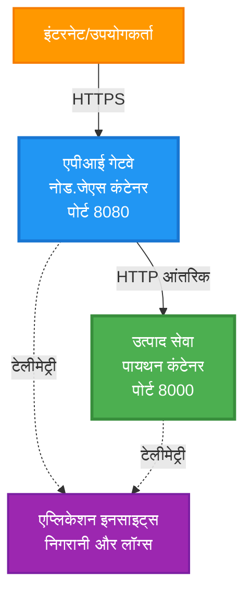
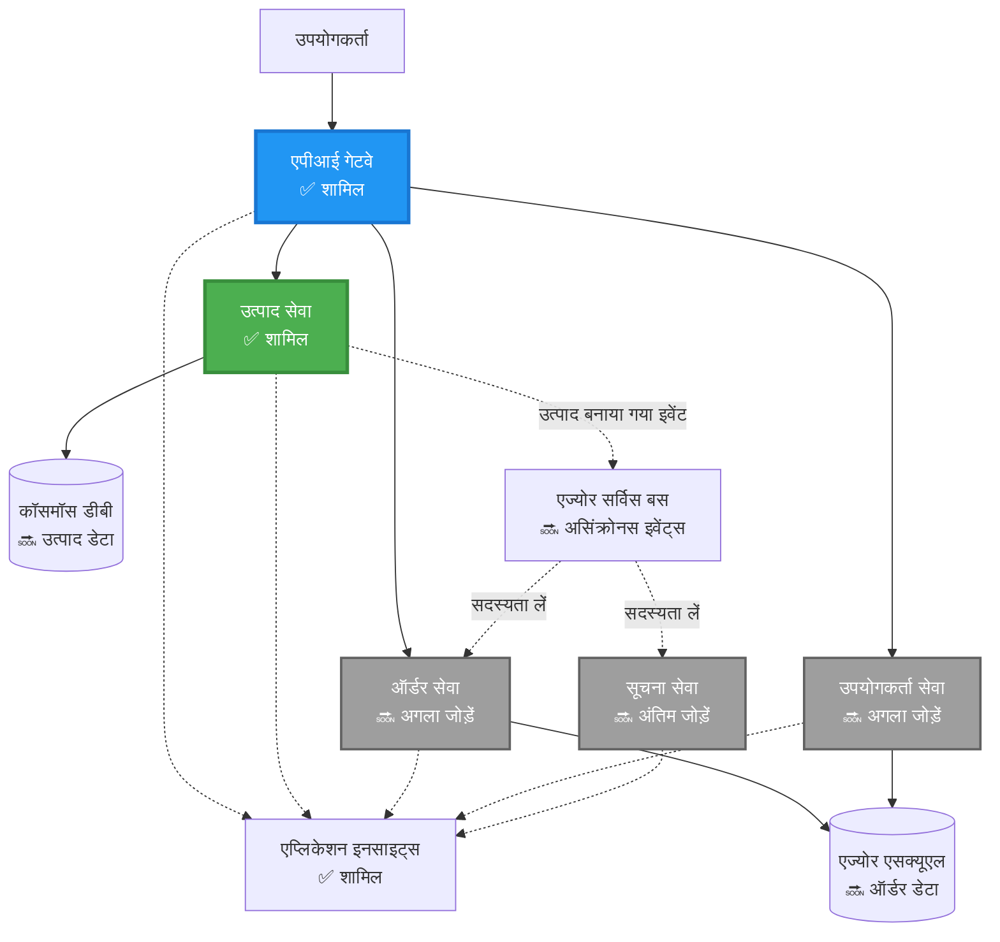
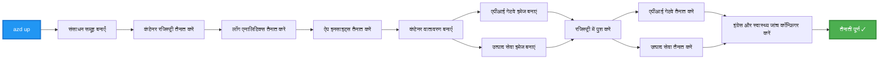
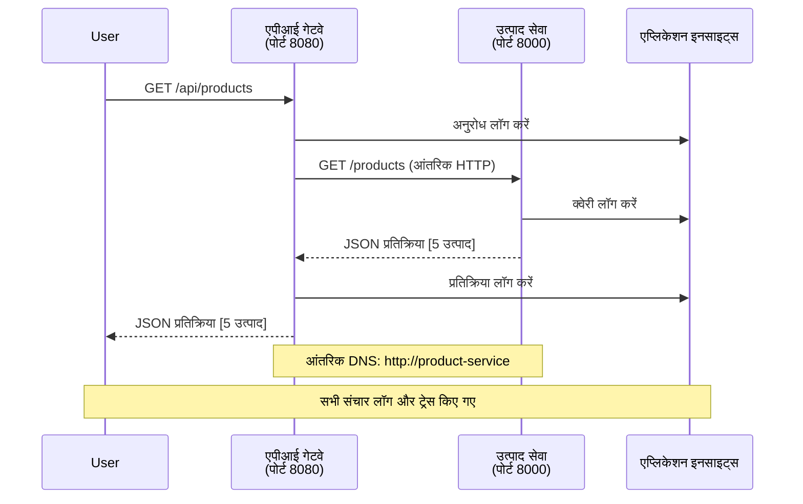

<!--
CO_OP_TRANSLATOR_METADATA:
{
  "original_hash": "eb3a4803a1e80a7f2e64f6bf63738c0f",
  "translation_date": "2025-11-20T02:14:42+00:00",
  "source_file": "examples/microservices/README.md",
  "language_code": "hi"
}
-->
# माइक्रोसर्विस आर्किटेक्चर - कंटेनर ऐप उदाहरण

⏱️ **अनुमानित समय**: 25-35 मिनट | 💰 **अनुमानित लागत**: ~$50-100/माह | ⭐ **जटिलता**: उन्नत

**📚 सीखने का मार्ग:**
- ← पिछला: [सिंपल Flask API](../../../../examples/container-app/simple-flask-api) - सिंगल कंटेनर की मूल बातें
- 🎯 **आप यहां हैं**: माइक्रोसर्विस आर्किटेक्चर (2-सर्विस फाउंडेशन)
- → अगला: [AI इंटीग्रेशन](../../../../docs/ai-foundry) - अपनी सेवाओं में इंटेलिजेंस जोड़ें
- 🏠 [कोर्स होम](../../README.md)

---

एक **सरल लेकिन कार्यात्मक** माइक्रोसर्विस आर्किटेक्चर, जिसे AZD CLI का उपयोग करके Azure Container Apps पर डिप्लॉय किया गया है। यह उदाहरण सेवा-से-सेवा संचार, कंटेनर ऑर्केस्ट्रेशन और मॉनिटरिंग को एक व्यावहारिक 2-सर्विस सेटअप के साथ प्रदर्शित करता है।

> **📚 सीखने का दृष्टिकोण**: यह उदाहरण एक न्यूनतम 2-सर्विस आर्किटेक्चर (API गेटवे + बैकएंड सर्विस) से शुरू होता है जिसे आप वास्तव में डिप्लॉय कर सकते हैं और सीख सकते हैं। इस नींव को समझने के बाद, हम आपको एक पूर्ण माइक्रोसर्विस इकोसिस्टम में विस्तार करने के लिए मार्गदर्शन प्रदान करते हैं।

## आप क्या सीखेंगे

इस उदाहरण को पूरा करके, आप:
- Azure Container Apps पर कई कंटेनर डिप्लॉय करेंगे
- आंतरिक नेटवर्किंग के साथ सेवा-से-सेवा संचार लागू करेंगे
- पर्यावरण-आधारित स्केलिंग और हेल्थ चेक्स को कॉन्फ़िगर करेंगे
- Application Insights के साथ वितरित एप्लिकेशन मॉनिटर करेंगे
- माइक्रोसर्विस डिप्लॉयमेंट पैटर्न और सर्वोत्तम प्रथाओं को समझेंगे
- सरल से जटिल आर्किटेक्चर तक प्रगतिशील विस्तार सीखेंगे

## आर्किटेक्चर

### चरण 1: हम क्या बना रहे हैं (इस उदाहरण में शामिल)


**घटक विवरण:**

| घटक | उद्देश्य | एक्सेस | संसाधन |
|-----------|---------|--------|-----------|
| **API गेटवे** | बाहरी अनुरोधों को बैकएंड सेवाओं तक रूट करता है | सार्वजनिक (HTTPS) | 1 vCPU, 2GB RAM, 2-20 प्रतिकृतियां |
| **प्रोडक्ट सर्विस** | इन-मेमोरी डेटा के साथ प्रोडक्ट कैटलॉग प्रबंधित करता है | केवल आंतरिक | 0.5 vCPU, 1GB RAM, 1-10 प्रतिकृतियां |
| **Application Insights** | केंद्रीकृत लॉगिंग और वितरित ट्रेसिंग | Azure पोर्टल | 1-2 GB/माह डेटा इनजेशन |

**सरल शुरुआत क्यों?**
- ✅ जल्दी डिप्लॉय और समझें (25-35 मिनट)
- ✅ जटिलता के बिना मुख्य माइक्रोसर्विस पैटर्न सीखें
- ✅ कार्यशील कोड जिसे आप संशोधित और प्रयोग कर सकते हैं
- ✅ सीखने के लिए कम लागत (~$50-100/माह बनाम $300-1400/माह)
- ✅ डेटाबेस और मैसेज क्व्यूज जोड़ने से पहले आत्मविश्वास बनाएं

**उपमा**: इसे ड्राइविंग सीखने जैसा समझें। आप एक खाली पार्किंग स्थल (2 सेवाएं) से शुरू करते हैं, मूल बातें सीखते हैं, फिर शहर के ट्रैफिक (5+ सेवाएं डेटाबेस के साथ) तक प्रगति करते हैं।

### चरण 2: भविष्य का विस्तार (संदर्भ आर्किटेक्चर)

एक बार जब आप 2-सर्विस आर्किटेक्चर में महारत हासिल कर लेते हैं, तो आप इसे विस्तारित कर सकते हैं:


"विस्तार गाइड" अनुभाग में चरण-दर-चरण निर्देश देखें।

## शामिल विशेषताएं

✅ **सेवा खोज**: कंटेनरों के बीच स्वचालित DNS-आधारित खोज  
✅ **लोड बैलेंसिंग**: प्रतिकृतियों के बीच अंतर्निहित लोड बैलेंसिंग  
✅ **ऑटो-स्केलिंग**: HTTP अनुरोधों के आधार पर प्रति सेवा स्वतंत्र स्केलिंग  
✅ **हेल्थ मॉनिटरिंग**: दोनों सेवाओं के लिए लिवनेस और रेडीनेस जांच  
✅ **वितरित लॉगिंग**: Application Insights के साथ केंद्रीकृत लॉगिंग  
✅ **आंतरिक नेटवर्किंग**: सुरक्षित सेवा-से-सेवा संचार  
✅ **कंटेनर ऑर्केस्ट्रेशन**: स्वचालित डिप्लॉयमेंट और स्केलिंग  
✅ **जीरो-डाउनटाइम अपडेट्स**: रिवीजन प्रबंधन के साथ रोलिंग अपडेट्स  

## आवश्यकताएं

### आवश्यक उपकरण

शुरू करने से पहले, सुनिश्चित करें कि आपके पास ये उपकरण इंस्टॉल हैं:

1. **[Azure Developer CLI (azd)](https://learn.microsoft.com/azure/developer/azure-developer-cli/install-azd)** (संस्करण 1.0.0 या उच्चतर)
   ```bash
   azd version
   # अपेक्षित आउटपुट: azd संस्करण 1.0.0 या उच्चतर
   ```

2. **[Azure CLI](https://learn.microsoft.com/cli/azure/install-azure-cli)** (संस्करण 2.50.0 या उच्चतर)
   ```bash
   az --version
   # अपेक्षित आउटपुट: azure-cli 2.50.0 या उच्च संस्करण
   ```

3. **[Docker](https://www.docker.com/get-started)** (स्थानीय विकास/परीक्षण के लिए - वैकल्पिक)
   ```bash
   docker --version
   # अपेक्षित आउटपुट: Docker संस्करण 20.10 या उच्चतर
   ```

### अपनी सेटअप सत्यापित करें

ये कमांड चलाएं यह सुनिश्चित करने के लिए कि आप तैयार हैं:

```bash
# Azure Developer CLI की जांच करें
azd version
# ✅ अपेक्षित: azd संस्करण 1.0.0 या उच्चतर

# Azure CLI की जांच करें
az --version
# ✅ अपेक्षित: azure-cli 2.50.0 या उच्चतर

# Docker की जांच करें (वैकल्पिक)
docker --version
# ✅ अपेक्षित: Docker संस्करण 20.10 या उच्चतर
```

**सफलता मानदंड**: सभी कमांड संस्करण नंबर लौटाते हैं जो न्यूनतम से मेल खाते हैं या उससे अधिक हैं।

### Azure आवश्यकताएं

- एक सक्रिय **Azure सब्सक्रिप्शन** ([मुफ्त खाता बनाएं](https://azure.microsoft.com/free/))
- आपके सब्सक्रिप्शन में संसाधन बनाने की अनुमति
- सब्सक्रिप्शन या संसाधन समूह पर **Contributor** भूमिका

### ज्ञान आवश्यकताएं

यह एक **उन्नत-स्तरीय** उदाहरण है। आपको चाहिए:
- [सिंपल Flask API उदाहरण](../../../../examples/container-app/simple-flask-api) पूरा किया हो
- माइक्रोसर्विस आर्किटेक्चर की बुनियादी समझ हो
- REST APIs और HTTP की जानकारी हो
- कंटेनर अवधारणाओं की समझ हो

**कंटेनर ऐप्स में नए हैं?** पहले [सिंपल Flask API उदाहरण](../../../../examples/container-app/simple-flask-api) से शुरू करें ताकि मूल बातें सीख सकें।

## त्वरित शुरुआत (चरण-दर-चरण)

### चरण 1: क्लोन करें और नेविगेट करें

```bash
git clone https://github.com/microsoft/AZD-for-beginners.git
cd AZD-for-beginners/examples/microservices
```

**✓ सफलता जांच**: सुनिश्चित करें कि आप `azure.yaml` देखें:
```bash
ls
# अपेक्षित: README.md, azure.yaml, infra/, src/
```

### चरण 2: Azure के साथ प्रमाणित करें

```bash
azd auth login
```

यह Azure प्रमाणन के लिए आपका ब्राउज़र खोलता है। अपने Azure क्रेडेंशियल्स के साथ साइन इन करें।

**✓ सफलता जांच**: आपको देखना चाहिए:
```
Logged in to Azure.
```

### चरण 3: पर्यावरण प्रारंभ करें

```bash
azd init
```

**प्रॉम्प्ट्स जो आप देखेंगे**:
- **पर्यावरण नाम**: एक छोटा नाम दर्ज करें (जैसे, `microservices-dev`)
- **Azure सब्सक्रिप्शन**: अपना सब्सक्रिप्शन चुनें
- **Azure स्थान**: एक क्षेत्र चुनें (जैसे, `eastus`, `westeurope`)

**✓ सफलता जांच**: आपको देखना चाहिए:
```
SUCCESS: New project initialized!
```

### चरण 4: इंफ्रास्ट्रक्चर और सेवाएं डिप्लॉय करें

```bash
azd up
```

**क्या होता है** (8-12 मिनट लगते हैं):


**✓ सफलता जांच**: आपको देखना चाहिए:
```
SUCCESS: Your application was deployed to Azure in X minutes Y seconds.
Endpoint: https://api-gateway-<unique-id>.azurecontainerapps.io
```

**⏱️ समय**: 8-12 मिनट

### चरण 5: डिप्लॉयमेंट का परीक्षण करें

```bash
# गेटवे एंडपॉइंट प्राप्त करें
GATEWAY_URL=$(azd env get-values | grep API_GATEWAY_URL | cut -d '=' -f2 | tr -d '"')

# API गेटवे स्वास्थ्य का परीक्षण करें
curl $GATEWAY_URL/health
```

**✅ अपेक्षित आउटपुट:**
```json
{
  "status": "healthy",
  "service": "api-gateway",
  "timestamp": "2025-11-19T10:30:00Z"
}
```

**गेटवे के माध्यम से प्रोडक्ट सर्विस का परीक्षण करें**:
```bash
# उत्पादों की सूची
curl $GATEWAY_URL/api/products
```

**✅ अपेक्षित आउटपुट:**
```json
[
  {"id":1,"name":"Laptop","price":999.99,"stock":50},
  {"id":2,"name":"Mouse","price":29.99,"stock":200},
  {"id":3,"name":"Keyboard","price":79.99,"stock":150}
]
```

**✓ सफलता जांच**: दोनों एंडपॉइंट JSON डेटा त्रुटियों के बिना लौटाते हैं।

---

**🎉 बधाई हो!** आपने Azure पर माइक्रोसर्विस आर्किटेक्चर डिप्लॉय कर दिया है!

## प्रोजेक्ट संरचना

सभी कार्यान्वयन फाइलें शामिल हैं—यह एक पूर्ण, कार्यशील उदाहरण है:

```
microservices/
│
├── README.md                         # This file
├── azure.yaml                        # AZD configuration
├── .gitignore                        # Git ignore patterns
│
├── infra/                           # Infrastructure as Code (Bicep)
│   ├── main.bicep                   # Main orchestration
│   ├── abbreviations.json           # Naming conventions
│   ├── core/                        # Shared infrastructure
│   │   ├── container-apps-environment.bicep  # Container environment + registry
│   │   └── monitor.bicep            # Application Insights + Log Analytics
│   └── app/                         # Service definitions
│       ├── api-gateway.bicep        # API Gateway container app
│       └── product-service.bicep    # Product Service container app
│
└── src/                             # Application source code
    ├── api-gateway/                 # Node.js API Gateway
    │   ├── app.js                   # Express server with routing
    │   ├── package.json             # Node dependencies
    │   └── Dockerfile               # Container definition
    └── product-service/             # Python Product Service
        ├── main.py                  # Flask API with product data
        ├── requirements.txt         # Python dependencies
        └── Dockerfile               # Container definition
```

**प्रत्येक घटक क्या करता है:**

**इंफ्रास्ट्रक्चर (infra/)**:
- `main.bicep`: सभी Azure संसाधनों और उनकी निर्भरताओं को ऑर्केस्ट्रेट करता है
- `core/container-apps-environment.bicep`: कंटेनर ऐप्स पर्यावरण और Azure कंटेनर रजिस्ट्री बनाता है
- `core/monitor.bicep`: वितरित लॉगिंग के लिए Application Insights सेट करता है
- `app/*.bicep`: स्केलिंग और हेल्थ चेक्स के साथ व्यक्तिगत कंटेनर ऐप परिभाषाएं

**API गेटवे (src/api-gateway/)**:
- सार्वजनिक-सामना करने वाली सेवा जो अनुरोधों को बैकएंड सेवाओं तक रूट करती है
- लॉगिंग, त्रुटि हैंडलिंग, और अनुरोध फॉरवर्डिंग लागू करता है
- सेवा-से-सेवा HTTP संचार प्रदर्शित करता है

**प्रोडक्ट सर्विस (src/product-service/)**:
- प्रोडक्ट कैटलॉग के साथ आंतरिक सेवा (सरलता के लिए इन-मेमोरी)
- हेल्थ चेक्स के साथ REST API
- बैकएंड माइक्रोसर्विस पैटर्न का उदाहरण

## सेवाओं का अवलोकन

### API गेटवे (Node.js/Express)

**पोर्ट**: 8080  
**एक्सेस**: सार्वजनिक (बाहरी इनग्रेस)  
**उद्देश्य**: आने वाले अनुरोधों को उपयुक्त बैकएंड सेवाओं तक रूट करता है  

**एंडपॉइंट्स**:
- `GET /` - सेवा जानकारी
- `GET /health` - हेल्थ चेक एंडपॉइंट
- `GET /api/products` - प्रोडक्ट सर्विस पर फॉरवर्ड करें (सभी सूचीबद्ध करें)
- `GET /api/products/:id` - प्रोडक्ट सर्विस पर फॉरवर्ड करें (ID द्वारा प्राप्त करें)

**मुख्य विशेषताएं**:
- axios के साथ अनुरोध रूटिंग
- केंद्रीकृत लॉगिंग
- त्रुटि हैंडलिंग और टाइमआउट प्रबंधन
- पर्यावरण चर के माध्यम से सेवा खोज
- Application Insights इंटीग्रेशन

**कोड हाइलाइट** (`src/api-gateway/app.js`):
```javascript
// आंतरिक सेवा संचार
app.get('/api/products', async (req, res) => {
  const response = await axios.get(`${PRODUCT_SERVICE_URL}/products`, {
    timeout: 5000
  });
  res.json(response.data);
});
```

### प्रोडक्ट सर्विस (Python/Flask)

**पोर्ट**: 8000  
**एक्सेस**: केवल आंतरिक (कोई बाहरी इनग्रेस नहीं)  
**उद्देश्य**: इन-मेमोरी डेटा के साथ प्रोडक्ट कैटलॉग प्रबंधित करता है  

**एंडपॉइंट्स**:
- `GET /` - सेवा जानकारी
- `GET /health` - हेल्थ चेक एंडपॉइंट
- `GET /products` - सभी प्रोडक्ट्स सूचीबद्ध करें
- `GET /products/<id>` - ID द्वारा प्रोडक्ट प्राप्त करें

**मुख्य विशेषताएं**:
- Flask के साथ RESTful API
- इन-मेमोरी प्रोडक्ट स्टोर (सरल, कोई डेटाबेस आवश्यक नहीं)
- हेल्थ मॉनिटरिंग जांच के साथ
- संरचित लॉगिंग
- Application Insights इंटीग्रेशन

**डेटा मॉडल**:
```python
{
  "id": 1,
  "name": "Laptop",
  "description": "High-performance laptop",
  "price": 999.99,
  "stock": 50
}
```

**केवल आंतरिक क्यों?**
प्रोडक्ट सर्विस सार्वजनिक रूप से एक्सपोज़ नहीं की जाती है। सभी अनुरोध API गेटवे के माध्यम से जाने चाहिए, जो प्रदान करता है:
- सुरक्षा: नियंत्रित एक्सेस पॉइंट
- लचीलापन: बैकएंड को बदला जा सकता है बिना क्लाइंट्स को प्रभावित किए
- मॉनिटरिंग: केंद्रीकृत अनुरोध लॉगिंग

## सेवा संचार को समझना

### सेवाएं एक-दूसरे से कैसे बात करती हैं


इस उदाहरण में, API गेटवे प्रोडक्ट सर्विस के साथ **आंतरिक HTTP कॉल्स** का उपयोग करके संचार करता है:

```javascript
// एपीआई गेटवे (src/api-gateway/app.js)
const PRODUCT_SERVICE_URL = process.env.PRODUCT_SERVICE_URL;

// आंतरिक HTTP अनुरोध करें
const response = await axios.get(`${PRODUCT_SERVICE_URL}/products`);
```

**मुख्य बिंदु**:

1. **DNS-आधारित खोज**: कंटेनर ऐप्स स्वचालित रूप से आंतरिक सेवाओं के लिए DNS प्रदान करता है
   - प्रोडक्ट सर्विस FQDN: `product-service.internal.<environment>.azurecontainerapps.io`
   - इसे सरल किया गया है: `http://product-service` (कंटेनर ऐप्स इसे हल करता है)

2. **कोई सार्वजनिक एक्सपोज़र नहीं**: प्रोडक्ट सर्विस में Bicep में `external: false` है
   - केवल कंटेनर ऐप्स पर्यावरण के भीतर सुलभ
   - इंटरनेट से नहीं पहुंचा जा सकता

3. **पर्यावरण चर**: सेवा URLs डिप्लॉयमेंट समय पर इंजेक्ट किए जाते हैं
   - Bicep गेटवे को आंतरिक FQDN पास करता है
   - एप्लिकेशन कोड में कोई हार्डकोडेड URLs नहीं

**उपमा**: इसे ऑफिस रूम्स की तरह समझें। API गेटवे रिसेप्शन डेस्क है (सार्वजनिक-सामना), और प्रोडक्ट सर्विस एक ऑफिस रूम है (केवल आंतरिक)। आगंतुकों को किसी भी ऑफिस तक पहुंचने के लिए रिसेप्शन से गुजरना होगा।

## डिप्लॉयमेंट विकल्प

### पूर्ण डिप्लॉयमेंट (अनुशंसित)

```bash
# बुनियादी ढांचे और दोनों सेवाओं को तैनात करें
azd up
```

यह डिप्लॉय करता है:
1. कंटेनर ऐप्स पर्यावरण
2. Application Insights
3. कंटेनर रजिस्ट्री
4. API गेटवे कंटेनर
5. प्रोडक्ट सर्विस कंटेनर

**समय**: 8-12 मिनट

### व्यक्तिगत सेवा डिप्लॉय करें

```bash
# केवल एक सेवा तैनात करें (प्रारंभिक azd up के बाद)
azd deploy api-gateway

# या उत्पाद सेवा तैनात करें
azd deploy product-service
```

**उपयोग का मामला**: जब आपने एक सेवा में कोड अपडेट किया है और केवल उस सेवा को पुनः डिप्लॉय करना चाहते हैं।

### कॉन्फ़िगरेशन अपडेट करें

```bash
# स्केलिंग पैरामीटर बदलें
azd env set GATEWAY_MAX_REPLICAS 30

# नई कॉन्फ़िगरेशन के साथ पुनः परिनियोजित करें
azd up
```

## कॉन्फ़िगरेशन

### स्केलिंग कॉन्फ़िगरेशन

दोनों सेवाओं को उनके Bicep फाइलों में HTTP-आधारित ऑटोस्केलिंग के साथ कॉन्फ़िगर किया गया है:

**API गेटवे**:
- न्यूनतम प्रतिकृतियां: 2 (हमेशा कम से कम 2 उपलब्धता के लिए)
- अधिकतम प्रतिकृतियां: 20
- स्केल ट्रिगर: प्रति प्रतिकृति 50 समवर्ती अनुरोध

**प्रोडक्ट सर्विस**:
- न्यूनतम प्रतिकृतियां: 1 (आवश्यकता होने पर शून्य तक स्केल कर सकता है)
- अधिकतम प्रतिकृतियां: 10
- स्केल ट्रिगर: प्रति प्रतिकृति 100 समवर्ती अनुरोध

**स्केलिंग अनुकूलित करें** (`infra/app/*.bicep` में):
```bicep
scale: {
  minReplicas: 1
  maxReplicas: 10
  rules: [
    {
      name: 'http-scale-rule'
      http: {
        metadata: {
          concurrentRequests: '100'  // Adjust this
        }
      }
    }
  ]
}
```

### संसाधन आवंटन

**API गेटवे**:
- CPU: 1.0 vCPU
- मेमोरी: 2 GiB
- कारण: सभी बाहरी ट्रैफिक को संभालता है

**प्रोडक्ट सर्विस**:
- CPU: 0.5 vCPU
- मेमोरी: 1 GiB
- कारण: हल्के इन-मेमोरी ऑपरेशंस

### हेल्थ चेक्स

दोनों सेवाओं में लिवनेस और रेडीनेस जांच शामिल हैं:

```bicep
probes: [
  {
    type: 'Liveness'
    httpGet: {
      path: '/health'
      port: 8080
    }
    initialDelaySeconds: 10
    periodSeconds: 30
  }
  {
    type: 'Readiness'
    httpGet: {
      path: '/health'
      port: 8080
    }
    initialDelaySeconds: 5
    periodSeconds: 10
  }
]
```

**इसका क्या मतलब है**:
- **लिवनेस**: यदि हेल्थ चेक विफल होता है, तो कंटेनर ऐप्स कंटेनर को पुनः शुरू करता है
- **रेडीनेस**: यदि तैयार नहीं है, तो कंटेनर ऐप्स उस प्रतिकृति को ट्रैफिक रूट करना बंद कर देता है

## मॉनिटरिंग और ऑब्ज़र्वेबिलिटी

### सेवा लॉग्स देखें

```bash
# API गेटवे से लॉग्स स्ट्रीम करें
azd logs api-gateway --follow

# हाल के उत्पाद सेवा लॉग्स देखें
azd logs product-service --tail 100

# दोनों सेवाओं से सभी लॉग्स देखें
azd logs --follow
```

**अपेक्षित आउटपुट**:
```
[api-gateway] API Gateway listening on port 8080
[api-gateway] Product Service URL: http://product-service
[api-gateway] GET /api/products 200 - 45ms
[product-service] Retrieved 5 products
```

### Application Insights क्वेरीज़

Azure पोर्टल में Application Insights तक पहुंचें, फिर ये क्वेरीज़ चलाएं:

**धीमे अनुरोध खोजें**:
```kusto
requests
| where timestamp > ago(1h)
| where duration > 1000  // Requests taking >1 second
| summarize count() by name, cloud_RoleName
| order by count_ desc
```

**सेवा-से-सेवा कॉल्स ट्रैक करें**:
```kusto
dependencies
| where timestamp > ago(1h)
| where type == "Http"
| project timestamp, name, target, duration, success
| order by timestamp desc
```

**सेवा द्वारा त्रुटि दर**:
```kusto
exceptions
| where timestamp > ago(24h)
| summarize errorCount = count() by cloud_RoleName, type
| order by errorCount desc
```

**समय के साथ अनुरोध मात्रा**:
```kusto
requests
| where timestamp > ago(1h)
| summarize requestCount = count() by bin(timestamp, 5m), cloud_RoleName
| render timechart
```

### मॉनिटरिंग डैशबोर्ड तक पहुंचें

```bash
# एप्लिकेशन इनसाइट्स विवरण प्राप्त करें
azd env get-values | grep APPLICATIONINSIGHTS

# Azure पोर्टल मॉनिटरिंग खोलें
az monitor app-insights component show \
  --app $(azd env get-values | grep APPLICATIONINSIGHTS_CONNECTION_STRING | cut -d '=' -f2) \
  --resource-group $(azd env get-values | grep AZURE_RESOURCE_GROUP | cut -d '=' -f2) \
  --query "appId" -o tsv
```

### लाइव मेट्रिक्स

1. Azure पोर्टल में Application Insights पर जाएं
2. "लाइव मेट्रिक्स" पर क्लिक करें
3. वास्तविक समय अनुरोध, विफलताएं, और प्रदर्शन देखें
4. परीक्षण करें: `curl $(azd env get-values | grep API_GATEWAY_URL | cut -d '=' -f2 | tr -d '"')/api/products`

## व्यावहारिक अभ्यास

### अभ्यास 1: एक नया प्रोडक्ट एंडपॉइंट जोड़ें ⭐ (आसान)

**लक्ष्य**: नए प्रोडक्ट्स बनाने के लिए एक POST एंडपॉइंट जोड़ें

**शुरुआ
3. दोनों सेवाओं को फिर से डिप्लॉय करें:

```bash
azd deploy product-service
azd deploy api-gateway
```

4. नए एंडपॉइंट का परीक्षण करें:

```bash
GATEWAY_URL=$(azd env get-values | grep API_GATEWAY_URL | cut -d '=' -f2 | tr -d '"')

# एक नया उत्पाद बनाएं
curl -X POST $GATEWAY_URL/api/products \
  -H "Content-Type: application/json" \
  -d '{"name":"USB Cable","price":9.99,"stock":500}'
```

**✅ अपेक्षित आउटपुट:**
```json
{"id":6,"name":"USB Cable","description":"","price":9.99,"stock":500}
```

5. सुनिश्चित करें कि यह सूची में दिखाई दे:

```bash
curl $GATEWAY_URL/api/products
# अब 6 उत्पाद दिखाने चाहिए, जिसमें नया USB केबल शामिल है।
```

**सफलता के मानदंड**:
- ✅ POST अनुरोध HTTP 201 लौटाता है
- ✅ नया प्रोडक्ट GET /api/products सूची में दिखाई देता है
- ✅ प्रोडक्ट का ऑटो-इंक्रिमेंटेड ID होता है

**समय**: 10-15 मिनट

---

### अभ्यास 2: ऑटोस्केलिंग नियमों को संशोधित करें ⭐⭐ (मध्यम)

**लक्ष्य**: प्रोडक्ट सर्विस को अधिक आक्रामक रूप से स्केल करने के लिए बदलें

**शुरुआती बिंदु**: `infra/app/product-service.bicep`

**चरण**:

1. `infra/app/product-service.bicep` खोलें और `scale` ब्लॉक (लगभग लाइन 95) खोजें

2. इसे बदलें:
```bicep
scale: {
  minReplicas: 1
  maxReplicas: 10
  rules: [
    {
      name: 'http-scale-rule'
      http: {
        metadata: {
          concurrentRequests: '100'  // OLD
        }
      }
    }
  ]
}
```

से:
```bicep
scale: {
  minReplicas: 2  // Always have 2 running
  maxReplicas: 20  // Allow more scaling
  rules: [
    {
      name: 'http-scale-rule'
      http: {
        metadata: {
          concurrentRequests: '20'  // Scale at lower threshold
        }
      }
    }
  ]
}
```

3. इन्फ्रास्ट्रक्चर को फिर से डिप्लॉय करें:

```bash
azd up
```

4. नए स्केलिंग कॉन्फ़िगरेशन को सत्यापित करें:

```bash
az containerapp show \
  --name $(azd env get-values | grep PRODUCT_SERVICE | head -1 | cut -d '/' -f5) \
  --resource-group $(azd env get-values | grep AZURE_RESOURCE_GROUP | cut -d '=' -f2 | tr -d '"') \
  --query "properties.template.scale" -o json
```

**✅ अपेक्षित आउटपुट:**
```json
{
  "minReplicas": 2,
  "maxReplicas": 20,
  "rules": [...]
}
```

5. लोड के साथ ऑटोस्केलिंग का परीक्षण करें:

```bash
# समवर्ती अनुरोध उत्पन्न करें
for i in {1..500}; do curl $GATEWAY_URL/api/products & done

# स्केलिंग होते हुए देखें
azd logs product-service --follow
# देखें: कंटेनर ऐप्स स्केलिंग घटनाएँ
```

**सफलता के मानदंड**:
- ✅ प्रोडक्ट सर्विस हमेशा कम से कम 2 प्रतियों पर चलती है
- ✅ लोड के तहत, 2 से अधिक प्रतियों तक स्केल करती है
- ✅ Azure पोर्टल नए स्केलिंग नियम दिखाता है

**समय**: 15-20 मिनट

---

### अभ्यास 3: कस्टम मॉनिटरिंग क्वेरी जोड़ें ⭐⭐ (मध्यम)

**लक्ष्य**: प्रोडक्ट API प्रदर्शन को ट्रैक करने के लिए कस्टम एप्लिकेशन इनसाइट्स क्वेरी बनाएं

**चरण**:

1. Azure पोर्टल में एप्लिकेशन इनसाइट्स पर जाएं:
   - Azure पोर्टल पर जाएं
   - अपने रिसोर्स ग्रुप (rg-microservices-*) को खोजें
   - एप्लिकेशन इनसाइट्स रिसोर्स पर क्लिक करें

2. बाईं मेनू में "लॉग्स" पर क्लिक करें

3. यह क्वेरी बनाएं:

```kusto
requests
| where timestamp > ago(1h)
| where name contains "products"
| summarize 
    RequestCount = count(),
    AvgDuration = avg(duration),
    P95Duration = percentile(duration, 95),
    SuccessRate = 100.0 * countif(success == true) / count()
  by bin(timestamp, 5m)
| render timechart
```

4. क्वेरी को चलाने के लिए "Run" पर क्लिक करें

5. क्वेरी को सहेजें:
   - "Save" पर क्लिक करें
   - नाम: "Product API Performance"
   - श्रेणी: "Performance"

6. परीक्षण ट्रैफिक उत्पन्न करें:

```bash
for i in {1..100}; do curl $GATEWAY_URL/api/products; sleep 1; done
```

7. डेटा देखने के लिए क्वेरी को रिफ्रेश करें

**✅ अपेक्षित आउटपुट:**
- समय के साथ अनुरोधों की संख्या दिखाने वाला चार्ट
- औसत अवधि < 500ms
- सफलता दर = 100%
- 5 मिनट के समय बिन्स

**सफलता के मानदंड**:
- ✅ क्वेरी 100+ अनुरोध दिखाती है
- ✅ सफलता दर 100% है
- ✅ औसत अवधि < 500ms
- ✅ चार्ट 5 मिनट के समय बिन्स दिखाता है

**सीखने का परिणाम**: कस्टम क्वेरी के साथ सेवा प्रदर्शन की निगरानी करना समझें

**समय**: 10-15 मिनट

---

### अभ्यास 4: रिट्राई लॉजिक लागू करें ⭐⭐⭐ (उन्नत)

**लक्ष्य**: जब प्रोडक्ट सर्विस अस्थायी रूप से अनुपलब्ध हो, तो API गेटवे में रिट्राई लॉजिक जोड़ें

**शुरुआती बिंदु**: `src/api-gateway/app.js`

**चरण**:

1. रिट्राई लाइब्रेरी इंस्टॉल करें:

```bash
cd src/api-gateway
npm install axios-retry --save
cd ../..
```

2. `src/api-gateway/app.js` अपडेट करें (axios इंपोर्ट के बाद जोड़ें):

```javascript
const axiosRetry = require('axios-retry');

// पुनः प्रयास तर्क को कॉन्फ़िगर करें
axiosRetry(axios, {
  retries: 3,
  retryDelay: (retryCount) => {
    return retryCount * 1000; // 1 सेकंड, 2 सेकंड, 3 सेकंड
  },
  retryCondition: (error) => {
    // नेटवर्क त्रुटियों या 5xx प्रतिक्रियाओं पर पुनः प्रयास करें
    return axiosRetry.isNetworkOrIdempotentRequestError(error) ||
           (error.response && error.response.status >= 500);
  }
});

console.log('Retry logic configured: 3 retries with exponential backoff');
```

3. API गेटवे को फिर से डिप्लॉय करें:

```bash
azd deploy api-gateway
```

4. सेवा विफलता का अनुकरण करके रिट्राई व्यवहार का परीक्षण करें:

```bash
# उत्पाद सेवा को 0 पर स्केल करें (विफलता का अनुकरण करें)
az containerapp update \
  --name $(azd env get-values | grep PRODUCT_SERVICE | head -1 | cut -d '/' -f5) \
  --resource-group $(azd env get-values | grep AZURE_RESOURCE_GROUP | cut -d '=' -f2 | tr -d '"') \
  --min-replicas 0 \
  --max-replicas 0

# उत्पादों तक पहुंचने का प्रयास करें (3 बार पुनः प्रयास करेगा)
time curl -v $GATEWAY_URL/api/products
# निरीक्षण करें: प्रतिक्रिया में ~6 सेकंड लगते हैं (1स + 2स + 3स पुनः प्रयास)

# उत्पाद सेवा को पुनर्स्थापित करें
az containerapp update \
  --name $(azd env get-values | grep PRODUCT_SERVICE | head -1 | cut -d '/' -f5) \
  --resource-group $(azd env get-values | grep AZURE_RESOURCE_GROUP | cut -d '=' -f2 | tr -d '"') \
  --min-replicas 1 \
  --max-replicas 10
```

5. रिट्राई लॉग्स देखें:

```bash
azd logs api-gateway --tail 50
# पुनः प्रयास संदेशों की तलाश करें
```

**✅ अपेक्षित व्यवहार:**
- अनुरोध 3 बार रिट्राई करते हैं, फिर विफल होते हैं
- प्रत्येक रिट्राई में अधिक समय लगता है (1s, 2s, 3s)
- सेवा पुनः शुरू होने के बाद सफल अनुरोध
- लॉग्स रिट्राई प्रयास दिखाते हैं

**सफलता के मानदंड**:
- ✅ अनुरोध 3 बार रिट्राई करते हैं, फिर विफल होते हैं
- ✅ प्रत्येक रिट्राई में अधिक समय लगता है (एक्सपोनेंशियल बैकऑफ)
- ✅ सेवा पुनः शुरू होने के बाद सफल अनुरोध
- ✅ लॉग्स रिट्राई प्रयास दिखाते हैं

**सीखने का परिणाम**: माइक्रोसर्विसेज में रेजिलिएंस पैटर्न (सर्किट ब्रेकर्स, रिट्राई, टाइमआउट) समझें

**समय**: 20-25 मिनट

---

## ज्ञान जांच

इस उदाहरण को पूरा करने के बाद, अपनी समझ की पुष्टि करें:

### 1. सेवा संचार ✓

अपना ज्ञान जांचें:
- [ ] क्या आप समझा सकते हैं कि API गेटवे प्रोडक्ट सर्विस को कैसे खोजता है? (DNS-आधारित सेवा खोज)
- [ ] यदि प्रोडक्ट सर्विस डाउन है तो क्या होता है? (गेटवे 503 त्रुटि लौटाता है)
- [ ] आप तीसरी सेवा कैसे जोड़ेंगे? (नया Bicep फ़ाइल बनाएं, main.bicep में जोड़ें, src फ़ोल्डर बनाएं)

**हैंड्स-ऑन सत्यापन:**
```bash
# सेवा विफलता का अनुकरण करें
az containerapp update --name <product-service-name> --min-replicas 0 --max-replicas 0
curl $GATEWAY_URL/api/products
# ✅ अपेक्षित: 503 सेवा अनुपलब्ध

# सेवा पुनर्स्थापित करें
az containerapp update --name <product-service-name> --min-replicas 1 --max-replicas 10
```

### 2. मॉनिटरिंग और ऑब्ज़र्वेबिलिटी ✓

अपना ज्ञान जांचें:
- [ ] आप वितरित लॉग्स कहां देखते हैं? (Azure पोर्टल में एप्लिकेशन इनसाइट्स)
- [ ] धीमे अनुरोधों को कैसे ट्रैक करें? (Kusto क्वेरी: `requests | where duration > 1000`)
- [ ] आप पहचान सकते हैं कि किस सेवा ने त्रुटि उत्पन्न की? (लॉग्स में `cloud_RoleName` फ़ील्ड जांचें)

**हैंड्स-ऑन सत्यापन:**
```bash
# धीमी अनुरोध सिमुलेशन उत्पन्न करें
curl "$GATEWAY_URL/api/products?delay=2000"

# धीमे अनुरोधों के लिए एप्लिकेशन इनसाइट्स क्वेरी करें
# Azure पोर्टल → एप्लिकेशन इनसाइट्स → लॉग्स पर जाएं
# चलाएं: requests | where duration > 1000 | project timestamp, name, duration, cloud_RoleName
```

### 3. स्केलिंग और प्रदर्शन ✓

अपना ज्ञान जांचें:
- [ ] ऑटोस्केलिंग को क्या ट्रिगर करता है? (HTTP समवर्ती अनुरोध नियम: गेटवे के लिए 50, प्रोडक्ट के लिए 100)
- [ ] अब कितनी प्रतियां चल रही हैं? (`az containerapp revision list` के साथ जांचें)
- [ ] आप प्रोडक्ट सर्विस को 5 प्रतियों तक कैसे स्केल करेंगे? (Bicep में minReplicas अपडेट करें)

**हैंड्स-ऑन सत्यापन:**
```bash
# ऑटोस्केलिंग का परीक्षण करने के लिए लोड उत्पन्न करें
for i in {1..1000}; do curl $GATEWAY_URL/api/products & done

# प्रतिकृतियों की संख्या बढ़ते हुए देखें
azd logs api-gateway --follow
# ✅ अपेक्षित: लॉग में स्केलिंग घटनाओं को देखें
```

**सफलता के मानदंड**: आप सभी प्रश्नों का उत्तर दे सकते हैं और हैंड्स-ऑन कमांड्स के साथ सत्यापित कर सकते हैं।

---

## लागत विश्लेषण

### अनुमानित मासिक लागत (इस 2-सेवा उदाहरण के लिए)

| संसाधन | कॉन्फ़िगरेशन | अनुमानित लागत |
|----------|--------------|----------------|
| API गेटवे | 2-20 प्रतियां, 1 vCPU, 2GB RAM | $30-150 |
| प्रोडक्ट सर्विस | 1-10 प्रतियां, 0.5 vCPU, 1GB RAM | $15-75 |
| कंटेनर रजिस्ट्री | बेसिक टियर | $5 |
| एप्लिकेशन इनसाइट्स | 1-2 GB/माह | $5-10 |
| लॉग एनालिटिक्स | 1 GB/माह | $3 |
| **कुल** | | **$58-243/माह** |

### उपयोग के अनुसार लागत विभाजन

**हल्का ट्रैफिक** (परीक्षण/सीखना): ~$60/माह
- API गेटवे: 2 प्रतियां × 24/7 = $30
- प्रोडक्ट सर्विस: 1 प्रति × 24/7 = $15
- मॉनिटरिंग + रजिस्ट्री = $13

**मध्यम ट्रैफिक** (छोटा प्रोडक्शन): ~$120/माह
- API गेटवे: 5 औसत प्रतियां = $75
- प्रोडक्ट सर्विस: 3 औसत प्रतियां = $45
- मॉनिटरिंग + रजिस्ट्री = $13

**उच्च ट्रैफिक** (व्यस्त अवधि): ~$240/माह
- API गेटवे: 15 औसत प्रतियां = $225
- प्रोडक्ट सर्विस: 8 औसत प्रतियां = $120
- मॉनिटरिंग + रजिस्ट्री = $13

### लागत अनुकूलन सुझाव

1. **डेवलपमेंट के लिए ज़ीरो पर स्केल करें**:
   ```bicep
   scale: {
     minReplicas: 0  // Save $30-40/month when not in use
     maxReplicas: 10
   }
   ```

2. **Cosmos DB के लिए कंजम्प्शन प्लान का उपयोग करें** (जब आप इसे जोड़ें):
   - केवल उपयोग के लिए भुगतान करें
   - कोई न्यूनतम शुल्क नहीं

3. **एप्लिकेशन इनसाइट्स सैंपलिंग सेट करें**:
   ```javascript
   appInsights.defaultClient.config.samplingPercentage = 50; // अनुरोधों का 50% नमूना लें
   ```

4. **आवश्यक न होने पर साफ करें**:
   ```bash
   azd down --force --purge
   ```

### मुफ्त टियर विकल्प

सीखने/परीक्षण के लिए विचार करें:
- ✅ Azure मुफ्त क्रेडिट का उपयोग करें ($200 पहले 30 दिनों के लिए नए खातों के साथ)
- ✅ न्यूनतम प्रतियों पर रखें (लगभग 50% लागत बचाता है)
- ✅ परीक्षण के बाद हटाएं (कोई चल रहे शुल्क नहीं)
- ✅ सीखने के सत्रों के बीच ज़ीरो पर स्केल करें

**उदाहरण**: इस उदाहरण को 2 घंटे/दिन × 30 दिन चलाना = ~$5/माह, $60/माह के बजाय

---

## समस्या निवारण त्वरित संदर्भ

### समस्या: `azd up` "Subscription not found" के साथ विफल होता है

**समाधान**:
```bash
# स्पष्ट सदस्यता के साथ फिर से लॉगिन करें
az account set --subscription <your-subscription-id>
azd env set AZURE_SUBSCRIPTION_ID <your-subscription-id>
azd up
```

### समस्या: API गेटवे 503 "Product service unavailable" लौटाता है

**निदान**:
```bash
# उत्पाद सेवा लॉग जांचें
azd logs product-service --tail 50

# उत्पाद सेवा की स्थिति जांचें
az containerapp show \
  --name $(azd env get-values | grep PRODUCT_SERVICE | head -1 | cut -d '/' -f5) \
  --resource-group $(azd env get-values | grep AZURE_RESOURCE_GROUP | cut -d '=' -f2 | tr -d '"') \
  --query "properties.runningStatus"
```

**सामान्य कारण**:
1. प्रोडक्ट सर्विस शुरू नहीं हुई (Python त्रुटियों के लिए लॉग्स जांचें)
2. हेल्थ चेक विफल हो रहा है (सुनिश्चित करें कि `/health` एंडपॉइंट काम करता है)
3. कंटेनर इमेज बिल्ड विफल (रजिस्ट्री में इमेज जांचें)

### समस्या: ऑटोस्केलिंग काम नहीं कर रहा

**निदान**:
```bash
# वर्तमान प्रतिकृति संख्या की जांच करें
az containerapp revision list \
  --name $(azd env get-values | grep API_GATEWAY | head -1 | cut -d '/' -f5) \
  --resource-group $(azd env get-values | grep AZURE_RESOURCE_GROUP | cut -d '=' -f2 | tr -d '"') \
  --query "[].properties.replicas"

# परीक्षण के लिए लोड उत्पन्न करें
for i in {1..1000}; do curl $GATEWAY_URL/api/products & done

# स्केलिंग घटनाओं को देखें
azd logs api-gateway --follow | grep -i scale
```

**सामान्य कारण**:
1. स्केल नियम को ट्रिगर करने के लिए लोड पर्याप्त नहीं है (50 से अधिक समवर्ती अनुरोधों की आवश्यकता है)
2. अधिकतम प्रतियां पहले ही पहुंच चुकी हैं (Bicep कॉन्फ़िगरेशन जांचें)
3. Bicep में स्केल नियम गलत कॉन्फ़िगर (concurrentRequests मान सत्यापित करें)

### समस्या: एप्लिकेशन इनसाइट्स लॉग्स नहीं दिखा रहा

**निदान**:
```bash
# सुनिश्चित करें कि कनेक्शन स्ट्रिंग सेट है
azd env get-values | grep APPLICATIONINSIGHTS

# जांचें कि सेवाएं टेलीमेट्री भेज रही हैं
az monitor app-insights component show \
  --app $(azd env get-values | grep APPLICATIONINSIGHTS_NAME | cut -d '=' -f2 | tr -d '"') \
  --resource-group $(azd env get-values | grep AZURE_RESOURCE_GROUP | cut -d '=' -f2 | tr -d '"') \
  --query "properties.InstrumentationKey"
```

**सामान्य कारण**:
1. कंटेनर को कनेक्शन स्ट्रिंग पास नहीं की गई (पर्यावरण वेरिएबल्स जांचें)
2. एप्लिकेशन इनसाइट्स SDK कॉन्फ़िगर नहीं किया गया (कोड में इंपोर्ट्स सत्यापित करें)
3. फ़ायरवॉल टेलीमेट्री को ब्लॉक कर रहा है (दुर्लभ, नेटवर्क नियम जांचें)

### समस्या: Docker बिल्ड लोकली विफल हो रहा है

**निदान**:
```bash
# एपीआई गेटवे निर्माण का परीक्षण करें
cd src/api-gateway
docker build -t test-gateway .

# उत्पाद सेवा निर्माण का परीक्षण करें
cd ../product-service
docker build -t test-product .
```

**सामान्य कारण**:
1. package.json/requirements.txt में डिपेंडेंसी गायब
2. Dockerfile सिंटैक्स त्रुटियां
3. डिपेंडेंसी डाउनलोड करने में नेटवर्क समस्याएं

**अभी भी अटके हैं?** [सामान्य समस्याओं की गाइड](../../docs/troubleshooting/common-issues.md) या [Azure Container Apps समस्या निवारण](https://learn.microsoft.com/azure/container-apps/troubleshooting) देखें

---

## सफाई

चल रहे शुल्क से बचने के लिए, सभी संसाधनों को हटा दें:

```bash
azd down --force --purge
```

**पुष्टिकरण प्रॉम्प्ट**:
```
? Total resources to delete: 6, are you sure you want to continue? (y/N)
```

पुष्टि करने के लिए `y` टाइप करें।

**क्या हटाया जाएगा**:
- कंटेनर ऐप्स एनवायरनमेंट
- दोनों कंटेनर ऐप्स (गेटवे और प्रोडक्ट सर्विस)
- कंटेनर रजिस्ट्री
- एप्लिकेशन इनसाइट्स
- लॉग एनालिटिक्स वर्कस्पेस
- रिसोर्स ग्रुप

**✓ सफाई सत्यापित करें**:
```bash
az group list --query "[?starts_with(name,'rg-microservices')]" --output table
```

खाली लौटाना चाहिए।

---

## विस्तार गाइड: 2 से 5+ सेवाओं तक

एक बार जब आप इस 2-सेवा आर्किटेक्चर में महारत हासिल कर लें, तो इसे विस्तारित करने का तरीका यहां है:

### चरण 1: डेटाबेस परसिस्टेंस जोड़ें (अगला कदम)

**प्रोडक्ट सर्विस के लिए Cosmos DB जोड़ें**:

1. `infra/core/cosmos.bicep` बनाएं:
   ```bicep
   resource cosmosAccount 'Microsoft.DocumentDB/databaseAccounts@2023-04-15' = {
     name: name
     location: location
     kind: 'GlobalDocumentDB'
     properties: {
       databaseAccountOfferType: 'Standard'
       consistencyPolicy: { defaultConsistencyLevel: 'Session' }
       locations: [{ locationName: location, failoverPriority: 0 }]
     }
   }
   ```

2. प्रोडक्ट सर्विस को इन-मेमोरी डेटा के बजाय Azure Cosmos DB Python SDK का उपयोग करने के लिए अपडेट करें

3. अनुमानित अतिरिक्त लागत: ~$25/माह (सर्वरलेस)

### चरण 2: तीसरी सेवा जोड़ें (ऑर्डर मैनेजमेंट)

**ऑर्डर सर्विस बनाएं**:

1. नया फ़ोल्डर: `src/order-service/` (Python/Node.js/C#)
2. नया Bicep: `infra/app/order-service.bicep`
3. API गेटवे को `/api/orders` रूट करने के लिए अपडेट करें
4. ऑर्डर परसिस्टेंस के लिए Azure SQL डेटाबेस जोड़ें

**आर्किटेक्चर बन जाता है**:
```
API Gateway → Product Service (Cosmos DB)
           → Order Service (Azure SQL)
```

### चरण 3: असिंक्रोनस संचार जोड़ें (सर्विस बस)

**इवेंट-ड्रिवन आर्किटेक्चर लागू करें**:

1. Azure सर्विस बस जोड़ें: `infra/core/servicebus.bicep`
2. प्रोडक्ट सर्विस "ProductCreated" इवेंट्स प्रकाशित करती है
3. ऑर्डर सर्विस प्रोडक्ट इवेंट्स को सब्सक्राइब करती है
4. इवेंट्स को प्रोसेस करने के लिए नोटिफिकेशन सर्विस जोड़ें

**पैटर्न**: अनुरोध/प्रतिक्रिया (HTTP) + इवेंट-ड्रिवन (सर्विस बस)

### चरण 4: उपयोगकर्ता प्रमाणीकरण जोड़ें

**यूजर सर्विस लागू करें**:

1. `src/user-service/` बनाएं (Go/Node.js)
2. Azure AD B2C या कस्टम JWT प्रमाणीकरण जोड़ें
3. API गेटवे टोकन को रूटिंग से पहले सत्यापित करता है
4. सेवाएं उपयोगकर्ता अनुमतियों की जांच करती हैं

### चरण 5: प्रोडक्शन रेडीनेस

**इन घटकों को जोड़ें**:
- ✅ Azure Front Door (ग्लोबल लोड बैलेंसिंग)
- ✅ Azure Key Vault (सीक्रेट मैनेजमेंट)
- ✅ Azure Monitor Workbooks (कस्टम डैशबोर्ड)
- ✅ CI/CD पाइपलाइन (GitHub Actions)
- ✅ ब्लू-ग्रीन डिप्लॉयमेंट्स
- ✅ सभी सेवाओं के लिए मैनेज्ड आइडेंटिटी

**पूर्ण प्रोडक्शन आर्किटेक्चर लागत**: ~$300-1,400/माह

---

## और जानें

### संबंधित दस्तावेज़
- [Azure Container Apps दस्तावेज़](https://learn.microsoft.com/azure/container-apps/)
- [माइक्रोसर्विसेज आर्किटेक्चर गाइड](https://learn.microsoft.com/azure/architecture/guide/architecture-styles/microservices)
- [डिस्ट्रिब्यूटेड ट्रेसिंग के लिए एप्लिकेशन इनसाइट्स](https://learn.microsoft.com/azure/azure-monitor/app/distributed-tracing)
- [Azure Developer CLI दस्तावेज़](https://learn.microsoft.com/azure/developer/azure-developer-cli/)

### इस कोर्स में अगले कदम
- ← पिछला: [सिंपल Flask API](../../../../examples/container-app/simple-flask-api) - शुरुआती सिंगल-कंटेनर उदाहरण
- → अगला: [AI इंटीग्रेशन गाइड](../../../../docs/ai-foundry) - AI क्षमताएं जोड़ें
- 🏠 [कोर्स होम](../../README.md)

### तुलना: कब क्या उपयोग करें

| विशेषता | सिंगल कंटेनर | माइक्रोसर्विसेज (यह) | कुबेरनेट्स (AKS) |
|---------|-----------------|---------------------|------------------|
| **उपयोग का मामला** | सरल ऐप्स | जटिल ऐप्स | एंटरप्राइज ऐप्स |
| **स्केलेबिलिटी** | सिंगल सर्विस | प्रति-सेवा स्केलिंग | अधिकतम लचीलापन |
| **जटिलता** | कम | मध्यम | उच्च |
| **टीम का आकार** | 1-3 डेवलपर्स | 3-10 डेवलपर्स | 10+ डेवलपर्स |
| **लागत** | ~$15-50/माह | ~$60
| **सबसे अच्छा उपयोग** | MVPs, प्रोटोटाइप्स | प्रोडक्शन ऐप्स | मल्टी-क्लाउड, उन्नत नेटवर्किंग |

**सिफारिश**: Container Apps (इस उदाहरण) से शुरू करें, और केवल तभी AKS पर जाएं जब आपको Kubernetes-विशिष्ट सुविधाओं की आवश्यकता हो।

---

## अक्सर पूछे जाने वाले प्रश्न

**प्रश्न: केवल 2 सेवाएं ही क्यों, 5+ क्यों नहीं?**  
उत्तर: शैक्षिक प्रगति। जटिलता जोड़ने से पहले एक सरल उदाहरण के साथ मूलभूत बातें (सेवा संचार, मॉनिटरिंग, स्केलिंग) में महारत हासिल करें। यहां सीखे गए पैटर्न 100-सेवा आर्किटेक्चर पर भी लागू होते हैं।

**प्रश्न: क्या मैं खुद से और सेवाएं जोड़ सकता हूं?**  
उत्तर: बिल्कुल! ऊपर दिए गए विस्तार गाइड का पालन करें। प्रत्येक नई सेवा के लिए वही पैटर्न अपनाएं: src फ़ोल्डर बनाएं, Bicep फ़ाइल बनाएं, azure.yaml अपडेट करें, और डिप्लॉय करें।

**प्रश्न: क्या यह प्रोडक्शन के लिए तैयार है?**  
उत्तर: यह एक मजबूत नींव है। प्रोडक्शन के लिए, जोड़ें: मैनेज्ड आइडेंटिटी, Key Vault, स्थायी डेटाबेस, CI/CD पाइपलाइन, मॉनिटरिंग अलर्ट, और बैकअप रणनीति।

**प्रश्न: Dapr या अन्य सर्विस मेष का उपयोग क्यों नहीं किया?**  
उत्तर: सीखने के लिए इसे सरल रखें। एक बार जब आप Container Apps की नेटिव नेटवर्किंग समझ लें, तो उन्नत परिदृश्यों (स्टेट मैनेजमेंट, पब/सब, बाइंडिंग्स) के लिए Dapr को लेयर कर सकते हैं।

**प्रश्न: मैं लोकल डिबग कैसे करूं?**  
उत्तर: Docker के साथ सेवाओं को लोकल चलाएं:  
```bash
cd src/api-gateway
docker build -t local-gateway .
docker run -p 8080:8080 -e PRODUCT_SERVICE_URL=http://localhost:8000 local-gateway
```


**प्रश्न: क्या मैं अलग-अलग प्रोग्रामिंग भाषाओं का उपयोग कर सकता हूं?**  
उत्तर: हां! यह उदाहरण Node.js (गेटवे) + Python (प्रोडक्ट सर्विस) दिखाता है। आप किसी भी भाषा को मिक्स कर सकते हैं जो कंटेनरों में चलती है: C#, Go, Java, Ruby, PHP, आदि।

**प्रश्न: अगर मेरे पास Azure क्रेडिट नहीं हैं तो क्या करें?**  
उत्तर: Azure का फ्री टियर उपयोग करें (नए अकाउंट्स के लिए पहले 30 दिनों में $200 क्रेडिट मिलते हैं) या शॉर्ट टेस्टिंग पीरियड्स के लिए डिप्लॉय करें और तुरंत डिलीट कर दें। इस उदाहरण की लागत ~$2/दिन है।

**प्रश्न: यह Azure Kubernetes Service (AKS) से कैसे अलग है?**  
उत्तर: Container Apps सरल है (Kubernetes ज्ञान की आवश्यकता नहीं) लेकिन कम लचीला। AKS आपको पूरा Kubernetes नियंत्रण देता है लेकिन अधिक विशेषज्ञता की आवश्यकता होती है। Container Apps से शुरू करें, और आवश्यकता होने पर AKS पर जाएं।

**प्रश्न: क्या मैं इसे मौजूदा Azure सेवाओं के साथ उपयोग कर सकता हूं?**  
उत्तर: हां! आप मौजूदा डेटाबेस, स्टोरेज अकाउंट्स, Service Bus आदि से कनेक्ट कर सकते हैं। नई संसाधन बनाने के बजाय मौजूदा संसाधनों को संदर्भित करने के लिए Bicep फ़ाइलों को अपडेट करें।

---

> **🎓 लर्निंग पाथ सारांश**: आपने ऑटोमैटिक स्केलिंग, आंतरिक नेटवर्किंग, केंद्रीकृत मॉनिटरिंग, और प्रोडक्शन-रेडी पैटर्न के साथ एक मल्टी-सर्विस आर्किटेक्चर को डिप्लॉय करना सीखा। यह नींव आपको जटिल वितरित प्रणालियों और एंटरप्राइज माइक्रोसर्विस आर्किटेक्चर के लिए तैयार करती है।

**📚 कोर्स नेविगेशन:**
- ← पिछला: [सिंपल Flask API](../../../../examples/container-app/simple-flask-api)
- → अगला: [डेटाबेस इंटीग्रेशन उदाहरण](../../../../database-app)
- 🏠 [कोर्स होम](../../README.md)
- 📖 [Container Apps बेस्ट प्रैक्टिसेज](../../docs/deployment/deployment-guide.md)

---

**✨ बधाई हो!** आपने माइक्रोसर्विसेज उदाहरण पूरा कर लिया है। अब आप समझते हैं कि Azure Container Apps पर वितरित एप्लिकेशन कैसे बनाएं, डिप्लॉय करें और मॉनिटर करें। क्या आप AI क्षमताओं को जोड़ने के लिए तैयार हैं? [AI इंटीग्रेशन गाइड](../../../../docs/ai-foundry) देखें!

---

<!-- CO-OP TRANSLATOR DISCLAIMER START -->
**अस्वीकरण**:  
यह दस्तावेज़ AI अनुवाद सेवा [Co-op Translator](https://github.com/Azure/co-op-translator) का उपयोग करके अनुवादित किया गया है। जबकि हम सटीकता के लिए प्रयास करते हैं, कृपया ध्यान दें कि स्वचालित अनुवाद में त्रुटियां या अशुद्धियां हो सकती हैं। मूल भाषा में दस्तावेज़ को आधिकारिक स्रोत माना जाना चाहिए। महत्वपूर्ण जानकारी के लिए, पेशेवर मानव अनुवाद की सिफारिश की जाती है। इस अनुवाद के उपयोग से उत्पन्न किसी भी गलतफहमी या गलत व्याख्या के लिए हम उत्तरदायी नहीं हैं।
<!-- CO-OP TRANSLATOR DISCLAIMER END -->