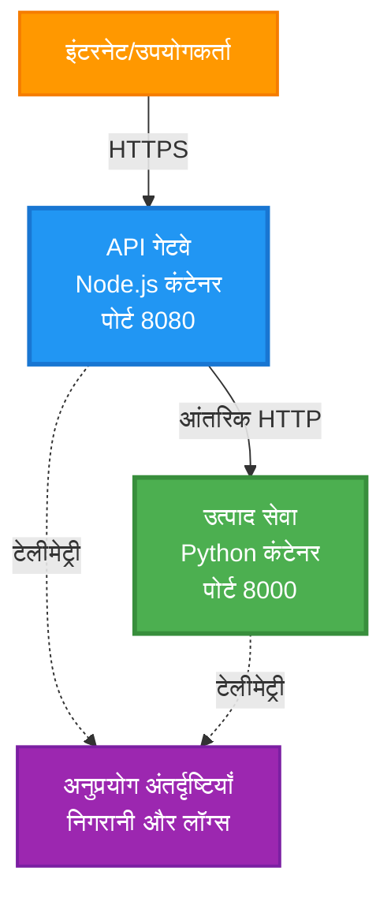
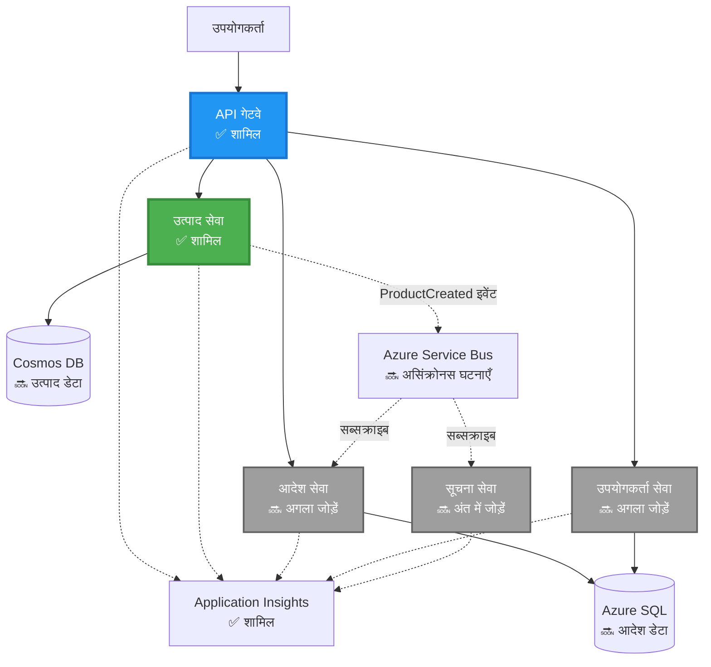
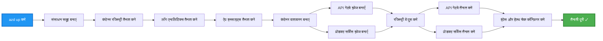
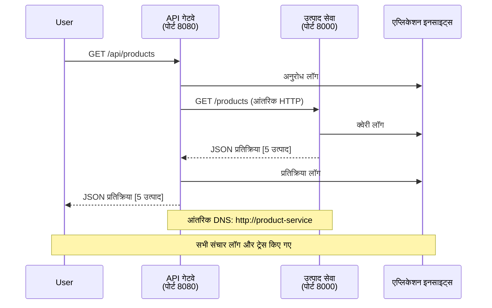

# माइक्रोसर्विस आर्किटेक्चर - कंटेनर ऐप उदाहरण

⏱️ **अनुमानित समय**: 25-35 मिनट | 💰 **अनुमानित लागत**: ~$50-100/माह | ⭐ **कठिनाई**: उन्नत

**📚 सीखने का मार्ग:**
- ← पिछला: [Simple Flask API](../../../../examples/container-app/simple-flask-api) - एकल कंटेनर मूल बातें
- 🎯 **आप यहाँ हैं**: माइक्रोसर्विस आर्किटेक्चर (2-सर्विस आधार)
- → अगला: [AI Integration](../../../../docs/ai-foundry) - अपने सेवाओं में बुद्धिमत्ता जोड़ें
- 🏠 [Course Home](../../README.md)

---

AZD CLI का उपयोग करके Azure Container Apps पर परिनियोजित एक **सरलीकृत लेकिन कार्यात्मक** माइक्रोसर्विस आर्किटेक्चर। यह उदाहरण सेवा-से-सेवा संचार, कंटेनर ऑर्केस्ट्रेशन, और मॉनिटरिंग को एक व्यावहारिक 2-सर्विस सेटअप के साथ प्रदर्शित करता है।

> **📚 सीखने का तरीका**: यह उदाहरण एक न्यूनतम 2-सर्विस आर्किटेक्चर (API Gateway + Backend Service) से शुरू होता है जिसे आप वास्तव में परिनियोजित करके सीख सकते हैं। इस आधार को समझने के बाद, हम पूर्ण माइक्रोसर्विस इकोसिस्टम में विस्तार के लिए मार्गदर्शन प्रदान करते हैं।

## आप क्या सीखेंगे

इस उदाहरण को पूरा करके, आप:
- Azure Container Apps पर कई कंटेनरों को परिनियोजित करना
- आंतरिक नेटवर्किंग के साथ सेवा-से-सेवा संचार लागू करना
- पर्यावरण-आधारित स्केलिंग और स्वास्थ्य जांच कॉन्फ़िगर करना
- Application Insights के साथ वितरित एप्लिकेशंस की निगरानी करना
- माइक्रोसर्विस परिनियोजन पैटर्न और सर्वोत्तम प्रथाओं को समझना
- सरल से जटिल आर्किटेक्चर तक क्रमिक विस्तार सीखना

## आर्किटेक्चर

### चरण 1: हम क्या बना रहे हैं (इस उदाहरण में शामिल)


```mermaid
graph TB
    Internet[इंटरनेट/उपयोगकर्ता]
    Gateway[API गेटवे<br/>Node.js कंटेनर<br/>पोर्ट 8080]
    Product[उत्पाद सेवा<br/>Python कंटेनर<br/>पोर्ट 8000]
    AppInsights[अनुप्रयोग अंतर्दृष्टियाँ<br/>निगरानी और लॉग्स]
    
    Internet -->|HTTPS| Gateway
    Gateway -->|आंतरिक HTTP| Product
    Gateway -.->|टेलीमेट्री| AppInsights
    Product -.->|टेलीमेट्री| AppInsights
    
    style Gateway fill:#2196F3,stroke:#1976D2,stroke-width:3px,color:#fff
    style Product fill:#4CAF50,stroke:#388E3C,stroke-width:3px,color:#fff
    style Internet fill:#FF9800,stroke:#F57C00,stroke-width:2px,color:#fff
    style AppInsights fill:#9C27B0,stroke:#7B1FA2,stroke-width:2px,color:#fff
```
**कंपोनेंट विवरण:**

| घटक | उद्देश्य | पहुँच | संसाधन |
|-----------|---------|--------|-----------|
| **API Gateway** | बैकएंड सेवाओं के लिए बाहरी अनुरोधों को रूट करता है | सार्वजनिक (HTTPS) | 1 vCPU, 2GB RAM, 2-20 रिप्लिकाएँ |
| **Product Service** | इन-मेमोरी डेटा के साथ उत्पाद सूची का प्रबंधन करता है | केवल आंतरिक | 0.5 vCPU, 1GB RAM, 1-10 रिप्लिकाएँ |
| **Application Insights** | केंद्रीकृत लॉगिंग और वितरित ट्रेसिंग | Azure Portal | 1-2 GB/माह डेटा इनजेशन |

**सरल से क्यों शुरू करें?**
- ✅ शीघ्र परिनियोजित और समझें (25-35 मिनट)
- ✅ जटिलता के बिना मूल माइक्रोसर्विस पैटर्न सीखें
- ✅ कार्यरत कोड जिसे आप संसोधित और प्रयोग कर सकते हैं
- ✅ सीखने के लिए कम लागत (~$50-100/माह बनाम $300-1400/माह)
- ✅ डेटाबेस और मैसेज क्वियों को जोड़ने से पहले आत्मविश्वास बनाएं

**उपमा**: इसे ड्राइव करना सीखने जैसा सोचें। आप एक खाली पार्किंग लॉट (2 सेवाएँ) से शुरू करते हैं, बुनियादी बातों में निपुण होते हैं, फिर शहर के ट्रैफिक (5+ सेवाएँ डेटाबेस के साथ) की ओर बढ़ते हैं।

### चरण 2: भविष्य का विस्तार (संदर्भ आर्किटेक्चर)

एक बार जब आप 2-सर्विस आर्किटेक्चर में महारत हासिल कर लेते हैं, तब आप विस्तार कर सकते हैं:


```mermaid
graph TB
    User[उपयोगकर्ता]
    Gateway[API गेटवे<br/>✅ शामिल]
    Product[उत्पाद सेवा<br/>✅ शामिल]
    Order[आदेश सेवा<br/>🔜 अगला जोड़ें]
    UserSvc[उपयोगकर्ता सेवा<br/>🔜 अगला जोड़ें]
    Notify[सूचना सेवा<br/>🔜 अंत में जोड़ें]
    
    CosmosDB[(Cosmos DB<br/>🔜 उत्पाद डेटा)]
    AzureSQL[(Azure SQL<br/>🔜 आदेश डेटा)]
    ServiceBus[Azure Service Bus<br/>🔜 असिंक्रोनस घटनाएँ]
    AppInsights[Application Insights<br/>✅ शामिल]
    
    User --> Gateway
    Gateway --> Product
    Gateway --> Order
    Gateway --> UserSvc
    
    Product --> CosmosDB
    Order --> AzureSQL
    UserSvc --> AzureSQL
    
    Product -.->|ProductCreated इवेंट| ServiceBus
    ServiceBus -.->|सब्सक्राइब| Notify
    ServiceBus -.->|सब्सक्राइब| Order
    
    Gateway -.-> AppInsights
    Product -.-> AppInsights
    Order -.-> AppInsights
    UserSvc -.-> AppInsights
    Notify -.-> AppInsights
    
    style Product fill:#4CAF50,stroke:#388E3C,stroke-width:3px,color:#fff
    style Gateway fill:#2196F3,stroke:#1976D2,stroke-width:3px,color:#fff
    style Order fill:#9E9E9E,stroke:#616161,stroke-width:2px,color:#fff
    style UserSvc fill:#9E9E9E,stroke:#616161,stroke-width:2px,color:#fff
    style Notify fill:#9E9E9E,stroke:#616161,stroke-width:2px,color:#fff
```
कदम-दर-कदम निर्देशों के लिए अंत में "Expansion Guide" अनुभाग देखें।

## शामिल सुविधाएँ

✅ **Service Discovery**: कंटेनरों के बीच स्वचालित DNS-आधारित डिस्कवरी  
✅ **Load Balancing**: रिप्लिकाओं के बीच बिल्ट-इन लोड बैलेंसिंग  
✅ **Auto-scaling**: HTTP अनुरोधों के आधार पर प्रति सेवा स्वतंत्र स्केलिंग  
✅ **Health Monitoring**: दोनों सेवाओं के लिए लाइवनेस और रेडिनेस प्रोब्स  
✅ **Distributed Logging**: Application Insights के साथ केंद्रीकृत लॉगिंग  
✅ **Internal Networking**: सुरक्षित सेवा-से-सेवा संचार  
✅ **Container Orchestration**: स्वचालित परिनियोजन और स्केलिंग  
✅ **Zero-Downtime Updates**: संस्करण प्रबंधन के साथ रोलिंग अपडेट्स  

## आवश्यकताएँ

### आवश्यक टूल्स

शुरू करने से पहले, सत्यापित करें कि ये टूल्स आपके पास इंस्टॉल हैं:

1. **[Azure Developer CLI (azd)](https://learn.microsoft.com/azure/developer/azure-developer-cli/install-azd)** (संस्करण 1.0.0 या उच्चतर)
   ```bash
   azd version
   # अपेक्षित आउटपुट: azd संस्करण 1.0.0 या उससे उच्चतर
   ```

2. **[Azure CLI](https://learn.microsoft.com/cli/azure/install-azure-cli)** (संस्करण 2.50.0 या उच्चतर)
   ```bash
   az --version
   # अपेक्षित आउटपुट: azure-cli 2.50.0 या उससे ऊपर
   ```

3. **[Docker](https://www.docker.com/get-started)** (स्थानीय विकास/परीक्षण के लिए - वैकल्पिक)
   ```bash
   docker --version
   # अपेक्षित आउटपुट: Docker संस्करण 20.10 या उससे ऊपर
   ```

### अपनी सेटअप को सत्यापित करें

तैयार होने की पुष्टि करने के लिए ये कमांड चलाएँ:

```bash
# Azure Developer CLI की जाँच करें
azd version
# ✅ अपेक्षित: azd संस्करण 1.0.0 या उससे ऊपर

# Azure CLI की जाँच करें
az --version
# ✅ अपेक्षित: azure-cli 2.50.0 या उससे ऊपर

# Docker की जाँच करें (वैकल्पिक)
docker --version
# ✅ अपेक्षित: Docker संस्करण 20.10 या उससे ऊपर
```

**सफलता मानदंड**: सभी कमांड्स न्यूनतम संस्करणों के बराबर या उनसे अधिक संस्करण संख्याएँ लौटाएँ।

### Azure आवश्यकताएँ

- एक सक्रिय **Azure सदस्यता** ([मुफ्त खाता बनाएं](https://azure.microsoft.com/free/))
- अपनी सदस्यता में संसाधन बनाने की अनुमतियाँ
- सदस्यता या रिसोर्स समूह पर **Contributor** भूमिका

### ज्ञान पूर्वापेक्षाएँ

यह एक **उन्नत-स्तर** उदाहरण है। आपके पास होना चाहिए:
- [Simple Flask API उदाहरण](../../../../examples/container-app/simple-flask-api) पूरा किया हुआ 
- माइक्रोसर्विस आर्किटेक्चर की मूल समझ
- REST APIs और HTTP से परिचित होना
- कंटेनर अवधारणाओं की समझ

**Container Apps में नए हैं?** बुनियादी जानने के लिए पहले [Simple Flask API example](../../../../examples/container-app/simple-flask-api) से शुरू करें।

## त्वरित शुरुआत (कदम-दर-कदम)

### चरण 1: क्लोन करें और नेविगेट करें

```bash
git clone https://github.com/microsoft/AZD-for-beginners.git
cd AZD-for-beginners/examples/microservices
```

**✓ सफलता जांच**: सत्यापित करें कि आप `azure.yaml` देख रहे हैं:
```bash
ls
# अपेक्षित: README.md, azure.yaml, infra/, src/
```

### चरण 2: Azure के साथ प्रमाणीकृत करें

```bash
azd auth login
```

यह Azure प्रमाणिकरण के लिए आपका ब्राउज़र खोलता है। अपने Azure प्रमाण-पत्रों से साइन इन करें।

**✓ सफलता जांच**: आपको यह दिखना चाहिए:
```
Logged in to Azure.
```

### चरण 3: वातावरण आरंभ करें

```bash
azd init
```

**प्रॉम्प्ट्स जो आप देखेंगे**:
- **पर्यावरण का नाम**: एक छोटा नाम दर्ज करें (उदा., `microservices-dev`)
- **Azure subscription**: अपनी सदस्यता चुनें
- **Azure location**: एक क्षेत्र चुनें (उदा., `eastus`, `westeurope`)

**✓ सफलता जांच**: आपको यह दिखना चाहिए:
```
SUCCESS: New project initialized!
```

### चरण 4: इन्फ्रास्ट्रक्चर और सेवाएँ परिनियोजित करें

```bash
azd up
```

**क्या होता है** (8-12 मिनट लगते हैं):


```mermaid
graph LR
    A[azd up करें] --> B[संसाधन समूह बनाएं]
    B --> C[कंटेनर रजिस्ट्री तैनात करें]
    C --> D[लॉग एनालिटिक्स तैनात करें]
    D --> E[ऐप इनसाइट्स तैनात करें]
    E --> F[कंटेनर वातावरण बनाएं]
    F --> G[API गेटवे इमेज बनाएँ]
    F --> H[प्रोडक्ट सर्विस इमेज बनाएँ]
    G --> I[रजिस्ट्री में पुश करें]
    H --> I
    I --> J[API गेटवे तैनात करें]
    I --> K[प्रोडक्ट सर्विस तैनात करें]
    J --> L[इंग्रेस और हेल्थ चेक कॉन्फ़िगर करें]
    K --> L
    L --> M[तैनाती पूरी ✓]
    
    style A fill:#2196F3,stroke:#1976D2,stroke-width:3px,color:#fff
    style M fill:#4CAF50,stroke:#388E3C,stroke-width:3px,color:#fff
```
**✓ सफलता जांच**: आपको यह दिखना चाहिए:
```
SUCCESS: Your application was deployed to Azure in X minutes Y seconds.
Endpoint: https://api-gateway-<unique-id>.azurecontainerapps.io
```

**⏱️ समय**: 8-12 मिनट

### चरण 5: परिनियोजन का परीक्षण करें

```bash
# गेटवे एंडपॉइंट प्राप्त करें
GATEWAY_URL=$(azd env get-values | grep API_GATEWAY_URL | cut -d '=' -f2 | tr -d '"')

# API गेटवे के स्वास्थ्य का परीक्षण करें
curl $GATEWAY_URL/health
```

**✅ अपेक्षित आउटपुट:**
```json
{
  "status": "healthy",
  "service": "api-gateway",
  "timestamp": "2025-11-19T10:30:00Z"
}
```

**गेटवे के माध्यम से प्रोडक्ट सेवा का परीक्षण करें**:
```bash
# उत्पादों को सूचीबद्ध करें
curl $GATEWAY_URL/api/products
```

**✅ अपेक्षित आउटपुट:**
```json
[
  {"id":1,"name":"Laptop","price":999.99,"stock":50},
  {"id":2,"name":"Mouse","price":29.99,"stock":200},
  {"id":3,"name":"Keyboard","price":79.99,"stock":150}
]
```

**✓ सफलता जांच**: दोनों एंडपॉइंट बिना त्रुटि के JSON डेटा लौटाते हैं।

---

**🎉 बधाई हो!** आपने Azure पर एक माइक्रोसर्विस आर्किटेक्चर परिनियोजित कर लिया है!

## प्रोजेक्ट संरचना

सभी कार्यान्वयन फाइलें शामिल हैं—यह एक पूर्ण, कार्यशील उदाहरण है:

```
microservices/
│
├── README.md                         # This file
├── azure.yaml                        # AZD configuration
├── .gitignore                        # Git ignore patterns
│
├── infra/                           # Infrastructure as Code (Bicep)
│   ├── main.bicep                   # Main orchestration
│   ├── abbreviations.json           # Naming conventions
│   ├── core/                        # Shared infrastructure
│   │   ├── container-apps-environment.bicep  # Container environment + registry
│   │   └── monitor.bicep            # Application Insights + Log Analytics
│   └── app/                         # Service definitions
│       ├── api-gateway.bicep        # API Gateway container app
│       └── product-service.bicep    # Product Service container app
│
└── src/                             # Application source code
    ├── api-gateway/                 # Node.js API Gateway
    │   ├── app.js                   # Express server with routing
    │   ├── package.json             # Node dependencies
    │   └── Dockerfile               # Container definition
    └── product-service/             # Python Product Service
        ├── main.py                  # Flask API with product data
        ├── requirements.txt         # Python dependencies
        └── Dockerfile               # Container definition
```

**प्रत्येक कंपोनेंट क्या करता है:**

**इन्फ्रास्ट्रक्चर (infra/)**:
- `main.bicep`: सभी Azure संसाधनों और उनकी निर्भरताओं का ऑर्केस्ट्रेट करता है
- `core/container-apps-environment.bicep`: Container Apps वातावरण और Azure Container Registry बनाता है
- `core/monitor.bicep`: वितरित लॉगिंग के लिए Application Insights सेट करता है
- `app/*.bicep`: स्केलिंग और स्वास्थ्य जांच के साथ व्यक्तिगत कंटेनर ऐप परिभाषाएँ

**API Gateway (src/api-gateway/)**:
- बाह्य-सम्मुख सेवा जो अनुरोधों को बैकएंड सेवाओं की ओर रूट करती है
- लॉगिंग, त्रुटि हैंडलिंग, और अनुरोध अग्रेषण लागू करता है
- सेवा-से-सेवा HTTP संचार को प्रदर्शित करता है

**Product Service (src/product-service/)**:
- प्रोडक्ट कैटलॉग के साथ आंतरिक सेवा (सरलता के लिए इन-मेमोरी)
- हेल्थ चेक्स के साथ REST API
- बैकएंड माइक्रोसर्विस पैटर्न का उदाहरण

## सेवाओं का अवलोकन

### API Gateway (Node.js/Express)

**पोर्ट**: 8080  
**पहुँच**: सार्वजनिक (बाहरी इनग्रेश)  
**उद्देश्य**: आने वाले अनुरोधों को उपयुक्त बैकएंड सेवाओं की ओर रूट करता है  

**एंडपॉइंट्स**:
- `GET /` - Service information
- `GET /health` - Health check endpoint
- `GET /api/products` - Forward to product service (list all)
- `GET /api/products/:id` - Forward to product service (get by ID)

**मुख्य विशेषताएँ**:
- axios के साथ अनुरोध रूटिंग
- केंद्रीकृत लॉगिंग
- त्रुटि हैंडलिंग और टाइमआउट प्रबंधन
- पर्यावरण चर के माध्यम से सेवा डिस्कवरी
- Application Insights एकीकरण

**कोड हाइलाइट** (`src/api-gateway/app.js`):
```javascript
// आंतरिक सेवा संचार
app.get('/api/products', async (req, res) => {
  const response = await axios.get(`${PRODUCT_SERVICE_URL}/products`, {
    timeout: 5000
  });
  res.json(response.data);
});
```

### Product Service (Python/Flask)

**पोर्ट**: 8000  
**पहुँच**: केवल आंतरिक (कोई बाहरी इनग्रेश नहीं)  
**उद्देश्य**: इन-मेमोरी डेटा के साथ प्रोडक्ट कैटलॉग का प्रबंधन करता है  

**एंडपॉइंट्स**:
- `GET /` - Service information
- `GET /health` - Health check endpoint
- `GET /products` - List all products
- `GET /products/<id>` - Get product by ID

**मुख्य विशेषताएँ**:
- Flask के साथ RESTful API
- इन-मेमोरी प्रोडक्ट स्टोर (सरल, किसी डेटाबेस की आवश्यकता नहीं)
- प्रोब्स के साथ स्वास्थ्य निगरानी
- संरचित लॉगिंग
- Application Insights एकीकरण

**डेटा मॉडल**:
```python
{
  "id": 1,
  "name": "Laptop",
  "description": "High-performance laptop",
  "price": 999.99,
  "stock": 50
}
```

**केवल आंतरिक क्यों?**
प्रोडक्ट सेवा सार्वजनिक रूप से एक्सपोज़ नहीं की गई है। सभी अनुरोध API Gateway के माध्यम से ही जाने चाहिए, जो प्रदान करता है:
- सुरक्षा: नियंत्रित पहुँच बिंदु
- लचीलापन: क्लाइंट्स को प्रभावित किए बिना बैकएंड बदल सकते हैं
- निगरानी: केंद्रीकृत अनुरोध लॉगिंग

## सेवा संचार को समझना

### सेवाएँ एक दूसरे से कैसे बात करती हैं


```mermaid
sequenceDiagram
    participant User
    participant Gateway as API गेटवे<br/>(पोर्ट 8080)
    participant Product as उत्पाद सेवा<br/>(पोर्ट 8000)
    participant AI as एप्लिकेशन इनसाइट्स
    
    User->>Gateway: GET /api/products
    Gateway->>AI: अनुरोध लॉग
    Gateway->>Product: GET /products (आंतरिक HTTP)
    Product->>AI: क्वेरी लॉग
    Product-->>Gateway: JSON प्रतिक्रिया [5 उत्पाद]
    Gateway->>AI: प्रतिक्रिया लॉग
    Gateway-->>User: JSON प्रतिक्रिया [5 उत्पाद]
    
    Note over Gateway,Product: आंतरिक DNS: http://product-service
    Note over User,AI: सभी संचार लॉग और ट्रेस किए गए
```
इस उदाहरण में, API Gateway **आंतरिक HTTP कॉल्स** का उपयोग करके Product Service के साथ संचार करता है:

```javascript
// API गेटवे (src/api-gateway/app.js)
const PRODUCT_SERVICE_URL = process.env.PRODUCT_SERVICE_URL;

// आंतरिक HTTP अनुरोध करें
const response = await axios.get(`${PRODUCT_SERVICE_URL}/products`);
```

**मुख्य बिंदु**:

1. **DNS-आधारित डिस्कवरी**: Container Apps स्वचालित रूप से आंतरिक सेवाओं के लिए DNS प्रदान करता है
   - Product Service का FQDN: `product-service.internal.<environment>.azurecontainerapps.io`
   - सरलीकृत रूप: `http://product-service` (Container Apps इसे हल करता है)

2. **कोई सार्वजनिक एक्सपोज़र नहीं**: Product Service में Bicep में `external: false` है
   - केवल Container Apps वातावरण के भीतर ही पहुंच योग्य है
   - इंटरनेट से पहुँच योग्य नहीं है

3. **पर्यावरण चर**: सेवा URL परिनियोजन समय पर इंजेक्ट किए जाते हैं
   - Bicep आंतरिक FQDN को gateway को पास करता है
   - ऐप्लिकेशन कोड में कोई हार्डकोडेड URL नहीं हैं

**उपमा**: इसे कार्यालय के कमरों की तरह सोचें। API Gateway रिसेप्शन डेस्क (सार्वजनिक-सम्मुख) है, और Product Service एक कार्यालय कक्ष (केवल आंतरिक) है। आगंतुक किसी भी कार्यालय तक पहुँचने के लिए रिसेप्शन के माध्यम से ही जाने होंगे।

## परिनियोजन विकल्प

### पूर्ण परिनियोजन (अनुशंसित)

```bash
# बुनियादी ढाँचा और दोनों सेवाओं को तैनात करें
azd up
```

यह परिनियोजित करता है:
1. Container Apps वातावरण
2. Application Insights
3. Container Registry
4. API Gateway कंटेनर
5. Product Service कंटेनर

**समय**: 8-12 मिनट

### व्यक्तिगत सेवा परिनियोजित करें

```bash
# केवल एक सेवा तैनात करें (प्रारंभिक azd up के बाद)
azd deploy api-gateway

# या उत्पाद सेवा तैनात करें
azd deploy product-service
```

**उपयोग मामला**: जब आपने एक सेवा में कोड अपडेट किया हो और केवल उस सेवा को फिर से परिनियोजित करना चाहते हों।

### कॉन्फ़िगरेशन अपडेट करें

```bash
# स्केलिंग पैरामीटर बदलें
azd env set GATEWAY_MAX_REPLICAS 30

# नए विन्यास के साथ पुनः तैनात करें
azd up
```

## कॉन्फ़िगरेशन

### स्केलिंग कॉन्फ़िगरेशन

दोनों सेवाएँ उनके Bicep फाइलों में HTTP-आधारित ऑटोसकेलिंग के साथ कॉन्फ़िगर हैं:

**API Gateway**:
- Min replicas: 2 (उपलब्धता के लिए हमेशा कम से कम 2)
- Max replicas: 20
- Scale trigger: प्रति रिप्लिका 50 समकालिक अनुरोध

**Product Service**:
- Min replicas: 1 (आवश्यक होने पर शून्य तक स्केल कर सकता है)
- Max replicas: 10
- Scale trigger: प्रति रिप्लिका 100 समकालिक अनुरोध

**स्केलिंग अनुकूलित करें** (`infra/app/*.bicep` में):
```bicep
scale: {
  minReplicas: 1
  maxReplicas: 10
  rules: [
    {
      name: 'http-scale-rule'
      http: {
        metadata: {
          concurrentRequests: '100'  // Adjust this
        }
      }
    }
  ]
}
```

### संसाधन आवंटन

**API Gateway**:
- CPU: 1.0 vCPU
- मेमोरी: 2 GiB
- कारण: सभी बाहरी ट्रैफ़िक को संभालता है

**Product Service**:
- CPU: 0.5 vCPU
- मेमोरी: 1 GiB
- कारण: हल्के इन-मेमोरी ऑपरेशंस

### स्वास्थ्य जांच

दोनों सेवाओं में लाइवनेस और रेडिनेस प्रोब्स शामिल हैं:

```bicep
probes: [
  {
    type: 'Liveness'
    httpGet: {
      path: '/health'
      port: 8080
    }
    initialDelaySeconds: 10
    periodSeconds: 30
  }
  {
    type: 'Readiness'
    httpGet: {
      path: '/health'
      port: 8080
    }
    initialDelaySeconds: 5
    periodSeconds: 10
  }
]
```

**इसका अर्थ**:
- **Liveness**: यदि स्वास्थ्य जांच विफल होती है, तो Container Apps कंटेनर को रीस्टार्ट करता है
- **Readiness**: यदि तैयार नहीं है, तो Container Apps उस रिप्लिका की ओर ट्रैफ़िक रूट करना रोक देता है

## मॉनिटरिंग और ऑब्जर्वेबिलिटी

### सेवा लॉग देखें

```bash
# azd monitor का उपयोग करके लॉग देखें
azd monitor --logs

# या विशिष्ट Container Apps के लिए Azure CLI का उपयोग करें:
# API Gateway से लॉग स्ट्रीम करें
az containerapp logs show --name api-gateway --resource-group $RG_NAME --follow

# उत्पाद सेवा के हाल के लॉग देखें
az containerapp logs show --name product-service --resource-group $RG_NAME --tail 100
```

**अपेक्षित आउटपुट**:
```
[api-gateway] API Gateway listening on port 8080
[api-gateway] Product Service URL: http://product-service
[api-gateway] GET /api/products 200 - 45ms
[product-service] Retrieved 5 products
```

### Application Insights क्वेरीज

Azure Portal में Application Insights तक पहुँचें, फिर ये क्वेरीज़ चलाएँ:

**धीरे अनुरोध खोजें**:
```kusto
requests
| where timestamp > ago(1h)
| where duration > 1000  // Requests taking >1 second
| summarize count() by name, cloud_RoleName
| order by count_ desc
```

**सेवा-से-सेवा कॉल ट्रैक करें**:
```kusto
dependencies
| where timestamp > ago(1h)
| where type == "Http"
| project timestamp, name, target, duration, success
| order by timestamp desc
```

**सेवा द्वारा त्रुटि दर**:
```kusto
exceptions
| where timestamp > ago(24h)
| summarize errorCount = count() by cloud_RoleName, type
| order by errorCount desc
```

**समय के साथ अनुरोध मात्रा**:
```kusto
requests
| where timestamp > ago(1h)
| summarize requestCount = count() by bin(timestamp, 5m), cloud_RoleName
| render timechart
```

### मॉनिटरिंग डैशबोर्ड तक पहुँच

```bash
# Application Insights के विवरण प्राप्त करें
azd env get-values | grep APPLICATIONINSIGHTS

# Azure पोर्टल पर मॉनिटरिंग खोलें
az monitor app-insights component show \
  --app $(azd env get-values | grep APPLICATIONINSIGHTS_CONNECTION_STRING | cut -d '=' -f2) \
  --resource-group $(azd env get-values | grep AZURE_RESOURCE_GROUP | cut -d '=' -f2) \
  --query "appId" -o tsv
```

### लाइव मेट्रिक्स

1. Azure Portal में Application Insights पर जाएँ
2. "Live Metrics" पर क्लिक करें
3. रीयल-टाइम अनुरोध, फेल्योर, और प्रदर्शन देखें
4. परीक्षण करने के लिए चलाएँ: `curl $(azd env get-values | grep API_GATEWAY_URL | cut -d '=' -f2 | tr -d '"')/api/products`

## व्यावहारिक अभ्यास

### अभ्यास 1: नया प्रोडक्ट एंडपॉइंट जोड़ें ⭐ (आसान)

**लक्ष्य**: नए उत्पाद बनाने के लिए एक POST एंडपॉइंट जोड़ें

**शुरुआत बिंदु**: `src/product-service/main.py`

**कदम**:

1. `main.py` में `get_product` फ़ंक्शन के बाद यह एंडपॉइंट जोड़ें:

```python
@app.route('/products', methods=['POST'])
def create_product():
    """Create a new product"""
    data = request.get_json()
    
    # अनिवार्य फ़ील्ड्स सत्यापित करें
    if not data or 'name' not in data or 'price' not in data:
        return jsonify({'error': 'Missing required fields: name, price'}), 400
    
    new_id = max(p['id'] for p in products) + 1
    new_product = {
        'id': new_id,
        'name': data['name'],
        'description': data.get('description', ''),
        'price': float(data['price']),
        'stock': int(data.get('stock', 0))
    }
    products.append(new_product)
    logger.info(f"Created product {new_id}")
    return jsonify(new_product), 201
```

2. API Gateway (`src/api-gateway/app.js`) में POST रूट जोड़ें:

```javascript
// GET /api/products रूट के बाद इसे जोड़ें
app.post('/api/products', async (req, res) => {
  try {
    console.log(`Forwarding POST request to ${PRODUCT_SERVICE_URL}/products`);
    const response = await axios.post(`${PRODUCT_SERVICE_URL}/products`, req.body, {
      timeout: 5000
    });
    res.status(201).json(response.data);
  } catch (error) {
    console.error('Error calling product service:', error.message);
    res.status(503).json({
      error: 'Product service unavailable',
      message: error.message
    });
  }
});
```

3. दोनों सेवाओं को पुनः तैनात करें:

```bash
azd deploy product-service
azd deploy api-gateway
```

4. नए एंडपॉइंट का परीक्षण करें:

```bash
GATEWAY_URL=$(azd env get-values | grep API_GATEWAY_URL | cut -d '=' -f2 | tr -d '"')

# एक नया उत्पाद बनाएं
curl -X POST $GATEWAY_URL/api/products \
  -H "Content-Type: application/json" \
  -d '{"name":"USB Cable","price":9.99,"stock":500}'
```

**✅ अपेक्षित आउटपुट:**
```json
{"id":6,"name":"USB Cable","description":"","price":9.99,"stock":500}
```

5. सत्यापित करें कि यह सूची में दिखाई देता है:

```bash
curl $GATEWAY_URL/api/products
# अब नए USB केबल सहित 6 उत्पाद दिखने चाहिए
```

**सफलता मानदंड**:
- ✅ POST अनुरोध HTTP 201 लौटाता है
- ✅ नया उत्पाद GET /api/products सूची में दिखाई देता है
- ✅ उत्पाद का ID ऑटो-इन्क्रीमेंट होता है

**समय**: 10-15 मिनट

---

### अभ्यास 2: ऑटोस्केलिंग नियम संशोधित करें ⭐⭐ (मध्यम)

**लक्ष्य**: Product Service को अधिक आक्रामक रूप से स्केल करने के लिए बदलें

**प्रारंभिक बिंदु**: `infra/app/product-service.bicep`

**कदम**:

1. `infra/app/product-service.bicep` खोलें और `scale` ब्लॉक खोजें (लगभग लाइन 95 पर)

2. निम्न से बदलें:
```bicep
scale: {
  minReplicas: 1
  maxReplicas: 10
  rules: [
    {
      name: 'http-scale-rule'
      http: {
        metadata: {
          concurrentRequests: '100'  // OLD
        }
      }
    }
  ]
}
```

इसमें:
```bicep
scale: {
  minReplicas: 2  // Always have 2 running
  maxReplicas: 20  // Allow more scaling
  rules: [
    {
      name: 'http-scale-rule'
      http: {
        metadata: {
          concurrentRequests: '20'  // Scale at lower threshold
        }
      }
    }
  ]
}
```

3. इन्फ्रास्ट्रक्चर को पुनः तैनात करें:

```bash
azd up
```

4. नए स्केलिंग कॉन्फ़िगरेशन को सत्यापित करें:

```bash
az containerapp show \
  --name $(azd env get-values | grep PRODUCT_SERVICE | head -1 | cut -d '/' -f5) \
  --resource-group $(azd env get-values | grep AZURE_RESOURCE_GROUP | cut -d '=' -f2 | tr -d '"') \
  --query "properties.template.scale" -o json
```

**✅ अपेक्षित आउटपुट:**
```json
{
  "minReplicas": 2,
  "maxReplicas": 20,
  "rules": [...]
}
```

5. लोड के साथ ऑटोस्केलिंग का परीक्षण करें:

```bash
# समानांतर अनुरोध उत्पन्न करें
for i in {1..500}; do curl $GATEWAY_URL/api/products & done

# Azure CLI का उपयोग करके स्केलिंग होते हुए देखें
az containerapp logs show --name product-service --resource-group $RG_NAME --follow
# ध्यान दें: Container Apps के स्केलिंग घटनाएँ
```

**सफलता मानदंड**:
- ✅ Product Service हमेशा कम से कम 2 replicas पर चलता है
- ✅ लोड के तहत, 2 से अधिक replicas तक स्केल होता है
- ✅ Azure Portal नए स्केलिंग नियम दिखाता है

**समय**: 15-20 मिनट

---

### अभ्यास 3: कस्टम मॉनिटरिंग क्वेरी जोड़ें ⭐⭐ (मध्यम)

**लक्ष्य**: Product API प्रदर्शन को ट्रैक करने के लिए एक कस्टम Application Insights क्वेरी बनाएं

**कदम**:

1. Azure Portal में Application Insights पर जाएँ:
   - Azure Portal पर जाएँ
   - अपनी resource group (rg-microservices-*) खोजें
   - Application Insights resource पर क्लिक करें

2. बाएँ मेनू में "Logs" पर क्लिक करें

3. यह क्वेरी बनाएं:

```kusto
requests
| where timestamp > ago(1h)
| where name contains "products"
| summarize 
    RequestCount = count(),
    AvgDuration = avg(duration),
    P95Duration = percentile(duration, 95),
    SuccessRate = 100.0 * countif(success == true) / count()
  by bin(timestamp, 5m)
| render timechart
```

4. क्वेरी चलाने के लिए "Run" पर क्लिक करें

5. क्वेरी को सहेजें:
   - "Save" पर क्लिक करें
   - नाम: "Product API Performance"
   - श्रेणी: "Performance"

6. परीक्षण ट्रैफ़िक जनरेट करें:

```bash
for i in {1..100}; do curl $GATEWAY_URL/api/products; sleep 1; done
```

7. डेटा देखने के लिए क्वेरी को रिफ्रेश करें

**✅ अपेक्षित आउटपुट:**
- चार्ट जो समय के साथ अनुरोधों की गिनती दिखाता है
- औसत अवधि < 500ms
- सफलता दर = 100%
- 5 मिनट के समय-बिन

**सफलता मानदंड**:
- ✅ क्वेरी 100+ अनुरोध दिखाती है
- ✅ सफलता दर 100% है
- ✅ औसत अवधि < 500ms
- ✅ चार्ट 5-मिनट के समय-बिन दिखाता है

**सीखने का परिणाम**: कस्टम क्वेरियों के साथ सेवा प्रदर्शन की निगरानी कैसे करें यह समझें

**समय**: 10-15 मिनट

---

### अभ्यास 4: रीट्राई लॉजिक लागू करें ⭐⭐⭐ (उन्नत)

**लक्ष्य**: जब Product Service अस्थायी रूप से अनुपलब्ध हो तो API Gateway में retry लॉजिक जोड़ें

**प्रारंभिक बिंदु**: `src/api-gateway/app.js`

**कदम**:

1. retry लाइब्रेरी इंस्टॉल करें:

```bash
cd src/api-gateway
npm install axios-retry --save
cd ../..
```

2. `src/api-gateway/app.js` अपडेट करें (axios इम्पोर्ट के बाद जोड़ें):

```javascript
const axiosRetry = require('axios-retry');

// रीट्राई लॉजिक कॉन्फ़िगर करें
axiosRetry(axios, {
  retries: 3,
  retryDelay: (retryCount) => {
    return retryCount * 1000; // 1 सेकंड, 2 सेकंड, 3 सेकंड
  },
  retryCondition: (error) => {
    // नेटवर्क त्रुटियों या 5xx प्रतिक्रियाओं पर पुनः प्रयास करें
    return axiosRetry.isNetworkOrIdempotentRequestError(error) ||
           (error.response && error.response.status >= 500);
  }
});

console.log('Retry logic configured: 3 retries with exponential backoff');
```

3. API Gateway को पुनः तैनात करें:

```bash
azd deploy api-gateway
```

4. सेवा विफलता का अनुकरण करके retry व्यवहार का परीक्षण करें:

```bash
# प्रोडक्ट सेवा को 0 पर स्केल करें (असफलता का अनुकरण)
az containerapp update \
  --name $(azd env get-values | grep PRODUCT_SERVICE | head -1 | cut -d '/' -f5) \
  --resource-group $(azd env get-values | grep AZURE_RESOURCE_GROUP | cut -d '=' -f2 | tr -d '"') \
  --min-replicas 0 \
  --max-replicas 0

# उत्पादों तक पहुँचने का प्रयास करें (3 बार पुनः प्रयास करेगा)
time curl -v $GATEWAY_URL/api/products
# ध्यान दें: प्रतिक्रिया लगभग 6 सेकंड लेती है (1s + 2s + 3s पुनः प्रयास)

# प्रोडक्ट सेवा बहाल करें
az containerapp update \
  --name $(azd env get-values | grep PRODUCT_SERVICE | head -1 | cut -d '/' -f5) \
  --resource-group $(azd env get-values | grep AZURE_RESOURCE_GROUP | cut -d '=' -f2 | tr -d '"') \
  --min-replicas 1 \
  --max-replicas 10
```

5. retry लॉग देखें:

```bash
az containerapp logs show --name api-gateway --resource-group $RG_NAME --tail 50
# खोजें: पुनः प्रयास के संदेश
```

**✅ अपेक्षित व्यवहार:**
- अनुरोध विफल होने से पहले 3 बार retry होते हैं
- हर retry अधिक देर प्रतीक्षा करता है (1s, 2s, 3s)
- सेवा के पुनःआरंभ होने के बाद अनुरोध सफल होते हैं
- लॉग retry प्रयास दिखाते हैं

**सफलता मानदंड**:
- ✅ अनुरोध विफल होने से पहले 3 बार retry होते हैं
- ✅ हर retry अधिक देर प्रतीक्षा करता है (exponential backoff)
- ✅ सेवा के पुनःआरंभ होने के बाद अनुरोध सफल होते हैं
- ✅ लॉग retry प्रयास दिखाते हैं

**सीखने का परिणाम**: माइक्रोसर्विसेज़ में मजबूती पैटर्न (circuit breakers, retries, timeouts) को समझें

**समय**: 20-25 मिनट

---

## ज्ञान जाँचबिंदु

इस उदाहरण को पूरा करने के बाद, अपनी समझ को सत्यापित करें:

### 1. सेवा संचार ✓

अपने ज्ञान का परीक्षण करें:
- [ ] क्या आप समझा सकते हैं कि API Gateway Product Service को कैसे खोजता/ढूँढता है? (DNS-based service discovery)
- [ ] यदि Product Service डाउन है तो क्या होता है? (Gateway returns 503 error)
- [ ] आप तीसरी सेवा कैसे जोड़ेंगे? (नई Bicep फ़ाइल बनाएं, main.bicep में जोड़ें, src फ़ोल्डर बनाएं)

**व्यावहारिक सत्यापन:**
```bash
# सेवा विफलता का अनुकरण करें
az containerapp update --name <product-service-name> --min-replicas 0 --max-replicas 0
curl $GATEWAY_URL/api/products
# ✅ अपेक्षित: 503 सेवा अनुपलब्ध

# सेवा बहाल करें
az containerapp update --name <product-service-name> --min-replicas 1 --max-replicas 10
```

### 2. मॉनिटरिंग और अवलोकनीयता ✓

अपने ज्ञान का परीक्षण करें:
- [ ] आप वितरित लॉग्स कहां देखते हैं? (Application Insights in Azure Portal)
- [ ] आप धीमे अनुरोधों को कैसे ट्रैक करते हैं? (Kusto क्वेरी: `requests | where duration > 1000`)
- [ ] क्या आप पहचान सकते हैं कि किस सेवा ने त्रुटि उत्पन्न की? (लॉग में `cloud_RoleName` फ़ील्ड जांचें)

**व्यावहारिक सत्यापन:**
```bash
# धीमे अनुरोध का सिमुलेशन उत्पन्न करें
curl "$GATEWAY_URL/api/products?delay=2000"

# धीमे अनुरोधों के लिए Application Insights से क्वेरी करें
# Azure पोर्टल → Application Insights → Logs पर जाएँ
# चलाएँ: requests | where duration > 1000 | project timestamp, name, duration, cloud_RoleName
```

### 3. स्केलिंग और प्रदर्शन ✓

अपने ज्ञान का परीक्षण करें:
- [ ] क्या ऑटोस्केलिंग को ट्रिगर करता है? (HTTP concurrent request नियम: gateway के लिए 50, product के लिए 100)
- [ ] अभी कितनी प्रतियाँ चल रही हैं? (जांचें: `az containerapp revision list`)
- [ ] आप Product Service को 5 प्रतियों तक कैसे स्केल करेंगे? (Bicep में minReplicas अपडेट करें)

**व्यावहारिक सत्यापन:**
```bash
# ऑटोस्केलिंग का परीक्षण करने के लिए लोड उत्पन्न करें
for i in {1..1000}; do curl $GATEWAY_URL/api/products & done

# Azure CLI का उपयोग करके रेप्लिकाएँ बढ़ते हुए देखें
az containerapp logs show --name api-gateway --resource-group $RG_NAME --follow
# ✅ अपेक्षित: लॉग में स्केलिंग घटनाएँ दिखाई दें
```

**सफलता मानदंड**: आप सभी प्रश्नों का उत्तर दे सकते हैं और व्यावहारिक कमांड से सत्यापित कर सकते हैं।

---

## लागत विश्लेषण

### अनुमानित मासिक लागत (इस 2-सेवा उदाहरण के लिए)

| संसाधन | विन्यास | अनुमानित लागत |
|----------|--------------|----------------|
| API Gateway | 2-20 replicas, 1 vCPU, 2GB RAM | $30-150 |
| Product Service | 1-10 replicas, 0.5 vCPU, 1GB RAM | $15-75 |
| Container Registry | Basic tier | $5 |
| Application Insights | 1-2 GB/month | $5-10 |
| Log Analytics | 1 GB/month | $3 |
| **कुल** | | **$58-243/month** |

### उपयोग के अनुसार लागत विभाजन

**हल्का ट्रैफ़िक** (परीक्षण/अध्ययन): ~$60/month
- API Gateway: 2 replicas × 24/7 = $30
- Product Service: 1 replica × 24/7 = $15
- Monitoring + Registry = $13

**मध्यम ट्रैफिक** (छोटा उत्पादन): ~$120/month
- API Gateway: औसत 5 replicas = $75
- Product Service: औसत 3 replicas = $45
- Monitoring + Registry = $13

**उच्च ट्रैफिक** (व्यस्त अवधि): ~$240/month
- API Gateway: औसत 15 replicas = $225
- Product Service: औसत 8 replicas = $120
- Monitoring + Registry = $13

### लागत अनुकूलन सुझाव

1. **डेवलपमेंट के लिए Scale to Zero**:
   ```bicep
   scale: {
     minReplicas: 0  // Save $30-40/month when not in use
     maxReplicas: 10
   }
   ```

2. **Cosmos DB के लिए Consumption Plan का उपयोग करें** (जब आप इसे जोड़ें):
   - आप जो उपयोग करते हैं उसके लिए ही भुगतान करें
   - कोई न्यूनतम चार्ज नहीं

3. **Application Insights में Sampling सेट करें**:
   ```javascript
   appInsights.defaultClient.config.samplingPercentage = 50; // अनुरोधों का 50% नमूना लें
   ```

4. **जब आवश्यक न हो तो साफ़ करें**:
   ```bash
   azd down --force --purge
   ```

### फ्री टियर विकल्प

अध्ययन/परीक्षण के लिए, विचार करें:
- ✅ Azure फ्री क्रेडिट का उपयोग करें ($200 पहले 30 दिन के लिए नए खातों पर)
- ✅ न्यूनतम replicas रखें (लगभग 50% लागत बचती है)
- ✅ परीक्षण के बाद हटाएँ (कोई निरंतर शुल्क नहीं)
- ✅ अध्ययन सत्रों के बीच scale to zero करें

**उदाहरण**: इस उदाहरण को 2 घंटे/दिन × 30 दिन चलाने पर = ~$5/माह बजाय $60/माह

---

## समस्या निवारण त्वरित संदर्भ

### समस्या: `azd up` fails with "Subscription not found"

**समाधान**:
```bash
# स्पष्ट सदस्यता के साथ फिर से लॉगिन करें
az account set --subscription <your-subscription-id>
azd env set AZURE_SUBSCRIPTION_ID <your-subscription-id>
azd up
```

### समस्या: API Gateway 503 लौटाता है "Product service unavailable"

**निदान**:
```bash
# Azure CLI का उपयोग करके उत्पाद सेवा लॉग जांचें
az containerapp logs show --name product-service --resource-group $RG_NAME --tail 50

# उत्पाद सेवा के स्वास्थ्य की जांच करें
az containerapp show \
  --name $(azd env get-values | grep PRODUCT_SERVICE | head -1 | cut -d '/' -f5) \
  --resource-group $(azd env get-values | grep AZURE_RESOURCE_GROUP | cut -d '=' -f2 | tr -d '"') \
  --query "properties.runningStatus"
```

**सामान्य कारण**:
1. Product service शुरू नहीं हुआ (Python त्रुटियों के लिए लॉग जांचें)
2. हेल्थ चेक विफल हो रहा है (सुनिश्चित करें `/health` endpoint काम कर रहा है)
3. कंटेनर इमेज बिल्ड विफल हुआ (इमेज के लिए registry जांचें)

### समस्या: Autoscaling काम नहीं कर रहा है

**निदान**:
```bash
# वर्तमान रेप्लिका संख्या जांचें
az containerapp revision list \
  --name $(azd env get-values | grep API_GATEWAY | head -1 | cut -d '/' -f5) \
  --resource-group $(azd env get-values | grep AZURE_RESOURCE_GROUP | cut -d '=' -f2 | tr -d '"') \
  --query "[].properties.replicas"

# परीक्षण के लिए लोड उत्पन्न करें
for i in {1..1000}; do curl $GATEWAY_URL/api/products & done

# Azure CLI का उपयोग करके स्केलिंग घटनाओं को देखें
az containerapp logs show --name api-gateway --resource-group $RG_NAME --follow | grep -i scale
```

**सामान्य कारण**:
1. स्केल नियम ट्रिगर करने के लिए लोड पर्याप्त नहीं है (ज़रूरत >50 concurrent requests)
2. अधिकतम replicas पहले से ही पहुँच गए हैं (Bicep विन्यास जांचें)
3. Bicep में स्केल नियम गलत कॉन्फ़िगर है (concurrentRequests मान सत्यापित करें)

### समस्या: Application Insights लॉग नहीं दिखा रहा

**निदान**:
```bash
# सुनिश्चित करें कि कनेक्शन स्ट्रिंग सेट है
azd env get-values | grep APPLICATIONINSIGHTS

# जांचें कि सेवाएँ टेलीमेट्री भेज रही हैं
az monitor app-insights component show \
  --app $(azd env get-values | grep APPLICATIONINSIGHTS_NAME | cut -d '=' -f2 | tr -d '"') \
  --resource-group $(azd env get-values | grep AZURE_RESOURCE_GROUP | cut -d '=' -f2 | tr -d '"') \
  --query "properties.InstrumentationKey"
```

**सामान्य कारण**:
1. कनेक्शन स्ट्रिंग container को पास नहीं हुई (environment variables जांचें)
2. Application Insights SDK कॉन्फ़िगर नहीं है (कोड में imports जांचें)
3. फ़ायरवॉल टेलीमेट्री ब्लॉक कर रहा है (दुर्लभ, नेटवर्क नियम जांचें)

### समस्या: Docker बिल्ड लोकली विफल होता है

**निदान**:
```bash
# API गेटवे बिल्ड का परीक्षण
cd src/api-gateway
docker build -t test-gateway .

# उत्पाद सेवा बिल्ड का परीक्षण
cd ../product-service
docker build -t test-product .
```

**सामान्य कारण**:
1. package.json/requirements.txt में dependencies गायब हैं
2. Dockerfile सिंटैक्स त्रुटियाँ
3. निर्भरता डाउनलोड करने में नेटवर्क समस्याएँ

**फिर भी फंसे हैं?** देखें [Common Issues Guide](../../docs/chapter-07-troubleshooting/common-issues.md) या [Azure Container Apps Troubleshooting](https://learn.microsoft.com/azure/container-apps/troubleshooting)

---

## क्लीनअप

चालू शुल्क से बचने के लिए, सभी संसाधनों को हटा दें:

```bash
azd down --force --purge
```

**पुष्टिकरण संकेत**:
```
? Total resources to delete: 6, are you sure you want to continue? (y/N)
```

Type `y` to confirm.

**क्या हटाया जाएगा**:
- Container Apps Environment
- दोनों Container Apps (gateway & product service)
- Container Registry
- Application Insights
- Log Analytics Workspace
- Resource Group

**✓ क्लीनअप सत्यापित करें**:
```bash
az group list --query "[?starts_with(name,'rg-microservices')]" --output table
```

खाली होना चाहिए।

---

## विस्तार मार्गदर्शिका: 2 से 5+ सेवाओं तक

एक बार जब आप इस 2-सेवा आर्किटेक्चर में निपुण हो जाएँ, तो इसे कैसे विस्तारित करें:

### चरण 1: डेटाबेस पर्सिस्टेंस जोड़ें (अगला कदम)

**Product Service के लिए Cosmos DB जोड़ें**:

1. `infra/core/cosmos.bicep` बनाएं:
   ```bicep
   resource cosmosAccount 'Microsoft.DocumentDB/databaseAccounts@2023-04-15' = {
     name: name
     location: location
     kind: 'GlobalDocumentDB'
     properties: {
       databaseAccountOfferType: 'Standard'
       consistencyPolicy: { defaultConsistencyLevel: 'Session' }
       locations: [{ locationName: location, failoverPriority: 0 }]
     }
   }
   ```

2. product service को in-memory डेटा के बजाय Azure Cosmos DB Python SDK का उपयोग करने के लिए अपडेट करें

3. अतिरिक्त अनुमानित लागत: ~$25/माह (serverless)

### चरण 2: तीसरी सेवा जोड़ें (Order Management)

**Order Service बनाएं**:

1. नया फ़ोल्डर: `src/order-service/` (Python/Node.js/C#)
2. नई Bicep: `infra/app/order-service.bicep`
3. API Gateway को `/api/orders` रूट करने के लिए अपडेट करें
4. ऑर्डर पर्सिस्टेंस के लिए Azure SQL Database जोड़ें

**आर्किटेक्चर बन जाता है**:
```
API Gateway → Product Service (Cosmos DB)
           → Order Service (Azure SQL)
```

### चरण 3: असिंक्रोनस संचार जोड़ें (Service Bus)

**इवेंट-ड्रिवन आर्किटेक्चर लागू करें**:

1. Azure Service Bus जोड़ें: `infra/core/servicebus.bicep`
2. Product Service "ProductCreated" events प्रकाशित करता है
3. Order Service उत्पाद इवेंट्स की सदस्यता लेता है
4. इवेंट्स को प्रोसेस करने के लिए Notification Service जोड़ें

**पैटर्न**: Request/Response (HTTP) + Event-Driven (Service Bus)

### चरण 4: उपयोगकर्ता प्रमाणीकरण जोड़ें

**User Service लागू करें**:

1. `src/user-service/` बनाएं (Go/Node.js)
2. Azure AD B2C या कस्टम JWT प्रमाणीकरण जोड़ें
3. API Gateway रूटिंग से पहले टोकन सत्यापित करता है
4. सेवाएँ उपयोगकर्ता अनुमतियाँ जांचती हैं

### चरण 5: प्रोडक्शन रेडीनेस

**इन घटकों को जोड़ें**:
- ✅ Azure Front Door (ग्लोबल लोड बैलेंसिंग)
- ✅ Azure Key Vault (सीक्रेट प्रबंधन)
- ✅ Azure Monitor Workbooks (कस्टम डैशबोर्ड)
- ✅ CI/CD पाइपलाइन (GitHub Actions)
- ✅ Blue-Green Deployments
- ✅ सभी सेवाओं के लिए Managed Identity

**पूर्ण प्रोडक्शन आर्किटेक्चर लागत**: ~$300-1,400/माह

---

## और जानें

### संबंधित दस्तावेज
- [Azure Container Apps Documentation](https://learn.microsoft.com/azure/container-apps/)
- [Microservices Architecture Guide](https://learn.microsoft.com/azure/architecture/guide/architecture-styles/microservices)
- [Application Insights for Distributed Tracing](https://learn.microsoft.com/azure/azure-monitor/app/distributed-tracing)
- [Azure Developer CLI Documentation](https://learn.microsoft.com/azure/developer/azure-developer-cli/)

### इस कोर्स में अगले कदम
- ← पिछला: [Simple Flask API](../../../../examples/container-app/simple-flask-api) - शुरुआती सिंगल-कंटेनर उदाहरण
- → अगला: [AI Integration Guide](../../../../docs/ai-foundry) - AI क्षमताएँ जोड़ें
- 🏠 [Course Home](../../README.md)

### तुलना: कब क्या उपयोग करें

| विशेषता | Single Container | Microservices (यह) | Kubernetes (AKS) |
|---------|-----------------|---------------------|------------------|
| **उपयोग** | सरल ऐप्स | जटिल ऐप्स | एंटरप्राइज़ ऐप्स |
| **स्केलेबिलिटी** | एकल सेवा | प्रति-सेवा स्केलिंग | अधिकतम लचीलापन |
| **जटिलता** | कम | मध्यम | अधिक |
| **टीम आकार** | 1-3 डेवलपर्स | 3-10 डेवलपर्स | 10+ डेवलपर्स |
| **लागत** | ~$15-50/माह | ~$60-250/माह | ~$150-500/माह |
| **डिप्लॉयमेंट समय** | 5-10 मिनट | 8-12 मिनट | 15-30 मिनट |
| **Best For** | MVPs, प्रोटोटाइप | प्रोडक्शन ऐप्स | मल्टी-क्लाउड, उन्नत नेटवर्किंग |

**Recommendation**: Container Apps (इस उदाहरण) से शुरू करें, AKS पर तभी जाएँ जब आपको Kubernetes-विशिष्ट सुविधाओं की आवश्यकता हो।

---

## अक्सर पूछे जाने वाले प्रश्न

**प्रश्न: 5+ की बजाय केवल 2 सेवाएँ क्यों?**  
उत्तर: शैक्षिक प्रगति। जटिलता जोड़ने से पहले एक सरल उदाहरण के साथ मूल सिद्धांतों (सेवा संचार, निगरानी, स्केलिंग) में महारत हासिल करें। आप यहाँ जो पैटर्न सीखते हैं वे 100-सेवा आर्किटेक्चर पर लागू होते हैं।

**प्रश्न: क्या मैं स्वयं और सेवाएँ जोड़ सकता/सकती हूँ?**  
उत्तर: बिलकुल! ऊपर दिए गए विस्तार गाइड का पालन करें। प्रत्येक नई सेवा उसी पैटर्न का पालन करती है: src फ़ोल्डर बनाएं, Bicep फ़ाइल बनाएं, azure.yaml अपडेट करें, डिप्लॉय करें।

**प्रश्न: क्या यह प्रोडक्शन के लिए तैयार है?**  
उत्तर: यह एक मजबूत आधार है। प्रोडक्शन के लिए जोड़ें: managed identity, Key Vault, स्थायी डेटाबेस, CI/CD पाइपलाइन, मॉनिटरिंग अलर्ट, और बैकअप रणनीति।

**प्रश्न: Dapr या अन्य सर्विस मेष का उपयोग क्यों नहीं?**  
उत्तर: सीखने के लिए इसे सरल रखें। एक बार जब आप नेटिव Container Apps नेटवर्किंग को समझ लें, तो आप उन्नत परिदृश्यों (state management, pub/sub, bindings) के लिए Dapr जोड़ सकते हैं।

**प्रश्न: मैं लोकली कैसे डिबग करूँ?**  
उत्तर: Docker के साथ सेवाओं को स्थानीय रूप से चलाएँ:  
```bash
cd src/api-gateway
docker build -t local-gateway .
docker run -p 8080:8080 -e PRODUCT_SERVICE_URL=http://localhost:8000 local-gateway
```

**प्रश्न: क्या मैं अलग प्रोग्रामिंग भाषाएँ उपयोग कर सकता/सकती हूँ?**  
उत्तर: हाँ! यह उदाहरण Node.js (गेटवे) + Python (प्रोडक्ट सेवा) दिखाता है। आप किसी भी भाषाओं को मिला सकते हैं जो कंटेनरों में चलती हैं: C#, Go, Java, Ruby, PHP, आदि।

**प्रश्न: अगर मेरे पास Azure क्रेडिट्स नहीं हैं तो क्या होगा?**  
उत्तर: Azure फ्री टियर का उपयोग करें (नए खातों के लिए पहले 30 दिनों में $200 क्रेडिट मिलते हैं) या छोटे परीक्षण के लिये तात्कालिक रूप से डिप्लॉय करें और तुरंत हटा दें। यह उदाहरण लगभग $2/दिन खर्च आता है।

**प्रश्न: यह Azure Kubernetes Service (AKS) से कैसे अलग है?**  
उत्तर: Container Apps सरल है (कोई Kubernetes ज्ञान आवश्यक नहीं) लेकिन कम लचीला है। AKS आपको पूरा Kubernetes नियंत्रण देता है लेकिन इसके लिये अधिक विशेषज्ञता की आवश्यकता होती है। Container Apps से शुरू करें, आवश्यकता पड़ने पर AKS पर जाएँ।

**प्रश्न: क्या मैं इसे मौजूदा Azure सेवाओं के साथ उपयोग कर सकता/सकती हूँ?**  
उत्तर: हाँ! आप मौजूदा डेटाबेस, स्टोरेज अकाउंट्स, Service Bus, आदि से कनेक्ट कर सकते हैं। नए संसाधन बनाने के बजाय मौजूदा संसाधनों का संदर्भ देने के लिये Bicep फ़ाइलों को अपडेट करें।

---

> **🎓 सीखने का मार्ग सारांश**: आपने स्वचालित स्केलिंग, आंतरिक नेटवर्किंग, केंद्रीकृत मॉनिटरिंग, और प्रोडक्शन-रेडी पैटर्न के साथ एक बहु-सेवा आर्किटेक्चर डिप्लॉय करना सीखा है। यह आधार आपको जटिल वितरित प्रणालियों और एंटरप्राइज़ माइक्रोसर्विस आर्किटेक्चर के लिये तैयार करता है।

**📚 पाठ्यक्रम नेविगेशन:**
- ← पिछला: [सरल Flask API](../../../../examples/container-app/simple-flask-api)
- → अगला: [डेटाबेस इंटीग्रेशन उदाहरण](../../../../database-app)
- 🏠 [कोर्स होम](../../README.md)
- 📖 [Container Apps सर्वोत्तम प्रथाएँ](../../docs/chapter-04-infrastructure/deployment-guide.md)

---

**✨ बधाई हो!** आपने माइक्रोसर्विसेज़ उदाहरण पूरा कर लिया है। अब आप समझते हैं कि Azure Container Apps पर वितरित अनुप्रयोगों का निर्माण, डिप्लॉय और मॉनिटर कैसे करना है। क्या आप AI क्षमताएँ जोड़ने के लिए तैयार हैं? देखें [AI एकीकरण मार्गदर्शिका](../../../../docs/ai-foundry)!

---

<!-- CO-OP TRANSLATOR DISCLAIMER START -->
अस्वीकरण:
यह दस्तावेज़ एआई अनुवाद सेवा [Co-op Translator](https://github.com/Azure/co-op-translator) का उपयोग करके अनूदित किया गया है। जबकि हम सटीकता के लिए प्रयास करते हैं, कृपया ध्यान दें कि स्वचालित अनुवादों में त्रुटियाँ या अशुद्धियाँ हो सकती हैं। मूल दस्तावेज़ अपनी मूल भाषा में ही अधिकारिक स्रोत माना जाना चाहिए। महत्वपूर्ण जानकारी के लिए पेशेवर मानव अनुवाद की सिफारिश की जाती है। इस अनुवाद के उपयोग से उत्पन्न किसी भी गलतफहमी या गलत व्याख्या के लिए हम जिम्मेदार नहीं हैं।
<!-- CO-OP TRANSLATOR DISCLAIMER END -->