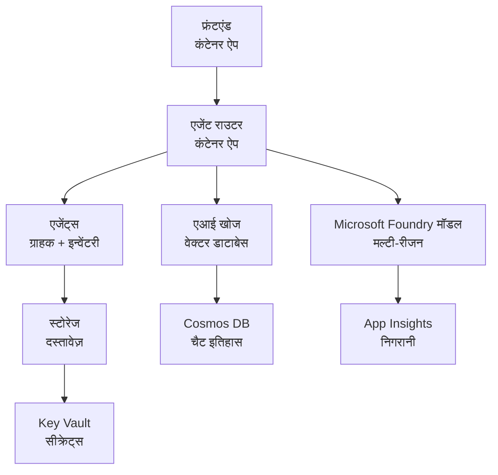

# रिटेल मल्टी-एजेंट सॉल्यूशन - इन्फ्रास्ट्रक्चर टेम्पलेट

**अध्याय 5: प्रोडक्शन डिप्लॉयमेंट पैकेज**
- **📚 कोर्स होम**: [AZD शुरुआती के लिए](../../README.md)
- **📖 संबंधित अध्याय**: [अध्याय 5: मल्टी-एजेंट AI सॉल्यूशंस](../../README.md#-chapter-5-multi-agent-ai-solutions-advanced)
- **📝 परिदृश्य मार्गदर्शिका**: [पूर्ण आर्किटेक्चर](../retail-scenario.md)
- **🎯 त्वरित तैनाती**: [🎯 त्वरित तैनाती](#-quick-deployment)

> **⚠️ केवल इन्फ्रास्ट्रक्चर टेम्पलेट**  
> यह ARM टेम्पलेट मल्टी-एजेंट सिस्टम के लिए **Azure संसाधन** तैनात करता है।  
>  
> **क्या तैनात होता है (15-25 मिनट):**
> - ✅ Microsoft Foundry Models (gpt-4.1, gpt-4.1-mini, 3 क्षेत्रों में embeddings)
> - ✅ AI Search सेवा (खाली, इंडेक्स निर्माण के लिए तैयार)
> - ✅ Container Apps (प्लेसहोल्डर इमेजेज, आपके कोड के लिए तैयार)
> - ✅ स्टोरेज, Cosmos DB, Key Vault, Application Insights
>  
> **क्या शामिल नहीं है (विकास आवश्यक):**
> - ❌ एजेंट इम्प्लीमेंटेशन कोड (Customer Agent, Inventory Agent)
> - ❌ राउटिंग लॉजिक और API एंडपॉइंट्स
> - ❌ फ्रंटएंड चैट UI
> - ❌ सर्च इंडेक्स स्कीमा और डेटा पाइपलाइंस
> - ❌ **अनुमानित विकास प्रयास: 80-120 घंटे**
>  
> **यह टेम्पलेट उपयोग करें अगर:**
> - ✅ आप मल्टी-एजेंट प्रोजेक्ट के लिए Azure इन्फ्रास्ट्रक्चर प्रोविजन करना चाहते हैं
> - ✅ आप एजेंट इम्प्लीमेंटेशन को अलग से विकसित करने की योजना बना रहे हैं
> - ✅ आप प्रोडक्शन-रेडी इन्फ्रास्ट्रक्चर बेसलाइन चाहते हैं
>  
> **इसका उपयोग न करें अगर:**
> - ❌ आप तुरंत एक काम करने वाला मल्टी-एजेंट डेमो अपेक्षित कर रहे हैं
> - ❌ आप संपूर्ण एप्लिकेशन कोड उदाहरणों की तलाश में हैं

## अवलोकन

इस निर्देशिका में एक व्यापक Azure Resource Manager (ARM) टेम्पलेट शामिल है जो मल्टी-एजेंट ग्राहक समर्थन सिस्टम की **इन्फ्रास्ट्रक्चर फ़ाउंडेशन** तैनात करने के लिए है। टेम्पलेट सभी आवश्यक Azure सेवाओं को प्रोविजन करता है, ठीक से कॉन्फ़िगर और आपस में जुड़ा हुआ, ताकि आपका एप्लिकेशन विकास शुरू हो सके।

**डिप्लॉयमेंट के बाद, आपके पास होगा:** प्रोडक्शन-रेडी Azure इन्फ्रास्ट्रक्चर  
**सिस्टम पूरा करने के लिए आपको चाहिए:** एजेंट कोड, फ्रंटएंड UI, और डेटा कॉन्फ़िगरेशन (देखें [Architecture Guide](../retail-scenario.md))

## 🎯 क्या तैनात होता है

### कोर इन्फ्रास्ट्रक्चर (डिप्लॉयमेंट के बाद स्थिति)

✅ **Microsoft Foundry Models सेवाएँ** (API कॉल के लिए तैयार)
  - प्राथमिक क्षेत्र: gpt-4.1 डिप्लॉयमेंट (20K TPM क्षमता)
  - द्वितीयक क्षेत्र: gpt-4.1-mini डिप्लॉयमेंट (10K TPM क्षमता)
  - तृतीयक क्षेत्र: टेक्स्ट एम्बेडिंग मॉडल (30K TPM क्षमता)
  - मूल्यांकन क्षेत्र: gpt-4.1 ग्रेडर मॉडल (15K TPM क्षमता)
  - **स्थिति:** पूर्ण कार्यशील - तुरंत API कॉल किए जा सकते हैं

✅ **Azure AI Search** (खाली - कॉन्फ़िगरेशन के लिए तैयार)
  - वेक्टर सर्च क्षमताएँ सक्षम
  - स्टैंडर्ड टियर 1 पार्टीशन, 1 रेप्लिका के साथ
  - **स्थिति:** सेवा चल रही है, लेकिन इंडेक्स निर्माण की आवश्यकता है
  - **कार्रवाई आवश्यक:** अपने स्कीमा के साथ सर्च इंडेक्स बनाएं

✅ **Azure स्टोरेज अकाउंट** (खाली - अपलोड के लिए तैयार)
  - ब्लॉब कंटेनर: `documents`, `uploads`
  - सुरक्षित कॉन्फ़िगरेशन (केवल HTTPS, कोई सार्वजनिक एक्सेस नहीं)
  - **स्थिति:** फ़ाइलें प्राप्त करने के लिए तैयार
  - **कार्रवाई आवश्यक:** अपने प्रोडक्ट डेटा और दस्तावेज़ अपलोड करें

⚠️ **Container Apps एनवायरनमेंट** (प्लेसहोल्डर इमेजेज तैनात)
  - एजेंट राउटर ऐप (nginx डिफ़ॉल्ट इमेज)
  - फ्रंटएंड ऐप (nginx डिफ़ॉल्ट इमेज)
  - ऑटो-स्केलिंग कॉन्फ़िगर (0-10 इंस्टेंसेस)
  - **स्थिति:** प्लेसहोल्डर कंटेनर चल रहे हैं
  - **कार्रवाई आवश्यक:** अपने एजेंट एप्लिकेशंस बनाएं और तैनात करें

✅ **Azure Cosmos DB** (खाली - डेटा के लिए तैयार)
  - डेटाबेस और कंटेनर पूर्व-कॉन्फ़िगर किए गए
  - कम-लेटेंसी संचालन के लिए अनुकूलित
  - TTL स्वत: क्लीनअप के लिए सक्षम
  - **स्थिति:** चैट इतिहास स्टोर करने के लिए तैयार

✅ **Azure Key Vault** (वैकल्पिक - सीक्रेट्स के लिए तैयार)
  - सॉफ्ट डिलीट सक्षम
  - प्रबंधित आइडेंटिटीज़ के लिए RBAC कॉन्फ़िगर
  - **स्थिति:** API कुंजियाँ और कनेक्शन स्ट्रिंग्स स्टोर करने के लिए तैयार

✅ **Application Insights** (वैकल्पिक - मॉनिटरिंग सक्रिय)
  - Log Analytics वर्कस्पेस से जुड़ा हुआ
  - कस्टम मीट्रिक्स और अलर्ट कॉन्फ़िगर किए गए
  - **स्थिति:** आपके ऐप्स से टेलीमेट्री प्राप्त करने के लिए तैयार

✅ **Document Intelligence** (API कॉल के लिए तैयार)
  - प्रोडक्शन वर्कलोड्स के लिए S0 टियर
  - **स्थिति:** अपलोड किए गए दस्तावेज़ों को प्रोसेस करने के लिए तैयार

✅ **Bing Search API** (API कॉल के लिए तैयार)
  - रीयल-टाइम सर्च के लिए S1 टियर
  - **स्थिति:** वेब सर्च क्वेरीज के लिए तैयार

### डिप्लॉयमेंट मोड

| Mode | OpenAI Capacity | Container Instances | Search Tier | Storage Redundancy | Best For |
|------|-----------------|---------------------|-------------|-------------------|----------|
| **Minimal** | 10K-20K TPM | 0-2 replicas | Basic | LRS (Local) | Dev/test, learning, proof-of-concept |
| **Standard** | 30K-60K TPM | 2-5 replicas | Standard | ZRS (Zone) | Production, moderate traffic (<10K users) |
| **Premium** | 80K-150K TPM | 5-10 replicas, zone-redundant | Premium | GRS (Geo) | Enterprise, high traffic (>10K users), 99.99% SLA |

**लागत प्रभाव:**
- **Minimal → Standard:** ~4x लागत वृद्धि ($100-370/mo → $420-1,450/mo)
- **Standard → Premium:** ~3x लागत वृद्धि ($420-1,450/mo → $1,150-3,500/mo)
- **चुनें आधार पर:** अनुमानित लोड, SLA आवश्यकताएँ, बजट प्रतिबंध

**क्षमता योजना:**
- **TPM (Tokens Per Minute):** सभी मॉडल डिप्लॉयमेंट्स में कुल
- **Container Instances:** ऑटो-स्केलिंग रेंज (मिन-मैक्स रेप्लिकस)
- **Search Tier:** क्वेरी प्रदर्शन और इंडेक्स आकार सीमाओं को प्रभावित करता है

## 📋 पूर्वापेक्षितताएँ

### आवश्यक टूल
1. **Azure CLI** (संस्करण 2.50.0 या उच्च)
   ```bash
   az --version  # संस्करण की जाँच करें
   az login      # प्रमाणित करें
   ```

2. **सक्रिय Azure सदस्यता** जिसमें Owner या Contributor एक्सेस हो
   ```bash
   az account show  # सदस्यता सत्यापित करें
   ```

### आवश्यक Azure कोटा

डिप्लॉयमेंट से पहले, अपने लक्षित क्षेत्रों में पर्याप्त कोटा की पुष्टि करें:

```bash
# अपने क्षेत्र में Microsoft Foundry मॉडल की उपलब्धता जांचें
az cognitiveservices account list-skus \
  --kind OpenAI \
  --location eastus2

# OpenAI कोटा सत्यापित करें (gpt-4.1 के उदाहरण के लिए)
az cognitiveservices usage list \
  --location eastus2 \
  --query "[?name.value=='OpenAI.Standard.gpt-4.1']"

# Container Apps कोटा जांचें
az provider show \
  --namespace Microsoft.App \
  --query "resourceTypes[?resourceType=='managedEnvironments'].locations"
```

**न्यूनतम आवश्यक कोटा:**
- **Microsoft Foundry Models:** 3-4 मॉडल डिप्लॉयमेंट्स across regions
  - gpt-4.1: 20K TPM (Tokens Per Minute)
  - gpt-4.1-mini: 10K TPM
  - text-embedding-ada-002: 30K TPM
  - **नोट:** कुछ क्षेत्रों में gpt-4.1 के लिए वेटलिस्ट हो सकती है - [model availability](https://learn.microsoft.com/azure/ai-services/openai/concepts/models) देखें
- **Container Apps:** Managed environment + 2-10 कंटेनर इंस्टेंसेस
- **AI Search:** Standard टियर (Basic वेक्टर सर्च के लिए अपर्याप्त)
- **Cosmos DB:** Standard provisioned throughput

**यदि कोटा अपर्याप्त हो:**
1. Azure पोर्टल पर जाएँ → Quotas → Request increase
2. या Azure CLI का उपयोग करें:
   ```bash
   az support tickets create \
     --ticket-name "OpenAI-Quota-Increase" \
     --severity "minimal" \
     --description "Request quota increase for Microsoft Foundry Models gpt-4.1 in eastus2"
   ```
3. उपलब्धता वाले वैकल्पिक क्षेत्रों पर विचार करें

## 🚀 त्वरित तैनाती

### विकल्प 1: Azure CLI का उपयोग करके

```bash
# टेम्पलेट फ़ाइलों को क्लोन करें या डाउनलोड करें
git clone <repository-url>
cd examples/retail-multiagent-arm-template

# डिप्लॉयमेंट स्क्रिप्ट को निष्पादन योग्य बनाएं
chmod +x deploy.sh

# डिफ़ॉल्ट सेटिंग्स के साथ डिप्लॉय करें
./deploy.sh -g myResourceGroup

# प्रोडक्शन के लिए प्रीमियम सुविधाओं के साथ डिप्लॉय करें
./deploy.sh -g myProdRG -e prod -m premium -l eastus2
```

### विकल्प 2: Azure पोर्टल का उपयोग करके

[](https://portal.azure.com/#create/Microsoft.Template/uri/https%3A%2F%2Fraw.githubusercontent.com%2Fmicrosoft%2Fazd-for-beginners%2Fmain%2Fexamples%2Fretail-multiagent-arm-template%2Fazuredeploy.json)

### विकल्प 3: सीधे Azure CLI का उपयोग करके

```bash
# संसाधन समूह बनाएँ
az group create --name myResourceGroup --location eastus2

# टेम्पलेट तैनात करें
az deployment group create \
  --resource-group myResourceGroup \
  --template-file azuredeploy.json \
  --parameters azuredeploy.parameters.json
```

## ⏱️ डिप्लॉयमेंट टाइमलाइन

### क्या अपेक्षित है

| Phase | Duration | What Happens |
|-------|----------|--------------||
| **Template Validation** | 30-60 seconds | Azure validates ARM template syntax and parameters |
| **Resource Group Setup** | 10-20 seconds | Creates resource group (if needed) |
| **OpenAI Provisioning** | 5-8 minutes | Creates 3-4 OpenAI accounts and deploys models |
| **Container Apps** | 3-5 minutes | Creates environment and deploys placeholder containers |
| **Search & Storage** | 2-4 minutes | Provisions AI Search service and storage accounts |
| **Cosmos DB** | 2-3 minutes | Creates database and configures containers |
| **Monitoring Setup** | 2-3 minutes | Sets up Application Insights and Log Analytics |
| **RBAC Configuration** | 1-2 minutes | Configures managed identities and permissions |
| **Total Deployment** | **15-25 minutes** | Complete infrastructure ready |

**डिप्लॉयमेंट के बाद:**
- ✅ **इन्फ्रास्ट्रक्चर तैयार:** सभी Azure सेवाएँ प्रोविजन और चल रही हैं
- ⏱️ **एप्लिकेशन विकास:** 80-120 घंटे (आपकी जिम्मेदारी)
- ⏱️ **इंडेक्स कॉन्फ़िगरेशन:** 15-30 मिनट (आपके स्कीमा की आवश्यकता)
- ⏱️ **डेटा अपलोड:** डेटासेट साइज के अनुसार बदलता है
- ⏱️ **परीक्षण और मान्यकरण:** 2-4 घंटे

---

## ✅ डिप्लॉयमेंट सफलता की पुष्टि करें

### चरण 1: संसाधन प्रोविजनिंग की जाँच करें (2 मिनट)

```bash
# सुनिश्चित करें कि सभी संसाधन सफलतापूर्वक तैनात हुए हैं
az resource list \
  --resource-group myResourceGroup \
  --query "[?provisioningState!='Succeeded'].{Name:name, Status:provisioningState, Type:type}" \
  --output table
```

**अपेक्षित:** खाली तालिका (सभी संसाधन "Succeeded" स्थिति दिखाएँ)

### चरण 2: Microsoft Foundry Models डिप्लॉयमेंट्स सत्यापित करें (3 मिनट)

```bash
# सभी OpenAI खातों को सूचीबद्ध करें
az cognitiveservices account list \
  --resource-group myResourceGroup \
  --query "[?kind=='OpenAI'].{Name:name, Location:location, Status:properties.provisioningState}" \
  --output table

# प्राथमिक क्षेत्र के लिए मॉडल डिप्लॉयमेंट्स जांचें
OPENAI_NAME=$(az cognitiveservices account list \
  --resource-group myResourceGroup \
  --query "[?kind=='OpenAI'] | [0].name" -o tsv)

az cognitiveservices account deployment list \
  --name $OPENAI_NAME \
  --resource-group myResourceGroup \
  --output table
```

**अपेक्षित:** 
- 3-4 OpenAI खाते (प्राइमरी, सेकेंडरी, टर्शियरी, मूल्यांकन क्षेत्र)
- प्रति खाते 1-2 मॉडल डिप्लॉयमेंट्स (gpt-4.1, gpt-4.1-mini, text-embedding-ada-002)

### चरण 3: इंफ्रास्ट्रक्चर एंडपॉइंट्स का परीक्षण करें (5 मिनट)

```bash
# कंटेनर ऐप के URL प्राप्त करें
az containerapp list \
  --resource-group myResourceGroup \
  --query "[].{Name:name, URL:properties.configuration.ingress.fqdn, Status:properties.runningStatus}" \
  --output table

# राउटर एंडपॉइंट का परीक्षण करें (प्लेसहोल्डर छवि प्रतिक्रिया देगी)
ROUTER_URL=$(az containerapp show \
  --name retail-router \
  --resource-group myResourceGroup \
  --query "properties.configuration.ingress.fqdn" -o tsv)

echo "Testing: https://$ROUTER_URL"
curl -I https://$ROUTER_URL || echo "Container running (placeholder image - expected)"
```

**अपेक्षित:** 
- Container Apps "Running" स्थिति दिखाएँ
- प्लेसहोल्डर nginx HTTP 200 या 404 के साथ प्रतिक्रिया दे (अभी कोई एप्लिकेशन कोड नहीं)

### चरण 4: Microsoft Foundry Models API एक्सेस सत्यापित करें (3 मिनट)

```bash
# OpenAI एंडपॉइंट और कुंजी प्राप्त करें
OPENAI_ENDPOINT=$(az cognitiveservices account show \
  --name $OPENAI_NAME \
  --resource-group myResourceGroup \
  --query "properties.endpoint" -o tsv)

OPENAI_KEY=$(az cognitiveservices account keys list \
  --name $OPENAI_NAME \
  --resource-group myResourceGroup \
  --query "key1" -o tsv)

# gpt-4.1 तैनाती का परीक्षण करें
curl "${OPENAI_ENDPOINT}openai/deployments/gpt-4.1/chat/completions?api-version=2024-08-01-preview" \
  -H "Content-Type: application/json" \
  -H "api-key: $OPENAI_KEY" \
  -d '{
    "messages": [{"role": "user", "content": "Say hello"}],
    "max_tokens": 10
  }'
```

**अपेक्षित:** JSON प्रतिक्रिया चैट कम्प्लीशन के साथ (OpenAI के कार्यशील होने की पुष्टि)

### क्या काम कर रहा है बनाम क्या नहीं

**✅ डिप्लॉयमेंट के बाद काम कर रहा है:**
- Microsoft Foundry Models मॉडल डिप्लॉय और API कॉल स्वीकार कर रहे हैं
- AI Search सेवा चल रही है (खाली, अभी कोई इंडेक्स नहीं)
- Container Apps चल रहे हैं (प्लेसहोल्डर nginx इमेजेज)
- स्टोरेज अकाउंट्स पहुंच योग्य और अपलोड के लिए तैयार
- Cosmos DB डेटा ऑपरेशन्स के लिए तैयार
- Application Insights इन्फ्रास्ट्रक्चर टेलीमेट्री एकत्र कर रहा है
- Key Vault सीक्रेट स्टोरेज के लिए तैयार

**❌ अभी काम नहीं कर रहा (विकास आवश्यक):**
- एजेंट एंडपॉइंट्स (कोई एप्लिकेशन कोड तैनात नहीं)
- चैट कार्यक्षमता (फ्रंटएंड + बैकएंड कार्यान्वयन आवश्यक)
- सर्च क्वेरीज (कोई सर्च इंडेक्स अभी नहीं बनाया गया)
- दस्तावेज़ प्रोसेसिंग पाइपलाइन (कोई डेटा अपलोड नहीं)
- कस्टम टेलीमेट्री (एप्लिकेशन इंस्ट्रूमेंटेशन आवश्यक)

**अगले कदम:** अपने एप्लिकेशन को विकसित और तैनात करने के लिए [पोस्ट-डिप्लॉयमेंट कॉन्फ़िगरेशन](#-post-deployment-next-steps) देखें

---

## ⚙️ कॉन्फ़िगरेशन विकल्प

### टेम्पलेट पैरामीटर

| Parameter | Type | Default | Description |
|-----------|------|---------|-------------|
| `projectName` | string | "retail" | Prefix for all resource names |
| `location` | string | Resource group location | Primary deployment region |
| `secondaryLocation` | string | "westus2" | Secondary region for multi-region deployment |
| `tertiaryLocation` | string | "francecentral" | Region for embeddings model |
| `environmentName` | string | "dev" | Environment designation (dev/staging/prod) |
| `deploymentMode` | string | "standard" | Deployment configuration (minimal/standard/premium) |
| `enableMultiRegion` | bool | true | Enable multi-region deployment |
| `enableMonitoring` | bool | true | Enable Application Insights and logging |
| `enableSecurity` | bool | true | Enable Key Vault and enhanced security |

### पैरामीटर अनुकूलन

Edit `azuredeploy.parameters.json`:

```json
{
  "$schema": "https://schema.management.azure.com/schemas/2019-04-01/deploymentParameters.json#",
  "contentVersion": "1.0.0.0",
  "parameters": {
    "projectName": {
      "value": "mycompany"
    },
    "environmentName": {
      "value": "prod"
    },
    "deploymentMode": {
      "value": "premium"
    },
    "location": {
      "value": "eastus2"
    }
  }
}
```

## 🏗️ आर्किटेक्चर अवलोकन


## 📖 डिप्लॉयमेंट स्क्रिप्ट उपयोग

`deploy.sh` स्क्रिप्ट एक इंटरैक्टिव डिप्लॉयमेंट अनुभव प्रदान करता है:

```bash
# सहायता दिखाएँ
./deploy.sh --help

# बुनियादी तैनाती
./deploy.sh -g myResourceGroup

# कस्टम सेटिंग्स के साथ उन्नत तैनाती
./deploy.sh \
  -g myProductionRG \
  -p companyname \
  -e prod \
  -m premium \
  -l eastus2

# मल्टी-रीजन के बिना विकास तैनाती
./deploy.sh \
  -g myDevRG \
  -e dev \
  -m minimal \
  --no-multi-region \
  --no-security
```

### स्क्रिप्ट फीचर्स

- ✅ **पूर्वापेक्षाएँ सत्यापन** (Azure CLI, लॉगिन स्थिति, टेम्पलेट फ़ाइलें)
- ✅ **रिसोर्स ग्रुप प्रबंधन** (यदि मौजूद नहीं है तो बनाता है)
- ✅ **डिप्लॉयमेंट से पहले टेम्पलेट वेलिडेशन**
- ✅ **प्रोग्रेस मॉनिटरिंग** रंगीन आउटपुट के साथ
- ✅ **डिप्लॉयमेंट आउटपुट्स** प्रदर्शन
- ✅ **पोस्ट-डिप्लॉयमेंट मार्गदर्शन**

## 📊 डिप्लॉयमेंट निगरानी

### डिप्लॉयमेंट स्थिति जाँचें

```bash
# डिप्लॉयमेंट्स की सूची
az deployment group list --resource-group myResourceGroup --output table

# डिप्लॉयमेंट का विवरण प्राप्त करें
az deployment group show \
  --resource-group myResourceGroup \
  --name retail-deployment-YYYYMMDD-HHMMSS

# डिप्लॉयमेंट की प्रगति देखें
az deployment group create \
  --resource-group myResourceGroup \
  --template-file azuredeploy.json \
  --parameters azuredeploy.parameters.json \
  --verbose
```

### डिप्लॉयमेंट आउटपुट्स

सफल डिप्लॉयमेंट के बाद, निम्न आउटपुट उपलब्ध होंगे:

- **Frontend URL**: वेब इंटरफ़ेस के लिए सार्वजनिक एंडपॉइंट
- **Router URL**: एजेंट राउटर के लिए API एंडपॉइंट
- **OpenAI Endpoints**: प्राइमरी और सेकेंडरी OpenAI सेवा एंडपॉइंट्स
- **Search Service**: Azure AI Search सेवा एंडपॉइंट
- **Storage Account**: दस्तावेज़ों के लिए स्टोरेज अकाउंट का नाम
- **Key Vault**: Key Vault का नाम (यदि सक्षम)
- **Application Insights**: मॉनिटरिंग सेवा का नाम (यदि सक्षम)

## 🔧 पोस्ट-डिप्लॉयमेंट: अगले कदम
> **📝 महत्वपूर्ण:** अवसंरचना तैनात की गई है, लेकिन आपको एप्लिकेशन कोड विकसित और तैनात करने की आवश्यकता है।

### चरण 1: एजेंट एप्लिकेशन विकसित करें (आपकी जिम्मेदारी)

The ARM template creates **empty Container Apps** with placeholder nginx images. You must:

**आवश्यक विकास:**
1. **एजेंट लागू करना** (30-40 घंटे)
   - gpt-4.1 एकीकरण के साथ ग्राहक सेवा एजेंट
   - gpt-4.1-mini एकीकरण के साथ इन्वेंटरी एजेंट
   - एजेंट राउटिंग लॉजिक

2. **फ्रंटएंड विकास** (20-30 घंटे)
   - चैट इंटरफ़ेस UI (React/Vue/Angular)
   - फ़ाइल अपलोड कार्यक्षमता
   - प्रतिक्रिया प्रस्तुतिकरण और स्वरूपण

3. **बैकएंड सेवाएँ** (12-16 घंटे)
   - FastAPI या Express राउटर
   - प्रमाणीकरण मिडलवेयर
   - टेलिमेट्री एकीकरण

See: [आर्किटेक्चर गाइड](../retail-scenario.md) विस्तृत कार्यान्वयन पैटर्न और कोड उदाहरणों के लिए

### चरण 2: AI सर्च इंडेक्स कॉन्फ़िगर करें (15-30 मिनट)

Create a search index matching your data model:

```bash
# खोज सेवा का विवरण प्राप्त करें
SEARCH_NAME=$(az search service list \
  --resource-group myResourceGroup \
  --query "[0].name" -o tsv)

SEARCH_KEY=$(az search admin-key show \
  --service-name $SEARCH_NAME \
  --resource-group myResourceGroup \
  --query "primaryKey" -o tsv)

# अपने स्कीमा के साथ इंडेक्स बनाएं (उदाहरण)
curl -X POST "https://${SEARCH_NAME}.search.windows.net/indexes?api-version=2023-11-01" \
  -H "Content-Type: application/json" \
  -H "api-key: ${SEARCH_KEY}" \
  -d '{
    "name": "products",
    "fields": [
      {"name": "id", "type": "Edm.String", "key": true},
      {"name": "title", "type": "Edm.String", "searchable": true},
      {"name": "content", "type": "Edm.String", "searchable": true},
      {"name": "category", "type": "Edm.String", "filterable": true},
      {"name": "content_vector", "type": "Collection(Edm.Single)", 
       "searchable": true, "dimensions": 1536, "vectorSearchProfile": "default"}
    ],
    "vectorSearch": {
      "algorithms": [{"name": "default", "kind": "hnsw"}],
      "profiles": [{"name": "default", "algorithm": "default"}]
    }
  }'
```

**संसाधन:**
- [AI सर्च इंडेक्स स्कीमा डिज़ाइन](https://learn.microsoft.com/azure/search/search-what-is-an-index)
- [वेक्टर सर्च कॉन्फ़िगरेशन](https://learn.microsoft.com/azure/search/vector-search-how-to-create-index)

### चरण 3: अपना डेटा अपलोड करें (समय अलग-अलग)

Once you have product data and documents:

```bash
# स्टोरेज खाते के विवरण प्राप्त करें
STORAGE_NAME=$(az storage account list \
  --resource-group myResourceGroup \
  --query "[0].name" -o tsv)

STORAGE_KEY=$(az storage account keys list \
  --account-name $STORAGE_NAME \
  --resource-group myResourceGroup \
  --query "[0].value" -o tsv)

# अपने दस्तावेज़ अपलोड करें
az storage blob upload-batch \
  --destination documents \
  --source /path/to/your/product/docs \
  --account-name $STORAGE_NAME \
  --account-key $STORAGE_KEY

# उदाहरण: एक फ़ाइल अपलोड करें
az storage blob upload \
  --container-name documents \
  --name "product-manual.pdf" \
  --file /path/to/product-manual.pdf \
  --account-name $STORAGE_NAME \
  --account-key $STORAGE_KEY
```

### चरण 4: अपने एप्लिकेशन बनाएं और तैनात करें (8-12 घंटे)

Once you've developed your agent code:

```bash
# 1. Azure Container Registry बनाएं (यदि आवश्यक हो)
az acr create \
  --name myregistry \
  --resource-group myResourceGroup \
  --sku Basic

# 2. एजेंट राउटर इमेज बनाएं और पुश करें
docker build -t myregistry.azurecr.io/agent-router:v1 /path/to/your/router/code
az acr login --name myregistry
docker push myregistry.azurecr.io/agent-router:v1

# 3. फ्रंटएंड इमेज बनाएं और पुश करें
docker build -t myregistry.azurecr.io/frontend:v1 /path/to/your/frontend/code
docker push myregistry.azurecr.io/frontend:v1

# 4. अपनी इमेज के साथ Container Apps को अपडेट करें
az containerapp update \
  --name retail-router \
  --resource-group myResourceGroup \
  --image myregistry.azurecr.io/agent-router:v1

az containerapp update \
  --name retail-frontend \
  --resource-group myResourceGroup \
  --image myregistry.azurecr.io/frontend:v1

# 5. पर्यावरण चर कॉन्फ़िगर करें
az containerapp update \
  --name retail-router \
  --resource-group myResourceGroup \
  --set-env-vars \
    OPENAI_ENDPOINT=secretref:openai-endpoint \
    OPENAI_KEY=secretref:openai-key \
    SEARCH_ENDPOINT=secretref:search-endpoint \
    SEARCH_KEY=secretref:search-key
```

### चरण 5: अपने एप्लिकेशन का परीक्षण करें (2-4 घंटे)

```bash
# अपने एप्लिकेशन का URL प्राप्त करें
ROUTER_URL=$(az containerapp show \
  --name retail-router \
  --resource-group myResourceGroup \
  --query "properties.configuration.ingress.fqdn" -o tsv)

# एजेंट एंडपॉइंट का परीक्षण करें (जब आपका कोड तैनात हो जाए)
curl -X POST "https://${ROUTER_URL}/chat" \
  -H "Content-Type: application/json" \
  -d '{
    "message": "Hello, I need help with my order",
    "agent": "customer"
  }'

# एप्लिकेशन लॉग्स की जाँच करें
az containerapp logs show \
  --name retail-router \
  --resource-group myResourceGroup \
  --follow
```

### कार्यान्वयन संसाधन

**आर्किटेक्चर और डिज़ाइन:**
- 📖 [पूर्ण आर्किटेक्चर गाइड](../retail-scenario.md) - विस्तृत कार्यान्वयन पैटर्न
- 📖 [मल्टी-एजेंट डिज़ाइन पैटर्न](https://learn.microsoft.com/azure/architecture/ai-ml/guide/multi-agent-systems)

**कोड उदाहरण:**
- 🔗 [Microsoft Foundry Models चैट नमूना](https://github.com/Azure-Samples/azure-search-openai-demo) - RAG पैटर्न
- 🔗 [Semantic Kernel](https://github.com/microsoft/semantic-kernel) - एजेंट फ्रेमवर्क (C#)
- 🔗 [LangChain Azure](https://github.com/langchain-ai/langchain) - एजेंट ऑर्केस्ट्रेशन (Python)
- 🔗 [AutoGen](https://github.com/microsoft/autogen) - मल्टी-एजेंट संवाद

**अनुमानित कुल प्रयास:**
- इन्फ्रास्ट्रक्चर तैनाती: 15-25 मिनट (✅ पूरा)
- एप्लिकेशन विकास: 80-120 घंटे (🔨 आपका कार्य)
- परीक्षण और अनुकूलन: 15-25 घंटे (🔨 आपका कार्य)

## 🛠️ समस्या निवारण

### सामान्य समस्याएँ

#### 1. Microsoft Foundry Models कोटा पार हो गया

```bash
# वर्तमान कोटा उपयोग की जाँच करें
az cognitiveservices usage list --location eastus2

# कोटा वृद्धि के लिए अनुरोध करें
az support tickets create \
  --ticket-name "OpenAI-Quota-Increase" \
  --severity "minimal" \
  --description "Request quota increase for Microsoft Foundry Models in region X"
```

#### 2. Container Apps तैनाती असफल हुई

```bash
# कंटेनर ऐप लॉग जांचें
az containerapp logs show \
  --name retail-router \
  --resource-group myResourceGroup \
  --follow

# कंटेनर ऐप को पुनरारंभ करें
az containerapp revision restart \
  --name retail-router \
  --resource-group myResourceGroup
```

#### 3. Search सेवा प्रारंभिककरण

```bash
# खोज सेवा की स्थिति सत्यापित करें
az search service show \
  --name <search-service-name> \
  --resource-group myResourceGroup

# खोज सेवा की कनेक्टिविटी का परीक्षण करें
curl -X GET "https://<search-service-name>.search.windows.net/indexes?api-version=2023-11-01" \
  -H "api-key: <search-admin-key>"
```

### तैनाती सत्यापन

```bash
# सत्यापित करें कि सभी संसाधन बनाए गए हैं
az resource list \
  --resource-group myResourceGroup \
  --output table

# संसाधन के स्वास्थ्य की जाँच करें
az resource list \
  --resource-group myResourceGroup \
  --query "[?provisioningState!='Succeeded'].{Name:name, Status:provisioningState, Type:type}" \
  --output table
```

## 🔐 सुरक्षा विचार

### कुंजी प्रबंधन
- सभी गोपनीय जानकारी Azure Key Vault में संग्रहीत होती है (जब सक्षम हो)
- Container apps प्रमाणीकरण के लिए managed identity का उपयोग करते हैं
- स्टोरेज अकाउंट्स के पास सुरक्षित डिफ़ॉल्ट होते हैं (केवल HTTPS, कोई सार्वजनिक blob एक्सेस नहीं)

### नेटवर्क सुरक्षा
- Container apps संभव होने पर आंतरिक नेटवर्किंग का उपयोग करते हैं
- Search सेवा को private endpoints विकल्प के साथ कॉन्फ़िगर किया गया है
- Cosmos DB को न्यूनतम आवश्यक अनुमतियों के साथ कॉन्फ़िगर किया गया है

### RBAC कॉन्फ़िगरेशन
```bash
# प्रबंधित पहचान के लिए आवश्यक भूमिकाएँ सौंपें
az role assignment create \
  --assignee <container-app-managed-identity> \
  --role "Cognitive Services OpenAI User" \
  --scope <openai-resource-id>
```

## 💰 लागत अनुकूलन

### लागत अनुमान (मासिक, USD)

| मोड | OpenAI | Container Apps | सर्च | स्टोरेज | कुल अनुमान |
|------|--------|----------------|--------|---------|------------|
| न्यूनतम | $50-200 | $20-50 | $25-100 | $5-20 | $100-370 |
| मानक | $200-800 | $100-300 | $100-300 | $20-50 | $420-1450 |
| प्रीमियम | $500-2000 | $300-800 | $300-600 | $50-100 | $1150-3500 |

### लागत निगरानी

```bash
# बजट चेतावनियाँ सेट करें
az consumption budget create \
  --account-name <subscription-id> \
  --budget-name "retail-budget" \
  --amount 500 \
  --time-grain Monthly \
  --start-date 2024-01-01 \
  --end-date 2024-12-31
```

## 🔄 अपडेट और रखरखाव

### टेम्पलेट अपडेट्स
- ARM टेम्पलेट फ़ाइलों का संस्करण नियंत्रण करें
- परिवर्तनों का पहले विकास वातावरण में परीक्षण करें
- अपडेट के लिए incremental deployment मोड का उपयोग करें

### संसाधन अपडेट्स
```bash
# नए पैरामीटर के साथ अपडेट करें
az deployment group create \
  --resource-group myResourceGroup \
  --template-file azuredeploy.json \
  --parameters azuredeploy.parameters.json \
  --mode Incremental
```

### बैकअप और रिकवरी
- Cosmos DB का स्वचालित बैकअप सक्षम है
- Key Vault के लिए soft delete सक्षम है
- रोलबैक के लिए Container app संशोधन बनाए रखे जाते हैं

## 📞 सहायता

- **टेम्पलेट समस्याएँ**: [GitHub Issues](https://github.com/microsoft/azd-for-beginners/issues)
- **Azure समर्थन**: [Azure Support Portal](https://portal.azure.com/#blade/Microsoft_Azure_Support/HelpAndSupportBlade)
- **समुदाय**: [Azure AI Discord](https://discord.gg/microsoft-azure)

---

**⚡ क्या आप अपना मल्टी-एजेंट समाधान तैनात करने के लिए तैयार हैं?**

शुरू करें: `./deploy.sh -g myResourceGroup`

---

<!-- CO-OP TRANSLATOR DISCLAIMER START -->
**अस्वीकरण**:
यह दस्तावेज़ AI अनुवाद सेवा [Co-op Translator](https://github.com/Azure/co-op-translator) का उपयोग करके अनुवादित किया गया है। जहाँ हम सटीकता के लिए प्रयासरत हैं, कृपया ध्यान दें कि स्वचालित अनुवादों में त्रुटियाँ या अशुद्धियाँ हो सकती हैं। मूल भाषा में उपलब्ध दस्तावेज़ को आधिकारिक स्रोत माना जाना चाहिए। महत्वपूर्ण जानकारी के लिए, पेशेवर मानव अनुवाद की सिफारिश की जाती है। हम इस अनुवाद के उपयोग से उत्पन्न किसी भी गलतफहमी या गलत व्याख्या के लिए उत्तरदायी नहीं हैं।
<!-- CO-OP TRANSLATOR DISCLAIMER END -->