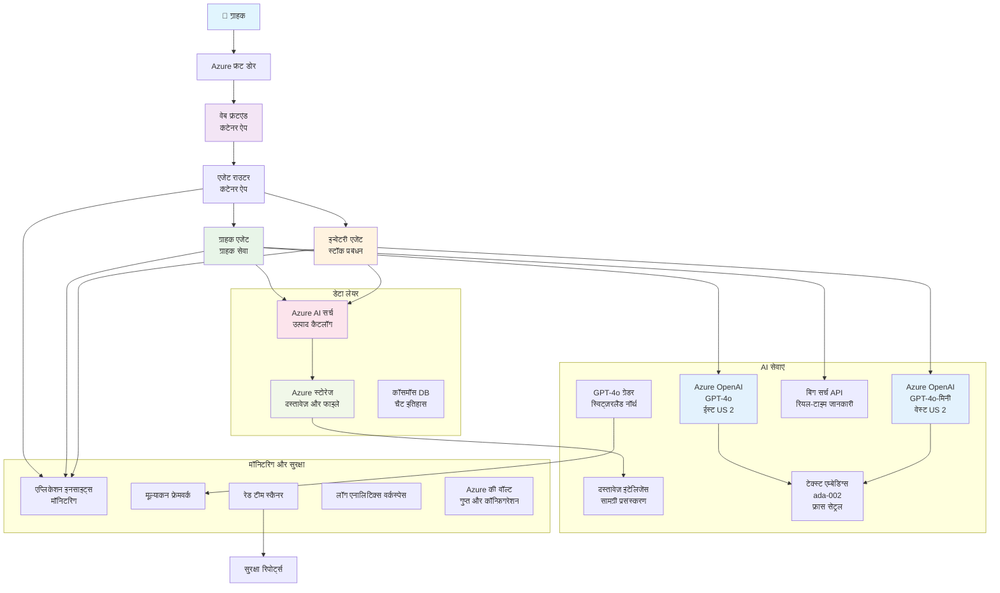

<!--
CO_OP_TRANSLATOR_METADATA:
{
  "original_hash": "77db71c83f2e7fbc9f50320bd1cc7116",
  "translation_date": "2025-11-20T00:56:05+00:00",
  "source_file": "examples/retail-scenario.md",
  "language_code": "hi"
}
-->
# मल्टी-एजेंट कस्टमर सपोर्ट सॉल्यूशन - रिटेलर परिदृश्य

**अध्याय 5: मल्टी-एजेंट एआई सॉल्यूशंस**
- **📚 कोर्स होम**: [AZD फॉर बिगिनर्स](../README.md)
- **📖 वर्तमान अध्याय**: [अध्याय 5: मल्टी-एजेंट एआई सॉल्यूशंस](../README.md#-chapter-5-multi-agent-ai-solutions-advanced)
- **⬅️ पूर्व आवश्यकताएँ**: [अध्याय 2: एआई-फर्स्ट डेवलपमेंट](../docs/ai-foundry/azure-ai-foundry-integration.md)
- **➡️ अगला अध्याय**: [अध्याय 6: प्री-डिप्लॉयमेंट वैलिडेशन](../docs/pre-deployment/capacity-planning.md)
- **🚀 एआरएम टेम्पलेट्स**: [डिप्लॉयमेंट पैकेज](retail-multiagent-arm-template/README.md)

> **⚠️ आर्किटेक्चर गाइड - कार्यान्वयन नहीं**  
> यह दस्तावेज़ एक **व्यापक आर्किटेक्चर ब्लूप्रिंट** प्रदान करता है मल्टी-एजेंट सिस्टम बनाने के लिए।  
> **क्या उपलब्ध है:** इन्फ्रास्ट्रक्चर डिप्लॉयमेंट के लिए एआरएम टेम्पलेट (Azure OpenAI, AI Search, Container Apps, आदि)  
> **क्या बनाना होगा:** एजेंट कोड, रूटिंग लॉजिक, फ्रंटएंड यूआई, डेटा पाइपलाइन्स (अनुमानित 80-120 घंटे)  
>  
> **इसे उपयोग करें:**
> - ✅ अपने मल्टी-एजेंट प्रोजेक्ट के लिए आर्किटेक्चर संदर्भ के रूप में
> - ✅ मल्टी-एजेंट डिज़ाइन पैटर्न सीखने के लिए
> - ✅ Azure संसाधनों को डिप्लॉय करने के लिए इन्फ्रास्ट्रक्चर टेम्पलेट के रूप में
> - ❌ तैयार-से-चलने वाला एप्लिकेशन नहीं (महत्वपूर्ण विकास की आवश्यकता है)

## अवलोकन

**लर्निंग उद्देश्य:** एक प्रोडक्शन-रेडी मल्टी-एजेंट कस्टमर सपोर्ट चैटबॉट के आर्किटेक्चर, डिज़ाइन निर्णयों और कार्यान्वयन दृष्टिकोण को समझें, जिसमें उन्नत एआई क्षमताएँ शामिल हैं जैसे इन्वेंटरी प्रबंधन, दस्तावेज़ प्रसंस्करण, और बुद्धिमान ग्राहक इंटरैक्शन।

**समय:** पढ़ने और समझने में (2-3 घंटे) | पूर्ण कार्यान्वयन बनाने में (80-120 घंटे)

**आप क्या सीखेंगे:**
- मल्टी-एजेंट आर्किटेक्चर पैटर्न और डिज़ाइन सिद्धांत
- मल्टी-रीजन Azure OpenAI डिप्लॉयमेंट रणनीतियाँ
- RAG (रिट्रीवल-ऑगमेंटेड जनरेशन) के साथ एआई सर्च इंटीग्रेशन
- एजेंट मूल्यांकन और सुरक्षा परीक्षण फ्रेमवर्क
- प्रोडक्शन डिप्लॉयमेंट विचार और लागत अनुकूलन

## आर्किटेक्चर लक्ष्य

**शैक्षिक फोकस:** यह आर्किटेक्चर मल्टी-एजेंट सिस्टम के लिए एंटरप्राइज़ पैटर्न को प्रदर्शित करता है।

### सिस्टम आवश्यकताएँ (आपके कार्यान्वयन के लिए)

एक प्रोडक्शन कस्टमर सपोर्ट सॉल्यूशन में आवश्यकता होती है:
- **विभिन्न ग्राहक आवश्यकताओं के लिए कई विशेष एजेंट** (कस्टमर सर्विस + इन्वेंटरी प्रबंधन)
- **मल्टी-मॉडल डिप्लॉयमेंट** उचित क्षमता योजना के साथ (GPT-4o, GPT-4o-मिनी, विभिन्न क्षेत्रों में एम्बेडिंग)
- **डायनामिक डेटा इंटीग्रेशन** एआई सर्च और फाइल अपलोड्स के साथ (वेक्टर सर्च + दस्तावेज़ प्रसंस्करण)
- **व्यापक मॉनिटरिंग** और मूल्यांकन क्षमताएँ (एप्लिकेशन इनसाइट्स + कस्टम मेट्रिक्स)
- **प्रोडक्शन-ग्रेड सुरक्षा** रेड टीमिंग वैलिडेशन के साथ (भेद्यता स्कैनिंग + एजेंट मूल्यांकन)

### यह गाइड क्या प्रदान करता है

✅ **आर्किटेक्चर पैटर्न** - स्केलेबल मल्टी-एजेंट सिस्टम के लिए सिद्ध डिज़ाइन  
✅ **इन्फ्रास्ट्रक्चर टेम्पलेट्स** - सभी Azure सेवाओं को डिप्लॉय करने के लिए एआरएम टेम्पलेट्स  
✅ **कोड उदाहरण** - प्रमुख घटकों के लिए संदर्भ कार्यान्वयन  
✅ **कॉन्फ़िगरेशन गाइडेंस** - चरण-दर-चरण सेटअप निर्देश  
✅ **सर्वोत्तम प्रथाएँ** - सुरक्षा, मॉनिटरिंग, लागत अनुकूलन रणनीतियाँ  

❌ **शामिल नहीं है** - पूर्ण कार्यशील एप्लिकेशन (विकास प्रयास की आवश्यकता है)

## 🗺️ कार्यान्वयन रोडमैप

### चरण 1: आर्किटेक्चर का अध्ययन करें (2-3 घंटे) - यहीं से शुरू करें

**लक्ष्य:** सिस्टम डिज़ाइन और घटक इंटरैक्शन को समझें

- [ ] इस दस्तावेज़ को पूरा पढ़ें
- [ ] आर्किटेक्चर डायग्राम और घटक संबंधों की समीक्षा करें
- [ ] मल्टी-एजेंट पैटर्न और डिज़ाइन निर्णयों को समझें
- [ ] एजेंट टूल्स और रूटिंग के लिए कोड उदाहरणों का अध्ययन करें
- [ ] लागत अनुमान और क्षमता योजना मार्गदर्शन की समीक्षा करें

**परिणाम:** आपको स्पष्ट समझ होगी कि क्या बनाना है

### चरण 2: इन्फ्रास्ट्रक्चर डिप्लॉय करें (30-45 मिनट)

**लक्ष्य:** एआरएम टेम्पलेट का उपयोग करके Azure संसाधनों को प्रोविजन करें

```bash
cd retail-multiagent-arm-template
./deploy.sh -g myResourceGroup -m standard
```

**क्या डिप्लॉय होता है:**
- ✅ Azure OpenAI (3 क्षेत्र: GPT-4o, GPT-4o-मिनी, एम्बेडिंग)
- ✅ एआई सर्च सेवा (खाली, इंडेक्स कॉन्फ़िगरेशन की आवश्यकता है)
- ✅ कंटेनर ऐप्स वातावरण (प्लेसहोल्डर इमेज)
- ✅ स्टोरेज अकाउंट्स, Cosmos DB, Key Vault
- ✅ एप्लिकेशन इनसाइट्स मॉनिटरिंग

**क्या गायब है:**
- ❌ एजेंट कार्यान्वयन कोड
- ❌ रूटिंग लॉजिक
- ❌ फ्रंटएंड यूआई
- ❌ सर्च इंडेक्स स्कीमा
- ❌ डेटा पाइपलाइन्स

### चरण 3: एप्लिकेशन बनाएं (80-120 घंटे)

**लक्ष्य:** इस आर्किटेक्चर के आधार पर मल्टी-एजेंट सिस्टम को कार्यान्वित करें

1. **एजेंट कार्यान्वयन** (30-40 घंटे)
   - बेस एजेंट क्लास और इंटरफेस
   - GPT-4o के साथ कस्टमर सर्विस एजेंट
   - GPT-4o-मिनी के साथ इन्वेंटरी एजेंट
   - टूल इंटीग्रेशन (एआई सर्च, बिंग, फाइल प्रोसेसिंग)

2. **रूटिंग सेवा** (12-16 घंटे)
   - अनुरोध वर्गीकरण लॉजिक
   - एजेंट चयन और ऑर्केस्ट्रेशन
   - FastAPI/Express बैकएंड

3. **फ्रंटएंड विकास** (20-30 घंटे)
   - चैट इंटरफेस यूआई
   - फाइल अपलोड कार्यक्षमता
   - प्रतिक्रिया रेंडरिंग

4. **डेटा पाइपलाइन** (8-12 घंटे)
   - एआई सर्च इंडेक्स निर्माण
   - Document Intelligence के साथ दस्तावेज़ प्रसंस्करण
   - एम्बेडिंग निर्माण और इंडेक्सिंग

5. **मॉनिटरिंग और मूल्यांकन** (10-15 घंटे)
   - कस्टम टेलीमेट्री कार्यान्वयन
   - एजेंट मूल्यांकन फ्रेमवर्क
   - रेड टीम सुरक्षा स्कैनर

### चरण 4: डिप्लॉय और परीक्षण करें (8-12 घंटे)

- सभी सेवाओं के लिए डॉकर इमेज बनाएं
- Azure Container Registry में पुश करें
- कंटेनर ऐप्स को वास्तविक इमेज के साथ अपडेट करें
- पर्यावरण वेरिएबल्स और सीक्रेट्स को कॉन्फ़िगर करें
- मूल्यांकन परीक्षण सूट चलाएँ
- सुरक्षा स्कैनिंग करें

**कुल अनुमानित प्रयास:** अनुभवी डेवलपर्स के लिए 80-120 घंटे

## समाधान आर्किटेक्चर

### आर्किटेक्चर डायग्राम


### घटक अवलोकन

| घटक | उद्देश्य | तकनीक | क्षेत्र |
|-----------|---------|------------|---------|
| **वेब फ्रंटएंड** | ग्राहक इंटरैक्शन के लिए यूजर इंटरफेस | कंटेनर ऐप्स | प्राथमिक क्षेत्र |
| **एजेंट राउटर** | अनुरोधों को उपयुक्त एजेंट तक पहुँचाता है | कंटेनर ऐप्स | प्राथमिक क्षेत्र |
| **कस्टमर एजेंट** | ग्राहक सेवा प्रश्नों को संभालता है | कंटेनर ऐप्स + GPT-4o | प्राथमिक क्षेत्र |
| **इन्वेंटरी एजेंट** | स्टॉक और पूर्ति प्रबंधन करता है | कंटेनर ऐप्स + GPT-4o-मिनी | प्राथमिक क्षेत्र |
| **Azure OpenAI** | एजेंटों के लिए LLM इंफरेंस | कॉग्निटिव सर्विसेज | मल्टी-रीजन |
| **एआई सर्च** | वेक्टर सर्च और RAG | एआई सर्च सेवा | प्राथमिक क्षेत्र |
| **स्टोरेज अकाउंट** | फाइल अपलोड्स और दस्तावेज़ | ब्लॉब स्टोरेज | प्राथमिक क्षेत्र |
| **एप्लिकेशन इनसाइट्स** | मॉनिटरिंग और टेलीमेट्री | मॉनिटर | प्राथमिक क्षेत्र |
| **ग्रेडर मॉडल** | एजेंट मूल्यांकन प्रणाली | Azure OpenAI | द्वितीयक क्षेत्र |

## 📁 प्रोजेक्ट संरचना

> **📍 स्थिति लेजेंड:**  
> ✅ = रिपॉजिटरी में मौजूद  
> 📝 = संदर्भ कार्यान्वयन (इस दस्तावेज़ में कोड उदाहरण)  
> 🔨 = आपको इसे बनाना होगा

```
retail-multiagent-solution/              🔨 Your project directory
├── .azure/                              🔨 Azure environment configs
│   ├── config.json                      🔨 Global config
│   └── env/
│       ├── .env.development             🔨 Dev environment
│       ├── .env.staging                 🔨 Staging environment
│       └── .env.production              🔨 Production environment
│
├── azure.yaml                          🔨 AZD main configuration
├── azure.parameters.json               🔨 Deployment parameters
├── README.md                           🔨 Solution documentation
│
├── infra/                              🔨 Infrastructure as Code (you create)
│   ├── main.bicep                      🔨 Main Bicep template (optional, ARM exists)
│   ├── main.parameters.json            🔨 Parameters file
│   ├── modules/                        📝 Bicep modules (reference examples below)
│   │   ├── ai-services.bicep           📝 Azure OpenAI deployments
│   │   ├── search.bicep                📝 AI Search configuration
│   │   ├── storage.bicep               📝 Storage accounts
│   │   ├── container-apps.bicep        📝 Container Apps environment
│   │   ├── monitoring.bicep            📝 Application Insights
│   │   ├── security.bicep              📝 Key Vault and RBAC
│   │   └── networking.bicep            📝 Virtual networks and DNS
│   ├── arm-template/                   ✅ ARM template version (EXISTS)
│   │   ├── azuredeploy.json            ✅ ARM main template (retail-multiagent-arm-template/)
│   │   └── azuredeploy.parameters.json ✅ ARM parameters
│   └── scripts/                        ✅/🔨 Deployment scripts
│       ├── deploy.sh                   ✅ Main deployment script (EXISTS)
│       ├── setup-data.sh               🔨 Data setup script (you create)
│       └── configure-rbac.sh           🔨 RBAC configuration (you create)
│
├── src/                                🔨 Application source code (YOU BUILD THIS)
│   ├── agents/                         📝 Agent implementations (examples below)
│   │   ├── base/                       🔨 Base agent classes
│   │   │   ├── agent.py                🔨 Abstract agent class
│   │   │   └── tools.py                🔨 Tool interfaces
│   │   ├── customer/                   🔨 Customer service agent
│   │   │   ├── agent.py                📝 Customer agent implementation (see below)
│   │   │   ├── prompts.py              🔨 System prompts
│   │   │   └── tools/                  🔨 Agent-specific tools
│   │   │       ├── search_tool.py      📝 AI Search integration (example below)
│   │   │       ├── bing_tool.py        📝 Bing Search integration (example below)
│   │   │       └── file_tool.py        🔨 File processing tool
│   │   └── inventory/                  🔨 Inventory management agent
│   │       ├── agent.py                🔨 Inventory agent implementation
│   │       ├── prompts.py              🔨 System prompts
│   │       └── tools/                  🔨 Agent-specific tools
│   │           ├── inventory_search.py 🔨 Inventory search tool
│   │           └── database_tool.py    🔨 Database query tool
│   │
│   ├── router/                         🔨 Agent routing service (you build)
│   │   ├── main.py                     🔨 FastAPI router application
│   │   ├── routing_logic.py            🔨 Request routing logic
│   │   └── middleware.py               🔨 Authentication & logging
│   │
│   ├── frontend/                       🔨 Web user interface (you build)
│   │   ├── Dockerfile                  🔨 Container configuration
│   │   ├── package.json                🔨 Node.js dependencies
│   │   ├── src/                        🔨 React/Vue source code
│   │   │   ├── components/             🔨 UI components
│   │   │   ├── pages/                  🔨 Application pages
│   │   │   ├── services/               🔨 API services
│   │   │   └── styles/                 🔨 CSS and themes
│   │   └── public/                     🔨 Static assets
│   │
│   ├── shared/                         🔨 Shared utilities (you build)
│   │   ├── config.py                   🔨 Configuration management
│   │   ├── telemetry.py                📝 Telemetry utilities (example below)
│   │   ├── security.py                 🔨 Security utilities
│   │   └── models.py                   🔨 Data models
│   │
│   └── evaluation/                     🔨 Evaluation and testing (you build)
│       ├── evaluator.py                📝 Agent evaluator (example below)
│       ├── red_team_scanner.py         📝 Security scanner (example below)
│       ├── test_cases.json             📝 Evaluation test cases (example below)
│       └── reports/                    🔨 Generated reports
│
├── data/                               🔨 Data and configuration (you create)
│   ├── search-schema.json              📝 AI Search index schema (example below)
│   ├── initial-docs/                   🔨 Initial document corpus
│   │   ├── product-manuals/            🔨 Product documentation (your data)
│   │   ├── policies/                   🔨 Company policies (your data)
│   │   └── faqs/                       🔨 Frequently asked questions (your data)
│   ├── fine-tuning/                    🔨 Fine-tuning datasets (optional)
│   │   ├── training.jsonl              🔨 Training data
│   │   └── validation.jsonl            🔨 Validation data
│   └── evaluation/                     🔨 Evaluation datasets
│       ├── test-conversations.json     📝 Test conversation data (example below)
│       └── ground-truth.json           🔨 Expected responses
│
├── scripts/                            # Utility scripts
│   ├── setup/                          # Setup scripts
│   │   ├── bootstrap.sh                # Initial environment setup
│   │   ├── install-dependencies.sh     # Install required tools
│   │   └── configure-env.sh            # Environment configuration
│   ├── data-management/                # Data management scripts
│   │   ├── upload-documents.py         # Document upload utility
│   │   ├── create-search-index.py      # Search index creation
│   │   └── sync-data.py                # Data synchronization
│   ├── deployment/                     # Deployment automation
│   │   ├── deploy-agents.sh            # Agent deployment
│   │   ├── update-frontend.sh          # Frontend updates
│   │   └── rollback.sh                 # Rollback procedures
│   └── monitoring/                     # Monitoring scripts
│       ├── health-check.py             # Health monitoring
│       ├── performance-test.py         # Performance testing
│       └── security-scan.py            # Security scanning
│
├── tests/                              # Test suites
│   ├── unit/                           # Unit tests
│   │   ├── test_agents.py              # Agent unit tests
│   │   ├── test_router.py              # Router unit tests
│   │   └── test_tools.py               # Tool unit tests
│   ├── integration/                    # Integration tests
│   │   ├── test_end_to_end.py          # E2E test scenarios
│   │   └── test_api.py                 # API integration tests
│   └── load/                           # Load testing
│       ├── load_test_config.yaml       # Load test configuration
│       └── scenarios/                  # Load test scenarios
│
├── docs/                               # Documentation
│   ├── architecture.md                 # Architecture documentation
│   ├── deployment-guide.md             # Deployment instructions
│   ├── agent-configuration.md          # Agent setup guide
│   ├── troubleshooting.md              # Troubleshooting guide
│   └── api/                            # API documentation
│       ├── agent-api.md                # Agent API reference
│       └── router-api.md               # Router API reference
│
├── hooks/                              # AZD lifecycle hooks
│   ├── preprovision.sh                 # Pre-provisioning tasks
│   ├── postprovision.sh                # Post-provisioning setup
│   ├── prepackage.sh                   # Pre-packaging tasks
│   └── postdeploy.sh                   # Post-deployment validation
│
└── .github/                            # GitHub workflows
    └── workflows/
        ├── ci-cd.yml                   # CI/CD pipeline
        ├── security-scan.yml           # Security scanning
        └── performance-test.yml        # Performance testing
```

---

## 🚀 त्वरित शुरुआत: आप अभी क्या कर सकते हैं

### विकल्प 1: केवल इन्फ्रास्ट्रक्चर डिप्लॉय करें (30 मिनट)

**आपको क्या मिलेगा:** सभी Azure सेवाएँ प्रोविजन की गई और विकास के लिए तैयार

```bash
# रिपॉजिटरी क्लोन करें
git clone https://github.com/microsoft/AZD-for-beginners.git
cd AZD-for-beginners/examples/retail-multiagent-arm-template

# इन्फ्रास्ट्रक्चर तैनात करें
./deploy.sh -g myResourceGroup -m standard

# तैनाती सत्यापित करें
az resource list --resource-group myResourceGroup --output table
```

**अपेक्षित परिणाम:**
- ✅ Azure OpenAI सेवाएँ डिप्लॉय की गईं (3 क्षेत्र)
- ✅ एआई सर्च सेवा बनाई गई (खाली)
- ✅ कंटेनर ऐप्स वातावरण तैयार
- ✅ स्टोरेज, Cosmos DB, Key Vault कॉन्फ़िगर किया गया
- ❌ अभी तक कोई कार्यशील एजेंट नहीं (केवल इन्फ्रास्ट्रक्चर)

### विकल्प 2: आर्किटेक्चर का अध्ययन करें (2-3 घंटे)

**आपको क्या मिलेगा:** मल्टी-एजेंट पैटर्न की गहरी समझ

1. इस दस्तावेज़ को पूरा पढ़ें
2. प्रत्येक घटक के लिए कोड उदाहरणों की समीक्षा करें
3. डिज़ाइन निर्णयों और समझौतों को समझें
4. लागत अनुकूलन रणनीतियों का अध्ययन करें
5. अपने कार्यान्वयन दृष्टिकोण की योजना बनाएं

**अपेक्षित परिणाम:**
- ✅ सिस्टम आर्किटेक्चर का स्पष्ट मानसिक मॉडल
- ✅ आवश्यक घटकों की समझ
- ✅ यथार्थवादी प्रयास अनुमान
- ✅ कार्यान्वयन योजना

### विकल्प 3: पूर्ण सिस्टम बनाएं (80-120 घंटे)

**आपको क्या मिलेगा:** प्रोडक्शन-रेडी मल्टी-एजेंट समाधान

1. **चरण 1:** इन्फ्रास्ट्रक्चर डिप्लॉय करें (ऊपर किया गया)
2. **चरण 2:** नीचे दिए गए कोड उदाहरणों का उपयोग करके एजेंट कार्यान्वित करें (30-40 घंटे)
3. **चरण 3:** रूटिंग सेवा बनाएं (12-16 घंटे)
4. **चरण 4:** फ्रंटएंड यूआई बनाएं (20-30 घंटे)
5. **चरण 5:** डेटा पाइपलाइन्स कॉन्फ़िगर करें (8-12 घंटे)
6. **चरण 6:** मॉनिटरिंग और मूल्यांकन जोड़ें (10-15 घंटे)

**अपेक्षित परिणाम:**
- ✅ पूरी तरह से कार्यात्मक मल्टी-एजेंट सिस्टम
- ✅ प्रोडक्शन-ग्रेड मॉनिटरिंग
- ✅ सुरक्षा मान्यता
- ✅ लागत-अनुकूलित डिप्लॉयमेंट

---

## 📚 आर्किटेक्चर संदर्भ और कार्यान्वयन गाइड

आगे के अनुभाग विस्तृत आर्किटेक्चर पैटर्न, कॉन्फ़िगरेशन उदाहरण, और संदर्भ कोड प्रदान करते हैं जो आपके कार्यान्वयन को मार्गदर्शित करेंगे।
## ✅ तैयार-तैनाती के लिए ARM टेम्पलेट

> **✨ यह वास्तव में मौजूद है और काम करता है!**  
> ऊपर दिए गए अवधारणात्मक कोड उदाहरणों के विपरीत, यह ARM टेम्पलेट एक **वास्तविक, कार्यशील इन्फ्रास्ट्रक्चर तैनाती** है जो इस रिपॉजिटरी में शामिल है।

### यह टेम्पलेट वास्तव में क्या करता है

[`retail-multiagent-arm-template/`](../../../examples/retail-multiagent-arm-template) में मौजूद ARM टेम्पलेट **मल्टी-एजेंट सिस्टम के लिए आवश्यक सभी Azure इन्फ्रास्ट्रक्चर** को प्रोविजन करता है। यह **केवल तैयार-से-चलने वाला घटक** है - बाकी सब कुछ विकास की आवश्यकता है।

### ARM टेम्पलेट में क्या शामिल है

[`retail-multiagent-arm-template/`](../../../examples/retail-multiagent-arm-template) में स्थित ARM टेम्पलेट में शामिल हैं:

#### **पूर्ण इन्फ्रास्ट्रक्चर**
- ✅ **मल्टी-रीजन Azure OpenAI** तैनातियां (GPT-4o, GPT-4o-mini, एम्बेडिंग्स, ग्रेडर)
- ✅ **Azure AI सर्च** वेक्टर सर्च क्षमताओं के साथ
- ✅ **Azure स्टोरेज** डॉक्यूमेंट और अपलोड कंटेनरों के साथ
- ✅ **कंटेनर ऐप्स एनवायरनमेंट** ऑटो-स्केलिंग के साथ
- ✅ **एजेंट राउटर और फ्रंटएंड** कंटेनर ऐप्स
- ✅ **Cosmos DB** चैट इतिहास को संरक्षित करने के लिए
- ✅ **एप्लिकेशन इनसाइट्स** व्यापक मॉनिटरिंग के लिए
- ✅ **Key Vault** सुरक्षित सीक्रेट प्रबंधन के लिए
- ✅ **डॉक्यूमेंट इंटेलिजेंस** फाइल प्रोसेसिंग के लिए
- ✅ **Bing सर्च API** रीयल-टाइम जानकारी के लिए

#### **तैनाती मोड्स**
| मोड | उपयोग का मामला | संसाधन | अनुमानित लागत/माह |
|------|----------|-----------|---------------------|
| **मिनिमल** | विकास, परीक्षण | बेसिक SKUs, सिंगल रीजन | $100-370 |
| **स्टैंडर्ड** | उत्पादन, मध्यम स्केल | स्टैंडर्ड SKUs, मल्टी-रीजन | $420-1,450 |
| **प्रीमियम** | एंटरप्राइज, उच्च स्केल | प्रीमियम SKUs, HA सेटअप | $1,150-3,500 |

### 🎯 त्वरित तैनाती विकल्प

#### विकल्प 1: एक-क्लिक Azure तैनाती

[](https://portal.azure.com/#create/Microsoft.Template/uri/https%3A%2F%2Fraw.githubusercontent.com%2Fmicrosoft%2Fazd-for-beginners%2Fmain%2Fexamples%2Fretail-multiagent-arm-template%2Fazuredeploy.json)

#### विकल्प 2: Azure CLI तैनाती

```bash
# रिपॉजिटरी को क्लोन करें
git clone https://github.com/microsoft/azd-for-beginners.git
cd azd-for-beginners/examples/retail-multiagent-arm-template

# परिनियोजन स्क्रिप्ट को निष्पादन योग्य बनाएं
chmod +x deploy.sh

# डिफ़ॉल्ट सेटिंग्स (मानक मोड) के साथ परिनियोजित करें
./deploy.sh -g myResourceGroup

# प्रीमियम सुविधाओं के साथ उत्पादन के लिए परिनियोजित करें
./deploy.sh -g myProdRG -e prod -m premium -l eastus2

# विकास के लिए न्यूनतम संस्करण परिनियोजित करें
./deploy.sh -g myDevRG -e dev -m minimal --no-multi-region
```

#### विकल्प 3: डायरेक्ट ARM टेम्पलेट तैनाती

```bash
# संसाधन समूह बनाएं
az group create --name myResourceGroup --location eastus2

# टेम्पलेट को सीधे परिनियोजित करें
az deployment group create \
  --resource-group myResourceGroup \
  --template-file azuredeploy.json \
  --parameters azuredeploy.parameters.json \
  --parameters projectName=retail environmentName=prod
```

### टेम्पलेट आउटपुट्स

सफल तैनाती के बाद, आपको प्राप्त होगा:

```json
{
  "frontendUrl": "https://retail-frontend-abc123.azurecontainerapps.io",
  "routerUrl": "https://retail-router-abc123.azurecontainerapps.io",
  "openAiEndpointPrimary": "https://retail-openai-primary-abc123.openai.azure.com/",
  "searchServiceEndpoint": "https://retail-search-abc123.search.windows.net",
  "storageAccountName": "retailstorage123abc",
  "keyVaultName": "retail-kv-abc123",
  "applicationInsightsName": "retail-ai-abc123"
}
```

### 🔧 तैनाती के बाद की कॉन्फ़िगरेशन

ARM टेम्पलेट इन्फ्रास्ट्रक्चर प्रोविजनिंग को संभालता है। तैनाती के बाद:

1. **सर्च इंडेक्स कॉन्फ़िगर करें**:
   ```bash
   # प्रदान की गई खोज योजना का उपयोग करें
   curl -X POST "${SEARCH_ENDPOINT}/indexes?api-version=2023-11-01" \
     -H "Content-Type: application/json" \
     -H "api-key: ${SEARCH_KEY}" \
     -d @../data/search-schema.json
   ```

2. **प्रारंभिक दस्तावेज़ अपलोड करें**:
   ```bash
   # उत्पाद मैनुअल और ज्ञान आधार अपलोड करें
   az storage blob upload-batch \
     --destination documents \
     --source ../data/initial-docs \
     --account-name ${STORAGE_ACCOUNT}
   ```

3. **एजेंट कोड तैनात करें**:
   ```bash
   # वास्तविक एजेंट अनुप्रयोगों का निर्माण और परिनियोजन करें
   docker build -t myregistry.azurecr.io/agent-router:latest ./src/router
   az containerapp update \
     --name retail-router \
     --resource-group myResourceGroup \
     --image myregistry.azurecr.io/agent-router:latest
   ```

### 🎛️ अनुकूलन विकल्प

अपनी तैनाती को अनुकूलित करने के लिए `azuredeploy.parameters.json` संपादित करें:

```json
{
  "projectName": {"value": "mycompany"},
  "environmentName": {"value": "prod"},
  "deploymentMode": {"value": "premium"},
  "location": {"value": "eastus2"},
  "enableMultiRegion": {"value": true},
  "enableMonitoring": {"value": true},
  "enableSecurity": {"value": true}
}
```

### 📊 तैनाती की विशेषताएं

- ✅ **पूर्वापेक्षाओं का सत्यापन** (Azure CLI, कोटा, अनुमतियां)
- ✅ **मल्टी-रीजन उच्च उपलब्धता** स्वचालित फेलओवर के साथ
- ✅ **व्यापक मॉनिटरिंग** एप्लिकेशन इनसाइट्स और लॉग एनालिटिक्स के साथ
- ✅ **सुरक्षा सर्वोत्तम प्रथाएं** Key Vault और RBAC के साथ
- ✅ **लागत अनुकूलन** कॉन्फ़िगर करने योग्य तैनाती मोड्स के साथ
- ✅ **मांग पैटर्न के आधार पर स्वचालित स्केलिंग**
- ✅ **शून्य-डाउनटाइम अपडेट्स** कंटेनर ऐप्स संशोधनों के साथ

### 🔍 मॉनिटरिंग और प्रबंधन

तैनाती के बाद, अपने समाधान की निगरानी करें:

- **एप्लिकेशन इनसाइट्स**: प्रदर्शन मेट्रिक्स, निर्भरता ट्रैकिंग, और कस्टम टेलीमेट्री
- **लॉग एनालिटिक्स**: सभी घटकों से केंद्रीकृत लॉगिंग
- **Azure मॉनिटर**: संसाधन स्वास्थ्य और उपलब्धता मॉनिटरिंग
- **लागत प्रबंधन**: रीयल-टाइम लागत ट्रैकिंग और बजट अलर्ट

---

## 📚 पूर्ण कार्यान्वयन गाइड

यह परिदृश्य दस्तावेज़ ARM टेम्पलेट के साथ एक उत्पादन-तैयार मल्टी-एजेंट ग्राहक सहायता समाधान को तैनात करने के लिए आवश्यक सब कुछ प्रदान करता है। कार्यान्वयन में शामिल हैं:

✅ **आर्किटेक्चर डिज़ाइन** - घटक संबंधों के साथ व्यापक सिस्टम डिज़ाइन  
✅ **इन्फ्रास्ट्रक्चर प्रोविजनिंग** - एक-क्लिक तैनाती के लिए पूर्ण ARM टेम्पलेट  
✅ **एजेंट कॉन्फ़िगरेशन** - ग्राहक और इन्वेंटरी एजेंट्स के लिए विस्तृत सेटअप  
✅ **मल्टी-मॉडल तैनाती** - रीजनल मॉडल प्लेसमेंट की रणनीति  
✅ **सर्च इंटीग्रेशन** - वेक्टर क्षमताओं और डेटा इंडेक्सिंग के साथ AI सर्च  
✅ **सुरक्षा कार्यान्वयन** - रेड टीमिंग, भेद्यता स्कैनिंग, और सुरक्षित प्रथाएं  
✅ **मॉनिटरिंग और मूल्यांकन** - व्यापक टेलीमेट्री और एजेंट मूल्यांकन ढांचा  
✅ **उत्पादन तत्परता** - HA और डिजास्टर रिकवरी के साथ एंटरप्राइज-ग्रेड तैनाती  
✅ **लागत अनुकूलन** - बुद्धिमान रूटिंग और उपयोग-आधारित स्केलिंग  
✅ **समस्या निवारण गाइड** - सामान्य समस्याएं और समाधान रणनीतियां

---

## 📊 सारांश: आपने क्या सीखा

### कवर किए गए आर्किटेक्चर पैटर्न

✅ **मल्टी-एजेंट सिस्टम डिज़ाइन** - समर्पित मॉडलों के साथ विशेष एजेंट्स (ग्राहक + इन्वेंटरी)  
✅ **मल्टी-रीजन तैनाती** - लागत अनुकूलन और पुनरावृत्ति के लिए रणनीतिक मॉडल प्लेसमेंट  
✅ **RAG आर्किटेक्चर** - वेक्टर एम्बेडिंग्स के साथ AI सर्च इंटीग्रेशन  
✅ **एजेंट मूल्यांकन** - गुणवत्ता आकलन के लिए समर्पित ग्रेडर मॉडल  
✅ **सुरक्षा ढांचा** - रेड टीमिंग और भेद्यता स्कैनिंग पैटर्न  
✅ **लागत अनुकूलन** - मॉडल रूटिंग और क्षमता योजना रणनीतियां  
✅ **उत्पादन मॉनिटरिंग** - कस्टम टेलीमेट्री के साथ एप्लिकेशन इनसाइट्स  

### यह दस्तावेज़ क्या प्रदान करता है

| घटक | स्थिति | इसे कहां खोजें |
|-----------|--------|------------------|
| **इन्फ्रास्ट्रक्चर टेम्पलेट** | ✅ तैयार-से-तैनात | [`retail-multiagent-arm-template/`](../../../examples/retail-multiagent-arm-template) |
| **आर्किटेक्चर आरेख** | ✅ पूर्ण | ऊपर मेरमेड आरेख |
| **कोड उदाहरण** | ✅ संदर्भ कार्यान्वयन | इस दस्तावेज़ में |
| **कॉन्फ़िगरेशन पैटर्न** | ✅ विस्तृत मार्गदर्शन | ऊपर के अनुभाग 1-10 |
| **एजेंट कार्यान्वयन** | 🔨 आपको इसे बनाना है | ~40 घंटे विकास |
| **फ्रंटएंड UI** | 🔨 आपको इसे बनाना है | ~25 घंटे विकास |
| **डेटा पाइपलाइन्स** | 🔨 आपको इसे बनाना है | ~10 घंटे विकास |

### वास्तविकता जांच: वास्तव में क्या मौजूद है

**रिपॉजिटरी में (अभी तैयार):**
- ✅ ARM टेम्पलेट जो 15+ Azure सेवाओं को तैनात करता है (azuredeploy.json)
- ✅ सत्यापन के साथ तैनाती स्क्रिप्ट (deploy.sh)
- ✅ पैरामीटर कॉन्फ़िगरेशन (azuredeploy.parameters.json)

**दस्तावेज़ में संदर्भित (आप बनाते हैं):**
- 🔨 एजेंट कार्यान्वयन कोड (~30-40 घंटे)
- 🔨 रूटिंग सेवा (~12-16 घंटे)
- 🔨 फ्रंटएंड एप्लिकेशन (~20-30 घंटे)
- 🔨 डेटा सेटअप स्क्रिप्ट्स (~8-12 घंटे)
- 🔨 मॉनिटरिंग ढांचा (~10-15 घंटे)

### आपके अगले कदम

#### यदि आप इन्फ्रास्ट्रक्चर तैनात करना चाहते हैं (30 मिनट)
```bash
cd retail-multiagent-arm-template
./deploy.sh -g myResourceGroup
```

#### यदि आप पूरा सिस्टम बनाना चाहते हैं (80-120 घंटे)
1. ✅ इस आर्किटेक्चर दस्तावेज़ को पढ़ें और समझें (2-3 घंटे)
2. ✅ ARM टेम्पलेट का उपयोग करके इन्फ्रास्ट्रक्चर तैनात करें (30 मिनट)
3. 🔨 संदर्भ कोड पैटर्न का उपयोग करके एजेंट्स को लागू करें (~40 घंटे)
4. 🔨 FastAPI/Express के साथ रूटिंग सेवा बनाएं (~15 घंटे)
5. 🔨 React/Vue के साथ फ्रंटएंड UI बनाएं (~25 घंटे)
6. 🔨 डेटा पाइपलाइन और सर्च इंडेक्स कॉन्फ़िगर करें (~10 घंटे)
7. 🔨 मॉनिटरिंग और मूल्यांकन जोड़ें (~15 घंटे)
8. ✅ परीक्षण करें, सुरक्षित करें, और अनुकूलित करें (~10 घंटे)

#### यदि आप मल्टी-एजेंट पैटर्न सीखना चाहते हैं (अध्ययन करें)
- 📖 आर्किटेक्चर आरेख और घटक संबंधों की समीक्षा करें
- 📖 SearchTool, BingTool, AgentEvaluator के कोड उदाहरणों का अध्ययन करें
- 📖 मल्टी-रीजन तैनाती रणनीति को समझें
- 📖 मूल्यांकन और सुरक्षा ढांचे को सीखें
- 📖 अपने स्वयं के प्रोजेक्ट्स में पैटर्न लागू करें

### मुख्य निष्कर्ष

1. **इन्फ्रास्ट्रक्चर बनाम एप्लिकेशन** - ARM टेम्पलेट इन्फ्रास्ट्रक्चर प्रदान करता है; एजेंट्स को विकास की आवश्यकता है
2. **मल्टी-रीजन रणनीति** - रणनीतिक मॉडल प्लेसमेंट लागत को कम करता है और विश्वसनीयता में सुधार करता है
3. **मूल्यांकन ढांचा** - समर्पित ग्रेडर मॉडल निरंतर गुणवत्ता आकलन को सक्षम करता है
4. **सुरक्षा पहले** - रेड टीमिंग और भेद्यता स्कैनिंग उत्पादन के लिए आवश्यक हैं
5. **लागत अनुकूलन** - GPT-4o और GPT-4o-mini के बीच बुद्धिमान रूटिंग 60-80% बचत करता है

### अनुमानित लागत

| तैनाती मोड | इन्फ्रास्ट्रक्चर/माह | विकास (एक बार) | कुल पहला महीना |
|-----------------|---------------------|------------------------|-------------------|
| **मिनिमल** | $100-370 | $15K-25K (80-120 घंटे) | $15.1K-25.4K |
| **स्टैंडर्ड** | $420-1,450 | $15K-25K (समान प्रयास) | $15.4K-26.5K |
| **प्रीमियम** | $1,150-3,500 | $15K-25K (समान प्रयास) | $16.2K-28.5K |

**नोट:** नई कार्यान्वयन के लिए इन्फ्रास्ट्रक्चर कुल लागत का <5% है। विकास प्रयास मुख्य निवेश है।

### संबंधित संसाधन

- 📚 [ARM टेम्पलेट तैनाती गाइड](retail-multiagent-arm-template/README.md) - इन्फ्रास्ट्रक्चर सेटअप
- 📚 [Azure OpenAI सर्वोत्तम प्रथाएं](https://learn.microsoft.com/azure/ai-services/openai/) - मॉडल तैनाती
- 📚 [AI सर्च दस्तावेज़ीकरण](https://learn.microsoft.com/azure/search/) - वेक्टर सर्च कॉन्फ़िगरेशन
- 📚 [कंटेनर ऐप्स पैटर्न](https://learn.microsoft.com/azure/container-apps/) - माइक्रोसर्विसेज तैनाती
- 📚 [एप्लिकेशन इनसाइट्स](https://learn.microsoft.com/azure/azure-monitor/app/app-insights-overview) - मॉनिटरिंग सेटअप

### प्रश्न या समस्याएं?

- 🐛 [समस्याएं रिपोर्ट करें](https://github.com/microsoft/AZD-for-beginners/issues) - टेम्पलेट बग्स या दस्तावेज़ीकरण त्रुटियां
- 💬 [GitHub चर्चाएं](https://github.com/microsoft/AZD-for-beginners/discussions) - आर्किटेक्चर प्रश्न
- 📖 [FAQ](../../resources/faq.md) - सामान्य प्रश्नों के उत्तर
- 🔧 [समस्या निवारण गाइड](../../docs/troubleshooting/common-issues.md) - तैनाती समस्याएं

---

**यह व्यापक परिदृश्य Azure Developer CLI के साथ परिष्कृत ग्राहक सहायता समाधान बनाने के लिए मल्टी-एजेंट AI सिस्टम के लिए एक एंटरप्राइज-ग्रेड आर्किटेक्चर ब्लूप्रिंट प्रदान करता है, जिसमें इन्फ्रास्ट्रक्चर टेम्पलेट्स, कार्यान्वयन मार्गदर्शन, और उत्पादन सर्वोत्तम प्रथाएं शामिल हैं।**

---

<!-- CO-OP TRANSLATOR DISCLAIMER START -->
**अस्वीकरण**:  
यह दस्तावेज़ AI अनुवाद सेवा [Co-op Translator](https://github.com/Azure/co-op-translator) का उपयोग करके अनुवादित किया गया है। जबकि हम सटीकता के लिए प्रयास करते हैं, कृपया ध्यान दें कि स्वचालित अनुवाद में त्रुटियां या अशुद्धियां हो सकती हैं। मूल भाषा में दस्तावेज़ को प्रामाणिक स्रोत माना जाना चाहिए। महत्वपूर्ण जानकारी के लिए, पेशेवर मानव अनुवाद की सिफारिश की जाती है। इस अनुवाद के उपयोग से उत्पन्न किसी भी गलतफहमी या गलत व्याख्या के लिए हम उत्तरदायी नहीं हैं।
<!-- CO-OP TRANSLATOR DISCLAIMER END -->