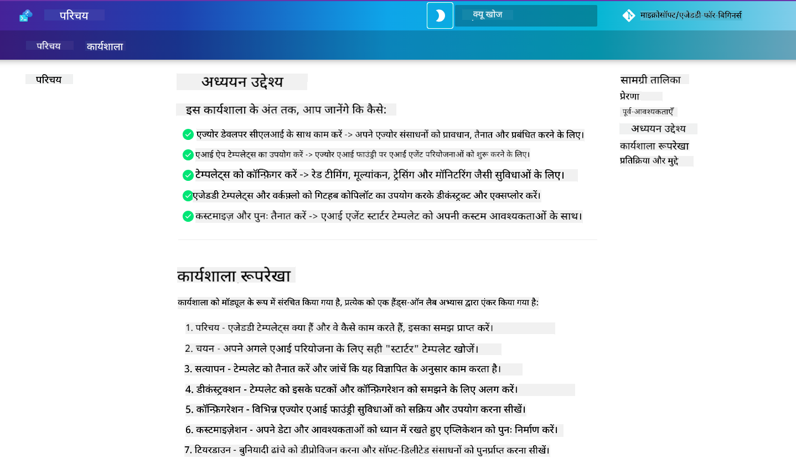

<!--
CO_OP_TRANSLATOR_METADATA:
{
  "original_hash": "9cc966416ab431c38b2ab863884b196c",
  "translation_date": "2025-09-24T10:50:54+00:00",
  "source_file": "workshop/README.md",
  "language_code": "hi"
}
-->
# AZD फॉर AI डेवलपर्स वर्कशॉप

Azure Developer CLI (AZD) को सीखने के लिए इस हैंड्स-ऑन वर्कशॉप में आपका स्वागत है, जिसमें AI एप्लिकेशन डिप्लॉयमेंट पर ध्यान केंद्रित किया गया है। यह वर्कशॉप आपको AZD टेम्पलेट्स को 3 चरणों में समझने में मदद करती है:

1. **खोज** - आपके लिए सही टेम्पलेट ढूंढें।
1. **डिप्लॉयमेंट** - इसे डिप्लॉय करें और सुनिश्चित करें कि यह काम करता है।
1. **कस्टमाइजेशन** - इसे संशोधित करें और इसे अपना बनाएं!

इस वर्कशॉप के दौरान, आपको कोर डेवलपर टूल्स और वर्कफ्लो से भी परिचित कराया जाएगा, जो आपके एंड-टू-एंड डेवलपमेंट यात्रा को सरल बनाने में मदद करेंगे।

<br/>

## ब्राउज़र-आधारित गाइड

वर्कशॉप के पाठ Markdown में हैं। आप इन्हें सीधे GitHub में नेविगेट कर सकते हैं - या नीचे दिए गए स्क्रीनशॉट के अनुसार ब्राउज़र-आधारित प्रीव्यू लॉन्च कर सकते हैं।



इस विकल्प का उपयोग करने के लिए - रिपॉजिटरी को अपने प्रोफाइल में फोर्क करें और GitHub Codespaces लॉन्च करें। एक बार जब VS Code टर्मिनल सक्रिय हो जाए, तो यह कमांड टाइप करें:

```bash title="" linenums="0"
mkdocs serve > /dev/null 2>&1 &
```

कुछ सेकंड में, आपको एक पॉप-अप डायलॉग दिखाई देगा। `Open in browser` विकल्प चुनें। वेब-आधारित गाइड अब एक नए ब्राउज़र टैब में खुल जाएगा। इस प्रीव्यू के कुछ लाभ:

1. **बिल्ट-इन सर्च** - कीवर्ड या पाठ जल्दी से खोजें।
1. **कॉपी आइकन** - कोडब्लॉक्स पर होवर करें और यह विकल्प देखें।
1. **थीम टॉगल** - डार्क और लाइट थीम के बीच स्विच करें।
1. **मदद प्राप्त करें** - फुटर में Discord आइकन पर क्लिक करें और जुड़ें!

<br/>

## वर्कशॉप का अवलोकन

**अवधि:** 3-4 घंटे  
**स्तर:** शुरुआती से मध्यवर्ती  
**पूर्वापेक्षाएँ:** Azure, AI अवधारणाओं, VS Code और कमांड-लाइन टूल्स की जानकारी।

यह एक हैंड्स-ऑन वर्कशॉप है जहां आप अभ्यास करके सीखते हैं। एक बार जब आप अभ्यास पूरा कर लें, तो हम आपको AZD फॉर बिगिनर्स पाठ्यक्रम की समीक्षा करने की सलाह देते हैं ताकि आप सुरक्षा और उत्पादकता सर्वोत्तम प्रथाओं में अपनी सीखने की यात्रा जारी रख सकें।

| समय| मॉड्यूल  | उद्देश्य |
|:---|:---|:---|
| 15 मिनट | [परिचय](docs/instructions/0-Introduction.md) | लक्ष्य समझें और शुरुआत करें |
| 30 मिनट | [AI टेम्पलेट चुनें](docs/instructions/1-Select-AI-Template.md) | विकल्पों का अन्वेषण करें और स्टार्टर चुनें | 
| 30 मिनट | [AI टेम्पलेट को मान्य करें](docs/instructions/2-Validate-AI-Template.md) | डिफॉल्ट समाधान को Azure पर डिप्लॉय करें |
| 30 मिनट | [AI टेम्पलेट को डी-कंस्ट्रक्ट करें](docs/instructions/3-Deconstruct-AI-Template.md) | संरचना और कॉन्फ़िगरेशन का अन्वेषण करें |
| 30 मिनट | [AI टेम्पलेट को कॉन्फ़िगर करें](docs/instructions/4-Configure-AI-Template.md) | उपलब्ध फीचर्स को सक्रिय करें और आज़माएं |
| 30 मिनट | [AI टेम्पलेट को कस्टमाइज़ करें](docs/instructions/5-Customize-AI-Template.md) | टेम्पलेट को अपनी आवश्यकताओं के अनुसार अनुकूलित करें |
| 30 मिनट | [इंफ्रास्ट्रक्चर को समाप्त करें](docs/instructions/6-Teardown-Infrastructure.md) | संसाधनों को साफ करें और रिलीज़ करें |
| 15 मिनट | [समापन और अगले कदम](docs/instructions/7-Wrap-up.md) | सीखने के संसाधन, वर्कशॉप चुनौती |

<br/>

## आप क्या सीखेंगे

AZD टेम्पलेट को Azure AI Foundry पर एंड-टू-एंड डेवलपमेंट के लिए विभिन्न क्षमताओं और टूल्स का पता लगाने के लिए एक लर्निंग सैंडबॉक्स के रूप में सोचें। इस वर्कशॉप के अंत तक, आपको इस संदर्भ में विभिन्न टूल्स और अवधारणाओं के लिए एक सहज समझ होनी चाहिए।

| अवधारणा  | उद्देश्य |
|:---|:---|
| **Azure Developer CLI** | टूल कमांड्स और वर्कफ्लो को समझें |
| **AZD टेम्पलेट्स**| प्रोजेक्ट संरचना और कॉन्फ़िगरेशन को समझें |
| **Azure AI Agent**| Azure AI Foundry प्रोजेक्ट को प्रोविजन और डिप्लॉय करें |
| **Azure AI Search**| एजेंट्स के साथ संदर्भ इंजीनियरिंग को सक्षम करें |
| **ऑब्ज़र्वेबिलिटी**| ट्रेसिंग, मॉनिटरिंग और मूल्यांकन का अन्वेषण करें |
| **रेड टीमिंग**| एडवर्सेरियल टेस्टिंग और समाधान का अन्वेषण करें |

<br/>

## वर्कशॉप संरचना

वर्कशॉप को टेम्पलेट खोज, डिप्लॉयमेंट, डी-कंस्ट्रक्शन और कस्टमाइजेशन की यात्रा पर ले जाने के लिए संरचित किया गया है - आधिकारिक [Getting Started with AI Agents](https://github.com/Azure-Samples/get-started-with-ai-agents) स्टार्टर टेम्पलेट को आधार के रूप में उपयोग करते हुए।

### [मॉड्यूल 1: AI टेम्पलेट चुनें](docs/instructions/1-Select-AI-Template.md) (30 मिनट)

- AI टेम्पलेट्स क्या हैं?
- AI टेम्पलेट्स कहां मिल सकते हैं?
- मैं AI एजेंट्स बनाना कैसे शुरू कर सकता हूं?
- **लैब**: GitHub Codespaces के साथ क्विकस्टार्ट

### [मॉड्यूल 2: AI टेम्पलेट को मान्य करें](docs/instructions/2-Validate-AI-Template.md) (30 मिनट)

- AI टेम्पलेट आर्किटेक्चर क्या है?
- AZD डेवलपमेंट वर्कफ्लो क्या है?
- AZD डेवलपमेंट में मदद कैसे प्राप्त करें?
- **लैब**: AI एजेंट्स टेम्पलेट को डिप्लॉय और मान्य करें

### [मॉड्यूल 3: AI टेम्पलेट को डी-कंस्ट्रक्ट करें](docs/instructions/3-Deconstruct-AI-Template.md) (30 मिनट)

- अपने `.azure/` वातावरण का अन्वेषण करें 
- अपने `infra/` संसाधन सेटअप का अन्वेषण करें 
- अपने AZD कॉन्फ़िगरेशन को `azure.yaml`s में अन्वेषण करें
- **लैब**: पर्यावरण वेरिएबल्स को संशोधित करें और पुनः डिप्लॉय करें

### [मॉड्यूल 4: AI टेम्पलेट को कॉन्फ़िगर करें](docs/instructions/4-Configure-AI-Template.md) (30 मिनट)
- अन्वेषण करें: Retrieval Augmented Generation
- अन्वेषण करें: एजेंट मूल्यांकन और रेड टीमिंग
- अन्वेषण करें: ट्रेसिंग और मॉनिटरिंग
- **लैब**: AI एजेंट + ऑब्ज़र्वेबिलिटी का अन्वेषण करें 

### [मॉड्यूल 5: AI टेम्पलेट को कस्टमाइज़ करें](docs/instructions/5-Customize-AI-Template.md) (30 मिनट)
- परिभाषित करें: PRD के साथ परिदृश्य आवश्यकताएं
- कॉन्फ़िगर करें: AZD के लिए पर्यावरण वेरिएबल्स
- लागू करें: अतिरिक्त कार्यों के लिए लाइफसाइकिल हुक्स
- **लैब**: मेरे परिदृश्य के लिए टेम्पलेट को कस्टमाइज़ करें

### [मॉड्यूल 6: इंफ्रास्ट्रक्चर को समाप्त करें](docs/instructions/6-Teardown-Infrastructure.md) (30 मिनट)
- पुनर्कथन: AZD टेम्पलेट्स क्या हैं?
- पुनर्कथन: Azure Developer CLI का उपयोग क्यों करें?
- अगले कदम: एक अलग टेम्पलेट आज़माएं!
- **लैब**: इंफ्रास्ट्रक्चर को डी-प्रोविजन करें और साफ करें

<br/>

## वर्कशॉप चुनौती

क्या आप खुद को और अधिक चुनौती देना चाहते हैं? यहां कुछ प्रोजेक्ट सुझाव दिए गए हैं - या अपने विचार हमारे साथ साझा करें!!

| प्रोजेक्ट | विवरण |
|:---|:---|
|1. **एक जटिल AI टेम्पलेट को डी-कंस्ट्रक्ट करें** | हमारे द्वारा बताए गए वर्कफ्लो और टूल्स का उपयोग करें और देखें कि क्या आप एक अलग AI समाधान टेम्पलेट को डिप्लॉय, मान्य और कस्टमाइज़ कर सकते हैं। _आपने क्या सीखा?_|
|2. **अपने परिदृश्य के साथ कस्टमाइज़ करें**  | एक अलग परिदृश्य के लिए PRD (प्रोडक्ट रिक्वायरमेंट्स डॉक्यूमेंट) लिखने का प्रयास करें। फिर अपने टेम्पलेट रिपो में GitHub Copilot का उपयोग करें और एजेंट मॉडल में इसे कस्टमाइज़ेशन वर्कफ्लो उत्पन्न करने के लिए कहें। _आपने क्या सीखा? आप इन सुझावों में कैसे सुधार कर सकते हैं?_|
| | |

## फीडबैक है?

1. इस रिपॉजिटरी पर एक इश्यू पोस्ट करें - इसे `Workshop` टैग करें ताकि आसानी हो।
1. Azure AI Foundry Discord में शामिल हों - अपने साथियों से जुड़ें!

| | | 
|:---|:---|
| **📚 कोर्स होम**| [AZD फॉर बिगिनर्स](../README.md)|
| **📖 डॉक्यूमेंटेशन** | [AI टेम्पलेट्स के साथ शुरुआत करें](https://learn.microsoft.com/en-us/azure/ai-foundry/how-to/develop/ai-template-get-started)|
| **🛠️AI टेम्पलेट्स** | [Azure AI Foundry टेम्पलेट्स](https://ai.azure.com/templates) |
|**🚀 अगले कदम** | [चुनौती लें](../../../workshop) |
| | |

<br/>

---

**पिछला:** [AI ट्रबलशूटिंग गाइड](../docs/troubleshooting/ai-troubleshooting.md) | **अगला:** [लैब 1: AZD बेसिक्स](../../../workshop/lab-1-azd-basics) से शुरू करें

**AZD के साथ AI एप्लिकेशन बनाना शुरू करने के लिए तैयार हैं?**

[लैब 1: AZD फाउंडेशन्स शुरू करें →](./lab-1-azd-basics/README.md)

---

