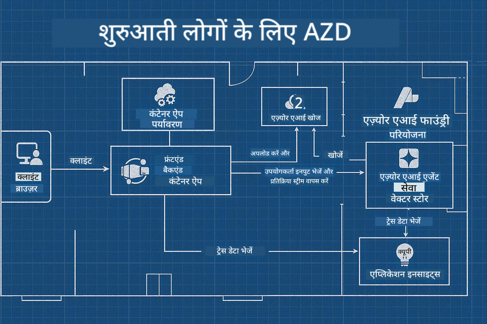

<!--
CO_OP_TRANSLATOR_METADATA:
{
  "original_hash": "245d24997bbcf2bae93bb2a503845d37",
  "translation_date": "2025-09-23T11:47:55+00:00",
  "source_file": "workshop/README.md",
  "language_code": "hi"
}
-->
# AI डेवलपर्स के लिए AZD वर्कशॉप

## AZD टेम्पलेट्स

आपके विशेष परिदृश्य के लिए एक एंटरप्राइज़-ग्रेड AI एप्लिकेशन समाधान बनाना बहुत कुछ अपने घर बनाने जैसा है। आप इसे खुद डिज़ाइन कर सकते हैं, ईंट-दर-ईंट बना सकते हैं, और यह सुनिश्चित करने की जिम्मेदारी ले सकते हैं कि यह सभी गवर्नेंस और विकास दिशानिर्देशों को पूरा करता है।

**या ....**

आप एक आर्किटेक्ट के साथ काम कर सकते हैं जो आपको एक _ब्लूप्रिंट_ दे सकता है एक शुरुआती घर के लिए, और फिर आपके साथ काम कर सकता है इसे _कस्टमाइज़_ करने के लिए ताकि यह आपकी ज़रूरतों के अनुसार फिट हो। यह आपको इस पर ध्यान केंद्रित करने की अनुमति देता है कि **आपका घर** विशेष क्या बनाता है, और विशेषज्ञों द्वारा आपके लिए वायरिंग, प्लंबिंग और अन्य निर्भरताओं को संभालने की अनुमति देता है।

**यही दृष्टिकोण [AI App Templates](https://ai.azure.com/templates)** के पीछे है - विभिन्न प्रकार के AI एप्लिकेशन "घरों" के निर्माण के लिए ब्लूप्रिंट की एक श्रृंखला, जो आपकी मुख्य आवश्यकताओं और निर्भरताओं पर निर्भर करती है।

## टेम्पलेट कस्टमाइज़ेशन

टेम्पलेट्स को [Azure AI Foundry](https://ai.azure.com) के साथ काम करने के लिए डिज़ाइन किया गया है। इस प्लेटफ़ॉर्म को अपने "बिल्डिंग कॉन्ट्रैक्टर" के रूप में सोचें, जिसमें वह सभी संसाधन, उपकरण और विशेषज्ञता उपलब्ध है जो आपको काम पूरा करने के लिए चाहिए!

आपको बस [अपने शुरुआती टेम्पलेट्स](https://learn.microsoft.com/en-us/azure/ai-foundry/how-to/develop/ai-template-get-started) चुनने की आवश्यकता है। उदाहरण के लिए, हम _Get Started with AI Agents_ टेम्पलेट पर ध्यान केंद्रित करेंगे ताकि आपको एक "Agentic AI Home" बनाया जा सके, जो AI Search, Red Teaming, Evaluations, Tracing, Monitoring और अन्य सुविधाओं के लिए तैयार हो!



आपको बस आर्किटेक्ट के साथ समय बुक करना है, जो आपको कस्टमाइज़ेशन प्रक्रिया के माध्यम से मार्गदर्शन करेगा। [GitHub Copilot for Azure](https://learn.microsoft.com/en-us/azure/developer/github-copilot-azure/get-started) आपका मार्गदर्शक हो सकता है। बस "इसके साथ चैट करें" ताकि:

- अपने टेम्पलेट में Azure सुविधाओं के बारे में जानें
- Azure संसाधन तैनात करें
- अपनी तैनाती के बारे में जानकारी प्राप्त करें
- समस्याओं का निदान और समाधान करें!

इस वर्कशॉप में, हम मौजूदा टेम्पलेट को _डिकंस्ट्रक्ट_ करना सीखेंगे (यह जानने के लिए कि यह क्या प्रदान करता है), फिर इसे _कस्टमाइज़_ करेंगे (अपनी आवश्यकताओं को पूरा करने के लिए) - एक कदम में।

AI टेम्पलेट्स **काम को आसान बनाते हैं** - वर्कशॉप पूरा करके आप सीखेंगे कि इसे **अपना कैसे बनाएं।**

----

**वर्कशॉप नेविगेशन**
- **📚 कोर्स होम**: [AZD For Beginners](../README.md)
- **📖 संबंधित अध्याय**: [अध्याय 1](../README.md#-chapter-1-foundation--quick-start), [अध्याय 2](../README.md#-chapter-2-ai-first-development-recommended-for-ai-developers), और [अध्याय 5](../README.md#-chapter-5-multi-agent-ai-solutions-advanced) को कवर करता है
- **🛠️ हैंड्स-ऑन लैब**: [AI Workshop Lab](../docs/ai-foundry/ai-workshop-lab.md)
- **🚀 अगले कदम**: [वर्कशॉप लैब मॉड्यूल्स](../../../workshop)

Azure Developer CLI (AZD) के साथ AI एप्लिकेशन तैनाती सीखने के लिए हैंड्स-ऑन वर्कशॉप में आपका स्वागत है। यह वर्कशॉप आपको AZD की मूल बातें से लेकर प्रोडक्शन-रेडी AI समाधान तैनात करने तक ले जाने के लिए डिज़ाइन की गई है।

## वर्कशॉप का अवलोकन

**अवधि:** 2-3 घंटे  
**स्तर:** शुरुआती से मध्यवर्ती  
**पूर्वापेक्षाएँ:** Azure, कमांड लाइन टूल्स, और AI अवधारणाओं का बुनियादी ज्ञान

### आप क्या सीखेंगे

- **AZD की मूल बातें**: AZD के साथ Infrastructure as Code को समझना
- 🤖 **AI सेवा एकीकरण**: Azure OpenAI, AI Search, और अन्य AI सेवाओं को तैनात करना
- **कंटेनर तैनाती**: AI एप्लिकेशन के लिए Azure Container Apps का उपयोग करना
- **सुरक्षा सर्वोत्तम प्रथाएँ**: Managed Identity और सुरक्षित कॉन्फ़िगरेशन लागू करना
- **मॉनिटरिंग और ऑब्ज़र्वेबिलिटी**: AI वर्कलोड्स के लिए Application Insights सेट करना
- **प्रोडक्शन पैटर्न**: एंटरप्राइज़-रेडी तैनाती रणनीतियाँ

## वर्कशॉप संरचना

### मॉड्यूल 1: AZD की नींव (30 मिनट)
- AZD को इंस्टॉल और कॉन्फ़िगर करना
- AZD प्रोजेक्ट संरचना को समझना
- आपकी पहली AZD तैनाती
- **लैब**: एक साधारण वेब एप्लिकेशन तैनात करें

### मॉड्यूल 2: Azure OpenAI एकीकरण (45 मिनट)
- Azure OpenAI संसाधन सेट करना
- मॉडल तैनाती रणनीतियाँ
- API एक्सेस और प्रमाणीकरण कॉन्फ़िगर करना
- **लैब**: GPT-4 के साथ एक चैट एप्लिकेशन तैनात करें

### मॉड्यूल 3: RAG एप्लिकेशन (45 मिनट)
- Azure AI Search एकीकरण
- Azure Document Intelligence के साथ दस्तावेज़ प्रसंस्करण
- वेक्टर एम्बेडिंग और सेमांटिक सर्च
- **लैब**: एक दस्तावेज़ Q&A सिस्टम बनाएं

### मॉड्यूल 4: प्रोडक्शन तैनाती (30 मिनट)
- कंटेनर ऐप्स कॉन्फ़िगरेशन
- स्केलिंग और प्रदर्शन अनुकूलन
- मॉनिटरिंग और लॉगिंग
- **लैब**: ऑब्ज़र्वेबिलिटी के साथ प्रोडक्शन में तैनात करें

### मॉड्यूल 5: उन्नत पैटर्न (15 मिनट)
- मल्टी-एनवायरनमेंट तैनातियाँ
- CI/CD एकीकरण
- लागत अनुकूलन रणनीतियाँ
- **समाप्ति**: प्रोडक्शन रेडीनेस चेकलिस्ट

## पूर्वापेक्षाएँ

### आवश्यक उपकरण

कृपया वर्कशॉप से पहले इन उपकरणों को इंस्टॉल करें:

```bash
# Azure Developer CLI
curl -fsSL https://aka.ms/install-azd.sh | bash

# Azure CLI
curl -sL https://aka.ms/InstallAzureCLIDeb | sudo bash

# Git
sudo apt-get install git

# Docker
curl -fsSL https://get.docker.com -o get-docker.sh
sudo sh get-docker.sh

# Python 3.10+
sudo apt-get install python3.10 python3.10-venv python3-pip
```

### Azure अकाउंट सेटअप

1. **Azure सब्सक्रिप्शन**: [फ्री में साइन अप करें](https://azure.microsoft.com/free/)
2. **Azure OpenAI एक्सेस**: [एक्सेस का अनुरोध करें](https://aka.ms/oai/access)
3. **आवश्यक अनुमतियाँ**:
   - सब्सक्रिप्शन या रिसोर्स ग्रुप पर Contributor भूमिका
   - User Access Administrator (RBAC असाइनमेंट के लिए)

### पूर्वापेक्षाएँ सत्यापित करें

अपनी सेटअप को सत्यापित करने के लिए यह स्क्रिप्ट चलाएँ:

```bash
#!/bin/bash
echo "Verifying workshop prerequisites..."

# Check AZD installation
if command -v azd &> /dev/null; then
    echo "✅ Azure Developer CLI: $(azd --version)"
else
    echo "❌ Azure Developer CLI not found"
fi

# Check Azure CLI
if command -v az &> /dev/null; then
    echo "✅ Azure CLI: $(az --version | head -n1)"
else
    echo "❌ Azure CLI not found"
fi

# Check Docker
if command -v docker &> /dev/null; then
    echo "✅ Docker: $(docker --version)"
else
    echo "❌ Docker not found"
fi

# Check Python
if command -v python3 &> /dev/null; then
    echo "✅ Python: $(python3 --version)"
else
    echo "❌ Python 3 not found"
fi

# Check Azure login
if az account show &> /dev/null; then
    echo "✅ Azure: Logged in as $(az account show --query user.name -o tsv)"
else
    echo "❌ Azure: Not logged in (run 'az login')"
fi

echo "Setup verification complete!"
```

## वर्कशॉप सामग्री

### लैब अभ्यास

प्रत्येक मॉड्यूल में स्टार्ट कोड और चरण-दर-चरण निर्देशों के साथ हैंड्स-ऑन लैब्स शामिल हैं:

- **[lab-1-azd-basics/](../../../workshop/lab-1-azd-basics)** - आपकी पहली AZD तैनाती
- **[lab-2-openai-chat/](../../../workshop/lab-2-openai-chat)** - Azure OpenAI के साथ चैट एप्लिकेशन
- **[lab-3-rag-search/](../../../workshop/lab-3-rag-search)** - AI Search के साथ RAG एप्लिकेशन
- **[lab-4-production/](../../../workshop/lab-4-production)** - प्रोडक्शन तैनाती पैटर्न
- **[lab-5-advanced/](../../../workshop/lab-5-advanced)** - उन्नत तैनाती परिदृश्य

### संदर्भ सामग्री

- **[AI Foundry Integration Guide](../docs/ai-foundry/azure-ai-foundry-integration.md)** - व्यापक एकीकरण पैटर्न
- **[AI Model Deployment Guide](../docs/ai-foundry/ai-model-deployment.md)** - मॉडल तैनाती सर्वोत्तम प्रथाएँ
- **[Production AI Practices](../docs/ai-foundry/production-ai-practices.md)** - एंटरप्राइज़ तैनाती पैटर्न
- **[AI Troubleshooting Guide](../docs/troubleshooting/ai-troubleshooting.md)** - सामान्य समस्याएँ और समाधान

### सैंपल टेम्पलेट्स

सामान्य AI परिदृश्यों के लिए क्विक-स्टार्ट टेम्पलेट्स:

```
workshop/templates/
├── minimal-chat/          # Basic OpenAI chat app
├── rag-application/       # RAG with AI Search
├── multi-model/          # Multiple AI services
└── production-ready/     # Enterprise template
```

## शुरुआत करें

### विकल्प 1: GitHub Codespaces (अनुशंसित)

वर्कशॉप शुरू करने का सबसे तेज़ तरीका:

[](https://github.com/codespaces/new?hide_repo_select=true&ref=main&repo=YOUR_REPO_ID)

### विकल्प 2: लोकल डेवलपमेंट

1. **वर्कशॉप रिपॉजिटरी क्लोन करें:**
```bash
git clone https://github.com/YOUR_ORG/AZD-for-beginners.git
cd AZD-for-beginners/workshop
```

2. **Azure में लॉगिन करें:**
```bash
az login
azd auth login
```

3. **लैब 1 से शुरू करें:**
```bash
cd lab-1-azd-basics
cat README.md  # Follow the instructions
```

### विकल्प 3: प्रशिक्षक-नेतृत्व वाली वर्कशॉप

यदि आप प्रशिक्षक-नेतृत्व वाले सत्र में भाग ले रहे हैं:

- 🎥 **वर्कशॉप रिकॉर्डिंग**: [मांग पर उपलब्ध](https://aka.ms/azd-ai-workshop)
- 💬 **Discord समुदाय**: [लाइव समर्थन के लिए शामिल हों](https://aka.ms/foundry/discord)
- **वर्कशॉप फीडबैक**: [अपना अनुभव साझा करें](https://aka.ms/azd-workshop-feedback)

## वर्कशॉप टाइमलाइन

### स्व-गति से सीखना (3 घंटे)

```
⏰ 00:00 - 00:30  Module 1: AZD Foundations
⏰ 00:30 - 01:15  Module 2: Azure OpenAI Integration
⏰ 01:15 - 02:00  Module 3: RAG Applications
⏰ 02:00 - 02:30  Module 4: Production Deployment
⏰ 02:30 - 02:45  Module 5: Advanced Patterns
⏰ 02:45 - 03:00  Q&A and Next Steps
```

### प्रशिक्षक-नेतृत्व सत्र (2.5 घंटे)

```
⏰ 00:00 - 00:15  Welcome & Prerequisites Check
⏰ 00:15 - 00:40  Module 1: Live Demo + Lab
⏰ 00:40 - 01:20  Module 2: OpenAI Integration
⏰ 01:20 - 01:30  Break
⏰ 01:30 - 02:10  Module 3: RAG Applications
⏰ 02:10 - 02:30  Module 4: Production Patterns
⏰ 02:30 - 02:45  Module 5: Advanced Topics
⏰ 02:45 - 03:00  Q&A and Resources
```

## सफलता के मानदंड

वर्कशॉप के अंत तक, आप सक्षम होंगे:

✅ **AI एप्लिकेशन तैनात करें** AZD टेम्पलेट्स का उपयोग करके  
✅ **Azure OpenAI सेवाओं को कॉन्फ़िगर करें** उचित सुरक्षा के साथ  
✅ **RAG एप्लिकेशन बनाएं** Azure AI Search एकीकरण के साथ  
✅ **प्रोडक्शन पैटर्न लागू करें** एंटरप्राइज़ AI वर्कलोड्स के लिए  
✅ **AI एप्लिकेशन तैनाती मॉनिटर और ट्रबलशूट करें**  
✅ **AI वर्कलोड्स के लिए लागत अनुकूलन रणनीतियाँ लागू करें**  

## समुदाय और समर्थन

### वर्कशॉप के दौरान

- 🙋 **प्रश्न**: वर्कशॉप चैट का उपयोग करें या हाथ उठाएँ
- 🐛 **समस्याएँ**: [ट्रबलशूटिंग गाइड](../docs/troubleshooting/ai-troubleshooting.md) देखें
- **टिप्स**: अन्य प्रतिभागियों के साथ खोजें साझा करें

### वर्कशॉप के बाद

- 💬 **Discord**: [Azure AI Foundry समुदाय](https://aka.ms/foundry/discord)
- **GitHub Issues**: [टेम्पलेट समस्याएँ रिपोर्ट करें](https://github.com/YOUR_ORG/AZD-for-beginners/issues)
- 📧 **फीडबैक**: [वर्कशॉप मूल्यांकन फॉर्म](https://aka.ms/azd-workshop-feedback)

## अगले कदम

### सीखना जारी रखें

1. **उन्नत परिदृश्य**: [मल्टी-रीजन तैनातियाँ](../docs/ai-foundry/production-ai-practices.md#multi-region-deployment) एक्सप्लोर करें
2. **CI/CD एकीकरण**: [GitHub Actions वर्कफ़्लो](../docs/deployment/github-actions.md) सेट करें
3. **कस्टम टेम्पलेट्स**: अपने [AZD टेम्पलेट्स](../docs/getting-started/custom-templates.md) बनाएं

### अपने प्रोजेक्ट्स में लागू करें

1. **मूल्यांकन**: हमारा [रेडिनेस चेकलिस्ट](./production-readiness-checklist.md) उपयोग करें
2. **टेम्पलेट्स**: हमारे [AI-विशिष्ट टेम्पलेट्स](../../../workshop/templates) से शुरू करें
3. **समर्थन**: [Azure AI Foundry Discord](https://aka.ms/foundry/discord) में शामिल हों

### अपनी सफलता साझा करें

- ⭐ **रिपॉजिटरी को स्टार करें** यदि इस वर्कशॉप ने आपकी मदद की
- 🐦 **सोशल मीडिया पर साझा करें** #AzureDeveloperCLI #AzureAI के साथ
- 📝 **ब्लॉग पोस्ट लिखें** अपनी AI तैनाती यात्रा के बारे में

---

## वर्कशॉप फीडबैक

आपकी प्रतिक्रिया हमें वर्कशॉप अनुभव को बेहतर बनाने में मदद करती है:

| पहलू | रेटिंग (1-5) | टिप्पणियाँ |
|------|--------------|------------|
| सामग्री की गुणवत्ता | ⭐⭐⭐⭐⭐ | |
| हैंड्स-ऑन लैब्स | ⭐⭐⭐⭐⭐ | |
| दस्तावेज़ीकरण | ⭐⭐⭐⭐⭐ | |
| कठिनाई स्तर | ⭐⭐⭐⭐⭐ | |
| समग्र अनुभव | ⭐⭐⭐⭐⭐ | |

**फीडबैक सबमिट करें**: [वर्कशॉप मूल्यांकन फॉर्म](https://aka.ms/azd-workshop-feedback)

---

**पिछला:** [AI Troubleshooting Guide](../docs/troubleshooting/ai-troubleshooting.md) | **अगला:** [Lab 1: AZD Basics](../../../workshop/lab-1-azd-basics) से शुरू करें

**AZD के साथ AI एप्लिकेशन बनाना शुरू करने के लिए तैयार हैं?**

[Lab 1: AZD Foundations →](./lab-1-azd-basics/README.md)

---

