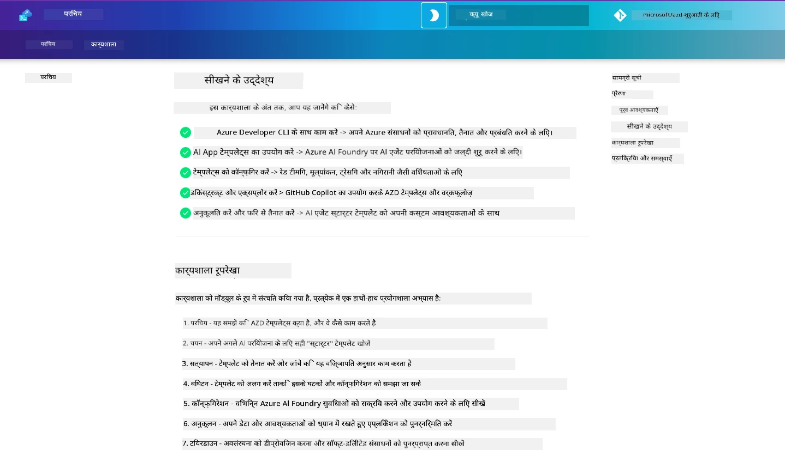

<div align="center">
  <div style="background: linear-gradient(135deg, #0078d4, #106ebe); border-radius: 10px; padding: 20px; margin: 20px 0; box-shadow: 0 4px 15px rgba(0, 120, 212, 0.3); border: 2px solid #005a9e;">
    <h2 style="color: white; margin: 0; font-size: 24px; text-shadow: 1px 1px 2px rgba(0,0,0,0.3);">
      🎯 AZD for AI डेवलपर्स कार्यशाला
    </h2>
    <p style="color: white; margin: 10px 0 0 0; font-size: 16px; text-shadow: 1px 1px 2px rgba(0,0,0,0.3);">
      <strong>Azure Developer CLI के साथ AI एप्लिकेशन बनाने के लिए एक व्यावहारिक कार्यशाला।</strong><br>
      AZD टेम्पलेट्स और AI तैनाती वर्कफ़्लो को मास्टर करने के लिए 7 मॉड्यूल पूरा करें।
    </p>
    <div style="margin-top: 15px;">
      <span style="background: rgba(255,255,255,0.2); padding: 5px 10px; border-radius: 15px; color: white; font-size: 14px;">
        📅 अंतिम अपडेट: मार्च 2026
      </span>
    </div>
  </div>
</div>

# AZD for AI डेवलपर्स कार्यशाला

Azure Developer CLI (AZD) सीखने के लिए व्यावहारिक कार्यशाला में आपका स्वागत है, जिसमें AI एप्लिकेशन तैनाती पर ध्यान केंद्रित किया गया है। यह कार्यशाला आपको AZD टेम्पलेट्स की व्यावहारिक समझ 3 चरणों में प्राप्त करने में मदद करती है:

1. **खोज** - वह टेम्पलेट खोजें जो आपके लिए उपयुक्त हो।
1. **तैनाती** - तैनात करें और सत्यापित करें कि यह काम करता है
1. **अनुकूलन** - संशोधित करें और इसे अपना बनाने के लिए पुनरावृत्ति करें!

इस कार्यशाला के दौरान, आपको कोर डेवलपर टूल और वर्कफ़्लो से भी परिचित कराया जाएगा, जो आपकी एंड-टू-एंड डेवलपमेंट यात्रा को सुव्यवस्थित करने में मदद करेगा।

<br/>

## ब्राउज़र-आधारित गाइड

कार्यशाला के पाठ मार्कडाउन में हैं। आप उन्हें सीधे GitHub में навिगेट कर सकते हैं - या नीचे स्क्रीनशॉट में दिखाए अनुसार ब्राउज़र-आधारित प्रीव्यू लॉन्च कर सकते हैं।



इस विकल्प का उपयोग करने के लिए - रिपॉजिटरी को अपने प्रोफ़ाइल पर फ़ॉर्म करें, और GitHub Codespaces लॉन्च करें। एक बार VS Code टर्मिनल सक्रिय हो जाने पर, यह कमांड टाइप करें:

यह ब्राउज़र प्रीव्यू GitHub Codespaces, dev कंटेनरों, या Python और MkDocs इंस्टॉल किए गए स्थानीय क्लोन में काम करता है।

```bash title="" linenums="0"
mkdocs serve > /dev/null 2>&1 &
```

कुछ सेकंड में, आपको एक पॉप-अप डायलॉग दिखाई देगा। विकल्प चुनें `Open in browser`। फिर वेब-आधारित गाइड नए ब्राउज़र टैब में खुलेगा। इस प्रीव्यू के कुछ लाभ:

1. **इनबिल्ट खोज** - कीवर्ड या पाठ जल्दी खोजें।
1. **कॉपी आइकन** - कोडब्लॉक्स पर होवर करें यह विकल्प देखने के लिए
1. **थीम टॉगल** - डार्क और लाइट थीम के बीच स्विच करें
1. **मदद पाएं** - फ़ुटर में डिस्कॉर्ड आइकन पर क्लिक करके जुड़ें!

<br/>

## कार्यशाला अवलोकन

**समय:** 3-4 घंटे  
**स्तर:** प्रारंभिक से मध्यवर्ती  
**पूर्वापेक्षाएँ:** Azure, AI अवधारणाओं, VS Code और कमांड-लाइन टूल्स की परिचितता।

यह एक व्यावहारिक कार्यशाला है जहां आप करके सीखते हैं। अभ्यास पूरा करने के बाद, हम सुझाते हैं कि आप AZD फॉर बिगिनर्स पाठ्यक्रम की समीक्षा करें ताकि सिक्योरिटी और उत्पादकता सर्वोत्तम प्रथाओं में अपनी सीख जारी रख सकें।

| समय| मॉड्यूल  | उद्देश्य |
|:---|:---|:---|
| 15 मिनट | [परिचय](docs/instructions/0-Introduction.md) | मंच सेट करें, लक्ष्य समझें |
| 30 मिनट | [AI टेम्पलेट चुनें](docs/instructions/1-Select-AI-Template.md) | विकल्प खोजें और प्रारंभ करें | 
| 30 मिनट | [AI टेम्पलेट सत्यापित करें](docs/instructions/2-Validate-AI-Template.md) | डिफ़ॉल्ट समाधान Azure पर तैनात करें |
| 30 मिनट | [AI टेम्पलेट विघटित करें](docs/instructions/3-Deconstruct-AI-Template.md) | संरचना और कॉन्फ़िगरेशन खोजें |
| 30 मिनट | [AI टेम्पलेट कॉन्फ़िगर करें](docs/instructions/4-Configure-AI-Template.md) | उपलब्ध फीचर्स सक्रिय करें और आज़माएं |
| 30 मिनट | [AI टेम्पलेट अनुकूलित करें](docs/instructions/5-Customize-AI-Template.md) | टेम्पलेट को अपनी आवश्यकताओं के अनुसार ढालें |
| 30 मिनट | [इन्फ्रास्ट्रक्चर बंद करें](docs/instructions/6-Teardown-Infrastructure.md) | साफ-सफाई और संसाधन मुक्त करें |
| 15 मिनट | [समापन और अगले चरण](docs/instructions/7-Wrap-up.md) | सीखने के संसाधन, कार्यशाला चुनौती |

<br/>

## आप क्या सीखेंगे

AZD टेम्पलेट को एक सीखने वाले सैंडबॉक्स के रूप में सोचें जहां आप Microsoft Foundry पर एंड-टू-एंड विकास के विभिन्न उपकरणों और क्षमताओं का पता लगा सकते हैं। इस कार्यशाला के अंत तक, आपको इस संदर्भ में विभिन्न टूल्स और अवधारणाओं का सहज ज्ञान होना चाहिए।

| अवधारणा  | उद्देश्य |
|:---|:---|
| **Azure Developer CLI** | टूल कमांड और वर्कफ़्लो समझें |
| **AZD टेम्पलेट्स**| परियोजना संरचना और कॉन्फ़िगरेशन समझें |
| **Azure AI एजेंट**| Microsoft Foundry परियोजना प्रदान और तैनात करें |
| **Azure AI Search**| एजेंट के साथ संदर्भ इंजीनियरिंग सक्षम करें |
| **ऑब्ज़र्वेबिलिटी**| ट्रेसिंग, मॉनिटरिंग और मूल्यांकन का पता लगाएं |
| **रेड टीमिंग**| विरोधी परीक्षण और कमियों की जाँच करें |

<br/>

## कार्यशाला संरचना

कार्यशाला को इस तरह संरचित किया गया है कि यह आपको टेम्पलेट खोज से लेकर तैनाती, विघटन और अनुकूलन की यात्रा पर ले जाए - आधिकारिक [Getting Started with AI Agents](https://github.com/Azure-Samples/get-started-with-ai-agents) स्टार्टर टेम्पलेट का उपयोग आधार के रूप में।

### [मॉड्यूल 1: AI टेम्पलेट चुनें](docs/instructions/1-Select-AI-Template.md) (30 मिनट)

- AI टेम्पलेट्स क्या हैं?
- मैं AI टेम्पलेट्स कहां पा सकता हूं?
- मैं AI एजेंट्स बनाना कैसे शुरू कर सकता हूं?
- **प्रयोगशाला**: Codespaces या dev कंटेनर में क्विकस्टार्ट

### [मॉड्यूल 2: AI टेम्पलेट सत्यापित करें](docs/instructions/2-Validate-AI-Template.md) (30 मिनट)

- AI टेम्पलेट आर्किटेक्चर क्या है?
- AZD विकास वर्कफ़्लो क्या है?
- AZD विकास में मदद कैसे प्राप्त करें?
- **प्रयोगशाला**: AI एजेंट्स टेम्पलेट तैनात और सत्यापित करें

### [मॉड्यूल 3: AI टेम्पलेट विघटित करें](docs/instructions/3-Deconstruct-AI-Template.md) (30 मिनट)

- `.azure/` में अपना पर्यावरण अन्वेषण करें
- `infra/` में रिसोर्स सेटअप देखें
- `azure.yaml` में AZD कॉन्फ़िगरेशन देखें
- **प्रयोगशाला**: पर्यावरण चर संशोधित करें & दोबारा तैनात करें

### [मॉड्यूल 4: AI टेम्पलेट कॉन्फ़िगर करें](docs/instructions/4-Configure-AI-Template.md) (30 मिनट)
- अन्वेषण: रिट्रीवल ऑगमेंटेड जनरेशन
- अन्वेषण: एजेंट मूल्यांकन और रेड टीमिंग
- अन्वेषण: ट्रेसिंग और मॉनिटरिंग
- **प्रयोगशाला**: AI एजेंट + ऑब्ज़र्वेबिलिटी अन्वेषण 

### [मॉड्यूल 5: AI टेम्पलेट अनुकूलित करें](docs/instructions/5-Customize-AI-Template.md) (30 मिनट)
- परिभाषित करें: परिदृश्य आवश्यकताओं के साथ PRD
- कॉन्फ़िगर करें: AZD के लिए पर्यावरण चर
- लागू करें: अतिरिक्त कार्यों के लिए लाइफसायकल हुक्स
- **प्रयोगशाला**: अपने परिदृश्य के लिए टेम्पलेट अनुकूलित करें

### [मॉड्यूल 6: इन्फ्रास्ट्रक्चर बंद करें](docs/instructions/6-Teardown-Infrastructure.md) (30 मिनट)
- पुनःसमीक्षा: AZD टेम्पलेट्स क्या हैं?
- पुनःसमीक्षा: Azure Developer CLI क्यों उपयोग करें?
- अगले चरण: अलग टेम्पलेट प्रयास करें!
- **प्रयोगशाला**: इन्फ्रास्ट्रक्चर डिप्रोविजन और साफ-सफाई

<br/>

## कार्यशाला चुनौती

क्या आप अपने आप को और अधिक चुनौती देना चाहते हैं? यहाँ कुछ परियोजना सुझाव हैं - या अपनी विचार हमारे साथ साझा करें!!

| परियोजना | विवरण |
|:---|:---|
|1. **एक जटिल AI टेम्पलेट विघटित करें** | हमने जो वर्कफ़्लो और टूल्स बताए हैं उनका उपयोग करें और देखें कि क्या आप एक अलग AI समाधान टेम्पलेट तैनात, सत्यापित और अनुकूलित कर सकते हैं। _आपने क्या सीखा?_|
|2. **अपने परिदृश्य के साथ अनुकूलित करें**  | एक अलग परिदृश्य के लिए PRD (उत्पाद आवश्यकताएं दस्तावेज़) लिखने का प्रयास करें। फिर अपने टेम्पलेट रिपो में GitHub Copilot का उपयोग करें एजेंट मॉडल में - और इसे आपके लिए अनुकूलन वर्कफ़्लो उत्पन्न करने को कहें। _आपने क्या सीखा? आप इन सुझावों में कैसे सुधार कर सकते हैं?_|
| | |

## प्रतिक्रिया है?

1. इस रिपो में एक इशू पोस्ट करें - सुविधा के लिए इसे `Workshop` टैग करें।
1. Microsoft Foundry Discord में शामिल हों - अपने साथियों से जुड़ें!


| | | 
|:---|:---|
| **📚 कोर्स होम**| [AZD फॉर बिगिनर्स](../README.md)|
| **📖 दस्तावेज़** | [AI टेम्पलेट्स के साथ शुरुआत करें](https://learn.microsoft.com/en-us/azure/ai-foundry/how-to/develop/ai-template-get-started)|
| **🛠️AI टेम्पलेट्स** | [Microsoft Foundry टेम्पलेट्स](https://ai.azure.com/templates) |
|**🚀 अगले चरण** | [कार्यशाला शुरू करें](#कार्यशाला-अवलोकन) |
| | |

<br/>

---

**नेविगेशन:** [मुख्य कोर्स](../README.md) | [परिचय](docs/instructions/0-Introduction.md) | [मॉड्यूल 1: टेम्पलेट चुनें](docs/instructions/1-Select-AI-Template.md)

**क्या आप AZD के साथ AI एप्लिकेशन बनाना शुरू करने के लिए तैयार हैं?**

[कार्यशाला शुरू करें: परिचय →](docs/instructions/0-Introduction.md)

---

<!-- CO-OP TRANSLATOR DISCLAIMER START -->
**अस्वीकरण**:  
इस दस्तावेज़ का अनुवाद AI अनुवाद सेवा [Co-op Translator](https://github.com/Azure/co-op-translator) का उपयोग करके किया गया है। जबकि हम सटीकता के लिए प्रयासरत हैं, कृपया ध्यान दें कि स्वचालित अनुवाद में त्रुटियाँ या अशुद्धियाँ हो सकती हैं। मूल दस्तावेज़ जो इसकी मूल भाषा में है, उसे अधिकारिक स्रोत माना जाना चाहिए। महत्वपूर्ण जानकारी के लिए, पेशेवर मानव अनुवाद की सलाह दी जाती है। इस अनुवाद के उपयोग से होने वाली किसी भी गलतफहमी या गलत व्याख्या के लिए हम जिम्मेदार नहीं हैं।
<!-- CO-OP TRANSLATOR DISCLAIMER END -->