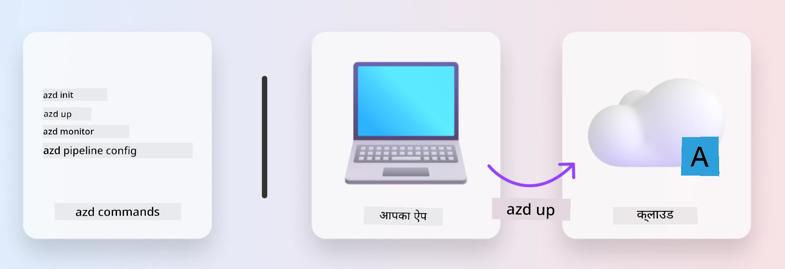
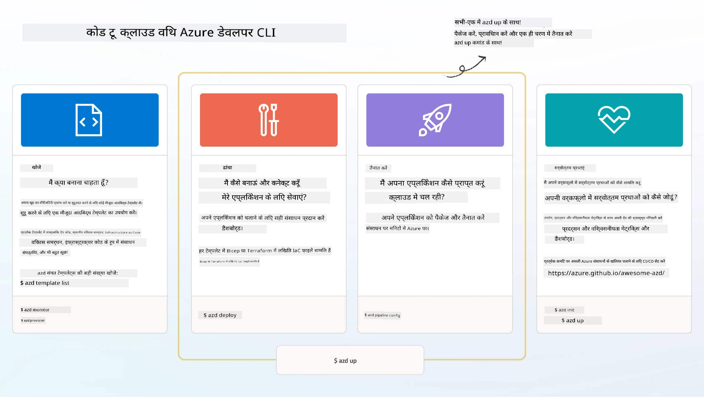

# 1. टेम्पलेट चुनें

!!! tip "इस मॉड्यूल के अंत तक आप सक्षम होंगे"

    - [ ] AZD टेम्पलेट्स क्या हैं, इसका वर्णन करें
    - [ ] AI के लिए AZD टेम्पलेट्स खोजें और उपयोग करें
    - [ ] AI एजेंट्स टेम्पलेट के साथ शुरुआत करें
    - [ ] **लैब 1:** GitHub Codespaces के साथ AZD क्विकस्टार्ट

---

## 1. एक बिल्डर की उपमा

एक आधुनिक एंटरप्राइज़-रेडी AI एप्लिकेशन को _शुरुआत से_ बनाना चुनौतीपूर्ण हो सकता है। यह कुछ ऐसा है जैसे आप अपने नए घर को खुद, ईंट दर ईंट बनाएं। हां, यह संभव है! लेकिन यह वांछित परिणाम प्राप्त करने का सबसे प्रभावी तरीका नहीं है!

इसके बजाय, हम अक्सर एक मौजूदा _डिज़ाइन ब्लूप्रिंट_ से शुरुआत करते हैं और इसे अपनी व्यक्तिगत आवश्यकताओं के अनुसार अनुकूलित करने के लिए एक आर्किटेक्ट के साथ काम करते हैं। और यही दृष्टिकोण अपनाना चाहिए जब आप इंटेलिजेंट एप्लिकेशन बना रहे हों। पहले, एक अच्छा डिज़ाइन आर्किटेक्चर खोजें जो आपकी समस्या के क्षेत्र में फिट बैठता हो। फिर एक सॉल्यूशन आर्किटेक्ट के साथ काम करें ताकि इसे आपके विशेष परिदृश्य के लिए अनुकूलित और विकसित किया जा सके।

लेकिन ये डिज़ाइन ब्लूप्रिंट्स कहां मिल सकते हैं? और ऐसा आर्किटेक्ट कैसे खोजें जो हमें सिखाने के लिए तैयार हो कि इन ब्लूप्रिंट्स को कैसे अनुकूलित और तैनात करें? इस वर्कशॉप में, हम इन सवालों का जवाब तीन तकनीकों के माध्यम से देते हैं:

1. [Azure Developer CLI](https://aka.ms/azd) - एक ओपन-सोर्स टूल जो स्थानीय विकास (बिल्ड) से क्लाउड तैनाती (शिप) तक डेवलपर की यात्रा को तेज करता है।
1. [Azure AI Foundry Templates](https://ai.azure.com/templates) - मानकीकृत ओपन-सोर्स रिपॉजिटरी जो AI सॉल्यूशन आर्किटेक्चर को तैनात करने के लिए नमूना कोड, इंफ्रास्ट्रक्चर और कॉन्फ़िगरेशन फाइल्स प्रदान करती हैं।
1. [GitHub Copilot Agent Mode](https://code.visualstudio.com/docs/copilot/chat/chat-agent-mode) - Azure ज्ञान पर आधारित एक कोडिंग एजेंट, जो हमें कोडबेस को नेविगेट करने और बदलाव करने में मार्गदर्शन कर सकता है - प्राकृतिक भाषा का उपयोग करके।

इन उपकरणों के साथ, अब हम सही टेम्पलेट _खोज_ सकते हैं, इसे _तैनात_ कर सकते हैं ताकि यह सुनिश्चित हो सके कि यह काम करता है, और इसे _अनुकूलित_ कर सकते हैं ताकि यह हमारे विशेष परिदृश्यों के अनुरूप हो। चलिए शुरू करते हैं और सीखते हैं कि ये कैसे काम करते हैं।

---

## 2. Azure Developer CLI

[Azure Developer CLI](https://learn.microsoft.com/en-us/azure/developer/azure-developer-cli/) (या `azd`) एक ओपन-सोर्स कमांडलाइन टूल है जो आपके कोड-से-क्लाउड यात्रा को तेज कर सकता है। यह डेवलपर-फ्रेंडली कमांड्स का एक सेट प्रदान करता है जो आपके IDE (विकास) और CI/CD (डेवऑप्स) वातावरण में लगातार काम करता है।

`azd` के साथ, आपकी तैनाती यात्रा इतनी सरल हो सकती है:

- `azd init` - एक मौजूदा AZD टेम्पलेट से एक नया AI प्रोजेक्ट प्रारंभ करता है।
- `azd up` - इंफ्रास्ट्रक्चर को प्रोविजन करता है और आपके एप्लिकेशन को एक ही चरण में तैनात करता है।
- `azd monitor` - आपके तैनात एप्लिकेशन के लिए रीयल-टाइम मॉनिटरिंग और डायग्नोस्टिक्स प्राप्त करें।
- `azd pipeline config` - Azure पर तैनाती को स्वचालित करने के लिए CI/CD पाइपलाइनों को सेटअप करें।

**🎯 | अभ्यास**: <br/> 
GitHub Codespaces वातावरण में `azd` कमांडलाइन टूल का अन्वेषण करें। इस कमांड को टाइप करके शुरू करें ताकि आप देख सकें कि यह टूल क्या कर सकता है:

```bash title="" linenums="0"
azd help
```



---

## 3. AZD टेम्पलेट

`azd` को यह जानने की आवश्यकता होती है कि कौन सा इंफ्रास्ट्रक्चर प्रोविजन करना है, कौन सी कॉन्फ़िगरेशन सेटिंग्स लागू करनी हैं, और कौन सा एप्लिकेशन तैनात करना है। यही वह जगह है जहां [AZD टेम्पलेट्स](https://learn.microsoft.com/en-us/azure/developer/azure-developer-cli/azd-templates?tabs=csharp) काम आते हैं।

AZD टेम्पलेट्स ओपन-सोर्स रिपॉजिटरी हैं जो नमूना कोड को इंफ्रास्ट्रक्चर और कॉन्फ़िगरेशन फाइल्स के साथ जोड़ते हैं, जो सॉल्यूशन आर्किटेक्चर को तैनात करने के लिए आवश्यक हैं। 
_इंफ्रास्ट्रक्चर-एज़-कोड_ (IaC) दृष्टिकोण का उपयोग करके, वे टेम्पलेट संसाधन परिभाषाओं और कॉन्फ़िगरेशन सेटिंग्स को संस्करण-नियंत्रित करने की अनुमति देते हैं (ठीक उसी तरह जैसे ऐप सोर्स कोड) - जिससे उस प्रोजेक्ट के उपयोगकर्ताओं के बीच पुन: उपयोग योग्य और सुसंगत वर्कफ़्लो बनते हैं।

जब _अपने_ परिदृश्य के लिए AZD टेम्पलेट बना रहे हों या उपयोग कर रहे हों, तो इन सवालों पर विचार करें:

1. आप क्या बना रहे हैं? → क्या ऐसा टेम्पलेट है जिसमें उस परिदृश्य के लिए स्टार्टर कोड है?
1. आपका सॉल्यूशन कैसे आर्किटेक्टेड है? → क्या ऐसा टेम्पलेट है जिसमें आवश्यक संसाधन हैं?
1. आपका सॉल्यूशन कैसे तैनात किया गया है? → सोचें `azd deploy` के साथ प्री/पोस्ट-प्रोसेसिंग हुक्स!
1. आप इसे और कैसे अनुकूलित कर सकते हैं? → सोचें बिल्ट-इन मॉनिटरिंग और ऑटोमेशन पाइपलाइनों के साथ!

**🎯 | अभ्यास**: <br/> 
[Awesome AZD](https://azure.github.io/awesome-azd/) गैलरी पर जाएं और उपलब्ध 250+ टेम्पलेट्स को एक्सप्लोर करने के लिए फ़िल्टर का उपयोग करें। देखें कि क्या आप ऐसा टेम्पलेट ढूंढ सकते हैं जो _आपके_ परिदृश्य आवश्यकताओं के साथ मेल खाता हो।



---

## 4. AI ऐप टेम्पलेट्स

---

