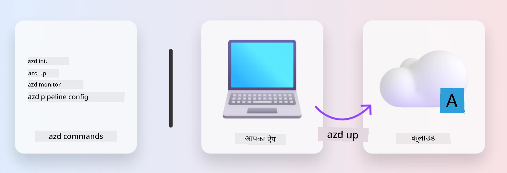
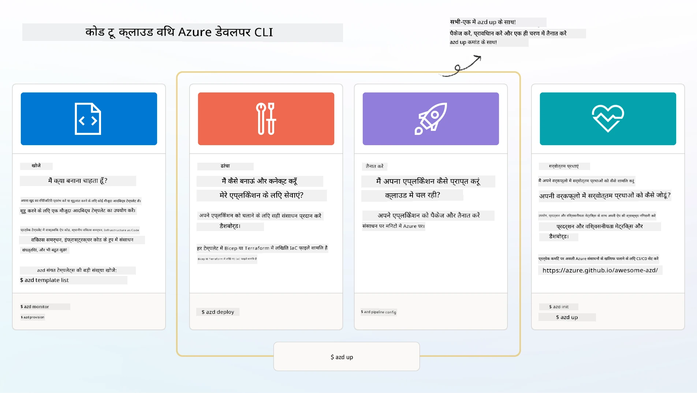

# 1. एक टेम्प्लेट चुनें

!!! tip "इस मॉड्यूल के अंत तक आप सक्षम होंगे"

    - [ ] AZD टेम्प्लेट क्या हैं यह वर्णन करें
    - [ ] AI के लिए AZD टेम्प्लेट खोजें और उपयोग करें
    - [ ] AI एजेंट्स टेम्प्लेट के साथ शुरुआत करें
    - [ ] **प्रयोगशाला 1:** Codespaces या एक dev container में AZD क्विकस्टार्ट

---

## 1. एक बिल्डर की तुलना

एक आधुनिक एंटरप्राइज़-तैयार AI एप्लिकेशन _scratch से_ बनाना चुनौतीपूर्ण हो सकता है। यह कुछ हद तक ऐसा ही है जैसे आप अपने नए घर को खुद एक-एक ईंट लगाकर बनाएं। हाँ, यह किया जा सकता है! लेकिन यह वांछित अंतिम परिणाम पाने का सबसे प्रभावी तरीका नहीं है!

इसके बजाय, हम अक्सर एक मौजूदा _डिजाइन ब्लूप्रिंट_ से शुरू करते हैं, और एक आर्किटेक्ट के साथ काम करते हैं ताकि इसे हमारे व्यक्तिगत आवश्यकताओं के अनुसार अनुकूलित किया जा सके। और यही तरीका है जिसे बुद्धिमान एप्लिकेशन बनाने में अपनाना चाहिए। सबसे पहले, एक अच्छा डिज़ाइन आर्किटेक्चर खोजें जो आपकी समस्या क्षेत्र के लिए उपयुक्त हो। फिर एक समाधान आर्किटेक्ट के साथ मिलकर आपके विशिष्ट परिदृश्य के लिए समाधान को अनुकूलित और विकसित करें।

लेकिन ये डिजाइन ब्लूप्रिंट हमें कहाँ मिलेंगे? और हम ऐसा आर्किटेक्ट कहाँ पाएंगे जो हमें ये ब्लूप्रिंट कैसे अनुकूलित और तैनात करें, यह सिखाने को तैयार हो? इस कार्यशाला में, हम इन प्रश्नों का उत्तर देने के लिए तीन तकनीकों से परिचय कराते हैं:

1. [Azure Developer CLI](https://aka.ms/azd) - एक ओपन-सोर्स टूल जो लोकल डेवलपमेंट (build) से लेकर क्लाउड डिप्लॉयमेंट (ship) तक डेवलपर की यात्रा को तेज करता है।
1. [Microsoft Foundry Templates](https://ai.azure.com/templates) - मानकीकृत ओपन-सोर्स रिपॉजिटरी जिसमें AI समाधान वास्तुकला को डिप्लॉय करने के लिए नमूना कोड, इंफ्रास्ट्रक्चर और कॉन्फ़िगरेशन फाइलें होती हैं।
1. [GitHub Copilot Agent Mode](https://code.visualstudio.com/docs/copilot/chat/chat-agent-mode) - Azure ज्ञान पर आधारित एक कोडिंग एजेंट, जो हमें कोडबेस में नेविगेट करने और प्राकृतिक भाषा का उपयोग करके परिवर्तन करने में मार्गदर्शन करता है।

इन उपकरणों के साथ, अब हम सही टेम्प्लेट _खोज_ सकते हैं, इसे डिप्लॉय कर सकते हैं यह जांचने के लिए कि यह काम करता है, और इसे हमारे विशिष्ट परिदृश्यों के अनुकूल _कस्टमाइज़_ कर सकते हैं। आइए जानें कि ये कैसे काम करते हैं।

---

## 2. Azure Developer CLI

[Azure Developer CLI](https://learn.microsoft.com/en-us/azure/developer/azure-developer-cli/) (या `azd`) एक ओपन-सोर्स कमांडलाइन टूल है जो आपके कोड से क्लाउड तक की यात्रा को तेज करने के लिए डेवलपर-मित्र सेट कमांड्स प्रदान करता है, जो आपके IDE (डेवलपमेंट) और CI/CD (डेवऑप्स) पर्यावरणों में लगातार काम करते हैं।

`azd` के साथ, आपका डिप्लॉयमेंट सफर इतना सरल हो सकता है:

- `azd init` - मौजूदा AZD टेम्प्लेट से नया AI प्रोजेक्ट आरंभ करता है।
- `azd up` - एक ही चरण में इंफ्रास्ट्रक्चर प्रदान करता है और आपका एप्लिकेशन डिप्लॉय करता है।
- `azd monitor` - आपके तैनात एप्लिकेशन के लिए रियल-टाइम मॉनिटरिंग और डायग्नोस्टिक्स प्राप्त करें।
- `azd pipeline config` - Azure के लिए डिप्लॉयमेंट को स्वचालित करने हेतु CI/CD पाइपलाइन सेट अप करें।

**🎯 | अभ्यास**: <br/> अपने वर्तमान कार्यशाला पर्यावरण में `azd` कमांडलाइन टूल का अन्वेषण करें। यह GitHub Codespaces, एक dev container, या आवश्यकताओं के साथ लोकल क्लोन हो सकता है। टाइप करके शुरू करें यह कमांड यह देखने के लिए कि टूल क्या कर सकता है:

```bash title="" linenums="0"
azd help
```



---

## 3. AZD टेम्प्लेट

`azd` यह सब करने के लिए जानना जरूरी है कि कौन-कौन सा इंफ्रास्ट्रक्चर प्रदान करना है, कौन-कौन सी कॉन्फ़िगरेशन सेटिंग्स लागू करनी हैं, और कौन-सा एप्लिकेशन तैनात करना है। यहां [AZD टेम्प्लेट](https://learn.microsoft.com/en-us/azure/developer/azure-developer-cli/azd-templates?tabs=csharp) काम करते हैं।

AZD टेम्प्लेट ओपन-सोर्स रिपॉजिटरी हैं जो नमूना कोड को इंफ्रास्ट्रक्चर और कॉन्फ़िगरेशन फाइलों के साथ संयोजित करते हैं, जो समाधान वास्तुकला को तैनात करने के लिए आवश्यक हैं। _Infrastructure-as-Code_ (IaC) दृष्टिकोण का उपयोग करके, ये टेम्प्लेट संसाधन परिभाषाओं और कॉन्फ़िगरेशन सेटिंग्स को संस्करण नियंत्रक (जैसे ऐप स्रोत कोड) की तरह रखने देते हैं, और इस प्रकार उपयोगकर्ताओं के बीच पुन: उपयोग योग्य और सुसंगत वर्कफ़्लो बनाते हैं।

जब आप अपने परिदृश्य के लिए AZD टेम्प्लेट बना रहे हों या पुन: उपयोग कर रहे हों, तो इन प्रश्नों पर विचार करें:

1. आप क्या बना रहे हैं? → क्या ऐसे टेम्प्लेट मौजूद हैं जिनमें उस परिदृश्य के लिए स्टार्टर कोड हो?
1. आपका समाधान कैसे आर्किटेक्ट किया गया है? → क्या ऐसे टेम्प्लेट हैं जिनमें आवश्यक संसाधन हों?
1. आपका समाधान कैसे तैनात किया जाता है? → सोचिए `azd deploy` को प्री/पोस्ट-प्रोसेसिंग हुक के साथ!
1. आप इसे और कैसे अनुकूलित कर सकते हैं? → सोचिए बिल्ट-इन मॉनिटरिंग और ऑटोमेशन पाइपलाइन पर!

**🎯 | अभ्यास**: <br/> 
[Awesome AZD](https://azure.github.io/awesome-azd/) गैलरी पर जाएं और फिल्टर का उपयोग करते हुए अभी उपलब्ध 250+ टेम्प्लेट्स एक्सप्लोर करें। देखें कि क्या आप अपने परिदृश्य आवश्यकताओं के अनुसार कोई टेम्प्लेट पा सकते हैं।



---

## 4. AI ऐप टेम्प्लेट

AI-संचालित एप्लिकेशन के लिए, Microsoft विशेष टेम्प्लेट प्रदान करता है जिनमें **Microsoft Foundry** और **Foundry Agents** शामिल हैं। ये टेम्प्लेट उच्च गुणवत्ता और उत्पादन-तैयार बुद्धिमान एप्लिकेशन बनाने के मार्ग को तेज करते हैं।

### Microsoft Foundry & Foundry Agents टेम्प्लेट

नीचे एक टेम्प्लेट चुनें और तैनात करें। प्रत्येक टेम्प्लेट [Awesome AZD](https://azure.github.io/awesome-azd/) पर उपलब्ध है और एक कमांड के साथ आरंभ किया जा सकता है।

| टेम्प्लेट | विवरण | तैनाती कमांड |
|----------|-------------|----------------|
| **[AI Chat with RAG](https://azure.github.io/awesome-azd/?tags=ai&tags=rag)** | Microsoft Foundry उपयोग करते हुए Retrieval Augmented Generation के साथ चैट एप्लिकेशन | `azd init -t azure-samples/azure-search-openai-demo` |
| **[Foundry Agent Service Starter](https://azure.github.io/awesome-azd/?tags=ai&tags=agents)** | Foundry Agents के साथ स्वायत्त कार्य निष्पादन के लिए AI एजेंट बनाएं | `azd init -t azure-samples/foundry-agent-service-starter` |
| **[Multi-Agent Orchestration](https://azure.github.io/awesome-azd/?tags=ai&tags=agents)** | जटिल वर्कफ़्लोज़ के लिए कई Foundry एजेंट्स का समन्वय करें | `azd init -t azure-samples/multi-agent-orchestration` |
| **[AI Document Intelligence](https://azure.github.io/awesome-azd/?tags=ai&tags=document)** | Microsoft Foundry मॉडल्स के साथ दस्तावेज़ निकालें और विश्लेषण करें | `azd init -t azure-samples/ai-document-processing` |
| **[Conversational AI Bot](https://azure.github.io/awesome-azd/?tags=ai&tags=bot)** | Microsoft Foundry इंटीग्रेशन के साथ बुद्धिमान चैटबोट बनाएं | `azd init -t azure-samples/ai-chat-protocol` |
| **[AI Image Generation](https://azure.github.io/awesome-azd/?tags=ai&tags=dalle)** | Microsoft Foundry के माध्यम से DALL-E का उपयोग करके छवियां उत्पन्न करें | `azd init -t azure-samples/ai-image-generation` |
| **[Semantic Kernel Agent](https://azure.github.io/awesome-azd/?tags=ai&tags=semantic-kernel)** | Foundry एजेंट्स के साथ Semantic Kernel का उपयोग करते हुए AI एजेंट | `azd init -t azure-samples/semantic-kernel-agent` |
| **[AutoGen Multi-Agent](https://azure.github.io/awesome-azd/?tags=ai&tags=autogen)** | AutoGen फ्रेमवर्क का उपयोग करते हुए मल्टी-एजेंट सिस्टम | `azd init -t azure-samples/autogen-multi-agent` |

### त्वरित प्रारंभ

1. **टेम्प्लेट ब्राउज़ करें**: [https://azure.github.io/awesome-azd/](https://azure.github.io/awesome-azd/) पर जाएं और `AI`, `Agents`, या `Microsoft Foundry` के द्वारा फ़िल्टर करें
2. **अपना टेम्प्लेट चुनें**: अपने उपयोग केस के अनुरूप एक चुनें
3. **आरंभ करें**: अपने चुने हुए टेम्प्लेट के लिए `azd init` कमांड चलाएं
4. **तैनात करें**: इंफ्रास्ट्रक्चर देने और तैनात करने के लिए `azd up` चलाएं

**🎯 | अभ्यास**: <br/> 
अपने परिदृश्य के आधार पर ऊपर दिए गए टेम्प्लेट में से एक चुनें:

- **चैटबोट बना रहे हैं?** → **AI Chat with RAG** या **Conversational AI Bot** से शुरू करें
- **स्वायत्त एजेंट चाहिए?** → **Foundry Agent Service Starter** या **Multi-Agent Orchestration** आज़माएं
- **दस्तावेज़ प्रक्रिया कर रहे हैं?** → **AI Document Intelligence** का उपयोग करें
- **AI कोडिंग सहायता चाहिए?** → **Semantic Kernel Agent** या **AutoGen Multi-Agent** एक्सप्लोर करें

```bash title="Example: Deploy the AI Chat with RAG template" linenums="0"
azd init -t azure-samples/azure-search-openai-demo
azd up
```

!!! info "अधिक टेम्प्लेट एक्सप्लोर करें"
    [Awesome AZD Gallery](https://azure.github.io/awesome-azd/) में 250+ टेम्प्लेट उपलब्ध हैं। अपनी विशिष्ट भाषा, फ्रेमवर्क, और Azure सेवाओं की आवश्यकताओं के अनुसार टेम्प्लेट खोजने के लिए फिल्टर का उपयोग करें।

---

<!-- CO-OP TRANSLATOR DISCLAIMER START -->
**अस्वीकरण**:  
इस दस्तावेज़ का अनुवाद AI अनुवाद सेवा [Co-op Translator](https://github.com/Azure/co-op-translator) का उपयोग करके किया गया है। जबकि हम सटीकता के लिए प्रयासरत हैं, कृपया ध्यान दें कि स्वचालित अनुवादों में त्रुटियाँ या अशुद्धियाँ हो सकती हैं। मूल दस्तावेज़, अपनी मूल भाषा में, आधिकारिक स्रोत माना जाना चाहिए। महत्वपूर्ण जानकारी के लिए, पेशेवर मानवीय अनुवाद की सिफारिश की जाती है। इस अनुवाद के उपयोग से उत्पन्न किसी भी गलतफहमी या व्याख्या के लिए हम ज़िम्मेदार नहीं हैं।
<!-- CO-OP TRANSLATOR DISCLAIMER END -->