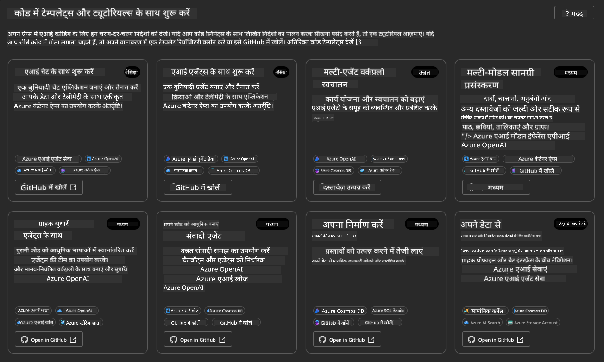
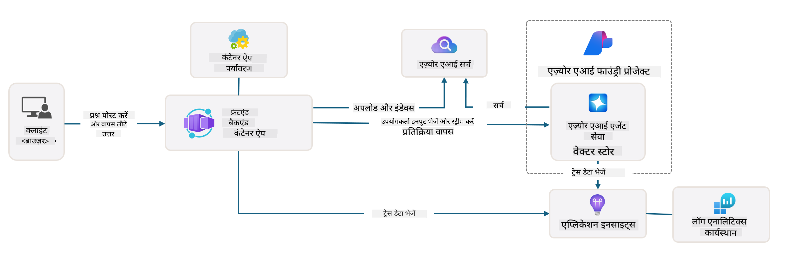
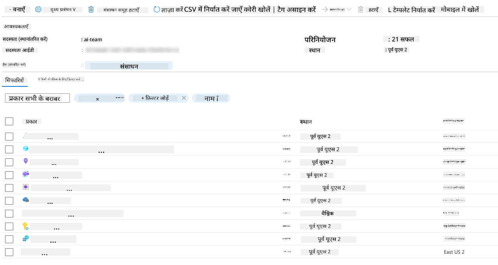
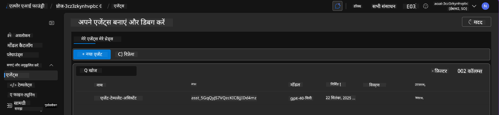
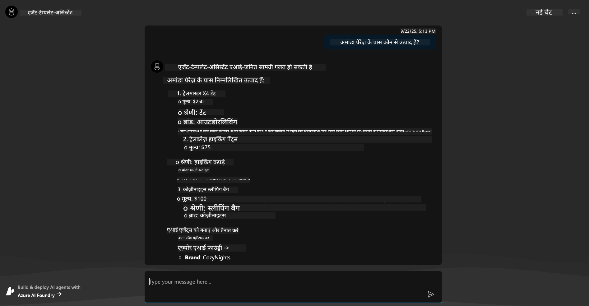
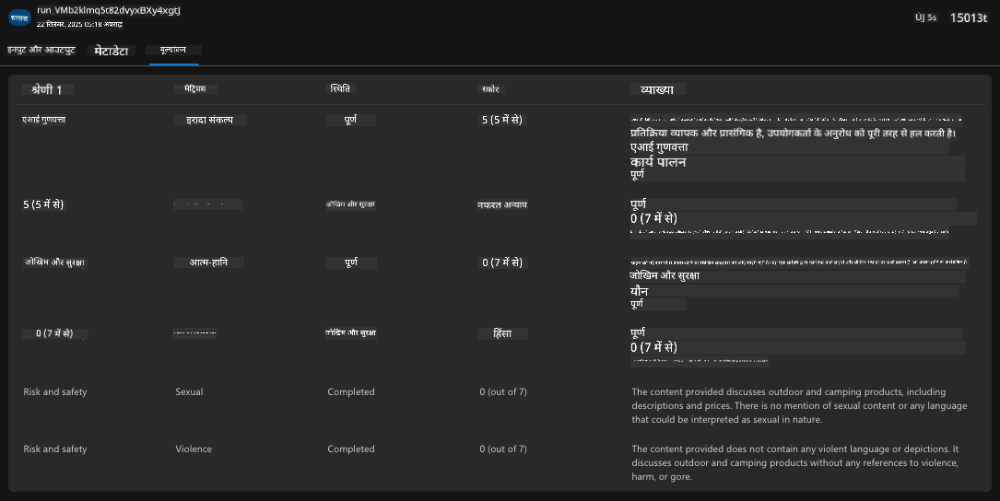

<!--
CO_OP_TRANSLATOR_METADATA:
{
  "original_hash": "7816c6ec50c694c331e7c6092371be4d",
  "translation_date": "2025-09-24T11:01:16+00:00",
  "source_file": "workshop/docs/instructions/2-Validate-AI-Template.md",
  "language_code": "hi"
}
-->
# 2. टेम्पलेट को मान्य करें

!!! tip "इस मॉड्यूल के अंत तक आप सक्षम होंगे"

    - [ ] एआई समाधान आर्किटेक्चर का विश्लेषण करें
    - [ ] AZD डिप्लॉयमेंट वर्कफ़्लो को समझें
    - [ ] GitHub Copilot का उपयोग करके AZD के उपयोग पर सहायता प्राप्त करें
    - [ ] **लैब 2:** एआई एजेंट्स टेम्पलेट को डिप्लॉय और मान्य करें

---

## 1. परिचय

[Azure Developer CLI](https://learn.microsoft.com/en-us/azure/developer/azure-developer-cli/) या `azd` एक ओपन-सोर्स कमांडलाइन टूल है जो Azure पर एप्लिकेशन बनाने और डिप्लॉय करने के दौरान डेवलपर वर्कफ़्लो को सरल बनाता है।

[AZD टेम्पलेट्स](https://learn.microsoft.com/azure/developer/azure-developer-cli/azd-templates) मानकीकृत रिपॉजिटरी हैं जो नमूना एप्लिकेशन कोड, _इन्फ्रास्ट्रक्चर ऐज़ कोड_ एसेट्स, और `azd` कॉन्फ़िगरेशन फ़ाइलें शामिल करती हैं ताकि एक समग्र समाधान आर्किटेक्चर प्रदान किया जा सके। इन्फ्रास्ट्रक्चर को प्रोविजन करना `azd provision` कमांड जितना आसान हो जाता है - जबकि `azd up` का उपयोग करने से आप इन्फ्रास्ट्रक्चर **और** अपने एप्लिकेशन को एक ही बार में डिप्लॉय कर सकते हैं!

इसका परिणाम यह है कि आपके एप्लिकेशन विकास प्रक्रिया को शुरू करना उतना ही आसान हो सकता है जितना कि सही _AZD स्टार्टर टेम्पलेट_ ढूंढना जो आपके एप्लिकेशन और इन्फ्रास्ट्रक्चर आवश्यकताओं के सबसे करीब हो - फिर रिपॉजिटरी को अपने परिदृश्य आवश्यकताओं के अनुसार अनुकूलित करना।

शुरू करने से पहले, सुनिश्चित करें कि आपके पास Azure Developer CLI इंस्टॉल है।

1. VS Code टर्मिनल खोलें और यह कमांड टाइप करें:

      ```bash title="" linenums="0"
      azd version
      ```

1. आपको कुछ ऐसा दिखाई देना चाहिए!

      ```bash title="" linenums="0"
      azd version 1.19.0 (commit b3d68cea969b2bfbaa7b7fa289424428edb93e97)
      ```

**अब आप azd के साथ टेम्पलेट चुनने और डिप्लॉय करने के लिए तैयार हैं**

---

## 2. टेम्पलेट चयन

Azure AI Foundry प्लेटफ़ॉर्म [अनुशंसित AZD टेम्पलेट्स](https://learn.microsoft.com/en-us/azure/ai-foundry/how-to/develop/ai-template-get-started) का एक सेट प्रदान करता है जो लोकप्रिय समाधान परिदृश्यों जैसे _मल्टी-एजेंट वर्कफ़्लो ऑटोमेशन_ और _मल्टी-मोडल कंटेंट प्रोसेसिंग_ को कवर करता है। आप इन टेम्पलेट्स को Azure AI Foundry पोर्टल पर जाकर भी खोज सकते हैं।

1. [https://ai.azure.com/templates](https://ai.azure.com/templates) पर जाएं
1. जब संकेत दिया जाए तो Azure AI Foundry पोर्टल में लॉग इन करें - आपको कुछ ऐसा दिखाई देगा।



**बेसिक** विकल्प आपके स्टार्टर टेम्पलेट्स हैं:

1. [ ] [Get Started with AI Chat](https://github.com/Azure-Samples/get-started-with-ai-chat) जो Azure Container Apps पर _आपके डेटा के साथ_ एक बेसिक चैट एप्लिकेशन डिप्लॉय करता है। इसका उपयोग एक बेसिक एआई चैटबॉट परिदृश्य का पता लगाने के लिए करें।
1. [X] [Get Started with AI Agents](https://github.com/Azure-Samples/get-started-with-ai-agents) जो Azure AI Agent Service के साथ एक मानक एआई एजेंट भी डिप्लॉय करता है। इसका उपयोग टूल्स और मॉडल्स को शामिल करने वाले एजेंटिक एआई समाधानों से परिचित होने के लिए करें।

दूसरे लिंक को एक नए ब्राउज़र टैब में खोलें (या संबंधित कार्ड के लिए `Open in GitHub` पर क्लिक करें)। आपको इस AZD टेम्पलेट के लिए रिपॉजिटरी दिखाई देगी। README को एक्सप्लोर करने के लिए एक मिनट लें। एप्लिकेशन आर्किटेक्चर कुछ ऐसा दिखता है:



---

## 3. टेम्पलेट सक्रियण

आइए इस टेम्पलेट को डिप्लॉय करने की कोशिश करें और सुनिश्चित करें कि यह मान्य है। हम [Getting Started](https://github.com/Azure-Samples/get-started-with-ai-agents?tab=readme-ov-file#getting-started) सेक्शन में दिए गए दिशानिर्देशों का पालन करेंगे।

1. [इस लिंक](https://github.com/codespaces/new/Azure-Samples/get-started-with-ai-agents) पर क्लिक करें - `Create codespace` के लिए डिफ़ॉल्ट कार्रवाई की पुष्टि करें
1. यह एक नया ब्राउज़र टैब खोलता है - GitHub Codespaces सत्र के लोडिंग को पूरा करने की प्रतीक्षा करें
1. Codespaces में VS Code टर्मिनल खोलें - निम्नलिखित कमांड टाइप करें:

   ```bash title="" linenums="0"
   azd up
   ```

इससे ट्रिगर होने वाले वर्कफ़्लो चरणों को पूरा करें:

1. आपको Azure में लॉग इन करने के लिए संकेत दिया जाएगा - प्रमाणित करने के लिए निर्देशों का पालन करें
1. अपने लिए एक अद्वितीय वातावरण नाम दर्ज करें - उदाहरण के लिए, मैंने `nitya-mshack-azd` का उपयोग किया
1. यह एक `.azure/` फ़ोल्डर बनाएगा - आप एक उपफ़ोल्डर देखेंगे जिसमें env नाम होगा
1. आपको एक सब्सक्रिप्शन नाम चुनने के लिए संकेत दिया जाएगा - डिफ़ॉल्ट चुनें
1. आपको एक स्थान के लिए संकेत दिया जाएगा - `East US 2` का उपयोग करें

अब, आप प्रोविजनिंग के पूरा होने की प्रतीक्षा करें। **इसमें 10-15 मिनट लगते हैं**

1. जब हो जाए, आपका कंसोल ऐसा SUCCESS संदेश दिखाएगा:
      ```bash title="" linenums="0"
      SUCCESS: Your up workflow to provision and deploy to Azure completed in 10 minutes 17 seconds.
      ```
1. आपका Azure पोर्टल अब उस env नाम के साथ एक प्रोविजन किया गया रिसोर्स ग्रुप दिखाएगा:

      

1. **अब आप डिप्लॉय किए गए इन्फ्रास्ट्रक्चर और एप्लिकेशन को मान्य करने के लिए तैयार हैं।**

---

## 4. टेम्पलेट मान्यता

1. Azure पोर्टल [Resource Groups](https://portal.azure.com/#browse/resourcegroups) पेज पर जाएं - संकेत मिलने पर लॉग इन करें
1. अपने वातावरण नाम के लिए RG पर क्लिक करें - आप ऊपर वाला पेज देखेंगे

      - Azure Container Apps रिसोर्स पर क्लिक करें
      - _Essentials_ सेक्शन (ऊपरी दाएं) में एप्लिकेशन URL पर क्लिक करें

1. आपको एक होस्टेड एप्लिकेशन फ्रंट-एंड UI कुछ ऐसा दिखाई देगा:

   

1. कुछ [नमूना प्रश्न](https://github.com/Azure-Samples/get-started-with-ai-agents/blob/main/docs/sample_questions.md) पूछने की कोशिश करें

      1. पूछें: ```What is the capital of France?``` 
      1. पूछें: ```What's the best tent under $200 for two people, and what features does it include?```

1. आपको नीचे दिखाए गए जैसा उत्तर मिलना चाहिए। _लेकिन यह कैसे काम करता है?_ 

      

---

## 5. एजेंट मान्यता

Azure Container App एक एंडपॉइंट को डिप्लॉय करता है जो इस टेम्पलेट के लिए Azure AI Foundry प्रोजेक्ट में प्रोविजन किए गए एआई एजेंट से जुड़ता है। आइए देखें कि इसका क्या मतलब है।

1. अपने रिसोर्स ग्रुप के लिए Azure पोर्टल _Overview_ पेज पर वापस जाएं

1. उस सूची में `Azure AI Foundry` रिसोर्स पर क्लिक करें

1. आपको यह दिखाई देगा। `Go to Azure AI Foundry Portal` बटन पर क्लिक करें। 
   

1. आपको अपने एआई एप्लिकेशन के लिए Foundry प्रोजेक्ट पेज दिखाई देगा
   

1. `Agents` पर क्लिक करें - आपको अपने प्रोजेक्ट में प्रोविजन किया गया डिफ़ॉल्ट एजेंट दिखाई देगा
   

1. इसे चुनें - और आपको एजेंट विवरण दिखाई देगा। निम्नलिखित पर ध्यान दें:

      - एजेंट डिफ़ॉल्ट रूप से फ़ाइल खोज का उपयोग करता है (हमेशा)
      - एजेंट `Knowledge` इंगित करता है कि इसमें 32 फ़ाइलें अपलोड की गई हैं (फ़ाइल खोज के लिए)
      

1. बाईं ओर मेनू में `Data+indexes` विकल्प देखें और विवरण के लिए क्लिक करें। 

      - आपको ज्ञान के लिए अपलोड की गई 32 डेटा फ़ाइलें दिखाई देंगी।
      - ये `src/files` के तहत 12 ग्राहक फ़ाइलों और 20 उत्पाद फ़ाइलों से मेल खाएंगी 
      

**आपने एजेंट संचालन को मान्य किया!** 

1. एजेंट प्रतिक्रियाएं उन फ़ाइलों में मौजूद ज्ञान पर आधारित होती हैं। 
1. अब आप उस डेटा से संबंधित प्रश्न पूछ सकते हैं और आधारित प्रतिक्रियाएं प्राप्त कर सकते हैं।
1. उदाहरण: `customer_info_10.json` "Amanda Perez" द्वारा किए गए 3 खरीदारी का वर्णन करता है

ब्राउज़र टैब पर वापस जाएं जिसमें Container App एंडपॉइंट है और पूछें: `What products does Amanda Perez own?`। आपको कुछ ऐसा दिखाई देगा:



---

## 6. एजेंट प्लेग्राउंड

Azure AI Foundry की क्षमताओं के लिए थोड़ा और अंतर्ज्ञान बनाने के लिए, एजेंट को एजेंट्स प्लेग्राउंड में आज़माएं। 

1. Azure AI Foundry में `Agents` पेज पर वापस जाएं - डिफ़ॉल्ट एजेंट चुनें
1. `Try in Playground` विकल्प पर क्लिक करें - आपको ऐसा प्लेग्राउंड UI मिलेगा
1. वही प्रश्न पूछें: `What products does Amanda Perez own?`

    

आपको वही (या समान) प्रतिक्रिया मिलेगी - लेकिन आपको अतिरिक्त जानकारी भी मिलेगी जिसका उपयोग आप अपने एजेंटिक ऐप की गुणवत्ता, लागत, और प्रदर्शन को समझने के लिए कर सकते हैं। उदाहरण के लिए:

1. ध्यान दें कि प्रतिक्रिया में "ग्राउंड" प्रतिक्रिया के लिए उपयोग की गई डेटा फ़ाइलों का उल्लेख है
1. किसी भी फ़ाइल लेबल पर होवर करें - क्या डेटा आपके क्वेरी और प्रदर्शित प्रतिक्रिया से मेल खाता है?

आप प्रतिक्रिया के नीचे एक _स्टैट्स_ पंक्ति भी देखेंगे। 

1. किसी भी मीट्रिक पर होवर करें - जैसे, Safety। आपको कुछ ऐसा दिखाई देगा
1. क्या मूल्यांकन की गई रेटिंग आपकी प्रतिक्रिया सुरक्षा स्तर के लिए अंतर्ज्ञान से मेल खाती है?

      

---x

## 7. अंतर्निहित अवलोकनीयता

अवलोकनीयता आपके एप्लिकेशन को इंस्ट्रूमेंट करने के बारे में है ताकि डेटा उत्पन्न किया जा सके जिसका उपयोग इसके संचालन को समझने, डिबग करने, और अनुकूलित करने के लिए किया जा सके। इसका अनुभव प्राप्त करने के लिए:

1. `View Run Info` बटन पर क्लिक करें - आपको यह दृश्य दिखाई देगा। यह [एजेंट ट्रेसिंग](https://learn.microsoft.com/en-us/azure/ai-foundry/how-to/develop/trace-agents-sdk#view-trace-results-in-the-azure-ai-foundry-agents-playground) का एक उदाहरण है। _आप इस दृश्य को टॉप-लेवल मेनू में Thread Logs पर क्लिक करके भी प्राप्त कर सकते हैं।_

   - रन चरणों और एजेंट द्वारा उपयोग किए गए टूल्स का अनुभव प्राप्त करें
   - प्रतिक्रिया के लिए कुल टोकन गणना (बनाम आउटपुट टोकन उपयोग) को समझें
   - विलंबता को समझें और निष्पादन में समय कहाँ खर्च हो रहा है

      

1. `Metadata` टैब पर क्लिक करें ताकि रन के लिए अतिरिक्त विशेषताओं को देखा जा सके, जो बाद में समस्याओं को डिबग करने के लिए उपयोगी संदर्भ प्रदान कर सकती हैं।   

      

1. `Evaluations` टैब पर क्लिक करें ताकि एजेंट प्रतिक्रिया पर किए गए स्वचालित मूल्यांकन को देखा जा सके। इनमें सुरक्षा मूल्यांकन (जैसे, Self-harm) और एजेंट-विशिष्ट मूल्यांकन (जैसे, Intent resolution, Task adherence) शामिल हैं।

      

1. अंत में, साइडबार मेनू में `Monitoring` टैब पर क्लिक करें।

      - प्रदर्शित पेज में `Resource usage` टैब चुनें - और मीट्रिक्स देखें।
      - लागत (टोकन) और लोड (रिक्वेस्ट्स) के संदर्भ में एप्लिकेशन उपयोग को ट्रैक करें।
      - एप्लिकेशन विलंबता को पहले बाइट (इनपुट प्रोसेसिंग) और अंतिम बाइट (आउटपुट) तक ट्रैक करें।

      

---

## 8. पर्यावरण चर

अब तक, हमने ब्राउज़र में डिप्लॉयमेंट के माध्यम से चलाया है - और मान्य किया है कि हमारा इन्फ्रास्ट्रक्चर प्रोविजन किया गया है और एप्लिकेशन चालू है। लेकिन एप्लिकेशन के साथ _कोड-फर्स्ट_ काम करने के लिए, हमें अपने स्थानीय विकास वातावरण को उन प्रासंगिक चर के साथ कॉन्फ़िगर करना होगा जो इन संसाधनों के साथ काम करने के लिए आवश्यक हैं। `azd` का उपयोग इसे आसान बनाता है।

1. Azure Developer CLI [पर्यावरण चर का उपयोग करता है](https://learn.microsoft.com/en-us/azure/developer/azure-developer-cli/manage-environment-variables?tabs=bash) एप्लिकेशन डिप्लॉयमेंट्स के लिए कॉन्फ़िगरेशन सेटिंग्स को स्टोर और प्रबंधित करने के लिए।

1. पर्यावरण चर `.azure/<env-name>/.env` में संग्रहीत होते हैं - यह उन्हें डिप्लॉयमेंट के दौरान उपयोग किए गए `env-name` वातावरण तक सीमित करता है और एक ही रिपॉजिटरी में विभिन्न डिप्लॉयमेंट लक्ष्यों के बीच वातावरण को अलग करने में मदद करता है।

1. पर्यावरण चर स्वचालित रूप से `azd` कमांड द्वारा लोड किए जाते हैं जब भी यह एक विशिष्ट कमांड निष्पादित करता है (जैसे, `azd up`)। ध्यान दें कि `azd` स्वचालित रूप से _OS-स्तरीय_ पर्यावरण चर (जैसे, शेल में सेट) नहीं पढ़ता है - इसके बजाय स्क्रिप्ट्स के भीतर जानकारी स्थानांतरित करने के लिए `azd set env` और `azd get env` का उपयोग करें।

आइए कुछ कमांड आज़माएं:

1. इस वातावरण में `azd` के लिए सेट किए गए सभी पर्यावरण चर प्राप्त करें:

      ```bash title="" linenums="0"
      azd env get-values
      ```
      
      आपको कुछ ऐसा दिखाई देगा:

      ```bash title="" linenums="0"
      AZURE_AI_AGENT_DEPLOYMENT_NAME="gpt-4o-mini"
      AZURE_AI_AGENT_NAME="agent-template-assistant"
      AZURE_AI_EMBED_DEPLOYMENT_NAME="text-embedding-3-small"
      AZURE_AI_EMBED_DIMENSIONS=100
      ...
      ```

1. एक विशिष्ट मान प्राप्त करें - उदाहरण के लिए, मैं जानना चाहता हूं कि हमने `AZURE_AI_AGENT_MODEL_NAME` मान सेट किया है या नहीं

      ```bash title="" linenums="0"
      azd env get-value AZURE_AI_AGENT_MODEL_NAME 
      ```
      
      आपको कुछ ऐसा दिखाई देगा - यह डिफ़ॉल्ट रूप से सेट नहीं किया गया था!

      ```bash title="" linenums="0"
      ERROR: key 'AZURE_AI_AGENT_MODEL_NAME' not found in the environment values
      ```

1. `azd` के लिए एक नया पर्यावरण चर सेट करें। यहां, हम एजेंट मॉडल नाम को अपडेट करते हैं। _नोट: किए गए किसी भी परिवर्तन तुरंत `.azure/<env-name>/.env` फ़ाइल में प्रतिबिंबित होंगे।

      ```bash title="" linenums="0"
      azd env set AZURE_AI_AGENT_MODEL_NAME gpt-4.1
      azd env set AZURE_AI_AGENT_MODEL_VERSION 2025-04-14
      azd env set AZURE_AI_AGENT_DEPLOYMENT_CAPACITY 150
      ```

      अब, हमें पता चलना चाहिए कि मान सेट किया गया है:

      ```bash title="" linenums="0"
      azd env get-value AZURE_AI_AGENT_MODEL_NAME 
      ```

1. ध्यान दें कि कुछ संसाधन स्थायी होते हैं (जैसे, मॉडल डिप्लॉयमेंट्स) और उन्हें फिर से डिप्लॉय करने के लिए केवल `azd up` से अधिक की आवश्यकता होगी। आइए मूल डिप्लॉयमेंट को हटाने और बदले हुए env vars के साथ फिर से डिप्लॉय करने की कोशिश करें।

1. **Refresh** यदि आपने पहले किसी azd टेम्पलेट का उपयोग करके इन्फ्रास्ट्रक्चर डिप्लॉय किया था - आप इस कमांड का उपयोग करके अपने स्थानीय पर्यावरण चर की स्थिति को अपने Azure डिप्लॉयमेंट की वर्तमान स्थिति के आधार पर _refresh_ कर सकते हैं:
      ```bash title="" linenums="0"
      azd env refresh
      ```

      यह एक शक्तिशाली तरीका है जिससे आप दो या अधिक स्थानीय विकास परिवेशों (जैसे, कई डेवलपर्स वाली टीम) के बीच पर्यावरण चर को _सिंक_ कर सकते हैं - जिससे तैनात इंफ्रास्ट्रक्चर पर्यावरण चर की स्थिति के लिए आधार सत्य के रूप में काम करता है। टीम के सदस्य बस चर को _रिफ्रेश_ करके फिर से सिंक में आ सकते हैं।

---

## 9. बधाई हो 🏆

आपने अभी-अभी एक एंड-टू-एंड वर्कफ़्लो पूरा किया जिसमें आपने:

- [X] वह AZD टेम्पलेट चुना जिसे आप उपयोग करना चाहते थे
- [X] टेम्पलेट को GitHub Codespaces के साथ लॉन्च किया
- [X] टेम्पलेट को तैनात किया और सत्यापित किया कि यह काम करता है

---

