# 2. एक टेम्पलेट सत्यापित करें

!!! tip "इस मॉड्यूल के अंत तक आप सक्षम होंगे"

    - [ ] AI सॉल्यूशन आर्किटेक्चर का विश्लेषण करना
    - [ ] AZD डिप्लॉयमेंट वर्कफ़्लो को समझना
    - [ ] AZD उपयोग पर मदद के लिए GitHub Copilot का उपयोग करना
    - [ ] **Lab 2:** AI Agents टेम्पलेट तैनात और सत्यापित करें

---


## 1. परिचय

The [Azure Developer CLI](https://learn.microsoft.com/en-us/azure/developer/azure-developer-cli/) or `azd` एक ओपन-सोर्स कमांडलाइन टूल है जो Azure पर एप्लिकेशन बनाते और तैनात करते समय डेवलपर वर्कफ़्लो को सरल बनाता है। 

[AZD Templates](https://learn.microsoft.com/azure/developer/azure-developer-cli/azd-templates) मानकीकृत रिपॉज़िटरीज़ हैं जिनमें सैंपल एप्लिकेशन कोड, _infrastructure-as-code_ एसेट्स, और एक सुसंगत सॉल्यूशन आर्किटेक्चर के लिए `azd` कॉन्फ़िगरेशन फाइलें शामिल हैं। इन्फ्रास्ट्रक्चर प्रोविजन करना सिर्फ़ एक `azd provision` कमांड जितना सरल हो जाता है - जबकि `azd up` का उपयोग करने से आप एक ही बार में इन्फ्रास्ट्रक्चर प्रोविजन और अपना एप्लिकेशन डिप्लॉय कर सकते हैं!

इसके परिणामस्वरूप, अपने एप्लिकेशन डेवेलपमेंट प्रक्रिया को जल्दी शुरू करना उतना ही सरल हो सकता है जितना कि अपने एप्लिकेशन और इन्फ्रास्ट्रक्चर ज़रूरतों के करीब वाला सही _AZD Starter template_ ढूँढना - और फिर रिपॉज़िटरी को अपने परिदृश्य की आवश्यकताओं के अनुसार अनुकूलित करना।

शुरू करने से पहले, आइए सुनिश्चित करें कि आपके पास Azure Developer CLI इंस्टॉल है।

1. VS Code टर्मिनल खोलें और यह कमांड टाइप करें:

      ```bash title="" linenums="0"
      azd version
      ```

1. आपको कुछ इस तरह दिखाई देना चाहिए!

      ```bash title="" linenums="0"
      azd version 1.19.0 (commit b3d68cea969b2bfbaa7b7fa289424428edb93e97)
      ```

**अब आप azd के साथ एक टेम्पलेट चुनने और तैनात करने के लिए तैयार हैं**

---

## 2. टेम्पलेट चयन

Microsoft Foundry प्लेटफ़ॉर्म के साथ [एक सेट अनुशंसित AZD टेम्पलेट्स](https://learn.microsoft.com/en-us/azure/ai-foundry/how-to/develop/ai-template-get-started) आते हैं जो लोकप्रिय सॉल्यूशन परिदृश्यों को कवर करते हैं जैसे _multi-agent workflow automation_ और _multi-modal content processing_. आप Microsoft Foundry पोर्टल पर जाकर भी इन टेम्पलेट्स को खोज सकते हैं।

1. Visit [https://ai.azure.com/templates](https://ai.azure.com/templates)
1. संकेत मिलने पर Microsoft Foundry पोर्टल में लॉग इन करें - आपको कुछ ऐसा दिखाई देगा।

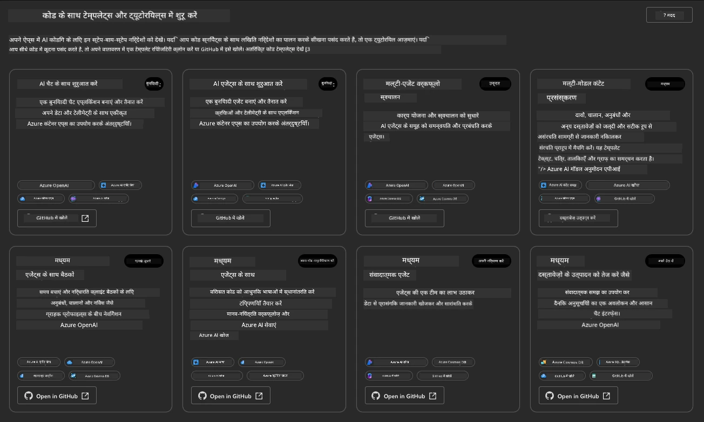


The **Basic** options are your starter templates:

1. [ ] [Get Started with AI Chat](https://github.com/Azure-Samples/get-started-with-ai-chat) जो एक बेसिक चैट एप्लिकेशन _आपके डेटा के साथ_ Azure Container Apps पर तैनात करता है। इसका उपयोग एक बुनियादी AI चैटबोट परिदृश्य का अन्वेषण करने के लिए करें।
1. [X] [Get Started with AI Agents](https://github.com/Azure-Samples/get-started-with-ai-agents) जो Foundry Agents के साथ एक मानक AI Agent भी तैनात करता है। टूल्स और मॉडल से जुड़ी agentic AI सॉल्यूशंस से परिचित होने के लिए इसका उपयोग करें।

दूसरे लिंक को एक नए ब्राउज़र टैब में खोलें (या संबंधित कार्ड के लिए `Open in GitHub` पर क्लिक करें)। आपको इस AZD टेम्पलेट के लिए रिपॉज़िटरी दिखाई देनी चाहिए। README का एक मिनट के लिए अन्वेषण करें। एप्लिकेशन आर्किटेक्चर इस प्रकार दिखती है:

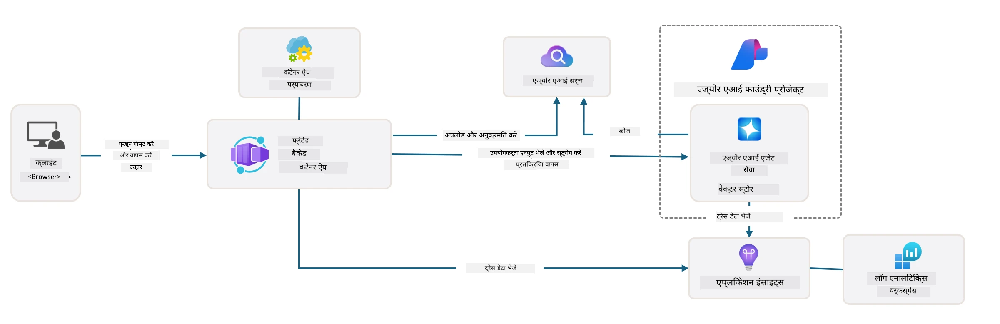

---

## 3. टेम्पलेट सक्रियकरण

आइए इस टेम्पलेट को तैनात करने की कोशिश करें और सुनिश्चित करें कि यह मान्य है। हम [Getting Started](https://github.com/Azure-Samples/get-started-with-ai-agents?tab=readme-ov-file#getting-started) सेक्शन में दिए निर्देशों का पालन करेंगे।

1. इस लिंक पर क्लिक करें: [this link](https://github.com/codespaces/new/Azure-Samples/get-started-with-ai-agents) - डिफ़ॉल्ट क्रिया `Create codespace` की पुष्टि करें
1. यह एक नया ब्राउज़र टैब खोलता है - GitHub Codespaces सेशन के पूरी तरह लोड होने तक प्रतीक्षा करें
1. Codespaces में VS Code टर्मिनल खोलें - निम्न कमांड टाइप करें:

   ```bash title="" linenums="0"
   azd up
   ```

Complete the workflow steps that this will trigger:

1. आपसे Azure में लॉग इन करने के लिए कहा जाएगा - प्रमाणीकृत करने के निर्देशों का पालन करें
1. अपने लिए एक अनूठा environment नाम दर्ज करें - उदाहरण: मैंने `nitya-mshack-azd` उपयोग किया
1. यह `.azure/` फ़ोल्डर बनाएगा - आप उस env नाम के साथ एक सबफ़ोल्डर देखेंगे
1. आपसे एक subscription नाम चुनने के लिए कहा जाएगा - डिफ़ॉल्ट चुनें
1. आपसे एक लोकेशन के लिए कहा जाएगा - `East US 2` उपयोग करें

अब, आप प्रोविजनिंग के पूरा होने का इंतज़ार करें। **यह 10-15 मिनट लेता है**

1. जब पूरा हो जाएगा, आपका कंसोल इस तरह का SUCCESS संदेश दिखाएगा:
      ```bash title="" linenums="0"
      SUCCESS: Your up workflow to provision and deploy to Azure completed in 10 minutes 17 seconds.
      ```
1. अब आपके Azure Portal में उस env नाम के साथ एक प्रोविजन किया गया resource group होगा:

      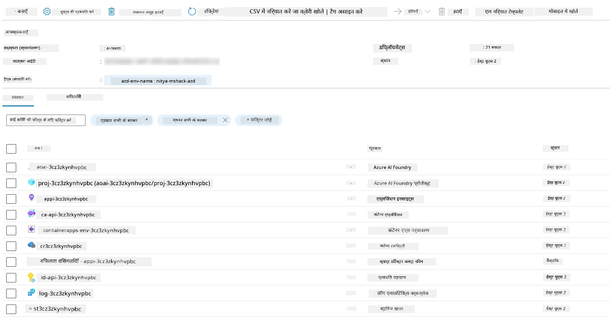

1. **अब आप तैनात इन्फ्रास्ट्रक्चर और एप्लिकेशन को सत्यापित करने के लिए तैयार हैं**।

---

## 4. टेम्पलेट सत्यापन

1. Azure Portal के [Resource Groups](https://portal.azure.com/#browse/resourcegroups) पृष्ठ पर जाएँ - संकेत मिलने पर लॉग इन करें
1. अपने environment नाम के RG पर क्लिक करें - आप ऊपर दिखी हुई पृष्ठ देखेंगे

      - Azure Container Apps resource पर क्लिक करें
      - _Essentials_ सेक्शन (ऊपर दाएँ) में Application Url पर क्लिक करें

1. आपको इस तरह का होस्टेड एप्लिकेशन फ्रंट-एंड UI दिखाई देना चाहिए:

   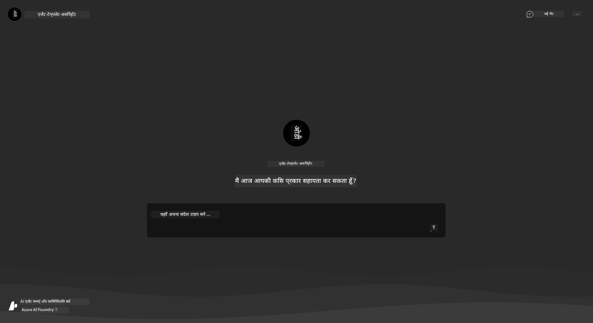

1. कुछ [sample questions](https://github.com/Azure-Samples/get-started-with-ai-agents/blob/main/docs/sample_questions.md) पूछकर देखें

      1. पूछें: ```फ़्रांस की राजधानी क्या है?``` 
      1. पूछें: ```दो लोगों के लिए $200 से कम में सबसे अच्छा टेंट कौन सा है, और इसमें कौन-कौन से फीचर शामिल हैं?```

1. आपको नीचे दिखाए गए समान उत्तर मिलने चाहिए। _लेकिन यह कैसे काम करता है?_ 

      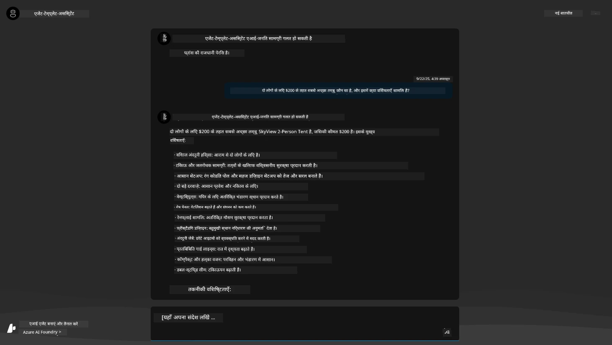

---

## 5.  एजेंट सत्यापन

Azure Container App एक एंडपॉइंट तैनात करता है जो इस टेम्पलेट के लिए Microsoft Foundry प्रोजेक्ट में प्रोविजन किए गए AI Agent से कनेक्ट होता है। आइए देखें इसका क्या अर्थ है।

1. अपने resource group के लिए Azure Portal _Overview_ पृष्ठ पर वापस जाएँ

1. उस सूची में `Microsoft Foundry` resource पर क्लिक करें

1. आपको यह दिखेगा। `Go to Microsoft Foundry Portal` बटन पर क्लिक करें। 
   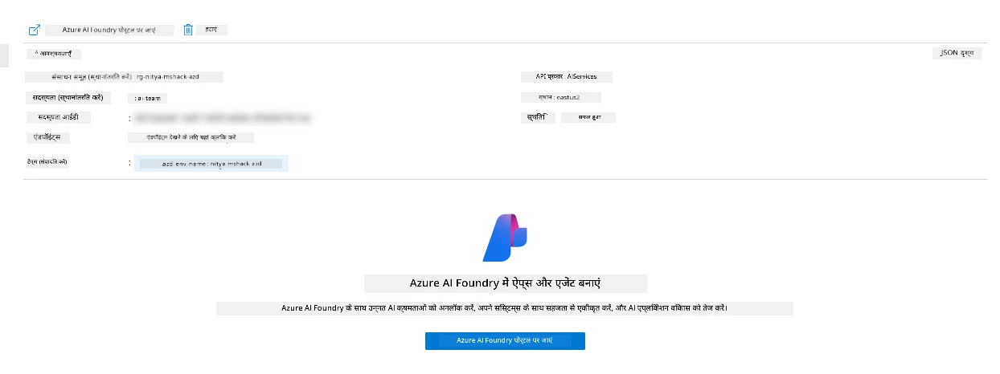

1. आपको अपने AI एप्लिकेशन के लिए Foundry Project पेज दिखाई देगा
   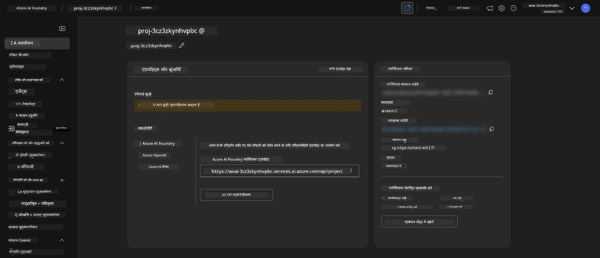

1. `Agents` पर क्लिक करें - आप अपने प्रोजेक्ट में प्रोविजन किया गया डिफ़ॉल्ट Agent देखेंगे
   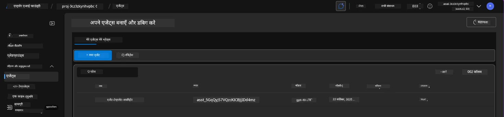

1. इसे चुनें - और आप Agent विवरण देखेंगे। निम्न बातों पर ध्यान दें:

      - एजेंट डिफ़ॉल्ट रूप से File Search का उपयोग करता है (हमेशा)
      - एजेंट का `Knowledge` दिखाता है कि इसके पास 32 फ़ाइलें अपलोड हैं (फाइल सर्च के लिए)
      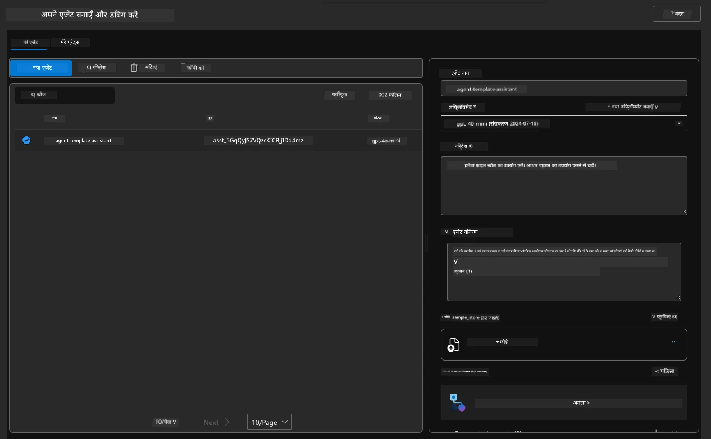

1. बाएँ मेनू में `Data+indexes` विकल्प खोजें और विवरण के लिए क्लिक करें। 

      - आप ज्ञान के लिए अपलोड की गई 32 डेटा फ़ाइलें देखेंगे।
      - ये `src/files` के अंतर्गत 12 ग्राहक फ़ाइलों और 20 उत्पाद फ़ाइलों से मेल खाएंगी
      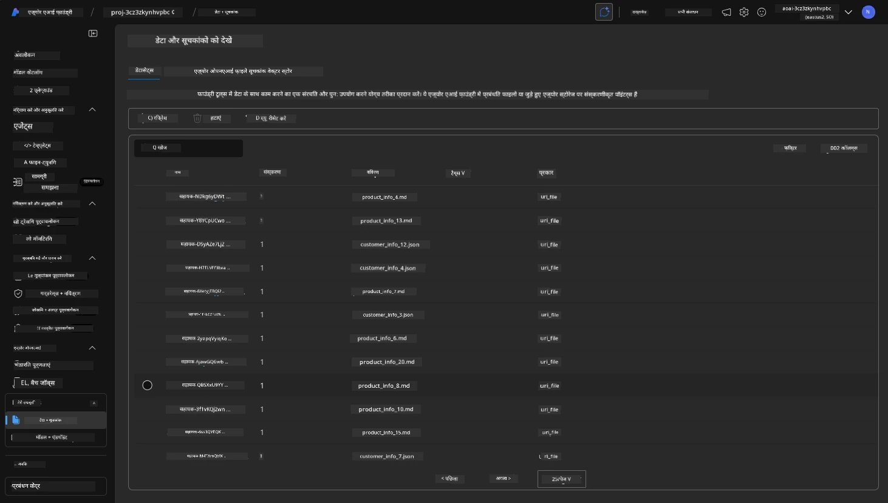

**आपने Agent ऑपरेशन को सत्यापित कर लिया है!** 

1. एजेंट प्रतिक्रियाएँ उन फ़ाइलों में मौजूद ज्ञान पर आधारित (grounded) होती हैं। 
1. आप अब उन डेटा से संबंधित प्रश्न पूछ सकते हैं, और grounded प्रतिक्रियाएँ प्राप्त कर सकते हैं।
1. उदाहरण: `customer_info_10.json` में "Amanda Perez" द्वारा की गई 3 खरीदों का विवरण है

Container App एंडपॉइंट वाले ब्राउज़र टैब पर वापस जाएँ और पूछें: `Amanda Perez के कौन से उत्पाद हैं?`। आपको कुछ ऐसा दिखाई देना चाहिए:

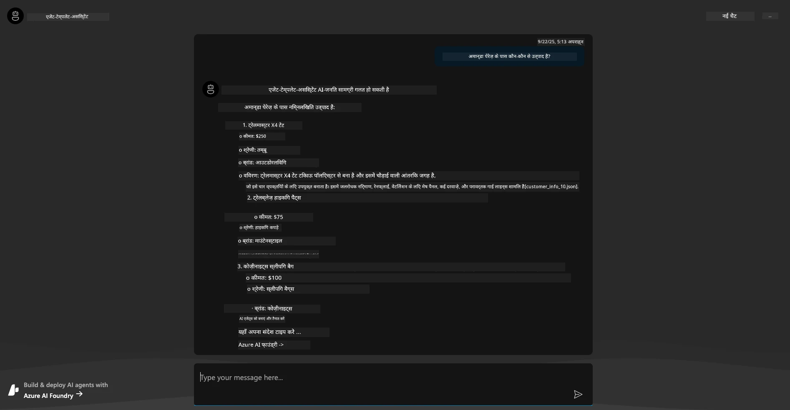

---

## 6. एजेंट प्लेग्राउंड

Microsoft Foundry की क्षमताओं के लिए थोड़ा और अंतर्ज्ञान विकसित करने के लिए, एजेंट को Agents Playground में आज़माएँ। 

1. Microsoft Foundry में `Agents` पेज पर वापस जाएँ - डिफ़ॉल्ट एजेंट चुनें
1. `Try in Playground` विकल्प पर क्लिक करें - आपको इस तरह का Playground UI मिलेगा
1. वही प्रश्न पूछें: `Amanda Perez के कौन से उत्पाद हैं?`

    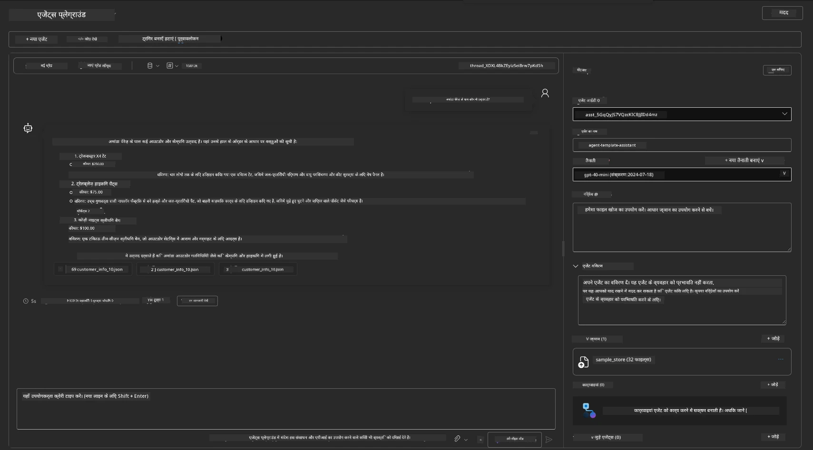

आपको वही (या समान) उत्तर मिलेगा - लेकिन आपको अतिरिक्त जानकारी भी मिलती है जिसका उपयोग आप अपने agentic ऐप की गुणवत्ता, लागत, और प्रदर्शन को समझने के लिए कर सकते हैं। उदाहरण के लिए:

1. ध्यान दें कि प्रतिक्रिया में उन डेटा फ़ाइलों का हवाला दिया गया है जिनसे प्रतिक्रिया grounded है
1. किसी भी फ़ाइल लेबल पर होवर करें - क्या डेटा आपके प्रश्न और प्रदर्शित प्रतिक्रिया से मेल खाता है?

आप प्रतिक्रिया के नीचे एक _stats_ पंक्ति भी देखते हैं। 

1. किसी भी मेट्रिक पर होवर करें - उदाहरण के लिए, Safety। आपको कुछ ऐसा दिखाई देगा
1. क्या आंका गया रेटिंग आपके अनुसार प्रतिक्रिया की सुरक्षा स्तर के साथ मेल खाता है?

      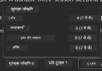

---

## 7. बिल्ट-इन ऑब्ज़र्वेबिलिटी

Observability का मतलब है अपने एप्लिकेशन में उस तरह से इंस्ट्रूमेंटेशन करना कि वह डाटा जेनरेट करे जिसे ऑपरेशन्स को समझने, डीबग करने और अनुकूलित करने के लिए उपयोग किया जा सके। इसे समझने के लिए:

1. `View Run Info` बटन पर क्लिक करें - आपको यह दृश्य दिखेगा। यह [Agent tracing](https://learn.microsoft.com/en-us/azure/ai-foundry/how-to/develop/trace-agents-sdk#view-trace-results-in-the-azure-ai-foundry-agents-playground) का एक उदाहरण है। _आप यह दृश्य टॉप-लेवल मेनू में Thread Logs पर क्लिक करके भी प्राप्त कर सकते हैं_।

   - रन चरणों और एजेंट द्वारा उपयोग किए गए टूल्स का आभास प्राप्त करें
   - प्रतिक्रिया के लिए कुल Token count (बनाम आउटपुट टोकन्स उपयोग) को समझें
   - विलंबता और निष्पादन में समय कहाँ खर्च हो रहा है यह समझें

      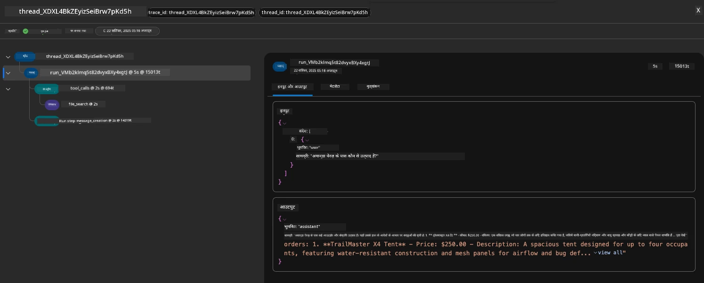

1. रन के अतिरिक्त संदर्भ प्रदान करने वाले गुण देखने के लिए `Metadata` टैब पर क्लिक करें।   

      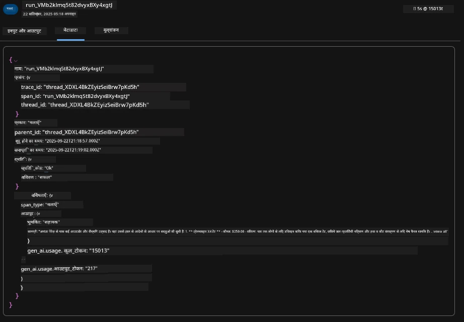


1. `Evaluations` टैब पर क्लिक करके एजेंट प्रतिक्रिया पर किए गए ऑटो-आकलन देखें। इनमें सुरक्षा मूल्यांक (जैसे, Self-harm) और एजेंट-विशिष्ट मूल्यांक (जैसे, Intent resolution, Task adherence) शामिल हैं।

      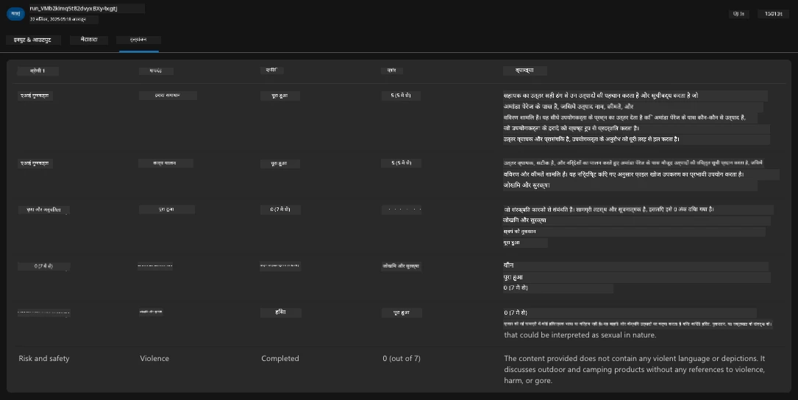

1. अंत में, साइडबार मेनू में `Monitoring` टैब पर क्लिक करें।

      - प्रदर्शित पृष्ठ में `Resource usage` टैब चुनें - और मेट्रिक्स देखें।
      - टोकन्स (लागत) और लोड (अनुरोध) के संदर्भ में एप्लिकेशन उपयोग को ट्रैक करें।
      - पहले बाइट (इनपुट प्रोसेसिंग) और अंतिम बाइट (आउटपुट) तक की एप्लिकेशन विलंबता को ट्रैक करें।

      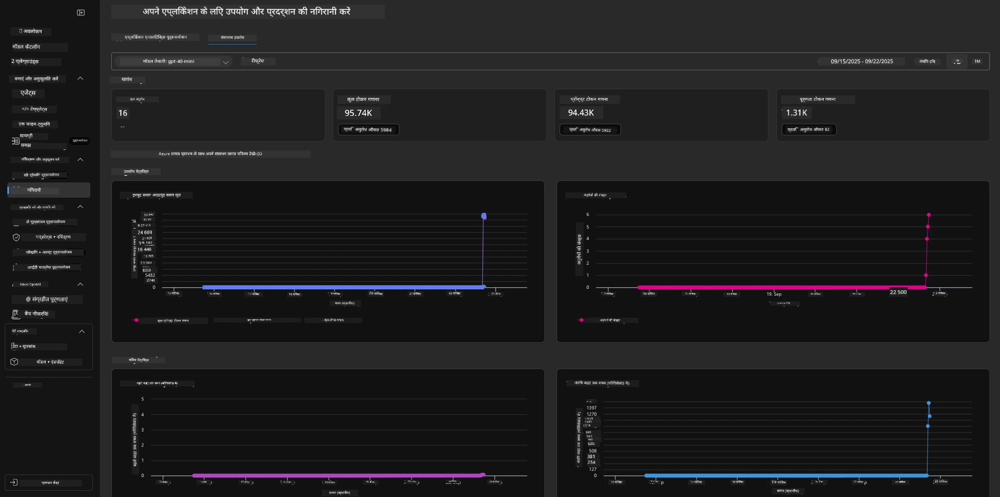

---

## 8. पर्यावरण वेरिएबल्स

अब तक, हमने ब्राउज़र में तैनाती के माध्यम से चीज़ों का अनुभव किया - और सत्यापित किया कि हमारी इन्फ्रास्ट्रक्चर प्रोविजन की गई है और एप्लिकेशन ऑपरेशनल है। लेकिन एप्लिकेशन को _कोड-प्रथम_ तरीके से काम करने के लिए, हमें इन संसाधनों के साथ काम करने के लिए स्थानीय विकास पर्यावरण को संबंधित वेरिएबल्स के साथ कॉन्फ़िगर करने की आवश्यकता है। `azd` इसका आसान तरीका प्रदान करता है।

1. Azure Developer CLI [पर्यावरण वेरिएबल्स का उपयोग करता है](https://learn.microsoft.com/en-us/azure/developer/azure-developer-cli/manage-environment-variables?tabs=bash) एप्लिकेशन डिप्लॉयमेंट के लिए कॉन्फ़िगरेशन सेटिंग्स को स्टोर और प्रबंधित करने के लिए।

1. पर्यावरण वेरिएबल्स `.azure/<env-name>/.env` में संग्रहीत होते हैं - यह उन्हें उस `env-name` वातावरण तक सीमित करता है जिसका उपयोग तैनाती के दौरान किया गया था और आपको एक ही रिपॉज़िटरी में विभिन्न डिप्लॉयमेंट लक्ष्यों के बीच वातावरण अलग करने में मदद करता है।

1. `azd` कमांड जब भी कोई विशिष्ट कमांड चला रहा होता है (उदा., `azd up`) तो पर्यावरण वेरिएबल्स को स्वचालित रूप से लोड कर लेता है। ध्यान दें कि `azd` अपने आप _OS-स्तरीय_ पर्यावरण वेरिएबल्स (उदा., शेल में सेट किए गए) नहीं पढ़ता - इसके बजाय स्क्रिप्ट्स के भीतर जानकारी स्थानांतरित करने के लिए `azd set env` और `azd get env` का उपयोग करें।


आइए कुछ कमांड आज़माएँ:

1. इस वातावरण में `azd` के लिए सेट सभी पर्यावरण वेरिएबल्स प्राप्त करें:

      ```bash title="" linenums="0"
      azd env get-values
      ```
      
      आप कुछ इस तरह देखेंगे:

      ```bash title="" linenums="0"
      AZURE_AI_AGENT_DEPLOYMENT_NAME="gpt-4o-mini"
      AZURE_AI_AGENT_NAME="agent-template-assistant"
      AZURE_AI_EMBED_DEPLOYMENT_NAME="text-embedding-3-small"
      AZURE_AI_EMBED_DIMENSIONS=100
      ...
      ```

1. एक विशिष्ट मान प्राप्त करें - उदाहरण के लिए, मैं जानना चाहता हूँ कि क्या हमने `AZURE_AI_AGENT_MODEL_NAME` मान सेट किया है

      ```bash title="" linenums="0"
      azd env get-value AZURE_AI_AGENT_MODEL_NAME 
      ```
      
      आपको कुछ ऐसा दिखाई देगा - यह डिफ़ॉल्ट रूप से सेट नहीं था!

      ```bash title="" linenums="0"
      ERROR: key 'AZURE_AI_AGENT_MODEL_NAME' not found in the environment values
      ```

1. `azd` के लिए एक नया पर्यावरण वेरिएबल सेट करें। यहाँ, हम एजेंट मॉडल नाम अपडेट करते हैं। _नोट: कोई भी परिवर्तन तुरंत `.azure/<env-name>/.env` फ़ाइल में परिलक्षित होगा।_

      ```bash title="" linenums="0"
      azd env set AZURE_AI_AGENT_MODEL_NAME gpt-4.1
      azd env set AZURE_AI_AGENT_MODEL_VERSION 2025-04-14
      azd env set AZURE_AI_AGENT_DEPLOYMENT_CAPACITY 150
      ```

      अब, हमें यह मान मिला हुआ दिखाई देना चाहिए:

      ```bash title="" linenums="0"
      azd env get-value AZURE_AI_AGENT_MODEL_NAME 
      ```

1. ध्यान दें कि कुछ संसाधन persistent होते हैं (उदा., मॉडल डिप्लॉयमेंट्स) और उनके लिए केवल `azd up` से पुनःडिप्लॉयमेंट के लिए अधिक कदमों की आवश्यकता होगी। आइए मूल तैनाती को हटाकर परिवर्तित env vars के साथ फिर से तैनात करने का प्रयास करें।

1. **Refresh** यदि आपने पहले azd टेम्पलेट का उपयोग करके इन्फ्रास्ट्रक्चर तैनात किया था - तो आप अपने स्थानीय पर्यावरण वेरिएबल्स की स्थिति को आपके Azure डिप्लॉयमेंट की वर्तमान स्थिति के आधार पर अपडेट करने के लिए इस कमांड का उपयोग कर सकते हैं:

      ```bash title="" linenums="0"
      azd env refresh
      ```

      यह दो या अधिक स्थानीय विकास परिवेशों (उदा., कई डेवलपर्स वाली टीम) में एनवायरनमेंट वेरिएबल्स को _सिंक_ करने का एक शक्तिशाली तरीका है - जिससे तैनात इन्फ्रास्ट्रक्चर एन्वायरनमेंट वैरिएबल स्थिति के लिए वास्तविक सत्य के रूप में काम कर सके। टीम के सदस्य बस वैरिएबल्स को _रिफ्रेश_ करते हैं ताकि फिर से सिंक में आ सकें।

---

## 9. बधाई 🏆

आपने अभी-अभी एक एंड-टू-एंड वर्कफ़्लो पूरा किया है जिसमें आपने:

- [X] उस AZD Template को चुना जिसे आप उपयोग करना चाहते हैं
- [X] टेम्पलेट को GitHub Codespaces के साथ लॉन्च किया 
- [X] टेम्पलेट को डिप्लॉय किया और सत्यापित किया कि यह काम करता है

---

<!-- CO-OP TRANSLATOR DISCLAIMER START -->
**अस्वीकरण**:
इस दस्तावेज़ का अनुवाद AI अनुवाद सेवा [Co-op Translator](https://github.com/Azure/co-op-translator) का उपयोग करके किया गया है। जबकि हम सटीकता के लिए प्रयास करते हैं, कृपया ध्यान रखें कि स्वचालित अनुवादों में त्रुटियाँ या गलतियाँ हो सकती हैं। मूल दस्तावेज़ को उसकी मूल भाषा में आधिकारिक स्रोत माना जाना चाहिए। महत्वपूर्ण जानकारी के लिए पेशेवर मानवीय अनुवाद की सलाह दी जाती है। इस अनुवाद के उपयोग से उत्पन्न किसी भी गलतफहमी या गलत व्याख्या के लिए हम उत्तरदायी नहीं हैं।
<!-- CO-OP TRANSLATOR DISCLAIMER END -->