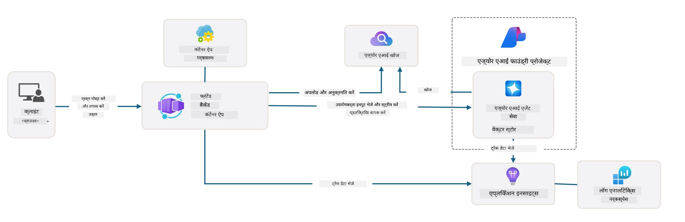

# 3. टेम्पलेट को समझना

!!! tip "इस मॉड्यूल के अंत तक आप सक्षम होंगे"

    - [ ] आइटम
    - [ ] आइटम
    - [ ] आइटम
    - [ ] **लैब 3:** 

---

AZD टेम्पलेट्स और Azure Developer CLI (`azd`) के साथ, हम AI विकास यात्रा को तेज़ी से शुरू कर सकते हैं। ये टेम्पलेट्स मानकीकृत रिपॉजिटरी प्रदान करते हैं, जिनमें नमूना कोड, इंफ्रास्ट्रक्चर और कॉन्फ़िगरेशन फाइलें होती हैं - एक तैयार-से-डिप्लॉय _स्टार्टर_ प्रोजेक्ट के रूप में।

**लेकिन अब, हमें प्रोजेक्ट संरचना और कोडबेस को समझने की आवश्यकता है - और AZD टेम्पलेट को कस्टमाइज़ करने में सक्षम होना चाहिए - बिना किसी पूर्व अनुभव या AZD की समझ के!**

---

## 1. GitHub Copilot को सक्रिय करें

### 1.1 GitHub Copilot Chat इंस्टॉल करें

अब समय है [GitHub Copilot with Agent Mode](https://code.visualstudio.com/docs/copilot/chat/chat-agent-mode) को एक्सप्लोर करने का। अब हम प्राकृतिक भाषा का उपयोग करके अपने कार्य को उच्च स्तर पर वर्णित कर सकते हैं और निष्पादन में सहायता प्राप्त कर सकते हैं। इस लैब के लिए, हम [Copilot Free plan](https://github.com/github-copilot/signup) का उपयोग करेंगे, जिसमें पूर्णता और चैट इंटरैक्शन के लिए मासिक सीमा है।

यह एक्सटेंशन मार्केटप्लेस से इंस्टॉल किया जा सकता है, लेकिन यह पहले से ही आपके Codespaces वातावरण में उपलब्ध होना चाहिए। _Copilot आइकन ड्रॉप-डाउन से `Open Chat` पर क्लिक करें - और एक प्रॉम्प्ट टाइप करें जैसे `What can you do?`_ - आपको लॉग इन करने के लिए कहा जा सकता है। **GitHub Copilot Chat तैयार है।**

### 1.2 MCP सर्वर इंस्टॉल करें

Agent मोड को प्रभावी बनाने के लिए, इसे सही टूल्स तक पहुंच की आवश्यकता होती है ताकि यह ज्ञान प्राप्त कर सके या कार्य कर सके। यही वह जगह है जहां MCP सर्वर मदद कर सकते हैं। हम निम्नलिखित सर्वर कॉन्फ़िगर करेंगे:

1. [Azure MCP Server](../../../../../workshop/docs/instructions)
1. [Microsoft Docs MCP Server](../../../../../workshop/docs/instructions)

इन्हें सक्रिय करने के लिए:

1. `.vscode/mcp.json` नामक एक फाइल बनाएं यदि यह मौजूद नहीं है
1. इस फाइल में निम्नलिखित कॉपी करें - और सर्वर शुरू करें!
   ```json title=".vscode/mcp.json"
   {
      "servers": {
         "Azure MCP Server": {
            "command": "npx",
            "args": [
            "-y",
            "@azure/mcp@latest",
            "server",
            "start"
            ]
         },
         "microsoft.docs.mcp": {
            "type": "http",
            "url": "https://learn.microsoft.com/api/mcp"
         }
      }
   }
   ```

??? warning "आपको `npx` इंस्टॉल न होने का त्रुटि संदेश मिल सकता है (फिक्स के लिए क्लिक करें)"

      इसे ठीक करने के लिए, `.devcontainer/devcontainer.json` फाइल खोलें और फीचर्स सेक्शन में यह लाइन जोड़ें। फिर कंटेनर को पुनर्निर्माण करें। अब आपके पास `npx` इंस्टॉल होना चाहिए।

      ```title="" linenums="0"
         "features": {
            "ghcr.io/devcontainers/features/node:1": {},
            ...
         },
      ```

---

### 1.3 GitHub Copilot Chat का परीक्षण करें

**पहले `az login` का उपयोग करके Azure से VS Code कमांड लाइन से प्रमाणित करें।**

अब आप अपने Azure सब्सक्रिप्शन की स्थिति पूछ सकते हैं और तैनात संसाधनों या कॉन्फ़िगरेशन के बारे में सवाल पूछ सकते हैं। इन प्रॉम्प्ट्स को आज़माएं:

1. `List my Azure resource groups`
1. `#foundry list my current deployments`

आप Azure दस्तावेज़ों के बारे में सवाल पूछ सकते हैं और Microsoft Docs MCP सर्वर से उत्तर प्राप्त कर सकते हैं। इन प्रॉम्प्ट्स को आज़माएं:

1. `#microsoft_docs_search What is Azure Developer CLI?`
1. `#microsoft_docs_search Show me a Python tutorial to chat with deployed model`

या आप किसी कार्य को पूरा करने के लिए कोड स्निपेट्स मांग सकते हैं। इस प्रॉम्प्ट को आज़माएं:

1. `Give me a Python code example that uses AAD for an interactive chat client`

`Ask` मोड में, यह कोड प्रदान करेगा जिसे आप कॉपी-पेस्ट कर सकते हैं और आज़मा सकते हैं। `Agent` मोड में, यह एक कदम आगे बढ़ सकता है और आपके लिए संबंधित संसाधन बना सकता है - जिसमें सेटअप स्क्रिप्ट और दस्तावेज़ शामिल हैं - ताकि आप उस कार्य को निष्पादित कर सकें।

**अब आप टेम्पलेट रिपॉजिटरी को एक्सप्लोर करने के लिए तैयार हैं।**

---

## 2. आर्किटेक्चर को समझना

??? prompt "पूछें: docs/images/architecture.png में एप्लिकेशन आर्किटेक्चर को 1 पैराग्राफ में समझाएं"

      यह एप्लिकेशन Azure पर आधारित एक AI-संचालित चैट एप्लिकेशन है जो आधुनिक एजेंट-आधारित आर्किटेक्चर को प्रदर्शित करता है। समाधान का केंद्र एक Azure Container App है जो मुख्य एप्लिकेशन कोड को होस्ट करता है, जो उपयोगकर्ता इनपुट को प्रोसेस करता है और AI एजेंट के माध्यम से बुद्धिमान प्रतिक्रियाएं उत्पन्न करता है। 
      
      आर्किटेक्चर Azure AI Foundry Project को AI क्षमताओं के लिए आधार के रूप में उपयोग करता है, जो Azure AI Services से जुड़ता है जो अंतर्निहित भाषा मॉडल (जैसे GPT-4o-mini) और एजेंट कार्यक्षमता प्रदान करता है। उपयोगकर्ता इंटरैक्शन React-आधारित फ्रंटएंड से FastAPI बैकएंड तक प्रवाहित होते हैं, जो संदर्भात्मक प्रतिक्रियाएं उत्पन्न करने के लिए AI एजेंट सेवा के साथ संचार करता है। 
      
      सिस्टम ज्ञान पुनर्प्राप्ति क्षमताओं को फ़ाइल खोज या Azure AI Search सेवा के माध्यम से शामिल करता है, जिससे एजेंट अपलोड किए गए दस्तावेज़ों से जानकारी का उपयोग और उद्धरण कर सकता है। परिचालन उत्कृष्टता के लिए, आर्किटेक्चर में ट्रेसिंग, लॉगिंग और प्रदर्शन अनुकूलन के लिए Application Insights और Log Analytics Workspace के माध्यम से व्यापक निगरानी शामिल है। 
      
      Azure Storage एप्लिकेशन डेटा और फ़ाइल अपलोड के लिए ब्लॉब स्टोरेज प्रदान करता है, जबकि Managed Identity Azure संसाधनों के बीच सुरक्षित पहुंच सुनिश्चित करता है बिना क्रेडेंशियल्स को संग्रहीत किए। पूरा समाधान मांग के आधार पर स्वचालित रूप से स्केल करने के लिए डिज़ाइन किया गया है, जबकि Azure के प्रबंधित सेवाओं के पारिस्थितिकी तंत्र के माध्यम से अंतर्निहित सुरक्षा, निगरानी और CI/CD क्षमताएं प्रदान करता है।



---

## 3. रिपॉजिटरी संरचना

!!! prompt "पूछें: टेम्पलेट फ़ोल्डर संरचना को समझाएं। एक दृश्य पदानुक्रमात्मक आरेख से शुरू करें।"

??? info "उत्तर: दृश्य पदानुक्रमात्मक आरेख"

      ```bash title="" 
      get-started-with-ai-agents/
      ├── 📋 कॉन्फ़िगरेशन और सेटअप
      │   ├── azure.yaml                    # Azure Developer CLI कॉन्फ़िगरेशन
      │   ├── docker-compose.yaml           # लोकल डेवलपमेंट कंटेनर
      │   ├── pyproject.toml                # Python प्रोजेक्ट कॉन्फ़िगरेशन
      │   ├── requirements-dev.txt          # डेवलपमेंट डिपेंडेंसी
      │   └── .devcontainer/                # VS Code dev container सेटअप
      │
      ├── 🏗️ इंफ्रास्ट्रक्चर (infra/)
      │   ├── main.bicep                    # मुख्य इंफ्रास्ट्रक्चर टेम्पलेट
      │   ├── api.bicep                     # API-विशिष्ट संसाधन
      │   ├── main.parameters.json          # इंफ्रास्ट्रक्चर पैरामीटर
      │   └── core/                         # मॉड्यूलर इंफ्रास्ट्रक्चर घटक
      │       ├── ai/                       # AI सेवा कॉन्फ़िगरेशन
      │       ├── host/                     # होस्टिंग इंफ्रास्ट्रक्चर
      │       ├── monitor/                  # निगरानी और लॉगिंग
      │       ├── search/                   # Azure AI Search सेटअप
      │       ├── security/                 # सुरक्षा और पहचान
      │       └── storage/                  # स्टोरेज अकाउंट कॉन्फ़िगरेशन
      │
      ├── 💻 एप्लिकेशन स्रोत (src/)
      │   ├── api/                          # बैकएंड API
      │   │   ├── main.py                   # FastAPI एप्लिकेशन एंट्री
      │   │   ├── routes.py                 # API रूट परिभाषाएं
      │   │   ├── search_index_manager.py   # सर्च कार्यक्षमता
      │   │   ├── data/                     # API डेटा हैंडलिंग
      │   │   ├── static/                   # स्थिर वेब एसेट्स
      │   │   └── templates/                # HTML टेम्पलेट्स
      │   ├── frontend/                     # React/TypeScript फ्रंटएंड
      │   │   ├── package.json              # Node.js डिपेंडेंसी
      │   │   ├── vite.config.ts            # Vite बिल्ड कॉन्फ़िगरेशन
      │   │   └── src/                      # फ्रंटएंड स्रोत कोड
      │   ├── data/                         # नमूना डेटा फाइलें
      │   │   └── embeddings.csv            # पूर्व-गणना एम्बेडिंग्स
      │   ├── files/                        # ज्ञान आधार फाइलें
      │   │   ├── customer_info_*.json      # ग्राहक डेटा नमूने
      │   │   └── product_info_*.md         # उत्पाद दस्तावेज़
      │   ├── Dockerfile                    # कंटेनर कॉन्फ़िगरेशन
      │   └── requirements.txt              # Python डिपेंडेंसी
      │
      ├── 🔧 ऑटोमेशन और स्क्रिप्ट्स (scripts/)
      │   ├── postdeploy.sh/.ps1           # पोस्ट-डिप्लॉयमेंट सेटअप
      │   ├── setup_credential.sh/.ps1     # क्रेडेंशियल कॉन्फ़िगरेशन
      │   ├── validate_env_vars.sh/.ps1    # पर्यावरण सत्यापन
      │   └── resolve_model_quota.sh/.ps1  # मॉडल कोटा प्रबंधन
      │
      ├── 🧪 परीक्षण और मूल्यांकन
      │   ├── tests/                        # यूनिट और इंटीग्रेशन टेस्ट
      │   │   └── test_search_index_manager.py
      │   ├── evals/                        # एजेंट मूल्यांकन फ्रेमवर्क
      │   │   ├── evaluate.py               # मूल्यांकन रनर
      │   │   ├── eval-queries.json         # टेस्ट क्वेरीज़
      │   │   └── eval-action-data-path.json
      │   ├── sandbox/                      # विकास प्लेग्राउंड
      │   │   ├── 1-quickstart.py           # शुरुआत के उदाहरण
      │   │   └── aad-interactive-chat.py   # प्रमाणीकरण उदाहरण
      │   └── airedteaming/                 # AI सुरक्षा मूल्यांकन
      │       └── ai_redteaming.py          # रेड टीम परीक्षण
      │
      ├── 📚 दस्तावेज़ (docs/)
      │   ├── deployment.md                 # डिप्लॉयमेंट गाइड
      │   ├── local_development.md          # लोकल सेटअप निर्देश
      │   ├── troubleshooting.md            # सामान्य समस्याएं और समाधान
      │   ├── azure_account_setup.md        # Azure पूर्वापेक्षाएँ
      │   └── images/                       # दस्तावेज़ एसेट्स
      │
      └── 📄 प्रोजेक्ट मेटाडेटा
         ├── README.md                     # प्रोजेक्ट अवलोकन
         ├── CODE_OF_CONDUCT.md           # सामुदायिक दिशानिर्देश
         ├── CONTRIBUTING.md              # योगदान गाइड
         ├── LICENSE                      # लाइसेंस शर्तें
         └── next-steps.md                # पोस्ट-डिप्लॉयमेंट मार्गदर्शन
      ```

### 3.1 मुख्य ऐप आर्किटेक्चर

यह टेम्पलेट **फुल-स्टैक वेब एप्लिकेशन** पैटर्न का अनुसरण करता है:

- **बैकएंड**: Python FastAPI के साथ Azure AI इंटीग्रेशन
- **फ्रंटएंड**: TypeScript/React के साथ Vite बिल्ड सिस्टम
- **इंफ्रास्ट्रक्चर**: Azure Bicep टेम्पलेट्स के साथ क्लाउड संसाधन
- **कंटेनरीकरण**: स्थिर डिप्लॉयमेंट के लिए Docker

### 3.2 इंफ्रास्ट्रक्चर कोड (bicep)

इंफ्रास्ट्रक्चर लेयर **Azure Bicep** टेम्पलेट्स का उपयोग करती है, जो मॉड्यूलर रूप से व्यवस्थित हैं:

   - **`main.bicep`**: सभी Azure संसाधनों को ऑर्केस्ट्रेट करता है
   - **`core/` मॉड्यूल्स**: विभिन्न सेवाओं के लिए पुन: उपयोग योग्य घटक
      - AI सेवाएं (Azure OpenAI, AI Search)
      - कंटेनर होस्टिंग (Azure Container Apps)
      - निगरानी (Application Insights, Log Analytics)
      - सुरक्षा (Key Vault, Managed Identity)

### 3.3 एप्लिकेशन स्रोत (`src/`)

**बैकएंड API (`src/api/`)**:

- FastAPI-आधारित REST API
- Azure AI एजेंट सेवा इंटीग्रेशन
- ज्ञान पुनर्प्राप्ति के लिए सर्च इंडेक्स प्रबंधन
- फ़ाइल अपलोड और प्रोसेसिंग क्षमताएं

**फ्रंटएंड (`src/frontend/`)**:

- आधुनिक React/TypeScript SPA
- तेज़ विकास और अनुकूलित बिल्ड के लिए Vite
- एजेंट इंटरैक्शन के लिए चैट इंटरफ़ेस

**ज्ञान आधार (`src/files/`)**:

- नमूना ग्राहक और उत्पाद डेटा
- फ़ाइल-आधारित ज्ञान पुनर्प्राप्ति का प्रदर्शन
- JSON और Markdown प्रारूप उदाहरण

### 3.4 DevOps और ऑटोमेशन

**स्क्रिप्ट्स (`scripts/`)**:

- क्रॉस-प्लेटफ़ॉर्म PowerShell और Bash स्क्रिप्ट्स
- पर्यावरण सत्यापन और सेटअप
- पोस्ट-डिप्लॉयमेंट कॉन्फ़िगरेशन
- मॉडल कोटा प्रबंधन

**Azure Developer CLI इंटीग्रेशन**:

- `azure.yaml` कॉन्फ़िगरेशन `azd` वर्कफ़्लो के लिए
- स्वचालित प्रावधान और डिप्लॉयमेंट
- पर्यावरण वेरिएबल प्रबंधन

### 3.5 परीक्षण और गुणवत्ता आश्वासन

**मूल्यांकन फ्रेमवर्क (`evals/`)**:

- एजेंट प्रदर्शन मूल्यांकन
- क्वेरी-प्रतिक्रिया गुणवत्ता परीक्षण
- स्वचालित मूल्यांकन पाइपलाइन

**AI सुरक्षा (`airedteaming/`)**:

- AI सुरक्षा के लिए रेड टीम परीक्षण
- सुरक्षा भेद्यता स्कैनिंग
- जिम्मेदार AI प्रथाएं

---

## 4. बधाई 🏆

आपने सफलतापूर्वक GitHub Copilot Chat को MCP सर्वर के साथ उपयोग किया और रिपॉजिटरी को एक्सप्लोर किया।

- [X] Azure के लिए GitHub Copilot को सक्रिय किया
- [X] एप्लिकेशन आर्किटेक्चर को समझा
- [X] AZD टेम्पलेट संरचना को एक्सप्लोर किया

इससे आपको इस टेम्पलेट के _इंफ्रास्ट्रक्चर कोड_ एसेट्स का एक अंदाजा मिलता है। अगले चरण में, हम AZD के कॉन्फ़िगरेशन फाइल को देखेंगे।

---

