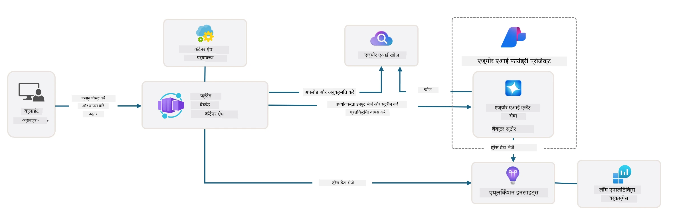

# 3. टेम्पलेट को विखंडित करें

!!! tip "BY THE END OF THIS MODULE YOU WILL BE ABLE TO"

    - [ ] Azure सहायता के लिए MCP सर्वरों के साथ GitHub Copilot सक्रिय करें
    - [ ] AZD टेम्पलेट फ़ोल्डर संरचना और घटकों को समझें
    - [ ] Infrastructure-as-code (Bicep) संगठन पैटर्न का अन्वेषण करें
    - [ ] **Lab 3:** GitHub Copilot का उपयोग करके रिपॉज़िटरी आर्किटेक्चर का अन्वेषण और समझ 

---


With AZD templates and the Azure Developer CLI (`azd`) we can quickly jumpstart our AI development journey with standardized repositories that provide sample code, infrastructure and configuration files - in the form of a ready-to-deploy _starter_ project.

**लेकिन अब, हमें प्रोजेक्ट संरचना और कोडबेस को समझने की जरूरत है - और AZD टेम्पलेट को अनुकूलित करने में सक्षम होना चाहिए - AZD के किसी भी पूर्व अनुभव या समझ के बिना!**

---

## 1. Activate GitHub Copilot

### 1.1 Install GitHub Copilot Chat

It's time to explore [GitHub Copilot with Agent Mode](https://code.visualstudio.com/docs/copilot/chat/chat-agent-mode). Now, we can use natural language to describe our task at a high level, and get assistance in execution. For this lab, we'll use the [Copilot Free plan](https://github.com/github-copilot/signup) which has a monthly limit for completions and chat interactions.

The extension can be installed from the marketplace, but should already be available in your Codespaces environment. _Click `Open Chat` from the Copilot icon drop-down - and type a prompt like `What can you do?`_ - you may be prompted to log in. **GitHub Copilot Chat is ready**.

### 1.2. Install MCP Servers

For Agent mode to be effective, it needs access to the right tools to help it retrieve knowledge or take actions. This is where MCP servers can help. We'll configure the following servers:

1. [Azure MCP Server](../../../../../workshop/docs/instructions)
1. [Microsoft Docs MCP Server](../../../../../workshop/docs/instructions)

To activate these:

1. Create a file called `.vscode/mcp.json` if it does not exist
1. Copy the following into that file - and start the servers!
   ```json title=".vscode/mcp.json"
   {
      "servers": {
         "Azure MCP Server": {
            "command": "npx",
            "args": [
            "-y",
            "@azure/mcp@latest",
            "server",
            "start"
            ]
         },
         "microsoft.docs.mcp": {
            "type": "http",
            "url": "https://learn.microsoft.com/api/mcp"
         }
      }
   }
   ```

??? warning "You may get an error that `npx` is not installed (click to expand for fix)"

      To fix,this open the `.devcontainer/devcontainer.json` file and add this line to the features section. Then rebuild the container. You should now have `npx` installed.

      ```title="" linenums="0"
         "features": {
            "ghcr.io/devcontainers/features/node:1": {},
            ...
         },
      ```

---

### 1.3. Test GitHub Copilot Chat

**पहले `az login` का उपयोग करके VS Code कमांड लाइन से Azure में प्रमाणित करें।**

You should now be able to query your Azure subscription status, and ask questions about deployed resources or configuration. Try these prompts:

1. `List my Azure resource groups`
1. `#foundry list my current deployments`

You can also ask questions about Azure documentation and get responses grounded in the Microsoft Docs MCP server. Try these prompts:

1. `#microsoft_docs_search What is Azure Developer CLI?`
1. `#microsoft_docs_search Show me a Python tutorial to chat with deployed model`

Or you can ask for code snippets to complete a task. Try this prompt.

1. `Give me a Python code example that uses AAD for an interactive chat client`

In `Ask` mode, this will provide code that you can copy-paste and try out. In `Agent` mode, this might go a step further and create the relevant resources for you - including setup scripts and documentation - to help you execute that task.

**You are now equipped to start exploring the template repository**

---

## 2. Deconstruct Architecture

??? prompt "ASK: Explain the application architecture in docs/images/architecture.png in 1 paragraph"

      यह एप्लिकेशन Azure पर बना एक AI-संचालित चैट एप्लिकेशन है जो एक आधुनिक एजेंट-आधारित आर्किटेक्चर को दर्शाता है। समाधान का केंद्र एक Azure Container App है जो मुख्य अनुप्रयोग कोड की मेज़बानी करता है, जो उपयोगकर्ता इनपुट को प्रोसेस करता है और एक AI एजेंट के माध्यम से बुद्धिमान प्रतिक्रियाएँ उत्पन्न करता है। 
      
      आर्किटेक्चर AI क्षमताओं के लिए Microsoft Foundry Project का उपयोग करता है, और Azure AI Services से जुड़ता है जो अंतर्निहित भाषा मॉडलों (जैसे GPT-4o-mini) और एजेंट फ़ंक्शनलिटी को प्रदान करते हैं। उपयोगकर्ता इंटरैक्शन React-आधारित फ़्रंटएंड से FastAPI बैकएंड तक प्रवाहित होते हैं, जो संदर्भित प्रतिक्रियाएँ उत्पन्न करने के लिए AI एजेंट सेवा के साथ संवाद करता है। 
      
      सिस्टम फाइल खोज या Azure AI Search सेवा के माध्यम से ज्ञान पुनर्प्राप्ति क्षमताओं को शामिल करता है, जिससे एजेंट अपलोड किए गए दस्तावेज़ों से जानकारी तक पहुँचने और उद्धृत करने में सक्षम होता है। संचालन उत्कृष्टता के लिए, आर्किटेक्चर ट्रेसिंग, लॉगिंग और प्रदर्शन अनुकूलन के लिए Application Insights और Log Analytics Workspace के माध्यम से व्यापक मॉनिटरिंग शामिल करता है। 
      
      Azure Storage एप्लिकेशन डेटा और फ़ाइल अपलोड के लिए ब्लॉब स्टोरेज प्रदान करता है, जबकि Managed Identity Azure संसाधनों के बीच क्रेडेंशियल संग्रহ के बिना सुरक्षित पहुंच सुनिश्चित करता है। पूरा समाधान स्केलेबिलिटी और मेंटेनबिलिटी के लिए डिज़ाइन किया गया है, जिसमें कंटेनरयुक्त एप्लिकेशन माँग के अनुसार स्वचालित रूप से स्केल करता है और Azure के प्रबंधित सेवाओं पारिस्थितिकी तंत्र के माध्यम से अंतर्निहित सुरक्षा, मॉनिटरिंग और CI/CD क्षमताएँ प्रदान करता है।



---

## 3. Repository Structure

!!! prompt "ASK: Explain the template folder structure. Start with a visual hierarchical diagram."

??? info "ANSWER: Visual Hierarchical Diagram"

      ```bash title="" 
      get-started-with-ai-agents/
      ├── 📋 Configuration & Setup
      │   ├── azure.yaml                    # Azure Developer CLI configuration
      │   ├── docker-compose.yaml           # Local development containers
      │   ├── pyproject.toml                # Python project configuration
      │   ├── requirements-dev.txt          # Development dependencies
      │   └── .devcontainer/                # VS Code dev container setup
      │
      ├── 🏗️ Infrastructure (infra/)
      │   ├── main.bicep                    # Main infrastructure template
      │   ├── api.bicep                     # API-specific resources
      │   ├── main.parameters.json          # Infrastructure parameters
      │   └── core/                         # Modular infrastructure components
      │       ├── ai/                       # AI service configurations
      │       ├── host/                     # Hosting infrastructure
      │       ├── monitor/                  # Monitoring and logging
      │       ├── search/                   # Azure AI Search setup
      │       ├── security/                 # Security and identity
      │       └── storage/                  # Storage account configs
      │
      ├── 💻 Application Source (src/)
      │   ├── api/                          # Backend API
      │   │   ├── main.py                   # FastAPI application entry
      │   │   ├── routes.py                 # API route definitions
      │   │   ├── search_index_manager.py   # Search functionality
      │   │   ├── data/                     # API data handling
      │   │   ├── static/                   # Static web assets
      │   │   └── templates/                # HTML templates
      │   ├── frontend/                     # React/TypeScript frontend
      │   │   ├── package.json              # Node.js dependencies
      │   │   ├── vite.config.ts            # Vite build configuration
      │   │   └── src/                      # Frontend source code
      │   ├── data/                         # Sample data files
      │   │   └── embeddings.csv            # Pre-computed embeddings
      │   ├── files/                        # Knowledge base files
      │   │   ├── customer_info_*.json      # Customer data samples
      │   │   └── product_info_*.md         # Product documentation
      │   ├── Dockerfile                    # Container configuration
      │   └── requirements.txt              # Python dependencies
      │
      ├── 🔧 Automation & Scripts (scripts/)
      │   ├── postdeploy.sh/.ps1           # Post-deployment setup
      │   ├── setup_credential.sh/.ps1     # Credential configuration
      │   ├── validate_env_vars.sh/.ps1    # Environment validation
      │   └── resolve_model_quota.sh/.ps1  # Model quota management
      │
      ├── 🧪 Testing & Evaluation
      │   ├── tests/                        # Unit and integration tests
      │   │   └── test_search_index_manager.py
      │   ├── evals/                        # Agent evaluation framework
      │   │   ├── evaluate.py               # Evaluation runner
      │   │   ├── eval-queries.json         # Test queries
      │   │   └── eval-action-data-path.json
      │   ├── sandbox/                      # Development playground
      │   │   ├── 1-quickstart.py           # Getting started examples
      │   │   └── aad-interactive-chat.py   # Authentication examples
      │   └── airedteaming/                 # AI safety evaluation
      │       └── ai_redteaming.py          # Red team testing
      │
      ├── 📚 Documentation (docs/)
      │   ├── deployment.md                 # Deployment guide
      │   ├── local_development.md          # Local setup instructions
      │   ├── troubleshooting.md            # Common issues & fixes
      │   ├── azure_account_setup.md        # Azure prerequisites
      │   └── images/                       # Documentation assets
      │
      └── 📄 Project Metadata
         ├── README.md                     # Project overview
         ├── CODE_OF_CONDUCT.md           # Community guidelines
         ├── CONTRIBUTING.md              # Contribution guide
         ├── LICENSE                      # License terms
         └── next-steps.md                # Post-deployment guidance
      ```

### 3.1. Core App Architecture

This template follows a **full-stack web application** pattern with:

- **Backend**: Python FastAPI के साथ Azure AI इंटीग्रेशन
- **Frontend**: TypeScript/React और Vite बिल्ड सिस्टम
- **Infrastructure**: Azure Bicep टेम्पलेट्स क्लाउड संसाधनों के लिए
- **Containerization**: सुसंगत तैनाती के लिए Docker

### 3.2 Infra As Code (bicep)

The infrastructure layer uses **Azure Bicep** templates organized modularly:

   - **`main.bicep`**: सभी Azure संसाधनों का समन्वय करता है
   - **`core/` modules**: विभिन्न सेवाओं के लिए पुन:उपयोग योग्य घटक
      - AI सेवाएँ (Azure OpenAI, AI Search)
      - कंटेनर होस्टिंग (Azure Container Apps)
      - मॉनिटरिंग (Application Insights, Log Analytics)
      - सुरक्षा (Key Vault, Managed Identity)

### 3.3 Application Source (`src/`)

**Backend API (`src/api/`)**:

- FastAPI-आधारित REST API
- Foundry Agents इंटीग्रेशन
- ज्ञान पुनर्प्राप्ति के लिए सर्च इंडेक्स प्रबंधन
- फाइल अपलोड और प्रोसेसिंग क्षमताएँ

**Frontend (`src/frontend/`)**:

- आधुनिक React/TypeScript SPA
- तेज़ विकास और अनुकूलित बिल्ड के लिए Vite
- एजेंट इंटरैक्शन के लिए चैट इंटरफ़ेस

**Knowledge Base (`src/files/`)**:

- नमूना ग्राहक और उत्पाद डेटा
- फाइल-आधारित ज्ञान पुनर्प्राप्ति को दर्शाता है
- JSON और Markdown फ़ॉर्मेट उदाहरण


### 3.4 DevOps & Automation

**Scripts (`scripts/`)**:

- क्रॉस-प्लेटफ़ॉर्म PowerShell और Bash स्क्रिप्ट्स
- पर्यावरण सत्यापन और सेटअप
- पोस्ट-डिप्लॉयमेंट कॉन्फ़िगरेशन
- मॉडल कोटा प्रबंधन

**Azure Developer CLI Integration**:

- `azure.yaml` कॉन्फ़िगरेशन `azd` वर्कफ़्लोज़ के लिए
- स्वचालित प्रोविज़निंग और तैनाती
- पर्यावरण वेरिएबल प्रबंधन

### 3.5 Testing & Quality Assurance

**Evaluation Framework (`evals/`)**:

- एजेंट प्रदर्शन मूल्यांकन
- क्वेरी-प्रतिक्रिया गुणवत्ता परीक्षण
- स्वचालित आकलन पाइपलाइन

**AI Safety (`airedteaming/`)**:

- AI सुरक्षा के लिए रेड टीम परीक्षण
- सुरक्षा भेद्यता स्कैनिंग
- जिम्मेदार AI अभ्यास

---

## 4. बधाई 🏆

आपने सफलतापूर्वक MCP सर्वर्स के साथ GitHub Copilot Chat का उपयोग करके रिपॉज़िटरी का अन्वेषण किया।

- [X] GitHub Copilot को Azure के लिए सक्रिय किया
- [X] एप्लिकेशन आर्किटेक्चर को समझा
- [X] AZD टेम्पलेट संरचना का अन्वेषण किया

यह आपको इस टेम्पलेट के _इन्फ्रास्ट्रक्चर ऐज़ कोड_ संपत्तियों का एक आभास देता है। अगला, हम AZD के लिए कॉन्फ़िगरेशन फ़ाइल को देखेंगे।

---

<!-- CO-OP TRANSLATOR DISCLAIMER START -->
अस्वीकरण:
यह दस्तावेज़ AI अनुवाद सेवा [Co-op Translator](https://github.com/Azure/co-op-translator) का उपयोग करके अनुवादित किया गया है। जबकि हम सटीकता का प्रयास करते हैं, कृपया ध्यान रखें कि स्वचालित अनुवादों में त्रुटियाँ या अशुद्धियाँ हो सकती हैं। मूल दस्तावेज़ को उसकी मातृभाषा में ही प्राधिकृत स्रोत माना जाना चाहिए। महत्वपूर्ण जानकारी के लिए पेशेवर मानव अनुवाद की अनुशंसा की जाती है। इस अनुवाद के उपयोग से उत्पन्न किसी भी गलतफहमी या 미सइंटरप्रिटेशन के लिए हम उत्तरदायी नहीं हैं।
<!-- CO-OP TRANSLATOR DISCLAIMER END -->