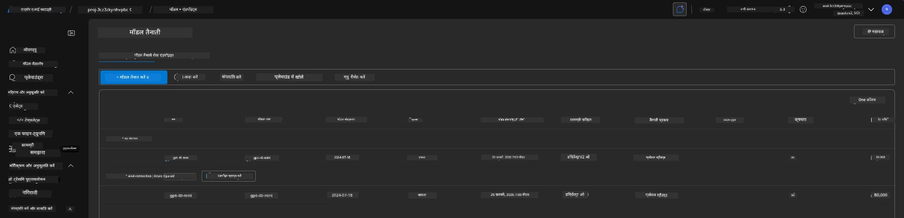
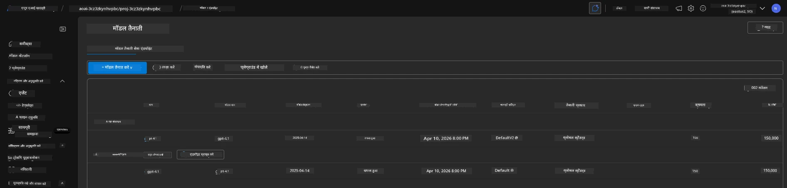

<!--
CO_OP_TRANSLATOR_METADATA:
{
  "original_hash": "6539a34c770f3ceff282370d72ee74dc",
  "translation_date": "2025-09-24T10:55:14+00:00",
  "source_file": "workshop/docs/instructions/6-Teardown-Infrastructure.md",
  "language_code": "hi"
}
-->
# 6. इंफ्रास्ट्रक्चर को समाप्त करना

!!! tip "इस मॉड्यूल के अंत तक आप सक्षम होंगे"

    - [ ] आइटम
    - [ ] आइटम
    - [ ] आइटम

---

## बोनस अभ्यास

प्रोजेक्ट को समाप्त करने से पहले, कुछ समय निकालकर खुले विचारों के साथ अन्वेषण करें।

!!! danger "NITYA-TODO: कुछ सुझावों को आजमाने के लिए रूपरेखा तैयार करें"

---

## इंफ्रास्ट्रक्चर को निष्क्रिय करना

1. इंफ्रास्ट्रक्चर को समाप्त करना उतना ही आसान है जितना:
      
      ```bash title="" linenums="0"
      azd down --purge
      ```
1. `--purge` फ्लैग यह सुनिश्चित करता है कि यह सॉफ्ट-डिलीट किए गए Cognitive Service संसाधनों को भी हटा देता है, जिससे इन संसाधनों द्वारा उपयोग की गई कोटा को रिलीज़ किया जा सके। प्रक्रिया पूरी होने के बाद आपको कुछ ऐसा दिखाई देगा:
      
      ```bash title="" linenums="0"
      ? Total resources to delete: 11, are you sure you want to continue? Yes
      Deleting your resources can take some time.
      (✓) Done: Deleted resource group rg-nitya-mshack-azd
      (✓) Done: Purging Cognitive Account: aoai-3cz3zkynhvpbc

      SUCCESS: Your application was removed from Azure in 11 minutes 4 seconds.
      ```

1. (वैकल्पिक) यदि आप अब `azd up` फिर से चलाते हैं, तो आप देखेंगे कि gpt-4.1 मॉडल तैनात हो जाता है क्योंकि पर्यावरण चर को स्थानीय `.azure` फ़ोल्डर में बदल दिया गया (और सहेजा गया) था।

      यहां मॉडल तैनाती **पहले** की स्थिति में है:

      

      और यह **बाद में** की स्थिति में है:
      

---

