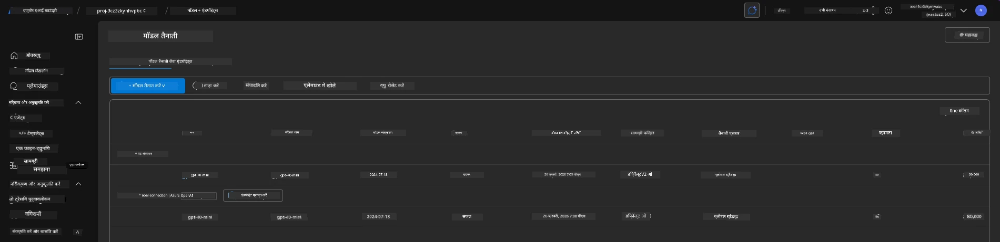
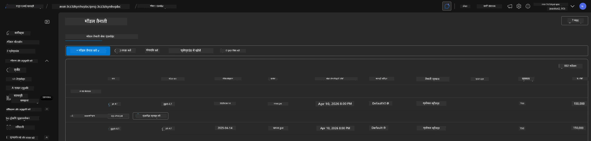

# 6. Teardown Infrastructure

!!! tip "इस मॉड्यूल के अंत तक आप सक्षम होंगे"

    - [ ] संसाधन क्लीनअप और लागत प्रबंधन के महत्व को समझें
    - [ ] `azd down` का उपयोग करके सुरक्षित रूप से इन्फ्रास्ट्रक्चर को डीप्रोविजन करें
    - [ ] आवश्यक होने पर सॉफ्ट-डिलीट हुए कॉग्निटिव सर्विसेज को पुनर्प्राप्त करें
    - [ ] **Lab 6:** Azure संसाधनों की सफाई और हटाने की पुष्टि

---

## बोनस अभ्यास

प्रोजेक्ट को हटाने से पहले, कुछ खुले-समाप्त अन्वेषण के लिए कुछ मिनट लें।

!!! info "इन अन्वेषण संकेतों को आज़माएँ"

    **GitHub Copilot के साथ प्रयोग करें:**
    
    1. Ask: `What other AZD templates could I try for multi-agent scenarios?`
    2. Ask: `How can I customize the agent instructions for a healthcare use case?`
    3. Ask: `What environment variables control cost optimization?`
    
    **Azure पोर्टल का अन्वेषण करें:**
    
    1. अपनी तैनाती के लिए Application Insights मेट्रिक्स की समीक्षा करें
    2. प्राविजन किए गए संसाधनों के लिए लागत विश्लेषण जाँचें
    3. Microsoft Foundry पोर्टल के एजेंट प्लेग्राउंड का एक बार फिर अन्वेषण करें

---

## Deprovision Infra

1. Tearing down infrastructure is as easy as:
      
      ```bash title="" linenums="0"
      azd down --purge
      ```
1. The `--purge` flag ensures that it also purges soft-deleted Cognitive Service resources, thereby releasing quota held by these resources. Once complete you will see something like this:
      
      ```bash title="" linenums="0"
      ? Total resources to delete: 11, are you sure you want to continue? Yes
      Deleting your resources can take some time.
      (✓) Done: Deleted resource group rg-nitya-mshack-azd
      (✓) Done: Purging Cognitive Account: aoai-3cz3zkynhvpbc

      SUCCESS: Your application was removed from Azure in 11 minutes 4 seconds.
      ```

1. (Optional) If you now run `azd up` again, you will notice the gpt-4.1 model gets deployed since the environment variable was changed (and saved) in the local `.azure` folder. 

      Here is the model deployments **before**:

      

      And here it is **after**:
      

---

<!-- CO-OP TRANSLATOR DISCLAIMER START -->
अस्वीकरण:
यह दस्तावेज़ AI अनुवाद सेवा Co-op Translator (https://github.com/Azure/co-op-translator) का उपयोग करके अनुवादित किया गया है। जबकि हम सटीकता के लिए प्रयास करते हैं, कृपया ध्यान दें कि स्वचालित अनुवादों में त्रुटियाँ या अशुद्धियाँ हो सकती हैं। मूल भाषा में उपलब्ध दस्तावेज़ को प्रमाणिक स्रोत माना जाना चाहिए। महत्वपूर्ण जानकारी के लिए पेशेवर मानव अनुवाद की सलाह दी जाती है। हम इस अनुवाद के उपयोग से उत्पन्न किसी भी गलतफहमी या गलत व्याख्या के लिए उत्तरदायी नहीं हैं।
<!-- CO-OP TRANSLATOR DISCLAIMER END -->