<!--
CO_OP_TRANSLATOR_METADATA:
{
  "original_hash": "e13ff6e1197e0a7462ed0aede7df9f23",
  "translation_date": "2025-11-19T16:50:11+00:00",
  "source_file": "docs/getting-started/authsecurity.md",
  "language_code": "hk"
}
-->
# 認證模式與託管身份

⏱️ **預計時間**：45-60 分鐘 | 💰 **成本影響**：免費（無額外收費） | ⭐ **複雜度**：中級

**📚 學習路徑：**
- ← 上一課：[配置管理](configuration.md) - 管理環境變數和機密
- 🎯 **你現在的位置**：認證與安全性（託管身份、Key Vault、安全模式）
- → 下一課：[第一個項目](first-project.md) - 建立你的第一個 AZD 應用程式
- 🏠 [課程首頁](../../README.md)

---

## 你將學到什麼

完成本課後，你將能夠：
- 理解 Azure 認證模式（密鑰、連接字串、託管身份）
- 實現 **託管身份** 以進行無密碼認證
- 通過 **Azure Key Vault** 整合來保護機密
- 配置 **基於角色的訪問控制 (RBAC)** 用於 AZD 部署
- 在容器應用程式和 Azure 服務中應用安全最佳實踐
- 從基於密鑰的認證遷移到基於身份的認證

## 為什麼託管身份很重要

### 問題：傳統認證

**在託管身份之前：**
```javascript
// ❌ 安全風險：在程式碼中硬編碼的秘密
const connectionString = "Server=mydb.database.windows.net;User=admin;Password=P@ssw0rd123";
const storageKey = "xK7mN9pQ2wR5tY8uI0oP3aS6dF1gH4jK...";
const cosmosKey = "C2x7B9n4M1p8Q5w3E6r0T2y5U8i1O4p7...";
```

**問題：**
- 🔴 **暴露的機密** 在代碼、配置文件、環境變數中
- 🔴 **憑證輪換** 需要更改代碼並重新部署
- 🔴 **審計噩夢** - 誰在什麼時候訪問了什麼？
- 🔴 **分散** - 機密分散在多個系統中
- 🔴 **合規風險** - 無法通過安全審核

### 解決方案：託管身份

**使用託管身份後：**
```javascript
// ✅ 安全：代碼中無秘密
const credential = new DefaultAzureCredential();
const client = new BlobServiceClient(
  "https://mystorageaccount.blob.core.windows.net",
  credential  // Azure 自動處理身份驗證
);
```

**好處：**
- ✅ **代碼或配置中無機密**
- ✅ **自動輪換** - Azure 自動處理
- ✅ **完整的審計記錄** 在 Azure AD 日誌中
- ✅ **集中化安全性** - 在 Azure Portal 中管理
- ✅ **合規準備** - 符合安全標準

**比喻**：傳統認證就像為不同的門攜帶多把實體鑰匙。託管身份就像擁有一張安全徽章，根據你的身份自動授予訪問權限——無需擔心丟失、複製或輪換鑰匙。

---

## 架構概覽

### 使用託管身份的認證流程

```mermaid
sequenceDiagram
    participant App as 您的應用程式<br/>(容器應用程式)
    participant MI as 託管身份<br/>(Azure AD)
    participant KV as 金鑰保管庫
    participant Storage as Azure 儲存體
    participant DB as Azure SQL
    
    App->>MI: 請求存取權杖<br/>(自動)
    MI->>MI: 驗證身份<br/>(無需密碼)
    MI-->>App: 返回權杖<br/>(有效 1 小時)
    
    App->>KV: 獲取秘密<br/>(使用權杖)
    KV->>KV: 檢查 RBAC 權限
    KV-->>App: 返回秘密值
    
    App->>Storage: 上傳 Blob<br/>(使用權杖)
    Storage->>Storage: 檢查 RBAC 權限
    Storage-->>App: 成功
    
    App->>DB: 查詢數據<br/>(使用權杖)
    DB->>DB: 檢查 SQL 權限
    DB-->>App: 返回結果
    
    Note over App,DB: 所有身份驗證均無需密碼！
```


### 託管身份的類型

```mermaid
graph TB
    MI[受管理的身份]
    SystemAssigned[系統指派的身份]
    UserAssigned[用戶指派的身份]
    
    MI --> SystemAssigned
    MI --> UserAssigned
    
    SystemAssigned --> SA1[生命週期與資源綁定]
    SystemAssigned --> SA2[自動建立/刪除]
    SystemAssigned --> SA3[最適合單一資源]
    
    UserAssigned --> UA1[獨立的生命週期]
    UserAssigned --> UA2[手動建立/刪除]
    UserAssigned --> UA3[可於多個資源間共享]
    
    style SystemAssigned fill:#2196F3,stroke:#1976D2,stroke-width:2px,color:#fff
    style UserAssigned fill:#4CAF50,stroke:#388E3C,stroke-width:2px,color:#fff
```


| 功能 | 系統分配 | 使用者分配 |
|------|----------|------------|
| **生命週期** | 與資源綁定 | 獨立 |
| **創建** | 隨資源自動創建 | 手動創建 |
| **刪除** | 隨資源刪除 | 資源刪除後仍存在 |
| **共享** | 僅限一個資源 | 多個資源共享 |
| **使用場景** | 簡單場景 | 複雜多資源場景 |
| **AZD 默認** | ✅ 推薦 | 可選 |

---

## 先決條件

### 必需工具

你應該已經從之前的課程中安裝了以下工具：

```bash
# 驗證 Azure Developer CLI
azd version
# ✅ 預期：azd 版本 1.0.0 或更高

# 驗證 Azure CLI
az --version
# ✅ 預期：azure-cli 2.50.0 或更高
```

### Azure 要求

- 活躍的 Azure 訂閱
- 權限包括：
  - 創建託管身份
  - 分配 RBAC 角色
  - 創建 Key Vault 資源
  - 部署容器應用程式

### 知識要求

你應該已完成：
- [安裝指南](installation.md) - AZD 設置
- [AZD 基礎](azd-basics.md) - 核心概念
- [配置管理](configuration.md) - 環境變數

---

## 課程 1：理解認證模式

### 模式 1：連接字串（舊版 - 避免使用）

**運作方式：**
```bash
# 連接字串包含憑證
STORAGE_CONNECTION_STRING="DefaultEndpointsProtocol=https;AccountName=myaccount;AccountKey=xK7mN9pQ2wR5..."
COSMOS_CONNECTION_STRING="AccountEndpoint=https://myaccount.documents.azure.com:443/;AccountKey=C2x7..."
SQL_CONNECTION_STRING="Server=myserver.database.windows.net;User=admin;Password=P@ssw0rd..."
```

**問題：**
- ❌ 機密暴露在環境變數中
- ❌ 部署系統中被記錄
- ❌ 難以輪換
- ❌ 無法追蹤訪問記錄

**使用時機：** 僅限於本地開發，絕不適用於生產環境。

---

### 模式 2：Key Vault 引用（較佳）

**運作方式：**
```bicep
// Store secret in Key Vault
resource keyVault 'Microsoft.KeyVault/vaults@2023-02-01' = {
  name: 'mykv'
  properties: {
    enableRbacAuthorization: true
  }
}

// Reference in Container App
env: [
  {
    name: 'STORAGE_KEY'
    secretRef: 'storage-key'  // References Key Vault
  }
]
```

**好處：**
- ✅ 機密安全存儲於 Key Vault
- ✅ 集中化的機密管理
- ✅ 無需更改代碼即可輪換

**限制：**
- ⚠️ 仍然使用密鑰/密碼
- ⚠️ 需要管理 Key Vault 訪問權限

**使用時機：** 從連接字串過渡到託管身份的中間步驟。

---

### 模式 3：託管身份（最佳實踐）

**運作方式：**
```bicep
// Enable managed identity
resource containerApp 'Microsoft.App/containerApps@2023-05-01' = {
  name: 'myapp'
  identity: {
    type: 'SystemAssigned'  // Automatically creates identity
  }
}

// Grant permissions
resource roleAssignment 'Microsoft.Authorization/roleAssignments@2022-04-01' = {
  scope: storageAccount
  properties: {
    roleDefinitionId: storageBlobDataContributorRole
    principalId: containerApp.identity.principalId
  }
}
```

**應用程式代碼：**
```javascript
// 不需要秘密！
const { DefaultAzureCredential } = require('@azure/identity');
const { BlobServiceClient } = require('@azure/storage-blob');

const credential = new DefaultAzureCredential();
const blobServiceClient = new BlobServiceClient(
  'https://mystorageaccount.blob.core.windows.net',
  credential
);
```

**好處：**
- ✅ 代碼/配置中無機密
- ✅ 自動憑證輪換
- ✅ 完整的審計記錄
- ✅ 基於 RBAC 的權限
- ✅ 符合合規要求

**使用時機：** 始終用於生產應用程式。

---

## 課程 2：使用 AZD 實現託管身份

### 分步實現

讓我們構建一個安全的容器應用程式，使用託管身份訪問 Azure Storage 和 Key Vault。

### 項目結構

```
secure-app/
├── azure.yaml                 # AZD configuration
├── infra/
│   ├── main.bicep            # Main infrastructure
│   ├── core/
│   │   ├── identity.bicep    # Managed identity setup
│   │   ├── keyvault.bicep    # Key Vault configuration
│   │   └── storage.bicep     # Storage with RBAC
│   └── app/
│       └── container-app.bicep
└── src/
    ├── app.js                # Application code
    ├── package.json
    └── Dockerfile
```

### 1. 配置 AZD (azure.yaml)

```yaml
name: secure-app
metadata:
  template: secure-app@1.0.0

services:
  api:
    project: ./src
    language: js
    host: containerapp

# Enable managed identity (AZD handles this automatically)
```

### 2. 基礎設施：啟用託管身份

**文件：`infra/main.bicep`**

```bicep
targetScope = 'subscription'

param environmentName string
param location string = 'eastus'

var tags = { 'azd-env-name': environmentName }

// Resource group
resource rg 'Microsoft.Resources/resourceGroups@2021-04-01' = {
  name: 'rg-${environmentName}'
  location: location
  tags: tags
}

// Storage Account
module storage './core/storage.bicep' = {
  name: 'storage'
  scope: rg
  params: {
    name: 'st${uniqueString(rg.id)}'
    location: location
    tags: tags
  }
}

// Key Vault
module keyVault './core/keyvault.bicep' = {
  name: 'keyvault'
  scope: rg
  params: {
    name: 'kv-${uniqueString(rg.id)}'
    location: location
    tags: tags
  }
}

// Container App with Managed Identity
module containerApp './app/container-app.bicep' = {
  name: 'container-app'
  scope: rg
  params: {
    name: 'ca-${environmentName}'
    location: location
    tags: tags
    storageAccountName: storage.outputs.name
    keyVaultName: keyVault.outputs.name
  }
}

// Grant Container App access to Storage
module storageRoleAssignment './core/role-assignment.bicep' = {
  name: 'storage-role'
  scope: rg
  params: {
    principalId: containerApp.outputs.identityPrincipalId
    roleDefinitionId: 'ba92f5b4-2d11-453d-a403-e96b0029c9fe'  // Storage Blob Data Contributor
    targetResourceId: storage.outputs.id
  }
}

// Grant Container App access to Key Vault
module kvRoleAssignment './core/role-assignment.bicep' = {
  name: 'kv-role'
  scope: rg
  params: {
    principalId: containerApp.outputs.identityPrincipalId
    roleDefinitionId: '4633458b-17de-408a-b874-0445c86b69e6'  // Key Vault Secrets User
    targetResourceId: keyVault.outputs.id
  }
}

// Outputs
output AZURE_STORAGE_ACCOUNT_NAME string = storage.outputs.name
output AZURE_KEY_VAULT_NAME string = keyVault.outputs.name
output APP_URL string = containerApp.outputs.url
```

### 3. 使用系統分配身份的容器應用程式

**文件：`infra/app/container-app.bicep`**

```bicep
param name string
param location string
param tags object = {}
param storageAccountName string
param keyVaultName string

resource containerApp 'Microsoft.App/containerApps@2023-05-01' = {
  name: name
  location: location
  tags: tags
  identity: {
    type: 'SystemAssigned'  // 🔑 Enable managed identity
  }
  properties: {
    configuration: {
      ingress: {
        external: true
        targetPort: 3000
      }
    }
    template: {
      containers: [
        {
          name: 'api'
          image: 'myregistry.azurecr.io/api:latest'
          resources: {
            cpu: json('0.5')
            memory: '1Gi'
          }
          env: [
            {
              name: 'AZURE_STORAGE_ACCOUNT_NAME'
              value: storageAccountName
            }
            {
              name: 'AZURE_KEY_VAULT_NAME'
              value: keyVaultName
            }
            // 🔑 No secrets - managed identity handles authentication!
          ]
        }
      ]
    }
  }
}

// Output the identity for RBAC assignments
output identityPrincipalId string = containerApp.identity.principalId
output id string = containerApp.id
output url string = 'https://${containerApp.properties.configuration.ingress.fqdn}'
```

### 4. RBAC 角色分配模組

**文件：`infra/core/role-assignment.bicep`**

```bicep
param principalId string
param roleDefinitionId string  // Azure built-in role ID
param targetResourceId string

resource roleAssignment 'Microsoft.Authorization/roleAssignments@2022-04-01' = {
  name: guid(principalId, roleDefinitionId, targetResourceId)
  scope: resourceId('Microsoft.Resources/resourceGroups', resourceGroup().name)
  properties: {
    roleDefinitionId: subscriptionResourceId('Microsoft.Authorization/roleDefinitions', roleDefinitionId)
    principalId: principalId
    principalType: 'ServicePrincipal'
  }
}

output id string = roleAssignment.id
```

### 5. 使用託管身份的應用程式代碼

**文件：`src/app.js`**

```javascript
const express = require('express');
const { DefaultAzureCredential } = require('@azure/identity');
const { BlobServiceClient } = require('@azure/storage-blob');
const { SecretClient } = require('@azure/keyvault-secrets');

const app = express();
const PORT = process.env.PORT || 3000;

// 🔑 初始化憑證（自動與受管理的身份識別配合運作）
const credential = new DefaultAzureCredential();

// Azure Storage 設定
const storageAccountName = process.env.AZURE_STORAGE_ACCOUNT_NAME;
const blobServiceClient = new BlobServiceClient(
  `https://${storageAccountName}.blob.core.windows.net`,
  credential  // 不需要密鑰！
);

// Key Vault 設定
const keyVaultName = process.env.AZURE_KEY_VAULT_NAME;
const secretClient = new SecretClient(
  `https://${keyVaultName}.vault.azure.net`,
  credential  // 不需要密鑰！
);

// 健康檢查
app.get('/health', (req, res) => {
  res.json({ status: 'healthy', authentication: 'managed-identity' });
});

// 上載檔案到 blob storage
app.post('/upload', async (req, res) => {
  try {
    const containerClient = blobServiceClient.getContainerClient('uploads');
    await containerClient.createIfNotExists();
    
    const blobName = `file-${Date.now()}.txt`;
    const blockBlobClient = containerClient.getBlockBlobClient(blobName);
    
    await blockBlobClient.upload('Hello from managed identity!', 30);
    
    res.json({
      success: true,
      blobName: blobName,
      message: 'File uploaded using managed identity!'
    });
  } catch (error) {
    console.error('Upload error:', error);
    res.status(500).json({ error: error.message });
  }
});

// 從 Key Vault 獲取秘密
app.get('/secret/:name', async (req, res) => {
  try {
    const secretName = req.params.name;
    const secret = await secretClient.getSecret(secretName);
    
    res.json({
      name: secretName,
      value: secret.value,
      message: 'Secret retrieved using managed identity!'
    });
  } catch (error) {
    console.error('Secret error:', error);
    res.status(500).json({ error: error.message });
  }
});

// 列出 blob 容器（展示讀取權限）
app.get('/containers', async (req, res) => {
  try {
    const containers = [];
    for await (const container of blobServiceClient.listContainers()) {
      containers.push(container.name);
    }
    
    res.json({
      containers: containers,
      count: containers.length,
      message: 'Containers listed using managed identity!'
    });
  } catch (error) {
    console.error('List error:', error);
    res.status(500).json({ error: error.message });
  }
});

app.listen(PORT, () => {
  console.log(`Secure API listening on port ${PORT}`);
  console.log('Authentication: Managed Identity (passwordless)');
});
```

**文件：`src/package.json`**

```json
{
  "name": "secure-app",
  "version": "1.0.0",
  "dependencies": {
    "express": "^4.18.2",
    "@azure/identity": "^4.0.0",
    "@azure/storage-blob": "^12.17.0",
    "@azure/keyvault-secrets": "^4.7.0"
  },
  "scripts": {
    "start": "node app.js"
  }
}
```

### 6. 部署與測試

```bash
# 初始化 AZD 環境
azd init

# 部署基礎設施和應用程式
azd up

# 獲取應用程式 URL
APP_URL=$(azd env get-values | grep APP_URL | cut -d '=' -f2 | tr -d '"')

# 測試健康檢查
curl $APP_URL/health
```

**✅ 預期輸出：**
```json
{
  "status": "healthy",
  "authentication": "managed-identity"
}
```

**測試 blob 上傳：**
```bash
curl -X POST $APP_URL/upload
```

**✅ 預期輸出：**
```json
{
  "success": true,
  "blobName": "file-1700404800000.txt",
  "message": "File uploaded using managed identity!"
}
```

**測試容器列出：**
```bash
curl $APP_URL/containers
```

**✅ 預期輸出：**
```json
{
  "containers": ["uploads"],
  "count": 1,
  "message": "Containers listed using managed identity!"
}
```

---

## 常見 Azure RBAC 角色

### 託管身份的內建角色 ID

| 服務 | 角色名稱 | 角色 ID | 權限 |
|------|----------|---------|------|
| **Storage** | Storage Blob Data Reader | `2a2b9908-6b94-4a3d-8e5a-a7d8f8cc8a12` | 讀取 blob 和容器 |
| **Storage** | Storage Blob Data Contributor | `ba92f5b4-2d11-453d-a403-e96b0029c9fe` | 讀取、寫入、刪除 blob |
| **Storage** | Storage Queue Data Contributor | `974c5e8b-45b9-4653-ba55-5f855dd0fb88` | 讀取、寫入、刪除隊列消息 |
| **Key Vault** | Key Vault Secrets User | `4633458b-17de-408a-b874-0445c86b69e6` | 讀取機密 |
| **Key Vault** | Key Vault Secrets Officer | `b86a8fe4-44ce-4948-aee5-eccb2c155cd7` | 讀取、寫入、刪除機密 |
| **Cosmos DB** | Cosmos DB Built-in Data Reader | `00000000-0000-0000-0000-000000000001` | 讀取 Cosmos DB 數據 |
| **Cosmos DB** | Cosmos DB Built-in Data Contributor | `00000000-0000-0000-0000-000000000002` | 讀取、寫入 Cosmos DB 數據 |
| **SQL Database** | SQL DB Contributor | `9b7fa17d-e63e-47b0-bb0a-15c516ac86ec` | 管理 SQL 數據庫 |
| **Service Bus** | Azure Service Bus Data Owner | `090c5cfd-751d-490a-894a-3ce6f1109419` | 發送、接收、管理消息 |

### 如何查找角色 ID

```bash
# 列出所有內置角色
az role definition list --query "[].{Name:roleName, ID:name}" --output table

# 搜尋特定角色
az role definition list --query "[?contains(roleName, 'Storage Blob')].{Name:roleName, ID:name}" --output table

# 獲取角色詳情
az role definition list --name "Storage Blob Data Contributor"
```

---

## 實踐練習

### 練習 1：為現有應用啟用託管身份 ⭐⭐（中等）

**目標**：為現有的容器應用部署添加託管身份

**場景**：你有一個使用連接字串的容器應用，將其轉換為託管身份。

**起點**：容器應用的配置如下：

```bicep
// ❌ Current: Using connection string
env: [
  {
    name: 'STORAGE_CONNECTION_STRING'
    secretRef: 'storage-connection'
  }
]
```

**步驟**：

1. **在 Bicep 中啟用託管身份：**

```bicep
resource containerApp 'Microsoft.App/containerApps@2023-05-01' = {
  name: 'myapp'
  identity: {
    type: 'SystemAssigned'  // Add this
  }
  // ... rest of configuration
}
```

2. **授予 Storage 訪問權限：**

```bicep
// Get storage account reference
resource storageAccount 'Microsoft.Storage/storageAccounts@2023-01-01' existing = {
  name: storageAccountName
}

// Assign role
resource roleAssignment 'Microsoft.Authorization/roleAssignments@2022-04-01' = {
  name: guid(containerApp.id, 'ba92f5b4-2d11-453d-a403-e96b0029c9fe', storageAccount.id)
  scope: storageAccount
  properties: {
    roleDefinitionId: subscriptionResourceId('Microsoft.Authorization/roleDefinitions', 'ba92f5b4-2d11-453d-a403-e96b0029c9fe')
    principalId: containerApp.identity.principalId
    principalType: 'ServicePrincipal'
  }
}
```

3. **更新應用程式代碼：**

**之前（連接字串）：**
```javascript
const { BlobServiceClient } = require('@azure/storage-blob');

const blobServiceClient = BlobServiceClient.fromConnectionString(
  process.env.STORAGE_CONNECTION_STRING
);
```

**之後（託管身份）：**
```javascript
const { DefaultAzureCredential } = require('@azure/identity');
const { BlobServiceClient } = require('@azure/storage-blob');

const credential = new DefaultAzureCredential();
const blobServiceClient = new BlobServiceClient(
  `https://${process.env.STORAGE_ACCOUNT_NAME}.blob.core.windows.net`,
  credential
);
```

4. **更新環境變數：**

```bicep
env: [
  {
    name: 'STORAGE_ACCOUNT_NAME'
    value: storageAccountName  // Just the name, no secrets!
  }
  // Remove STORAGE_CONNECTION_STRING
]
```

5. **部署與測試：**

```bash
# 重新部署
azd up

# 測試它是否仍然有效
curl https://myapp.azurecontainerapps.io/upload
```

**✅ 成功標準：**
- ✅ 應用程式部署無錯誤
- ✅ Storage 操作正常（上傳、列出、下載）
- ✅ 環境變數中無連接字串
- ✅ Azure Portal 中的 "Identity" 頁面可見身份

**驗證：**

```bash
# 檢查是否啟用受管理的身份
az containerapp show \
  --name myapp \
  --resource-group rg-myapp \
  --query "identity.type"
# ✅ 預期: "SystemAssigned"

# 檢查角色分配
az role assignment list \
  --assignee $(az containerapp show --name myapp --resource-group rg-myapp --query "identity.principalId" -o tsv) \
  --scope /subscriptions/{sub-id}/resourceGroups/rg-myapp/providers/Microsoft.Storage/storageAccounts/mystorageaccount
# ✅ 預期: 顯示 "Storage Blob Data Contributor" 角色
```

**時間**：20-30 分鐘

---

### 練習 2：使用使用者分配身份進行多服務訪問 ⭐⭐⭐（進階）

**目標**：創建一個使用者分配身份，供多個容器應用共享

**場景**：你有 3 個微服務，都需要訪問相同的 Storage 帳戶和 Key Vault。

**步驟**：

1. **創建使用者分配身份：**

**文件：`infra/core/identity.bicep`**

```bicep
param name string
param location string
param tags object = {}

resource userAssignedIdentity 'Microsoft.ManagedIdentity/userAssignedIdentities@2023-01-31' = {
  name: name
  location: location
  tags: tags
}

output id string = userAssignedIdentity.id
output principalId string = userAssignedIdentity.properties.principalId
output clientId string = userAssignedIdentity.properties.clientId
```

2. **為使用者分配身份分配角色：**

```bicep
// In main.bicep
module userIdentity './core/identity.bicep' = {
  name: 'user-identity'
  scope: rg
  params: {
    name: 'id-${environmentName}'
    location: location
    tags: tags
  }
}

// Grant Storage access
resource storageRoleAssignment 'Microsoft.Authorization/roleAssignments@2022-04-01' = {
  name: guid(userIdentity.outputs.principalId, 'storage-contributor')
  scope: storageAccount
  properties: {
    roleDefinitionId: subscriptionResourceId('Microsoft.Authorization/roleDefinitions', 'ba92f5b4-2d11-453d-a403-e96b0029c9fe')
    principalId: userIdentity.outputs.principalId
    principalType: 'ServicePrincipal'
  }
}

// Grant Key Vault access
resource kvRoleAssignment 'Microsoft.Authorization/roleAssignments@2022-04-01' = {
  name: guid(userIdentity.outputs.principalId, 'kv-secrets-user')
  scope: keyVault
  properties: {
    roleDefinitionId: subscriptionResourceId('Microsoft.Authorization/roleDefinitions', '4633458b-17de-408a-b874-0445c86b69e6')
    principalId: userIdentity.outputs.principalId
    principalType: 'ServicePrincipal'
  }
}
```

3. **將身份分配給多個容器應用：**

```bicep
resource apiGateway 'Microsoft.App/containerApps@2023-05-01' = {
  name: 'api-gateway'
  identity: {
    type: 'UserAssigned'
    userAssignedIdentities: {
      '${userIdentity.outputs.id}': {}
    }
  }
  // ... rest of config
}

resource productService 'Microsoft.App/containerApps@2023-05-01' = {
  name: 'product-service'
  identity: {
    type: 'UserAssigned'
    userAssignedIdentities: {
      '${userIdentity.outputs.id}': {}
    }
  }
  // ... rest of config
}

resource orderService 'Microsoft.App/containerApps@2023-05-01' = {
  name: 'order-service'
  identity: {
    type: 'UserAssigned'
    userAssignedIdentities: {
      '${userIdentity.outputs.id}': {}
    }
  }
  // ... rest of config
}
```

4. **應用程式代碼（所有服務使用相同模式）：**

```javascript
const { DefaultAzureCredential, ManagedIdentityCredential } = require('@azure/identity');

// 對於用戶分配的身份，指定客戶端 ID
const credential = new ManagedIdentityCredential(
  process.env.AZURE_CLIENT_ID  // 用戶分配的身份客戶端 ID
);

// 或使用 DefaultAzureCredential（自動檢測）
const credential = new DefaultAzureCredential();

const blobServiceClient = new BlobServiceClient(
  `https://${process.env.STORAGE_ACCOUNT_NAME}.blob.core.windows.net`,
  credential
);
```

5. **部署與驗證：**

```bash
azd up

# 測試所有服務是否能存取儲存空間
curl https://api-gateway.azurecontainerapps.io/upload
curl https://product-service.azurecontainerapps.io/upload
curl https://order-service.azurecontainerapps.io/upload
```

**✅ 成功標準：**
- ✅ 一個身份被 3 個服務共享
- ✅ 所有服務都能訪問 Storage 和 Key Vault
- ✅ 如果刪除一個服務，身份仍然存在
- ✅ 集中化的權限管理

**使用者分配身份的好處：**
- 單一身份管理
- 跨服務一致的權限
- 即使刪除服務，身份仍然存在
- 適用於複雜架構

**時間**：30-40 分鐘

---

### 練習 3：實現 Key Vault 機密輪換 ⭐⭐⭐（進階）

**目標**：將第三方 API 密鑰存儲在 Key Vault 中，並使用託管身份訪問它們

**場景**：你的應用需要調用需要 API 密鑰的外部 API（如 OpenAI、Stripe、SendGrid）。

**步驟**：

1. **創建帶有 RBAC 的 Key Vault：**

**文件：`infra/core/keyvault.bicep`**

```bicep
param name string
param location string
param tags object = {}

resource keyVault 'Microsoft.KeyVault/vaults@2023-02-01' = {
  name: name
  location: location
  tags: tags
  properties: {
    enableRbacAuthorization: true  // Use RBAC instead of access policies
    sku: {
      family: 'A'
      name: 'standard'
    }
    tenantId: subscription().tenantId
    enableSoftDelete: true
    softDeleteRetentionInDays: 90
  }
}

// Allow Container App to read secrets
output id string = keyVault.id
output name string = keyVault.name
output uri string = keyVault.properties.vaultUri
```

2. **將機密存儲在 Key Vault 中：**

```bash
# 獲取金鑰保管庫名稱
KV_NAME=$(azd env get-values | grep AZURE_KEY_VAULT_NAME | cut -d '=' -f2 | tr -d '"')

# 存儲第三方 API 密鑰
az keyvault secret set \
  --vault-name $KV_NAME \
  --name "OpenAI-ApiKey" \
  --value "sk-proj-xxxxxxxxxxxxx"

az keyvault secret set \
  --vault-name $KV_NAME \
  --name "Stripe-ApiKey" \
  --value "sk_live_xxxxxxxxxxxxx"

az keyvault secret set \
  --vault-name $KV_NAME \
  --name "SendGrid-ApiKey" \
  --value "SG.xxxxxxxxxxxxx"
```

3. **應用程式代碼檢索機密：**

**文件：`src/config.js`**

```javascript
const { DefaultAzureCredential } = require('@azure/identity');
const { SecretClient } = require('@azure/keyvault-secrets');

class Config {
  constructor() {
    this.credential = new DefaultAzureCredential();
    this.secretClient = new SecretClient(
      `https://${process.env.AZURE_KEY_VAULT_NAME}.vault.azure.net`,
      this.credential
    );
    this.cache = {};
  }

  async getSecret(secretName) {
    // 首先檢查快取
    if (this.cache[secretName]) {
      return this.cache[secretName];
    }

    try {
      const secret = await this.secretClient.getSecret(secretName);
      this.cache[secretName] = secret.value;
      console.log(`✅ Retrieved secret: ${secretName}`);
      return secret.value;
    } catch (error) {
      console.error(`❌ Failed to get secret ${secretName}:`, error.message);
      throw error;
    }
  }

  async getOpenAIKey() {
    return this.getSecret('OpenAI-ApiKey');
  }

  async getStripeKey() {
    return this.getSecret('Stripe-ApiKey');
  }

  async getSendGridKey() {
    return this.getSecret('SendGrid-ApiKey');
  }
}

module.exports = new Config();
```

4. **在應用程式中使用機密：**

**文件：`src/app.js`**

```javascript
const express = require('express');
const config = require('./config');
const { OpenAI } = require('openai');

const app = express();

// 使用來自密鑰庫的密鑰初始化 OpenAI
let openaiClient;

async function initializeServices() {
  const openaiKey = await config.getOpenAIKey();
  openaiClient = new OpenAI({ apiKey: openaiKey });
  console.log('✅ Services initialized with secrets from Key Vault');
}

// 啟動時調用
initializeServices().catch(console.error);

app.post('/chat', async (req, res) => {
  try {
    const completion = await openaiClient.chat.completions.create({
      model: 'gpt-4',
      messages: [{ role: 'user', content: 'Hello!' }]
    });
    
    res.json({
      response: completion.choices[0].message.content,
      authentication: 'Key from Key Vault via Managed Identity'
    });
  } catch (error) {
    res.status(500).json({ error: error.message });
  }
});

app.listen(3000, () => {
  console.log('Secure API with Key Vault integration running');
});
```

5. **部署與測試：**

```bash
azd up

# 測試 API 密鑰是否有效
curl -X POST https://myapp.azurecontainerapps.io/chat \
  -H "Content-Type: application/json" \
  -d '{"message":"Hello AI"}'
```

**✅ 成功標準：**
- ✅ 代碼或環境變數中無 API 密鑰
- ✅ 應用程式從 Key Vault 檢索密鑰
- ✅ 第三方 API 正常工作
- ✅ 可以在不更改代碼的情況下輪換密鑰

**輪換機密：**

```bash
# 在密鑰庫中更新密鑰
az keyvault secret set \
  --vault-name $KV_NAME \
  --name "OpenAI-ApiKey" \
  --value "sk-proj-NEW_KEY_HERE"

# 重啟應用程式以載入新密鑰
az containerapp revision restart \
  --name myapp \
  --resource-group rg-myapp
```

**時間**：25-35 分鐘

---

## 知識檢查點

### 1. 認證模式 ✓

測試你的理解：

- [ ] **Q1**：三種主要的認證模式是什麼？
  - **A**：連接字串（舊版）、Key Vault 引用（過渡）、託管身份（最佳）

- [ ] **Q2**：為什麼託管身份比連接字串更好？
  - **A**：代碼中無機密、自動輪換、完整審計記錄、RBAC 權限

- [ ] **Q3**：什麼時候應該使用使用者分配身份而不是系統分配身份？
  - **A**：當需要在多個資源之間共享身份或身份生命週期獨立於資源時

**實踐驗證：**
```bash
# 檢查您的應用程式使用哪種類型的身份
az containerapp show \
  --name myapp \
  --resource-group rg-myapp \
  --query "identity.type"

# 列出身份的所有角色分配
az role assignment list \
  --assignee $(az containerapp show --name myapp --resource-group rg-myapp --query "identity.principalId" -o tsv)
```

---

### 2. RBAC 和權限 ✓

測試你的理解：

- [ ] **Q1**："Storage Blob Data Contributor" 的角色 ID 是什麼？
  - **A**：`ba92f5b4-2d11-453d-a403-e96b0029c9fe`

- [ ] **Q2**："Key Vault Secrets User" 提供什麼權限？
  - **A**：僅讀取機密（無法創建、更新或刪除）

- [ ] **Q3**：如何授予容器應用訪問 Azure SQL 的權限？
  - **A**：分配 "SQL DB Contributor" 角色或配置 Azure AD 認證用於 SQL

**實踐驗證：**
```bash
# 尋找特定角色
az role definition list --name "Storage Blob Data Contributor"

# 檢查分配到您身份的角色
PRINCIPAL_ID=$(az containerapp show --name myapp --resource-group rg-myapp --query "identity.principalId" -o tsv)
az role assignment list --assignee $PRINCIPAL_ID --output table
```

---

### 3. Key Vault 整合 ✓

測試你的理解：
- [ ] **Q1**: 如何啟用 Key Vault 的 RBAC，而不是使用存取政策？
  - **A**: 在 Bicep 中設置 `enableRbacAuthorization: true`

- [ ] **Q2**: 哪個 Azure SDK 庫處理受管理的身份驗證？
  - **A**: 使用 `@azure/identity` 和 `DefaultAzureCredential` 類別

- [ ] **Q3**: Key Vault 的秘密在快取中保存多久？
  - **A**: 取決於應用程式；需自行實現快取策略

**實作驗證：**
```bash
# 測試金鑰保管庫訪問
az keyvault secret show \
  --vault-name $KV_NAME \
  --name "OpenAI-ApiKey" \
  --query "value"

# 檢查是否啟用了 RBAC
az keyvault show \
  --name $KV_NAME \
  --query "properties.enableRbacAuthorization"
# ✅ 預期：true
```

---

## 安全最佳實踐

### ✅ 推薦做法：

1. **在生產環境中始終使用受管理的身份**
   ```bicep
   identity: {
     type: 'SystemAssigned'
   }
   ```

2. **使用最低權限的 RBAC 角色**
   - 儘量使用 "Reader" 角色
   - 除非必要，避免使用 "Owner" 或 "Contributor"

3. **將第三方密鑰存放在 Key Vault**
   ```javascript
   const apiKey = await secretClient.getSecret('ThirdPartyApiKey');
   ```

4. **啟用審計日誌**
   ```bicep
   diagnosticSettings: {
     logs: [{ category: 'AuditEvent', enabled: true }]
   }
   ```

5. **為開發/測試/生產環境使用不同的身份**
   ```bash
   azd env new dev
   azd env new staging
   azd env new prod
   ```

6. **定期輪替秘密**
   - 為 Key Vault 的秘密設置到期日期
   - 使用 Azure Functions 自動化輪替

### ❌ 禁止做法：

1. **絕對不要硬編碼秘密**
   ```javascript
   // ❌ 不好
   const apiKey = "sk-proj-xxxxxxxxxxxxx";
   ```

2. **不要在生產環境中使用連接字串**
   ```javascript
   // ❌ 不好
   BlobServiceClient.fromConnectionString(process.env.STORAGE_CONNECTION_STRING)
   ```

3. **不要授予過多的權限**
   ```bicep
   // ❌ BAD - too much access
   roleDefinitionId: 'Owner'
   
   // ✅ GOOD - least privilege
   roleDefinitionId: 'Storage Blob Data Reader'
   ```

4. **不要記錄秘密**
   ```javascript
   // ❌ 不好
   console.log('API Key:', apiKey);
   
   // ✅ 好
   console.log('API Key retrieved successfully');
   ```

5. **不要在不同環境間共享生產身份**
   ```bicep
   // ❌ BAD - same identity for dev and prod
   // ✅ GOOD - separate identities per environment
   ```

---

## 疑難排解指南

### 問題：存取 Azure Storage 時顯示 "Unauthorized"

**症狀：**
```
Error: Unauthorized (403)
AuthorizationPermissionMismatch: This request is not authorized to perform this operation
```

**診斷：**

```bash
# 檢查是否啟用了受管理的身份
az containerapp show \
  --name myapp \
  --resource-group rg-myapp \
  --query "identity.type"
# ✅ 預期: "SystemAssigned" 或 "UserAssigned"

# 檢查角色分配
PRINCIPAL_ID=$(az containerapp show --name myapp --resource-group rg-myapp --query "identity.principalId" -o tsv)
az role assignment list --assignee $PRINCIPAL_ID

# 預期: 應看到 "Storage Blob Data Contributor" 或類似角色
```

**解決方案：**

1. **授予正確的 RBAC 角色：**
```bash
STORAGE_ID=$(az storage account show --name mystorageaccount --resource-group rg-myapp --query "id" -o tsv)
az role assignment create \
  --assignee $PRINCIPAL_ID \
  --role "Storage Blob Data Contributor" \
  --scope $STORAGE_ID
```

2. **等待權限傳播（可能需要 5-10 分鐘）：**
```bash
# 檢查角色分配狀態
az role assignment list --assignee $PRINCIPAL_ID --scope $STORAGE_ID
```

3. **確認應用程式代碼使用正確的憑證：**
```javascript
// 確保你正在使用 DefaultAzureCredential
const credential = new DefaultAzureCredential();
```

---

### 問題：Key Vault 存取被拒絕

**症狀：**
```
Error: Forbidden (403)
The user, group or application does not have secrets get permission
```

**診斷：**

```bash
# 檢查 Key Vault RBAC 是否已啟用
az keyvault show \
  --name $KV_NAME \
  --query "properties.enableRbacAuthorization"
# ✅ 預期：true

# 檢查角色分配
az role assignment list \
  --assignee $PRINCIPAL_ID \
  --scope /subscriptions/{sub-id}/resourceGroups/rg-myapp/providers/Microsoft.KeyVault/vaults/$KV_NAME
```

**解決方案：**

1. **啟用 Key Vault 的 RBAC：**
```bash
az keyvault update \
  --name $KV_NAME \
  --enable-rbac-authorization true
```

2. **授予 Key Vault Secrets User 角色：**
```bash
KV_ID=$(az keyvault show --name $KV_NAME --query "id" -o tsv)
az role assignment create \
  --assignee $PRINCIPAL_ID \
  --role "Key Vault Secrets User" \
  --scope $KV_ID
```

---

### 問題：DefaultAzureCredential 在本地失敗

**症狀：**
```
Error: DefaultAzureCredential failed to retrieve a token
CredentialUnavailableError: No credential available
```

**診斷：**

```bash
# 檢查是否已登入
az account show

# 檢查 Azure CLI 認證
az ad signed-in-user show
```

**解決方案：**

1. **登入 Azure CLI：**
```bash
az login
```

2. **設置 Azure 訂閱：**
```bash
az account set --subscription "Your Subscription Name"
```

3. **在本地開發中使用環境變數：**
```bash
export AZURE_TENANT_ID="your-tenant-id"
export AZURE_CLIENT_ID="your-client-id"
export AZURE_CLIENT_SECRET="your-client-secret"
```

4. **或在本地使用不同的憑證：**
```javascript
const { DefaultAzureCredential, AzureCliCredential } = require('@azure/identity');

// 使用 AzureCliCredential 作本地開發
const credential = process.env.NODE_ENV === 'production' 
  ? new DefaultAzureCredential()
  : new AzureCliCredential();
```

---

### 問題：角色分配傳播時間過長

**症狀：**
- 角色分配成功
- 仍然出現 403 錯誤
- 存取間歇性（有時有效，有時無效）

**解釋：**
Azure RBAC 的更改可能需要 5-10 分鐘才能在全球範圍內傳播。

**解決方案：**

```bash
# 等候並重試
echo "Waiting for RBAC propagation..."
sleep 300  # 等候五分鐘

# 測試存取
curl https://myapp.azurecontainerapps.io/upload

# 如果仍然失敗，重新啟動應用程式
az containerapp revision restart \
  --name myapp \
  --resource-group rg-myapp
```

---

## 成本考量

### 受管理身份的成本

| 資源 | 成本 |
|------|------|
| **受管理身份** | 🆓 **免費** - 無需收費 |
| **RBAC 角色分配** | 🆓 **免費** - 無需收費 |
| **Azure AD Token 請求** | 🆓 **免費** - 包含在內 |
| **Key Vault 操作** | 每 10,000 次操作 $0.03 |
| **Key Vault 存儲** | 每月每個秘密 $0.024 |

**受管理身份節省成本的方式：**
- ✅ 消除服務間身份驗證的 Key Vault 操作
- ✅ 減少安全事件（無洩漏憑證）
- ✅ 降低運營負擔（無需手動輪替）

**每月成本比較範例：**

| 情境 | 連接字串 | 受管理身份 | 節省 |
|------|----------|------------|------|
| 小型應用程式（1M 請求） | ~$50 (Key Vault + 操作) | ~$0 | $50/月 |
| 中型應用程式（10M 請求） | ~$200 | ~$0 | $200/月 |
| 大型應用程式（100M 請求） | ~$1,500 | ~$0 | $1,500/月 |

---

## 了解更多

### 官方文件
- [Azure 受管理身份](https://learn.microsoft.com/entra/identity/managed-identities-azure-resources/overview)
- [Azure RBAC](https://learn.microsoft.com/azure/role-based-access-control/overview)
- [Azure Key Vault](https://learn.microsoft.com/azure/key-vault/general/overview)
- [DefaultAzureCredential](https://learn.microsoft.com/dotnet/api/azure.identity.defaultazurecredential)

### SDK 文件
- [@azure/identity (Node.js)](https://www.npmjs.com/package/@azure/identity)
- [Azure.Identity (C#)](https://www.nuget.org/packages/Azure.Identity/)
- [azure-identity (Python)](https://pypi.org/project/azure-identity/)

### 本課程的下一步
- ← 上一章：[配置管理](configuration.md)
- → 下一章：[第一個專案](first-project.md)
- 🏠 [課程首頁](../../README.md)

### 相關範例
- [Azure OpenAI 聊天範例](../../../../examples/azure-openai-chat) - 使用受管理身份進行 Azure OpenAI
- [微服務範例](../../../../examples/microservices) - 多服務身份驗證模式

---

## 總結

**你已學到：**
- ✅ 三種身份驗證模式（連接字串、Key Vault、受管理身份）
- ✅ 如何在 AZD 中啟用和配置受管理身份
- ✅ Azure 服務的 RBAC 角色分配
- ✅ Key Vault 與第三方秘密的整合
- ✅ 使用者分配與系統分配身份的區別
- ✅ 安全最佳實踐與疑難排解

**重點回顧：**
1. **在生產環境中始終使用受管理身份** - 無秘密，自動輪替
2. **使用最低權限的 RBAC 角色** - 僅授予必要的權限
3. **將第三方密鑰存放在 Key Vault** - 集中管理秘密
4. **為每個環境分配不同的身份** - 隔離開發、測試、和生產環境
5. **啟用審計日誌** - 追蹤誰存取了什麼

**下一步：**
1. 完成上述的實作練習
2. 將現有應用程式從連接字串遷移到受管理身份
3. 從第一天開始，使用安全性構建你的第一個 AZD 專案：[第一個專案](first-project.md)

---

<!-- CO-OP TRANSLATOR DISCLAIMER START -->
**免責聲明**：  
此文件已使用人工智能翻譯服務 [Co-op Translator](https://github.com/Azure/co-op-translator) 進行翻譯。我們致力於提供準確的翻譯，但請注意，自動翻譯可能包含錯誤或不準確之處。原始文件的母語版本應被視為權威來源。對於重要資訊，建議使用專業的人類翻譯。我們對因使用此翻譯而引起的任何誤解或誤釋不承擔責任。
<!-- CO-OP TRANSLATOR DISCLAIMER END -->