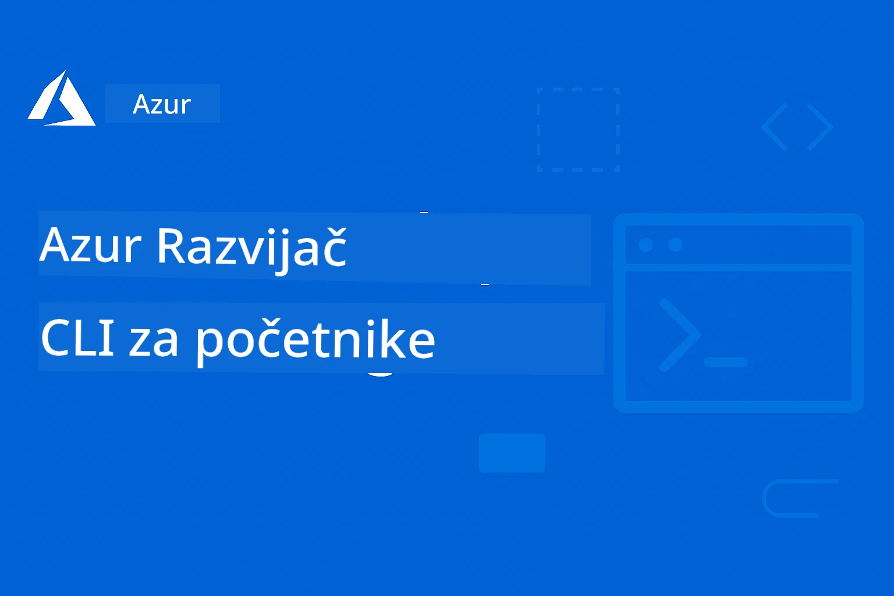

# AZD za početnike: Struktura učenja

 

[](https://GitHub.com/microsoft/azd-for-beginners/watchers/)
[](https://GitHub.com/microsoft/azd-for-beginners/network/)
[](https://GitHub.com/microsoft/azd-for-beginners/stargazers/)

[](https://discord.gg/microsoft-azure)
[](https://discord.gg/nTYy5BXMWG)

## Početak s ovim tečajem

Slijedite ove korake da započnete svoje AZD putovanje učenjem:

1. **Forkajte repozitorij**: Kliknite [](https://GitHub.com/microsoft/azd-for-beginners/fork)
2. **Klonirajte repozitorij**: `git clone https://github.com/microsoft/azd-for-beginners.git`
3. **Pridružite se zajednici**: [Azure Discord zajednice](https://discord.com/invite/ByRwuEEgH4) za stručnu podršku
4. **Odaberite svoj put učenja**: Izaberite poglavlje u nastavku koje odgovara vašoj razini iskustva

### Višejezična podrška

#### Automatizirani prijevodi (Uvijek ažurno)

<!-- CO-OP TRANSLATOR LANGUAGES TABLE START -->
[Arabic](../ar/README.md) | [Bengali](../bn/README.md) | [Bulgarian](../bg/README.md) | [Burmese (Myanmar)](../my/README.md) | [Chinese (Simplified)](../zh-CN/README.md) | [Chinese (Traditional, Hong Kong)](../zh-HK/README.md) | [Chinese (Traditional, Macau)](../zh-MO/README.md) | [Chinese (Traditional, Taiwan)](../zh-TW/README.md) | [Croatian](./README.md) | [Czech](../cs/README.md) | [Danish](../da/README.md) | [Dutch](../nl/README.md) | [Estonian](../et/README.md) | [Finnish](../fi/README.md) | [French](../fr/README.md) | [German](../de/README.md) | [Greek](../el/README.md) | [Hebrew](../he/README.md) | [Hindi](../hi/README.md) | [Hungarian](../hu/README.md) | [Indonesian](../id/README.md) | [Italian](../it/README.md) | [Japanese](../ja/README.md) | [Kannada](../kn/README.md) | [Korean](../ko/README.md) | [Lithuanian](../lt/README.md) | [Malay](../ms/README.md) | [Malayalam](../ml/README.md) | [Marathi](../mr/README.md) | [Nepali](../ne/README.md) | [Nigerian Pidgin](../pcm/README.md) | [Norwegian](../no/README.md) | [Persian (Farsi)](../fa/README.md) | [Polish](../pl/README.md) | [Portuguese (Brazil)](../pt-BR/README.md) | [Portuguese (Portugal)](../pt-PT/README.md) | [Punjabi (Gurmukhi)](../pa/README.md) | [Romanian](../ro/README.md) | [Russian](../ru/README.md) | [Serbian (Cyrillic)](../sr/README.md) | [Slovak](../sk/README.md) | [Slovenian](../sl/README.md) | [Spanish](../es/README.md) | [Swahili](../sw/README.md) | [Swedish](../sv/README.md) | [Tagalog (Filipino)](../tl/README.md) | [Tamil](../ta/README.md) | [Telugu](../te/README.md) | [Thai](../th/README.md) | [Turkish](../tr/README.md) | [Ukrainian](../uk/README.md) | [Urdu](../ur/README.md) | [Vietnamese](../vi/README.md)

> **Radije klonirati lokalno?**

> Ovaj repozitorij uključuje prijevode na 50+ jezika što značajno povećava veličinu preuzimanja. Za kloniranje bez prijevoda, koristite sparse checkout:
> ```bash
> git clone --filter=blob:none --sparse https://github.com/microsoft/AZD-for-beginners.git
> cd AZD-for-beginners
> git sparse-checkout set --no-cone '/*' '!translations' '!translated_images'
> ```
> Ovo vam daje sve potrebno za završetak tečaja s mnogo bržim preuzimanjem.
<!-- CO-OP TRANSLATOR LANGUAGES TABLE END -->

## Pregled tečaja

Savladajte Azure Developer CLI (azd) kroz strukturirane poglavlja dizajnirane za progresivno učenje. **Poseban fokus na primjenu AI aplikacija s integracijom Microsoft Foundry.**

### Zašto je ovaj tečaj bitan za suvremene programere

Na temelju uvida iz Microsoft Foundry Discord zajednice, **45% programera želi koristiti AZD za AI radne zadatke** ali nailaze na izazove s:
- Složenim AI arhitekturama s više usluga
- Najboljim praksama u produkcijskoj implementaciji AI
- Integracijom i konfiguracijom Azure AI usluga
- Optimizacijom troškova AI radnih opterećenja
- Otklanjanjem problema specifičnih za AI implementaciju

### Ciljevi učenja

Završetkom ovog strukturiranog tečaja, moći ćete:
- **Savladati AZD osnove**: Ključni pojmovi, instalacija i konfiguracija
- **Implementirati AI aplikacije**: Koristiti AZD s Microsoft Foundry uslugama
- **Primijeniti infrastrukturu kao kod**: Upravljati Azure resursima s Bicep predlošcima
- **Otkloniti probleme pri implementaciji**: Riješiti uobičajene probleme i otkloniti greške
- **Optimizirati za produkciju**: Sigurnost, skaliranje, nadzor i upravljanje troškovima
- **Izgraditi višestruka agentna rješenja**: Implementirati složene AI arhitekture

## 📚 Poglavlja za učenje

*Odaberite svoj put učenja prema razini iskustva i ciljevima*

### 🚀 Poglavlje 1: Osnove i brzi početak
**Preduvjeti**: Pretplata na Azure, osnovno znanje komandne linije  
**Trajanje**: 30-45 minuta  
**Složenost**: ⭐

#### Što ćete naučiti
- Razumijevanje osnova Azure Developer CLI
- Instalacija AZD na vašoj platformi
- Vaša prva uspješna implementacija

#### Resursi za učenje
- **🎯 Početak ovdje**: [Što je Azure Developer CLI?](../..)
- **📖 Teorija**: [AZD osnove](docs/getting-started/azd-basics.md) - Ključni pojmovi i terminologija
- **⚙️ Postavljanje**: [Instalacija i podešavanje](docs/getting-started/installation.md) - Vodiči za platformu
- **🛠️ Praktično**: [Vaš prvi projekt](docs/getting-started/first-project.md) - Korak po korak vodič
- **📋 Brzi pregled**: [Prečaci komandne linije](resources/cheat-sheet.md)

#### Praktične vježbe
```bash
# Brza provjera instalacije
azd version

# Postavite svoju prvu aplikaciju
azd init --template todo-nodejs-mongo
azd up
```

**💡 Ishod poglavlja**: Uspješno implementirajte jednostavnu web aplikaciju u Azure koristeći AZD

**✅ Validacija uspjeha:**
```bash
# Nakon dovršetka Poglavlja 1 trebali biste biti u mogućnosti:
azd version              # Prikazuje instaliranu verziju
azd init --template todo-nodejs-mongo  # Inicijalizira projekt
azd up                  # Deploys na Azure
azd show                # Prikazuje URL pokrenute aplikacije
# Aplikacija se otvara u pregledniku i radi
azd down --force --purge  # Čisti resurse
```

**📊 Uloženo vrijeme:** 30-45 minuta  
**📈 Razina sposobnosti nakon:** Mogućnost samostalne implementacije osnovnih aplikacija

**✅ Validacija uspjeha:**
```bash
# Nakon dovršetka Poglavlja 1, trebali biste moći:
azd version              # Prikazuje instaliranu verziju
azd init --template todo-nodejs-mongo  # Inicijalizira projekt
azd up                  # Postavlja na Azure
azd show                # Prikazuje URL pokrenute aplikacije
# Aplikacija se otvara u pregledniku i radi
azd down --force --purge  # Čisti resurse
```

**📊 Uloženo vrijeme:** 30-45 minuta  
**📈 Razina sposobnosti nakon:** Mogućnost samostalne implementacije osnovnih aplikacija

---

### 🤖 Poglavlje 2: AI-prvo razvijanje (Preporučeno za AI programere)
**Preduvjeti**: Završeno Poglavlje 1  
**Trajanje**: 1-2 sata  
**Složenost**: ⭐⭐

#### Što ćete naučiti
- Integracija Microsoft Foundry s AZD-om
- Implementacija AI aplikacija
- Razumijevanje konfiguracija AI usluga

#### Resursi za učenje
- **🎯 Početak ovdje**: [Integracija Microsoft Foundry](docs/microsoft-foundry/microsoft-foundry-integration.md)
- **📖 Obrasci**: [Implementacija AI modela](docs/microsoft-foundry/ai-model-deployment.md) - Implementacija i upravljanje AI modelima
- **🛠️ Radionica**: [AI laboratorij](docs/microsoft-foundry/ai-workshop-lab.md) - Pripremite AI rješenja za AZD
- **🎥 Interaktivni vodič**: [Materijali radionice](workshop/README.md) - Učenje u pregledniku s MkDocs * DevContainer okruženje
- **📋 Predlošci**: [Microsoft Foundry predlošci](../..)
- **📝 Primjeri**: [Primjeri implementacije AZD](examples/README.md)

#### Praktične vježbe
```bash
# Postavite svoju prvu AI aplikaciju
azd init --template azure-search-openai-demo
azd up

# Isprobajte dodatne AI predloške
azd init --template openai-chat-app-quickstart
azd init --template agent-openai-python-prompty
```

**💡 Ishod poglavlja**: Implementirajte i konfigurirajte AI chat aplikaciju s RAG mogućnostima

**✅ Validacija uspjeha:**
```bash
# Nakon Poglavlja 2, trebali biste moći:
azd init --template azure-search-openai-demo
azd up
# Testirati AI sučelje za razgovor
# Postavljati pitanja i dobivati AI-podržane odgovore s izvorima
# Provjeriti radi li integracija pretraživanja
azd monitor  # Provjeriti prikazuje li Application Insights telemetriju
azd down --force --purge
```

**📊 Uloženo vrijeme:** 1-2 sata  
**📈 Razina sposobnosti nakon:** Mogućnost implementacije i konfiguracije AI aplikacija spremnih za produkciju  
**💰 Svijest o troškovima:** Razumijevanje troškova razvoja (80-150$ mjesečno) i produkcije (300-3500$ mjesečno)

#### 💰 Razmatranja troškova za AI implementacije

**Razvojno okruženje (Procijenjeno 80-150$ / mjesečno):**
- Azure OpenAI (plaćanje po korištenju): 0-50$ mjesečno (ovisno o korištenju tokena)
- AI Search (osnovni nivo): 75$ mjesečno
- Container Apps (potrošnja): 0-20$ mjesečno
- Pohrana (standardna): 1-5$ mjesečno

**Produkcijsko okruženje (Procijenjeno 300-3,500+ $ / mjesečno):**
- Azure OpenAI (PTU za konstantne performanse): 3,000+ $ mjesečno ILI plaćanje po količini za velike volumene
- AI Search (standardni nivo): 250$ mjesečno
- Container Apps (dedicirani): 50-100$ mjesečno
- Application Insights: 5-50$ mjesečno
- Pohrana (premium): 10-50$ mjesečno

**💡 Savjeti za optimizaciju troškova:**
- Koristite **besplatni nivo** Azure OpenAI za učenje (50,000 tokena mjesečno uključeno)
- Pokrenite `azd down` za oslobađanje resursa kada ne razvijate aktivno
- Započnite s naplatom po potrošnji, PTU koristite samo za proizvodnju
- Koristite `azd provision --preview` za procjenu troškova prije implementacije
- Uključite auto-skaliranje: plaćajte samo za stvarnu upotrebu

**Praćenje troškova:**
```bash
# Provjerite procijenjene mjesečne troškove
azd provision --preview

# Pratite stvarne troškove u Azure portalu
az consumption budget list --resource-group <your-rg>
```

---

### ⚙️ Poglavlje 3: Konfiguracija i autentifikacija
**Preduvjeti**: Završeno Poglavlje 1  
**Trajanje**: 45-60 minuta  
**Složenost**: ⭐⭐

#### Što ćete naučiti
- Konfiguracija i upravljanje okruženjima
- Najbolje prakse autentifikacije i sigurnosti
- Imenovanje i organizacija resursa

#### Resursi za učenje
- **📖 Konfiguracija**: [Vodič za konfiguraciju](docs/getting-started/configuration.md) - Postavljanje okruženja
- **🔐 Sigurnost**: [Autentifikacijski obrasci i upravljani identitet](docs/getting-started/authsecurity.md) - Obrasci autentifikacije
- **📝 Primjeri**: [Primjer aplikacije baze podataka](examples/database-app/README.md) - Primjeri AZD baza podataka

#### Praktične vježbe
- Konfigurirajte više okruženja (razvojno, testno, produkcijsko)
- Postavite autentifikaciju s upravljanim identitetom
- Primijenite konfiguracije specifične za okruženje

**💡 Ishod poglavlja**: Upravljajte više okruženja s pravilnom autentifikacijom i sigurnošću

---

### 🏗️ Poglavlje 4: Infrastruktura kao kod i implementacija
**Preduvjeti**: Završena Poglavlja 1-3  
**Trajanje**: 1-1.5 sati  
**Složenost**: ⭐⭐⭐

#### Što ćete naučiti
- Napredni obrasci implementacije
- Infrastruktura kao kod s Bicepom
- Strategije provisioning resursa

#### Resursi za učenje
- **📖 Implementacija**: [Vodič za implementaciju](docs/deployment/deployment-guide.md) - Potpuni tijekovi rada
- **🏗️ Provisioning**: [Provisioning resursa](docs/deployment/provisioning.md) - Upravljanje Azure resursima
- **📝 Primjeri**: [Primjer Container App](../../examples/container-app) - Implementacije kontejneriziranih aplikacija

#### Praktične vježbe
- Kreirajte prilagođene Bicep predloške
- Implementirajte aplikacije s više usluga
- Primijenite strategije blue-green implementacije

**💡 Ishod poglavlja**: Implementirajte složene aplikacije s više usluga koristeći prilagođene infrastrukturne predloške

---

### 🎯 Poglavlje 5: Multi-agentna AI rješenja (Napredno)
**Preduvjeti**: Završena Poglavlja 1-2  
**Trajanje**: 2-3 sata  
**Složenost**: ⭐⭐⭐⭐
#### Što ćete naučiti
- Obrasci arhitekture s više agenata
- Orkestracija i koordinacija agenata
- AI implementacije spremne za produkciju

#### Resursi za učenje
- **🤖 Istaknuti projekt**: [Rješenje za maloprodajni multi-agentni sustav](examples/retail-scenario.md) - Potpuna implementacija
- **🛠️ ARM predlošci**: [Paket ARM predložaka](../../examples/retail-multiagent-arm-template) - Implementacija jednim klikom
- **📖 Arhitektura**: [Obrasci koordinacije više agenata](/docs/pre-deployment/coordination-patterns.md) - Obrasci

#### Praktične vježbe
```bash
# Implementirajte cjelovito maloprodajno rješenje s više agenata
cd examples/retail-multiagent-arm-template
./deploy.sh

# Istražite konfiguracije agenata
az deployment group show --resource-group <rg-name> --name <deployment-name>
```

**💡 Ishod poglavlja**: Implementirati i upravljati multi-agentnim AI rješenjem spremnim za produkciju s agentima za Kupce i Inventar

---

### 🔍 Poglavlje 6: Validacija i planiranje prije implementacije
**Preduvjeti**: Završeno poglavlje 4  
**Trajanje**: 1 sat  
**Složenost**: ⭐⭐

#### Što ćete naučiti
- Planiranje kapaciteta i validacija resursa
- Strategije odabira SKU-a
- Provjere prije implementacije i automatizacija

#### Resursi za učenje
- **📊 Planiranje**: [Planiranje kapaciteta](docs/pre-deployment/capacity-planning.md) - Validacija resursa
- **💰 Odabir**: [Odabir SKU-a](docs/pre-deployment/sku-selection.md) - Isplative opcije
- **✅ Validacija**: [Provjere prije leta](docs/pre-deployment/preflight-checks.md) - Automatizirani skripti

#### Praktične vježbe
- Pokrenuti skripte za validaciju kapaciteta
- Optimizirati odabir SKU-a za troškove
- Implementirati automatizirane provjere prije implementacije

**💡 Ishod poglavlja**: Validirati i optimizirati implementacije prije izvođenja

---

### 🚨 Poglavlje 7: Otklanjanje poteškoća i ispravljanje pogrešaka
**Preduvjeti**: Završeno bilo koje poglavlje implementacije  
**Trajanje**: 1-1,5 sati  
**Složenost**: ⭐⭐

#### Što ćete naučiti
- Sistematične pristupe ispravljanju pogrešaka
- Uobičajeni problemi i rješenja
- Specifično otklanjanje poteškoća za AI

#### Resursi za učenje
- **🔧 Uobičajeni problemi**: [Uobičajeni problemi](docs/troubleshooting/common-issues.md) - FAQ i rješenja
- **🕵️ Ispravljanje pogrešaka**: [Vodič za ispravljanje pogrešaka](docs/troubleshooting/debugging.md) - Strategije korak-po-korak
- **🤖 AI problemi**: [Otklanjanje poteškoća za AI](docs/troubleshooting/ai-troubleshooting.md) - Problemi AI servisa

#### Praktične vježbe
- Dijagnosticirati neuspjehe implementacije
- Riješiti probleme s autentifikacijom
- Ispravljati povezivost AI servisa

**💡 Ishod poglavlja**: Samostalno dijagnosticirati i riješiti uobičajene probleme implementacije

---

### 🏢 Poglavlje 8: Obrasci za produkciju i poduzeća
**Preduvjeti**: Završena poglavlja 1-4  
**Trajanje**: 2-3 sata  
**Složenost**: ⭐⭐⭐⭐

#### Što ćete naučiti
- Strategije implementacije u produkciji
- Obrasci sigurnosti za poduzeća
- Praćenje i optimizacija troškova

#### Resursi za učenje
- **🏭 Produkcija**: [Najbolje prakse za AI u produkciji](docs/microsoft-foundry/production-ai-practices.md) - Obrasci za poduzeća
- **📝 Primjeri**: [Primjer mikroservisa](../../examples/microservices) - Kompleksne arhitekture
- **📊 Praćenje**: [Integracija Application Insights](docs/pre-deployment/application-insights.md) - Praćenje

#### Praktične vježbe
- Implementirati obrasce sigurnosti za poduzeća
- Postaviti sveobuhvatno praćenje
- Implementirati u produkciju uz odgovarajuće upravljanje

**💡 Ishod poglavlja**: Implementirati aplikacije spremne za poduzeća s punim produkcijskim kapacitetima

---

## 🎓 Pregled radionice: Iskustvo praktičnog učenja

> **⚠️ STATUS RADIONICE: Aktivni razvoj**  
> Materijali radionice su trenutno u razvoju i doradi. Temeljni moduli su funkcionalni, ali neki napredni dijelovi su nedovršeni. Aktivno radimo na dovršetku cijelog sadržaja. [Pratite napredak →](workshop/README.md)

### Interaktivni materijali radionice
**Sveobuhvatno praktično učenje s alatima u pregledniku i vođenim vježbama**

Naši materijali radionice pružaju strukturirano i interaktivno iskustvo učenja koje nadopunjuje gore navedeni kurikulum temeljen na poglavljima. Radionica je namijenjena za samostalno učenje i za led sesije pod vodstvom instruktora.

#### 🛠️ Značajke radionice
- **Sučelje u pregledniku**: Potpuna radionica na bazi MkDocs s pretraživanjem, kopiranjem i tematskim značajkama
- **GitHub Codespaces integracija**: Postavljanje razvojne okoline jednim klikom
- **Strukturirani put učenja**: 7-stupanjske vođene vježbe (ukupno 3,5 sati)
- **Otkriće → Implementacija → Prilagodba**: Progresivna metodologija
- **Interaktivno DevContainer okruženje**: Prekonfigurirani alati i ovisnosti

#### 📚 Struktura radionice
Radionica slijedi metodologiju **Otkriće → Implementacija → Prilagodba**:

1. **Faza otkrića** (45 minuta)
   - Istražiti Microsoft Foundry predloške i servise
   - Razumjeti obrasce višeagentne arhitekture
   - Pregledati zahtjeve i preduvjete za implementaciju

2. **Faza implementacije** (2 sata)
   - Praktična implementacija AI aplikacija pomoću AZD-a
   - Konfigurirati Azure AI servise i krajnje točke
   - Implementirati obrasce sigurnosti i autentifikacije

3. **Faza prilagodbe** (45 minuta)
   - Prilagoditi aplikacije za specifične slučajeve upotrebe
   - Optimizirati za produkcijsku implementaciju
   - Implementirati praćenje i upravljanje troškovima

#### 🚀 Početak rada s radionicom
```bash
# Opcija 1: GitHub Codespaces (Preporučeno)
# Kliknite "Code" → "Create codespace on main" u spremištu

# Opcija 2: Lokalni razvoj
git clone https://github.com/microsoft/azd-for-beginners.git
cd azd-for-beginners/workshop
# Slijedite upute za postavljanje u workshop/README.md
```

#### 🎯 Ishodi učenja radionice
Nakon završetka radionice sudionici će:
- **Implementirati AI aplikacije za produkciju**: Koristiti AZD sa Microsoft Foundry servisima
- **Ovladati multi-agentnim arhitekturama**: Implementirati koordinirane AI agentske sustave
- **Primijeniti najbolje prakse sigurnosti**: Konfigurirati autentifikaciju i kontrolu pristupa
- **Optimizirati za skalabilnost**: Dizajnirati isplative i učinkovite implementacije
- **Otklanjati probleme implementacije**: Samostalno rješavati uobičajene poteškoće

#### 📖 Resursi radionice
- **🎥 Interaktivni vodič**: [Materijali radionice](workshop/README.md) - Okruženje za učenje u pregledniku
- **📋 Upute korak po korak**: [Vođene vježbe](../../workshop/docs/instructions) - Detaljni vodiči
- **🛠️ AI radionica laboratorij**: [AI radionica laboratorij](docs/microsoft-foundry/ai-workshop-lab.md) - AI usredotočene vježbe
- **💡 Brzi početak**: [Vodič za postavljanje radionice](workshop/README.md#quick-start) - Konfiguracija okruženja

**Idealno za**: Korporativnu obuku, sveučilišne tečajeve, samostalno učenje i razvojne bootcampove.

---

## 📖 Što je Azure Developer CLI?

Azure Developer CLI (azd) je naredbeni sučelje usmjereno na developere koje ubrzava proces izgradnje i implementacije aplikacija na Azure. Omogućava:

- **Implementacije temeljene na predlošcima** - Koristite unaprijed izrađene predloške za uobičajene obrasce aplikacija
- **Infrastruktura kao kod** - Upravljanje Azure resursima pomoću Bicepa ili Terraforma  
- **Integrirani tijekovi rada** - Bezproblemu proviziju, implementaciju i praćenje aplikacija
- **Prilagođeno developerima** - Optimizirano za produktivnost i korisničko iskustvo developera

### **AZD + Microsoft Foundry: Savršeno za AI implementacije**

**Zašto AZD za AI rješenja?** AZD rješava glavne izazove s kojima se suočavaju AI developeri:

- **Predlošci spremni za AI** - Unaprijed konfigurirani predlošci za Azure OpenAI, Cognitive Services i ML zadatke
- **Sigurne AI implementacije** - Ugrađeni sigurnosni obrasci za AI servise, API ključeve i krajnje točke modela  
- **Obrasci AI za produkciju** - Najbolje prakse za skalabilne i isplative AI aplikacije
- **End-to-end AI tijekovi rada** - Od razvoja modela do produkcijske implementacije s adekvatnim praćenjem
- **Optimizacija troškova** - Pametno raspoređivanje resursa i skaliranje za AI zadatke
- **Integracija s Microsoft Foundry** - Bešavna veza s katalogom modela i krajnjim točkama Microsoft Foundry

---

## 🎯 Knjižnica predložaka i primjera

### Istaknuto: Microsoft Foundry predlošci
**Započnite ovdje ako implementirate AI aplikacije!**

> **Napomena:** Ovi predlošci prikazuju različite AI obrasce. Neki su vanjski Azure uzorci, drugi lokalne implementacije.

| Predložak | Poglavlje | Složenost | Servisi | Tip |
|----------|---------|------------|----------|------|
| [**Get started with AI chat**](https://github.com/Azure-Samples/get-started-with-ai-chat) | Poglavlje 2 | ⭐⭐ | AzureOpenAI + Azure AI Model Inference API + Azure AI Search + Azure Container Apps + Application Insights | Vanjski |
| [**Get started with AI agents**](https://github.com/Azure-Samples/get-started-with-ai-agents) | Poglavlje 2 | ⭐⭐ | Azure AI Agent Service + AzureOpenAI + Azure AI Search + Azure Container Apps + Application Insights| Vanjski |
| [**Azure Search + OpenAI Demo**](https://github.com/Azure-Samples/azure-search-openai-demo) | Poglavlje 2 | ⭐⭐ | AzureOpenAI + Azure AI Search + App Service + Storage | Vanjski |
| [**OpenAI Chat App Quickstart**](https://github.com/Azure-Samples/openai-chat-app-quickstart) | Poglavlje 2 | ⭐ | AzureOpenAI + Container Apps + Application Insights | Vanjski |
| [**Agent OpenAI Python Prompty**](https://github.com/Azure-Samples/agent-openai-python-prompty) | Poglavlje 5 | ⭐⭐⭐ | AzureOpenAI + Azure Functions + Prompty | Vanjski |
| [**Contoso Chat RAG**](https://github.com/Azure-Samples/contoso-chat) | Poglavlje 8 | ⭐⭐⭐⭐ | AzureOpenAI + AI Search + Cosmos DB + Container Apps | Vanjski |
| [**Retail Multi-Agent Solution**](examples/retail-scenario.md) | Poglavlje 5 | ⭐⭐⭐⭐ | AzureOpenAI + AI Search + Storage + Container Apps + Cosmos DB | **Lokalno** |

### Istaknuto: Potpuni scenariji učenja
**Predlošci aplikacija spremni za produkciju mapirani na poglavlja za učenje**

| Predložak | Poglavlje učenja | Složenost | Ključna lekcija |
|----------|------------------|------------|--------------|
| [**openai-chat-app-quickstart**](https://github.com/Azure-Samples/openai-chat-app-quickstart) | Poglavlje 2 | ⭐ | Osnovni obrasci AI implementacije |
| [**azure-search-openai-demo**](https://github.com/Azure-Samples/azure-search-openai-demo) | Poglavlje 2 | ⭐⭐ | RAG implementacija s Azure AI Search |
| [**ai-document-processing**](https://github.com/Azure-Samples/ai-document-processing) | Poglavlje 4 | ⭐⭐ | Integracija za obradu dokumenata |
| [**agent-openai-python-prompty**](https://github.com/Azure-Samples/agent-openai-python-prompty) | Poglavlje 5 | ⭐⭐⭐ | Okvir za agente i pozivanje funkcija |
| [**contoso-chat**](https://github.com/Azure-Samples/contoso-chat) | Poglavlje 8 | ⭐⭐⭐ | Orkestracija AI za poduzeća |
| [**retail-multi-agent-solution**](examples/retail-scenario.md) | Poglavlje 5 | ⭐⭐⭐⭐ | Arhitektura s više agenata s kupcima i inventarom |

### Učenje po tipu primjera

> **📌 Lokalni vs. Vanjski primjeri:**  
> **Lokalni primjeri** (u ovom repozitoriju) = Spremni za neposrednu upotrebu  
> **Vanjski primjeri** (Azure uzorci) = Klonirati iz povezanih repozitorija

#### Lokalni primjeri (spremni za upotrebu)
- [**Retail Multi-Agent Solution**](examples/retail-scenario.md) - Potpuna proizvodna implementacija sa ARM predlošcima
  - Arhitektura s više agenata (Kupac + Inventar)
  - Sveobuhvatno praćenje i evaluacija
  - Jednim klikom implementacija putem ARM predloška

#### Lokalni primjeri - Container aplikacije (poglavlja 2-5)
**Sveobuhvatni primjeri implementacije kontejnera u ovom repozitoriju:**
- [**Primjeri Container App**](examples/container-app/README.md) - Potpun vodič za implementaciju kontejnera
  - [Jednostavni Flask API](../../examples/container-app/simple-flask-api) - Osnovni REST API sa skaliranjem do nule
  - [Arhitektura mikroservisa](../../examples/container-app/microservices) - Produkcijska implementacija više servisa
  - Brzi početak, produkcija i napredni obrasci implementacije
  - Vodič za praćenje, sigurnost i optimizaciju troškova

#### Vanjski primjeri - Jednostavne aplikacije (poglavlja 1-2)
**Klonirajte ove Azure uzorke da započnete:**
- [Jednostavna web aplikacija - Node.js + MongoDB](https://github.com/Azure-Samples/todo-nodejs-mongo) - Osnovni obrasci implementacije
- [Static Website - React SPA](https://github.com/Azure-Samples/todo-csharp-sql-swa-func) - Implementacija statičkog sadržaja
- [Container App - Python Flask](https://github.com/Azure-Samples/container-apps-store-api-microservice) - REST API implementacija

#### Vanjski primjeri - Integracija baze podataka (poglavlja 3-4)  
- [Database App - C# + SQL](https://github.com/Azure-Samples/todo-csharp-sql) - Obrasci povezivanja baze podataka
- [Functions + Cosmos DB](https://github.com/Azure-Samples/todo-python-mongo-swa-func) - Serverless tijek podataka

#### Vanjski primjeri - Napredni obrasci (poglavlja 4-8)
- [Java mikroservisi](https://github.com/Azure-Samples/java-microservices-aca-lab) - Arhitekture s više servisa
- [Container Apps poslovi](https://github.com/Azure-Samples/container-apps-jobs) - Obrada u pozadini  
- [Enterprise ML pipeline](https://github.com/Azure-Samples/mlops-v2) - Produkcijski ML obrasci

### Vanjske kolekcije predložaka
- [**Službena galerija AZD predložaka**](https://azure.github.io/awesome-azd/) - Kurirana kolekcija službenih i zajedničkih predložaka
- [**Azure Developer CLI predlošci**](https://learn.microsoft.com/en-us/azure/developer/azure-developer-cli/azd-templates) - Dokumentacija Microsoft Learn predložaka
- [**Direktorij Primjeri**](examples/README.md) - Lokalni primjeri za učenje s detaljnim objašnjenjima

---

## 📚 Resursi za učenje i reference

### Brzi reference
- [**Prečac naredbi**](resources/cheat-sheet.md) - Ključne azd naredbe organizirane po poglavljima
- [**Rječnik**](resources/glossary.md) - Terminologija Azure i azd  
- [**Često postavljana pitanja**](resources/faq.md) - Uobičajena pitanja organizirana po poglavljima za učenje
- [**Vodič za učenje**](resources/study-guide.md) - Svestrani vježbeni zadaci

### Praktične radionice
- [**AI Radionica lab**](docs/microsoft-foundry/ai-workshop-lab.md) - Napravite vaše AI rješenja spremnima za implementaciju putem AZD (2-3 sata)
- [**Interaktivni vodič radionice**](workshop/README.md) - Radionica u pregledniku s MkDocs i DevContainer okruženjem
- [**Strukturirani put učenja**](../../workshop/docs/instructions) - Sedam koraka vođenih vježbi (Otkriće → Implementacija → Prilagodba)
- [**AZD radionica za početnike**](workshop/README.md) - Kompleti materijala za praktične radionice s integracijom GitHub Codespaces

### Vanjski resursi za učenje
- Dokumentacija Azure Developer CLI-ja: [Azure Developer CLI Documentation](https://learn.microsoft.com/en-us/azure/developer/azure-developer-cli/)
- Centar za Azure arhitekturu: [Azure Architecture Center](https://learn.microsoft.com/en-us/azure/architecture/)
- Kalkulator cijena Azure: [Azure Pricing Calculator](https://azure.microsoft.com/pricing/calculator/)
- Status Azure usluga: [Azure Status](https://status.azure.com/)

---

## 🔧 Brzi vodič za otklanjanje problema

**Uobičajeni problemi s kojima se početnici suočavaju i trenutna rješenja:**

### ❌ "azd: command not found"

```bash
# Prvo instalirajte AZD
# Windows (PowerShell):
winget install microsoft.azd

# macOS:
brew tap azure/azd && brew install azd

# Linux:
curl -fsSL https://aka.ms/install-azd.sh | bash

# Provjerite instalaciju
azd version
```
  
### ❌ "No subscription found" ili "Subscription not set"

```bash
# Nabroj dostupne pretplate
az account list --output table

# Postavi zadanu pretplatu
az account set --subscription "<subscription-id-or-name>"

# Postavi za AZD okruženje
azd env set AZURE_SUBSCRIPTION_ID "<subscription-id>"

# Provjeri
az account show
```
  
### ❌ "InsufficientQuota" ili "Quota exceeded"

```bash
# Isprobajte različitu Azure regiju
azd env set AZURE_LOCATION "westus2"
azd up

# Ili koristite manje SKU-ove u razvoju
# Uredite infra/main.parameters.json:
{
  "sku": "B1"  // Instead of "P1V2"
}
```
  
### ❌ "azd up" ne uspijeva na pola puta

```bash
# Opcija 1: Očistite i pokušajte ponovno
azd down --force --purge
azd up

# Opcija 2: Popravite samo infrastrukturu
azd provision

# Opcija 3: Provjerite detaljne zapise
azd show
azd logs
```
  
### ❌ "Authentication failed" ili "Token expired"

```bash
# Ponovno se autentificirajte
az logout
az login

azd auth logout
azd auth login

# Potvrdite autentifikaciju
az account show
```
  
### ❌ "Resource already exists" ili sukobi u imenima

```bash
# AZD generira jedinstvena imena, ali ako dođe do sukoba:
azd down --force --purge

# Zatim pokušajte ponovno s novim okruženjem
azd env new dev-v2
azd up
```
  
### ❌ Implementacija predloška traje predugo

**Uobičajena vremena čekanja:**
- Jednostavna web-aplikacija: 5-10 minuta
- Aplikacija s bazom podataka: 10-15 minuta
- AI aplikacije: 15-25 minuta (Provisioniranje OpenAI je sporo)

```bash
# Provjeri napredak
azd show

# Ako si zapeo više od 30 minuta, provjeri Azure portal:
azd monitor
# Potraži neuspjele implementacije
```
  
### ❌ "Permission denied" ili "Forbidden"

```bash
# Provjerite svoju Azure ulogu
az role assignment list --assignee $(az account show --query user.name -o tsv)

# Potrebna vam je barem uloga "Suradnik"
# Zamolite svog Azure administratora da dodijeli:
# - Suradnik (za resurse)
# - Administrator pristupa korisnika (za dodjele uloga)
```
  
### ❌ Ne mogu pronaći URL implementirane aplikacije

```bash
# Prikaži sve krajnje točke usluge
azd show

# Ili otvori Azure portal
azd monitor

# Provjeri specifičnu uslugu
azd env get-values
# Potraži *_URL varijable
```
  
### 📚 Cjelokupni resursi za otklanjanje problema

- **Vodič kroz uobičajene probleme:** [Detaljna rješenja](docs/troubleshooting/common-issues.md)  
- **AI-specifični problemi:** [AI otklanjanje problema](docs/troubleshooting/ai-troubleshooting.md)  
- **Vodič za otklanjanje pogrešaka:** [Korak-po-korak otklanjanje](docs/troubleshooting/debugging.md)  
- **Potražite pomoć:** [Azure Discord](https://discord.gg/microsoft-azure) #azure-developer-cli

---

## 🔧 Brzi vodič za otklanjanje problema

**Uobičajeni problemi s kojima se početnici suočavaju i trenutna rješenja:**

<details>
<summary><strong>❌ "azd: command not found"</strong></summary>

```bash
# Prvo instalirajte AZD
# Windows (PowerShell):
winget install microsoft.azd

# macOS:
brew tap azure/azd && brew install azd

# Linux:
curl -fsSL https://aka.ms/install-azd.sh | bash

# Provjerite instalaciju
azd version
```
</details>

<details>
<summary><strong>❌ "No subscription found" ili "Subscription not set"</strong></summary>

```bash
# Prikaži dostupne pretplate
az account list --output table

# Postavi zadanu pretplatu
az account set --subscription "<subscription-id-or-name>"

# Postavi za AZD okruženje
azd env set AZURE_SUBSCRIPTION_ID "<subscription-id>"

# Provjeri
az account show
```
</details>

<details>
<summary><strong>❌ "InsufficientQuota" ili "Quota exceeded"</strong></summary>

```bash
# Isprobajte različitu Azure regiju
azd env set AZURE_LOCATION "westus2"
azd up

# Ili koristite manje SKU-ove u razvoju
# Uredite infra/main.parameters.json:
{
  "sku": "B1"  // Instead of "P1V2"
}
```
</details>

<details>
<summary><strong>❌ "azd up" ne uspijeva na pola puta</strong></summary>

```bash
# Opcija 1: Očistite i pokušajte ponovo
azd down --force --purge
azd up

# Opcija 2: Samo popravite infrastrukturu
azd provision

# Opcija 3: Provjerite detaljne zapise
azd show
azd logs
```
</details>

<details>
<summary><strong>❌ "Authentication failed" ili "Token expired"</strong></summary>

```bash
# Ponovno se autentificirajte
az logout
az login

azd auth logout
azd auth login

# Provjerite autentifikaciju
az account show
```
</details>

<details>
<summary><strong>❌ "Resource already exists" ili sukobi u imenima</strong></summary>

```bash
# AZD generira jedinstvena imena, ali ako dođe do sukoba:
azd down --force --purge

# Pokušajte ponovno s novim okolišem
azd env new dev-v2
azd up
```
</details>

<details>
<summary><strong>❌ Implementacija predloška traje predugo</strong></summary>

**Uobičajena vremena čekanja:**
- Jednostavna web-aplikacija: 5-10 minuta
- Aplikacija s bazom podataka: 10-15 minuta
- AI aplikacije: 15-25 minuta (Provisioniranje OpenAI je sporo)

```bash
# Provjeri napredak
azd show

# Ako zaglaviš duže od 30 minuta, provjeri Azure portal:
azd monitor
# Potraži neuspjele implementacije
```
</details>

<details>
<summary><strong>❌ "Permission denied" ili "Forbidden"</strong></summary>

```bash
# Provjerite svoju Azure ulogu
az role assignment list --assignee $(az account show --query user.name -o tsv)

# Potrebna vam je barem uloga "Contributor"
# Zamolite svog Azure administratora da vam dodijeli:
# - Contributor (za resurse)
# - User Access Administrator (za dodjele uloga)
```
</details>

<details>
<summary><strong>❌ Ne mogu pronaći URL implementirane aplikacije</strong></summary>

```bash
# Prikaži sve krajnje točke usluge
azd show

# Ili otvori Azure Portal
azd monitor

# Provjeri određenu uslugu
azd env get-values
# Potraži *_URL varijable
```
</details>

### 📚 Cjelokupni resursi za otklanjanje problema

- **Vodič kroz uobičajene probleme:** [Detaljna rješenja](docs/troubleshooting/common-issues.md)  
- **AI-specifični problemi:** [AI otklanjanje problema](docs/troubleshooting/ai-troubleshooting.md)  
- **Vodič za otklanjanje pogrešaka:** [Korak-po-korak otklanjanje](docs/troubleshooting/debugging.md)  
- **Potražite pomoć:** [Azure Discord](https://discord.gg/microsoft-azure) #azure-developer-cli

---

## 🎓 Završetak tečaja i certifikacija

### Praćenje napretka
Pratite svoj napredak kroz svako poglavlje:

- [ ] **Poglavlje 1**: Osnove i brz početak ✅  
- [ ] **Poglavlje 2**: AI-prvi razvoj ✅  
- [ ] **Poglavlje 3**: Konfiguracija i autentifikacija ✅  
- [ ] **Poglavlje 4**: Infrastruktura kao kod i implementacija ✅  
- [ ] **Poglavlje 5**: Više-agentna AI rješenja ✅  
- [ ] **Poglavlje 6**: Provjera i planiranje prije implementacije ✅  
- [ ] **Poglavlje 7**: Otklanjanje problema i otklanjanje pogrešaka ✅  
- [ ] **Poglavlje 8**: Produkcijski i enterprise obrasci ✅

### Provjera učenja
Nakon završetka svakog poglavlja, provjerite svoje znanje tako da:
1. **Praktična vježba:** Završite praktični zadatak implementacije iz poglavlja  
2. **Provjera znanja:** Pregledajte FAQ sekciju za vaše poglavlje  
3. **Zajednički razgovor:** Podijelite iskustvo u Azure Discord zajednici  
4. **Sljedeće poglavlje:** Prijeđite na sljedeću razinu složenosti

### Prednosti završetka tečaja
Nakon što završite sva poglavlja, imat ćete:
- **Iskustvo u produkciji:** Implementirane stvarne AI aplikacije u Azure  
- **Profesionalne vještine:** Kompetencije za enterprise implementaciju  
- **Prepoznatljivost u zajednici:** Aktivni član Azure razvojne zajednice  
- **Napredak u karijeri:** Tražena ekspertiza u AZD i AI implementaciji

---

## 🤝 Zajednica i podrška

### Dobivanje pomoći i podrške
- **Tehnički problemi:** [Prijavite greške i zatražite značajke](https://github.com/microsoft/azd-for-beginners/issues)  
- **Pitanja za učenje:** [Microsoft Azure Discord zajednica](https://discord.gg/microsoft-azure) i [](https://discord.gg/nTYy5BXMWG)  
- **AI-specifična pomoć:** Pridružite se [](https://discord.gg/nTYy5BXMWG)  
- **Dokumentacija:** [Službena dokumentacija Azure Developer CLI-ja](https://learn.microsoft.com/en-us/azure/developer/azure-developer-cli/)

### Uvidi zajednice iz Microsoft Foundry Discorda

**Nedavni rezultati ankete s #Azure kanala:**  
- **45%** developera želi koristiti AZD za AI radne opterećenja  
- **Glavni izazovi:** implementacije s više usluga, upravljanje vjerodajnicama, spremnost za produkciju  
- **Najtraženije:** AI-specifični predlošci, vodiči za otklanjanje problema, najbolje prakse

**Pridružite se našoj zajednici da:**  
- Dijelite svoja AZD + AI iskustva i dobijete pomoć  
- Imate pristup ranim pregledima novih AI predložaka  
- Doprinesete najboljim praksama za AI implementaciju  
- Utječete na budući razvoj AI + AZD značajki

### Doprinos tečaju
Pozivamo na doprinose! Molimo pročitajte naš [Vodič za doprinos](CONTRIBUTING.md) za detalje o:  
- **Poboljšanju sadržaja:** Unaprijedite postojeća poglavlja i primjere  
- **Novim primjerima:** Dodajte stvarne scenarije i predloške  
- **Prijevodu:** Pomozite održavati podršku za više jezika  
- **Prijavama grešaka:** Poboljšajte točnost i jasnoću  
- **Standardima zajednice:** Pridržavajte se naših inkluzivnih smjernica zajednice

---

## 📄 Informacije o tečaju

### Licenca
Ovaj projekt je licenciran pod MIT licencom - pogledajte datoteku [LICENSE](../../LICENSE) za pojedinosti.

### Povezani Microsoft resursi za učenje

Naš tim proizvodi i druge sveobuhvatne tečajeve za učenje:

<!-- CO-OP TRANSLATOR OTHER COURSES START -->
### LangChain
[](https://aka.ms/langchain4j-for-beginners)
[](https://aka.ms/langchainjs-for-beginners?WT.mc_id=m365-94501-dwahlin)
[](https://github.com/microsoft/langchain-for-beginners?WT.mc_id=m365-94501-dwahlin)
---

### Azure / Edge / MCP / Agenti
[](https://github.com/microsoft/AZD-for-beginners?WT.mc_id=academic-105485-koreyst)
[](https://github.com/microsoft/edgeai-for-beginners?WT.mc_id=academic-105485-koreyst)
[](https://github.com/microsoft/mcp-for-beginners?WT.mc_id=academic-105485-koreyst)
[](https://github.com/microsoft/ai-agents-for-beginners?WT.mc_id=academic-105485-koreyst)

---
 
### Serija Generativnog AI
[](https://github.com/microsoft/generative-ai-for-beginners?WT.mc_id=academic-105485-koreyst)
[-9333EA?style=for-the-badge&labelColor=E5E7EB&color=9333EA)](https://github.com/microsoft/Generative-AI-for-beginners-dotnet?WT.mc_id=academic-105485-koreyst)
[-C084FC?style=for-the-badge&labelColor=E5E7EB&color=C084FC)](https://github.com/microsoft/generative-ai-for-beginners-java?WT.mc_id=academic-105485-koreyst)
[-E879F9?style=for-the-badge&labelColor=E5E7EB&color=E879F9)](https://github.com/microsoft/generative-ai-with-javascript?WT.mc_id=academic-105485-koreyst)

---
 
### Temeljno učenje
[](https://aka.ms/ml-beginners?WT.mc_id=academic-105485-koreyst)
[](https://aka.ms/datascience-beginners?WT.mc_id=academic-105485-koreyst)
[](https://aka.ms/ai-beginners?WT.mc_id=academic-105485-koreyst)
[](https://github.com/microsoft/Security-101?WT.mc_id=academic-96948-sayoung)
[](https://aka.ms/webdev-beginners?WT.mc_id=academic-105485-koreyst)
[](https://aka.ms/iot-beginners?WT.mc_id=academic-105485-koreyst)
[](https://github.com/microsoft/xr-development-for-beginners?WT.mc_id=academic-105485-koreyst)

---
 
### Copilot serija
[](https://aka.ms/GitHubCopilotAI?WT.mc_id=academic-105485-koreyst)
[](https://github.com/microsoft/mastering-github-copilot-for-dotnet-csharp-developers?WT.mc_id=academic-105485-koreyst)
[](https://github.com/microsoft/CopilotAdventures?WT.mc_id=academic-105485-koreyst)
<!-- CO-OP TRANSLATOR OTHER COURSES END -->

---

## 🗺️ Navigacija tečaja

**🚀 Spremni za početak učenja?**

**Početnici**: Započnite s [Poglavlje 1: Osnove i Brzi početak](../..)  
**AI programeri**: Preskočite na [Poglavlje 2: AI-prvi razvoj](../..)  
**Iskusni programeri**: Započnite s [Poglavlje 3: Konfiguracija i autentifikacija](../..)

**Sljedeći koraci**: [Započnite Poglavlje 1 - Osnove AZD-a](docs/getting-started/azd-basics.md) →

---

<!-- CO-OP TRANSLATOR DISCLAIMER START -->
**Odricanje od odgovornosti**:  
Ovaj dokument preveden je korištenjem AI prevoditeljske usluge [Co-op Translator](https://github.com/Azure/co-op-translator). Iako težimo točnosti, imajte na umu da automatski prijevodi mogu sadržavati pogreške ili netočnosti. Izvorni dokument na izvornom jeziku treba se smatrati autoritativnim izvorom. Za kritične informacije preporučuje se profesionalni ljudski prijevod. Ne snosimo odgovornost za bilo kakva nesporazuma ili pogrešne interpretacije koje proizlaze iz korištenja ovog prijevoda.
<!-- CO-OP TRANSLATOR DISCLAIMER END -->