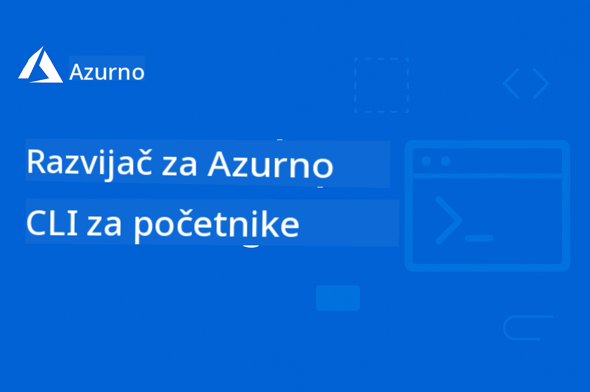

<!--
CO_OP_TRANSLATOR_METADATA:
{
  "original_hash": "7c5d2bb409800e22e74f34ee0ed12bed",
  "translation_date": "2025-12-17T15:58:34+00:00",
  "source_file": "README.md",
  "language_code": "hr"
}
-->
# AZD za početnike: Strukturirano putovanje učenjem

 

[](https://GitHub.com/microsoft/azd-for-beginners/watchers/)
[](https://GitHub.com/microsoft/azd-for-beginners/network/)
[](https://GitHub.com/microsoft/azd-for-beginners/stargazers/)

[](https://discord.gg/microsoft-azure)
[](https://discord.gg/nTYy5BXMWG)

## Početak rada s ovim tečajem

Slijedite ove korake da započnete svoje AZD putovanje učenjem:

1. **Forkajte repozitorij**: Kliknite [](https://GitHub.com/microsoft/azd-for-beginners/fork)
2. **Klonirajte repozitorij**: `git clone https://github.com/microsoft/azd-for-beginners.git`
3. **Pridružite se zajednici**: [Azure Discord zajednice](https://discord.com/invite/ByRwuEEgH4) za stručnu podršku
4. **Odaberite svoj put učenja**: Izaberite poglavlje ispod koje odgovara vašoj razini iskustva

### Podrška za više jezika

#### Automatski prijevodi (Uvijek ažurirani)

<!-- CO-OP TRANSLATOR LANGUAGES TABLE START -->
[Arabic](../ar/README.md) | [Bengali](../bn/README.md) | [Bulgarian](../bg/README.md) | [Burmese (Myanmar)](../my/README.md) | [Chinese (Simplified)](../zh/README.md) | [Chinese (Traditional, Hong Kong)](../hk/README.md) | [Chinese (Traditional, Macau)](../mo/README.md) | [Chinese (Traditional, Taiwan)](../tw/README.md) | [Croatian](./README.md) | [Czech](../cs/README.md) | [Danish](../da/README.md) | [Dutch](../nl/README.md) | [Estonian](../et/README.md) | [Finnish](../fi/README.md) | [French](../fr/README.md) | [German](../de/README.md) | [Greek](../el/README.md) | [Hebrew](../he/README.md) | [Hindi](../hi/README.md) | [Hungarian](../hu/README.md) | [Indonesian](../id/README.md) | [Italian](../it/README.md) | [Japanese](../ja/README.md) | [Kannada](../kn/README.md) | [Korean](../ko/README.md) | [Lithuanian](../lt/README.md) | [Malay](../ms/README.md) | [Malayalam](../ml/README.md) | [Marathi](../mr/README.md) | [Nepali](../ne/README.md) | [Nigerian Pidgin](../pcm/README.md) | [Norwegian](../no/README.md) | [Persian (Farsi)](../fa/README.md) | [Polish](../pl/README.md) | [Portuguese (Brazil)](../br/README.md) | [Portuguese (Portugal)](../pt/README.md) | [Punjabi (Gurmukhi)](../pa/README.md) | [Romanian](../ro/README.md) | [Russian](../ru/README.md) | [Serbian (Cyrillic)](../sr/README.md) | [Slovak](../sk/README.md) | [Slovenian](../sl/README.md) | [Spanish](../es/README.md) | [Swahili](../sw/README.md) | [Swedish](../sv/README.md) | [Tagalog (Filipino)](../tl/README.md) | [Tamil](../ta/README.md) | [Telugu](../te/README.md) | [Thai](../th/README.md) | [Turkish](../tr/README.md) | [Ukrainian](../uk/README.md) | [Urdu](../ur/README.md) | [Vietnamese](../vi/README.md)
<!-- CO-OP TRANSLATOR LANGUAGES TABLE END -->

## Pregled tečaja

Savladajte Azure Developer CLI (azd) kroz strukturirana poglavlja dizajnirana za progresivno učenje. **Poseban fokus na implementaciju AI aplikacija s integracijom Microsoft Foundry.**

### Zašto je ovaj tečaj bitan za moderne programere

Na temelju uvida iz Microsoft Foundry Discord zajednice, **45% programera želi koristiti AZD za AI radne zadatke** ali nailaze na izazove s:
- Složenim AI arhitekturama s više servisa
- Najboljim praksama za produkcijsku implementaciju AI
- Integracijom i konfiguracijom Azure AI servisa
- Optimizacijom troškova za AI radne zadatke
- Rješavanjem problema specifičnih za AI implementacije

### Ciljevi učenja

Završetkom ovog strukturiranog tečaja, naučit ćete:
- **Savladati osnove AZD-a**: Temeljni koncepti, instalacija i konfiguracija
- **Implementirati AI aplikacije**: Koristiti AZD s Microsoft Foundry servisima
- **Primijeniti infrastrukturu kao kod**: Upravljati Azure resursima s Bicep predlošcima
- **Rješavati probleme implementacije**: Otklanjati uobičajene poteškoće i debugirati
- **Optimizirati za produkciju**: Sigurnost, skaliranje, nadzor i upravljanje troškovima
- **Izgraditi višeslojne AI rješenja**: Implementirati složene AI arhitekture

## 📚 Poglavlja za učenje

*Odaberite svoj put učenja prema razini iskustva i ciljevima*

### 🚀 Poglavlje 1: Osnove i Brzi početak
**Preduvjeti**: Azure pretplata, osnovno znanje komandne linije  
**Trajanje**: 30-45 minuta  
**Složenost**: ⭐

#### Što ćete naučiti
- Razumijevanje osnova Azure Developer CLI-a
- Instalacija AZD-a na vašoj platformi
- Vaša prva uspješna implementacija

#### Resursi za učenje
- **🎯 Početak ovdje**: [Što je Azure Developer CLI?](../..)
- **📖 Teorija**: [AZD Osnove](docs/getting-started/azd-basics.md) - Temeljni koncepti i terminologija
- **⚙️ Postavljanje**: [Instalacija i postavljanje](docs/getting-started/installation.md) - Vodiči za specifične platforme
- **🛠️ Praktično**: [Vaš prvi projekt](docs/getting-started/first-project.md) - Korak-po-korak tutorijal
- **📋 Brzi pregled**: [Prečac naredbi](resources/cheat-sheet.md)

#### Praktične vježbe
```bash
# Brza provjera instalacije
azd version

# Postavite svoju prvu aplikaciju
azd init --template todo-nodejs-mongo
azd up
```

**💡 Ishod poglavlja**: Uspješno implementirati jednostavnu web aplikaciju na Azure koristeći AZD

**✅ Potvrda uspjeha:**
```bash
# Nakon dovršetka Poglavlja 1, trebali biste moći:
azd version              # Prikazuje instaliranu verziju
azd init --template todo-nodejs-mongo  # Inicijalizira projekt
azd up                  # Postavlja na Azure
azd show                # Prikazuje URL pokrenute aplikacije
# Aplikacija se otvara u pregledniku i radi
azd down --force --purge  # Čisti resurse
```

**📊 Uloženo vrijeme:** 30-45 minuta  
**📈 Razina vještine nakon:** Samostalno može implementirati osnovne aplikacije

**✅ Potvrda uspjeha:**
```bash
# Nakon dovršetka Poglavlja 1, trebali biste moći:
azd version              # Prikazuje instaliranu verziju
azd init --template todo-nodejs-mongo  # Inicijalizira projekt
azd up                  # Postavlja na Azure
azd show                # Prikazuje URL pokrenute aplikacije
# Aplikacija se otvara u pregledniku i radi
azd down --force --purge  # Čisti resurse
```

**📊 Uloženo vrijeme:** 30-45 minuta  
**📈 Razina vještine nakon:** Samostalno može implementirati osnovne aplikacije

---

### 🤖 Poglavlje 2: AI-prvo razvoj (Preporučeno za AI programere)
**Preduvjeti**: Završeno Poglavlje 1  
**Trajanje**: 1-2 sata  
**Složenost**: ⭐⭐

#### Što ćete naučiti
- Integracija Microsoft Foundry s AZD-om
- Implementacija AI-pokretanih aplikacija
- Razumijevanje konfiguracija AI servisa

#### Resursi za učenje
- **🎯 Početak ovdje**: [Integracija Microsoft Foundry](docs/microsoft-foundry/microsoft-foundry-integration.md)
- **📖 Obrasci**: [Implementacija AI modela](docs/microsoft-foundry/ai-model-deployment.md) - Implementirajte i upravljajte AI modelima
- **🛠️ Radionica**: [AI radionica](docs/microsoft-foundry/ai-workshop-lab.md) - Pripremite svoja AI rješenja za AZD
- **🎥 Interaktivni vodič**: [Materijali radionice](workshop/README.md) - Učenje u pregledniku s MkDocs * DevContainer okruženje
- **📋 Predlošci**: [Microsoft Foundry predlošci](../..)
- **📝 Primjeri**: [Primjeri AZD implementacija](examples/README.md)

#### Praktične vježbe
```bash
# Postavite svoju prvu AI aplikaciju
azd init --template azure-search-openai-demo
azd up

# Isprobajte dodatne AI predloške
azd init --template openai-chat-app-quickstart
azd init --template agent-openai-python-prompty
```

**💡 Ishod poglavlja**: Implementirati i konfigurirati AI-pokretanu chat aplikaciju s RAG mogućnostima

**✅ Potvrda uspjeha:**
```bash
# Nakon Poglavlja 2, trebali biste moći:
azd init --template azure-search-openai-demo
azd up
# Testirati AI chat sučelje
# Postavljati pitanja i dobivati AI-pokretane odgovore s izvorima
# Provjeriti radi li integracija pretraživanja
azd monitor  # Provjeriti prikazuje li Application Insights telemetriju
azd down --force --purge
```

**📊 Uloženo vrijeme:** 1-2 sata  
**📈 Razina vještine nakon:** Može implementirati i konfigurirati produkcijski spremne AI aplikacije  
**💰 Svijest o troškovima:** Razumije troškove razvoja od $80-150/mj i produkcijske troškove od $300-3500/mj

#### 💰 Troškovi za AI implementacije

**Razvojno okruženje (procijenjeno $80-150/mj):**
- Azure OpenAI (plaćanje po korištenju): $0-50/mj (ovisno o korištenju tokena)
- AI Search (osnovni nivo): $75/mj
- Container Apps (potrošnja): $0-20/mj
- Pohrana (standardna): $1-5/mj

**Produkcijsko okruženje (procijenjeno $300-3,500+/mj):**
- Azure OpenAI (PTU za konzistentne performanse): $3,000+/mj ILI plaćanje po korištenju s velikim volumenom
- AI Search (standardni nivo): $250/mj
- Container Apps (dedicirani): $50-100/mj
- Application Insights: $5-50/mj
- Pohrana (premium): $10-50/mj

**💡 Savjeti za optimizaciju troškova:**
- Koristite **besplatni nivo** Azure OpenAI za učenje (uključeno 50,000 tokena/mj)
- Pokrenite `azd down` za de-alokaciju resursa kad ne razvijate aktivno
- Počnite s naplatom po potrošnji, PTU koristite samo za produkciju
- Koristite `azd provision --preview` za procjenu troškova prije implementacije
- Omogućite automatsko skaliranje: plaćate samo stvarnu potrošnju

**Praćenje troškova:**
```bash
# Provjerite procijenjene mjesečne troškove
azd provision --preview

# Pratite stvarne troškove u Azure portalu
az consumption budget list --resource-group <your-rg>
```

---

### ⚙️ Poglavlje 3: Konfiguracija i autentikacija
**Preduvjeti**: Završeno Poglavlje 1  
**Trajanje**: 45-60 minuta  
**Složenost**: ⭐⭐

#### Što ćete naučiti
- Konfiguracija i upravljanje okruženjima
- Najbolje prakse autentikacije i sigurnosti
- Imenovanje i organizacija resursa

#### Resursi za učenje
- **📖 Konfiguracija**: [Vodič za konfiguraciju](docs/getting-started/configuration.md) - Postavljanje okruženja
- **🔐 Sigurnost**: [Obrasci autentikacije i upravljani identitet](docs/getting-started/authsecurity.md) - Obrasci autentikacije
- **📝 Primjeri**: [Primjer baze podataka](examples/database-app/README.md) - AZD primjeri baza podataka

#### Praktične vježbe
- Konfigurirajte više okruženja (dev, staging, prod)
- Postavite autentikaciju s upravljanim identitetom
- Implementirajte konfiguracije specifične za okruženje

**💡 Ishod poglavlja**: Upravljajte višestrukim okruženjima s ispravnom autentikacijom i sigurnošću

---

### 🏗️ Poglavlje 4: Infrastruktura kao kod i implementacija
**Preduvjeti**: Završena Poglavlja 1-3  
**Trajanje**: 1-1.5 sati  
**Složenost**: ⭐⭐⭐

#### Što ćete naučiti
- Napredni obrasci implementacije
- Infrastruktura kao kod s Bicep-om
- Strategije provisioniranja resursa

#### Resursi za učenje
- **📖 Implementacija**: [Vodič za implementaciju](docs/deployment/deployment-guide.md) - Kompletni tijekovi rada
- **🏗️ Provisioniranje**: [Provisioniranje resursa](docs/deployment/provisioning.md) - Upravljanje Azure resursima
- **📝 Primjeri**: [Primjer Container App](../../examples/container-app) - Implementacije u kontejnerima

#### Praktične vježbe
- Kreirajte prilagođene Bicep predloške
- Implementirajte aplikacije s više servisa
- Primijenite strategije blue-green implementacije

**💡 Ishod poglavlja**: Implementirajte složene aplikacije s više servisa koristeći prilagođene infrastrukturne predloške

---

### 🎯 Poglavlje 5: Višeagentna AI rješenja (Napredno)
**Preduvjeti**: Završena Poglavlja 1-2  
**Trajanje**: 2-3 sata  
**Složenost**: ⭐⭐⭐⭐

#### Što ćete naučiti
- Obrasci arhitekture s više agenata
- Orkestracija i koordinacija agenata
- Produkcijski spremne AI implementacije

#### Resursi za učenje
- **🤖 Istaknuti projekt**: [Višeagentno rješenje za maloprodaju](examples/retail-scenario.md) - Kompletna implementacija

- **🛠️ ARM predlošci**: [ARM Template Package](../../examples/retail-multiagent-arm-template) - Implementacija jednim klikom
- **📖 Arhitektura**: [Obrasci koordinacije više agenata](/docs/pre-deployment/coordination-patterns.md) - Obrasci

#### Praktične vježbe
```bash
# Implementirajte cjelovito maloprodajno višestruko agentsko rješenje
cd examples/retail-multiagent-arm-template
./deploy.sh

# Istražite konfiguracije agenata
az deployment group show --resource-group <rg-name> --name <deployment-name>
```

**💡 Ishod poglavlja**: Implementirati i upravljati proizvodnim višagentnim AI rješenjem s agentima za kupce i inventar

---

### 🔍 Poglavlje 6: Validacija i planiranje prije implementacije
**Preduvjeti**: Završeno poglavlje 4  
**Trajanje**: 1 sat  
**Složenost**: ⭐⭐

#### Što ćete naučiti
- Planiranje kapaciteta i validacija resursa
- Strategije odabira SKU-a
- Provjere prije implementacije i automatizacija

#### Resursi za učenje
- **📊 Planiranje**: [Planiranje kapaciteta](docs/pre-deployment/capacity-planning.md) - Validacija resursa
- **💰 Odabir**: [Odabir SKU-a](docs/pre-deployment/sku-selection.md) - Isplative opcije
- **✅ Validacija**: [Provjere prije implementacije](docs/pre-deployment/preflight-checks.md) - Automatizirani skripti

#### Praktične vježbe
- Pokrenuti skripte za validaciju kapaciteta
- Optimizirati odabir SKU-a za troškove
- Implementirati automatizirane provjere prije implementacije

**💡 Ishod poglavlja**: Validirati i optimizirati implementacije prije izvršenja

---

### 🚨 Poglavlje 7: Rješavanje problema i ispravljanje pogrešaka
**Preduvjeti**: Završeno bilo koje poglavlje o implementaciji  
**Trajanje**: 1-1,5 sati  
**Složenost**: ⭐⭐

#### Što ćete naučiti
- Sistematski pristupi ispravljanju pogrešaka
- Uobičajeni problemi i rješenja
- Specifično rješavanje problema za AI

#### Resursi za učenje
- **🔧 Uobičajeni problemi**: [Uobičajeni problemi](docs/troubleshooting/common-issues.md) - Česta pitanja i rješenja
- **🕵️ Ispravljanje pogrešaka**: [Vodič za ispravljanje pogrešaka](docs/troubleshooting/debugging.md) - Strategije korak po korak
- **🤖 AI problemi**: [Specifično rješavanje problema za AI](docs/troubleshooting/ai-troubleshooting.md) - Problemi AI servisa

#### Praktične vježbe
- Dijagnosticirati neuspjehe implementacije
- Riješiti probleme s autentifikacijom
- Ispravljati pogreške povezivanja AI servisa

**💡 Ishod poglavlja**: Samostalno dijagnosticirati i riješiti uobičajene probleme implementacije

---

### 🏢 Poglavlje 8: Obrasci za proizvodnju i poduzeća
**Preduvjeti**: Završena poglavlja 1-4  
**Trajanje**: 2-3 sata  
**Složenost**: ⭐⭐⭐⭐

#### Što ćete naučiti
- Strategije implementacije u proizvodnji
- Obrasci sigurnosti za poduzeća
- Praćenje i optimizacija troškova

#### Resursi za učenje
- **🏭 Proizvodnja**: [Najbolje prakse za AI u proizvodnji](docs/microsoft-foundry/production-ai-practices.md) - Obrasci za poduzeća
- **📝 Primjeri**: [Primjer mikroservisa](../../examples/microservices) - Složene arhitekture
- **📊 Praćenje**: [Integracija Application Insights](docs/pre-deployment/application-insights.md) - Praćenje

#### Praktične vježbe
- Implementirati obrasce sigurnosti za poduzeća
- Postaviti sveobuhvatno praćenje
- Implementirati u proizvodnju s odgovarajućim upravljanjem

**💡 Ishod poglavlja**: Implementirati aplikacije spremne za poduzeća s punim proizvodnim mogućnostima

---

## 🎓 Pregled radionice: Praktično iskustvo učenja

> **⚠️ STATUS RADIONICE: Aktivni razvoj**  
> Materijali radionice su trenutno u razvoju i doradi. Glavni moduli su funkcionalni, ali neki napredni dijelovi nisu dovršeni. Aktivno radimo na dovršetku cijelog sadržaja. [Pratite napredak →](workshop/README.md)

### Interaktivni materijali radionice
**Sveobuhvatno praktično učenje s alatima u pregledniku i vođenim vježbama**

Naši materijali radionice pružaju strukturirano, interaktivno iskustvo učenja koje nadopunjuje gore navedeni kurikulum po poglavljima. Radionica je dizajnirana za samostalno učenje i vođene sesije instruktora.

#### 🛠️ Značajke radionice
- **Sučelje u pregledniku**: Potpuna radionica pokretana MkDocs-om s pretraživanjem, kopiranjem i temama
- **Integracija GitHub Codespaces**: Postavljanje razvojne okoline jednim klikom
- **Strukturirani put učenja**: 7 koraka vođenih vježbi (ukupno 3,5 sata)
- **Otkriće → Implementacija → Prilagodba**: Progresivna metodologija
- **Interaktivno DevContainer okruženje**: Predkonfigurirani alati i ovisnosti

#### 📚 Struktura radionice
Radionica slijedi metodologiju **Otkriće → Implementacija → Prilagodba**:

1. **Faza otkrića** (45 min)
   - Istražiti Microsoft Foundry predloške i servise
   - Razumjeti obrasce arhitekture više agenata
   - Pregledati zahtjeve i preduvjete za implementaciju

2. **Faza implementacije** (2 sata)
   - Praktična implementacija AI aplikacija s AZD-om
   - Konfigurirati Azure AI servise i krajnje točke
   - Implementirati obrasce sigurnosti i autentifikacije

3. **Faza prilagodbe** (45 min)
   - Modificirati aplikacije za specifične slučajeve upotrebe
   - Optimizirati za proizvodnu implementaciju
   - Implementirati praćenje i upravljanje troškovima

#### 🚀 Početak radionice
```bash
# Opcija 1: GitHub Codespaces (Preporučeno)
# Kliknite "Code" → "Create codespace on main" u repozitoriju

# Opcija 2: Lokalni razvoj
git clone https://github.com/microsoft/azd-for-beginners.git
cd azd-for-beginners/workshop
# Slijedite upute za postavljanje u workshop/README.md
```

#### 🎯 Ishodi učenja radionice
Završetkom radionice sudionici će:
- **Implementirati proizvodne AI aplikacije**: Koristiti AZD s Microsoft Foundry servisima
- **Ovladati arhitekturama više agenata**: Implementirati koordinirane AI agentske sustave
- **Primijeniti najbolje sigurnosne prakse**: Konfigurirati autentifikaciju i kontrolu pristupa
- **Optimizirati za skaliranje**: Dizajnirati isplative i učinkovite implementacije
- **Rješavati probleme implementacije**: Samostalno rješavati uobičajene probleme

#### 📖 Resursi radionice
- **🎥 Interaktivni vodič**: [Materijali radionice](workshop/README.md) - Okruženje za učenje u pregledniku
- **📋 Upute korak po korak**: [Vođene vježbe](../../workshop/docs/instructions) - Detaljni vodiči
- **🛠️ AI radionica**: [AI Workshop Lab](docs/microsoft-foundry/ai-workshop-lab.md) - Vježbe fokusirane na AI
- **💡 Brzi početak**: [Vodič za postavljanje radionice](workshop/README.md#quick-start) - Konfiguracija okoline

**Idealno za**: Korporativnu obuku, sveučilišne tečajeve, samostalno učenje i bootcampove za developere.

---

## 📖 Što je Azure Developer CLI?

Azure Developer CLI (azd) je naredbeni alat usmjeren na developere koji ubrzava proces izgradnje i implementacije aplikacija na Azure. Pruža:

- **Implementacije temeljene na predlošcima** - Koristite unaprijed izrađene predloške za uobičajene obrasce aplikacija
- **Infrastruktura kao kod** - Upravljajte Azure resursima koristeći Bicep ili Terraform  
- **Integrirani tijekovi rada** - Besprijekorno provisioniranje, implementacija i praćenje aplikacija
- **Prijateljski za developere** - Optimizirano za produktivnost i iskustvo developera

### **AZD + Microsoft Foundry: Savršeno za AI implementacije**

**Zašto AZD za AI rješenja?** AZD rješava glavne izazove s kojima se susreću AI developeri:

- **Predlošci spremni za AI** - Predkonfigurirani predlošci za Azure OpenAI, Cognitive Services i ML radne opterećenja
- **Sigurne AI implementacije** - Ugrađeni sigurnosni obrasci za AI servise, API ključeve i krajnje točke modela  
- **Proizvodni AI obrasci** - Najbolje prakse za skalabilne i isplative AI aplikacije
- **End-to-End AI tijekovi rada** - Od razvoja modela do proizvodne implementacije s odgovarajućim praćenjem
- **Optimizacija troškova** - Pametno dodjeljivanje resursa i strategije skaliranja za AI radna opterećenja
- **Integracija s Microsoft Foundry** - Besprijekorna veza s katalogom modela i krajnjim točkama Microsoft Foundry

---

## 🎯 Biblioteka predložaka i primjera

### Istaknuto: Microsoft Foundry predlošci
**Počnite ovdje ako implementirate AI aplikacije!**

> **Napomena:** Ovi predlošci demonstriraju različite AI obrasce. Neki su vanjski Azure primjeri, drugi lokalne implementacije.

| Predložak | Poglavlje | Složenost | Servisi | Vrsta |
|----------|---------|------------|----------|------|
| [**Get started with AI chat**](https://github.com/Azure-Samples/get-started-with-ai-chat) | Poglavlje 2 | ⭐⭐ | AzureOpenAI + Azure AI Model Inference API + Azure AI Search + Azure Container Apps + Application Insights | Vanjski |
| [**Get started with AI agents**](https://github.com/Azure-Samples/get-started-with-ai-agents) | Poglavlje 2 | ⭐⭐ | Azure AI Agent Service + AzureOpenAI + Azure AI Search + Azure Container Apps + Application Insights| Vanjski |
| [**Azure Search + OpenAI Demo**](https://github.com/Azure-Samples/azure-search-openai-demo) | Poglavlje 2 | ⭐⭐ | AzureOpenAI + Azure AI Search + App Service + Storage | Vanjski |
| [**OpenAI Chat App Quickstart**](https://github.com/Azure-Samples/openai-chat-app-quickstart) | Poglavlje 2 | ⭐ | AzureOpenAI + Container Apps + Application Insights | Vanjski |
| [**Agent OpenAI Python Prompty**](https://github.com/Azure-Samples/agent-openai-python-prompty) | Poglavlje 5 | ⭐⭐⭐ | AzureOpenAI + Azure Functions + Prompty | Vanjski |
| [**Contoso Chat RAG**](https://github.com/Azure-Samples/contoso-chat) | Poglavlje 8 | ⭐⭐⭐⭐ | AzureOpenAI + AI Search + Cosmos DB + Container Apps | Vanjski |
| [**Retail Multi-Agent Solution**](examples/retail-scenario.md) | Poglavlje 5 | ⭐⭐⭐⭐ | AzureOpenAI + AI Search + Storage + Container Apps + Cosmos DB | **Lokalno** |

### Istaknuto: Potpuni scenariji učenja
**Predlošci aplikacija spremnih za proizvodnju povezani s poglavljima za učenje**

| Predložak | Poglavlje za učenje | Složenost | Ključna lekcija |
|----------|------------------|------------|--------------|
| [**openai-chat-app-quickstart**](https://github.com/Azure-Samples/openai-chat-app-quickstart) | Poglavlje 2 | ⭐ | Osnovni obrasci AI implementacije |
| [**azure-search-openai-demo**](https://github.com/Azure-Samples/azure-search-openai-demo) | Poglavlje 2 | ⭐⭐ | RAG implementacija s Azure AI Search |
| [**ai-document-processing**](https://github.com/Azure-Samples/ai-document-processing) | Poglavlje 4 | ⭐⭐ | Integracija inteligencije dokumenata |
| [**agent-openai-python-prompty**](https://github.com/Azure-Samples/agent-openai-python-prompty) | Poglavlje 5 | ⭐⭐⭐ | Okvir za agente i pozivanje funkcija |
| [**contoso-chat**](https://github.com/Azure-Samples/contoso-chat) | Poglavlje 8 | ⭐⭐⭐ | Orkestracija AI za poduzeća |
| [**retail-multi-agent-solution**](examples/retail-scenario.md) | Poglavlje 5 | ⭐⭐⭐⭐ | Arhitektura više agenata s agentima za kupce i inventar |

### Učenje po tipu primjera

> **📌 Lokalni vs. vanjski primjeri:**  
> **Lokalni primjeri** (u ovom repozitoriju) = Spremni za odmah korištenje  
> **Vanjski primjeri** (Azure Samples) = Klonirati iz povezanih repozitorija

#### Lokalni primjeri (spremni za korištenje)
- [**Retail Multi-Agent Solution**](examples/retail-scenario.md) - Potpuna proizvodna implementacija s ARM predlošcima
  - Arhitektura više agenata (Kupac + Inventar agenti)
  - Sveobuhvatno praćenje i evaluacija
  - Implementacija jednim klikom putem ARM predloška

#### Lokalni primjeri - Container aplikacije (poglavlja 2-5)
**Sveobuhvatni primjeri implementacije kontejnera u ovom repozitoriju:**
- [**Primjeri Container App**](examples/container-app/README.md) - Potpuni vodič za implementacije u kontejnerima
  - [Jednostavan Flask API](../../examples/container-app/simple-flask-api) - Osnovni REST API s scale-to-zero
  - [Arhitektura mikroservisa](../../examples/container-app/microservices) - Proizvodna višeservisna implementacija
  - Brzi početak, proizvodnja i napredni obrasci implementacije
  - Upute za praćenje, sigurnost i optimizaciju troškova

#### Vanjski primjeri - Jednostavne aplikacije (poglavlja 1-2)
**Klonirajte ove Azure Samples repozitorije za početak:**
- [Jednostavna web aplikacija - Node.js + MongoDB](https://github.com/Azure-Samples/todo-nodejs-mongo) - Osnovni obrasci implementacije
- [Statistička web stranica - React SPA](https://github.com/Azure-Samples/todo-csharp-sql-swa-func) - Implementacija statičkog sadržaja
- [Container App - Python Flask](https://github.com/Azure-Samples/container-apps-store-api-microservice) - Implementacija REST API-ja

#### Vanjski primjeri - Integracija baze podataka (poglavlja 3-4)  
- [Aplikacija s bazom podataka - C# + SQL](https://github.com/Azure-Samples/todo-csharp-sql) - Obrasci povezivanja baze podataka
- [Functions + Cosmos DB](https://github.com/Azure-Samples/todo-python-mongo-swa-func) - Serverless tijek podataka

#### Vanjski primjeri - Napredni obrasci (poglavlja 4-8)
- [Java mikroservisi](https://github.com/Azure-Samples/java-microservices-aca-lab) - Višeservisne arhitekture
- [Container Apps Jobs](https://github.com/Azure-Samples/container-apps-jobs) - Obrada u pozadini  
- [Enterprise ML Pipeline](https://github.com/Azure-Samples/mlops-v2) - Proizvodni ML obrasci

### Vanjske kolekcije predložaka
- [**Službena AZD galerija predložaka**](https://azure.github.io/awesome-azd/) - Kurirana kolekcija službenih i zajedničkih predložaka
- [**Azure Developer CLI predlošci**](https://learn.microsoft.com/en-us/azure/developer/azure-developer-cli/azd-templates) - Microsoft Learn dokumentacija predložaka
- [**Direktorij primjera**](examples/README.md) - Lokalni primjeri za učenje s detaljnim objašnjenjima

---

## 📚 Resursi za učenje i reference

### Brze reference
- [**Prečac naredbi**](resources/cheat-sheet.md) - Osnovne azd naredbe organizirane po poglavljima
- [**Rječnik**](resources/glossary.md) - Azure i azd terminologija  
- [**Često postavljana pitanja**](resources/faq.md) - Uobičajena pitanja organizirana po poglavljima za učenje
- [**Vodič za učenje**](resources/study-guide.md) - Sveobuhvatne vježbe za praksu

### Radionice s praktičnim radom
- [**AI radionica laboratorij**](docs/microsoft-foundry/ai-workshop-lab.md) - Napravite svoje AI rješenja spremna za AZD implementaciju (2-3 sata)
- [**Interaktivni vodič za radionicu**](workshop/README.md) - Radionica u pregledniku s MkDocs i DevContainer okruženjem
- [**Strukturirani put učenja**](../../workshop/docs/instructions) - 7-koraka vođene vježbe (Otkriće → Implementacija → Prilagodba)
- [**AZD radionica za početnike**](workshop/README.md) - Potpuni materijali za radionicu s integracijom GitHub Codespaces

### Vanjski resursi za učenje
- [Dokumentacija Azure Developer CLI](https://learn.microsoft.com/en-us/azure/developer/azure-developer-cli/)
- [Azure Architecture Center](https://learn.microsoft.com/en-us/azure/architecture/)
- [Azure kalkulator cijena](https://azure.microsoft.com/pricing/calculator/)
- [Azure status](https://status.azure.com/)

---

## 🔧 Brzi vodič za rješavanje problema

**Uobičajeni problemi s kojima se početnici susreću i trenutna rješenja:**

### ❌ "azd: naredba nije pronađena"

```bash
# Prvo instalirajte AZD
# Windows (PowerShell):
winget install microsoft.azd

# macOS:
brew tap azure/azd && brew install azd

# Linux:
curl -fsSL https://aka.ms/install-azd.sh | bash

# Provjerite instalaciju
azd version
```

### ❌ "Nije pronađena pretplata" ili "Pretplata nije postavljena"

```bash
# Popis dostupnih pretplata
az account list --output table

# Postavi zadanu pretplatu
az account set --subscription "<subscription-id-or-name>"

# Postavi za AZD okruženje
azd env set AZURE_SUBSCRIPTION_ID "<subscription-id>"

# Provjeri
az account show
```

### ❌ "Nedovoljna kvota" ili "Kvota prekoračena"

```bash
# Isprobajte različitu Azure regiju
azd env set AZURE_LOCATION "westus2"
azd up

# Ili koristite manje SKU-ove u razvoju
# Uredite infra/main.parameters.json:
{
  "sku": "B1"  // Instead of "P1V2"
}
```

### ❌ "azd up" ne uspijeva na pola puta

```bash
# Opcija 1: Očisti i pokušaj ponovno
azd down --force --purge
azd up

# Opcija 2: Samo popravi infrastrukturu
azd provision

# Opcija 3: Provjeri detaljne zapise
azd show
azd logs
```

### ❌ "Autentifikacija nije uspjela" ili "Token je istekao"

```bash
# Ponovno se autentificirajte
az logout
az login

azd auth logout
azd auth login

# Provjerite autentifikaciju
az account show
```

### ❌ "Resurs već postoji" ili sukobi u imenima

```bash
# AZD generira jedinstvena imena, ali ako dođe do sukoba:
azd down --force --purge

# Zatim pokušajte ponovno s novim okruženjem
azd env new dev-v2
azd up
```

### ❌ Implementacija predloška traje predugo

**Normalno vrijeme čekanja:**
- Jednostavna web aplikacija: 5-10 minuta
- Aplikacija s bazom podataka: 10-15 minuta
- AI aplikacije: 15-25 minuta (provisioniranje OpenAI je sporo)

```bash
# Provjeri napredak
azd show

# Ako zapne >30 minuta, provjeri Azure Portal:
azd monitor
# Potraži neuspjele implementacije
```

### ❌ "Dozvola odbijena" ili "Zabranjeno"

```bash
# Provjerite svoju Azure ulogu
az role assignment list --assignee $(az account show --query user.name -o tsv)

# Potrebna vam je barem uloga "Contributor"
# Zamolite svog Azure administratora da dodijeli:
# - Contributor (za resurse)
# - User Access Administrator (za dodjelu uloga)
```

### ❌ Ne mogu pronaći URL implementirane aplikacije

```bash
# Prikaži sve krajnje točke usluge
azd show

# Ili otvorite Azure Portal
azd monitor

# Provjerite određenu uslugu
azd env get-values
# Potražite varijable *_URL
```

### 📚 Potpuni resursi za rješavanje problema

- **Vodič za uobičajene probleme:** [Detaljna rješenja](docs/troubleshooting/common-issues.md)
- **Problemi specifični za AI:** [Rješavanje AI problema](docs/troubleshooting/ai-troubleshooting.md)
- **Vodič za otklanjanje pogrešaka:** [Korak-po-korak otklanjanje pogrešaka](docs/troubleshooting/debugging.md)
- **Potražite pomoć:** [Azure Discord](https://discord.gg/microsoft-azure) #azure-developer-cli

---

## 🔧 Brzi vodič za rješavanje problema

**Uobičajeni problemi s kojima se početnici susreću i trenutna rješenja:**

<details>
<summary><strong>❌ "azd: naredba nije pronađena"</strong></summary>

```bash
# Prvo instalirajte AZD
# Windows (PowerShell):
winget install microsoft.azd

# macOS:
brew tap azure/azd && brew install azd

# Linux:
curl -fsSL https://aka.ms/install-azd.sh | bash

# Provjerite instalaciju
azd version
```
</details>

<details>
<summary><strong>❌ "Nije pronađena pretplata" ili "Pretplata nije postavljena"</strong></summary>

```bash
# Popis dostupnih pretplata
az account list --output table

# Postavi zadanu pretplatu
az account set --subscription "<subscription-id-or-name>"

# Postavi za AZD okruženje
azd env set AZURE_SUBSCRIPTION_ID "<subscription-id>"

# Provjeri
az account show
```
</details>

<details>
<summary><strong>❌ "Nedovoljna kvota" ili "Kvota prekoračena"</strong></summary>

```bash
# Isprobajte različitu Azure regiju
azd env set AZURE_LOCATION "westus2"
azd up

# Ili koristite manje SKU-ove u razvoju
# Uredite infra/main.parameters.json:
{
  "sku": "B1"  // Instead of "P1V2"
}
```
</details>

<details>
<summary><strong>❌ "azd up" ne uspijeva na pola puta</strong></summary>

```bash
# Opcija 1: Očistite i pokušajte ponovno
azd down --force --purge
azd up

# Opcija 2: Samo popravite infrastrukturu
azd provision

# Opcija 3: Provjerite detaljne zapise
azd show
azd logs
```
</details>

<details>
<summary><strong>❌ "Autentifikacija nije uspjela" ili "Token je istekao"</strong></summary>

```bash
# Ponovno se autentificirajte
az logout
az login

azd auth logout
azd auth login

# Provjerite autentifikaciju
az account show
```
</details>

<details>
<summary><strong>❌ "Resurs već postoji" ili sukobi u imenima</strong></summary>

```bash
# AZD generira jedinstvena imena, ali ako dođe do sukoba:
azd down --force --purge

# Zatim pokušajte ponovno s novim okruženjem
azd env new dev-v2
azd up
```
</details>

<details>
<summary><strong>❌ Implementacija predloška traje predugo</strong></summary>

**Normalno vrijeme čekanja:**
- Jednostavna web aplikacija: 5-10 minuta
- Aplikacija s bazom podataka: 10-15 minuta
- AI aplikacije: 15-25 minuta (provisioniranje OpenAI je sporo)

```bash
# Provjeri napredak
azd show

# Ako zapne >30 minuta, provjeri Azure Portal:
azd monitor
# Potraži neuspjele implementacije
```
</details>

<details>
<summary><strong>❌ "Dozvola odbijena" ili "Zabranjeno"</strong></summary>

```bash
# Provjerite svoju Azure ulogu
az role assignment list --assignee $(az account show --query user.name -o tsv)

# Potrebna vam je barem uloga "Contributor"
# Zamolite svog Azure administratora da dodijeli:
# - Contributor (za resurse)
# - User Access Administrator (za dodjelu uloga)
```
</details>

<details>
<summary><strong>❌ Ne mogu pronaći URL implementirane aplikacije</strong></summary>

```bash
# Prikaži sve krajnje točke usluge
azd show

# Ili otvorite Azure Portal
azd monitor

# Provjerite određenu uslugu
azd env get-values
# Potražite *_URL varijable
```
</details>

### 📚 Potpuni resursi za rješavanje problema

- **Vodič za uobičajene probleme:** [Detaljna rješenja](docs/troubleshooting/common-issues.md)
- **Problemi specifični za AI:** [Rješavanje AI problema](docs/troubleshooting/ai-troubleshooting.md)
- **Vodič za otklanjanje pogrešaka:** [Korak-po-korak otklanjanje pogrešaka](docs/troubleshooting/debugging.md)
- **Potražite pomoć:** [Azure Discord](https://discord.gg/microsoft-azure) #azure-developer-cli

---

## 🎓 Završetak tečaja i certifikacija

### Praćenje napretka
Pratite svoj napredak u učenju kroz svako poglavlje:

- [ ] **Poglavlje 1**: Osnove i brz početak ✅
- [ ] **Poglavlje 2**: AI-prvo programiranje ✅  
- [ ] **Poglavlje 3**: Konfiguracija i autentifikacija ✅
- [ ] **Poglavlje 4**: Infrastruktura kao kod i implementacija ✅
- [ ] **Poglavlje 5**: Višeagentna AI rješenja ✅
- [ ] **Poglavlje 6**: Validacija i planiranje prije implementacije ✅
- [ ] **Poglavlje 7**: Rješavanje problema i otklanjanje pogrešaka ✅
- [ ] **Poglavlje 8**: Produkcijski i enterprise obrasci ✅

### Provjera znanja
Nakon završetka svakog poglavlja, provjerite svoje znanje:
1. **Praktična vježba**: Završite praktičnu implementaciju poglavlja
2. **Provjera znanja**: Pregledajte FAQ odjeljak za svoje poglavlje
3. **Diskusija u zajednici**: Podijelite svoje iskustvo u Azure Discordu
4. **Sljedeće poglavlje**: Pređite na sljedeću razinu složenosti

### Prednosti završetka tečaja
Nakon završetka svih poglavlja, imat ćete:
- **Iskustvo u produkciji**: Implementirane stvarne AI aplikacije u Azure
- **Profesionalne vještine**: Sposobnost implementacije spremne za enterprise  
- **Priznanje u zajednici**: Aktivni član Azure developerske zajednice
- **Napredak u karijeri**: Tražene AZD i AI vještine za implementaciju

---

## 🤝 Zajednica i podrška

### Dobivanje pomoći i podrške
- **Tehnički problemi**: [Prijavite greške i zatražite značajke](https://github.com/microsoft/azd-for-beginners/issues)
- **Pitanja o učenju**: [Microsoft Azure Discord zajednica](https://discord.gg/microsoft-azure) i [](https://discord.gg/nTYy5BXMWG)
- **Pomoć specifična za AI**: Pridružite se [](https://discord.gg/nTYy5BXMWG)
- **Dokumentacija**: [Službena dokumentacija Azure Developer CLI](https://learn.microsoft.com/en-us/azure/developer/azure-developer-cli/)

### Uvidi zajednice iz Microsoft Foundry Discorda

**Nedavni rezultati ankete iz #Azure kanala:**
- **45%** developera želi koristiti AZD za AI radne zadatke
- **Glavni izazovi**: Implementacije s više servisa, upravljanje vjerodajnicama, spremnost za produkciju  
- **Najtraženije**: AI-specifični predlošci, vodiči za rješavanje problema, najbolje prakse

**Pridružite se našoj zajednici da:**
- Podijelite svoja AZD + AI iskustva i dobijete pomoć
- Pristupite ranim pregledima novih AI predložaka
- Doprinesete najboljim praksama za AI implementaciju
- Utječete na budući razvoj AI + AZD značajki

### Doprinos tečaju
Dobrodošli su doprinosi! Molimo pročitajte naš [Vodič za doprinos](CONTRIBUTING.md) za detalje o:
- **Poboljšanjima sadržaja**: Unaprijedite postojeća poglavlja i primjere
- **Novi primjeri**: Dodajte stvarne scenarije i predloške  
- **Prijevod**: Pomozite u održavanju podrške za više jezika
- **Prijave grešaka**: Poboljšajte točnost i jasnoću
- **Standardi zajednice**: Slijedite naše inkluzivne smjernice zajednice

---

## 📄 Informacije o tečaju

### Licenca
Ovaj projekt je licenciran pod MIT licencom - pogledajte datoteku [LICENSE](../../LICENSE) za detalje.

### Povezani Microsoft resursi za učenje

Naš tim proizvodi i druge sveobuhvatne tečajeve za učenje:

<!-- CO-OP TRANSLATOR OTHER COURSES START -->
### LangChain
[](https://aka.ms/langchain4j-for-beginners)
[](https://aka.ms/langchainjs-for-beginners?WT.mc_id=m365-94501-dwahlin)

---

### Azure / Edge / MCP / Agent
[](https://github.com/microsoft/AZD-for-beginners?WT.mc_id=academic-105485-koreyst)
[](https://github.com/microsoft/edgeai-for-beginners?WT.mc_id=academic-105485-koreyst)
[](https://github.com/microsoft/mcp-for-beginners?WT.mc_id=academic-105485-koreyst)
[](https://github.com/microsoft/ai-agents-for-beginners?WT.mc_id=academic-105485-koreyst)

---
 
### Serija generativnog AI
[](https://github.com/microsoft/generative-ai-for-beginners?WT.mc_id=academic-105485-koreyst)
[-9333EA?style=for-the-badge&labelColor=E5E7EB&color=9333EA)](https://github.com/microsoft/Generative-AI-for-beginners-dotnet?WT.mc_id=academic-105485-koreyst)
[-C084FC?style=for-the-badge&labelColor=E5E7EB&color=C084FC)](https://github.com/microsoft/generative-ai-for-beginners-java?WT.mc_id=academic-105485-koreyst)
[-E879F9?style=for-the-badge&labelColor=E5E7EB&color=E879F9)](https://github.com/microsoft/generative-ai-with-javascript?WT.mc_id=academic-105485-koreyst)

---
 
### Osnovno učenje
[](https://aka.ms/ml-beginners?WT.mc_id=academic-105485-koreyst)
[](https://aka.ms/datascience-beginners?WT.mc_id=academic-105485-koreyst)
[](https://aka.ms/ai-beginners?WT.mc_id=academic-105485-koreyst)
[](https://github.com/microsoft/Security-101?WT.mc_id=academic-96948-sayoung)
[](https://aka.ms/webdev-beginners?WT.mc_id=academic-105485-koreyst)
[](https://aka.ms/iot-beginners?WT.mc_id=academic-105485-koreyst)
[](https://github.com/microsoft/xr-development-for-beginners?WT.mc_id=academic-105485-koreyst)

---
 
### Copilot serija
[](https://aka.ms/GitHubCopilotAI?WT.mc_id=academic-105485-koreyst)
[](https://github.com/microsoft/mastering-github-copilot-for-dotnet-csharp-developers?WT.mc_id=academic-105485-koreyst)
[](https://github.com/microsoft/CopilotAdventures?WT.mc_id=academic-105485-koreyst)
<!-- CO-OP TRANSLATOR OTHER COURSES END -->

---

## 🗺️ Navigacija tečajem

**🚀 Spremni za početak učenja?**

**Početnici**: Započnite s [Poglavlje 1: Osnove i Brzi početak](../..)  
**AI programeri**: Preskočite na [Poglavlje 2: AI-prvi razvoj](../..)  
**Iskusni programeri**: Počnite s [Poglavlje 3: Konfiguracija i autentifikacija](../..)

**Sljedeći koraci**: [Započni Poglavlje 1 - Osnove AZD](docs/getting-started/azd-basics.md) →

---

<!-- CO-OP TRANSLATOR DISCLAIMER START -->
**Odricanje od odgovornosti**:
Ovaj dokument je preveden pomoću AI usluge za prevođenje [Co-op Translator](https://github.com/Azure/co-op-translator). Iako nastojimo postići točnost, imajte na umu da automatski prijevodi mogu sadržavati pogreške ili netočnosti. Izvorni dokument na izvornom jeziku treba smatrati autoritativnim izvorom. Za kritične informacije preporučuje se profesionalni ljudski prijevod. Ne snosimo odgovornost za bilo kakva nesporazuma ili pogrešna tumačenja koja proizlaze iz korištenja ovog prijevoda.
<!-- CO-OP TRANSLATOR DISCLAIMER END -->