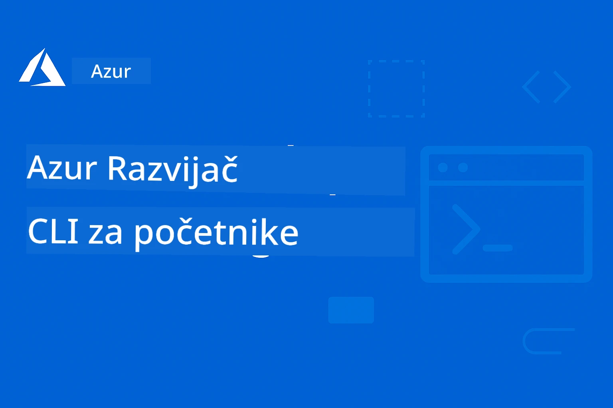

# AZD za početnike: Strukturirano putovanje učenjem

 

[](https://GitHub.com/microsoft/azd-for-beginners/watchers/)
[](https://GitHub.com/microsoft/azd-for-beginners/network/)
[](https://GitHub.com/microsoft/azd-for-beginners/stargazers/)

[](https://discord.gg/microsoft-azure)
[](https://discord.gg/nTYy5BXMWG)

---

### Automatski prijevodi (uvijek ažurirano)

<!-- CO-OP TRANSLATOR LANGUAGES TABLE START -->
[Arabic](../ar/README.md) | [Bengali](../bn/README.md) | [Bulgarian](../bg/README.md) | [Burmese (Myanmar)](../my/README.md) | [Chinese (Simplified)](../zh-CN/README.md) | [Chinese (Traditional, Hong Kong)](../zh-HK/README.md) | [Chinese (Traditional, Macau)](../zh-MO/README.md) | [Chinese (Traditional, Taiwan)](../zh-TW/README.md) | [Croatian](./README.md) | [Czech](../cs/README.md) | [Danish](../da/README.md) | [Dutch](../nl/README.md) | [Estonian](../et/README.md) | [Finnish](../fi/README.md) | [French](../fr/README.md) | [German](../de/README.md) | [Greek](../el/README.md) | [Hebrew](../he/README.md) | [Hindi](../hi/README.md) | [Hungarian](../hu/README.md) | [Indonesian](../id/README.md) | [Italian](../it/README.md) | [Japanese](../ja/README.md) | [Kannada](../kn/README.md) | [Korean](../ko/README.md) | [Lithuanian](../lt/README.md) | [Malay](../ms/README.md) | [Malayalam](../ml/README.md) | [Marathi](../mr/README.md) | [Nepali](../ne/README.md) | [Nigerian Pidgin](../pcm/README.md) | [Norwegian](../no/README.md) | [Persian (Farsi)](../fa/README.md) | [Polish](../pl/README.md) | [Portuguese (Brazil)](../pt-BR/README.md) | [Portuguese (Portugal)](../pt-PT/README.md) | [Punjabi (Gurmukhi)](../pa/README.md) | [Romanian](../ro/README.md) | [Russian](../ru/README.md) | [Serbian (Cyrillic)](../sr/README.md) | [Slovak](../sk/README.md) | [Slovenian](../sl/README.md) | [Spanish](../es/README.md) | [Swahili](../sw/README.md) | [Swedish](../sv/README.md) | [Tagalog (Filipino)](../tl/README.md) | [Tamil](../ta/README.md) | [Telugu](../te/README.md) | [Thai](../th/README.md) | [Turkish](../tr/README.md) | [Ukrainian](../uk/README.md) | [Urdu](../ur/README.md) | [Vietnamese](../vi/README.md)

> **Preferirate klonirati lokalno?**
>
> Ovaj repozitorij uključuje prijevode na 50+ jezika što značajno povećava veličinu preuzimanja. Za kloniranje bez prijevoda, koristite sparse checkout:
>
> **Bash / macOS / Linux:**
> ```bash
> git clone --filter=blob:none --sparse https://github.com/microsoft/AZD-for-beginners.git
> cd AZD-for-beginners
> git sparse-checkout set --no-cone '/*' '!translations' '!translated_images'
> ```
>
> **CMD (Windows):**
> ```cmd
> git clone --filter=blob:none --sparse https://github.com/microsoft/AZD-for-beginners.git
> cd AZD-for-beginners
> git sparse-checkout set --no-cone "/*" "!translations" "!translated_images"
> ```
>
> Ovo vam daje sve što trebate za završetak tečaja uz znatno brže preuzimanje.
<!-- CO-OP TRANSLATOR LANGUAGES TABLE END -->

## 🚀 Što je Azure Developer CLI (azd)?

**Azure Developer CLI (azd)** je korisnički alat za naredbeni redak koji developerima olakšava implementaciju aplikacija na Azure. Umjesto ručnog stvaranja i povezivanja desetaka Azure resursa, možete implementirati cijele aplikacije s jednom naredbom.

### Čarolija `azd up`

```bash
# Ova jedna naredba radi sve:
# ✅ Stvara sve Azure resurse
# ✅ Konfigurira umrežavanje i sigurnost
# ✅ Gradi kod vaše aplikacije
# ✅ Raspoređuje na Azure
# ✅ Daje vam radni URL
azd up
```

**To je to!** Nema klikanja po Azure Portalu, nema potrebe za učenjem složenih ARM predložaka, nema ručne konfiguracije - samo aplikacije koje rade na Azureu.

---

## ❓ Azure Developer CLI vs Azure CLI: Koja je razlika?

Ovo je najčešće pitanje koje početnici postavljaju. Evo jednostavnog odgovora:

| Značajka | **Azure CLI (`az`)** | **Azure Developer CLI (`azd`)** |
|---------|---------------------|--------------------------------|
| **Svrha** | Upravljanje pojedinačnim Azure resursima | Implementacija kompletnih aplikacija |
| **Pristup** | Fokus na infrastrukturu | Fokus na aplikacije |
| **Primjer** | `az webapp create --name myapp...` | `azd up` |
| **Krivulja učenja** | Potrebno znati Azure servise | Dovoljno je poznavati svoju aplikaciju |
| **Najbolje za** | DevOps, infrastruktura | Programeri, prototipiziranje |

### Jednostavna analogija

- **Azure CLI** je kao imati sve alate za gradnju kuće - čekiće, pile, čavle. Možete izgraditi bilo što, ali morate znati građevinu.
- **Azure Developer CLI** je kao da unajmite izvođača radova - vi opišete što želite, a oni se brinu o gradnji.

### Kada koristiti koji alat

| Scenarij | Koristite ovo |
|----------|---------------|
| "Želim brzo implementirati svoju web aplikaciju" | `azd up` |
| "Trebam samo stvoriti skladišni račun" | `az storage account create` |
| "Gradim kompletnu AI aplikaciju" | `azd init --template azure-search-openai-demo` |
| "Trebam otkloniti grešku na određenom Azure resursu" | `az resource show` |
| "Želim produkcijski spremnu implementaciju u minutama" | `azd up --environment production` |

### Rade zajedno!

AZD koristi Azure CLI ispod haube. Možete koristiti oba:
```bash
# Postavite svoju aplikaciju pomoću AZD
azd up

# Zatim fino podesite određene resurse pomoću Azure CLI
az webapp config set --name myapp --always-on true
```

---

## 🌟 Pronađite predloške u Awesome AZD

Nemojte počinjati od nule! **Awesome AZD** je zajednička zbirka spremnih predložaka za implementaciju:

| Resurs | Opis |
|---------|-------|
| 🔗 [**Awesome AZD galerija**](https://azure.github.io/awesome-azd/) | Pregledajte 200+ predložaka s jednim klikom implementacije |
| 🔗 [**Pošaljite predložak**](https://github.com/Azure/awesome-azd/issues) | Pridonesite vlastitim predloškom zajednici |
| 🔗 [**GitHub repozitorij**](https://github.com/Azure/awesome-azd) | Označite zvjezdicom i istražite izvorni kod |

### Popularni AI predlošci iz Awesome AZD

```bash
# RAG razgovor s Azure OpenAI + AI Search
azd init --template azure-search-openai-demo

# Brza aplikacija za AI chat
azd init --template openai-chat-app-quickstart

# AI agenti s Foundry agentima
azd init --template get-started-with-ai-agents
```

---

## 🎯 Početak u 3 koraka

### Korak 1: Instalirajte AZD (2 minute)

**Windows:**
```powershell
winget install microsoft.azd
```

**macOS:**
```bash
brew tap azure/azd && brew install azd
```

**Linux:**
```bash
curl -fsSL https://aka.ms/install-azd.sh | bash
```

### Korak 2: Prijavite se u Azure

```bash
azd auth login
```

### Korak 3: Implementirajte svoju prvu aplikaciju

```bash
# Inicijaliziraj iz predloška
azd init --template todo-nodejs-mongo

# Implementiraj na Azure (kreira sve!)
azd up
```

**🎉 To je to!** Vaša aplikacija je sada uživo na Azureu.

### Očistite (Ne zaboravite!)

```bash
# Remove all resources when done experimenting
azd down --force --purge
```

---

## 📚 Kako koristiti ovaj tečaj

Ovaj tečaj je dizajniran za **postupno učenje** - započnite tamo gdje vam je ugodno i napredujte:

| Vaše iskustvo | Počnite ovdje |
|---------------|---------------|
| **Potpuno novo u Azureu** | [Poglavlje 1: Osnove](../..) |
| **Poznajete Azure, ali ste novi u AZD-u** | [Poglavlje 1: Osnove](../..) |
| **Želite implementirati AI aplikacije** | [Poglavlje 2: AI-pristup razvoju](../..) |
| **Želite praktičnu vježbu** | [🎓 Interaktivna radionica](workshop/README.md) - vođeni laboratorij 3-4 sata |
| **Trebate produkcijske obrasce** | [Poglavlje 8: Produkcija i poduzeće](../..) |

### Brza priprema

1. **Napravite fork ovog repozitorija**: [](https://GitHub.com/microsoft/azd-for-beginners/fork)
2. **Klonirajte ga**: `git clone https://github.com/YOUR-USERNAME/azd-for-beginners.git`
3. **Potražite pomoć**: [Azure Discord zajednica](https://discord.com/invite/ByRwuEEgH4)

> **Preferirate klonirati lokalno?**

> Ovaj repozitorij uključuje prijevode na 50+ jezika što značajno povećava veličinu preuzimanja. Za kloniranje bez prijevoda, koristite sparse checkout:
> ```bash
> git clone --filter=blob:none --sparse https://github.com/microsoft/AZD-for-beginners.git
> cd AZD-for-beginners
> git sparse-checkout set --no-cone '/*' '!translations' '!translated_images'
> ```
> Ovo vam daje sve što trebate za završetak tečaja uz znatno brže preuzimanje.


## Pregled tečaja

Savladajte Azure Developer CLI (azd) kroz strukturirana poglavlja dizajnirana za postupno učenje. **Poseban fokus na implementaciju AI aplikacija s integracijom Microsoft Foundry.**

### Zašto je ovaj tečaj bitan za moderne developere

Na temelju uvida iz Microsoft Foundry Discord zajednice, **45% developera želi koristiti AZD za AI zadatke** ali se susreće s izazovima u:
- Složenim višeservisnim AI arhitekturama
- Najboljim praksama za produkcijsku implementaciju AI
- Integraciji i konfiguraciji Azure AI servisa
- Optimizaciji troškova za AI zadatke
- Otklanjanju problema specifičnih za AI implementacije

### Ciljevi učenja

Završetkom ovog strukturiranog tečaja:
- **Savladat ćete osnove AZD-a**: Temeljni koncepti, instalacija i konfiguracija
- **Implementirati AI aplikacije**: Koristiti AZD sa Microsoft Foundry servisima
- **Provesti infrastrukturu kao kod**: Upravljati Azure resursima s Bicep predlošcima
- **Otklanjati probleme implementacije**: Rješavati uobičajene poteškoće i ispravljati greške
- **Optimizirati za produkciju**: Sigurnost, skaliranje, nadzor i upravljanje troškovima
- **Izgraditi višeslojne AI sustave**: Implementirati složene AI arhitekture

## 🗺️ Karta tečaja: Brza navigacija po poglavljima

Svako poglavlje ima posvećeni README s ciljevima učenja, brzim startom i vježbama:

| Poglavlje | Tema | Lekcije | Trajanje | Kompleksnost |
|---------|-------|---------|----------|--------------|
| **[Poglavlje 1: Osnove](docs/chapter-01-foundation/README.md)** | Početak | [Osnove AZD-a](docs/chapter-01-foundation/azd-basics.md) &#124; [Instalacija](docs/chapter-01-foundation/installation.md) &#124; [Prvi projekt](docs/chapter-01-foundation/first-project.md) | 30-45 min | ⭐ |
| **[Poglavlje 2: AI razvoj](docs/chapter-02-ai-development/README.md)** | AI-prvo aplikacije | [Integracija s Foundryom](docs/chapter-02-ai-development/microsoft-foundry-integration.md) &#124; [AI agenti](docs/chapter-02-ai-development/agents.md) &#124; [Implementacija modela AI](docs/chapter-02-ai-development/ai-model-deployment.md) &#124; [Radionica](docs/chapter-02-ai-development/ai-workshop-lab.md) | 1-2 sata | ⭐⭐ |
| **[Poglavlje 3: Konfiguracija](docs/chapter-03-configuration/README.md)** | Autentikacija i sigurnost | [Konfiguracija](docs/chapter-03-configuration/configuration.md) &#124; [Autentikacija i sigurnost](docs/chapter-03-configuration/authsecurity.md) | 45-60 min | ⭐⭐ |
| **[Ch 4: Infrastruktura](docs/chapter-04-infrastructure/README.md)** | IaC & Implementacija | [Vodič za implementaciju](docs/chapter-04-infrastructure/deployment-guide.md) &#124; [Provođenje](docs/chapter-04-infrastructure/provisioning.md) | 1-1,5 sati | ⭐⭐⭐ |
| **[Ch 5: Više Agenta](docs/chapter-05-multi-agent/README.md)** | AI Rješenja za agente | [Scenarij maloprodaje](examples/retail-scenario.md) &#124; [Uzorki koordinacije](docs/chapter-06-pre-deployment/coordination-patterns.md) | 2-3 sata | ⭐⭐⭐⭐ |
| **[Ch 6: Pred-implementacija](docs/chapter-06-pre-deployment/README.md)** | Planiranje i Validacija | [Provjere prije leta](docs/chapter-06-pre-deployment/preflight-checks.md) &#124; [Planiranje kapaciteta](docs/chapter-06-pre-deployment/capacity-planning.md) &#124; [Odabir SKU](docs/chapter-06-pre-deployment/sku-selection.md) &#124; [App Insights](docs/chapter-06-pre-deployment/application-insights.md) | 1 sat | ⭐⭐ |
| **[Ch 7: Otklanjanje poteškoća](docs/chapter-07-troubleshooting/README.md)** | Otklanjanje pogrešaka i popravak | [Uobičajeni problemi](docs/chapter-07-troubleshooting/common-issues.md) &#124; [Otklanjanje pogrešaka](docs/chapter-07-troubleshooting/debugging.md) &#124; [AI problemi](docs/chapter-07-troubleshooting/ai-troubleshooting.md) | 1-1,5 sati | ⭐⭐ |
| **[Ch 8: Proizvodnja](docs/chapter-08-production/README.md)** | Poduzećni uzorci | [Prakse proizvodnje](docs/chapter-08-production/production-ai-practices.md) | 2-3 sata | ⭐⭐⭐⭐ |
| **[🎓 Radionica](workshop/README.md)** | Praktični laboratorij | [Uvod](workshop/docs/instructions/0-Introduction.md) &#124; [Odabir](workshop/docs/instructions/1-Select-AI-Template.md) &#124; [Validacija](workshop/docs/instructions/2-Validate-AI-Template.md) &#124; [Razgradnja](workshop/docs/instructions/3-Deconstruct-AI-Template.md) &#124; [Konfiguracija](workshop/docs/instructions/4-Configure-AI-Template.md) &#124; [Prilagodba](workshop/docs/instructions/5-Customize-AI-Template.md) &#124; [Rastavljanje](workshop/docs/instructions/6-Teardown-Infrastructure.md) &#124; [Zaključno](workshop/docs/instructions/7-Wrap-up.md) | 3-4 sata | ⭐⭐ |

**Ukupno trajanje tečaja:** ~10-14 sati | **Napredovanje vještina:** Početnik → Spreman za proizvodnju

---

## 📚 Poglavlja za učenje

*Odaberite svoj put učenja ovisno o razini iskustva i ciljevima*

### 🚀 Poglavlje 1: Osnove i Brzi Start
**Preduvjeti**: pretplata na Azure, osnovno poznavanje naredbenog retka  
**Trajanje**: 30-45 minuta  
**Složenost**: ⭐

#### Što ćete naučiti
- Osnove Azure Developer CLI-a
- Instalacija AZD na vašoj platformi
- Vaša prva uspješna implementacija

#### Resursi za učenje
- **🎯 Početak ovdje**: [Što je Azure Developer CLI?](../..)
- **📖 Teorija**: [AZD Osnove](docs/chapter-01-foundation/azd-basics.md) - Temeljni pojmovi i terminologija
- **⚙️ Postavljanje**: [Instalacija i podešavanje](docs/chapter-01-foundation/installation.md) - Vodiči specifični za platformu
- **🛠️ Praktično**: [Vaš prvi projekt](docs/chapter-01-foundation/first-project.md) - Korak-po-korak tutorijal
- **📋 Brzi referentni vodič**: [Varalica za naredbe](resources/cheat-sheet.md)

#### Praktične vježbe
```bash
# Brza provjera instalacije
azd version

# Postavite svoju prvu aplikaciju
azd init --template todo-nodejs-mongo
azd up
```

**💡 Ishod poglavlja**: Uspješno implementirajte jednostavnu web aplikaciju na Azure koristeći AZD

**✅ Potvrda uspjeha:**
```bash
# Nakon dovršetka Poglavlja 1, trebali biste moći:
azd version              # Prikazuje instaliranu verziju
azd init --template todo-nodejs-mongo  # Inicijalizira projekt
azd up                  # Postavlja na Azure
azd show                # Prikazuje URL pokrenute aplikacije
# Aplikacija se otvara u pregledniku i radi
azd down --force --purge  # Čisti resurse
```

**📊 Vrijeme ulaganja:** 30-45 minuta  
**📈 Razina vještine nakon:** Samostalno može implementirati osnovne aplikacije

**✅ Potvrda uspjeha:**
```bash
# Nakon dovršetka 1. poglavlja, trebali biste moći:
azd version              # Prikazuje instaliranu verziju
azd init --template todo-nodejs-mongo  # Inicijalizira projekt
azd up                  # Raspoređuje na Azure
azd show                # Prikazuje URL pokrenute aplikacije
# Aplikacija se otvara u pregledniku i radi
azd down --force --purge  # Čisti resurse
```

**📊 Vrijeme ulaganja:** 30-45 minuta  
**📈 Razina vještine nakon:** Samostalno može implementirati osnovne aplikacije

---

### 🤖 Poglavlje 2: AI-First Razvoj (Preporučeno za AI developere)
**Preduvjeti**: Poglavlje 1 završeno  
**Trajanje**: 1-2 sata  
**Složenost**: ⭐⭐

#### Što ćete naučiti
- Microsoft Foundry integracija s AZD-om
- Implementacija AI-pokretanih aplikacija
- Razumijevanje konfiguracija AI servisa

#### Resursi za učenje
- **🎯 Početak ovdje**: [Microsoft Foundry integracija](docs/chapter-02-ai-development/microsoft-foundry-integration.md)
- **🤖 AI agenti**: [Vodič za AI agente](docs/chapter-02-ai-development/agents.md) - Implementacija inteligentnih agenata s AZD-om
- **📖 Uzorci**: [Implementacija AI modela](docs/chapter-02-ai-development/ai-model-deployment.md) - Implementacija i upravljanje AI modelima
- **🛠️ Radionica**: [AI radionica](docs/chapter-02-ai-development/ai-workshop-lab.md) - Pripremite svoja AI rješenja za AZD
- **🎥 Interaktivni vodič**: [Materijali radionice](workshop/README.md) - Učenje u pregledniku s MkDocs * DevContainer okruženje
- **📋 Predlošci**: [Microsoft Foundry predlošci](../..)
- **📝 Primjeri**: [Primjeri AZD implementacija](examples/README.md)

#### Praktične vježbe
```bash
# Postavite svoju prvu AI aplikaciju
azd init --template azure-search-openai-demo
azd up

# Isprobajte dodatne AI predloške
azd init --template openai-chat-app-quickstart
azd init --template agent-openai-python-prompty
```

**💡 Ishod poglavlja**: Implementirajte i konfigurirajte AI-pokretanu chat aplikaciju s RAG mogućnostima

**✅ Potvrda uspjeha:**
```bash
# Nakon Poglavlja 2, trebali biste moći:
azd init --template azure-search-openai-demo
azd up
# Testirati AI chat sučelje
# Postavljati pitanja i dobivati odgovore pokretane AI uz izvore
# Provjeriti radi li integracija pretraživanja
azd monitor  # Provjeriti prikazuje li Application Insights telemetriju
azd down --force --purge
```

**📊 Vrijeme ulaganja:** 1-2 sata  
**📈 Razina vještine nakon:** Može implementirati i konfigurirati AI aplikacije spremne za proizvodnju  
**💰 Svijest o troškovima:** Razumijevanje razvojnih troškova $80-150/mj, troškova proizvodnje $300-3500/mj

#### 💰 Troškovi pri implementaciji AI rješenja

**Razvojno okruženje (Procijenjeno $80-150/mj):**
- Azure OpenAI (plaćanje prema upotrebi): $0-50/mj (ovisno o broju tokena)
- AI Search (osnovni nivo): $75/mj
- Container Apps (potrošnja): $0-20/mj
- Spremište (standard): $1-5/mj

**Proizvodno okruženje (Procijenjeno $300-3.500+/mj):**
- Azure OpenAI (PTU za dosljedne performanse): $3,000+/mj ILI plaćanje prema upotrebi s velikim volumenom
- AI Search (standardni nivo): $250/mj
- Container Apps (posvećeni): $50-100/mj
- Application Insights: $5-50/mj
- Spremište (premium): $10-50/mj

**💡 Savjeti za optimizaciju troškova:**
- Koristite **besplatni nivo** Azure OpenAI za učenje (uključeno 50.000 tokena/mj)
- Pokrenite `azd down` za osloboditi resurse kad ne radite aktivno
- Počnite s potrošnjom temeljenim obračunom, nadogradite na PTU samo za proizvodnju
- Koristite `azd provision --preview` za procjenu troškova prije implementacije
- Uključite automatsko skaliranje: plaćate samo za stvarnu upotrebu

**Praćenje troškova:**
```bash
# Provjerite procijenjene mjesečne troškove
azd provision --preview

# Pratite stvarne troškove u Azure Portalu
az consumption budget list --resource-group <your-rg>
```

---

### ⚙️ Poglavlje 3: Konfiguracija i Autentifikacija
**Preduvjeti**: Poglavlje 1 završeno  
**Trajanje**: 45-60 minuta  
**Složenost**: ⭐⭐

#### Što ćete naučiti
- Konfiguracija i upravljanje okruženjem
- Autentifikacija i sigurnosne najbolje prakse
- Imenovanje i organizacija resursa

#### Resursi za učenje
- **📖 Konfiguracija**: [Vodič za konfiguraciju](docs/chapter-03-configuration/configuration.md) - Podešavanje okruženja
- **🔐 Sigurnost**: [Uzorci autentifikacije i upravljani identitet](docs/chapter-03-configuration/authsecurity.md) - Uzorci autentifikacije
- **📝 Primjeri**: [Primjer baze podataka](examples/database-app/README.md) - Primjeri baze podataka s AZD-om

#### Praktične vježbe
- Konfigurirajte više okruženja (razvoj, test, proizvodnja)
- Postavite autentifikaciju s upravljanim identitetom
- Implementirajte konfiguracije specifične za okruženje

**💡 Ishod poglavlja**: Upravljajte s više okruženja s pravom autentifikacijom i sigurnošću

---

### 🏗️ Poglavlje 4: Infrastruktura kao kod i implementacija
**Preduvjeti**: Poglavlja 1-3 završena  
**Trajanje**: 1-1,5 sati  
**Složenost**: ⭐⭐⭐

#### Što ćete naučiti
- Napredni uzorci implementacije
- Infrastruktura kao kod s Bicep-om
- Strategije provođenja resursa

#### Resursi za učenje
- **📖 Implementacija**: [Vodič za implementaciju](docs/chapter-04-infrastructure/deployment-guide.md) - Potpuni radni tokovi
- **🏗️ Provođenje**: [Provođenje resursa](docs/chapter-04-infrastructure/provisioning.md) - Upravljanje Azure resursima
- **📝 Primjeri**: [Primjer Container App](../../examples/container-app) - Implementacije u kontejnerima

#### Praktične vježbe
- Kreirajte prilagođene Bicep predloške
- Implementirajte aplikacije s više usluga
- Primijenite strategije implementacije plavo-zelena

**💡 Ishod poglavlja**: Implementirajte složene aplikacije s više usluga koristeći prilagođene infrastrukturne predloške

---

### 🎯 Poglavlje 5: Višeagentna AI rješenja (Napredno)
**Preduvjeti**: Poglavlja 1-2 završena  
**Trajanje**: 2-3 sata  
**Složenost**: ⭐⭐⭐⭐

#### Što ćete naučiti
- Uzorci arhitekture s više agenata
- Orkestracija i koordinacija agenata
- AI implementacije spremne za proizvodnju

#### Resursi za učenje
- **🤖 Istaknuti projekt**: [Rješenje s više agenata za maloprodaju](examples/retail-scenario.md) - Potpuna implementacija
- **🛠️ ARM predlošci**: [ARM paket predložaka](../../examples/retail-multiagent-arm-template) - Jedan klik implementacija
- **📖 Arhitektura**: [Uzorci koordinacije više agenata](docs/chapter-06-pre-deployment/coordination-patterns.md) - Uzorci

#### Praktične vježbe
```bash
# Implementirajte cjelovito maloprodajno rješenje s više agenata
cd examples/retail-multiagent-arm-template
./deploy.sh

# Istražite konfiguracije agenata
az deployment group show --resource-group <rg-name> --name <deployment-name>
```

**💡 Ishod poglavlja**: Implementirajte i upravljajte proizvodnim AI rješenjem s više agenata sa agentima za kupce i inventar

---

### 🔍 Poglavlje 6: Validacija i planiranje prije implementacije
**Preduvjeti**: Poglavlje 4 završeno  
**Trajanje**: 1 sat  
**Složenost**: ⭐⭐

#### Što ćete naučiti
- Planiranje kapaciteta i validacija resursa
- Strategije odabira SKU-a
- Provjere prije implementacije i automatizacija

#### Resursi za učenje
- **📊 Planiranje**: [Planiranje kapaciteta](docs/chapter-06-pre-deployment/capacity-planning.md) - Validacija resursa
- **💰 Odabir**: [Odabir SKU](docs/chapter-06-pre-deployment/sku-selection.md) - Troškovno učinkoviti izbori
- **✅ Validacija**: [Provjere prije implementacije](docs/chapter-06-pre-deployment/preflight-checks.md) - Automatizirani skripti

#### Praktične vježbe
- Pokrenite skripte za validaciju kapaciteta
- Optimizirajte odabir SKU-a za troškove
- Implementirajte automatizirane provjere prije implementacije

**💡 Ishod poglavlja**: Validirajte i optimizirajte implementacije prije izvođenja

---

### 🚨 Poglavlje 7: Otklanjanje poteškoća i otklanjanje grešaka
**Preduvjeti**: Završeno bilo koje poglavlje o implementaciji  
**Trajanje**: 1-1,5 sati  
**Složenost**: ⭐⭐

#### Što ćete naučiti
- Sistematski pristupi otklanjanju grešaka
- Uobičajeni problemi i rješenja
- Specifično otklanjanje problema kod AI

#### Resursi za učenje
- **🔧 Česti problemi**: [Česti problemi](docs/chapter-07-troubleshooting/common-issues.md) - Česta pitanja i rješenja
- **🕵️ Otklanjanje grešaka**: [Vodič za otklanjanje pogrešaka](docs/chapter-07-troubleshooting/debugging.md) - Strategije korak po korak
- **🤖 AI problemi**: [Otklanjanje problema specifičnih za AI](docs/chapter-07-troubleshooting/ai-troubleshooting.md) - Problemi AI servisa

#### Praktične vježbe
- Dijagnosticirajte neuspjele implementacije
- Riješite probleme s autentifikacijom
- Otklonite greške u povezivanju AI servisa

**💡 Ishod poglavlja**: Samostalno dijagnosticirajte i riješite uobičajene probleme s implementacijom

---

### 🏢 Poglavlje 8: Proizvodni i poduzećni uzorci
**Preduvjeti**: Poglavlja 1-4 završena  
**Trajanje**: 2-3 sata  
**Složenost**: ⭐⭐⭐⭐

#### Što ćete naučiti
- Strategije proizvodne implementacije
- Sigurnosni uzorci za poduzeća
- Praćenje i optimizacija troškova

#### Resursi za učenje
- **🏭 Proizvodnja**: [Najbolje prakse AI u proizvodnji](docs/chapter-08-production/production-ai-practices.md) - Poduzećni uzorci
- **📝 Primjeri**: [Primjer mikroservisa](../../examples/microservices) - Složene arhitekture
- **📊 Praćenje**: [Integracija Application Insights](docs/chapter-06-pre-deployment/application-insights.md) - Praćenje

#### Praktične vježbe
- Implementirajte sigurnosne uzorke za poduzeća
- Postavite sveobuhvatno praćenje
- Implementirajte u proizvodno okruženje uz odgovarajuće upravljanje

**💡 Ishod poglavlja**: Implementirajte aplikacije spremne za poduzeće sa svim proizvodnim mogućnostima

---

## 🎓 Pregled radionice: Praktično iskustvo učenja

> **⚠️ STATUS RADIONICE: Aktivni razvoj**  
> Materijali radionice su trenutno u fazi razvoja i dorade. Jezgreni moduli su funkcionalni, ali neke napredne sekcije su nepotpune. Aktivno radimo na dovršetku cjelokupnog sadržaja. [Prati napredak →](workshop/README.md)

### Interaktivni materijali radionice
**Sveobuhvatno praktično učenje s alatima u pregledniku i vođenim vježbama**

Naši materijali radionice pružaju strukturirano, interaktivno iskustvo učenja koje nadopunjuje kurikulum temeljen na poglavljima iznad. Radionica je dizajnirana za učenje vlastitim tempom kao i za sesije vođene od strane instruktora.

#### 🛠️ Značajke radionice
- **Sučelje u pregledniku**: Kompletna radionica temeljena na MkDocs s pretraživanjem, kopiranjem i značajkama tema
- **Integracija GitHub Codespaces**: Postavljanje okruženja za razvoj jednim klikom
- **Strukturirana putanja učenja**: 8-modulne vođene vježbe (ukupno 3-4 sata)
- **Progresivna metodologija**: Uvod → Odabir → Validacija → Rastavljanje → Konfiguracija → Prilagodba → Razgradnja → Zaključak
- **Interaktivno DevContainer okruženje**: Predkonfigurirani alati i ovisnosti

#### 📚 Struktura modula radionice
Radionica prati **8-modulnu progresivnu metodologiju** koja vas vodi od otkrivanja do ovladavanja implementacijom:

| Modul | Tema | Što ćete raditi | Trajanje |
|--------|-------|----------------|----------|
| **0. Uvod** | Pregled radionice | Razumjeti ciljeve učenja, preduvjete i strukturu radionice | 15 min |
| **1. Odabir** | Otkrivanje predložaka | Istražiti AZD predloške i odabrati pravi AI predložak za vaš scenarij | 20 min |
| **2. Validacija** | Implementacija i provjera | Implementirati predložak s `azd up` i potvrditi da infrastruktura radi | 30 min |
| **3. Rastavljanje** | Razumijevanje strukture | Koristiti GitHub Copilot za istraživanje arhitekture predloška, Bicep datoteka i organizaciju koda | 30 min |
| **4. Konfiguracija** | dubinska analiza azure.yaml | Ovladati konfiguracijom `azure.yaml`, lifecycle hookovima i varijablama okruženja | 30 min |
| **5. Prilagodba** | Učinite ga svojim | Omogućiti AI Pretraživanje, praćenje, evaluaciju i prilagoditi za vaš scenarij | 45 min |
| **6. Razgradnja** | Čišćenje | Sigurno ukloniti resurse pomoću `azd down --purge` | 15 min |
| **7. Zaključak** | Sljedeći koraci | Pregledati postignuća, ključne koncepte i nastaviti svoje učenje | 15 min |

**Tijek radionice:**
```
Introduction → Selection → Validation → Deconstruction → Configuration → Customization → Teardown → Wrap-up
     ↓            ↓           ↓              ↓               ↓              ↓            ↓           ↓
  Overview    Find the     Deploy &      Explore        Master         Customize     Clean up    Review &
             right        verify        code &        azure.yaml      for your      resources   next steps
             template                   structure                     scenario
```

#### 🚀 Početak radionice
```bash
# Opcija 1: GitHub Codespaces (Preporučeno)
# Kliknite "Code" → "Create codespace on main" u spremištu

# Opcija 2: Lokalni razvoj
git clone https://github.com/microsoft/azd-for-beginners.git
cd azd-for-beginners/workshop
# Slijedite upute za postavljanje u workshop/README.md
```

#### 🎯 Ishodi učenja radionice
Dovršetkom radionice, sudionici će:
- **Implementirati AI aplikacije u produkciju**: Koristiti AZD s Microsoft Foundry uslugama
- **Ovladati arhitekturama s više agenata**: Implementirati koordinirane AI rješenja s agentima
- **Primijeniti najbolje sigurnosne prakse**: Konfigurirati autentikaciju i kontrolu pristupa
- **Optimizirati za skalabilnost**: Dizajnirati isplative i visoko-performantne implementacije
- **Rješavati probleme implementacija**: Samostalno rješavati česte probleme

#### 📖 Resursi radionice
- **🎥 Interaktivni vodič**: [Materijali radionice](workshop/README.md) - okruženje za učenje u pregledniku
- **📋 Upute po modulima**:
  - [0. Uvod](workshop/docs/instructions/0-Introduction.md) - pregled i ciljevi radionice
  - [1. Odabir](workshop/docs/instructions/1-Select-AI-Template.md) - pronalaženje i odabir AI predložaka
  - [2. Validacija](workshop/docs/instructions/2-Validate-AI-Template.md) - implementacija i provjera predložaka
  - [3. Rastavljanje](workshop/docs/instructions/3-Deconstruct-AI-Template.md) - istraživanje arhitekture predloška
  - [4. Konfiguracija](workshop/docs/instructions/4-Configure-AI-Template.md) - ovladavanje azure.yaml
  - [5. Prilagodba](workshop/docs/instructions/5-Customize-AI-Template.md) - prilagodba za vaš scenarij
  - [6. Razgradnja](workshop/docs/instructions/6-Teardown-Infrastructure.md) - čišćenje resursa
  - [7. Zaključak](workshop/docs/instructions/7-Wrap-up.md) - pregled i sljedeći koraci
- **🛠️ AI radionica laboratorij**: [AI Workshop Lab](docs/chapter-02-ai-development/ai-workshop-lab.md) - vježbe usmjerene na AI
- **💡 Brzi početak**: [Vodič za postavljanje radionice](workshop/README.md#quick-start) - konfiguracija okruženja

**Savršeno za**: korporativnu edukaciju, univerzitetske kolegije, učenje vlastitim tempom i bootcampove za developere.

---

## 📖 Dubinski uvid: AZD mogućnosti

Osim osnova, AZD pruža moćne značajke za produkcijske implementacije:

- **Implementacije temeljene na predlošcima** - Koristite predloške za uobičajene obrasce aplikacija
- **Infrastruktura kao kod** - Upravljajte Azure resursima koristeći Bicep ili Terraform  
- **Integrirani tijekovi rada** - Besprijekorno uvodite, implementirajte i pratite aplikacije
- **Prijateljski za developere** - Optimizirano za produktivnost i iskustvo developera

### **AZD + Microsoft Foundry: savršeno za AI implementacije**

**Zašto AZD za AI rješenja?** AZD rješava najveće izazove s kojima se AI developeri suočavaju:

- **AI-pripremljeni predlošci** - Predkonfigurirani predlošci za Azure OpenAI, Cognitive Services i ML zadatke
- **Sigurne AI implementacije** - Ugrađeni sigurnosni obrasci za AI usluge, API ključeve i model endpointove  
- **Produkcijski AI obrasci** - Najbolje prakse za skalabilne i isplative AI aplikacije
- **End-to-End AI tijekovi rada** - Od razvoja modela do produkcijske implementacije uz odgovarajuće praćenje
- **Optimizacija troškova** - Pametna alokacija resursa i strategije skaliranja za AI zadatke
- **Integracija Microsoft Foundry** - Besprijekorna veza s Microsoft Foundry katalogom modela i endpointima

---

## 🎯 Biblioteka predložaka i primjera

### Izdvojeno: Microsoft Foundry predlošci
**Počnite ovdje ako implementirate AI aplikacije!**

> **Napomena:** Ovi predlošci demonstriraju razne AI obrasce. Neki su vanjski Azure primjeri, drugi lokalne implementacije.

| Predložak | Poglavlje | Kompleksnost | Usluge | Vrsta |
|----------|---------|------------|----------|------|
| [**Get started with AI chat**](https://github.com/Azure-Samples/get-started-with-ai-chat) | Poglavlje 2 | ⭐⭐ | AzureOpenAI + Azure AI Model Inference API + Azure AI Search + Azure Container Apps + Application Insights | Vanjski |
| [**Get started with AI agents**](https://github.com/Azure-Samples/get-started-with-ai-agents) | Poglavlje 2 | ⭐⭐ | Foundry Agents + AzureOpenAI + Azure AI Search + Azure Container Apps + Application Insights| Vanjski |
| [**Azure Search + OpenAI Demo**](https://github.com/Azure-Samples/azure-search-openai-demo) | Poglavlje 2 | ⭐⭐ | AzureOpenAI + Azure AI Search + App Service + Storage | Vanjski |
| [**OpenAI Chat App Quickstart**](https://github.com/Azure-Samples/openai-chat-app-quickstart) | Poglavlje 2 | ⭐ | AzureOpenAI + Container Apps + Application Insights | Vanjski |
| [**Agent OpenAI Python Prompty**](https://github.com/Azure-Samples/agent-openai-python-prompty) | Poglavlje 5 | ⭐⭐⭐ | AzureOpenAI + Azure Functions + Prompty | Vanjski |
| [**Contoso Chat RAG**](https://github.com/Azure-Samples/contoso-chat) | Poglavlje 8 | ⭐⭐⭐⭐ | AzureOpenAI + AI Search + Cosmos DB + Container Apps | Vanjski |
| [**Retail Multi-Agent Solution**](examples/retail-scenario.md) | Poglavlje 5 | ⭐⭐⭐⭐ | AzureOpenAI + AI Search + Storage + Container Apps + Cosmos DB | **Lokalno** |

### Izdvojeno: Kompleti scenarija za učenje
**Predlošci aplikacija spremni za produkciju povezani s poglavljima učenja**

| Predložak | Poglavlje za učenje | Kompleksnost | Ključ za učenje |
|----------|------------------|------------|--------------|
| [**openai-chat-app-quickstart**](https://github.com/Azure-Samples/openai-chat-app-quickstart) | Poglavlje 2 | ⭐ | Osnovni obrasci AI implementacije |
| [**azure-search-openai-demo**](https://github.com/Azure-Samples/azure-search-openai-demo) | Poglavlje 2 | ⭐⭐ | RAG implementacija s Azure AI Search |
| [**ai-document-processing**](https://github.com/Azure-Samples/ai-document-processing) | Poglavlje 4 | ⭐⭐ | Integracija inteligencije dokumenata |
| [**agent-openai-python-prompty**](https://github.com/Azure-Samples/agent-openai-python-prompty) | Poglavlje 5 | ⭐⭐⭐ | Okvir agenata i pozivanje funkcija |
| [**contoso-chat**](https://github.com/Azure-Samples/contoso-chat) | Poglavlje 8 | ⭐⭐⭐ | Orkestracija poduzeća AI |
| [**retail-multi-agent-solution**](examples/retail-scenario.md) | Poglavlje 5 | ⭐⭐⭐⭐ | Arhitektura više agenata s agentima za kupce i inventar |

### Učenje putem primjera prema tipu

> **📌 Lokalni vs. Vanjski primjeri:**  
> **Lokalni primjeri** (u ovom repozitoriju) = Spremni za korištenje odmah  
> **Vanjski primjeri** (Azure uzorci) = Klonirati iz povezanih repozitorija

#### Lokalni primjeri (spremni za korištenje)
- [**Retail Multi-Agent Solution**](examples/retail-scenario.md) - Potpuna produkcijska implementacija s ARM predlošcima
  - Arhitektura s više agenata (agent Kupac + agent Inventar)
  - Sveobuhvatno praćenje i evaluacija
  - Jednim klikom implementacija preko ARM predloška

#### Lokalni primjeri - Container aplikacije (poglavlja 2-5)
**Sveobuhvatni primjeri implementacije kontejnera u ovom repozitoriju:**
- [**Primjeri Container aplikacija**](examples/container-app/README.md) - Potpuni vodič za implementaciju kontejneriziranih aplikacija
  - [Jednostavan Flask API](../../examples/container-app/simple-flask-api) - Osnovni REST API s skaliranjem na nulu
  - [Mikroservisna arhitektura](../../examples/container-app/microservices) - Produkcijska multi-servisna implementacija
  - Primjeri brzog početka, produkcije i naprednih obrazaca
  - Smjernice za praćenje, sigurnost i optimizaciju troškova

#### Vanjski primjeri - Jednostavne aplikacije (poglavlja 1-2)
**Klonirajte ove Azure uzorke za početak:**
- [Jednostavna web aplikacija - Node.js + MongoDB](https://github.com/Azure-Samples/todo-nodejs-mongo) - Osnovni obrasci implementacije
- [Statistička web stranica - React SPA](https://github.com/Azure-Samples/todo-csharp-sql-swa-func) - Implementacija statičkog sadržaja
- [Container aplikacija - Python Flask](https://github.com/Azure-Samples/container-apps-store-api-microservice) - REST API implementacija

#### Vanjski primjeri - Integracija baze podataka (poglavlja 3-4)  
- [Baza podataka aplikacija - C# + SQL](https://github.com/Azure-Samples/todo-csharp-sql) - Obrasci povezivanja baze podataka
- [Funkcije + Cosmos DB](https://github.com/Azure-Samples/todo-python-mongo-swa-func) - Serverless tijek rada s podacima

#### Vanjski primjeri - Napredni obrasci (poglavlja 4-8)
- [Java mikroservisi](https://github.com/Azure-Samples/java-microservices-aca-lab) - Multi-servisne arhitekture
- [Container Apps Jobs](https://github.com/Azure-Samples/container-apps-jobs) - Obrada u pozadini  
- [Enterprise ML Pipeline](https://github.com/Azure-Samples/mlops-v2) - Produkcijski ML obrasci

### Vanjske kolekcije predložaka
- [**Službena galerija AZD predložaka**](https://azure.github.io/awesome-azd/) - Kurirana kolekcija službenih i zajedničkih predložaka
- [**Azure Developer CLI predlošci**](https://learn.microsoft.com/en-us/azure/developer/azure-developer-cli/azd-templates) - Microsoft Learn dokumentacija predložaka
- [**Direktorij primjera**](examples/README.md) - Lokalni primjeri učenja s detaljnim objašnjenjima

---

## 📚 Resursi za učenje i reference

### Brze reference
- [**Lista komandi**](resources/cheat-sheet.md) - Najvažnije azd komande organizirane po poglavljima
- [**Rječnik pojmova**](resources/glossary.md) - Terminologija Azure i azd  
- [**Često postavljana pitanja**](resources/faq.md) - Česta pitanja organizirana po poglavljima učenja
- [**Priručnik za učenje**](resources/study-guide.md) - Sveobuhvatne praktične vježbe

### Praktične radionice
- [**AI Workshop Lab**](docs/chapter-02-ai-development/ai-workshop-lab.md) - Omogućite da vaša AI rješenja budu implementirana s AZD (2-3 sata)
- [**Interaktivna radionica**](workshop/README.md) - 8-modulne vođene vježbe s MkDocs i GitHub Codespaces
  - Slijedi: Uvod → Odabir → Validacija → Rastavljanje → Konfiguracija → Prilagodba → Razgradnja → Zaključak

### Vanjski resursi za učenje
- [Azure Developer CLI dokumentacija](https://learn.microsoft.com/en-us/azure/developer/azure-developer-cli/)
- [Azure Architecture Center](https://learn.microsoft.com/en-us/azure/architecture/)
- [Azure kalkulator cijena](https://azure.microsoft.com/pricing/calculator/)
- [Azure status](https://status.azure.com/)

---

## 🔧 Brzi vodič za rješavanje problema

**Česti problemi na koje početnici nailaze i brza rješenja:**

<details>
<summary><strong>❌ "azd: command not found"</strong></summary>

```bash
# Prvo instalirajte AZD
# Windows (PowerShell):
winget install microsoft.azd

# macOS:
brew tap azure/azd && brew install azd

# Linux:
curl -fsSL https://aka.ms/install-azd.sh | bash

# Provjerite instalaciju
azd version
```
</details>

<details>
<summary><strong>❌ "Nije pronađena pretplata" ili "Pretplata nije postavljena"</strong></summary>

```bash
# Nabrojite dostupne pretplate
az account list --output table

# Postavi zadanu pretplatu
az account set --subscription "<subscription-id-or-name>"

# Postavi za AZD okruženje
azd env set AZURE_SUBSCRIPTION_ID "<subscription-id>"

# Provjeri
az account show
```
</details>
<details>
<summary><strong>❌ "Nedostatak kvote" ili "Kota premašen"</strong></summary>

```bash
# Isprobajte različitu Azure regiju
azd env set AZURE_LOCATION "westus2"
azd up

# Ili koristite manje SKU-ove u razvoju
# Uredite infra/main.parameters.json:
{
  "sku": "B1"  // Instead of "P1V2"
}
```
</details>

<details>
<summary><strong>❌ "azd up" ne uspijeva polovinom procesa</strong></summary>

```bash
# Opcija 1: Očisti i pokušaj ponovno
azd down --force --purge
azd up

# Opcija 2: Samo popravi infrastrukturu
azd provision

# Opcija 3: Provjeri detaljni status
azd show

# Opcija 4: Provjeri zapisnike u Azure Monitoru
azd monitor --logs
```
</details>

<details>
<summary><strong>❌ "Neuspješna autentikacija" ili "Token istekao"</strong></summary>

```bash
# Ponovno se autentificirajte
az logout
az login

azd auth logout
azd auth login

# Potvrdite autentifikaciju
az account show
```
</details>

<details>
<summary><strong>❌ "Resurs već postoji" ili sukobi u imenovanju</strong></summary>

```bash
# AZD generira jedinstvena imena, ali ako dođe do sukoba:
azd down --force --purge

# Zatim pokušajte ponovno s novim okruženjem
azd env new dev-v2
azd up
```
</details>

<details>
<summary><strong>❌ Predložak za implementaciju traje predugo</strong></summary>

**Normalna vremena čekanja:**
- Jednostavna web aplikacija: 5-10 minuta
- Aplikacija s bazom podataka: 10-15 minuta
- AI aplikacije: 15-25 minuta (Provisioniranje OpenAI-ja je sporo)

```bash
# Provjerite napredak
azd show

# Ako ste zaglavili >30 minuta, provjerite Azure portal:
azd monitor
# Tražite neuspjele implementacije
```
</details>

<details>
<summary><strong>❌ "Dozvola odbijena" ili "Zabranjeno"</strong></summary>

```bash
# Provjerite svoju Azure ulogu
az role assignment list --assignee $(az account show --query user.name -o tsv)

# Potrebna vam je barem uloga "Contributor"
# Zamolite svog Azure administratora da dodijeli:
# - Contributor (za resurse)
# - User Access Administrator (za dodjele uloga)
```
</details>

<details>
<summary><strong>❌ Ne može pronaći URL implementirane aplikacije</strong></summary>

```bash
# Prikaži sve krajnje točke usluge
azd show

# Ili otvorite Azure Portal
azd monitor

# Provjeri određenu uslugu
azd env get-values
# Potraži *_URL varijable
```
</details>

### 📚 Kompletniji resursi za rješavanje problema

- **Vodič za uobičajene probleme:** [Detaljna rješenja](docs/chapter-07-troubleshooting/common-issues.md)
- **Problemi specifični za AI:** [Rješavanje problema s AI](docs/chapter-07-troubleshooting/ai-troubleshooting.md)
- **Vodič za otklanjanje pogrešaka:** [Korak po korak otklanjanje pogrešaka](docs/chapter-07-troubleshooting/debugging.md)
- **Potražite pomoć:** [Azure Discord](https://discord.gg/microsoft-azure) #azure-developer-cli

---

## 🎓 Završetak tečaja i certifikacija

### Praćenje napretka
Pratite svoj napredak kroz svaki glavni dio:

- [ ] **Poglavlje 1**: Osnove i brzo pokretanje ✅
- [ ] **Poglavlje 2**: AI-prvo razvijanje ✅  
- [ ] **Poglavlje 3**: Konfiguracija i autentikacija ✅
- [ ] **Poglavlje 4**: Infrastruktura kao kod i implementacija ✅
- [ ] **Poglavlje 5**: Višeagentna AI rješenja ✅
- [ ] **Poglavlje 6**: Validacija i planiranje prije implementacije ✅
- [ ] **Poglavlje 7**: Rješavanje problema i otklanjanje pogrešaka ✅
- [ ] **Poglavlje 8**: Produkcijski i enterprise obrasci ✅

### Provjera znanja
Nakon završetka svakog poglavlja, provjerite svoje znanje tako da:
1. **Praktična vježba**: Završite praktičnu implementaciju iz poglavlja
2. **Test znanja**: Pregledajte sekciju često postavljanih pitanja za svoje poglavlje
3. **Razgovor u zajednici**: Podijelite svoje iskustvo u Azure Discord zajednici
4. **Sljedeće poglavlje**: Prijeđite na sljedeću razinu složenosti

### Prednosti završetka tečaja
Nakon što završite sva poglavlja, imat ćete:
- **Iskustvo iz produkcije**: Implementirane stvarne AI aplikacije u Azure
- **Profesionalne vještine**: Sposobnost implementacije spremne za poduzeća  
- **Priznanje u zajednici**: Aktivno članstvo u Azure razvojnoj zajednici
- **Napredak u karijeri**: Tražene vještine AZD i AI implementacije

---

## 🤝 Zajednica i podrška

### Dobivanje pomoći i podrške
- **Tehnički problemi**: [Prijavite greške i zatražite značajke](https://github.com/microsoft/azd-for-beginners/issues)
- **Pitanja o učenju**: [Microsoft Azure Discord zajednica](https://discord.gg/microsoft-azure) i [](https://discord.gg/nTYy5BXMWG)
- **Pomoć vezana uz AI**: Pridružite se [](https://discord.gg/nTYy5BXMWG)
- **Dokumentacija**: [Službena Azure Developer CLI dokumentacija](https://learn.microsoft.com/en-us/azure/developer/azure-developer-cli/)

### Uvidi zajednice iz Microsoft Foundry Discorda

**Nedavni rezultati ankete s #Azure kanala:**
- **45%** programera želi koristiti AZD za AI zadatke
- **Glavni izazovi**: Implementacije više servisa, upravljanje vjerodajnicama, spremnost za produkciju  
- **Najtraženije**: AI-specifični predlošci, vodiči za rješavanje problema, najbolje prakse

**Pridružite se našoj zajednici da:**
- Podijelite svoja AZD + AI iskustva i dobijete pomoć
- Pristupite prvim prikazima novih AI predložaka
- Doprinesete najboljim praksama u AI implementaciji
- Utječete na budući razvoj AI + AZD značajki

### Doprinos tečaju
Dobrodošli su doprinosi! Molimo pročitajte naš [Vodič za doprinos](CONTRIBUTING.md) za detalje o:
- **Poboljšanjima sadržaja**: Unaprijedite postojeća poglavlja i primjere
- **Novi primjeri**: Dodajte stvarne scenarije i predloške  
- **Prijevod**: Pomozite održavati podršku za više jezika
- **Prijave grešaka**: Poboljšajte točnost i jasnoću
- **Standardi zajednice**: Slijedite naše inkluzivne smjernice za zajednicu

---

## 📄 Informacije o tečaju

### Licenca
Ovaj projekt licenciran je pod MIT licencom - pogledajte datoteku [LICENSE](../../LICENSE) za detalje.

### Povezani Microsoft Learning resursi

Naš tim proizvodi i druge opsežne tečajeve za učenje:

<!-- CO-OP TRANSLATOR OTHER COURSES START -->
### LangChain
[](https://aka.ms/langchain4j-for-beginners)
[](https://aka.ms/langchainjs-for-beginners?WT.mc_id=m365-94501-dwahlin)
[](https://github.com/microsoft/langchain-for-beginners?WT.mc_id=m365-94501-dwahlin)
---

### Azure / Edge / MCP / Agents
[](https://github.com/microsoft/AZD-for-beginners?WT.mc_id=academic-105485-koreyst)
[](https://github.com/microsoft/edgeai-for-beginners?WT.mc_id=academic-105485-koreyst)
[](https://github.com/microsoft/mcp-for-beginners?WT.mc_id=academic-105485-koreyst)
[](https://github.com/microsoft/ai-agents-for-beginners?WT.mc_id=academic-105485-koreyst)

---
 
### Generativni AI serijal
[](https://github.com/microsoft/generative-ai-for-beginners?WT.mc_id=academic-105485-koreyst)
[-9333EA?style=for-the-badge&labelColor=E5E7EB&color=9333EA)](https://github.com/microsoft/Generative-AI-for-beginners-dotnet?WT.mc_id=academic-105485-koreyst)
[-C084FC?style=for-the-badge&labelColor=E5E7EB&color=C084FC)](https://github.com/microsoft/generative-ai-for-beginners-java?WT.mc_id=academic-105485-koreyst)
[-E879F9?style=for-the-badge&labelColor=E5E7EB&color=E879F9)](https://github.com/microsoft/generative-ai-with-javascript?WT.mc_id=academic-105485-koreyst)

---
 
### Osnovno učenje
[](https://aka.ms/ml-beginners?WT.mc_id=academic-105485-koreyst)
[](https://aka.ms/datascience-beginners?WT.mc_id=academic-105485-koreyst)
[](https://aka.ms/ai-beginners?WT.mc_id=academic-105485-koreyst)
[](https://github.com/microsoft/Security-101?WT.mc_id=academic-96948-sayoung)
[](https://aka.ms/webdev-beginners?WT.mc_id=academic-105485-koreyst)
[](https://aka.ms/iot-beginners?WT.mc_id=academic-105485-koreyst)
[](https://github.com/microsoft/xr-development-for-beginners?WT.mc_id=academic-105485-koreyst)

---
 
### Copilot serijal
[](https://aka.ms/GitHubCopilotAI?WT.mc_id=academic-105485-koreyst)
[](https://github.com/microsoft/mastering-github-copilot-for-dotnet-csharp-developers?WT.mc_id=academic-105485-koreyst)
[](https://github.com/microsoft/CopilotAdventures?WT.mc_id=academic-105485-koreyst)
<!-- CO-OP TRANSLATOR OTHER COURSES END -->

---
## 🗺️ Navigacija Kroz Tečaj

**🚀 Spremni za početak učenja?**

**Početnici**: Počnite s [Poglavlje 1: Osnove i Brzi Početak](../..)  
**AI Programeri**: Preskočite na [Poglavlje 2: AI-prvi razvoj](../..)  
**Iskusni Programeri**: Započnite s [Poglavlje 3: Konfiguracija i Autentikacija](../..)

**Daljnji koraci**: [Početak Poglavlja 1 - Osnove AZD-a](docs/chapter-01-foundation/azd-basics.md) →

---

<!-- CO-OP TRANSLATOR DISCLAIMER START -->
**Odricanje od odgovornosti**:
Ovaj dokument preveden je koristeći AI uslugu za prevođenje [Co-op Translator](https://github.com/Azure/co-op-translator). Iako težimo točnosti, imajte na umu da automatizirani prijevodi mogu sadržavati pogreške ili netočnosti. Izvornik dokumenta na izvornom jeziku treba se smatrati službenim izvorom. Za kritične informacije preporučuje se profesionalni prijevod od strane ljudskog prevoditelja. Nismo odgovorni za bilo kakva nerazumijevanja ili pogrešne interpretacije koje proizlaze iz korištenja ovog prijevoda.
<!-- CO-OP TRANSLATOR DISCLAIMER END -->