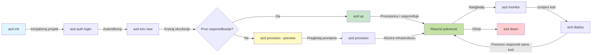
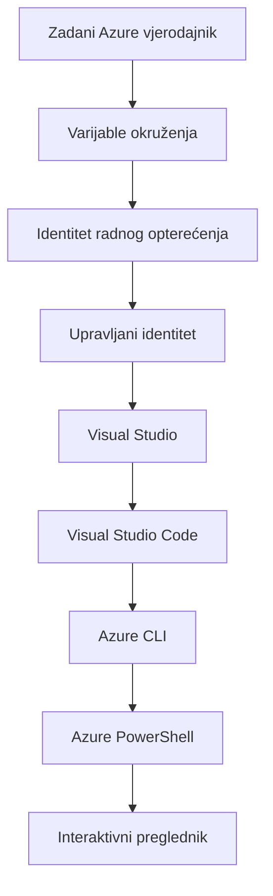

# AZD Basics - Razumijevanje Azure Developer CLI

# AZD Basics - Osnovni pojmovi i temelji

**Chapter Navigation:**
- **📚 Početna stranica tečaja**: [AZD For Beginners](../../README.md)
- **📖 Trenutno poglavlje**: Poglavlje 1 - Osnove i brzi početak
- **⬅️ Prethodno**: [Pregled tečaja](../../README.md#-chapter-1-foundation--quick-start)
- **➡️ Sljedeće**: [Instalacija i postavljanje](installation.md)
- **🚀 Sljedeće poglavlje**: [Poglavlje 2: AI-prvo razvijanje](../chapter-02-ai-development/microsoft-foundry-integration.md)

## Uvod

Ova lekcija uvodi Azure Developer CLI (azd), moćan alat naredbenog retka koji ubrzava vaš put od lokalnog razvoja do raspoređivanja na Azure. Naučit ćete temeljne pojmove, glavne značajke i razumjeti kako azd pojednostavljuje raspoređivanje cloud-native aplikacija.

## Ciljevi učenja

Na kraju ove lekcije ćete:
- Razumjeti što je Azure Developer CLI i njegovu primarnu svrhu
- Naučiti temeljne pojmove o predlošcima, okruženjima i uslugama
- Istražiti ključne značajke uključujući razvoj vođen predlošcima i Infrastructure as Code
- Razumjeti strukturu projekta azd i tijek rada
- Biti spremni instalirati i konfigurirati azd za vaše razvojno okruženje

## Ishodi učenja

Nakon završetka ove lekcije moći ćete:
- Objasniti ulogu azd u modernim radnim tokovima cloud razvoja
- Identificirati komponente strukture azd projekta
- Opisati kako predlošci, okruženja i usluge rade zajedno
- Razumjeti prednosti Infrastructure as Code s azd
- Prepoznati različite azd naredbe i njihove svrhe

## Što je Azure Developer CLI (azd)?

Azure Developer CLI (azd) je alat naredbenog retka dizajniran da ubrza vaš put od lokalnog razvoja do raspoređivanja na Azure. Pojednostavljuje proces izgradnje, raspoređivanja i upravljanja cloud-native aplikacijama na Azureu.

### 🎯 Zašto koristiti AZD? Usporedba iz stvarnog svijeta

Usporedimo raspoređivanje jednostavne web aplikacije s bazom podataka:

#### ❌ BEZ AZD: Ručno raspoređivanje na Azure (30+ minuta)

```bash
# Korak 1: Kreirajte grupu resursa
az group create --name myapp-rg --location eastus

# Korak 2: Kreirajte App Service plan
az appservice plan create --name myapp-plan \
  --resource-group myapp-rg \
  --sku B1 --is-linux

# Korak 3: Kreirajte web-aplikaciju
az webapp create --name myapp-web-unique123 \
  --resource-group myapp-rg \
  --plan myapp-plan \
  --runtime "NODE:18-lts"

# Korak 4: Kreirajte Cosmos DB račun (10-15 minuta)
az cosmosdb create --name myapp-cosmos-unique123 \
  --resource-group myapp-rg \
  --kind MongoDB

# Korak 5: Kreirajte bazu podataka
az cosmosdb mongodb database create \
  --account-name myapp-cosmos-unique123 \
  --resource-group myapp-rg \
  --name tododb

# Korak 6: Kreirajte kolekciju
az cosmosdb mongodb collection create \
  --account-name myapp-cosmos-unique123 \
  --resource-group myapp-rg \
  --database-name tododb \
  --name todos

# Korak 7: Dohvatite niz za povezivanje
CONN_STR=$(az cosmosdb keys list \
  --name myapp-cosmos-unique123 \
  --resource-group myapp-rg \
  --type connection-strings \
  --query "connectionStrings[0].connectionString" -o tsv)

# Korak 8: Konfigurirajte postavke aplikacije
az webapp config appsettings set \
  --name myapp-web-unique123 \
  --resource-group myapp-rg \
  --settings MONGODB_URI="$CONN_STR"

# Korak 9: Omogućite zapisivanje dnevnika
az webapp log config --name myapp-web-unique123 \
  --resource-group myapp-rg \
  --application-logging filesystem \
  --detailed-error-messages true

# Korak 10: Postavite Application Insights
az monitor app-insights component create \
  --app myapp-insights \
  --location eastus \
  --resource-group myapp-rg

# Korak 11: Povežite Application Insights s web-aplikacijom
INSTRUMENTATION_KEY=$(az monitor app-insights component show \
  --app myapp-insights \
  --resource-group myapp-rg \
  --query "instrumentationKey" -o tsv)

az webapp config appsettings set \
  --name myapp-web-unique123 \
  --resource-group myapp-rg \
  --settings APPINSIGHTS_INSTRUMENTATIONKEY="$INSTRUMENTATION_KEY"

# Korak 12: Izgradite aplikaciju lokalno
npm install
npm run build

# Korak 13: Kreirajte paket za implementaciju
zip -r app.zip . -x "*.git*" "node_modules/*"

# Korak 14: Implementirajte aplikaciju
az webapp deployment source config-zip \
  --resource-group myapp-rg \
  --name myapp-web-unique123 \
  --src app.zip

# Korak 15: Pričekajte i molite se da radi 🙏
# (Nema automatizirane provjere, potrebno je ručno testiranje)
```

**Problemi:**
- ❌ 15+ naredbi za zapamtiti i izvršiti redom
- ❌ 30-45 minuta ručnog rada
- ❌ Lako je napraviti pogreške (tipfelere, krivi parametri)
- ❌ Nizovi za povezivanje izloženi u povijesti terminala
- ❌ Nema automatskog vraćanja ako nešto zakaže
- ❌ Teško reproducirati za članove tima
- ❌ Različito svaki put (nereproducibilno)

#### ✅ S AZD: Automatizirano raspoređivanje (5 naredbi, 10-15 minuta)

```bash
# Korak 1: Inicijalizirajte iz predloška
azd init --template todo-nodejs-mongo

# Korak 2: Autentificirajte se
azd auth login

# Korak 3: Kreirajte okruženje
azd env new dev

# Korak 4: Pregledajte promjene (neobavezno, ali preporučeno)
azd provision --preview

# Korak 5: Rasporedite sve
azd up

# ✨ Gotovo! Sve je raspoređeno, konfigurirano i nadgledano
```

**Prednosti:**
- ✅ **5 naredbi** naspram 15+ ručnih koraka
- ✅ **10-15 minuta** ukupnog vremena (većinom čekanje na Azure)
- ✅ **Nula grešaka** - automatizirano i testirano
- ✅ **Tajni podaci sigurno upravljani** putem Key Vault-a
- ✅ **Automatsko vraćanje** u slučaju neuspjeha
- ✅ **Potpuno reproducibilno** - isti rezultat svaki put
- ✅ **Spremno za tim** - svatko može rasporediti s istim naredbama
- ✅ **Infrastructure as Code** - Bicep predlošci pod kontrolom verzija
- ✅ **Ugrađeno nadgledanje** - Application Insights konfiguriran automatski

### 📊 Smanjenje vremena i pogrešaka

| Metric | Manual Deployment | AZD Deployment | Improvement |
|:-------|:------------------|:---------------|:------------|
| **Commands** | 15+ | 5 | 67% fewer |
| **Time** | 30-45 min | 10-15 min | 60% faster |
| **Error Rate** | ~40% | <5% | 88% reduction |
| **Consistency** | Low (manual) | 100% (automated) | Perfect |
| **Team Onboarding** | 2-4 hours | 30 minutes | 75% faster |
| **Rollback Time** | 30+ min (manual) | 2 min (automated) | 93% faster |

## Temeljni pojmovi

### Predlošci
Predlošci su temelj azd-a. Oni sadrže:
- **Kod aplikacije** - Vaš izvorni kod i ovisnosti
- **Definicije infrastrukture** - Azure resursi definirani u Bicepu ili Terrafformu
- **Konfiguracijske datoteke** - Postavke i varijable okoline
- **Skripte za raspoređivanje** - Automatizirani tijekovi rada za raspoređivanje

### Okruženja
Okruženja predstavljaju različite ciljeve raspoređivanja:
- **Development** - Za testiranje i razvoj
- **Staging** - Pre-produkcijsko okruženje
- **Production** - Živo produkcijsko okruženje

Svako okruženje održava svoje:
- Azure resource group
- Konfiguracijske postavke
- Stanje raspoređivanja

### Usluge
Usluge su građevni blokovi vaše aplikacije:
- **Frontend** - Web aplikacije, SPA
- **Backend** - API-ji, mikroservisi
- **Database** - Rješenja za pohranu podataka
- **Storage** - Pohrana datoteka i blobova

## Ključne značajke

### 1. Razvoj vođen predlošcima
```bash
# Pregledajte dostupne predloške
azd template list

# Inicijalizirajte iz predloška
azd init --template <template-name>
```

### 2. Infrastructure as Code
- **Bicep** - Azureov domenom specifičan jezik
- **Terraform** - Alat za infrastrukturu u više cloudova
- **ARM Templates** - Azure Resource Manager predlošci

### 3. Integrirani tijekovi rada
```bash
# Potpuni tijek implementacije
azd up            # Provision + Deploy – bez potrebe za intervencijom pri prvom postavljanju

# 🧪 NOVO: Pregledajte promjene infrastrukture prije implementacije (SIGURNO)
azd provision --preview    # Simulirajte implementaciju infrastrukture bez izvođenja promjena

azd provision     # Stvorite Azure resurse — ako ažurirate infrastrukturu, koristite ovo
azd deploy        # Implementirajte kod aplikacije ili ponovno implementirajte kod aplikacije nakon ažuriranja
azd down          # Očistite resurse
```

#### 🛡️ Sigurno planiranje infrastrukture s pregledom
Naredba `azd provision --preview` mijenja igru za sigurna raspoređivanja:
- **Suhi rad (dry-run) analiza** - Prikazuje što će biti stvoreno, modificirano ili izbrisano
- **Nulti rizik** - Nema stvarnih promjena u vašem Azure okruženju
- **Suradnja tima** - Dijelite rezultate pregleda prije raspoređivanja
- **Procjena troškova** - Razumijte troškove resursa prije obaveze

```bash
# Primjer tijeka pregleda
azd provision --preview           # Pogledajte što će se promijeniti
# Pregledajte izlaz, razgovarajte s timom
azd provision                     # Primijenite promjene s povjerenjem
```

### 📊 Vizualno: AZD tijek razvoja


**Objašnjenje tijeka rada:**
1. **Init** - Započnite s predloškom ili novim projektom
2. **Auth** - Autentificirajte se na Azure
3. **Environment** - Kreirajte izolirano okruženje za raspoređivanje
4. **Preview** - 🆕 Uvijek prvo pregledajte promjene infrastrukture (sigurna praksa)
5. **Provision** - Kreirajte/azurirajte Azure resurse
6. **Deploy** - Gurnite kod vaše aplikacije
7. **Monitor** - Promatrajte performanse aplikacije
8. **Iterate** - Napravite promjene i ponovno rasporedite kod
9. **Cleanup** - Uklonite resurse kada završite

### 4. Upravljanje okruženjima
```bash
# Kreirajte i upravljajte okruženjima
azd env new <environment-name>
azd env select <environment-name>
azd env list
```

## 📁 Struktura projekta

Tipična struktura azd projekta:
```
my-app/
├── .azd/                    # azd configuration
│   └── config.json
├── .azure/                  # Azure deployment artifacts
├── .devcontainer/          # Development container config
├── .github/workflows/      # GitHub Actions
├── .vscode/               # VS Code settings
├── infra/                 # Infrastructure code
│   ├── main.bicep        # Main infrastructure template
│   ├── main.parameters.json
│   └── modules/          # Reusable modules
├── src/                  # Application source code
│   ├── api/             # Backend services
│   └── web/             # Frontend application
├── azure.yaml           # azd project configuration
└── README.md
```

## 🔧 Konfiguracijske datoteke

### azure.yaml
The main project configuration file:
```yaml
name: my-awesome-app
metadata:
  template: my-template@1.0.0

services:
  web:
    project: ./src/web
    language: js
    host: appservice
  api:
    project: ./src/api
    language: js
    host: appservice

hooks:
  preprovision:
    shell: pwsh
    run: echo "Preparing to provision..."
```

### .azure/config.json
Environment-specific configuration:
```json
{
  "version": 1,
  "defaultEnvironment": "dev",
  "environments": {
    "dev": {
      "subscriptionId": "your-subscription-id",
      "location": "eastus"
    }
  }
}
```

## 🎪 Uobičajeni tijekovi rada s praktičnim vježbama

> **💡 Savjet za učenje:** Slijedite ove vježbe redom kako biste postupno izgradili svoje AZD vještine.

### 🎯 Vježba 1: Inicijalizirajte svoj prvi projekt

**Cilj:** Kreirati AZD projekt i istražiti njegovu strukturu

**Koraci:**
```bash
# Koristite provjeren predložak
azd init --template todo-nodejs-mongo

# Istražite generirane datoteke
ls -la  # Prikažite sve datoteke uključujući skrivene

# Kreirane ključne datoteke:
# - azure.yaml (glavna konfiguracija)
# - infra/ (infrastrukturni kod)
# - src/ (kod aplikacije)
```

**✅ Uspjeh:** Imate azure.yaml, infra/, i src/ direktorije

---

### 🎯 Vježba 2: Rasporedite na Azure

**Cilj:** Završiti end-to-end raspoređivanje

**Koraci:**
```bash
# 1. Autentificirajte se
az login && azd auth login

# 2. Kreirajte okruženje
azd env new dev
azd env set AZURE_LOCATION eastus

# 3. Pregledajte promjene (PREPORUČENO)
azd provision --preview

# 4. Objavite sve
azd up

# 5. Provjerite implementaciju
azd show    # 6. Pogledajte URL vaše aplikacije
```

**Očekivano vrijeme:** 10-15 minuta  
**✅ Uspjeh:** URL aplikacije se otvara u pregledniku

---

### 🎯 Vježba 3: Višestruka okruženja

**Cilj:** Rasporediti na dev i staging

**Koraci:**
```bash
# Već imamo dev, kreiraj staging
azd env new staging
azd env set AZURE_LOCATION westus2
azd up

# Prebaci se između njih
azd env list
azd env select dev
```

**✅ Uspjeh:** Dvije zasebne resource group u Azure Portalu

---

### 🛡️ Čist početak: `azd down --force --purge`

Kad trebate potpuno resetirati:

```bash
azd down --force --purge
```

**Što radi:**
- `--force`: Bez upita za potvrdu
- `--purge`: Briše sve lokalno stanje i Azure resurse

**Koristite kada:**
- Raspoređivanje je propalo na pola puta
- Prebacujete projekte
- Trebate svježi početak

---

## 🎪 Originalna referenca tijeka rada

### Pokretanje novog projekta
```bash
# Metoda 1: Koristite postojeći predložak
azd init --template todo-nodejs-mongo

# Metoda 2: Počnite od nule
azd init

# Metoda 3: Koristite trenutni direktorij
azd init .
```

### Razvojni ciklus
```bash
# Postavite razvojno okruženje
azd auth login
azd env new dev
azd env select dev

# Implementirajte sve
azd up

# Napravite promjene i ponovno implementirajte
azd deploy

# Očistite kad završite
azd down --force --purge # naredba u Azure Developer CLI-ju je **potpuni reset** za vaše okruženje—posebno korisna kada otklanjate probleme s neuspjelim implementacijama, čistite napuštene resurse ili se pripremate za ponovnu implementaciju.
```

## Razumijevanje `azd down --force --purge`
Naredba `azd down --force --purge` moćan je način da potpuno srušite svoje azd okruženje i sve pridružene resurse. Evo razrade što svaki prekidač radi:
```
--force
```
- Preskače upite za potvrdu.
- Korisno za automatizaciju ili skriptiranje gdje ručni unos nije moguć.
- Osigurava da rušenje nastavi bez prekida, čak i ako CLI otkrije nedosljednosti.

```
--purge
```
Briše **sve povezane metapodatke**, uključujući:
Environment state
Local `.azure` folder
Cached deployment info
Sprječava da azd "pamti" prethodna raspoređivanja, što može uzrokovati probleme poput nepodudaranja resource groupova ili zastarjelih referenci registra.

### Zašto koristiti oboje?
Kada zapnete s `azd up` zbog preostalih stanja ili djelomičnih raspoređivanja, ova kombinacija osigurava **čist početak**.

Posebno je korisno nakon ručnih brisanja resursa u Azure portalu ili prilikom mijenjanja predložaka, okruženja ili konvencija imenovanja resource groupova.

### Upravljanje višestrukim okruženjima
```bash
# Kreiraj staging okruženje
azd env new staging
azd env select staging
azd up

# Vrati se na razvojno okruženje
azd env select dev

# Usporedi okruženja
azd env list
```

## 🔐 Autentikacija i vjerodajnice

Razumijevanje autentikacije ključno je za uspješna azd raspoređivanja. Azure koristi više metoda autentikacije, a azd koristi isti lanac vjerodajnica koji koriste i drugi Azure alati.

### Azure CLI autentikacija (`az login`)

Prije korištenja azd, trebate se autentificirati na Azure. Najčešći način je korištenje Azure CLI-a:

```bash
# Interaktivna prijava (otvara se preglednik)
az login

# Prijava s određenim tenantom
az login --tenant <tenant-id>

# Prijava pomoću servisnog računa
az login --service-principal -u <app-id> -p <password> --tenant <tenant-id>

# Provjeri trenutni status prijave
az account show

# Popis dostupnih pretplata
az account list --output table

# Postavi zadanu pretplatu
az account set --subscription <subscription-id>
```

### Tijek autentikacije
1. **Interaktivna prijava**: Otvara vaš zadani preglednik za autentikaciju
2. **Device Code Flow**: Za okruženja bez pristupa pregledniku
3. **Service Principal**: Za automatizaciju i CI/CD scenarije
4. **Managed Identity**: Za aplikacije hostane na Azureu

### DefaultAzureCredential Chain

`DefaultAzureCredential` je tip vjerodajnice koji pruža pojednostavljeno iskustvo autentikacije tako što automatski pokušava više izvora vjerodajnica u određenom redoslijedu:

#### Redoslijed lanca vjerodajnica

#### 1. Environment Variables
```bash
# Postavite varijable okruženja za servisni račun
export AZURE_CLIENT_ID="<app-id>"
export AZURE_CLIENT_SECRET="<password>"
export AZURE_TENANT_ID="<tenant-id>"
```

#### 2. Workload Identity (Kubernetes/GitHub Actions)
Koristi se automatski u:
- Azure Kubernetes Service (AKS) s Workload Identity
- GitHub Actions s OIDC federacijom
- Ostalim scenarijima federirane identitete

#### 3. Managed Identity
Za Azure resurse kao što su:
- Virtual Machines
- App Service
- Azure Functions
- Container Instances

```bash
# Provjeri je li pokrenuto na Azure resursu s upravljanim identitetom
az account show --query "user.type" --output tsv
# Vraća: "servicePrincipal" ako se koristi upravljani identitet
```

#### 4. Developer Tools Integration
- **Visual Studio**: Automatski koristi prijavljeni račun
- **VS Code**: Koristi vjerodajnice iz Azure Account ekstenzije
- **Azure CLI**: Koristi `az login` vjerodajnice (najčešće za lokalni razvoj)

### Postavljanje autentikacije za AZD

```bash
# Metoda 1: Koristite Azure CLI (Preporučeno za razvoj)
az login
azd auth login  # Koristi postojeće vjerodajnice Azure CLI

# Metoda 2: Izravna azd autentifikacija
azd auth login --use-device-code  # Za okruženja bez korisničkog sučelja

# Metoda 3: Provjerite status autentifikacije
azd auth login --check-status

# Metoda 4: Odjavite se i ponovno se prijavite
azd auth logout
azd auth login
```

### Najbolje prakse za autentikaciju

#### Za lokalni razvoj
```bash
# 1. Prijavite se pomoću Azure CLI
az login

# 2. Provjerite ispravnu pretplatu
az account show
az account set --subscription "Your Subscription Name"

# 3. Koristite azd s postojećim vjerodajnicama
azd auth login
```

#### Za CI/CD pipelineove
```yaml
# GitHub Actions example
- name: Azure Login
  uses: azure/login@v1
  with:
    creds: ${{ secrets.AZURE_CREDENTIALS }}

- name: Deploy with azd
  run: |
    azd auth login --client-id ${{ secrets.AZURE_CLIENT_ID }} \
                    --client-secret ${{ secrets.AZURE_CLIENT_SECRET }} \
                    --tenant-id ${{ secrets.AZURE_TENANT_ID }}
    azd up --no-prompt
```

#### Za produkcijska okruženja
- Koristite **Managed Identity** kada se izvodi na Azure resursima
- Koristite **Service Principal** za scenarije automatizacije
- Izbjegavajte pohranjivanje vjerodajnica u kod ili konfiguracijske datoteke
- Koristite **Azure Key Vault** za osjetljive konfiguracije

### Uobičajeni problemi s autentikacijom i rješenja

#### Problem: "No subscription found"
```bash
# Rješenje: Postavite zadanu pretplatu
az account list --output table
az account set --subscription "<subscription-id>"
azd env set AZURE_SUBSCRIPTION_ID "<subscription-id>"
```

#### Problem: "Insufficient permissions"
```bash
# Rješenje: Provjerite i dodijelite potrebne uloge
az role assignment list --assignee $(az account show --query user.name --output tsv)

# Uobičajene potrebne uloge:
# - Suradnik (za upravljanje resursima)
# - Administrator pristupa korisnika (za dodjeljivanje uloga)
```

#### Problem: "Token expired"
```bash
# Rješenje: Ponovno se autentificirajte
az logout
az login
azd auth logout
azd auth login
```

### Autentikacija u različitim scenarijima

#### Lokalni razvoj
```bash
# Račun za osobni razvoj
az login
azd auth login
```

#### Timski razvoj
```bash
# Koristite određeni tenant za organizaciju
az login --tenant contoso.onmicrosoft.com
azd auth login
```

#### Višetenantski scenariji
```bash
# Prebacivanje između najmoprimaca
az login --tenant tenant1.onmicrosoft.com
# Rasporedi na najmoprimca 1
azd up

az login --tenant tenant2.onmicrosoft.com  
# Rasporedi na najmoprimca 2
azd up
```

### Sigurnosna razmatranja

1. **Pohrana vjerodajnica**: Nikada ne pohranjujte vjerodajnice u izvorni kod
2. **Ograničenje opsega**: Koristite princip najmanjih privilegija za service principioale
3. **Rotacija tokena**: Redovito rotirajte tajne service principala
4. **Audit trail**: Nadgledajte autentikacijske i raspoređivačke aktivnosti
5. **Mrežna sigurnost**: Koristite privatne endpoint-e kad je moguće

### Rješavanje problema s autentikacijom

```bash
# Otklanjanje problema s autentifikacijom
azd auth login --check-status
az account show
az account get-access-token

# Uobičajene dijagnostičke naredbe
whoami                          # Trenutni kontekst korisnika
az ad signed-in-user show      # Podaci o korisniku u Azure AD
az group list                  # Testiranje pristupa resursu
```

## Razumijevanje `azd down --force --purge`

### Otkrivanje
```bash
azd template list              # Pregledaj predloške
azd template show <template>   # Detalji predloška
azd init --help               # Opcije inicijalizacije
```

### Upravljanje projektom
```bash
azd show                     # Pregled projekta
azd env show                 # Trenutno okruženje
azd config list             # Postavke konfiguracije
```

### Nadgledanje
```bash
azd monitor                  # Otvorite Azure portal za nadzor
azd monitor --logs           # Pregledajte zapisnike aplikacije
azd monitor --live           # Pregledajte metrike uživo
azd pipeline config          # Postavite CI/CD
```

## Najbolje prakse

### 1. Koristite smislenih imena
```bash
# Dobro
azd env new production-east
azd init --template web-app-secure

# Izbjegavaj
azd env new env1
azd init --template template1
```

### 2. Iskoristite predloške
- Počnite s postojećim predlošcima
- Prilagodite za svoje potrebe
- Kreirajte ponovno upotrebljive predloške za vašu organizaciju

### 3. Izolacija okruženja
- Koristite odvojena okruženja za dev/staging/prod
- Nikad ne raspoređujte izravno u produkciju s lokalnog računala
- Koristite CI/CD pipelineove za produkcijska raspoređivanja

### 4. Upravljanje konfiguracijom
- Koristite varijable okoline za osjetljive podatke
- Držite konfiguraciju pod kontrolom verzija
- Dokumentirajte postavke specifične za okruženje

## Progresija u učenju

### Početnik (tjedan 1-2)
1. Instalirajte azd i autentificirajte se
2. Rasporedite jednostavan predložak
3. Razumite strukturu projekta
4. Naučite osnovne naredbe (up, down, deploy)

### Srednji (tjedan 3-4)
1. Prilagodite predloške
2. Upravljajte višestrukim okruženjima
3. Razumite infrastruktur kod
4. Postavite CI/CD pipelineove

### Napredno (tjedan 5+)
1. Kreirajte prilagođene predloške
2. Napredni obrasci infrastrukture
3. Raspoređivanja u više regija
4. Enterprise-grade konfiguracije

## Sljedeći koraci

**📖 Nastavite s učenjem poglavlja 1:**
- [Instalacija i postavljanje](installation.md) - Instalirajte i konfigurirajte azd
- [Vaš prvi projekt](first-project.md) - Kompletan praktični vodič
- [Vodič za konfiguraciju](configuration.md) - Napredne opcije konfiguracije

**🎯 Spremni za sljedeće poglavlje?**
- [Poglavlje 2: Razvoj fokusiran na AI](../chapter-02-ai-development/microsoft-foundry-integration.md) - Počnite graditi AI aplikacije

## Dodatni resursi

- [Pregled Azure Developer CLI](https://learn.microsoft.com/en-us/azure/developer/azure-developer-cli/)
- [Galerija predložaka](https://azure.github.io/awesome-azd/)
- [Primjeri zajednice](https://github.com/Azure-Samples)

---

## 🙋 Često postavljana pitanja

### Opća pitanja

**Q: Koja je razlika između AZD-a i Azure CLI-ja?**

A: Azure CLI (`az`) služi za upravljanje pojedinačnim Azure resursima. AZD (`azd`) služi za upravljanje cijelim aplikacijama:

```bash
# Azure CLI - upravljanje resursima niske razine
az webapp create --name myapp --resource-group rg
az sql server create --name myserver --resource-group rg
# ...potrebno je još mnogo naredbi

# AZD - upravljanje na razini aplikacije
azd up  # Raspoređuje cijelu aplikaciju sa svim resursima
```

**Razmislite o tome ovako:**
- `az` = Rad s pojedinačnim Lego kockicama
- `azd` = Rad s kompletnim Lego setovima

---

**Q: Trebam li znati Bicep ili Terraform da bih koristio AZD?**

A: Ne! Počnite s predlošcima:
```bash
# Koristite postojeći predložak - nije potrebno znanje o IaC-u
azd init --template todo-nodejs-mongo
azd up
```

Bicep možete naučiti kasnije da biste prilagodili infrastrukturu. Predlošci pružaju radne primjere iz kojih možete učiti.

---

**Q: Koliko košta pokretanje AZD predložaka?**

A: Troškovi ovise o predlošku. Većina razvojnih predložaka košta $50-150/mjesečno:

```bash
# Pregledajte troškove prije raspoređivanja
azd provision --preview

# Uvijek očistite resurse kad ih ne koristite
azd down --force --purge  # Uklanja sve resurse
```

**Savjet:** Koristite besplatne razine kad su dostupne:
- App Service: F1 (besplatna) razina
- Azure OpenAI: 50,000 tokena/mjesečno besplatno
- Cosmos DB: 1000 RU/s besplatna razina

---

**Q: Mogu li koristiti AZD s postojećim Azure resursima?**

A: Da, ali je lakše početi ispočetka. AZD najbolje funkcionira kada upravlja cijelim životnim ciklusom. Za postojeće resurse:

```bash
# Opcija 1: Uvezi postojeće resurse (napredno)
azd init
# Zatim izmijeni infra/ da se odnosi na postojeće resurse

# Opcija 2: Počni ispočetka (preporučeno)
azd init --template matching-your-stack
azd up  # Stvara novo okruženje
```

---

**Q: Kako podijelim svoj projekt s kolegama?**

A: Commitajte AZD projekt u Git (ali NE .azure mapu):

```bash
# Već je po zadanom u .gitignoreu
.azure/        # Sadrži tajne i podatke o okruženju
*.env          # Varijable okruženja

# Članovi tima zatim:
git clone <your-repo>
azd auth login
azd env new <their-name>-dev
azd up
```

Svi dobivaju identičnu infrastrukturu iz istih predložaka.

---

### Pitanja za rješavanje problema

**Q: "azd up" nije uspio do kraja. Što da napravim?**

A: Provjerite grešku, ispravite je, pa pokušajte ponovno:

```bash
# Prikažite detaljne zapisnike
azd show

# Uobičajeni popravci:

# 1. Ako je kvota prekoračena:
azd env set AZURE_LOCATION "westus2"  # Pokušajte s drugom regijom

# 2. Ako postoji sukob imena resursa:
azd down --force --purge  # Resetirajte na početno stanje
azd up  # Pokušajte ponovno

# 3. Ako je autentifikacija istekla:
az login
azd auth login
azd up
```

**Najčešći problem:** Odabrana je pogrešna Azure pretplata
```bash
az account list --output table
az account set --subscription "<correct-subscription>"
```

---

**Q: Kako rasporediti samo promjene u kodu bez ponovnog provisioniranja?**

A: Koristite `azd deploy` umjesto `azd up`:

```bash
azd up          # Prvi put: priprema i raspoređivanje (sporo)

# Napravite promjene u kodu...

azd deploy      # Sljedeći put: samo raspoređivanje (brzo)
```

Usporedba brzine:
- `azd up`: 10-15 minutes (postavlja infrastrukturu)
- `azd deploy`: 2-5 minutes (samo kod)

---

**Q: Mogu li prilagoditi predloške infrastrukture?**

A: Da! Uredite Bicep datoteke u `infra/`:

```bash
# Nakon azd init
cd infra/
code main.bicep  # Uredi u VS Codeu

# Pregledaj promjene
azd provision --preview

# Primijeni promjene
azd provision
```

**Savjet:** Počnite s malim promjenama - prvo promijenite SKU-ove:
```bicep
// infra/main.bicep
sku: {
  name: 'B1'  // Change to 'P1V2' for production
}
```

---

**Q: Kako izbrisati sve što je AZD stvorio?**

A: Jedna naredba uklanja sve resurse:

```bash
azd down --force --purge

# Ovo briše:
# - Sve Azure resurse
# - Grupu resursa
# - Lokalno stanje okruženja
# - Predmemorirani podaci o implementaciji
```

**Uvijek pokrenite ovo kada:**
- Završili ste testiranje predloška
- Prebacujete se na drugi projekt
- Želite početi iznova

**Ušteda troškova:** Brisanjem neiskorištenih resursa = $0 troškova

---

**Q: Što ako sam slučajno izbrisao resurse u Azure Portalu?**

A: Stanje AZD-a može izgubiti sinkronizaciju. Pristup 'čistog početka':

```bash
# 1. Uklonite lokalno stanje
azd down --force --purge

# 2. Počnite iznova
azd up

# Alternativa: Dopustite AZD-u da otkrije i popravi
azd provision  # Stvorit će nedostajuće resurse
```

---

### Napredna pitanja

**Q: Mogu li koristiti AZD u CI/CD pipelinima?**

A: Da! Primjer za GitHub Actions:

```yaml
# .github/workflows/deploy.yml
name: Deploy with AZD

on:
  push:
    branches: [main]

jobs:
  deploy:
    runs-on: ubuntu-latest
    steps:
      - uses: actions/checkout@v2
      
      - name: Install azd
        run: curl -fsSL https://aka.ms/install-azd.sh | bash
      
      - name: Azure Login
        run: |
          azd auth login \
            --client-id ${{ secrets.AZURE_CLIENT_ID }} \
            --client-secret ${{ secrets.AZURE_CLIENT_SECRET }} \
            --tenant-id ${{ secrets.AZURE_TENANT_ID }}
      
      - name: Deploy
        run: azd up --no-prompt
```

---

**Q: Kako se nositi s tajnama i osjetljivim podacima?**

A: AZD se automatski integrira s Azure Key Vaultom:

```bash
# Tajne su pohranjene u Key Vaultu, a ne u kodu
azd env set DATABASE_PASSWORD "$(openssl rand -base64 32)"

# AZD automatski:
# 1. Kreira Key Vault
# 2. Pohranjuje tajnu
# 3. Dodjeljuje aplikaciji pristup putem upravljanog identiteta
# 4. Ubacuje tijekom izvođenja
```

**Nikad ne commitajte:**
- `.azure/` folder (sadrži podatke o okruženju)
- `.env` files (lokalne tajne)
- stringovi za povezivanje

---

**Q: Mogu li rasporediti u više regija?**

A: Da, stvorite okruženje po regiji:

```bash
# Okruženje istočnog SAD-a
azd env new prod-eastus
azd env set AZURE_LOCATION eastus
azd up

# Okruženje zapadne Europe
azd env new prod-westeurope
azd env set AZURE_LOCATION westeurope
azd up

# Svako okruženje je neovisno
azd env list
```

Za stvarne aplikacije s više regija, prilagodite Bicep predloške kako biste rasporedili u više regija istovremeno.

---

**Q: Gdje mogu dobiti pomoć ako zapnem?**

1. **AZD dokumentacija:** https://learn.microsoft.com/azure/developer/azure-developer-cli/
2. **GitHub Issues:** https://github.com/Azure/azure-dev/issues
3. **Discord:** [Azure Discord](https://discord.gg/microsoft-azure) - kanal #azure-developer-cli
4. **Stack Overflow:** Oznaka `azure-developer-cli`
5. **Ovaj tečaj:** [Vodič za rješavanje problema](../chapter-07-troubleshooting/common-issues.md)

**Savjet:** Prije nego što pitate, pokrenite:
```bash
azd show       # Prikazuje trenutno stanje
azd version    # Prikazuje vašu verziju
```
Uključite ove informacije u svoje pitanje za bržu pomoć.

---

## 🎓 Što slijedi?

Sada razumijete osnove AZD-a. Odaberite svoj put:

### 🎯 Za početnike:
1. **Sljedeće:** [Instalacija i postavljanje](installation.md) - Instalirajte AZD na svoje računalo
2. **Zatim:** [Vaš prvi projekt](first-project.md) - Rasporedite svoju prvu aplikaciju
3. **Vježba:** Završite svih 3 vježbe u ovoj lekciji

### 🚀 Za AI programere:
1. **Preskoči na:** [Poglavlje 2: Razvoj fokusiran na AI](../chapter-02-ai-development/microsoft-foundry-integration.md)
2. **Rasporedite:** Počnite s `azd init --template get-started-with-ai-chat`
3. **Učite:** Gradite dok raspoređujete

### 🏗️ Za iskusne programere:
1. **Pogledajte:** [Vodič za konfiguraciju](configuration.md) - Napredne postavke
2. **Istražite:** [Infrastruktura kao kod](../chapter-04-infrastructure/provisioning.md) - Detaljno proučavanje Bicep-a
3. **Izgradite:** Izradite prilagođene predloške za svoj stack

---

**Navigacija poglavljima:**
- **📚 Početak tečaja**: [AZD za početnike](../../README.md)
- **📖 Trenutno poglavlje**: Poglavlje 1 - Osnove i brz početak  
- **⬅️ Prethodno**: [Pregled tečaja](../../README.md#-chapter-1-foundation--quick-start)
- **➡️ Sljedeće**: [Instalacija i postavljanje](installation.md)
- **🚀 Sljedeće poglavlje**: [Poglavlje 2: Razvoj fokusiran na AI](../chapter-02-ai-development/microsoft-foundry-integration.md)

---

<!-- CO-OP TRANSLATOR DISCLAIMER START -->
**Odricanje odgovornosti**:
Ovaj dokument preveden je pomoću AI usluge za prevođenje [Co-op Translator](https://github.com/Azure/co-op-translator). Iako nastojimo postići točnost, imajte na umu da automatski prijevodi mogu sadržavati pogreške ili netočnosti. Izvorni dokument na njegovom izvornom jeziku treba smatrati mjerodavnim izvorom. Za kritične informacije preporučuje se profesionalni ljudski prijevod. Ne odgovaramo za bilo kakve nesporazume ili pogrešne interpretacije nastale uporabom ovog prijevoda.
<!-- CO-OP TRANSLATOR DISCLAIMER END -->