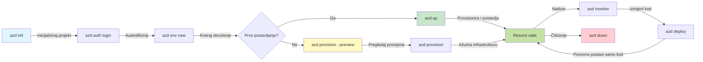
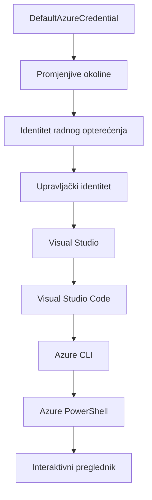

# AZD Osnove - Razumijevanje Azure Developer CLI

# AZD Osnove - Temeljni pojmovi i osnove

**Navigacija poglavlja:**
- **📚 Početna stranica tečaja**: [AZD za početnike](../../README.md)
- **📖 Trenutno poglavlje**: Poglavlje 1 - Temelj i brzi početak
- **⬅️ Prethodno**: [Pregled tečaja](../../README.md#-chapter-1-foundation--quick-start)
- **➡️ Sljedeće**: [Instalacija i postavljanje](installation.md)
- **🚀 Sljedeće poglavlje**: [Poglavlje 2: AI-prvi razvoj](../chapter-02-ai-development/microsoft-foundry-integration.md)

## Uvod

Ova lekcija upoznaje vas s Azure Developer CLI-jem (azd), moćnim alatom naredbenog retka koji ubrzava vaš put od lokalnog razvoja do implementacije u Azure. Naučit ćete osnovne pojmove, ključne značajke i razumjeti kako azd pojednostavljuje implementaciju cloud-native aplikacija.

## Ciljevi učenja

Na kraju ove lekcije ćete:
- Razumjeti što je Azure Developer CLI i njegov primarni cilj
- Naučiti osnovne pojmove o predlošcima, okruženjima i uslugama
- Istražiti ključne značajke uključujući razvoj vođen predlošcima i Infrastructure as Code
- Razumjeti strukturu projekta i tijek rada u azd-u
- Biti spremni instalirati i konfigurirati azd za vaše razvojno okruženje

## Ishodi učenja

Nakon završetka ove lekcije, moći ćete:
- Objasniti ulogu azd-a u modernim tijekovima razvoja u oblaku
- Prepoznati komponente strukture azd projekta
- Opisati kako predlošci, okruženja i usluge rade zajedno
- Razumjeti prednosti Infrastructure as Code s azd-om
- Prepoznati različite azd naredbe i njihove svrhe

## Što je Azure Developer CLI (azd)?

Azure Developer CLI (azd) je alat naredbenog retka dizajniran za ubrzavanje vašeg puta od lokalnog razvoja do implementacije u Azure. Pojednostavljuje proces izgradnje, implementacije i upravljanja cloud-native aplikacijama na Azureu.

### Što možete implementirati s azd-om?

azd podržava širok raspon radnih opterećenja—i popis se stalno povećava. Danas možete koristiti azd za implementaciju:

| Vrsta radnog opterećenja | Primjeri | Isti tijek rada? |
|--------------------------|----------|------------------|
| **Tradicionalne aplikacije** | Web aplikacije, REST API-jevi, statične stranice | ✅ `azd up` |
| **Usluge i mikrousloge** | Container Apps, Function Apps, višeservisni backendi | ✅ `azd up` |
| **Aplikacije s AI potporom** | Chat aplikacije s Microsoft Foundry modelima, RAG rješenja s AI pretraživanjem | ✅ `azd up` |
| **Inteligentni agenti** | Agentu hostani u Foundry-u, višestruka koordinacija agenata | ✅ `azd up` |

Ključna spoznaja je da **životni ciklus azd-a ostaje isti bez obzira na to što implementirate**. Inicijalizirate projekt, osiguravate infrastrukturu, implementirate kod, pratite aplikaciju i čistite resurse—bilo da se radi o jednostavnoj web stranici ili sofisticiranom AI agentu.

Ova kontinuitet je dizajniran. azd tretira AI sposobnosti kao još jednu vrstu usluge koju vaša aplikacija može koristiti, a ne kao nešto potpuno drugačije. Chat endpoint podržan Microsoft Foundry modelima je, iz azd perspektive, samo još jedna usluga za konfigurirati i implementirati.

### 🎯 Zašto koristiti AZD? Usporedba iz stvarnog svijeta

Usporedimo implementaciju jednostavne web aplikacije s bazom podataka:

#### ❌ BEZ AZD: Ručna implementacija na Azure (30+ minuta)

```bash
# Korak 1: Kreirajte grupu resursa
az group create --name myapp-rg --location eastus

# Korak 2: Kreirajte App Service plan
az appservice plan create --name myapp-plan \
  --resource-group myapp-rg \
  --sku B1 --is-linux

# Korak 3: Kreirajte Web aplikaciju
az webapp create --name myapp-web-unique123 \
  --resource-group myapp-rg \
  --plan myapp-plan \
  --runtime "NODE:18-lts"

# Korak 4: Kreirajte Cosmos DB račun (10-15 minuta)
az cosmosdb create --name myapp-cosmos-unique123 \
  --resource-group myapp-rg \
  --kind MongoDB

# Korak 5: Kreirajte bazu podataka
az cosmosdb mongodb database create \
  --account-name myapp-cosmos-unique123 \
  --resource-group myapp-rg \
  --name tododb

# Korak 6: Kreirajte kolekciju
az cosmosdb mongodb collection create \
  --account-name myapp-cosmos-unique123 \
  --resource-group myapp-rg \
  --database-name tododb \
  --name todos

# Korak 7: Nabavite poveznu string
CONN_STR=$(az cosmosdb keys list \
  --name myapp-cosmos-unique123 \
  --resource-group myapp-rg \
  --type connection-strings \
  --query "connectionStrings[0].connectionString" -o tsv)

# Korak 8: Konfigurirajte postavke aplikacije
az webapp config appsettings set \
  --name myapp-web-unique123 \
  --resource-group myapp-rg \
  --settings MONGODB_URI="$CONN_STR"

# Korak 9: Omogućite zapisivanje dnevnika
az webapp log config --name myapp-web-unique123 \
  --resource-group myapp-rg \
  --application-logging filesystem \
  --detailed-error-messages true

# Korak 10: Postavite Application Insights
az monitor app-insights component create \
  --app myapp-insights \
  --location eastus \
  --resource-group myapp-rg

# Korak 11: Povežite App Insights s Web aplikacijom
INSTRUMENTATION_KEY=$(az monitor app-insights component show \
  --app myapp-insights \
  --resource-group myapp-rg \
  --query "instrumentationKey" -o tsv)

az webapp config appsettings set \
  --name myapp-web-unique123 \
  --resource-group myapp-rg \
  --settings APPINSIGHTS_INSTRUMENTATIONKEY="$INSTRUMENTATION_KEY"

# Korak 12: Izgradite aplikaciju lokalno
npm install
npm run build

# Korak 13: Kreirajte paket za implementaciju
zip -r app.zip . -x "*.git*" "node_modules/*"

# Korak 14: Implementirajte aplikaciju
az webapp deployment source config-zip \
  --resource-group myapp-rg \
  --name myapp-web-unique123 \
  --src app.zip

# Korak 15: Pričekajte i molite da radi 🙏
# (Nema automatizirane provjere, potrebna je ručna provjera)
```
  
**Problemi:**  
- ❌ 15+ naredbi za zapamtiti i izvršiti redom  
- ❌ 30-45 minuta ručnog rada  
- ❌ Lako je pogriješiti (tipkarske greške, krivi parametri)  
- ❌ Konekcijski stringovi izloženi u povijesti terminala  
- ❌ Nema automatskog vraćanja u slučaju pogreške  
- ❌ Teško replikirati za članove tima  
- ❌ Svaki put drugačije (nereproducibilno)  

#### ✅ S AZD: Automatska implementacija (5 naredbi, 10-15 minuta)

```bash
# Korak 1: Inicijaliziraj iz predloška
azd init --template todo-nodejs-mongo

# Korak 2: Autentificiraj se
azd auth login

# Korak 3: Kreiraj okruženje
azd env new dev

# Korak 4: Pregledaj promjene (opcionalno, ali preporučeno)
azd provision --preview

# Korak 5: Postavi sve
azd up

# ✨ Gotovo! Sve je postavljeno, konfigurirano i nadzirano
```
  
**Prednosti:**  
- ✅ **5 naredbi** naspram 15+ ručnih koraka  
- ✅ **10-15 minuta** ukupnog vremena (uglavnom čekanje na Azure)  
- ✅ **Manje ručnih pogrešaka** - dosljedan, vođen predlošcima tijek rada  
- ✅ **Sigurno upravljanje tajnama** - mnogi predlošci koriste Azure-managed pohranu tajni  
- ✅ **Ponavljajuće implementacije** - isti tijek rada svaki put  
- ✅ **Potpuno reproducibilno** - isti rezultat svaki put  
- ✅ **Prikladno za tim** - bilo tko može implementirati istim naredbama  
- ✅ **Infrastructure as Code** - Bicep predlošci pod kontrolom verzija  
- ✅ **Ugrađeni nadzor** - Application Insights automatski konfiguriran  

### 📊 Ušteda vremena i smanjenje pogrešaka

| Mjerilo | Ručna implementacija | Implementacija s AZD | Poboljšanje |
|:--------|:--------------------|:--------------------|:------------|
| **Naredbe** | 15+ | 5 | 67% manje |
| **Vrijeme** | 30-45 min | 10-15 min | 60% brže |
| **Stope pogreške** | ~40% | <5% | 88% smanjenje |
| **Dosljednost** | Niska (ručno) | 100% (automatizirano) | Savršeno |
| **Uvođenje u tim** | 2-4 sata | 30 minuta | 75% brže |
| **Vrijeme vraćanja** | 30+ min (ručno) | 2 min (automatizirano) | 93% brže |

## Temeljni pojmovi

### Predlošci
Predlošci su temelj azd-a. Oni sadrže:
- **Kod aplikacije** - Vaš izvorni kod i ovisnosti
- **Definicije infrastrukture** - Azure resursi definirani u Bicep ili Terraform
- **Konfiguracijske datoteke** - Postavke i varijable okruženja
- **Skripte za implementaciju** - Automatizirani tijekovi implementacije

### Okruženja
Okruženja predstavljaju različite ciljeve implementacije:
- **Razvoj** - Za testiranje i razvoj
- **Staging** - Predprodukcijsko okruženje
- **Produkcija** - Živo produkcijsko okruženje

Svako okruženje održava svoje vlastito:
- Azure resource group
- Konfiguracijske postavke
- Stanje implementacije

### Usluge
Usluge su građevni blokovi vaše aplikacije:
- **Frontend** - Web aplikacije, SPA
- **Backend** - API-jevi, mikrousluge
- **Baza podataka** - Rješenja za pohranu podataka
- **Pohrana** - Pohrana datoteka i blobova

## Ključne značajke

### 1. Razvoj vođen predlošcima
```bash
# Pregledajte dostupne predloške
azd template list

# Inicijalizirajte iz predloška
azd init --template <template-name>
```
  
### 2. Infrastructure as Code
- **Bicep** - Specifični jezik za Azure
- **Terraform** - Alat za višemrežnu infrastrukturu
- **ARM predlošci** - Azure Resource Manager predlošci

### 3. Integrirani tijekovi rada
```bash
# Potpuni tijek rada implementacije
azd up            # Nabava + Implementacija, ovo je bez intervencije za prvo postavljanje

# 🧪 NOVO: Pregledajte promjene infrastrukture prije implementacije (SIGURNO)
azd provision --preview    # Simulirajte implementaciju infrastrukture bez unosa promjena

azd provision     # Kreirajte Azure resurse ako ažurirate infrastrukturu koristite ovo
azd deploy        # Implementirajte kod aplikacije ili ponovo implementirajte kod aplikacije nakon ažuriranja
azd down          # Očistite resurse
```
  
#### 🛡️ Sigurno planiranje infrastrukture s pregledom
Naredba `azd provision --preview` je revolucionarna za sigurne implementacije:
- **Suha analiza** - Prikazuje što će biti stvoreno, izmijenjeno ili obrisano
- **Nula rizika** - Nema stvarnih promjena u vašem Azure okruženju
- **Timsku suradnju** - Dijelite rezultate pregleda prije implementacije
- **Procjena troškova** - Razumijevanje troškova resursa prije obveze

```bash
# Primjer pregleda tijeka rada
azd provision --preview           # Pogledajte što će se promijeniti
# Pregledajte rezultat, razgovarajte s timom
azd provision                     # Primijenite promjene s povjerenjem
```
  
### 📊 Vizualno: AZD tijek rada razvoja


  
**Objašnjenje tijeka rada:**  
1. **Init** - Započnite s predloškom ili novim projektom  
2. **Auth** - Autentifikacija na Azure  
3. **Environment** - Kreirajte izolirano okruženje za implementaciju  
4. **Preview** - 🆕 Uvijek prvo pregledajte promjene infrastrukture (sigurna praksa)  
5. **Provision** - Kreirajte/azurirajte Azure resurse  
6. **Deploy** - Implementirajte vaš aplikacijski kod  
7. **Monitor** - Promatrajte performanse aplikacije  
8. **Iterate** - Napravite izmjene i ponovo implementirajte kod  
9. **Cleanup** - Uklonite resurse kada završite  

### 4. Upravljanje okruženjima
```bash
# Stvaranje i upravljanje okruženjima
azd env new <environment-name>
azd env select <environment-name>
azd env list
```
  
### 5. Proširenja i AI naredbe

azd koristi sustav proširenja za dodavanje mogućnosti izvan osnovnog CLI-ja. Ovo je posebno korisno za AI radna opterećenja:

```bash
# Prikaži dostupne ekstenzije
azd extension list

# Instaliraj ekstenziju Foundry agenata
azd extension install azure.ai.agents

# Inicijaliziraj AI agent projekt iz manifesta
azd ai agent init -m agent-manifest.yaml

# Testiraj implementiranog agenta (prikazuje kašnjenje i vrijeme do prvog bajta)
azd ai agent invoke

# Pokreni MCP server za AI-pomoć pri razvoju (Alfa)
azd mcp start
```
  
**Životni ciklus agenta, od kraja do kraja.** Nakon instalacije `azure.ai.agents`, jedan tijek rada vodi vas od ideje do pokrenutog agenta s nadzorom. Nije potrebno imati sve ovo prvi dan—samo znajte da postoje:

| Faza | Naredba | Što radi |
|-------|---------|----------|
| **Scaffold** | `azd ai agent init -m <manifest>` | Generira agent projekt iz manifesta |
| **Test** | `azd ai agent invoke` | Poziva agenta i prikazuje vrijeme odziva |
| **Measure** | `azd ai agent eval generate` | Stvara evaluacijski skup podataka za agenta |
| **Improve** | `azd ai agent optimize` | Optimizira upute za agenta na osnovu vaših podataka |
| **Inspect** | `azd ai agent endpoint show` | Prikazuje konfiguraciju live endpointa |
| **Clean up** | `azd ai agent delete` | Briše hostanog agenta i sve njegove verzije |

> Proširenja su detaljno obrađena u [Poglavlju 2: AI-prvi razvoj](../chapter-02-ai-development/agents.md) i u referenci [AZD AI CLI naredbe](../chapter-08-production/production-ai-practices.md#azd-ai-cli-commands-and-extensions).

## 📁 Struktura projekta

Tipična struktura azd projekta:  
```
my-app/
├── .azd/                    # azd configuration
│   └── config.json
├── .azure/                  # Azure deployment artifacts
├── .devcontainer/          # Development container config
├── .github/workflows/      # GitHub Actions
├── .vscode/               # VS Code settings
├── infra/                 # Infrastructure code
│   ├── main.bicep        # Main infrastructure template
│   ├── main.parameters.json
│   └── modules/          # Reusable modules
├── src/                  # Application source code
│   ├── api/             # Backend services
│   └── web/             # Frontend application
├── azure.yaml           # azd project configuration
└── README.md
```
  
## 🔧 Konfiguracijske datoteke

### azure.yaml  
Glavna datoteka konfiguracije projekta:  
```yaml
name: my-awesome-app
metadata:
  template: my-template@1.0.0

services:
  web:
    project: ./src/web
    language: js
    host: appservice
  api:
    project: ./src/api
    language: js
    host: appservice

hooks:
  preprovision:
    shell: pwsh
    run: echo "Preparing to provision..."
```
  
### .azure/config.json  
Konfiguracija specifična za okruženje:  
```json
{
  "version": 1,
  "defaultEnvironment": "dev",
  "environments": {
    "dev": {
      "subscriptionId": "your-subscription-id",
      "location": "eastus"
    }
  }
}
```
  
## 🎪 Uobičajeni tijekovi rada s praktičnim zadacima

> **💡 Savjet za učenje:** Slijedite ove vježbe redom kako biste postupno razvijali svoje AZD vještine.

### 🎯 Vježba 1: Inicijalizirajte svoj prvi projekt

**Cilj:** Kreirati AZD projekt i istražiti njegovu strukturu

**Koraci:**  
```bash
# Koristite provjereni predložak
azd init --template todo-nodejs-mongo

# Istražite generirane datoteke
ls -la  # Prikaži sve datoteke uključujući skrivene

# Ključne kreirane datoteke:
# - azure.yaml (glavna konfiguracija)
# - infra/ (kod infrastrukture)
# - src/ (kod aplikacije)
```
  
**✅ Uspjeh:** Imate azure.yaml, infra/ i src/ direktorije

---

### 🎯 Vježba 2: Implementacija u Azure

**Cilj:** Završiti end-to-end implementaciju

**Koraci:**  
```bash
# 1. Autentificirajte se
az login && azd auth login

# 2. Kreirajte okruženje
azd env new dev
azd env set AZURE_LOCATION eastus

# 3. Pregledajte promjene (PREPORUČENO)
azd provision --preview

# 4. Implementirajte sve
azd up

# 5. Potvrdite implementaciju
azd show    # Pogledajte URL svoje aplikacije
```
  
**Očekivano vrijeme:** 10-15 minuta  
**✅ Uspjeh:** URL aplikacije se otvara u pregledniku

---

### 🎯 Vježba 3: Višestruka okruženja

**Cilj:** Implementirati u razvojno i staging okruženje

**Koraci:**  
```bash
# Već postoji dev, stvori staging
azd env new staging
azd env set AZURE_LOCATION westus2
azd up

# Prebaci se između njih
azd env list
azd env select dev
```
  
**✅ Uspjeh:** Dvije zasebne resource grupe u Azure portalu

---

### 🛡️ Čista ploča: `azd down --force --purge`

Kada trebate potpuno resetirati:

```bash
azd down --force --purge
```
  
**Što radi:**  
- `--force`: Bez potvrda  
- `--purge`: Briše sve lokalno stanje i Azure resurse  

**Koristite kada:**  
- Implementacija je prekinuta usred procesa  
- Mijenjate projekte  
- Trebate svježi početak  

---

## 🎪 Originalni tijek rada referenca

### Pokretanje novog projekta  
```bash
# Metoda 1: Koristite postojeći predložak
azd init --template todo-nodejs-mongo

# Metoda 2: Počnite od nule
azd init

# Metoda 3: Koristite trenutni direktorij
azd init .
```
  
### Razvojni ciklus  
```bash
# Postavite razvojno okruženje
azd auth login
azd env new dev
azd env select dev

# Implementirajte sve
azd up

# Napravite promjene i ponovno implementirajte
azd deploy

# Očistite kada završite
azd down --force --purge # naredba u Azure Developer CLI-u je **tvrdi reset** za vaše okruženje—posebno korisno kada otklanjate kvarove neuspjelih implementacija, čistite napuštene resurse ili se pripremate za novu implementaciju.
```
  
## Razumijevanje `azd down --force --purge`

Naredba `azd down --force --purge` moćan je način da potpuno uklonite svoje azd okruženje i sve povezane resurse. Evo što svaki flag radi:  
```
--force
```
  
- Preskače potvrde.  
- Korisno za automatizaciju ili skriptiranje bez potrebe za unosom korisnika.  
- Osigurava da rušenje ide bez prekida, čak i ako CLI detektira nesukladnosti.  

```
--purge
```
  
Briše **sve povezane metapodatke**, uključujući:  
Stanje okruženja  
Lokalni `.azure` direktorij  
Keširane informacije o implementaciji  
Sprječava da azd „pamti“ prethodne implementacije, koje mogu uzrokovati probleme poput nepodudaranja resource grupa ili zastarjelih referenci registara.

### Zašto koristiti oba?  
Kada naiđete na probleme s `azd up` zbog zaostalog stanja ili djelomičnih implementacija, ova kombinacija osigurava **čistu ploču**.

Posebno je korisno nakon ručnih brisanja resursa u Azure portalu ili kod promjene predložaka, okruženja ili konvencija imenovanja resource grupa.

### Upravljanje višestrukim okruženjima  
```bash
# Kreiraj staging okruženje
azd env new staging
azd env select staging
azd up

# Vratite se na razvoj
azd env select dev

# Usporedi okruženja
azd env list
```
  
## 🔐 Autentifikacija i vjerodajnice

Razumijevanje autentifikacije je ključno za uspješne azd implementacije. Azure koristi više metoda autentifikacije, a azd koristi isti lanac vjerodajnica kao i drugi Azure alati.

### Azure CLI autentifikacija (`az login`)

Prije korištenja azd-a, morate se autentificirati na Azure. Najčešći način je korištenje Azure CLI-ja:

```bash
# Interaktivna prijava (otvara preglednik)
az login

# Prijava s određenim zakupcem
az login --tenant <tenant-id>

# Prijava s glavnim servisnim računom
az login --service-principal -u <app-id> -p <password> --tenant <tenant-id>

# Provjeri trenutni status prijave
az account show

# Prikaži dostupne pretplate
az account list --output table

# Postavi zadanu pretplatu
az account set --subscription <subscription-id>
```
  
### Tijek autentifikacije  
1. **Interaktivni login**: Otvara vaš zadani preglednik za autentifikaciju  
2. **Device Code Flow**: Za okruženja bez pristupa pregledniku  
3. **Service Principal**: Za automatizaciju i CI/CD scenarije  
4. **Managed Identity**: Za aplikacije hostane na Azureu  

### Lanac vjerodajnica DefaultAzureCredential

`DefaultAzureCredential` je tip vjerodajnica koji pruža pojednostavljeno iskustvo autentifikacije automatskim pokušajem iz više izvora vjerodajnica u određenom redoslijedu:

#### Redoslijed u lancu vjerodajnica  

  
#### 1. Varijable okruženja  
```bash
# Postavi varijable okoline za servisni princip
export AZURE_CLIENT_ID="<app-id>"
export AZURE_CLIENT_SECRET="<password>"
export AZURE_TENANT_ID="<tenant-id>"
```
  
#### 2. Workload Identity (Kubernetes/GitHub Actions)  
Automatski se koristi u:  
- Azure Kubernetes Service (AKS) sa Workload Identity  
- GitHub Actions s OIDC federacijom  
- Ostalim scenarijima federirane identifikacije  

#### 3. Managed Identity  
Za Azure resurse poput:  
- Virtualnih računala  
- App Service  
- Azure Functions  
- Container Instances

```bash
# Provjeri radi li se na Azure resursu s upravljanim identitetom
az account show --query "user.type" --output tsv
# Vraća: "servicePrincipal" ako se koristi upravljani identitet
```
  
#### 4. Integracija s razvojnim alatima  
- **Visual Studio**: Automatski koristi prijavljeni račun  
- **VS Code**: Koristi vjerodajnice iz Azure Account ekstenzije  
- **Azure CLI**: Koristi vjerodajnice iz `az login` (najčešće za lokalni razvoj)  

### Postavljanje autentifikacije za AZD

```bash
# Metoda 1: Koristite Azure CLI (Preporučeno za razvoj)
az login
azd auth login  # Koristi postojeće vjerodajnice Azure CLI-ja

# Metoda 2: Izravna azd autentikacija
azd auth login --use-device-code  # Za okruženja bez glave

# Metoda 3: Provjeri status autentikacije
azd auth login --check-status

# Metoda 4: Odjavite se i ponovno se autentificirajte
azd auth logout
azd auth login
```
  
### Najbolje prakse autentifikacije

#### Za lokalni razvoj
```bash
# 1. Prijava putem Azure CLI
az login

# 2. Provjerite ispravnu pretplatu
az account show
az account set --subscription "Your Subscription Name"

# 3. Koristite azd s postojećim vjerodajnicama
azd auth login
```

#### Za CI/CD pipelineove
```yaml
# GitHub Actions example
- name: Azure Login
  uses: azure/login@v1
  with:
    creds: ${{ secrets.AZURE_CREDENTIALS }}

- name: Deploy with azd
  run: |
    azd auth login --client-id ${{ secrets.AZURE_CLIENT_ID }} \
                    --client-secret ${{ secrets.AZURE_CLIENT_SECRET }} \
                    --tenant-id ${{ secrets.AZURE_TENANT_ID }}
    azd up --no-prompt
```

#### Za produkcijska okruženja
- Koristite **Managed Identity** prilikom rada na Azure resursima
- Koristite **Service Principal** za scenarije automatizacije
- Izbjegavajte pohranjivanje vjerodajnica u kod ili konfiguracijske datoteke
- Koristite **Azure Key Vault** za osjetljive konfiguracije

### Uobičajeni problemi s autentifikacijom i rješenja

#### Problem: "No subscription found" (Pretplata nije pronađena)
```bash
# Rješenje: Postavite zadanu pretplatu
az account list --output table
az account set --subscription "<subscription-id>"
azd env set AZURE_SUBSCRIPTION_ID "<subscription-id>"
```

#### Problem: "Insufficient permissions" (Nedostatak dozvola)
```bash
# Rješenje: Provjerite i dodijelite potrebne uloge
az role assignment list --assignee $(az account show --query user.name --output tsv)

# Uobičajene potrebne uloge:
# - Suradnik (za upravljanje resursima)
# - Administrator pristupa korisnicima (za dodjelu uloga)
```

#### Problem: "Token expired" (Token je istekao)
```bash
# Rješenje: Ponovno se autentificirajte
az logout
az login
azd auth logout
azd auth login
```

### Autentifikacija u različitim scenarijima

#### Lokalni razvoj
```bash
# Račun za osobni razvoj
az login
azd auth login
```

#### Timski razvoj
```bash
# Koristite specifičan zakupac za organizaciju
az login --tenant contoso.onmicrosoft.com
azd auth login
```

#### Multi-tenant scenariji
```bash
# Prebaci između korisnika
az login --tenant tenant1.onmicrosoft.com
# Implementiraj za korisnika 1
azd up

az login --tenant tenant2.onmicrosoft.com  
# Implementiraj za korisnika 2
azd up
```

### Sigurnosne napomene

1. **Pohrana vjerodajnica**: Nikada ne pohranjujte vjerodajnice u izvorni kod
2. **Ograničenje opsega**: Koristite princip najmanjih privilegija za service principale
3. **Rotacija tokena**: Redovito mijenjajte tajne service pricnipala
4. **Revizijski trag**: Pratite aktivnosti autentifikacije i implementacije
5. **Sigurnost mreže**: Koristite privatne endpointove kad god je moguće

### Rješavanje problema s autentifikacijom

```bash
# Otkloni pogreške u autentifikaciji
azd auth login --check-status
az account show
az account get-access-token

# Uobičajene dijagnostičke naredbe
whoami                          # Trenutni korisnički kontekst
az ad signed-in-user show      # Detalji korisnika Microsoft Entra ID-a
az group list                  # Testiraj pristup resursu
```

## Razumijevanje `azd down --force --purge`

### Otkrivanje
```bash
azd template list              # Pregledaj predloške
azd template show <template>   # Detalji predloška
azd init --help               # Opcije inicijalizacije
```

### Upravljanje projektom
```bash
azd show                     # Pregled projekta
azd env list                # Dostupna okruženja i odabrano zadano
azd config show            # Postavke konfiguracije
```

### Praćenje
```bash
azd monitor                  # Otvori Azure portal za nadzor
azd monitor --logs           # Pregledaj dnevnike aplikacije
azd monitor --live           # Pregledaj žive metrike
azd pipeline config          # Postavi CI/CD
```

## Najbolje prakse

### 1. Koristite smislenim imena
```bash
# Dobro
azd env new production-east
azd init --template web-app-secure

# Izbjegavaj
azd env new env1
azd init --template template1
```

### 2. Iskoristite predloške
- Počnite s postojećim predlošcima
- Prilagodite ih svojim potrebama
- Kreirajte predloške za višekratnu upotrebu za svoju organizaciju

### 3. Izolacija okruženja
- Koristite odvojena okruženja za razvoj/testirnje/produkciju
- Nikada ne implementirajte direktno u produkciju s lokalnog računala
- Koristite CI/CD pipelineove za produkcijske implementacije

### 4. Upravljanje konfiguracijom
- Koristite varijable okruženja za osjetljive podatke
- Čuvajte konfiguraciju pod verzioniranjem
- Dokumentirajte postavke specifične za okruženje

## Napredovanje u učenju

### Početnik (tjedan 1–2)
1. Instalirajte azd i autentificirajte se
2. Implementirajte jednostavan predložak
3. Razumite strukturu projekta
4. Naučite osnovne naredbe (up, down, deploy)

### Srednji nivo (tjedan 3–4)
1. Prilagođavajte predloške
2. Upravljajte više okruženja
3. Razumite infrastrukturu kao kod
4. Postavite CI/CD pipelineove

### Napredni nivo (tjedan 5+)
1. Kreirajte vlastite predloške
2. Napredni obrasci infrastrukture
3. Implementacije u više regija
4. Konfiguracije za poslovnu razinu

## Sljedeći koraci

**📖 Nastavite s poglavljem 1:**
- [Instalacija i postavljanje](installation.md) - Instalirajte i konfigurirajte azd
- [Vaš prvi projekt](first-project.md) - Završite praktičnu radionicu
- [Vodič za konfiguraciju](configuration.md) - Napredne opcije konfiguracije

**🎯 Spremni za sljedeće poglavlje?**
- [Poglavlje 2: AI-prvo razvoj](../chapter-02-ai-development/microsoft-foundry-integration.md) - Počnite graditi AI aplikacije

## Dodatni izvori

- [Pregled Azure Developer CLI](https://learn.microsoft.com/en-us/azure/developer/azure-developer-cli/)
- [Galerija predložaka](https://azure.github.io/awesome-azd/)
- [Primjeri zajednice](https://github.com/Azure-Samples)

---

## 🙋 Često postavljana pitanja

### Općenita pitanja

**P: Koja je razlika između AZD i Azure CLI?**

O: Azure CLI (`az`) služi za upravljanje pojedinačnim Azure resursima. AZD (`azd`) služi za upravljanje cijelim aplikacijama:

```bash
# Azure CLI - Upravljanje resursima niske razine
az webapp create --name myapp --resource-group rg
az sql server create --name myserver --resource-group rg
# ...potrebno je još mnogo naredbi

# AZD - Upravljanje na razini aplikacije
azd up  # Postavlja cijelu aplikaciju sa svim resursima
```

**Razmislite o ovome:**
- `az` = Rukovanje pojedinačnim Lego kockicama
- `azd` = Rad s kompletnim Lego setovima

---

**P: Trebam li znati Bicep ili Terraform da koristim AZD?**

O: Ne! Počnite s predlošcima:
```bash
# Koristite postojeći predložak - nije potrebno znanje o IaC-u
azd init --template todo-nodejs-mongo
azd up
```

Kasnije možete naučiti Bicep za prilagodbu infrastrukture. Predlošci pružaju radne primjere za učenje.

---

**P: Koliko košta korištenje AZD predložaka?**

O: Troškovi ovise o predlošku. Većina razvojnih predložaka košta 50-150$ mjesečno:

```bash
# Pregledajte troškove prije implementacije
azd provision --preview

# Uvijek očistite kada ne koristite
azd down --force --purge  # Uklanja sve resurse
```

**Savjet:** Koristite besplatne slojeve gdje je dostupno:
- App Service: F1 (besplatni) sloj
- Microsoft Foundry modeli: Azure OpenAI 50,000 tokena/mjesec gratis
- Cosmos DB: 1000 RU/s besplatni sloj

---

**P: Mogu li koristiti AZD s postojećim Azure resursima?**

O: Da, ali je lakše započeti iznova. AZD najbolje radi kad upravlja cjelokupnim životnim ciklusom. Za postojeće resurse:

```bash
# Opcija 1: Uvezi postojeće resurse (napredno)
azd init
# Zatim izmijeni infra/ da referencira postojeće resurse

# Opcija 2: Počni ispočetka (preporučeno)
azd init --template matching-your-stack
azd up  # Stvara novo okruženje
```

---

**P: Kako dijeliti svoj projekt s timom?**

O: Potvrdite AZD projekt u Git (ali NE .azure mapu):

```bash
# Već prema zadanim postavkama u .gitignore
.azure/        # Sadrži tajne i podatke o okruženju
*.env          # Varijable okruženja

# Članovi tima tada:
git clone <your-repo>
azd auth login
azd env new <their-name>-dev
azd up
```

Svi dobivaju identičnu infrastrukturu iz istih predložaka.

---

### Pitanja o rješavanju problema

**P: "azd up" je propao na pola puta. Što da radim?**

O: Provjerite grešku, ispravite, zatim pokušajte ponovo:

```bash
# Pogledajte detaljne zapise
azd show

# Uobičajeni popravci:

# 1. Ako je kvota premašena:
azd env set AZURE_LOCATION "westus2"  # Pokušajte s drugom regijom

# 2. Ako je došlo do sukoba imena resursa:
azd down --force --purge  # Početak iznova
azd up  # Pokušajte ponovno

# 3. Ako je autorizacija istekla:
az login
azd auth login
azd up
```

**Najčešći problem:** Odabrana je pogrešna Azure pretplata
```bash
az account list --output table
az account set --subscription "<correct-subscription>"
```

---

**P: Kako implementirati samo promjene u kodu bez ponovnog provisioniranja?**

O: Koristite `azd deploy` umjesto `azd up`:

```bash
azd up          # Prvi put: postavljanje + implementacija (sporo)

# Napravite promjene u kodu...

azd deploy      # Sljedeći put: samo implementacija (brzo)
```

Usporedba brzina:
- `azd up`: 10-15 minuta (provisioniranje infrastrukture)
- `azd deploy`: 2-5 minuta (samo kod)

---

**P: Mogu li prilagoditi infrastrukturne predloške?**

O: Da! Uređujte Bicep datoteke u `infra/`:

```bash
# Nakon azd init
cd infra/
code main.bicep  # Uredi u VS Code

# Pregledaj promjene
azd provision --preview

# Primijeni promjene
azd provision
```

**Savjet:** Počnite s malim izmjenama - prvo promijenite SKU:
```bicep
// infra/main.bicep
sku: {
  name: 'B1'  // Change to 'P1V2' for production
}
```

---

**P: Kako obrisati sve što je AZD kreirao?**

O: Jedna naredba briše sve resurse:

```bash
azd down --force --purge

# Ovo briše:
# - Sve Azure resurse
# - Skupinu resursa
# - Stanje lokalnog okruženja
# - Predmemorirane podatke o implementaciji
```

**Uvijek koristite kad:**
- Dovršite testiranje predloška
- Prelazite na drugi projekt
- Želite početi iznova

**Ušteda troškova:** Brisanje neiskorištenih resursa = $0 troškova

---

**P: Što ako sam slučajno obrisao resurse u Azure portalu?**

O: AZD stanje može biti nesinkronizirano. Pristup čistom početku:

```bash
# 1. Ukloni lokalno stanje
azd down --force --purge

# 2. Počni ispočetka
azd up

# Alternativa: Neka AZD detektira i popravi
azd provision  # Kreirat će nedostajuće resurse
```

---

### Napredna pitanja

**P: Mogu li koristiti AZD u CI/CD pipelineovima?**

O: Da! Primjer s GitHub Actions:

```yaml
# .github/workflows/deploy.yml
name: Deploy with AZD

on:
  push:
    branches: [main]

jobs:
  deploy:
    runs-on: ubuntu-latest
    steps:
      - uses: actions/checkout@v2
      
      - name: Install azd
        run: curl -fsSL https://aka.ms/install-azd.sh | bash
      
      - name: Azure Login
        run: |
          azd auth login \
            --client-id ${{ secrets.AZURE_CLIENT_ID }} \
            --client-secret ${{ secrets.AZURE_CLIENT_SECRET }} \
            --tenant-id ${{ secrets.AZURE_TENANT_ID }}
      
      - name: Deploy
        run: azd up --no-prompt
```

---

**P: Kako upravljati tajnama i osjetljivim podacima?**

O: AZD se automatski integrira s Azure Key Vault:

```bash
# Tajne se pohranjuju u Key Vault, ne u kodu
azd env set DATABASE_PASSWORD "$(openssl rand -base64 32)"

# AZD automatski:
# 1. Kreira Key Vault
# 2. Pohranjuje tajnu
# 3. Dodjeljuje pristup aplikaciji putem Managed Identity
# 4. Ubacuje u vrijeme izvođenja
```

**Nikada ne potvrđujte:**
- `.azure/` mapu (sadrži podatke o okruženju)
- `.env` datoteke (lokalne tajne)
- Connection stringove

---

**P: Mogu li implementirati u više regija?**

O: Da, kreirajte okruženje za svaku regiju:

```bash
# Okoliš Istočni SAD
azd env new prod-eastus
azd env set AZURE_LOCATION eastus
azd up

# Okoliš Zapadna Europa
azd env new prod-westeurope
azd env set AZURE_LOCATION westeurope
azd up

# Svaki okoliš je neovisan
azd env list
```

Za prave multi-regionalne aplikacije, prilagodite Bicep predloške za simultanu implementaciju u više regija.

---

**P: Gdje mogu dobiti pomoć ako zapnem?**

1. **AZD Dokumentacija:** https://learn.microsoft.com/azure/developer/azure-developer-cli/
2. **GitHub Issues:** https://github.com/Azure/azure-dev/issues
3. **Discord:** [Azure Discord](https://discord.gg/microsoft-azure) - kanal #azure-developer-cli
4. **Stack Overflow:** Oznaka `azure-developer-cli`
5. **Ovaj tečaj:** [Vodič za rješavanje problema](../chapter-07-troubleshooting/common-issues.md)

**Savjet:** Prije nego pitate, pokrenite:
```bash
azd show       # Prikazuje trenutačno stanje
azd version    # Prikazuje vašu verziju
```
Uključite ove informacije u svoj upit za bržu pomoć.

---

## 🎓 Što dalje?

Sada razumijete osnove AZD-a. Odaberite svoj put:

### 🎯 Za početnike:
1. **Sljedeće:** [Instalacija i postavljanje](installation.md) - Instalirajte AZD na svoje računalo
2. **Zatim:** [Vaš prvi projekt](first-project.md) - Implementirajte svoju prvu aplikaciju
3. **Vježbajte:** Završite sva 3 zadatka u ovoj lekciji

### 🚀 Za AI developere:
1. **Preskočite na:** [Poglavlje 2: AI-prvo razvoj](../chapter-02-ai-development/microsoft-foundry-integration.md)
2. **Implementirajte:** Počnite s `azd init --template get-started-with-ai-chat`
3. **Naučite:** Gradite dok implementirate

### 🏗️ Za iskusne developere:
1. **Pregledajte:** [Vodič za konfiguraciju](configuration.md) - Napredne postavke
2. **Istražite:** [Infrastruktura kao kod](../chapter-04-infrastructure/provisioning.md) - Dubinski Bicep
3. **Gradite:** Kreirajte prilagođene predloške za svoj stack

---

**Navigacija po poglavljima:**
- **📚 Početak tečaja**: [AZD za početnike](../../README.md)
- **📖 Trenutno poglavlje**: Poglavlje 1 - Osnove i brz početak  
- **⬅️ Prethodno**: [Pregled tečaja](../../README.md#-chapter-1-foundation--quick-start)
- **➡️ Sljedeće**: [Instalacija i postavljanje](installation.md)
- **🚀 Sljedeće poglavlje**: [Poglavlje 2: AI-prvo razvoj](../chapter-02-ai-development/microsoft-foundry-integration.md)

---

<!-- CO-OP TRANSLATOR DISCLAIMER START -->
**Napomena**:
Ovaj dokument je preveden korištenjem AI prevoditeljskog servisa [Co-op Translator](https://github.com/Azure/co-op-translator). Iako težimo točnosti, imajte na umu da automatski prijevodi mogu sadržavati greške ili netočnosti. Izvorni dokument na izvornom jeziku treba smatrati autoritativnim izvorom. Za važne informacije preporuča se profesionalni ljudski prijevod. Nismo odgovorni za bilo kakva nesporazumevanja ili pogrešne interpretacije koje proizlaze iz korištenja ovog prijevoda.
<!-- CO-OP TRANSLATOR DISCLAIMER END -->