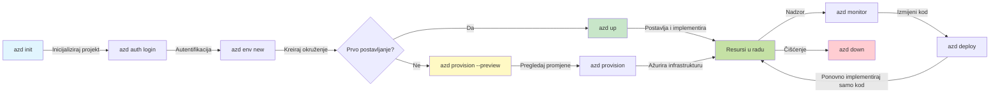
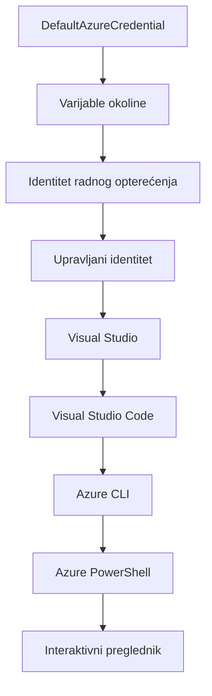

# Osnove AZD-a - Razumijevanje Azure Developer CLI-a

# Osnove AZD-a - Temeljni Koncepti i Osnove

**Navigacija poglavljima:**
- **📚 Početna stranica tečaja**: [AZD za početnike](../../README.md)
- **📖 Trenutno poglavlje**: Poglavlje 1 - Osnove i Brzi početak
- **⬅️ Prethodno**: [Pregled tečaja](../../README.md#-chapter-1-foundation--quick-start)
- **➡️ Sljedeće**: [Instalacija i postavljanje](installation.md)
- **🚀 Sljedeće poglavlje**: [Poglavlje 2: AI-First Development](../chapter-02-ai-development/microsoft-foundry-integration.md)

## Uvod

Ova lekcija uvodi vas u Azure Developer CLI (azd), moćan alat naredbenog retka koji ubrzava vaš put od lokalnog razvoja do raspoređivanja na Azure. Naučit ćete temeljne koncepte, glavne značajke i razumjeti kako azd pojednostavljuje implementaciju aplikacija cloud-native tipa.

## Ciljevi učenja

Na kraju ove lekcije ćete:
- Razumjeti što je Azure Developer CLI i njegovu primarnu svrhu
- Naučiti osnovne koncepte šablona, okruženja i servisa
- Istražiti ključne značajke uključujući razvoj vođen šablonima i infrastrukturu kao kod
- Razumjeti strukturu i tijek rada azd projekta
- Biti spremni za instalaciju i konfiguraciju azd-a za vaše razvojno okruženje

## Ishodi učenja

Nakon završetka ove lekcije moći ćete:
- Objasniti ulogu azd-a u modernim oblak razvojnim tijekovima rada
- Identificirati komponente strukture azd projekta
- Opisati kako šabloni, okruženja i servisi rade zajedno
- Razumjeti prednosti Infrastructure as Code s azd-om
- Prepoznati različite azd naredbe i njihove svrhe

## Što je Azure Developer CLI (azd)?

Azure Developer CLI (azd) je alat naredbenog retka dizajniran da ubrza vaš put od lokalnog razvoja do raspoređivanja na Azure. Pojednostavljuje proces izgradnje, implementacije i upravljanja cloud-native aplikacijama na Azure-u.

### Što možete rasporediti pomoću azd-a?

azd podržava širok raspon radnih opterećenja – i popis se stalno povećava. Danas možete koristiti azd za raspoređivanje:

| Vrsta radnog opterećenja | Primjeri | Isti tijek rada? |
|-------------------------|----------|------------------|
| **Tradicionalne aplikacije** | Web aplikacije, REST API-ji, statične stranice | ✅ `azd up` |
| **Servisi i mikroservisi** | Container Apps, Function Apps, višeservisni backendi | ✅ `azd up` |
| **AI-pokretane aplikacije** | Chat aplikacije s Microsoft Foundry Models, RAG rješenja s AI Search | ✅ `azd up` |
| **Inteligentni agenti** | Agentima hostirani u Foundry-ju, višestruke orkestracije agenata | ✅ `azd up` |

Ključni uvid je da **životni ciklus azd ostaje isti bez obzira na to što raspoređujete**. Inicijalizirate projekt, pripremite infrastrukturu, rasporedite kod, pratite aplikaciju i čistite resurse – bilo da je riječ o jednostavnoj web stranici ili sofisticiranom AI agentu.

Ova kontinuitet je po dizajnu. azd tretira AI mogućnosti kao još jedan tip servisa koji vaša aplikacija može koristiti, a ne kao nešto temeljno drugačije. Chat endpoint podržan Microsoft Foundry Models je, iz perspektive azd-a, samo još jedan servis za konfiguraciju i implementaciju.

### 🎯 Zašto koristiti AZD? Usporedba iz stvarnog svijeta

Usporedimo raspoređivanje jednostavne web aplikacije s bazom podataka:

#### ❌ BEZ AZD-a: Ručna Azure implementacija (30+ minuta)

```bash
# Korak 1: Kreirajte skup resursa
az group create --name myapp-rg --location eastus

# Korak 2: Kreirajte App Service plan
az appservice plan create --name myapp-plan \
  --resource-group myapp-rg \
  --sku B1 --is-linux

# Korak 3: Kreirajte web aplikaciju
az webapp create --name myapp-web-unique123 \
  --resource-group myapp-rg \
  --plan myapp-plan \
  --runtime "NODE:18-lts"

# Korak 4: Kreirajte Cosmos DB račun (10-15 minuta)
az cosmosdb create --name myapp-cosmos-unique123 \
  --resource-group myapp-rg \
  --kind MongoDB

# Korak 5: Kreirajte bazu podataka
az cosmosdb mongodb database create \
  --account-name myapp-cosmos-unique123 \
  --resource-group myapp-rg \
  --name tododb

# Korak 6: Kreirajte kolekciju
az cosmosdb mongodb collection create \
  --account-name myapp-cosmos-unique123 \
  --resource-group myapp-rg \
  --database-name tododb \
  --name todos

# Korak 7: Nabavite poveznicu za spajanje
CONN_STR=$(az cosmosdb keys list \
  --name myapp-cosmos-unique123 \
  --resource-group myapp-rg \
  --type connection-strings \
  --query "connectionStrings[0].connectionString" -o tsv)

# Korak 8: Konfigurirajte postavke aplikacije
az webapp config appsettings set \
  --name myapp-web-unique123 \
  --resource-group myapp-rg \
  --settings MONGODB_URI="$CONN_STR"

# Korak 9: Omogućite zapisivanje logova
az webapp log config --name myapp-web-unique123 \
  --resource-group myapp-rg \
  --application-logging filesystem \
  --detailed-error-messages true

# Korak 10: Postavite Application Insights
az monitor app-insights component create \
  --app myapp-insights \
  --location eastus \
  --resource-group myapp-rg

# Korak 11: Povežite App Insights s web aplikacijom
INSTRUMENTATION_KEY=$(az monitor app-insights component show \
  --app myapp-insights \
  --resource-group myapp-rg \
  --query "instrumentationKey" -o tsv)

az webapp config appsettings set \
  --name myapp-web-unique123 \
  --resource-group myapp-rg \
  --settings APPINSIGHTS_INSTRUMENTATIONKEY="$INSTRUMENTATION_KEY"

# Korak 12: Izgradite aplikaciju lokalno
npm install
npm run build

# Korak 13: Kreirajte paket za implementaciju
zip -r app.zip . -x "*.git*" "node_modules/*"

# Korak 14: Implementirajte aplikaciju
az webapp deployment source config-zip \
  --resource-group myapp-rg \
  --name myapp-web-unique123 \
  --src app.zip

# Korak 15: Pričekajte i molite se da radi 🙏
# (Nema automatske provjere, potrebno je ručno testiranje)
```
  
**Problemi:**  
- ❌ Više od 15 naredbi koje treba zapamtiti i izvršiti po redu  
- ❌ 30-45 minuta ručnog rada  
- ❌ Lako je napraviti pogreške (tipfeleri, pogrešni parametri)  
- ❌ Veze za pristup izložene u povijesti terminala  
- ❌ Nema automatskog vraćanja ako nešto ne uspije  
- ❌ Teško za replicirati kolegama iz tima  
- ❌ Svaki put drugačije (nerazmnoživo)

#### ✅ S AZD-om: Automatizirana implementacija (5 naredbi, 10-15 minuta)

```bash
# Korak 1: Inicijaliziraj iz predloška
azd init --template todo-nodejs-mongo

# Korak 2: Autentificiraj se
azd auth login

# Korak 3: Kreiraj okruženje
azd env new dev

# Korak 4: Pregledaj promjene (opcionalno, ali preporučeno)
azd provision --preview

# Korak 5: Implementiraj sve
azd up

# ✨ Gotovo! Sve je implementirano, konfigurirano i nadzirano
```
  
**Prednosti:**  
- ✅ **5 naredbi** naspram 15+ ručnih koraka  
- ✅ **10-15 minuta** ukupno (uglavnom čekanje Azura)  
- ✅ **Manje ručnih pogrešaka** - dosljedan, vođen šablonima tijek rada  
- ✅ **Sigurno rukovanje tajnama** - mnogi šabloni koriste Azure-om upravljano spremište tajni  
- ✅ **Ponavljajuće implementacije** - isti tijek rada svaki put  
- ✅ **Potpuno reproducibilno** - isti rezultat svaki put  
- ✅ **Pripremljeno za tim** - bilo tko može izvršiti implementaciju s istim naredbama  
- ✅ **Infrastruktura kao kod** - verzionirani Bicep šabloni  
- ✅ **Ugrađeni monitoring** - Application Insights automatski konfiguriran

### 📊 Smanjenje vremena i pogrešaka

| Mjera       | Ručna implementacija | AZD implementacija | Poboljšanje  |
|-------------|---------------------|--------------------|--------------|
| **Naredbe** | 15+                 | 5                  | 67% manje   |
| **Vrijeme** | 30-45 min           | 10-15 min          | 60% brže   |
| **Stopa pogrešaka** | ~40%          | <5%                | 88% smanjenje |
| **Dosljednost** | Niska (ručno)     | 100% (automatizirano) | Savršena   |
| **Uvođenje u tim** | 2-4 sata        | 30 minuta          | 75% brže   |
| **Vrijeme za poništenje** | preko 30 min (ručno) | 2 min (automatizirano) | 93% brže |

## Temeljni koncepti

### Šabloni
Šabloni su temelj azd-a. Oni sadrže:  
- **Kod aplikacije** - Vaš izvorni kod i ovisnosti  
- **Definicije infrastrukture** - Azure resursi definirani u Bicep ili Terraformu  
- **Konfiguracijske datoteke** - Postavke i varijable okoliša  
- **Skripte za implementaciju** - Automatizirani tijekovi rada implementacije

### Okruženja
Okruženja predstavljaju različite ciljeve implementacije:  
- **Razvojno** - Za testiranje i razvoj  
- **Staging** - Pred-produkcijsko okruženje  
- **Produkcijsko** - Živo produkcijsko okruženje  

Svako okruženje održava svoj:  
- Azure resource group  
- Konfiguracijske postavke  
- Stanje implementacije

### Servisi
Servisi su građevni blokovi vaše aplikacije:  
- **Frontend** - Web aplikacije, SPA  
- **Backend** - API-ji, mikroservisi  
- **Baza podataka** - Rješenja za pohranu podataka  
- **Spremište** - Pohrana datoteka i blobova

## Ključne značajke

### 1. Razvoj vođen šablonima  
```bash
# Pregledajte dostupne predloške
azd template list

# Inicijalizirajte iz predloška
azd init --template <template-name>
```
  
### 2. Infrastruktura kao kod  
- **Bicep** - Azure jezično specifičan jezik  
- **Terraform** - Višeoblačni infrastrukturni alat  
- **ARM šabloni** - Azure Resource Manager šabloni

### 3. Integrirani tijekovi rada  
```bash
# Kompletan tijek rada implementacije
azd up            # Provision + Deploy ovo je automatizirano za prvo postavljanje

# 🧪 NOVO: Pregledajte promjene infrastrukture prije implementacije (SIGURNO)
azd provision --preview    # Simulirajte implementaciju infrastrukture bez stvarnih promjena

azd provision     # Napravite Azure resurse ako ažurirate infrastrukturu koristite ovo
azd deploy        # Implementirajte kod aplikacije ili ponovno implementirajte kod aplikacije nakon ažuriranja
azd down          # Očistite resurse
```
  
#### 🛡️ Sigurno planiranje infrastrukture s pregledom  
`azd provision --preview` naredba je velika novost za sigurne implementacije:  
- **Suho pokretanje analize** - Prikazuje što će biti kreirano, izmijenjeno ili izbrisano  
- **Nulta opasnost** - Nema stvarnih promjena u vašem Azure okruženju  
- **Timsku suradnju** - Dijelite rezultate pregleda prije implementacije  
- **Procjenu troškova** - Razumite cijene resursa prije nego se obavežete

```bash
# Primjer pregleda radnog toka
azd provision --preview           # Pogledajte što će se promijeniti
# Pregledajte rezultat, razgovarajte s timom
azd provision                     # Primijenite promjene s povjerenjem
```
  
### 📊 Vizualno: AZD tijek rada razvoja


**Objašnjenje tijeka rada:**  
1. **Init** - Počnite sa šablonom ili novim projektom  
2. **Auth** - Autentikacija na Azure  
3. **Okruženje** - Kreirajte izolirano okruženje za implementaciju  
4. **Preview** - 🆕 Uvijek prvo pregledajte promjene infrastrukture (sigurna praksa)  
5. **Provision** - Kreirajte/azurirajte Azure resurse  
6. **Deploy** - Gurnite kod vaše aplikacije  
7. **Monitor** - Promatrajte performanse aplikacije  
8. **Iterate** - Napravite izmjene i ponovno rasporedite kod  
9. **Cleanup** - Uklonite resurse kad završite

### 4. Upravljanje okruženjima  
```bash
# Kreirajte i upravljajte okruženjima
azd env new <environment-name>
azd env select <environment-name>
azd env list
```
  
### 5. Ekstenzije i AI naredbe

azd koristi sustav ekstenzija za dodavanje mogućnosti izvan osnovnog CLI-ja. Ovo je posebno korisno za AI radna opterećenja:

```bash
# Nabroj dostupne ekstenzije
azd extension list

# Instaliraj Foundry agents ekstenziju
azd extension install azure.ai.agents

# Inicijaliziraj AI agent projekt iz manifesta
azd ai agent init -m agent-manifest.yaml

# Pokreni MCP server za razvoj uz AI pomoć (Alfa)
azd mcp start
```
  
> Ekstenzije su detaljno obrađene u [Poglavlju 2: AI-First Development](../chapter-02-ai-development/agents.md) i referenci [AZD AI CLI naredbi](../chapter-08-production/production-ai-practices.md#azd-ai-cli-commands-and-extensions).

## 📁 Struktura projekta

Tipična struktura azd projekta:  
```
my-app/
├── .azd/                    # azd configuration
│   └── config.json
├── .azure/                  # Azure deployment artifacts
├── .devcontainer/          # Development container config
├── .github/workflows/      # GitHub Actions
├── .vscode/               # VS Code settings
├── infra/                 # Infrastructure code
│   ├── main.bicep        # Main infrastructure template
│   ├── main.parameters.json
│   └── modules/          # Reusable modules
├── src/                  # Application source code
│   ├── api/             # Backend services
│   └── web/             # Frontend application
├── azure.yaml           # azd project configuration
└── README.md
```
  
## 🔧 Konfiguracijske datoteke

### azure.yaml  
Glavna konfiguracijska datoteka projekta:  
```yaml
name: my-awesome-app
metadata:
  template: my-template@1.0.0

services:
  web:
    project: ./src/web
    language: js
    host: appservice
  api:
    project: ./src/api
    language: js
    host: appservice

hooks:
  preprovision:
    shell: pwsh
    run: echo "Preparing to provision..."
```
  
### .azure/config.json  
Okružno-specifična konfiguracija:  
```json
{
  "version": 1,
  "defaultEnvironment": "dev",
  "environments": {
    "dev": {
      "subscriptionId": "your-subscription-id",
      "location": "eastus"
    }
  }
}
```
  
## 🎪 Uobičajeni tijekovi rada s praktičnim vježbama

> **💡 Savjet za učenje:** Slijedite ove vježbe redom kako biste postupno razvijali svoje AZD vještine.

### 🎯 Vježba 1: Inicijalizirajte svoj prvi projekt

**Cilj:** Kreirajte AZD projekt i istražite njegovu strukturu

**Koraci:**  
```bash
# Koristite provjereni predložak
azd init --template todo-nodejs-mongo

# Istražite generirane datoteke
ls -la  # Prikažite sve datoteke uključujući skrivene

# Ključne stvorene datoteke:
# - azure.yaml (glavna konfiguracija)
# - infra/ (kod infrastrukture)
# - src/ (kod aplikacije)
```
  
**✅ Uspjeh:** Imate direktorije azure.yaml, infra/ i src/

---

### 🎯 Vježba 2: Implementirajte na Azure

**Cilj:** Izvedite cjelokupnu implementaciju

**Koraci:**  
```bash
# 1. Autentificirajte se
az login && azd auth login

# 2. Kreirajte okruženje
azd env new dev
azd env set AZURE_LOCATION eastus

# 3. Pregledajte promjene (PREPORUČENO)
azd provision --preview

# 4. Postavite sve
azd up

# 5. Provjerite postavljanje
azd show    # Pogledajte URL vaše aplikacije
```
  
**Očekivano vrijeme:** 10-15 minuta  
**✅ Uspjeh:** URL aplikacije se otvara u pregledniku

---

### 🎯 Vježba 3: Višestruka okruženja

**Cilj:** Implementirajte u razvojno i staging okruženje

**Koraci:**  
```bash
# Već imate dev, stvorite staging
azd env new staging
azd env set AZURE_LOCATION westus2
azd up

# Prebacujte se između njih
azd env list
azd env select dev
```
  
**✅ Uspjeh:** Dvije odvojene resource grupe u Azure Portalu

---

### 🛡️ Čisto okruženje: `azd down --force --purge`

Kad trebate potpuno resetirati:

```bash
azd down --force --purge
```
  
**Što radi:**  
- `--force`: Bez potvrda korištenja  
- `--purge`: Briše sve lokalno stanje i Azure resurse

**Koristite kada:**  
- Implementacija nije uspjela na pola puta  
- Mijenjate projekte  
- Trebate potpuno svježi početak

---

## 🎪 Originalni referentni tijek rada

### Pokretanje novog projekta  
```bash
# Metoda 1: Koristi postojeći predložak
azd init --template todo-nodejs-mongo

# Metoda 2: Počni od nule
azd init

# Metoda 3: Koristi trenutni direktorij
azd init .
```
  
### Razvojni ciklus  
```bash
# Postavi razvojno okruženje
azd auth login
azd env new dev
azd env select dev

# Implementiraj sve
azd up

# Napravi izmjene i ponovo implementiraj
azd deploy

# Očisti kada završiš
azd down --force --purge # naredba u Azure Developer CLI znači **tvrd reset** za tvoje okruženje—posebno korisno kada rješavaš probleme s neuspjelim implementacijama, čistiš siroče resurse ili pripremaš novu implementaciju.
```
  
## Razumijevanje `azd down --force --purge`

`azd down --force --purge` naredba je snažan način da u potpunosti rastavite svoje azd okruženje i sve povezane resurse. Evo pregleda što svaki parametar radi:  
```
--force
```
- Preskače zahtjeve za potvrdu.  
- Korisno za automatizaciju ili skripte gdje ručni unos nije moguć.  
- Osigurava da razgradnja ide bez prekida, čak i ako CLI detektira nedosljednosti.

```
--purge
```
 Briše **sav povezani metapodatak**, uključujući:  
Stanje okruženja  
Lokalni `.azure` folder  
Predmemorirane informacije o implementaciji  
Sprječava da azd "pamti" prethodne implementacije, što može uzrokovati probleme kao što su neusklađene resource grupe ili zastarjeli registry reference.

### Zašto koristiti oboje?  
Kada zapnete s `azd up` zbog zaostalih stanja ili djelomičnih implementacija, ova kombinacija osigurava **čistu podlogu**.

Posebno je korisno nakon ručnih brisanja resursa u Azure portalu ili kada mijenjate šablone, okruženja ili konvencije imenovanja resource grupa.

### Upravljanje višestrukim okruženjima  
```bash
# Kreiraj pripremno okruženje
azd env new staging
azd env select staging
azd up

# Prebaci se natrag na razvoj
azd env select dev

# Usporedi okruženja
azd env list
```
  
## 🔐 Autentikacija i vjerodajnice

Razumijevanje autentikacije ključno je za uspješne azd implementacije. Azure koristi više metoda autentikacije, a azd koristi isti lanac vjerodajnica koji koriste i drugi Azure alati.

### Azure CLI autentikacija (`az login`)

Prije korištenja azd-a, potrebno se autentificirati na Azure. Najčešći način je korištenje Azure CLI:

```bash
# Interaktivna prijava (otvara preglednik)
az login

# Prijava s određenim najmodavcem
az login --tenant <tenant-id>

# Prijava s glavnim servisnim računom
az login --service-principal -u <app-id> -p <password> --tenant <tenant-id>

# Provjeri trenutni status prijave
az account show

# Popis dostupnih pretplata
az account list --output table

# Postavi zadanu pretplatu
az account set --subscription <subscription-id>
```
  
### Tijek autentikacije
1. **Interaktivni login**: Otvara vaš zadani preglednik za autentikaciju  
2. **Device Code Flow**: Za okruženja bez pristupa pregledniku  
3. **Service Principal**: Za automatizaciju i CI/CD scenarije  
4. **Managed Identity**: Za aplikacije hostane na Azure-u

### Lanac vjerodajnica DefaultAzureCredential

`DefaultAzureCredential` je tip vjerodajnica koji pruža pojednostavljen proces autentikacije automatskim isprobavanjem više izvora vjerodajnica u određenom redoslijedu:

#### Redoslijed lanca vjerodajnica  

#### 1. Varijable okruženja  
```bash
# Postavite varijable okoline za servisnog principala
export AZURE_CLIENT_ID="<app-id>"
export AZURE_CLIENT_SECRET="<password>"
export AZURE_TENANT_ID="<tenant-id>"
```
  
#### 2. Workload Identity (Kubernetes/GitHub Actions)  
Automatski se koristi u:  
- Azure Kubernetes Service (AKS) s Workload Identity  
- GitHub Actions s OIDC federacijom  
- Drugi scenariji federirane identifikacije

#### 3. Managed Identity  
Za Azure resurse poput:  
- Virtualnih strojeva  
- App Service  
- Azure Functions  
- Container Instances

```bash
# Provjerite radi li se na Azure resursu s upravljanim identitetom
az account show --query "user.type" --output tsv
# Vraća: "servicePrincipal" ako se koristi upravljani identitet
```
  
#### 4. Integracija s alatima za razvoj  
- **Visual Studio**: Automatski koristi prijavljen račun  
- **VS Code**: Koristi vjerodajnice Azure Account ekstenzije  
- **Azure CLI**: Koristi vjerodajnice `az login` (najčešće za lokalni razvoj)

### Postavljanje autentikacije za AZD

```bash
# Metoda 1: Koristite Azure CLI (preporučeno za razvoj)
az login
azd auth login  # Koristi postojeće vjerodajnice Azure CLI-ja

# Metoda 2: Izravna azd autentifikacija
azd auth login --use-device-code  # Za okruženja bez sučelja

# Metoda 3: Provjeri status autentifikacije
azd auth login --check-status

# Metoda 4: Odjava i ponovna autentifikacija
azd auth logout
azd auth login
```
  
### Najbolje prakse za autentikaciju

#### Za lokalni razvoj  
```bash
# 1. Prijavite se pomoću Azure CLI
az login

# 2. Provjerite ispravnu pretplatu
az account show
az account set --subscription "Your Subscription Name"

# 3. Koristite azd s postojećim vjerodajnicama
azd auth login
```
  
#### Za CI/CD pipelineove  
```yaml
# GitHub Actions example
- name: Azure Login
  uses: azure/login@v1
  with:
    creds: ${{ secrets.AZURE_CREDENTIALS }}

- name: Deploy with azd
  run: |
    azd auth login --client-id ${{ secrets.AZURE_CLIENT_ID }} \
                    --client-secret ${{ secrets.AZURE_CLIENT_SECRET }} \
                    --tenant-id ${{ secrets.AZURE_TENANT_ID }}
    azd up --no-prompt
```
  
#### Za produkcijska okruženja  
- Koristite **Managed Identity** prilikom rada na Azure resursima  
- Koristite **Service Principal** za automatizacijske scenarije  
- Izbjegavajte pohranu vjerodajnica u kod ili konfiguracijske datoteke  
- Koristite **Azure Key Vault** za osjetljivu konfiguraciju

### Uobičajeni problemi s autentikacijom i rješenja

#### Problem: "Nema pretplate"  
```bash
# Rješenje: Postavite zadanu pretplatu
az account list --output table
az account set --subscription "<subscription-id>"
azd env set AZURE_SUBSCRIPTION_ID "<subscription-id>"
```
  
#### Problem: "Nedovoljna dopuštenja"  
```bash
# Rješenje: Provjerite i dodijelite potrebne uloge
az role assignment list --assignee $(az account show --query user.name --output tsv)

# Uobičajene potrebne uloge:
# - Suradnik (za upravljanje resursima)
# - Administrator pristupa korisnicima (za dodjelu uloga)
```
  
#### Problem: "Token je istekao"  
```bash
# Rješenje: Ponovno se autentificirajte
az logout
az login
azd auth logout
azd auth login
```
  
### Autentikacija u različitim scenarijima

#### Lokalni razvoj  
```bash
# Račun za osobni razvoj
az login
azd auth login
```
  
#### Razvoj u timu  
```bash
# Koristite specifični zakupac za organizaciju
az login --tenant contoso.onmicrosoft.com
azd auth login
```
  
#### Scenariji s višestrukim zakupcima  
```bash
# Prebaci između najmodavaca
az login --tenant tenant1.onmicrosoft.com
# Postavi na najmodavca 1
azd up

az login --tenant tenant2.onmicrosoft.com  
# Postavi na najmodavca 2
azd up
```
  
### Sigurnosni aspekti
1. **Spremanje vjerodajnica**: Nikada ne pohranjujte vjerodajnice u izvorni kod  
2. **Ograničenje opsega**: Koristite načelo najmanjih privilegija za servisne principe  
3. **Rotacija tokena**: Redovito rotirajte tajne servisnih principa  
4. **Revizijski trag**: Nadzirite aktivnosti autentifikacije i implementacije  
5. **Sigurnost mreže**: Koristite privatne krajnje točke kad god je moguće  

### Rješavanje problema s autentifikacijom

```bash
# Otklanjanje problema s autentifikacijom
azd auth login --check-status
az account show
az account get-access-token

# Uobičajene dijagnostičke naredbe
whoami                          # Trenutni korisnički kontekst
az ad signed-in-user show      # Podaci o korisniku Azure AD
az group list                  # Test pristupa resursu
```
  
## Razumijevanje `azd down --force --purge`  

### Otkrivanje  
```bash
azd template list              # Pregledajte predloške
azd template show <template>   # Detalji predloška
azd init --help               # Opcije inicijalizacije
```
  
### Upravljanje projektom  
```bash
azd show                     # Pregled projekta
azd env list                # Dostupna okruženja i odabrano zadano
azd config show            # Postavke konfiguracije
```
  
### Nadgledanje  
```bash
azd monitor                  # Otvorite Azure portal za nadzor
azd monitor --logs           # Pregledajte zapisnike aplikacije
azd monitor --live           # Pregledajte žive metrike
azd pipeline config          # Postavite CI/CD
```
  
## Najbolje prakse  

### 1. Koristite smisrena imena  
```bash
# Dobro
azd env new production-east
azd init --template web-app-secure

# Izbjegavati
azd env new env1
azd init --template template1
```
  
### 2. Iskoristite predloške  
- Počnite s postojećim predlošcima  
- Prilagodite ih svojim potrebama  
- Kreirajte predloške za višekratnu upotrebu u svojoj organizaciji  

### 3. Izolacija okruženja  
- Koristite zasebna okruženja za razvoj/testiranje/produkciju  
- Nikada nemojte implementirati izravno u produkciju sa lokalnog računala  
- Koristite CI/CD cjevovode za produkcijske implementacije  

### 4. Upravljanje konfiguracijom  
- Koristite varijable okruženja za osjetljive podatke  
- Držite konfiguraciju pod verzijskom kontrolom  
- Dokumentirajte postavke specifične za okruženje  

## Napredak u učenju  

### Početnik (Tjedan 1-2)  
1. Instalirajte azd i autentificirajte se  
2. Implementirajte jednostavan predložak  
3. Razumite strukturu projekta  
4. Naučite osnovne naredbe (up, down, deploy)  

### Srednji nivo (Tjedan 3-4)  
1. Prilagodite predloške  
2. Upravljajte višestrukim okruženjima  
3. Razumite kod infrastrukture  
4. Postavite CI/CD cjevovode  

### Napredni (Tjedan 5+)  
1. Kreirajte prilagođene predloške  
2. Napredni obrasci infrastrukture  
3. Implementacije u više regija  
4. Enterprise-grade konfiguracije  

## Sljedeći koraci  

**📖 Nastavite učenje u Poglavlju 1:**  
- [Instalacija i postavljanje](installation.md) - Instalirajte i konfigurirajte azd  
- [Vaš prvi projekt](first-project.md) - Završite praktični vodič  
- [Vodič za konfiguraciju](configuration.md) - Napredne opcije konfiguracije  

**🎯 Spremni za sljedeće poglavlje?**  
- [Poglavlje 2: AI-prvi razvoj](../chapter-02-ai-development/microsoft-foundry-integration.md) - Počnite graditi AI aplikacije  

## Dodatni resursi  

- [Pregled Azure Developer CLI](https://learn.microsoft.com/en-us/azure/developer/azure-developer-cli/)  
- [Galerija predložaka](https://azure.github.io/awesome-azd/)  
- [Community primjeri](https://github.com/Azure-Samples)  

---

## 🙋 Često postavljana pitanja  

### Opća pitanja  

**P: Koja je razlika između AZD i Azure CLI?**  

O: Azure CLI (`az`) služi za upravljanje pojedinačnim Azure resursima. AZD (`azd`) upravlja cijelim aplikacijama:  

```bash
# Azure CLI - Upravljanje resursima na niskoj razini
az webapp create --name myapp --resource-group rg
az sql server create --name myserver --resource-group rg
# ...potrebno je još mnogo naredbi

# AZD - Upravljanje na razini aplikacije
azd up  # Implementira cijelu aplikaciju sa svim resursima
```
  
**Razmislite ovako:**  
- `az` = Rukovanje pojedinačnim Lego kockicama  
- `azd` = Rad s kompletnim Lego setovima  

---

**P: Trebam li znati Bicep ili Terraform da bih koristio AZD?**  

O: Ne! Počnite s predlošcima:  
```bash
# Koristite postojeći predložak - nije potrebno znanje o IaC
azd init --template todo-nodejs-mongo
azd up
```
  
Kasnije možete naučiti Bicep za prilagodbu infrastrukture. Predlošci pružaju radne primjere za učenje.  

---

**P: Koliko košta pokretanje AZD predložaka?**  

O: Troškovi variraju ovisno o predlošku. Većina razvojnih predložaka košta 50-150 USD mjesečno:  

```bash
# Pregledajte troškove prije implementacije
azd provision --preview

# Uvijek očistite kada ne koristite
azd down --force --purge  # Uklanja sve resurse
```
  
**Stručni savjet:** Koristite besplatne slojeve gdje je moguće:  
- App Service: F1 (besplatni) sloj  
- Microsoft Foundry modeli: Azure OpenAI 50.000 tokena/mjesečno besplatno  
- Cosmos DB: 1000 RU/s besplatni sloj  

---

**P: Mogu li koristiti AZD s postojećim Azure resursima?**  

O: Da, ali je lakše početi iznova. AZD najbolje radi kad upravlja cijelim životnim ciklusom. Za postojeće resurse:  

```bash
# Opcija 1: Uvezi postojeće resurse (napredno)
azd init
# Zatim izmijeni infra/ da referencira postojeće resurse

# Opcija 2: Započni ispočetka (preporučeno)
azd init --template matching-your-stack
azd up  # Stvara novo okruženje
```
  
---

**P: Kako dijeliti projekt s kolegama?**  

O: Poslužite AZD projekt u Git repozitorij (ali NE .azure mapu):  

```bash
# Već zadano u .gitignore
.azure/        # Sadrži tajne i podatke o okruženju
*.env          # Varijable okruženja

# Članovi tima tada:
git clone <your-repo>
azd auth login
azd env new <their-name>-dev
azd up
```
  
Svi dobiju identičnu infrastrukturu iz istih predložaka.  

---

### Pitanja o rješavanju problema  

**P: "azd up" nije uspio do kraja. Što da radim?**  

O: Provjerite pogrešku, ispravite je, zatim pokušajte ponovno:  

```bash
# Pregledajte detaljne zapise
azd show

# Uobičajena rješenja:

# 1. Ako je kvota premašena:
azd env set AZURE_LOCATION "westus2"  # Isprobajte drugu regiju

# 2. Ako postoji sukob u nazivu resursa:
azd down --force --purge  # Početak ispočetka
azd up  # Pokušajte ponovno

# 3. Ako je autorizacija istekla:
az login
azd auth login
azd up
```
  
**Najčešći problem:** Odabran je pogrešan Azure pretplatnički račun  
```bash
az account list --output table
az account set --subscription "<correct-subscription>"
```
  
---

**P: Kako implementirati samo promjene u kodu bez ponovnog postavljanja?**  

O: Koristite `azd deploy` umjesto `azd up`:  

```bash
azd up          # Prvi put: priprema + implementacija (sporo)

# Napravite promjene u kodu...

azd deploy      # Sljedeći put: samo implementacija (brzo)
```
  
Usporedba brzine:  
- `azd up`: 10-15 minuta (postavlja infrastrukturu)  
- `azd deploy`: 2-5 minuta (samo kod)  

---

**P: Mogu li prilagoditi predloške infrastrukture?**  

O: Da! Uredite Bicep datoteke u `infra/`:  

```bash
# Nakon azd init
cd infra/
code main.bicep  # Uredi u VS Code

# Pregledaj promjene
azd provision --preview

# Primijeni promjene
azd provision
```
  
**Savjet:** Počnite s malim promjenama - prvo izmijenite SKU-e:  
```bicep
// infra/main.bicep
sku: {
  name: 'B1'  // Change to 'P1V2' for production
}
```
  
---

**P: Kako obrisati sve što je AZD kreirao?**  

O: Jedna naredba uklanja sve resurse:  

```bash
azd down --force --purge

# Ovo briše:
# - Sve Azure resurse
# - Skup resursa
# - Stanje lokalnog okruženja
# - Predmemorirane podatke o implementaciji
```
  
**Uvijek pokrenite kada:**  
- Završite testiranje predloška  
- Prebacujete se na drugi projekt  
- Želite početi iznova  

**Ušteda troškova:** Brisanje neiskorištenih resursa = 0 troškova  

---

**P: Što ako slučajno obrišem resurse u Azure portalu?**  

O: Stanje AZD može biti nesinkronizirano. Pristup „čistom listu“:  

```bash
# 1. Ukloni lokalno stanje
azd down --force --purge

# 2. Počni iznova
azd up

# Alternativa: Pusti AZD da otkrije i popravi
azd provision  # Kreirat će nedostajuće resurse
```
  
---

### Napredna pitanja  

**P: Mogu li koristiti AZD u CI/CD cjevovodima?**  

O: Da! Primjer GitHub Actions:  

```yaml
# .github/workflows/deploy.yml
name: Deploy with AZD

on:
  push:
    branches: [main]

jobs:
  deploy:
    runs-on: ubuntu-latest
    steps:
      - uses: actions/checkout@v2
      
      - name: Install azd
        run: curl -fsSL https://aka.ms/install-azd.sh | bash
      
      - name: Azure Login
        run: |
          azd auth login \
            --client-id ${{ secrets.AZURE_CLIENT_ID }} \
            --client-secret ${{ secrets.AZURE_CLIENT_SECRET }} \
            --tenant-id ${{ secrets.AZURE_TENANT_ID }}
      
      - name: Deploy
        run: azd up --no-prompt
```
  
---

**P: Kako upravljati tajnama i osjetljivim podacima?**  

O: AZD se automatski integrira s Azure Key Vault:  

```bash
# Tajne se pohranjuju u Key Vault, ne u kod
azd env set DATABASE_PASSWORD "$(openssl rand -base64 32)"

# AZD automatski:
# 1. Stvara Key Vault
# 2. Pohranjuje tajnu
# 3. Dodjeljuje aplikaciji pristup putem Managed Identity
# 4. Ubrizgava u vrijeme izvođenja
```
  
**Nikada ne dodajte u repozitorij:**  
- `.azure/` mapu (sadrži podatke o okruženjima)  
- `.env` datoteke (lokalne tajne)  
- Poveznice za pristup  

---

**P: Mogu li implementirati u više regija?**  

O: Da, kreirajte okruženje za svaku regiju:  

```bash
# Okruženje Istočni SAD
azd env new prod-eastus
azd env set AZURE_LOCATION eastus
azd up

# Okruženje Zapadna Europa
azd env new prod-westeurope
azd env set AZURE_LOCATION westeurope
azd up

# Svako okruženje je neovisno
azd env list
```
  
Za prave višeregionalne aplikacije prilagodite Bicep predloške za simultanu implementaciju u više regija.  

---

**P: Gdje mogu dobiti pomoć ako zapnem?**  

1. **AZD dokumentacija:** https://learn.microsoft.com/azure/developer/azure-developer-cli/  
2. **GitHub Issues:** https://github.com/Azure/azure-dev/issues  
3. **Discord:** [Azure Discord](https://discord.gg/microsoft-azure) - kanal #azure-developer-cli  
4. **Stack Overflow:** Oznaka `azure-developer-cli`  
5. **Ovaj tečaj:** [Vodič za rješavanje problema](../chapter-07-troubleshooting/common-issues.md)  

**Stručni savjet:** Prije nego što pitate, pokrenite:  
```bash
azd show       # Prikazuje trenutačno stanje
azd version    # Prikazuje vašu verziju
```
Uključite ove informacije u svoje pitanje za bržu pomoć.  

---

## 🎓 Što je sljedeće?  

Sada razumijete osnove AZD-a. Odaberite svoj put:  

### 🎯 Za početnike:  
1. **Sljedeće:** [Instalacija i postavljanje](installation.md) - Instalirajte AZD na svoje računalo  
2. **Zatim:** [Vaš prvi projekt](first-project.md) - Implementirajte prvu aplikaciju  
3. **Vježbajte:** Završite svih 3 zadatka u ovoj lekciji  

### 🚀 Za AI programere:  
1. **Preskočite na:** [Poglavlje 2: AI-prvi razvoj](../chapter-02-ai-development/microsoft-foundry-integration.md)  
2. **Implementirajte:** Počnite s `azd init --template get-started-with-ai-chat`  
3. **Učite:** Gradite dok implementirate  

### 🏗️ Za iskusne programere:  
1. **Pregledajte:** [Vodič za konfiguraciju](configuration.md) - Napredne postavke  
2. **Istražite:** [Infrastruktura kao kod](../chapter-04-infrastructure/provisioning.md) - Detaljna analiza Bicep-a  
3. **Gradite:** Kreirajte prilagođene predloške za svoj sklad  

---

**Navigacija po poglavljima:**  
- **📚 Početna stranica tečaja:** [AZD za početnike](../../README.md)  
- **📖 Trenutno poglavlje:** Poglavlje 1 - Osnove i brzi početak  
- **⬅️ Prethodno:** [Pregled tečaja](../../README.md#-chapter-1-foundation--quick-start)  
- **➡️ Sljedeće:** [Instalacija i postavljanje](installation.md)  
- **🚀 Sljedeće poglavlje:** [Poglavlje 2: AI-prvi razvoj](../chapter-02-ai-development/microsoft-foundry-integration.md)

---

<!-- CO-OP TRANSLATOR DISCLAIMER START -->
**Izjava o odricanju odgovornosti**:  
Ovaj dokument je preveden pomoću AI prevoditeljskog servisa [Co-op Translator](https://github.com/Azure/co-op-translator). Iako težimo točnosti, imajte na umu da automatizirani prijevodi mogu sadržavati pogreške ili netočnosti. Izvorni dokument na izvornom jeziku treba smatrati autoritativnim izvorom. Za kritične informacije preporučuje se profesionalni ljudski prijevod. Nismo odgovorni za bilo kakve nesporazume ili kriva tumačenja proistekla iz korištenja ovog prijevoda.
<!-- CO-OP TRANSLATOR DISCLAIMER END -->