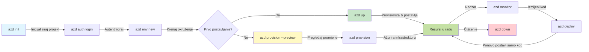
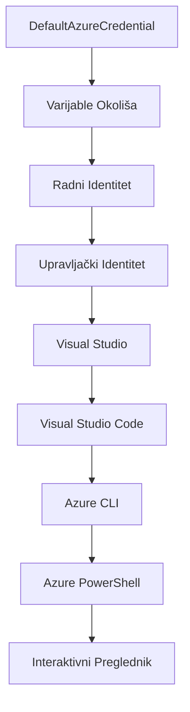

# AZD Osnove - Razumijevanje Azure Developer CLI

# AZD Osnove - Temeljni Koncepti i Osnove

**Navigacija kroz poglavlja:**
- **📚 Početna stranica tečaja**: [AZD za početnike](../../README.md)
- **📖 Trenutno poglavlje**: Poglavlje 1 - Osnove i Brzi početak
- **⬅️ Prethodno**: [Pregled tečaja](../../README.md#-chapter-1-foundation--quick-start)
- **➡️ Sljedeće**: [Instalacija i postavljanje](installation.md)
- **🚀 Sljedeće poglavlje**: [Poglavlje 2: AI-prvi razvoj](../chapter-02-ai-development/microsoft-foundry-integration.md)

## Uvod

Ova lekcija uvodi vas u Azure Developer CLI (azd), moćan alat naredbenog retka koji ubrzava vaš put od lokalnog razvoja do Azure implementacije. Naučit ćete temeljne koncepte, glavne značajke i razumjeti kako azd pojednostavljuje implementaciju aplikacija nativnih za oblak.

## Ciljevi učenja

Na kraju ove lekcije, moći ćete:
- Razumjeti što je Azure Developer CLI i njegovu primarnu svrhu
- Naučiti osnovne koncepte predložaka, okruženja i servisa
- Istražiti ključne značajke uključujući razvoj vođen predlošcima i Infrastrukturu kao Kôd
- Razumjeti strukturu projekta azd i tijek rada
- Biti spremni za instalaciju i konfiguraciju azd u vašem razvojnom okruženju

## Ishodi učenja

Nakon završetka ove lekcije, moći ćete:
- Objasniti ulogu azd u modernim radnim tokovima razvoja u oblaku
- Identificirati komponente strukture azd projekta
- Opisati kako predlošci, okruženja i servisi surađuju
- Razumjeti prednosti Infrastrukture kao Kôda s azd
- Prepoznati različite azd naredbe i njihove svrhe

## Što je Azure Developer CLI (azd)?

Azure Developer CLI (azd) je alat naredbenog retka dizajniran da ubrza vaš put od lokalnog razvoja do Azure implementacije. Pojednostavljuje proces izgradnje, implementacije i upravljanja aplikacijama nativnim za oblak na Azureu.

### Što možete implementirati s azd?

azd podržava širok spektar radnih opterećenja — i popis se stalno povećava. Danas, azd možete koristiti za implementaciju:

| Vrsta radnog opterećenja | Primjeri | Isti tijek rada? |
|-------------------------|----------|------------------|
| **Tradicionalne aplikacije** | Web aplikacije, REST API-ji, statične stranice | ✅ `azd up` |
| **Servisi i mikroservisi** | Container Apps, Function Apps, višeservisni backendi | ✅ `azd up` |
| **Aplikacije pokretane AI-em** | Chat aplikacije s Microsoft Foundry modelima, RAG rješenja s AI pretraživanjem | ✅ `azd up` |
| **Inteligentni agenti** | Agenti hostani u Foundryju, višagentne orkestracije | ✅ `azd up` |

Ključni uvid je da **životni ciklus azd ostaje isti bez obzira što implementirate**. Inicirate projekt, pripremate infrastrukturu, implementirate svoj kôd, pratite aplikaciju i čistite resurse — bilo da je riječ o jednostavnoj web stranici ili sofisticiranom AI agentu.

Ova kontinuitet je po dizajnu. azd tretira AI mogućnosti kao još jednu vrstu servisa koji vaša aplikacija može koristiti, a ne kao nešto temeljno drugačije. Chat krajnja točka potpomognuta Microsoft Foundry modelima je, iz perspektive azd-a, samo još jedan servis za konfiguraciju i implementaciju.

### 🎯 Zašto koristiti AZD? Usporedba iz stvarnog svijeta

Usporedimo implementaciju jednostavne web aplikacije s bazom podataka:

#### ❌ BEZ AZD: Ručna Azure implementacija (30+ minuta)

```bash
# Korak 1: Kreirajte grupu resursa
az group create --name myapp-rg --location eastus

# Korak 2: Kreirajte App Service plan
az appservice plan create --name myapp-plan \
  --resource-group myapp-rg \
  --sku B1 --is-linux

# Korak 3: Kreirajte web aplikaciju
az webapp create --name myapp-web-unique123 \
  --resource-group myapp-rg \
  --plan myapp-plan \
  --runtime "NODE:18-lts"

# Korak 4: Kreirajte Cosmos DB račun (10-15 minuta)
az cosmosdb create --name myapp-cosmos-unique123 \
  --resource-group myapp-rg \
  --kind MongoDB

# Korak 5: Kreirajte bazu podataka
az cosmosdb mongodb database create \
  --account-name myapp-cosmos-unique123 \
  --resource-group myapp-rg \
  --name tododb

# Korak 6: Kreirajte kolekciju
az cosmosdb mongodb collection create \
  --account-name myapp-cosmos-unique123 \
  --resource-group myapp-rg \
  --database-name tododb \
  --name todos

# Korak 7: Nabavite connection string
CONN_STR=$(az cosmosdb keys list \
  --name myapp-cosmos-unique123 \
  --resource-group myapp-rg \
  --type connection-strings \
  --query "connectionStrings[0].connectionString" -o tsv)

# Korak 8: Konfigurirajte postavke aplikacije
az webapp config appsettings set \
  --name myapp-web-unique123 \
  --resource-group myapp-rg \
  --settings MONGODB_URI="$CONN_STR"

# Korak 9: Omogućite zapisivanje dnevnika
az webapp log config --name myapp-web-unique123 \
  --resource-group myapp-rg \
  --application-logging filesystem \
  --detailed-error-messages true

# Korak 10: Postavite Application Insights
az monitor app-insights component create \
  --app myapp-insights \
  --location eastus \
  --resource-group myapp-rg

# Korak 11: Povežite App Insights s web aplikacijom
INSTRUMENTATION_KEY=$(az monitor app-insights component show \
  --app myapp-insights \
  --resource-group myapp-rg \
  --query "instrumentationKey" -o tsv)

az webapp config appsettings set \
  --name myapp-web-unique123 \
  --resource-group myapp-rg \
  --settings APPINSIGHTS_INSTRUMENTATIONKEY="$INSTRUMENTATION_KEY"

# Korak 12: Izgradite aplikaciju lokalno
npm install
npm run build

# Korak 13: Kreirajte paket za implementaciju
zip -r app.zip . -x "*.git*" "node_modules/*"

# Korak 14: Implementirajte aplikaciju
az webapp deployment source config-zip \
  --resource-group myapp-rg \
  --name myapp-web-unique123 \
  --src app.zip

# Korak 15: Pričekajte i molite se da radi 🙏
# (Nema automatizirane validacije, potrebna je ručna provjera)
```

**Problemi:**
- ❌ 15+ naredbi za pamćenje i izvođenje redom
- ❌ 30-45 minuta ručnog rada
- ❌ Lako je pogriješiti (tipfeleri, pogrešni parametri)
- ❌ Veze za povezivanje izložene u povijesti terminala
- ❌ Nema automatskog povrata u slučaju pogreške
- ❌ Teško za replicirati za članove tima
- ❌ Svaki put drugačije (nereproducibilno)

#### ✅ SA AZD: Automatizirana implementacija (5 naredbi, 10-15 minuta)

```bash
# Korak 1: Inicijaliziraj iz predloška
azd init --template todo-nodejs-mongo

# Korak 2: Autentificiraj se
azd auth login

# Korak 3: Kreiraj okruženje
azd env new dev

# Korak 4: Pregledaj promjene (opcionalno ali preporučeno)
azd provision --preview

# Korak 5: Postavi sve
azd up

# ✨ Gotovo! Sve je postavljeno, konfigurirano i nadzirano
```

**Prednosti:**
- ✅ **5 naredbi** naspram 15+ ručnih koraka
- ✅ **10-15 minuta** ukupno vrijeme (pretežno čekanje na Azure)
- ✅ **Nema pogrešaka** - automatizirano i testirano
- ✅ **Sigurno upravljanje tajnama** preko Key Vaulta
- ✅ **Automatski povratak** pri neuspjehu
- ✅ **Potpuno reproducibilno** - isti rezultat svaki put
- ✅ **Spremno za tim** - bilo tko može implementirati istim naredbama
- ✅ **Infrastruktura kao kôd** - verzionirani Bicep predlošci
- ✅ **Ugrađeni nadzor** - Application Insights konfiguriran automatski

### 📊 Smanjenje vremena i pogrešaka

| Metrika | Ručna implementacija | AZD implementacija | Poboljšanje |
|:--------|:--------------------|:-------------------|:------------|
| **Naredbe** | 15+ | 5 | 67% manje |
| **Vrijeme** | 30-45 min | 10-15 min | 60% brže |
| **Stopa pogrešaka** | ~40% | <5% | 88% smanjenje |
| **Dosljednost** | Niska (ručno) | 100% (automatizirano) | Savršeno |
| **Uvođenje u tim** | 2-4 sata | 30 minuta | 75% brže |
| **Vrijeme vraćanja stanja** | 30+ min (ručno) | 2 min (automatizirano) | 93% brže |

## Temeljni koncepti

### Predlošci
Predlošci su temelj azd-a. Sadrže:
- **Kôd aplikacije** - Vaš izvorni kôd i ovisnosti
- **Definicije infrastrukture** - Azure resursi definirani u Bicep ili Terraform
- **Konfiguracijske datoteke** - Postavke i varijable okruženja
- **Skripte za implementaciju** - Automatizirani tijekovi implementacije

### Okruženja
Okruženja predstavljaju različite ciljeve implementacije:
- **Razvojno** - Za testiranje i razvoj
- **Predprodukcijsko** - Okruženje prije produkcije
- **Produkcijsko** - Živo produkcijsko okruženje

Svako okruženje održava vlastito:
- Azure grupu resursa
- Postavke konfiguracije
- Stanje implementacije

### Servisi
Servisi su građevni blokovi vaše aplikacije:
- **Frontend** - Web aplikacije, SPA
- **Backend** - API-ji, mikroservisi
- **Baza podataka** - Rješenja za pohranu podataka
- **Pohrana** - Pohrana datoteka i blobova

## Ključne značajke

### 1. Razvoj vođen predlošcima
```bash
# Pregledajte dostupne predloške
azd template list

# Inicijalizirajte iz predloška
azd init --template <template-name>
```

### 2. Infrastruktura kao Kôd
- **Bicep** - specifični jezik za Azure domenu
- **Terraform** - alat za više oblaka
- **ARM predlošci** - predlošci Azure Resource Managera

### 3. Integrirani tijekovi rada
```bash
# Kompletan tijek rada implementacije
azd up            # Provision + Implementacija ovo je bez ruku za početno postavljanje

# 🧪 NOVO: Pregledajte promjene infrastrukture prije implementacije (SIGURNO)
azd provision --preview    # Simulirajte implementaciju infrastrukture bez stvarnih promjena

azd provision     # Kreirajte Azure resurse ako ažurirate infrastrukturu koristite ovo
azd deploy        # Implementirajte kod aplikacije ili ponovno implementirajte kod aplikacije nakon ažuriranja
azd down          # Očistite resurse
```

#### 🛡️ Sigurno planiranje infrastrukture s pregledom
Naredba `azd provision --preview` je revolucionarna za sigurne implementacije:
- **Suho pokretanje** - prikazuje što će biti stvoreno, izmijenjeno ili izbrisano
- **Nulta rizika** - ne radi stvarne promjene u vašem Azure okruženju
- **Timsku suradnju** - dijelite rezultate pregleda prije implementacije
- **Procjena troškova** - razumite troškove resursa prije obveze

```bash
# Primjer pregleda tijeka rada
azd provision --preview           # Pogledajte što će se promijeniti
# Pregledajte rezultat, razgovarajte s timom
azd provision                     # Primijenite promjene s povjerenjem
```

### 📊 Vizualno: Tijekom rada AZD razvoja


**Objašnjenje tijeka rada:**
1. **Init** - Počnite s predloškom ili novim projektom
2. **Auth** - Autentificirajte se s Azureom
3. **Environment** - Stvorite izolirano okruženje za implementaciju
4. **Preview** - 🆕 Uvijek prvo pregledajte promjene infrastrukture (sigurna praksa)
5. **Provision** - Stvaranje/azuriranje Azure resursa
6. **Deploy** - Gurnite svoj kôd aplikacije
7. **Monitor** - Promatrajte izvedbu aplikacije
8. **Iterate** - Napravite promjene i ponovo implementirajte kôd
9. **Cleanup** - Uklonite resurse kada završite

### 4. Upravljanje okruženjima
```bash
# Kreirajte i upravljajte okruženjima
azd env new <environment-name>
azd env select <environment-name>
azd env list
```

### 5. Ekstenzije i AI naredbe

azd koristi sustav ekstenzija za dodatne mogućnosti izvan same CLI jezgre. Ovo je posebno korisno za AI radna opterećenja:

```bash
# Popis dostupnih proširenja
azd extension list

# Instaliraj proširenje Foundry agente
azd extension install azure.ai.agents

# Inicijaliziraj AI agent projekt iz manifesta
azd ai agent init -m agent-manifest.yaml

# Pokreni MCP poslužitelj za razvoj uz pomoć AI (Alfa)
azd mcp start
```

> Ekstenzije su detaljno objašnjene u [Poglavlje 2: AI-prvi razvoj](../chapter-02-ai-development/agents.md) i referencama [AZD AI CLI naredbi](../chapter-08-production/production-ai-practices.md#azd-ai-cli-commands-and-extensions).

## 📁 Struktura projekta

Tipična struktura azd projekta:
```
my-app/
├── .azd/                    # azd configuration
│   └── config.json
├── .azure/                  # Azure deployment artifacts
├── .devcontainer/          # Development container config
├── .github/workflows/      # GitHub Actions
├── .vscode/               # VS Code settings
├── infra/                 # Infrastructure code
│   ├── main.bicep        # Main infrastructure template
│   ├── main.parameters.json
│   └── modules/          # Reusable modules
├── src/                  # Application source code
│   ├── api/             # Backend services
│   └── web/             # Frontend application
├── azure.yaml           # azd project configuration
└── README.md
```

## 🔧 Konfiguracijske datoteke

### azure.yaml
Glavna konfiguracijska datoteka projekta:
```yaml
name: my-awesome-app
metadata:
  template: my-template@1.0.0

services:
  web:
    project: ./src/web
    language: js
    host: appservice
  api:
    project: ./src/api
    language: js
    host: appservice

hooks:
  preprovision:
    shell: pwsh
    run: echo "Preparing to provision..."
```

### .azure/config.json
Konfiguracija specifična za okruženje:
```json
{
  "version": 1,
  "defaultEnvironment": "dev",
  "environments": {
    "dev": {
      "subscriptionId": "your-subscription-id",
      "location": "eastus"
    }
  }
}
```

## 🎪 Česti tijekovi rada s praktičnim vježbama

> **💡 Savjet za učenje:** Slijedite ove vježbe redom kako biste postepeno razvili vaše AZD vještine.

### 🎯 Vježba 1: Inicijalizirajte svoj prvi projekt

**Cilj:** Stvoriti AZD projekt i istražiti njegovu strukturu

**Koraci:**
```bash
# Koristite dokazani predložak
azd init --template todo-nodejs-mongo

# Istražite generirane datoteke
ls -la  # Prikaži sve datoteke uključujući skrivene

# Ključne datoteke su kreirane:
# - azure.yaml (glavna konfiguracija)
# - infra/ (kod infrastrukture)
# - src/ (kod aplikacije)
```

**✅ Uspjeh:** Imate direktorije azure.yaml, infra/ i src/

---

### 🎯 Vježba 2: Implementirajte na Azure

**Cilj:** Završiti implementaciju od početka do kraja

**Koraci:**
```bash
# 1. Autentifikacija
az login && azd auth login

# 2. Kreiraj okruženje
azd env new dev
azd env set AZURE_LOCATION eastus

# 3. Pregledaj promjene (PREPORUČENO)
azd provision --preview

# 4. Implementiraj sve
azd up

# 5. Potvrdi implementaciju
azd show    # Pogledaj URL svoje aplikacije
```

**Očekivano vrijeme:** 10-15 minuta  
**✅ Uspjeh:** URL aplikacije se otvara u pregledniku

---

### 🎯 Vježba 3: Više okruženja

**Cilj:** Implementirati u dev i staging okruženja

**Koraci:**
```bash
# Već postoji dev, stvori staging
azd env new staging
azd env set AZURE_LOCATION westus2
azd up

# Prebaci se između njih
azd env list
azd env select dev
```

**✅ Uspjeh:** Dvije odvojene grupe resursa u Azure portalu

---

### 🛡️ Čist početak: `azd down --force --purge`

Kad trebate potpuno resetirati:

```bash
azd down --force --purge
```

**Što radi:**
- `--force`: Nema potvrda
- `--purge`: Briše sve lokalno stanje i Azure resurse

**Koristiti kada:**
- Implementacija nije uspjela usred procesa
- Mijenjate projekt
- Trebate svježi početak

---

## 🎪 Izvorni referentni tijek rada

### Započinjanje novog projekta
```bash
# Metoda 1: Koristite postojeću predložak
azd init --template todo-nodejs-mongo

# Metoda 2: Počni ispočetka
azd init

# Metoda 3: Koristite trenutni direktorij
azd init .
```

### Razvojni ciklus
```bash
# Postavite razvojno okruženje
azd auth login
azd env new dev
azd env select dev

# Rasporedite sve
azd up

# Napravite promjene i ponovo rasporedite
azd deploy

# Očistite kad završite
azd down --force --purge # naredba u Azure Developer CLI je **tvrd reset** za vaše okruženje—posebno korisna kada otklanjate poteškoće s neuspjelim implementacijama, čistite napuštene resurse ili pripremate novu implementaciju.
```

## Razumijevanje `azd down --force --purge`
Naredba `azd down --force --purge` je moćan način da u potpunosti uklonite svoje azd okruženje i sve povezane resurse. Evo pojašnjenja što svaka zastavica radi:
```
--force
```
- Preskače potvrde.
- Korisno za automatizaciju ili skriptiranje gdje ručni unos nije moguć.
- Osigurava da se rušenje izvrši neometano, čak i ako CLI prepozna nesukladnosti.

```
--purge
```
 Briše **sve povezane metapodatke**, uključujući:
Stanje okruženja  
Lokalnu `.azure` mapu  
Predmemorirane informacije o implementaciji  
Sprječava da azd "pamti" prethodne implementacije, što može uzrokovati probleme poput nepodudaranja grupa resursa ili zastarjelih referenci registra.

### Zašto koristiti oba?
Kad naiđete na problem s `azd up` zbog preostalog stanja ili djelomičnih implementacija, ova kombinacija osigurava **čist početak**.

Posebno je korisno nakon ručnog brisanja resursa u Azure portalu ili pri mijenjanju predložaka, okruženja ili konvencija imenovanja grupa resursa.

### Upravljanje višestrukim okruženjima
```bash
# Kreiraj okruženje za testiranje
azd env new staging
azd env select staging
azd up

# Vrati se na razvojno okruženje
azd env select dev

# Usporedi okruženja
azd env list
```

## 🔐 Autentikacija i vjerodajnice

Razumijevanje autentikacije ključno je za uspješne azd implementacije. Azure koristi više metoda autentikacije, a azd koristi isti lanac vjerodajnica kao i drugi Azure alati.

### Azure CLI autentikacija (`az login`)

Prije korištenja azd, potrebno se autentificirati s Azureom. Najčešći način je putem Azure CLI:

```bash
# Interaktivna prijava (otvara preglednik)
az login

# Prijava s određenim zakupcem
az login --tenant <tenant-id>

# Prijava s glavnim servisnim korisnikom
az login --service-principal -u <app-id> -p <password> --tenant <tenant-id>

# Provjeri trenutačni status prijave
az account show

# Prikaži dostupne pretplate
az account list --output table

# Postavi zadanu pretplatu
az account set --subscription <subscription-id>
```

### Tijek autentikacije
1. **Interaktivni login**: Otvara vaš zadani preglednik za autentikaciju
2. **Device Code Flow**: Za okruženja bez pristupa pregledniku
3. **Service Principal**: Za automatizaciju i CI/CD scenarije
4. **Managed Identity**: Za aplikacije hostane u Azureu

### Lanac vjerodajnica DefaultAzureCredential

`DefaultAzureCredential` je tip vjerodajnica koji pruža pojednostavljeni autentikacijski doživljaj automatskim ispitivanjem različitih izvora vjerodajnica u određenom redoslijedu:

#### Redoslijed lanca vjerodajnica

#### 1. Varijable okruženja
```bash
# Postavi varijable okoline za servisni glavni korisnik
export AZURE_CLIENT_ID="<app-id>"
export AZURE_CLIENT_SECRET="<password>"
export AZURE_TENANT_ID="<tenant-id>"
```

#### 2. Workload Identity (Kubernetes/GitHub Actions)
Automatski se koristi u:
- Azure Kubernetes Service (AKS) s Workload Identity
- GitHub Actions s OIDC federacijom
- Ostali scenariji federirane identifikacije

#### 3. Managed Identity
Za Azure resurse poput:
- Virtualnih strojeva
- App Service
- Azure Functions
- Container Instances

```bash
# Provjeri radi li se na Azure resursu s upravljanim identitetom
az account show --query "user.type" --output tsv
# Vraća: "servicePrincipal" ako se koristi upravljani identitet
```

#### 4. Integracija razvojnih alata
- **Visual Studio**: Automatski koristi prijavljeni račun
- **VS Code**: Koristi vjerodajnice Azure Account ekstenzije
- **Azure CLI**: Koristi vjerodajnice `az login` (najčešće za lokalni razvoj)

### Postavljanje autentikacije u AZD

```bash
# Metoda 1: Koristite Azure CLI (Preporučeno za razvoj)
az login
azd auth login  # Koristi postojeće Azure CLI vjerodajnice

# Metoda 2: Izravna azd autentifikacija
azd auth login --use-device-code  # Za okruženja bez glave

# Metoda 3: Provjera statusa autentifikacije
azd auth login --check-status

# Metoda 4: Odjava i ponovna autentifikacija
azd auth logout
azd auth login
```

### Najbolje prakse autentikacije

#### Za lokalni razvoj
```bash
# 1. Prijavite se uz Azure CLI
az login

# 2. Provjerite ispravnu pretplatu
az account show
az account set --subscription "Your Subscription Name"

# 3. Koristite azd s postojećim vjerodajnicama
azd auth login
```

#### Za CI/CD pipelines
```yaml
# GitHub Actions example
- name: Azure Login
  uses: azure/login@v1
  with:
    creds: ${{ secrets.AZURE_CREDENTIALS }}

- name: Deploy with azd
  run: |
    azd auth login --client-id ${{ secrets.AZURE_CLIENT_ID }} \
                    --client-secret ${{ secrets.AZURE_CLIENT_SECRET }} \
                    --tenant-id ${{ secrets.AZURE_TENANT_ID }}
    azd up --no-prompt
```

#### Za produkcijska okruženja
- Koristiti **Managed Identity** pri radu na Azure resursima
- Koristiti **Service Principal** za automatizirane scenarije
- Izbjegavati pohranu vjerodajnica u kôd ili konfiguracijske datoteke
- Koristiti **Azure Key Vault** za osjetljivu konfiguraciju

### Česti problemi s autentikacijom i rješenja

#### Problem: "No subscription found"
```bash
# Rješenje: Postavite zadanu pretplatu
az account list --output table
az account set --subscription "<subscription-id>"
azd env set AZURE_SUBSCRIPTION_ID "<subscription-id>"
```

#### Problem: "Insufficient permissions"
```bash
# Rješenje: Provjerite i dodijelite potrebne uloge
az role assignment list --assignee $(az account show --query user.name --output tsv)

# Uobičajene potrebne uloge:
# - Contributor (za upravljanje resursima)
# - User Access Administrator (za dodjelu uloga)
```

#### Problem: "Token expired"
```bash
# Rješenje: Ponovno se autentificirajte
az logout
az login
azd auth logout
azd auth login
```

### Autentikacija u različitim scenarijima

#### Lokalni razvoj
```bash
# Račun za osobni razvoj
az login
azd auth login
```

#### Timski razvoj
```bash
# Koristite određeni zakupac za organizaciju
az login --tenant contoso.onmicrosoft.com
azd auth login
```

#### Multi-tenant scenariji
```bash
# Prebaci između najmoprimaca
az login --tenant tenant1.onmicrosoft.com
# Implementiraj za najmoprimca 1
azd up

az login --tenant tenant2.onmicrosoft.com  
# Implementiraj za najmoprimca 2
azd up
```

### Sigurnosni aspekti
1. **Pohrana vjerodajnica**: Nikada ne pohranjujte vjerodajnice u izvornom kodu  
2. **Ograničenje opsega**: Koristite načelo najmanjih privilegija za servisne glavne račune  
3. **Rotacija tokena**: Redovito mijenjajte tajne servisnih glavnih računa  
4. **Revizijski trag**: Nadgledajte aktivnosti autentikacije i postavljanja  
5. **Sigurnost mreže**: Koristite privatne krajnje točke kad god je moguće  

### Rješavanje problema autentikacije

```bash
# Otklanjanje poteškoća s autentifikacijom
azd auth login --check-status
az account show
az account get-access-token

# Uobičajene dijagnostičke naredbe
whoami                          # Trenutni kontekst korisnika
az ad signed-in-user show      # Detalji korisnika Azure AD
az group list                  # Test pristupa resursu
```
  
## Razumijevanje `azd down --force --purge`  

### Otkrivanje  
```bash
azd template list              # Pregledajte predloške
azd template show <template>   # Detalji predloška
azd init --help               # Opcije inicijalizacije
```
  
### Upravljanje projektom  
```bash
azd show                     # Pregled projekta
azd env show                 # Trenutno okruženje
azd config list             # Postavke konfiguracije
```
  
### Nadgledanje  
```bash
azd monitor                  # Otvorite Azure portal za nadzor
azd monitor --logs           # Pregledajte dnevnike aplikacija
azd monitor --live           # Pregledajte uživo metrike
azd pipeline config          # Postavite CI/CD
```
  
## Najbolje prakse  

### 1. Koristite smislenim imena  
```bash
# Dobro
azd env new production-east
azd init --template web-app-secure

# Izbjegavajte
azd env new env1
azd init --template template1
```
  
### 2. Iskoristite predloške  
- Počnite s postojećim predlošcima  
- Prilagodite ih svojim potrebama  
- Kreirajte predloške za višekratnu upotrebu za vašu organizaciju  

### 3. Izolacija okruženja  
- Koristite odvojena okruženja za razvoj/testiranje/produkciu  
- Nikada ne postavljajte izravno u produkciju s lokalnog računala  
- Koristite CI/CD pipelineove za produkcijska postavljanja  

### 4. Upravljanje konfiguracijom  
- Koristite varijable okruženja za osjetljive podatke  
- Čuvajte konfiguraciju u verzijskoj kontroli  
- Dokumentirajte postavke specifične za okruženje  

## Napredovanje u učenju  

### Početnik (tjedan 1-2)  
1. Instalirajte azd i autentificirajte se  
2. Postavite jednostavan predložak  
3. Razumite strukturu projekta  
4. Naučite osnovne naredbe (up, down, deploy)  

### Srednji nivo (tjedan 3-4)  
1. Prilagodite predloške  
2. Upravljajte višestrukim okruženjima  
3. Razumite infrastrukturu kao kod  
4. Postavite CI/CD pipelineove  

### Napredni (tjedan 5+)  
1. Kreirajte prilagođene predloške  
2. Napredni obrasci infrastrukture  
3. Postavljanje u više regija  
4. Konfiguracije za razinu poduzeća  

## Sljedeći koraci  

**📖 Nastavite s učenjem poglavlja 1:**  
- [Instalacija i postavljanje](installation.md) - Instalirajte i konfigurirajte azd  
- [Vaš prvi projekt](first-project.md) - Završite praktični vodič  
- [Vodič za konfiguraciju](configuration.md) - Napredne opcije konfiguracije  

**🎯 Spremni za sljedeće poglavlje?**  
- [Poglavlje 2: AI-First razvoj](../chapter-02-ai-development/microsoft-foundry-integration.md) - Počnite graditi AI aplikacije  

## Dodatni resursi  

- [Pregled Azure Developer CLI](https://learn.microsoft.com/en-us/azure/developer/azure-developer-cli/)  
- [Galerija predložaka](https://azure.github.io/awesome-azd/)  
- [Primjeri zajednice](https://github.com/Azure-Samples)  

---

## 🙋 Često postavljana pitanja  

### Opća pitanja  

**P: Koja je razlika između AZD i Azure CLI?**  

O: Azure CLI (`az`) služi za upravljanje pojedinačnim Azure resursima. AZD (`azd`) služi za upravljanje cijelim aplikacijama:  

```bash
# Azure CLI - Upravljanje resursima na niskoj razini
az webapp create --name myapp --resource-group rg
az sql server create --name myserver --resource-group rg
# ...potrebno je još mnogo naredbi

# AZD - Upravljanje na razini aplikacije
azd up  # Implementira cijelu aplikaciju sa svim resursima
```
  
**Razmislite ovako:**  
- `az` = Rukovanje pojedinačnim Lego kockicama  
- `azd` = Rad s kompletnim Lego setovima  

---

**P: Trebam li znati Bicep ili Terraform za korištenje AZD-a?**  

O: Ne! Počnite s predlošcima:  
```bash
# Koristite postojeći predložak - nije potrebno znanje o IaC-u
azd init --template todo-nodejs-mongo
azd up
```
  
Pomoću Bicepa možete kasnije prilagođavati infrastrukturu. Predlošci pružaju radne primjere za učenje.  

---

**P: Koliko košta pokretanje AZD predložaka?**  

O: Troškovi variraju ovisno o predlošku. Većina razvojnih predložaka košta 50-150 USD mjesečno:  

```bash
# Pregledajte troškove prije implementacije
azd provision --preview

# Uvijek očistite kada ne koristite
azd down --force --purge  # Uklanja sve resurse
```
  
**Savjet:** Iskoristite besplatne slojeve gdje su dostupni:  
- App Service: F1 (besplatni) sloj  
- Microsoft Foundry modeli: Azure OpenAI 50.000 tokena/mjesečno besplatno  
- Cosmos DB: 1000 RU/s besplatni sloj  

---

**P: Mogu li koristiti AZD s postojećim Azure resursima?**  

O: Da, ali lakše je početi ispočetka. AZD najbolje funkcionira kada upravlja cijelim životnim ciklusom. Za postojeće resurse:  

```bash
# Opcija 1: Uvezi postojeće resurse (napredno)
azd init
# Zatim modificiraj infra/ da referencira postojeće resurse

# Opcija 2: Počni ispočetka (preporučeno)
azd init --template matching-your-stack
azd up  # Kreira novo okruženje
```
  
---

**P: Kako dijeliti svoj projekt s kolegama?**  

O: Pohranite AZD projekt u Git (ali NE .azure mapu):  

```bash
# Već je prema zadanim postavkama u .gitignore
.azure/        # Sadrži tajne i podatke o okruženju
*.env          # Varijable okruženja

# Članovi tima zatim:
git clone <your-repo>
azd auth login
azd env new <their-name>-dev
azd up
```
  
Svi dobivaju identičnu infrastrukturu iz istih predložaka.  

---

### Pitanja o rješavanju problema  

**P: "azd up" je prestao raditi na pola puta. Što da radim?**  

O: Provjerite grešku, ispravite je, zatim pokušajte ponovno:  

```bash
# Pogledaj detaljne zapise
azd show

# Uobičajeni popravci:

# 1. Ako je kvota premašena:
azd env set AZURE_LOCATION "westus2"  # Pokušajte drugu regiju

# 2. Ako postoji sukob imena resursa:
azd down --force --purge  # Početak ispočetka
azd up  # Pokušajte ponovno

# 3. Ako je autorizacija istekla:
az login
azd auth login
azd up
```
  
**Najčešći problem:** Odabrana je pogrešna Azure pretplata  
```bash
az account list --output table
az account set --subscription "<correct-subscription>"
```
  
---

**P: Kako postaviti samo promjene u kodu bez reprovizije?**  

O: Koristite `azd deploy` umjesto `azd up`:  

```bash
azd up          # Prvi put: priprema + implementacija (sporo)

# Napravite izmjene u kodu...

azd deploy      # Sljedeći put: samo implementacija (brzo)
```
  
Usporedba brzine:  
- `azd up`: 10-15 minuta (postavlja infrastrukturu)  
- `azd deploy`: 2-5 minuta (samo kod)  

---

**P: Mogu li prilagoditi predloške infrastrukture?**  

O: Da! Uredite Bicep datoteke u `infra/`:  

```bash
# Nakon azd init
cd infra/
code main.bicep  # Uredi u VS Code

# Pregledaj promjene
azd provision --preview

# Primijeni promjene
azd provision
```
  
**Savjet:** Počnite s malim promjenama – prvo promijenite SKU-e:  
```bicep
// infra/main.bicep
sku: {
  name: 'B1'  // Change to 'P1V2' for production
}
```
  
---

**P: Kako izbrisati sve što je AZD stvorio?**  

O: Jedna naredba uklanja sve resurse:  

```bash
azd down --force --purge

# Ovo briše:
# - Sve Azure resurse
# - Grupe resursa
# - Lokalno stanje okoline
# - Keširane podatke o implementaciji
```
  
**Uvijek pokrenite kad:**  
- Završili ste s testiranjem predloška  
- Prelazite na drugi projekt  
- Želite početi ispočetka  

**Ušteda troškova:** Brisanje neiskorištenih resursa = 0 dolara računi  

---

**P: Što ako sam slučajno izbrisao resurse u Azure Portalu?**  

O: Stanje AZD-a može biti nesinkronizirano. Pristup s čistom pločom:  

```bash
# 1. Ukloni lokalno stanje
azd down --force --purge

# 2. Počni ispočetka
azd up

# Alternativa: Dopusti AZD-u da otkrije i popravi
azd provision  # Kreirat će nedostajuće resurse
```
  
---

### Napredna pitanja  

**P: Mogu li koristiti AZD u CI/CD pipelineovima?**  

O: Da! Primjer za GitHub Actions:  

```yaml
# .github/workflows/deploy.yml
name: Deploy with AZD

on:
  push:
    branches: [main]

jobs:
  deploy:
    runs-on: ubuntu-latest
    steps:
      - uses: actions/checkout@v2
      
      - name: Install azd
        run: curl -fsSL https://aka.ms/install-azd.sh | bash
      
      - name: Azure Login
        run: |
          azd auth login \
            --client-id ${{ secrets.AZURE_CLIENT_ID }} \
            --client-secret ${{ secrets.AZURE_CLIENT_SECRET }} \
            --tenant-id ${{ secrets.AZURE_TENANT_ID }}
      
      - name: Deploy
        run: azd up --no-prompt
```
  
---

**P: Kako se nositi s tajnama i osjetljivim podacima?**  

O: AZD se automatski integrira s Azure Key Vaultom:  

```bash
# Tajne se čuvaju u Key Vault-u, ne u kodu
azd env set DATABASE_PASSWORD "$(openssl rand -base64 32)"

# AZD automatski:
# 1. Stvara Key Vault
# 2. Sprema tajnu
# 3. Daje aplikaciji pristup putem Managed Identity
# 4. Umeće ih tijekom izvođenja
```
  
**Nikada nemojte pohranjivati u repozitorij:**  
- `.azure/` mapu (sadrži podatke o okruženju)  
- `.env` datoteke (lokalne tajne)  
- Connection stringove  

---

**P: Mogu li postavljati u više regija?**  

O: Da, kreirajte okruženje za svaku regiju:  

```bash
# Okruženje Istočni SAD
azd env new prod-eastus
azd env set AZURE_LOCATION eastus
azd up

# Okruženje Zapadna Europa
azd env new prod-westeurope
azd env set AZURE_LOCATION westeurope
azd up

# Svako okruženje je neovisno
azd env list
```
  
Za prave višeregionalne aplikacije, prilagodite Bicep predloške za istovremeno postavljanje u više regija.  

---

**P: Gdje mogu potražiti pomoć ako zapnem?**  

1. **AZD dokumentacija:** https://learn.microsoft.com/azure/developer/azure-developer-cli/  
2. **GitHub Issues:** https://github.com/Azure/azure-dev/issues  
3. **Discord:** [Azure Discord](https://discord.gg/microsoft-azure) - kanal #azure-developer-cli  
4. **Stack Overflow:** oznaka `azure-developer-cli`  
5. **Ovaj tečaj:** [Vodič za rješavanje problema](../chapter-07-troubleshooting/common-issues.md)  

**Savjet:** Prije nego što pitate, pokrenite:  
```bash
azd show       # Prikazuje trenutačno stanje
azd version    # Prikazuje vašu verziju
```
  
Uključite ove informacije u svoj upit za bržu pomoć.  

---

## 🎓 Što slijedi?  

Sad poznajete osnove AZD-a. Odaberite svoj put:  

### 🎯 Za početnike:  
1. **Sljedeće:** [Instalacija i postavljanje](installation.md) - Instalirajte AZD na svoje računalo  
2. **Zatim:** [Vaš prvi projekt](first-project.md) - Postavite svoju prvu aplikaciju  
3. **Vježbajte:** Završite sva 3 zadatka u ovoj lekciji  

### 🚀 Za AI developere:  
1. **Preskočite do:** [Poglavlje 2: AI-First razvoj](../chapter-02-ai-development/microsoft-foundry-integration.md)  
2. **Postavite:** Počnite s `azd init --template get-started-with-ai-chat`  
3. **Naučite:** Gradite dok postavljate  

### 🏗️ Za iskusne developere:  
1. **Pregledajte:** [Vodič za konfiguraciju](configuration.md) - Napredne postavke  
2. **Istražite:** [Infrastruktura kao kod](../chapter-04-infrastructure/provisioning.md) - Dubinska analiza Bicepa  
3. **Gradite:** Kreirajte prilagođene predloške za svoj stack  

---

**Navigacija poglavljima:**  
- **📚 Početna stranica tečaja**: [AZD za početnike](../../README.md)  
- **📖 Trenutno poglavlje**: Poglavlje 1 - Osnove i brzi početak  
- **⬅️ Prethodno**: [Pregled tečaja](../../README.md#-chapter-1-foundation--quick-start)  
- **➡️ Sljedeće**: [Instalacija i postavljanje](installation.md)  
- **🚀 Sljedeće poglavlje**: [Poglavlje 2: AI-First razvoj](../chapter-02-ai-development/microsoft-foundry-integration.md)

---

<!-- CO-OP TRANSLATOR DISCLAIMER START -->
**Izjava o odricanju**:  
Ovaj dokument je preveden pomoću AI usluge za prevođenje [Co-op Translator](https://github.com/Azure/co-op-translator). Iako težimo točnosti, molimo imajte na umu da automatski prijevodi mogu sadržavati pogreške ili netočnosti. Izvorni dokument na izvornom jeziku treba smatrati autoritativnim izvorom. Za ključne informacije preporučuje se profesionalni ljudski prijevod. Ne snosimo odgovornost za bilo kakve nesporazume ili pogrešna tumačenja koja proizlaze iz korištenja ovog prijevoda.
<!-- CO-OP TRANSLATOR DISCLAIMER END -->