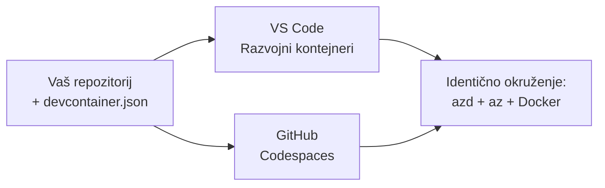

# Dev Containers & GitHub Codespaces za azd

**Chapter Navigation:**
- **📚 Početna stranica tečaja**: [AZD za početnike](../../README.md)
- **📖 Trenutno poglavlje**: Poglavlje 1 - Osnove i brz početak
- **⬅️ Prethodno**: [Donesite vlastitu aplikaciju](bring-your-own-app.md)
- **🚀 Sljedeće poglavlje**: [Poglavlje 2: Razvoj vođen umjetnom inteligencijom](../chapter-02-ai-development/README.md)

> Potvrđeno protiv `azd 1.25.6` u lipnju 2026.

## Uvod

Instaliranje azd, odgovarajućeg runtimea jezika, Dockera i Azure CLI-a na svakom računalu je zamorno — i to je glavni razlog zašto vodič koji "radi na mom računalu" ne uspijeva kod nekog drugog. Dev container rješava ovo opisivanjem cijelog skupa alata u datoteci. Svaki tko otvori projekt u VS Codeu ili GitHub Codespacesu dobije identično okruženje, s već instaliranim azd-om. Ova lekcija pokazuje kako dodati jedan.

## Ciljevi učenja

Na kraju ove lekcije ćete:
- Razumjeti što je dev container i zašto pomaže s azd-om
- Dodati minimalni `.devcontainer/devcontainer.json` u projekt
- Uključiti azd, Azure CLI i Docker putem Dev Container *features*
- Otvoriti projekt u GitHub Codespaces ili VS Codeu

## Ishodi učenja

Nakon završetka ove lekcije moći ćete:
- Napisati `devcontainer.json` za azd projekt
- Dodati azd i Azure alate bez ručnih instalacija
- Pokrenuti `azd up` iz unutar kontejnera ili Codespacea

---

## Što je Dev Container?

Dev container je Docker-bazirano razvojno okruženje definirano datotekom `.devcontainer/devcontainer.json` u vašem repozitoriju. Kad otvorite projekt:

- **VS Code** (s ekstenzijom Dev Containers) izgradi kontejner i prikači se na njega.
- **GitHub Codespaces** izgradi isti kontejner u cloudu i pruži vam editor u pregledniku.

Na taj način svaki suradnik dobije identične alate—nema više pitanja "jesi li instalirao azd?".



---

## Korak 1: Stvorite datoteku devcontainer

Stvorite `.devcontainer/devcontainer.json` u korijenu vašeg projekta:

```json
{
  "name": "azd-project",
  "image": "mcr.microsoft.com/devcontainers/base:bookworm",
  "features": {
    "ghcr.io/devcontainers/features/azure-cli:1": {},
    "ghcr.io/azure/azure-dev/azd:latest": {},
    "ghcr.io/devcontainers/features/docker-in-docker:2": {},
    "ghcr.io/devcontainers/features/node:1": {}
  },
  "customizations": {
    "vscode": {
      "extensions": [
        "ms-azuretools.azure-dev",
        "ms-azuretools.vscode-bicep"
      ]
    }
  },
  "forwardPorts": [3000],
  "postCreateCommand": "azd version"
}
```

Što svaka stavka radi:

| Ključ | Svrha |
|-----|---------|
| `image` | Bazni OS za kontejner |
| `features` | Prebuilt instalateri—ovdje: Azure CLI, **azd**, Docker i Node.js |
| `customizations.vscode.extensions` | Automatski instalira azd i Bicep VS Code ekstenzije |
| `forwardPorts` | Izlaže port vaše aplikacije u pregledniku |
| `postCreateCommand` | Pokreće se jednom nakon što se kontejner izgradi (ovdje, provjera ispravnosti) |

> Značajka `ghcr.io/azure/azure-dev/azd:latest` je službeni način za dobivanje azd-a u kontejneru. Zaključajte određenu verziju (na primjer `azd:1.25.6`) ako trebate ponovljivost.

---

## Korak 2: Uskladite značajku s jezikom vaše aplikacije

Zamijenite značajku `node` onom koju vaša aplikacija koristi:

```jsonc
// Python project
"ghcr.io/devcontainers/features/python:1": {},

// .NET project
"ghcr.io/devcontainers/features/dotnet:2": {},

// Java project
"ghcr.io/devcontainers/features/java:1": {},

// Go project
"ghcr.io/devcontainers/features/go:1": {}
```

Zadržite `docker-in-docker` ako je vaš `host` `containerapp`, `aks` ili bilo što što gradi sliku kontejnera—azd treba Docker za izgradnju i objavu slika.

---

## Korak 3: Otvorite ga

**U VS Codeu:**
1. Instalirajte ekstenziju **Dev Containers**.
2. Otvorite mapu projekta.
3. Kliknite **Reopen in Container** kada se pojavi upit (ili pokrenite *Dev Containers: Reopen in Container*).

**U GitHub Codespaces:**
1. Pushajte repozitorij na GitHub.
2. Kliknite **Code → Codespaces → Create codespace on main**.
3. Pričekajte da se kontejner izgradi—azd je spreman u terminalu.

---

## Korak 4: Rasporedite iz kontejnera

Kontejner ima preinstaliran azd, pa normalan tijek rada jednostavno radi:

```bash
azd auth login --use-device-code   # Kôd uređaja je praktičan unutar Codespacesa
azd up
```

> **Zašto `--use-device-code`?** U udaljenom kontejneru ili Codespaceu nema lokalnog preglednika za preusmjeravanje, pa je prijava pomoću device-code pouzdan put. Zalijepit ćete kod u karticu preglednika da dovršite prijavu.

---

## Uobičajene zamke

| Problem | Rješenje |
|---------|-----|
| `azd up` ne može izgraditi sliku | Dodajte značajku `docker-in-docker` |
| Prijava preko preglednika zapne u Codespaces | Koristite `azd auth login --use-device-code` |
| Alati se razlikuju među članovima tima | Zaključajte verzije značajki (npr. `azd:1.25.6`) |
| Aplikacija nije dostupna u pregledniku | Dodajte port u `forwardPorts` |

---

## Sažetak

- Dev container čini vaš azd skup alata reproducibilnim za sve.
- Dodajte azd, Azure CLI i Docker kroz Dev Container *features*.
- Uskladite značajku jezika s vašom aplikacijom i zadržite `docker-in-docker` za hostove koji koriste kontejnere.
- Koristite device-code prijavu kada radite unutar Codespacea.

---

## 🔗 Navigacija

| Smjer | Resurs |
|-----------|----------|
| **Prethodno** | [Donesite vlastitu aplikaciju](bring-your-own-app.md) |
| **Početak poglavlja** | [Poglavlje 1: Osnove i brz početak](README.md) |
| **Sljedeće poglavlje** | [Poglavlje 2: Razvoj vođen umjetnom inteligencijom](../chapter-02-ai-development/README.md) |

## 📖 Povezani resursi

- [Instalacija i postavljanje](installation.md)
- [Sažetak naredbi](../../resources/cheat-sheet.md)
- [Službena specifikacija Dev Containers](https://containers.dev/)
- [azd Dev Container značajka](https://github.com/Azure/azure-dev/tree/main/ext/devcontainer)

---

<!-- CO-OP TRANSLATOR DISCLAIMER START -->
**Napomena**:
Ovaj dokument je preveden korištenjem AI prevoditeljskog servisa [Co-op Translator](https://github.com/Azure/co-op-translator). Iako težimo točnosti, imajte na umu da automatski prijevodi mogu sadržavati greške ili netočnosti. Izvorni dokument na izvornom jeziku treba smatrati autoritativnim izvorom. Za važne informacije preporuča se profesionalni ljudski prijevod. Nismo odgovorni za bilo kakva nesporazumevanja ili pogrešne interpretacije koje proizlaze iz korištenja ovog prijevoda.
<!-- CO-OP TRANSLATOR DISCLAIMER END -->