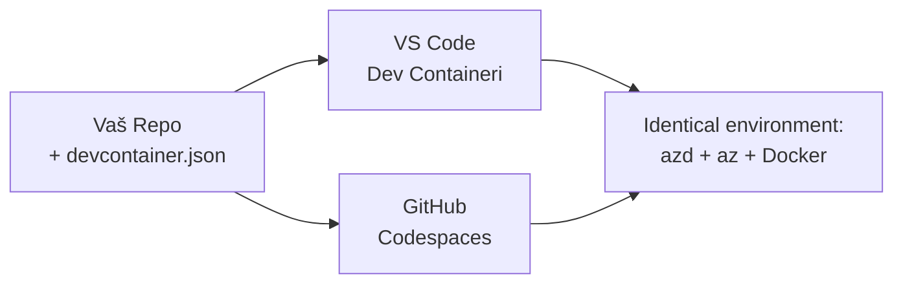

# Razvojni spremnici i GitHub Codespaces za azd

**Navigacija poglavljem:**
- **📚 Početna stranica tečaja**: [AZD za početnike](../../README.md)
- **📖 Trenutno poglavlje**: Poglavlje 1 - Osnove i brz početak
- **⬅️ Prethodno**: [Dodajte svoju aplikaciju](bring-your-own-app.md)
- **🚀 Sljedeće poglavlje**: [Poglavlje 2: Izrada s fokusom na AI](../chapter-02-ai-development/README.md)

> Provjereno s `azd 1.27.1` u srpnju 2026.

## Uvod

Instalacija azd-a, odgovarajućeg runtimea jezika, Dockera i Azure CLI-ja na svako računalo je gnjavaža—a to je glavni razlog zašto tutorijal koji "radi na mom računalu" ne uspijeva kod nekog drugog. **Razvojni spremnik** to rješava opisivanjem cijelog vašeg alata u datoteci. Svako tko otvori projekt u VS Code ili GitHub Codespaces dobiva identično okruženje, s već instaliranim azd-om. Ova lekcija pokazat će vam kako dodati jedan.

## Ciljevi učenja

Do kraja ove lekcije, naučit ćete:
- Razumjeti što je razvojni spremnik i zašto pomaže s azd-om
- Dodati minimalni `.devcontainer/devcontainer.json` u projekt
- Uključiti azd, Azure CLI i Docker preko značajki Razvojnog Spremnika (*features*)
- Otvoriti projekt u GitHub Codespaces ili VS Code

## Ishodi učenja

Nakon završetka ove lekcije, moći ćete:
- Kreirati `devcontainer.json` za azd projekt
- Dodati azd i Azure alate bez ručnih instalacija
- Pokrenuti `azd up` iz unutrašnjosti spremnika ili Codespacea

---

## Što je razvojni spremnik?

Razvojni spremnik je razvojno okruženje bazirano na Dockeru definirano datotekom `.devcontainer/devcontainer.json` u vašem spremištu. Kada otvorite projekt:

- **VS Code** (s proširenjem Dev Containers) izgradi spremnik i poveže se s njim.
- **GitHub Codespaces** izgradi isti spremnik u oblaku i daje vam uređivač u pregledniku.

Na bilo koji način, svaki suradnik dobiva identične alate—nema više pitanja "jeste li instalirali azd?".



---

## Korak 1: Kreirajte datoteku devcontainer

Kreirajte `.devcontainer/devcontainer.json` u korijenu vašeg projekta:

```json
{
  "name": "azd-project",
  "image": "mcr.microsoft.com/devcontainers/base:bookworm",
  "features": {
    "ghcr.io/devcontainers/features/azure-cli:1": {},
    "ghcr.io/azure/azure-dev/azd:latest": {},
    "ghcr.io/devcontainers/features/docker-in-docker:2": {},
    "ghcr.io/devcontainers/features/node:1": {}
  },
  "customizations": {
    "vscode": {
      "extensions": [
        "ms-azuretools.azure-dev",
        "ms-azuretools.vscode-bicep"
      ]
    }
  },
  "forwardPorts": [3000],
  "postCreateCommand": "azd version"
}
```

Što svaki dio radi:

| Ključ | Svrha |
|------|-------|
| `image` | Osnovni OS za spremnik |
| `features` | Prethodno pripremljeni instalateri—ovdje: Azure CLI, **azd**, Docker i Node.js |
| `customizations.vscode.extensions` | Automatski instalira azd i Bicep VS Code proširenja |
| `forwardPorts` | Izlaže port vaše aplikacije u pregledniku |
| `postCreateCommand` | Pokreće se jednom nakon izgradnje spremnika (ovdje, provjera ispravnosti) |

> Značajka `ghcr.io/azure/azure-dev/azd:latest` je službeni način za dobivanje azd-a u spremniku. Zaključajte određenu verziju (npr. `azd:1.27.1`) ako vam treba reproduktivnost.

---

## Korak 2: Prilagodite značajku jeziku vaše aplikacije

Zamijenite `node` značajku za što vaša aplikacija koristi:

```jsonc
// Python project
"ghcr.io/devcontainers/features/python:1": {},

// .NET project
"ghcr.io/devcontainers/features/dotnet:2": {},

// Java project
"ghcr.io/devcontainers/features/java:1": {},

// Go project
"ghcr.io/devcontainers/features/go:1": {}
```

Zadržite `docker-in-docker` ako je vaš `host` `containerapp`, `aks` ili bilo što što gradi Docker slike—azd treba Docker za izgradnju i slanje slika.

---

## Korak 3: Otvorite ga

**U VS Code-u:**
1. Instalirajte proširenje **Dev Containers**.
2. Otvorite mapu projekta.
3. Kliknite **Reopen in Container** kada se pojavi poziv (ili pokrenite *Dev Containers: Reopen in Container*).

**U GitHub Codespaces:**
1. Gurnite repozitorij na GitHub.
2. Kliknite **Code → Codespaces → Create codespace on main**.
3. Pričekajte da spremnik bude izgrađen—azd je spreman u terminalu.

---

## Korak 4: Implementirajte iz unutar spremnika

Spremnik ima prethodno instaliran azd, tako da normalan radni tijek jednostavno funkcionira:

```bash
azd auth login --use-device-code   # kod uređaja je koristan unutar Codespaces
azd up
```

> **Zašto `--use-device-code`?** U udaljenom spremniku ili Codespaceu nema lokalnog preglednika za preusmjeravanje, pa je prijava putem koda uređaja siguran način. Zalijepit ćete kod u preglednik da završite prijavu.

---

## Česte pogreške

| Pogreška | Popravak |
|---------|---------|
| `azd up` ne može izgraditi sliku | Dodajte značajku `docker-in-docker` |
| Prijava u preglednik zapinje u Codespaces | Koristite `azd auth login --use-device-code` |
| Alati se razlikuju među članovima tima | Zaključajte verzije značajki (npr. `azd:1.27.1`) |
| Aplikacija nije dostupna u pregledniku | Dodajte port u `forwardPorts` |

---

## Sažetak

- Razvojni spremnik čini vaš azd alatni lanac reproducibilnim za svakoga.
- Dodajte azd, Azure CLI i Docker putem Dev Container *features*.
- Uskladite značajku jezika s vašom aplikacijom i zadržite `docker-in-docker` za hostove spremnika.
- Koristite prijavu preko koda uređaja kad radite unutar Codespacea.

---

## 🔗 Navigacija

| Smjer | Resurs |
|-------|--------|
| **Prethodno** | [Dodajte svoju aplikaciju](bring-your-own-app.md) |
| **Početna stranica poglavlja** | [Poglavlje 1: Osnove i brz početak](README.md) |
| **Sljedeće poglavlje** | [Poglavlje 2: Izrada s fokusom na AI](../chapter-02-ai-development/README.md) |

## 📖 Povezani resursi

- [Instalacija i postavljanje](installation.md)
- [Popis naredbi](../../resources/cheat-sheet.md)
- [Službena specifikacija razvoja spremnika](https://containers.dev/)
- [azd značajka razvojnog spremnika](https://github.com/Azure/azure-dev/tree/main/ext/devcontainer)

---

<!-- CO-OP TRANSLATOR DISCLAIMER START -->
**Napomena**:
Ovaj dokument je preveden korištenjem AI prevoditeljskog servisa [Co-op Translator](https://github.com/Azure/co-op-translator). Iako težimo točnosti, imajte na umu da automatski prijevodi mogu sadržavati greške ili netočnosti. Izvorni dokument na izvornom jeziku treba smatrati autoritativnim izvorom. Za važne informacije preporuča se profesionalni ljudski prijevod. Nismo odgovorni za bilo kakva nesporazumevanja ili pogrešne interpretacije koje proizlaze iz korištenja ovog prijevoda.
<!-- CO-OP TRANSLATOR DISCLAIMER END -->