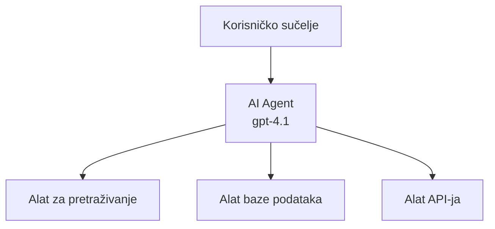
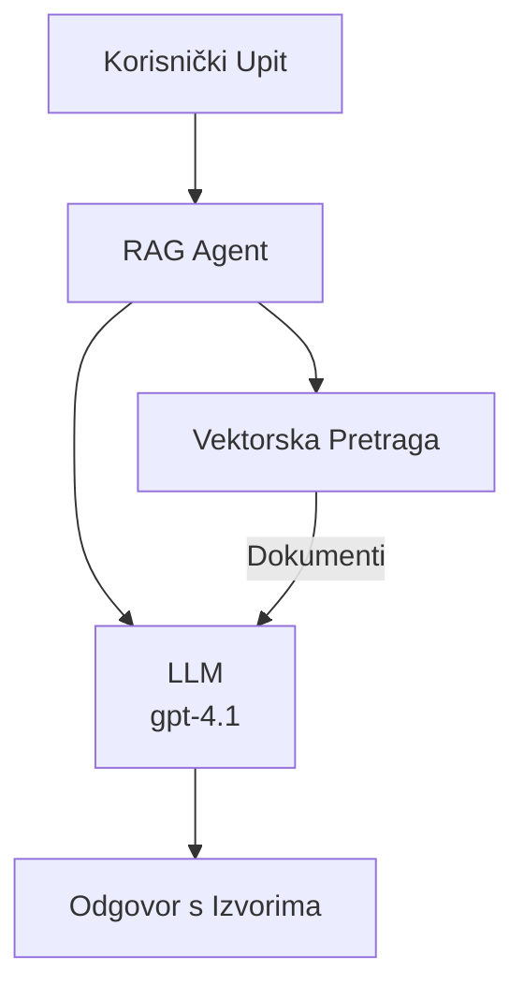
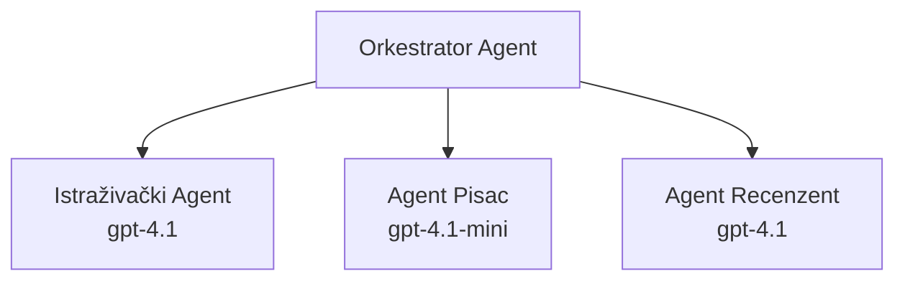

# AI agenti s Azure Developer CLI

**Navigacija poglavlja:**
- **📚 Početna stranica tečaja**: [AZD za početnike](../../README.md)
- **📖 Trenutno poglavlje**: Poglavlje 2 - Razvoj usmjeren na AI
- **⬅️ Prethodno**: [Integracija Microsoft Foundryja](microsoft-foundry-integration.md)
- **➡️ Sljedeće**: [Implementacija AI modela](ai-model-deployment.md)
- **🚀 Napredno**: [Rješenja s više agenata](../../examples/retail-scenario.md)

---

## Uvod

AI agenti su autonomni programi koji mogu percipirati svoje okruženje, donositi odluke i poduzimati radnje za postizanje određenih ciljeva. Za razliku od jednostavnih chatbotova koji odgovaraju na upite, agenti mogu:

- **Koristiti alate** - Pozivati API-je, pretraživati baze podataka, izvršavati kod
- **Planirati i razmišljati** - Razbiti složene zadatke u korake
- **Učiti iz konteksta** - Održavati memoriju i prilagođavati ponašanje
- **Surađivati** - Raditi s drugim agentima (sustavi s više agenata)

Ovaj vodič pokazuje kako implementirati AI agente u Azure pomoću Azure Developer CLI (azd).

> **Napomena za provjeru (2026-03-25):** Ovaj je vodič pregledan na temelju `azd` `1.23.12` i `azure.ai.agents` `0.1.18-preview`. Iskustvo `azd ai` još je u fazi pregleda pa provjerite pomoć proširenja ako se vaši instalirani parametri razlikuju.

## Ciljevi učenja

Nakon završetka ovog vodiča ćete:
- Razumjeti što su AI agenti i kako se razlikuju od chatbotova
- Implementirati unaprijed izrađene predloške AI agenata korištenjem AZD-a
- Konfigurirati Foundry agente za prilagođene agente
- Implementirati osnovne obrasce agenata (korištenje alata, RAG, više agenata)
- Pratiti i otklanjati pogreške postavljenih agenata

## Ishodi učenja

Nakon završetka moći ćete:
- Implementirati AI agent aplikacije u Azure s jednom naredbom
- Konfigurirati alate i mogućnosti agenata
- Implementirati dohvatno-poboljšanu generaciju (RAG) s agentima
- Dizajnirati arhitekture s više agenata za složene tijekove rada
- Rješavati uobičajene probleme kod implementacije agenata

---

## 🤖 Što razdvaja agenta od chatbota?

| Značajka | Chatbot | AI agent |
|----------|---------|----------|
| **Ponašanje** | Odgovara na upite | Poduzima autonomne radnje |
| **Alati** | Nema | Može pozivati API-je, pretraživati, izvršavati kod |
| **Memorija** | Samo tijekom sesije | Trajna memorija preko sesija |
| **Planiranje** | Jedan odgovor | Višestupanjsko razmišljanje |
| **Suradnja** | Jedinica | Može raditi s drugim agentima |

### Jednostavna analogija

- **Chatbot** = Pomoćna osoba koja odgovara na pitanja na informacijskom punktu
- **AI agent** = Osobni asistent koji može obavljati pozive, zakazivati termine i dovršavati zadatke za vas

---

## 🚀 Brzi početak: Implementirajte svog prvog agenta

### Opcija 1: Predložak Foundry agenata (Preporučeno)

```bash
# Inicijalizirajte predložak AI agenata
azd init --template get-started-with-ai-agents

# Implementirajte na Azure
azd up
```

**Što se implementira:**
- ✅ Foundry agenti
- ✅ Microsoft Foundry modeli (gpt-4.1)
- ✅ Azure AI Search (za RAG)
- ✅ Azure Container Apps (web sučelje)
- ✅ Application Insights (praćenje)

**Vrijeme:** ~15-20 minuta
**Cijena:** ~$100-150/mjesečno (razvoj)

### Opcija 2: OpenAI agent s Promptyjem

```bash
# Inicijalizirajte predložak agenta temeljenog na Prompty
azd init --template agent-openai-python-prompty

# Implementirajte na Azure
azd up
```

**Što se implementira:**
- ✅ Azure Functions (serverless izvođenje agenta)
- ✅ Microsoft Foundry modeli
- ✅ Konfiguracijske datoteke za Prompty
- ✅ Primjer implementacije agenta

**Vrijeme:** ~10-15 minuta
**Cijena:** ~$50-100/mjesečno (razvoj)

### Opcija 3: RAG chat agent

```bash
# Inicijalizirajte RAG chat predložak
azd init --template azure-search-openai-demo

# Implementirajte na Azure
azd up
```

**Što se implementira:**
- ✅ Microsoft Foundry modeli
- ✅ Azure AI Search sa uzorčnim podacima
- ✅ Cjevovod za obradu dokumenata
- ✅ Chat sučelje s citatima

**Vrijeme:** ~15-25 minuta
**Cijena:** ~$80-150/mjesečno (razvoj)

### Opcija 4: AZD AI Agent Init (Pregled inicijalizacije na temelju manifesta ili predloška)

Ako imate manifest datoteku agenta, možete koristiti naredbu `azd ai` za izradu Foundry Agent Service projekta izravno. Nedavna preview izdanja također dodaju podršku za inicijalizaciju po predlošku, pa početni tijek može malo varirati ovisno o verziji instaliranog proširenja.

```bash
# Instalirajte proširenje za AI agente
azd extension install azure.ai.agents

# Opcionalno: provjerite instaliranu verziju pregleda
azd extension show azure.ai.agents

# Inicijalizirajte iz manifesta agenta
azd ai agent init -m agent-manifest.yaml

# Rasporedite na Azure
azd up
```

**Kada koristiti `azd ai agent init` nasuprot `azd init --template`:**

| Pristup | Najbolje za | Kako radi |
|---------|-------------|----------|
| `azd init --template` | Početak s funkcijskim uzorkom aplikacije | Klonira cijeli repozitorij predloška s kodom + infrastrukturom |
| `azd ai agent init -m` | Izgradnju na temelju vlastitog manifesta agenta | Kreira strukturu projekta iz definicije vašeg agenta |

> **Savjet:** Koristite `azd init --template` za učenje (Opcije 1-3 gore). Koristite `azd ai agent init` za izgradnju produkcijskih agenata s vlastitim manifestima. Pogledajte [AZD AI CLI naredbe](../chapter-08-production/production-ai-practices.md#azd-ai-cli-commands-and-extensions) za potpuni referentni vodič.

---

## 🏗️ Obrasci arhitekture agenata

### Obrazac 1: Jedan agent s alatima

Najjednostavniji obrazac agenta - jedan agent koji može koristiti više alata.


**Najbolje za:**
- Botove korisničke podrške
- Istraživačke asistente
- Agente za analizu podataka

**Predložak AZD:** `azure-search-openai-demo`

### Obrazac 2: RAG agent (dohvatno-poboljšana generacija)

Agent koji dohvaća relevantne dokumente prije generiranja odgovora.


**Najbolje za:**
- Poslovne baze znanja
- Sustave za pitanja i odgovore na dokumente
- Istraživanja vezana za sukladnost i pravo

**Predložak AZD:** `azure-search-openai-demo`

### Obrazac 3: Sustav s više agenata

Više specijaliziranih agenata koji surađuju na složenim zadacima.


**Najbolje za:**
- Složenu generaciju sadržaja
- Višestupanjske tijekove rada
- Zadatke koji zahtijevaju različita područja stručnosti

**Saznajte više:** [Koordinacijski obrasci za više agenata](../chapter-06-pre-deployment/coordination-patterns.md)

---

## ⚙️ Konfiguriranje alata za agente

Agent postaju moćni kada mogu koristiti alate. Evo kako konfigurirati uobičajene alate:

### Konfiguracija alata u Foundry agentima

```python
# agent_config.py
from azure.ai.projects import AIProjectClient
from azure.ai.projects.models import FunctionTool, CodeInterpreterTool

# Definirajte prilagođene alate
search_tool = FunctionTool(
    name="search_knowledge_base",
    description="Search the company knowledge base for relevant documents",
    parameters={
        "type": "object",
        "properties": {
            "query": {
                "type": "string",
                "description": "The search query"
            }
        },
        "required": ["query"]
    }
)

# Stvorite agenta s alatima
agent = project_client.agents.create_agent(
    model="gpt-4.1",
    name="Support Agent",
    instructions="You are a helpful support agent. Use the search tool to find relevant information.",
    tools=[search_tool, CodeInterpreterTool()]
)
```

### Konfiguracija okoline

```bash
# Postavite varijable okoline specifične za agenta
azd env set AZURE_OPENAI_MODEL "gpt-4.1"
azd env set AGENT_INSTRUCTIONS "You are a helpful assistant..."
azd env set ENABLE_CODE_INTERPRETER "true"
azd env set ENABLE_FILE_SEARCH "true"

# Implementirajte s ažuriranom konfiguracijom
azd deploy
```

---

## 📊 Praćenje agenata

### Integracija Application Insights

Svi AZD predlošci agenata uključuju Application Insights za praćenje:

```bash
# Otvorite nadzornu ploču za praćenje
azd monitor --overview

# Prikaz uživo zapisa
azd monitor --logs

# Prikaz uživo metrika
azd monitor --live
```

### Ključne metrike za praćenje

| Metrika | Opis | Cilj |
|---------|-------|------|
| Latencija odgovora | Vrijeme generiranja odgovora | < 5 sekundi |
| Korištenje tokena | Tokeni po zahtjevu | Pratite zbog troškova |
| Uspješnost poziva alata | % uspješnih izvršenja alata | > 95% |
| Stopa pogrešaka | Neuspjeli zahtjevi agenata | < 1% |
| Zadovoljstvo korisnika | Ocjene povratnih informacija | > 4.0/5.0 |

### Prilagođeno zapisivanje za agente

```python
import os
from azure.monitor.opentelemetry import configure_azure_monitor
from opentelemetry import trace

# Konfigurirajte Azure Monitor s OpenTelemetry
configure_azure_monitor(
    connection_string=os.environ["APPLICATIONINSIGHTS_CONNECTION_STRING"]
)

tracer = trace.get_tracer(__name__)

def log_agent_interaction(user_query, agent_response, tools_used, latency_ms):
    with tracer.start_as_current_span("agent_interaction") as span:
        span.set_attributes({
            "user_query": user_query,
            "response_length": len(agent_response),
            "tools_used": tools_used,
            "latency_ms": latency_ms
        })
```

> **Napomena:** Instalirajte potrebne pakete: `pip install azure-monitor-opentelemetry opentelemetry`

---

## 💰 Troškovi

### Procijenjeni mjesečni troškovi po obrascu

| Obrazac | Razvojno okruženje | Produkcija |
|---------|--------------------|------------|
| Jedan agent | $50-100 | $200-500 |
| RAG agent | $80-150 | $300-800 |
| Više agenata (2-3 agenta) | $150-300 | $500-1,500 |
| Enterprise više agenata | $300-500 | $1,500-5,000+ |

### Savjeti za optimizaciju troškova

1. **Koristite gpt-4.1-mini za jednostavne zadatke**
   ```bash
   azd env set AZURE_OPENAI_MODEL "gpt-4.1-mini"
   ```

2. **Implementirajte keširanje za ponovljene upite**
   ```python
   from functools import lru_cache
   
   @lru_cache(maxsize=1000)
   def get_cached_response(query_hash):
       return agent.run(query_hash)
   ```

3. **Postavite ograničenja tokena po pokretanju**
   ```python
   # Postavite max_completion_tokens prilikom pokretanja agenta, ne prilikom stvaranja
   run = project_client.agents.create_run(
       thread_id=thread.id,
       agent_id=agent.id,
       max_completion_tokens=1000  # Ograničite duljinu odgovora
   )
   ```

4. **Smanjite resurse na nulu kad se ne koriste**
   ```bash
   # Container Apps se automatski skaliraju na nulu
   azd env set MIN_REPLICAS "0"
   ```

---

## 🔧 Otklanjanje problema s agentima

### Uobičajeni problemi i rješenja

<details>
<summary><strong>❌ Agent ne reagira na pozive alata</strong></summary>

```bash
# Provjerite jesu li alati ispravno registrirani
azd show

# Provjerite OpenAI implementaciju
az cognitiveservices account deployment list \
  --name $AZURE_OPENAI_NAME \
  --resource-group $RG_NAME

# Provjerite dnevnike agenta
azd monitor --logs
```

**Uobičajeni uzroci:**
- Nepodudaranje potpisa funkcije alata
- Nedostaju potrebne dozvole
- API krajnja točka nije dostupna
</details>

<details>
<summary><strong>❌ Visoka latencija u odgovorima agenata</strong></summary>

```bash
# Provjerite Application Insights zbog uskih grla
azd monitor --live

# Razmotrite korištenje bržeg modela
azd env set AZURE_OPENAI_MODEL "gpt-4.1-mini"
azd deploy
```

**Savjeti za optimizaciju:**
- Koristite streaming odgovore
- Implementirajte keširanje odgovora
- Smanjite veličinu kontekstnog prozora
</details>

<details>
<summary><strong>❌ Agent vraća netočne ili izmišljene informacije</strong></summary>

```python
# Poboljšajte s boljim sistemskim uputama
instructions = """
You are a helpful assistant. IMPORTANT:
- Only answer based on provided context
- If you don't know, say "I don't know"
- Always cite your sources
- Never make up information
"""

# Dodajte dohvaćanje za utemeljenje
agent = project_client.agents.create_agent(
    model="gpt-4.1",
    instructions=instructions,
    tools=[FileSearchTool()]  # Utemeljite odgovore u dokumentima
)
```
</details>

<details>
<summary><strong>❌ Pogreške zbog prekoračenja ograničenja tokena</strong></summary>

```python
# Implementirajte upravljanje kontekstnim prozorom
def truncate_context(messages, max_tokens=8000, model="gpt-4.1"):
    """Keep only recent messages within token limit."""
    import tiktoken
    encoding = tiktoken.encoding_for_model(model)
    total_tokens = 0
    truncated = []
    
    for msg in reversed(messages):
        msg_tokens = len(encoding.encode(msg.content))
        if total_tokens + msg_tokens > max_tokens:
            break
        truncated.insert(0, msg)
        total_tokens += msg_tokens
    
    return truncated
```
</details>

---

## 🎓 Praktične vježbe

### Vježba 1: Implementirajte osnovnog agenta (20 minuta)

**Cilj:** Implementirati svog prvog AI agenta korištenjem AZD-a

```bash
# Korak 1: Inicijalizirajte predložak
azd init --template get-started-with-ai-agents

# Korak 2: Prijavite se u Azure
azd auth login
# Ako radite preko zakupaca, dodajte --tenant-id <tenant-id>

# Korak 3: Implementirajte
azd up

# Korak 4: Testirajte agenta
# Očekivani izlaz nakon implementacije:
#   Implementacija dovršena!
#   Krajnja točka: https://<app-name>.<region>.azurecontainerapps.io
# Otvorite URL prikazan u izlazu i pokušajte postaviti pitanje

# Korak 5: Pregled nadzora
azd monitor --overview

# Korak 6: Očistite resurse
azd down --force --purge
```

**Kriteriji uspjeha:**
- [ ] Agent odgovara na pitanja
- [ ] Moguć pristup nadzornoj ploči praćenja putem `azd monitor`
- [ ] Uspješno čišćenje resursa

### Vježba 2: Dodajte prilagođeni alat (30 minuta)

**Cilj:** Proširiti agenta prilagođenim alatom

1. Implementirajte predložak agenta:
   ```bash
   azd init --template get-started-with-ai-agents
   azd up
   ```
2. Kreirajte novu funkciju alata u kodu agenta:
   ```python
   def get_weather(location: str) -> str:
       """Get current weather for a location."""
       # API poziv vremenskoj službi
       return f"Weather in {location}: Sunny, 72°F"
   ```
3. Registrirajte alat s agentom:
   ```python
   from azure.ai.projects.models import FunctionTool

   weather_tool = FunctionTool(
       name="get_weather",
       description="Get current weather for a location",
       parameters={
           "type": "object",
           "properties": {
               "location": {"type": "string", "description": "City name"}
           },
           "required": ["location"]
       }
   )

   agent = project_client.agents.create_agent(
       model="gpt-4.1",
       name="Weather Agent",
       tools=[weather_tool]
   )
   ```
4. Ponovno implementirajte i testirajte:
   ```bash
   azd deploy
   # Pitaj: "Kakvo je vrijeme u Seattleu?"
   # Očekivano: Agent poziva get_weather("Seattle") i vraća informacije o vremenu
   ```

**Kriteriji uspjeha:**
- [ ] Agent prepoznaje upite vezane za vremenske uvjete
- [ ] Alat se poziva ispravno
- [ ] Odgovor sadrži informacije o vremenu

### Vježba 3: Izradite RAG agenta (45 minuta)

**Cilj:** Kreirati agenta koji odgovara na pitanja iz vaših dokumenata

```bash
# Korak 1: Postavite RAG predložak
azd init --template azure-search-openai-demo
azd up

# Korak 2: Prenesite svoje dokumente
# Stavite PDF/TXT datoteke u direktorij data/, zatim pokrenite:
python scripts/prepdocs.py

# Korak 3: Testirajte s pitanjima specifičnim za domenu
# Otvorite URL web aplikacije iz azd up izlaza
# Postavljajte pitanja o svojim prenesenim dokumentima
# Odgovori bi trebali uključivati reference na citate poput [doc.pdf]
```

**Kriteriji uspjeha:**
- [ ] Agent odgovara na temelju prenesenih dokumenata
- [ ] Odgovori uključuju citate
- [ ] Nema izmišljenih odgovora na pitanja izvan dosega

---

## 📚 Sljedeći koraci

Sad kad razumijete AI agente, istražite ove napredne teme:

| Tema | Opis | Veza |
|------|-------|------|
| **Sustavi s više agenata** | Izgradite sustave s više surađujućih agenata | [Primjer s više agenata u maloprodaji](../../examples/retail-scenario.md) |
| **Koordinacijski obrasci** | Naučite obrasce orkestracije i komunikacije | [Koordinacijski obrasci](../chapter-06-pre-deployment/coordination-patterns.md) |
| **Implementacija u produkciju** | Implementacija agenata spremnih za poduzeće | [Prakse AI za produkciju](../chapter-08-production/production-ai-practices.md) |
| **Evaluacija agenata** | Testirajte i ocjenjujte performanse agenata | [Rješavanje problema s AI](../chapter-07-troubleshooting/ai-troubleshooting.md) |
| **AI radionica** | Praktično: Pripremite svoje AI rješenje za AZD | [AI radionica](ai-workshop-lab.md) |

---

## 📖 Dodatni izvori

### Službena dokumentacija
- [Azure AI Agent Service](https://learn.microsoft.com/azure/ai-services/agents/)
- [Azure AI Foundry Agent Service Brzi start](https://learn.microsoft.com/azure/ai-services/agents/quickstart)
- [Semantic Kernel Agent Framework](https://learn.microsoft.com/semantic-kernel/)

### AZD predlošci za agente
- [Početak rada s AI agentima](https://github.com/Azure-Samples/get-started-with-ai-agents)
- [Agent OpenAI Python Prompty](https://github.com/Azure-Samples/agent-openai-python-prompty)
- [Azure Search OpenAI Demo](https://github.com/Azure-Samples/azure-search-openai-demo)

### Resursi zajednice
- [Awesome AZD - predlošci agenata](https://azure.github.io/awesome-azd/?tags=ai-agents)
- [Azure AI Discord](https://discord.gg/microsoft-azure)
- [Microsoft Foundry Discord](https://discord.gg/nTYy5BXMWG)

### Vještine agenata za vaš uređivač
- [**Microsoft Azure Agent Skills**](https://skills.sh/microsoft/github-copilot-for-azure) - Instalirajte višekratno upotrebljive AI vještine agenata za razvoj Azure u GitHub Copilot, Cursor ili bilo kojem podržanom agentu. Uključuje vještine za [Azure AI](https://skills.sh/microsoft/github-copilot-for-azure/azure-ai), [Microsoft Foundry](https://skills.sh/microsoft/github-copilot-for-azure/microsoft-foundry), [implementaciju](https://skills.sh/microsoft/github-copilot-for-azure/azure-deploy) i [dijagnostiku](https://skills.sh/microsoft/github-copilot-for-azure/azure-diagnostics):
  ```bash
  npx skills add microsoft/github-copilot-for-azure
  ```

---

**Navigacija**
- **Prethodna lekcija**: [Integracija Microsoft Foundryja](microsoft-foundry-integration.md)
- **Sljedeća lekcija**: [Implementacija AI modela](ai-model-deployment.md)

---

<!-- CO-OP TRANSLATOR DISCLAIMER START -->
**Odricanje odgovornosti**:  
Ovaj dokument je preveden pomoću AI usluge za prevođenje [Co-op Translator](https://github.com/Azure/co-op-translator). Iako težimo točnosti, imajte na umu da automatski prijevodi mogu sadržavati greške ili netočnosti. Izvorni dokument na izvornom jeziku treba smatrati autoritativnim izvorom. Za važne informacije preporuča se profesionalni ljudski prijevod. Nismo odgovorni za bilo kakva nesporazuma ili kriva tumačenja koja proizlaze iz korištenja ovog prijevoda.
<!-- CO-OP TRANSLATOR DISCLAIMER END -->