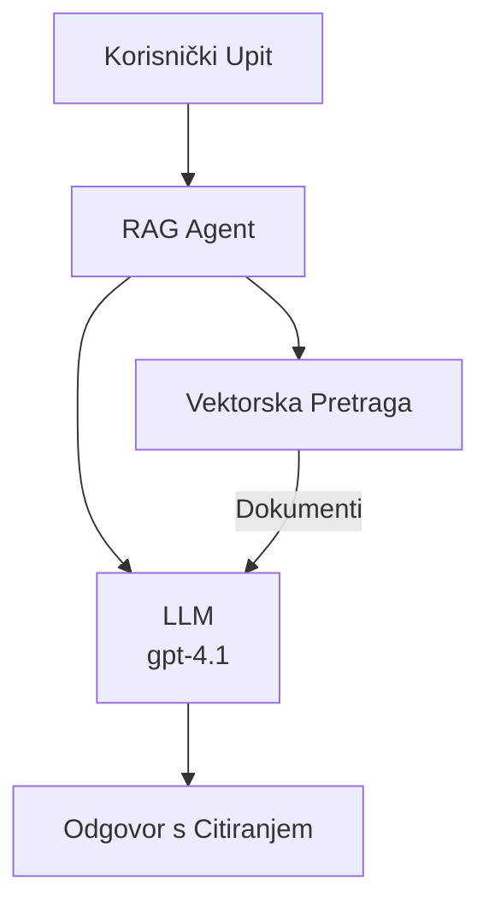
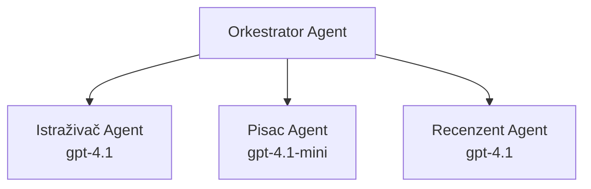

# AI agenti s Azure Developer CLI

**Navigacija poglavljem:**
- **📚 Početna stranica tečaja**: [AZD za početnike](../../README.md)
- **📖 Trenutno poglavlje**: Poglavlje 2 - AI-prvo razvoj
- **⬅️ Prethodno**: [Integracija Microsoft Foundry](microsoft-foundry-integration.md)
- **➡️ Sljedeće**: [Implementacija AI modela](ai-model-deployment.md)
- **🚀 Napredno**: [Rješenja s više agenata](../../examples/retail-scenario.md)

---

## Uvod

AI agenti su autonomni programi koji mogu percipirati svoje okruženje, donositi odluke i poduzimati radnje za postizanje određenih ciljeva. Za razliku od jednostavnih chatbota koji odgovaraju na upite, agenti mogu:

- **Koristiti alate** - Pozivati API-je, pretraživati baze podataka, izvršavati kod
- **Planirati i rezonirati** - Razbijati složene zadatke na korake
- **Učiti iz konteksta** - Održavati memoriju i prilagođavati ponašanje
- **Suradivati** - Raditi s drugim agentima (sistemi s više agenata)

Ovaj vodič pokazuje kako implementirati AI agente na Azure koristeći Azure Developer CLI (azd).

> **Napomena o validaciji (2026-03-25):** Ovaj je vodič pregledan s `azd` verzijom `1.23.12` i `azure.ai.agents` verzijom `0.1.18-preview`. Iskustvo s `azd ai` još je u stanju previewa, pa provjerite pomoć ekstenzije ako se vaše instalirane zastavice razlikuju.

## Ciljevi učenja

Nakon završetka ovog vodiča, možete:
- Razumjeti što su AI agenti i kako se razlikuju od chatbota
- Implementirati unaprijed izrađene AI predloške agenata koristeći AZD
- Konfigurirati Foundry agente za prilagođene agente
- Implementirati osnovne obrasce agenata (korištenje alata, RAG, multi-agent)
- Pratiti i otklanjati pogreške kod implementiranih agenata

## Ishodi učenja

Po završetku, moći ćete:
- Implementirati AI agenta na Azure jednim naredbom
- Konfigurirati alate i mogućnosti agenata
- Implementirati generiranje utemeljeno na dohvaćanju (RAG) s agentima
- Dizajnirati arhitekture s više agenata za složene tijekove rada
- Rješavati uobičajene probleme pri implementaciji agenata

---

## 🤖 Što razlikuje agenta od chatbota?

| Značajka | Chatbot | AI agent |
|---------|---------|----------|
| **Ponašanje** | Odgovara na upite | Poduzima autonomne radnje |
| **Alati** | Nema | Može pozivati API-je, pretraživati, izvršavati kod |
| **Memorija** | Samo za trajanje sesije | Trajna memorija kroz sesije |
| **Planiranje** | Jedan odgovor | Višekorak rezoniranja |
| **Suradnja** | Jedinstveni entitet | Može raditi s drugim agentima |

### Jednostavna analogija

- **Chatbot** = Pomoćna osoba koja odgovara na pitanja na informativnom pultu
- **AI agent** = Osobni asistent koji može telefonirati, rezervirati termine i obavljati zadatke za vas

---

## 🚀 Brzi početak: Postavite svog prvog agenta

### Opcija 1: Foundry Agents predložak (Preporučeno)

```bash
# Inicijaliziraj predložak AI agenata
azd init --template get-started-with-ai-agents

# Implementiraj na Azure
azd up
```

**Što se implementira:**
- ✅ Foundry agenti
- ✅ Microsoft Foundry modeli (gpt-4.1)
- ✅ Azure AI Search (za RAG)
- ✅ Azure Container Apps (web sučelje)
- ✅ Application Insights (praćenje)

**Vrijeme:** ~15-20 minuta  
**Trošak:** ~$100-150/mjesečno (razvoj)

### Opcija 2: OpenAI Agent s Promptyjem

```bash
# Inicijalizirajte predložak agenta temeljenog na Promptyju
azd init --template agent-openai-python-prompty

# Postavite na Azure
azd up
```

**Što se implementira:**
- ✅ Azure Functions (serverless izvršavanje agenta)
- ✅ Microsoft Foundry modeli
- ✅ Konfiguracijske datoteke Prompty
- ✅ Primjer implementacije agenta

**Vrijeme:** ~10-15 minuta  
**Trošak:** ~$50-100/mjesečno (razvoj)

### Opcija 3: RAG Chat Agent

```bash
# Inicijaliziraj RAG chat predložak
azd init --template azure-search-openai-demo

# Implementiraj na Azure
azd up
```

**Što se implementira:**
- ✅ Microsoft Foundry modeli
- ✅ Azure AI Search sa primjerom podataka
- ✅ Pipeline za obradu dokumenata
- ✅ Sučelje za chat s citatima

**Vrijeme:** ~15-25 minuta  
**Trošak:** ~$80-150/mjesečno (razvoj)

### Opcija 4: AZD AI Agent Init (Pregled inicijalizacije na temelju manifestacije ili predloška)

Ako imate datoteku s manifestom agenta, možete koristiti naredbu `azd ai` za scaffoldanje Foundry Agent Service projekta izravno. Nedavne preview verzije također su dodale podršku za inicijalizaciju na temelju predložaka, pa se točan tijek prompta može malo razlikovati ovisno o verziji instalirane ekstenzije.

```bash
# Instalirajte proširenje AI agenata
azd extension install azure.ai.agents

# Opcionalno: provjerite instaliranu pretpreglednu verziju
azd extension show azure.ai.agents

# Inicijalizirajte iz manifesta agenta
azd ai agent init -m agent-manifest.yaml

# Deploy na Azure
azd up

# Testirajte implementiranog agenta (prikazuje latenciju + vrijeme do prvog bajta)
azd ai agent invoke
```

**Kada koristiti `azd ai agent init` nasuprot `azd init --template`:**

| Pristup | Najbolje za | Kako radi |
|----------|-------------|-----------|
| `azd init --template` | Početak s funkcionalnom uzorkom aplikacije | Klonira cijeli predložak repozitorija s kodom + infrastrukturom |
| `azd ai agent init -m` | Izgradnju iz vlastitog manifesta agenta | Scaffolda strukturu projekta iz definicije agenta |

> **Savjet:** Koristite `azd init --template` za učenje (opcije 1-3 gore). Koristite `azd ai agent init` za izgradnju produkcijskih agenata s vlastitim manifestima.

Nakon `azd up`, ista ekstenzija vodi vas kroz ostatak životnog ciklusa agenta: `azd ai agent invoke` za testiranje, `azd ai agent eval generate` i `azd ai agent optimize` za mjerenje i poboljšanje kvalitete te `azd ai agent delete` za čišćenje. Pogledajte [AZD AI CLI naredbe](../chapter-08-production/production-ai-practices.md#azd-ai-cli-commands-and-extensions) za potpuni pregled.

---

## 🏗️ Obrasci arhitekture agenata

### Obrazac 1: Jedan agent s alatima

Najjednostavniji obrazac agenta – jedan agent koji može koristiti više alata.


**Najbolje za:**
- Botove za korisničku podršku
- Istraživačke asistente
- Agente za analizu podataka

**AZD predložak:** `azure-search-openai-demo`

### Obrazac 2: RAG agent (generiranje uz podršku dohvaćanja)

Agent koji dohvaća relevantne dokumente prije nego generira odgovore.



**Najbolje za:**
- Poslovne baze znanja
- Sustave pitanja i odgovora na dokumente
- Istraživanja o usklađenosti i pravna istraživanja

**AZD predložak:** `azure-search-openai-demo`

### Obrazac 3: Sustav s više agenata

Više specijaliziranih agenata koji zajedno rade na složenim zadacima.



**Najbolje za:**
- Složenu generaciju sadržaja
- Višekorake tijekove rada
- Zadatke koji zahtijevaju različite stručnosti

**Saznajte više:** [Obrasci koordinacije s više agenata](../chapter-06-pre-deployment/coordination-patterns.md)

---

## ⚙️ Konfiguracija alata za agente

Agenti postaju moćni kada mogu koristiti alate. Evo kako konfigurirati uobičajene alate:

### Konfiguracija alata u Foundry agentima

```python
# agent_config.py
from azure.ai.projects import AIProjectClient
from azure.ai.projects.models import FunctionTool, CodeInterpreterTool

# Definirajte prilagođene alate
search_tool = FunctionTool(
    name="search_knowledge_base",
    description="Search the company knowledge base for relevant documents",
    parameters={
        "type": "object",
        "properties": {
            "query": {
                "type": "string",
                "description": "The search query"
            }
        },
        "required": ["query"]
    }
)

# Kreirajte agenta s alatima
agent = project_client.agents.create_agent(
    model="gpt-4.1",
    name="Support Agent",
    instructions="You are a helpful support agent. Use the search tool to find relevant information.",
    tools=[search_tool, CodeInterpreterTool()]
)
```

### Konfiguracija okruženja

```bash
# Postavi varijable okoline specifične za agenta
azd env set AZURE_OPENAI_MODEL "gpt-4.1"
azd env set AGENT_INSTRUCTIONS "You are a helpful assistant..."
azd env set ENABLE_CODE_INTERPRETER "true"
azd env set ENABLE_FILE_SEARCH "true"

# Postavi s ažuriranom konfiguracijom
azd deploy
```

---

## 📊 Praćenje agenata

### Integracija s Application Insights

Svi AZD predlošci agenata uključuju Application Insights za praćenje:

```bash
# Otvori nadzornu ploču za praćenje
azd monitor --overview

# Pogledaj žive zapise
azd monitor --logs

# Pogledaj žive metrike
azd monitor --live
```

### Ključni metrički indikatori

| Metrička vrijednost | Opis | Cilj |
|---------------------|-------|------|
| Kašnjenje odgovora | Vrijeme potrebno za generiranje odgovora | < 5 sekundi |
| Potrošnja tokena | Tokeni po zahtjevu | Pratiti radi troškova |
| Uspješnost poziva alata | % uspješno izvršenih alata | > 95% |
| Stopa pogrešaka | Neuspjeli zahtjevi agenta | < 1% |
| Zadovoljstvo korisnika | Ocjene povratnih informacija | > 4,0/5,0 |

### Prilagođeno evidentiranje za agente

```python
import os
from azure.monitor.opentelemetry import configure_azure_monitor
from opentelemetry import trace

# Konfigurirajte Azure Monitor s OpenTelemetry
configure_azure_monitor(
    connection_string=os.environ["APPLICATIONINSIGHTS_CONNECTION_STRING"]
)

tracer = trace.get_tracer(__name__)

def log_agent_interaction(user_query, agent_response, tools_used, latency_ms):
    with tracer.start_as_current_span("agent_interaction") as span:
        span.set_attributes({
            "user_query": user_query,
            "response_length": len(agent_response),
            "tools_used": tools_used,
            "latency_ms": latency_ms
        })
```

> **Napomena:** Instalirajte potrebne pakete: `pip install azure-monitor-opentelemetry opentelemetry`

---

## 💰 Troškovi

### Procijenjeni mjesečni troškovi po obrascima

| Obrazac | Razvojno okruženje | Produkcija |
|---------|--------------------|------------|
| Jedan agent | $50-100 | $200-500 |
| RAG agent | $80-150 | $300-800 |
| Više agenata (2-3 agenta) | $150-300 | $500-1,500 |
| Enterprise više agenata | $300-500 | $1,500-5,000+ |

### Savjeti za optimizaciju troškova

1. **Koristite gpt-4.1-mini za jednostavne zadatke**  
   ```bash
   azd env set AZURE_OPENAI_MODEL "gpt-4.1-mini"
   ```
  
2. **Implementirajte keširanje za ponovljene upite**  
   ```python
   from functools import lru_cache
   
   @lru_cache(maxsize=1000)
   def get_cached_response(query_hash):
       return agent.run(query_hash)
   ```
  
3. **Postavite ograničenja tokena po pokretanju**  
   ```python
   # Postavite max_completion_tokens prilikom pokretanja agenta, ne tijekom kreiranja
   run = project_client.agents.create_run(
       thread_id=thread.id,
       agent_id=agent.id,
       max_completion_tokens=1000  # Ograničite duljinu odgovora
   )
   ```
  
4. **Smanjite na nulu kada se ne koristi**  
   ```bash
   # Container Apps se automatski skaliraju na nulu
   azd env set MIN_REPLICAS "0"
   ```
  
---

## 🔧 Otklanjanje problema kod agenata

### Uobičajeni problemi i rješenja

<details>
<summary><strong>❌ Agent ne reagira na pozive alata</strong></summary>

```bash
# Provjerite jesu li alati ispravno registrirani
azd show

# Provjerite OpenAI implementaciju
az cognitiveservices account deployment list \
  --name $AZURE_OPENAI_NAME \
  --resource-group $RG_NAME

# Provjerite zapisnike agenta
azd monitor --logs
```

**Uobičajeni uzroci:**
- Nepodudaranje potpisa funkcije alata
- Nedostaju potrebna dopuštenja
- API endpoint nije dostupan
</details>

<details>
<summary><strong>❌ Veliko kašnjenje u odgovorima agenta</strong></summary>

```bash
# Provjerite Application Insights zbog uskih grla
azd monitor --live

# Razmotrite korištenje bržeg modela
azd env set AZURE_OPENAI_MODEL "gpt-4.1-mini"
azd deploy
```

**Savjeti za optimizaciju:**
- Koristite strimanje odgovora
- Implementirajte keširanje odgovora
- Smanjite veličinu kontekstnog prozora
</details>

<details>
<summary><strong>❌ Agent vraća netočne ili halucinirane informacije</strong></summary>

```python
# Poboljšajte s boljim sistemskim upitima
instructions = """
You are a helpful assistant. IMPORTANT:
- Only answer based on provided context
- If you don't know, say "I don't know"
- Always cite your sources
- Never make up information
"""

# Dodajte dohvaćanje za utemeljenje
agent = project_client.agents.create_agent(
    model="gpt-4.1",
    instructions=instructions,
    tools=[FileSearchTool()]  # Utemeljite odgovore u dokumentima
)
```
</details>

<details>
<summary><strong>❌ Pogreške zbog prekoračenja limita tokena</strong></summary>

```python
# Implementiraj upravljanje kontekstnim prozorom
def truncate_context(messages, max_tokens=8000, model="gpt-4.1"):
    """Keep only recent messages within token limit."""
    import tiktoken
    encoding = tiktoken.encoding_for_model(model)
    total_tokens = 0
    truncated = []
    
    for msg in reversed(messages):
        msg_tokens = len(encoding.encode(msg.content))
        if total_tokens + msg_tokens > max_tokens:
            break
        truncated.insert(0, msg)
        total_tokens += msg_tokens
    
    return truncated
```
</details>

---

## 🎓 Prakticiranje

### Vježba 1: Implementirajte osnovnog agenta (20 minuta)

**Cilj:** Postavite svog prvog AI agenta koristeći AZD

```bash
# Korak 1: Inicijalizirajte predložak
azd init --template get-started-with-ai-agents

# Korak 2: Prijavite se u Azure
azd auth login
# Ako radite preko najmoprimaca, dodajte --tenant-id <tenant-id>

# Korak 3: Implementirajte
azd up

# Korak 4: Testirajte agenta
# Očekivani ishod nakon implementacije:
#   Implementacija završena!
#   Krajnja točka: https://<app-name>.<region>.azurecontainerapps.io
# Otvorite URL prikazan u ispisu i pokušajte postaviti pitanje

# Korak 5: Pogledajte nadzor
azd monitor --overview

# Korak 6: Očistite resurse
azd down --force --purge
```

**Kriteriji uspjeha:**
- [ ] Agent odgovara na pitanja
- [ ] Moguć pristup nadzornoj ploči preko `azd monitor`
- [ ] Resursi uspješno očišćeni

### Vježba 2: Dodajte prilagođeni alat (30 minuta)

**Cilj:** Proširite agenta prilagođenim alatom

1. Implementirajte predložak agenta:  
   ```bash
   azd init --template get-started-with-ai-agents
   azd up
   ```
  
2. Kreirajte novu funkciju alata u kodu agenta:  
   ```python
   def get_weather(location: str) -> str:
       """Get current weather for a location."""
       # Poziv API-ja vremenskoj službi
       return f"Weather in {location}: Sunny, 72°F"
   ```
  
3. Registrirajte alat s agentom:  
   ```python
   from azure.ai.projects.models import FunctionTool

   weather_tool = FunctionTool(
       name="get_weather",
       description="Get current weather for a location",
       parameters={
           "type": "object",
           "properties": {
               "location": {"type": "string", "description": "City name"}
           },
           "required": ["location"]
       }
   )

   agent = project_client.agents.create_agent(
       model="gpt-4.1",
       name="Weather Agent",
       tools=[weather_tool]
   )
   ```
  
4. Ponovno implementirajte i testirajte:  
   ```bash
   azd deploy
   # Pitajte: "Kakvo je vrijeme u Seattleu?"
   # Očekivano: Agent poziva get_weather("Seattle") i vraća informacije o vremenu
   ```
  
**Kriteriji uspjeha:**
- [ ] Agent prepoznaje upite vezane uz vremensku prognozu
- [ ] Alat se pravilno poziva
- [ ] Odgovori sadrže informacije o vremenu

### Vježba 3: Izradite RAG agenta (45 minuta)

**Cilj:** Kreirajte agenta koji odgovara na pitanja iz vaših dokumenata

```bash
# Korak 1: Implementirajte RAG predložak
azd init --template azure-search-openai-demo
azd up

# Korak 2: Učitajte svoje dokumente
# Postavite PDF/TXT datoteke u direktorij data/, zatim pokrenite:
python scripts/prepdocs.py

# Korak 3: Testirajte s pitanjima specifičnim za domenu
# Otvorite URL web aplikacije iz izlaza azd up
# Postavljajte pitanja o svojim učitanim dokumentima
# Odgovori bi trebali sadržavati reference na izvore poput [doc.pdf]
```

**Kriteriji uspjeha:**
- [ ] Agent odgovara na temelju učitanih dokumenata
- [ ] Odgovori uključuju citate
- [ ] Nema halucinacija na pitanjima izvan domena

---

## 📚 Sljedeći koraci

Sada kada razumijete AI agente, istražite ove napredne teme:

| Tema | Opis | Link |
|-------|-------|------|
| **Sustavi s više agenata** | Izgradite sustave s više surađujućih agenata | [Primjer maloprodaje s više agenata](../../examples/retail-scenario.md) |
| **Obrasci koordinacije** | Naučite obrasce orkestracije i komunikacije | [Koordinacijski obrasci](../chapter-06-pre-deployment/coordination-patterns.md) |
| **Produkcijska implementacija** | Produkcijska implementacija za poduzeća | [Produkcijske AI prakse](../chapter-08-production/production-ai-practices.md) |
| **Evaluacija agenata** | Testirajte i procijenite izvedbu agenata | [Otklanjanje problema u AI](../chapter-07-troubleshooting/ai-troubleshooting.md) |
| **Radionica za AI** | Praktično: Pripremite svoje AI rješenje za AZD | [Radionica za AI](ai-workshop-lab.md) |

---

## 📖 Dodatni izvori

### Službena dokumentacija
- [Microsoft Foundry Agent Service](https://learn.microsoft.com/azure/ai-services/agents/)
- [Microsoft Foundry Agent Service Brzi početak](https://learn.microsoft.com/azure/ai-services/agents/quickstart)
- [Semantic Kernel Agent Framework](https://learn.microsoft.com/semantic-kernel/)

### AZD predlošci za agente
- [Započnite s AI agentima](https://github.com/Azure-Samples/get-started-with-ai-agents)
- [Agent OpenAI Python Prompty](https://github.com/Azure-Samples/agent-openai-python-prompty)
- [Azure Search OpenAI demo](https://github.com/Azure-Samples/azure-search-openai-demo)

### Zajednički resursi
- [Awesome AZD - predlošci agenata](https://azure.github.io/awesome-azd/?tags=ai-agents)
- [Azure AI Discord](https://discord.gg/microsoft-azure)
- [Microsoft Foundry Discord](https://discord.gg/nTYy5BXMWG)

### Vještine agenta za vaš uređivač
- [**Microsoft Azure Agent Skills**](https://skills.sh/microsoft/github-copilot-for-azure) - Instalirajte ponovno upotrebljive AI vještine agenta za razvoj na Azure u GitHub Copilotu, Cursoru ili bilo kojem podržanom agentu. Uključuje vještine za [Azure AI](https://skills.sh/microsoft/github-copilot-for-azure/azure-ai), [Microsoft Foundry](https://skills.sh/microsoft/github-copilot-for-azure/microsoft-foundry), [implementaciju](https://skills.sh/microsoft/github-copilot-for-azure/azure-deploy) i [dijagnostiku](https://skills.sh/microsoft/github-copilot-for-azure/azure-diagnostics):  
  ```bash
  npx skills add microsoft/github-copilot-for-azure
  ```

---

**Navigacija**  
- **Prethodni lekcija**: [Integracija Microsoft Foundry](microsoft-foundry-integration.md)  
- **Sljedeća lekcija**: [Implementacija AI modela](ai-model-deployment.md)

---

<!-- CO-OP TRANSLATOR DISCLAIMER START -->
**Napomena**:
Ovaj dokument je preveden korištenjem AI prevoditeljskog servisa [Co-op Translator](https://github.com/Azure/co-op-translator). Iako težimo točnosti, imajte na umu da automatski prijevodi mogu sadržavati greške ili netočnosti. Izvorni dokument na izvornom jeziku treba smatrati autoritativnim izvorom. Za važne informacije preporuča se profesionalni ljudski prijevod. Nismo odgovorni za bilo kakva nesporazumevanja ili pogrešne interpretacije koje proizlaze iz korištenja ovog prijevoda.
<!-- CO-OP TRANSLATOR DISCLAIMER END -->