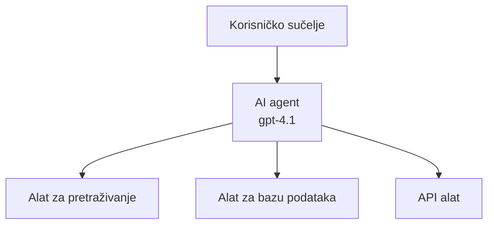
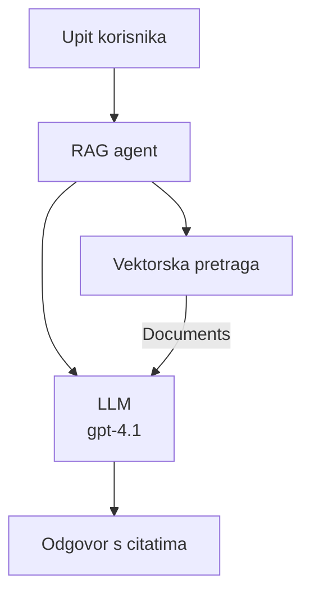
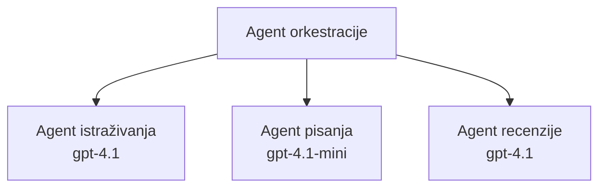

# AI agenti s Azure Developer CLI

**Navigacija po poglavljima:**
- **📚 Početna stranica tečaja**: [AZD za početnike](../../README.md)
- **📖 Trenutno poglavlje**: Poglavlje 2 - AI-Prioritetni razvoj
- **⬅️ Prethodno**: [Microsoft Foundry integracija](microsoft-foundry-integration.md)
- **➡️ Sljedeće**: [Implementacija AI modela](ai-model-deployment.md)
- **🚀 Napredno**: [Rješenja s više agenata](../../examples/retail-scenario.md)

---

## Uvod

AI agenti su autonomni programi koji mogu percipirati svoju okolinu, donositi odluke i poduzimati radnje radi postizanja određenih ciljeva. Za razliku od jednostavnih chatbotova koji odgovaraju na upite, agenti mogu:

- **Koristiti alate** - Pozivati API-je, pretraživati baze podataka, izvršavati kod
- **Planirati i zaključivati** - Razdvajati složene zadatke na korake
- **Učiti iz konteksta** - Održavati memoriju i prilagoditi ponašanje
- **Surađivati** - Raditi s drugim agentima (sustavi s više agenata)

Ovaj vodič pokazuje kako implementirati AI agente u Azure koristeći Azure Developer CLI (azd).

> **Napomena o validaciji (2026-07-13):** Ovaj je vodič pregledan prema verzijama `azd` `1.27.1` i `azure.ai.agents` `1.0.0-beta.5`. `azd ai` iskustvo je još uvijek u fazi pregleda, stoga provjerite pomoć za dodatak ako se vaši instalirani parametri razlikuju.

## Ciljevi učenja

Ispunjavanjem ovog vodiča ćete:
- Razumjeti što su AI agenti i kako se razlikuju od chatbota
- Implementirati unaprijed izrađene predloške AI agenata koristeći AZD
- Konfigurirati Foundry agente za prilagođene agente
- Implementirati osnovne agentne obrasce (korištenje alata, RAG, multi-agentni)
- Nadzirati i otklanjati pogreške implementiranih agenata

## Ishodi učenja

Po završetku ćete moći:
- Implementirati AI aplikacije agenata u Azure jednom naredbom
- Konfigurirati alate i sposobnosti agenata
- Implementirati generiranje s poboljšanjem pretraživanjem (RAG) s agentima
- Dizajnirati višestruke agentne arhitekture za složene tokove rada
- Rješavati uobičajene probleme u implementaciji agenata

---

## 🤖 Što agent čini drugačijim od chatbota?

| Značajka | Chatbot | AI agent |
|---------|---------|----------|
| **Ponašanje** | Odgovara na upite | Poduzima autonomne radnje |
| **Alati** | Nema | Može pozivati API-je, pretraživati, izvršavati kod |
| **Memorija** | Samo unutar sesije | Trajna memorija preko sesija |
| **Planiranje** | Jedan odgovor | Višekorakno zaključivanje |
| **Suradnja** | Jedinica | Može raditi s drugim agentima |

### Jednostavna analogija

- **Chatbot** = Pomoćna osoba koja odgovara na pitanja na info-pultu
- **AI agent** = Osobni asistent koji može obavljati pozive, zakazivati sastanke i izvršavati zadatke za vas

---

## 🚀 Brzi početak: Implementirajte svog prvog agenta

### Opcija 1: Foundry Agents predložak (preporučeno)

```bash
# Inicijalizirajte predložak AI agenata
azd init --template get-started-with-ai-agents

# Implementirajte na Azure
azd up
```

**Što se implementira:**
- ✅ Foundry agenti
- ✅ Microsoft Foundry modeli (gpt-4.1)
- ✅ Azure AI Search (za RAG)
- ✅ Azure Container Apps (web sučelje)
- ✅ Application Insights (nadgledanje)

**Vrijeme:** ~15-20 minuta
**Trošak:** ~$100-150/mjesečno (razvoj)

### Opcija 2: OpenAI agent s Prompty-jem

```bash
# Inicijaliziraj predložak agenta temeljenog na Promptyju
azd init --template agent-openai-python-prompty

# Implementiraj na Azure
azd up
```

**Što se implementira:**
- ✅ Azure Functions (izvršavanje agenata bez servera)
- ✅ Microsoft Foundry modeli
- ✅ Konfiguracijske datoteke Prompty
- ✅ Primjer implementacije agenta

**Vrijeme:** ~10-15 minuta
**Trošak:** ~$50-100/mjesečno (razvoj)

### Opcija 3: RAG chat agent

```bash
# Inicijaliziraj RAG chat predložak
azd init --template azure-search-openai-demo

# Implementiraj na Azure
azd up
```

**Što se implementira:**
- ✅ Microsoft Foundry modeli
- ✅ Azure AI Search sa uzorkom podataka
- ✅ Cjevovod za obradu dokumenata
- ✅ Chat sučelje s referencama

**Vrijeme:** ~15-25 minuta
**Trošak:** ~$80-150/mjesečno (razvoj)

### Opcija 4: AZD AI Agent Init (Pregled inicijalizacije kroz manifest ili predložak)

Ako imate manifest agenta, možete koristiti naredbu `azd ai` za izravno kreiranje projekta Foundry Agent Service. Nedavne verzije u pregledu također podržavaju inicijalizaciju temeljenu na predlošcima, pa se točan tijek može malo razlikovati ovisno o verziji proširenja koju imate.

```bash
# Instalirajte proširenje AI agenata
azd extension install azure.ai.agents

# Opcionalno: provjerite instaliranu preglednu verziju
azd extension show azure.ai.agents

# Inicijalizirajte iz manifesta agenata
azd ai agent init -m agent-manifest.yaml

# Implementirajte na Azure
azd up

# Testirajte implementiranog agenta (prikazuje kašnjenje + vrijeme do prvog bajta)
azd ai agent invoke
```

**Kada koristiti `azd ai agent init` naspram `azd init --template`:**

| Pristup | Najbolje za | Kako radi |
|----------|----------|------|
| `azd init --template` | Početak s radnim primjerom aplikacije | Klonira kompletan repozitorij s kodom + infrastrukturom |
| `azd ai agent init -m` | Izgradnju na vlastitom agent manifestu | Kreira strukturu projekta temeljem definicije agenta |

> **Savjet:** Koristite `azd init --template` za učenje (gornje Opcije 1-3). Koristite `azd ai agent init` za proizvodne agente s vlastitim manifestima.

Nakon `azd up`, isto proširenje vas vodi kroz ostali životni ciklus agenta: `azd ai agent invoke` za testiranje, `azd ai agent eval generate` i `azd ai agent optimize` za mjerenje i poboljšavanje kvalitete, te `azd ai agent delete` za čišćenje. Pogledajte [AZD AI CLI naredbe](../chapter-08-production/production-ai-practices.md#azd-ai-cli-commands-and-extensions) za puni pregled.

---

## 🏗️ Obrasci arhitekture agenata

### Obrazac 1: Jedan agent s alatima

Najjednostavniji obrazac agenta - jedan agent koji može koristiti više alata.



**Najbolje za:**
- Bots za korisničku podršku
- Istraživačke asistente
- Agente za analizu podataka

**AZD predložak:** `azure-search-openai-demo`

### Obrazac 2: RAG agent (generiranje potpomognuto pretraživanjem)

Agent koji prethodno dohvaća relevantne dokumente prije generiranja odgovora.



**Najbolje za:**
- Korporativne baze znanja
- Sustave za pitanja i odgovore o dokumentima
- Istraživanje za usklađenost i pravne poslove

**AZD predložak:** `azure-search-openai-demo`

### Obrazac 3: Sustav s više agenata

Više specijaliziranih agenata koji rade zajedno na složenim zadacima.



**Najbolje za:**
- Složenije generiranje sadržaja
- Višekorakne tokove rada
- Zadace koje zahtijevaju različitu stručnost

**Saznajte više:** [Obrasci koordinacije više agenata](../chapter-06-pre-deployment/coordination-patterns.md)

---

## ⚙️ Konfiguracija alata za agente

Agenti postaju moćni kada mogu koristiti alate. Evo kako konfigurirati uobičajene alate:

### Konfiguracija alata u Foundry agentima

```python
# agent_config.py
from azure.ai.projects import AIProjectClient
from azure.ai.projects.models import FunctionTool, CodeInterpreterTool

# Definirajte prilagođene alate
search_tool = FunctionTool(
    name="search_knowledge_base",
    description="Search the company knowledge base for relevant documents",
    parameters={
        "type": "object",
        "properties": {
            "query": {
                "type": "string",
                "description": "The search query"
            }
        },
        "required": ["query"]
    }
)

# Kreirajte agenta s alatima
agent = project_client.agents.create_agent(
    model="gpt-4.1",
    name="Support Agent",
    instructions="You are a helpful support agent. Use the search tool to find relevant information.",
    tools=[search_tool, CodeInterpreterTool()]
)
```

### Konfiguracija okoline

```bash
# Postavite varijable okoline specifične za agenta
azd env set AZURE_OPENAI_MODEL "gpt-4.1"
azd env set AGENT_INSTRUCTIONS "You are a helpful assistant..."
azd env set ENABLE_CODE_INTERPRETER "true"
azd env set ENABLE_FILE_SEARCH "true"

# Implementirajte s ažuriranom konfiguracijom
azd deploy
```

---

## 📊 Praćenje agenata

### Integracija s Application Insights

Svi AZD predlošci agenata uključuju Application Insights za praćenje:

```bash
# Otvori nadzornu ploču za praćenje
azd monitor --overview

# Pregledaj uživo zapisnike
azd monitor --logs

# Pregledaj uživo metrike
azd monitor --live
```

### Ključne metrike za praćenje

| Metrička vrijednost | Opis | Cilj |
|--------|-------------|--------|
| Kašnjenje odgovora | Vrijeme za generiranje odgovora | < 5 sekundi |
| Potrošnja tokena | Tokeni po upitu | Praćenje radi troškova |
| Postotak uspješnih poziva alatu | % uspješnih izvršenja alata | > 95% |
| Stopa pogrešaka | Neuspjeli zahtjevi agenta | < 1% |
| Zadovoljstvo korisnika | Rezultati povratnih informacija | > 4.0/5.0 |

### Prilagođeno logiranje za agente

```python
import os
from azure.monitor.opentelemetry import configure_azure_monitor
from opentelemetry import trace

# Konfigurirajte Azure Monitor s OpenTelemetry
configure_azure_monitor(
    connection_string=os.environ["APPLICATIONINSIGHTS_CONNECTION_STRING"]
)

tracer = trace.get_tracer(__name__)

def log_agent_interaction(user_query, agent_response, tools_used, latency_ms):
    with tracer.start_as_current_span("agent_interaction") as span:
        span.set_attributes({
            "user_query": user_query,
            "response_length": len(agent_response),
            "tools_used": tools_used,
            "latency_ms": latency_ms
        })
```

> **Napomena:** Instalirajte potrebne pakete: `pip install azure-monitor-opentelemetry opentelemetry`

---

## 💰 Troškovne razmatranja

### Procijenjeni mjesečni troškovi po obrascu

| Obrazac | Razvojno okruženje | Produkcija |
|---------|-----------------|------------|
| Jedan agent | $50-100 | $200-500 |
| RAG agent | $80-150 | $300-800 |
| Višestruki agenti (2-3 agenta) | $150-300 | $500-1,500 |
| Enterprise višestruki agenti | $300-500 | $1,500-5,000+ |

### Savjeti za optimizaciju troškova

1. **Koristite gpt-4.1-mini za jednostavne zadatke**
   ```bash
   azd env set AZURE_OPENAI_MODEL "gpt-4.1-mini"
   ```

2. **Implementirajte cache za ponovljene upite**
   ```python
   from functools import lru_cache
   
   @lru_cache(maxsize=1000)
   def get_cached_response(query_hash):
       return agent.run(query_hash)
   ```

3. **Postavite ograničenja tokena po izvođenju**
   ```python
   # Postavite max_completion_tokens prilikom pokretanja agenta, a ne tijekom stvaranja
   run = project_client.agents.create_run(
       thread_id=thread.id,
       agent_id=agent.id,
       max_completion_tokens=1000  # Ograničite duljinu odgovora
   )
   ```

4. **Smanjite na nulu kad nije u upotrebi**
   ```bash
   # Container Apps se automatski skaliraju do nule
   azd env set MIN_REPLICAS "0"
   ```

---

## 🔧 Otklanjanje problema agenata

### Uobičajeni problemi i rješenja

<details>
<summary><strong>❌ Agent ne odgovara na pozive alatu</strong></summary>

```bash
# Provjerite jesu li alati pravilno registrirani
azd show

# Provjerite OpenAI implementaciju
az cognitiveservices account deployment list \
  --name $AZURE_OPENAI_NAME \
  --resource-group $RG_NAME

# Provjerite zapisnike agenta
azd monitor --logs
```

**Uobičajeni uzroci:**
- Neslaganje potpisa funkcije alata
- Nedostaju potrebne dozvole
- API endpoint nije dostupan
</details>

<details>
<summary><strong>❌ Veliko kašnjenje u odgovorima agenta</strong></summary>

```bash
# Provjerite Application Insights za uska grla
azd monitor --live

# Razmotrite korištenje bržeg modela
azd env set AZURE_OPENAI_MODEL "gpt-4.1-mini"
azd deploy
```

**Savjeti za optimizaciju:**
- Koristite streaming odgovore
- Implementirajte cache odgovora
- Smanjite veličinu kontekstnog prozora
</details>

<details>
<summary><strong>❌ Agent vraća netočne ili halucinirane informacije</strong></summary>

```python
# Poboljšajte s boljim uputama za sustav
instructions = """
You are a helpful assistant. IMPORTANT:
- Only answer based on provided context
- If you don't know, say "I don't know"
- Always cite your sources
- Never make up information
"""

# Dodajte dohvaćanje za utemeljenje
agent = project_client.agents.create_agent(
    model="gpt-4.1",
    instructions=instructions,
    tools=[FileSearchTool()]  # Utemeljite odgovore u dokumentima
)
```
</details>

<details>
<summary><strong>❌ Pogreške zbog prekoračenja limita tokena</strong></summary>

```python
# Implementirajte upravljanje kontekstnim prozorom
def truncate_context(messages, max_tokens=8000, model="gpt-4.1"):
    """Keep only recent messages within token limit."""
    import tiktoken
    encoding = tiktoken.encoding_for_model(model)
    total_tokens = 0
    truncated = []
    
    for msg in reversed(messages):
        msg_tokens = len(encoding.encode(msg.content))
        if total_tokens + msg_tokens > max_tokens:
            break
        truncated.insert(0, msg)
        total_tokens += msg_tokens
    
    return truncated
```
</details>

---

## 🎓 Praktične vježbe

### Vježba 1: Implementirajte osnovnog agenta (20 minuta)

**Cilj:** Implementirati svog prvog AI agenta koristeći AZD

```bash
# Korak 1: Inicijalizirajte predložak
azd init --template get-started-with-ai-agents

# Korak 2: Prijava u Azure
azd auth login
# Ako radite preko više zakupaca, dodajte --tenant-id <tenant-id>

# Korak 3: Implementirajte
azd up

# Korak 4: Testirajte agenta
# Očekivani rezultat nakon implementacije:
#   Implementacija završena!
#   Krajnja točka: https://<app-name>.<region>.azurecontainerapps.io
# Otvorite URL prikazan u izlazu i pokušajte postaviti pitanje

# Korak 5: Pregledajte nadzor
azd monitor --overview

# Korak 6: Očistite resurse
azd down --force --purge
```

**Kriteriji uspjeha:**
- [ ] Agent odgovara na pitanja
- [ ] Može pristupiti nadzornoj ploči preko `azd monitor`
- [ ] Resursi uspješno očišćeni

### Vježba 2: Dodajte prilagođeni alat (30 minuta)

**Cilj:** Proširiti agenta prilagođenim alatom

1. Implementirajte predložak agenta:
   ```bash
   azd init --template get-started-with-ai-agents
   azd up
   ```
2. Kreirajte novu funkciju alata u vašem agentnom kodu:
   ```python
   def get_weather(location: str) -> str:
       """Get current weather for a location."""
       # Poziv API-ja prema vremenskoj službi
       return f"Weather in {location}: Sunny, 72°F"
   ```
3. Registrirajte alat s agentom:
   ```python
   from azure.ai.projects.models import FunctionTool

   weather_tool = FunctionTool(
       name="get_weather",
       description="Get current weather for a location",
       parameters={
           "type": "object",
           "properties": {
               "location": {"type": "string", "description": "City name"}
           },
           "required": ["location"]
       }
   )

   agent = project_client.agents.create_agent(
       model="gpt-4.1",
       name="Weather Agent",
       tools=[weather_tool]
   )
   ```
4. Ponovno implementirajte i testirajte:
   ```bash
   azd deploy
   # Pitaj: "Kakvo je vrijeme u Seattlu?"
   # Očekivano: Agent poziva get_weather("Seattle") i vraća informacije o vremenu
   ```

**Kriteriji uspjeha:**
- [ ] Agent prepoznaje upite vezane uz vremenski uvjet
- [ ] Alat se pravilno poziva
- [ ] Odgovor sadrži vremenske informacije

### Vježba 3: Izgradite RAG agenta (45 minuta)

**Cilj:** Stvoriti agenta koji odgovara na pitanja iz vaših dokumenata

```bash
# Korak 1: Postavite RAG predložak
azd init --template azure-search-openai-demo
azd up

# Korak 2: Prenesite svoje dokumente
# Postavite PDF/TXT datoteke u direktorij data/, zatim pokrenite:
python scripts/prepdocs.py

# Korak 3: Testirajte s pitanjima specifičnim za domen
# Otvorite URL web aplikacije iz azd up izlaza
# Postavljajte pitanja o svojim prenesenim dokumentima
# Odgovori bi trebali uključivati reference na citate poput [doc.pdf]
```

**Kriteriji uspjeha:**
- [ ] Agent odgovara na temelju prenesenih dokumenata
- [ ] Odgovori uključuju reference
- [ ] Nema halucinacije na pitanja izvan domene

---

## 📚 Sljedeći koraci

Sada kad razumijete AI agente, istražite ove napredne teme:

| Tema | Opis | Link |
|-------|-------------|------|
| **Sustavi s više agenata** | Izgradnja sustava s više surađujućih agenata | [Primjer maloprodajnog multi-agenta](../../examples/retail-scenario.md) |
| **Obrasci koordinacije** | Naučite obrasce orkestracije i komunikacije | [Obrasci koordinacije](../chapter-06-pre-deployment/coordination-patterns.md) |
| **Implementacija u produkciju** | Implementacija agenata spremnih za poduzeće | [Prakse AI u produkciji](../chapter-08-production/production-ai-practices.md) |
| **Evaluacija agenata** | Testirajte i procijenite izvedbu agenata | [Otklanjanje AI pogrešaka](../chapter-07-troubleshooting/ai-troubleshooting.md) |
| **AI laboratorij za radionice** | Praktično: Pripremite svoje AI rješenje za AZD | [AI laboratorij](ai-workshop-lab.md) |

---

## 📖 Dodatni resursi

### Službena dokumentacija
- [Microsoft Foundry Agent Service](https://learn.microsoft.com/azure/ai-services/agents/)
- [Brzi početak Microsoft Foundry Agent Service](https://learn.microsoft.com/azure/ai-services/agents/quickstart)
- [Semantic Kernel Agent Framework](https://learn.microsoft.com/semantic-kernel/)

### AZD predlošci za agente
- [Početak rada s AI agentima](https://github.com/Azure-Samples/get-started-with-ai-agents)
- [Agent OpenAI Python Prompty](https://github.com/Azure-Samples/agent-openai-python-prompty)
- [Azure Search OpenAI Demo](https://github.com/Azure-Samples/azure-search-openai-demo)

### Resursi zajednice
- [Awesome AZD - Agentni predlošci](https://azure.github.io/awesome-azd/?tags=ai-agents)
- [Azure AI Discord](https://discord.gg/microsoft-azure)
- [Microsoft Foundry Discord](https://discord.gg/nTYy5BXMWG)

### Vještine agenata za vaš uređivač
- [**Microsoft Azure Agent Skills**](https://skills.sh/microsoft/github-copilot-for-azure) - Instalirajte višekratno upotrebljive vještine AI agenata za Azure razvoj u GitHub Copilot, Cursor ili bilo koji podržani agent. Uključuje vještine za [Azure AI](https://skills.sh/microsoft/github-copilot-for-azure/azure-ai), [Microsoft Foundry](https://skills.sh/microsoft/github-copilot-for-azure/microsoft-foundry), [implementaciju](https://skills.sh/microsoft/github-copilot-for-azure/azure-deploy) i [dijagnostiku](https://skills.sh/microsoft/github-copilot-for-azure/azure-diagnostics):
  ```bash
  npx skills add microsoft/github-copilot-for-azure
  ```

---

**Navigacija**
- **Prethodna lekcija**: [Microsoft Foundry integracija](microsoft-foundry-integration.md)
- **Sljedeća lekcija**: [Implementacija AI modela](ai-model-deployment.md)

---

<!-- CO-OP TRANSLATOR DISCLAIMER START -->
**Napomena**:
Ovaj dokument je preveden korištenjem AI prevoditeljskog servisa [Co-op Translator](https://github.com/Azure/co-op-translator). Iako težimo točnosti, imajte na umu da automatski prijevodi mogu sadržavati greške ili netočnosti. Izvorni dokument na izvornom jeziku treba smatrati autoritativnim izvorom. Za važne informacije preporuča se profesionalni ljudski prijevod. Nismo odgovorni za bilo kakva nesporazumevanja ili pogrešne interpretacije koje proizlaze iz korištenja ovog prijevoda.
<!-- CO-OP TRANSLATOR DISCLAIMER END -->