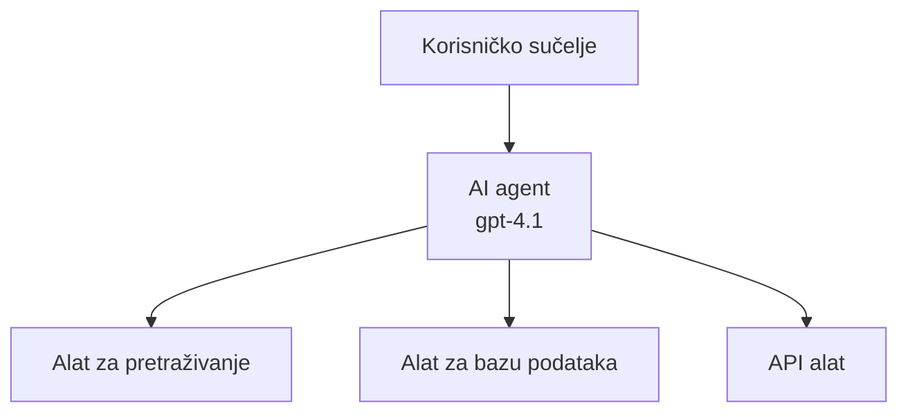
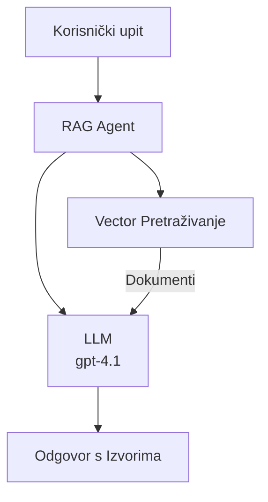
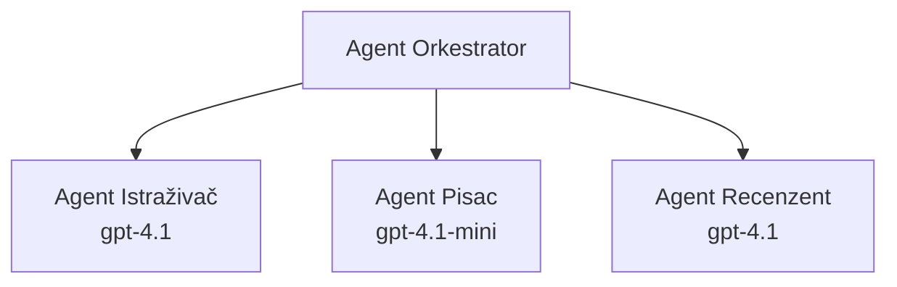

# AI Agenti s Azure Developer CLI

**Navigacija poglavljem:**
- **📚 Početna stranica tečaja**: [AZD za početnike](../../README.md)
- **📖 Trenutno poglavlje**: Poglavlje 2 - AI-First razvoj
- **⬅️ Prethodno**: [Microsoft Foundry integracija](microsoft-foundry-integration.md)
- **➡️ Sljedeće**: [Implementacija AI modela](ai-model-deployment.md)
- **🚀 Napredno**: [Rješenja s više agenata](../../examples/retail-scenario.md)

---

## Uvod

AI agenti su autonomni programi koji mogu percipirati svoje okruženje, donositi odluke i poduzimati radnje kako bi postigli određene ciljeve. Za razliku od jednostavnih chatbotova koji odgovaraju na postavljena pitanja, agenti mogu:

- **Koristiti alate** - Pozivati API-je, pretraživati baze podataka, izvršavati kod
- **Planirati i razmišljati** - Razdvajati složene zadatke u korake
- **Učiti iz konteksta** - Održavati memoriju i prilagođavati ponašanje
- **Surađivati** - Raditi s drugim agentima (sustavi s više agenata)

Ovaj vodič pokazuje kako implementirati AI agente na Azure koristeći Azure Developer CLI (azd).

## Ciljevi učenja

Kroz ovaj vodič ćete:
- Razumjeti što su AI agenti i kako se razlikuju od chatbotova
- Implementirati unaprijed izrađene predloške AI agenata koristeći AZD
- Konfigurirati Foundry agente za prilagođene agente
- Implementirati osnovne obrasce agenata (korištenje alata, RAG, multi-agent)
- Pratiti i otklanjati pogreške implementiranih agenata

## Ishodi učenja

Po završetku ćete moći:
- Implementirati aplikacije AI agenata na Azure jednim naredbom
- Konfigurirati alate i sposobnosti agenata
- Implementirati retrieval-augmented generation (RAG) s agentima
- Dizajnirati arhitekture s više agenata za složene tijekove rada
- Rješavati uobičajene probleme pri implementaciji agenata

---

## 🤖 Što razlikuje agenta od chatbota?

| Značajka | Chatbot | AI Agent |
|---------|---------|----------|
| **Ponašanje** | Odgovara na upite | Poduzima autonomne radnje |
| **Alati** | Nema | Može pozivati API-je, pretraživati, izvršavati kod |
| **Memorija** | Samo temeljem sesije | Trajna memorija kroz sesije |
| **Planiranje** | Jedan odgovor | Višekorak razmišljanja |
| **Suradnja** | Jedinstvena jedinica | Može raditi s drugim agentima |

### Jednostavna analogija

- **Chatbot** = Pomoćna osoba koja odgovara na pitanja na informativnom šalteru
- **AI Agent** = Osobni asistent koji može obaviti pozive, rezervirati termine i izvršiti zadatke za vas

---

## 🚀 Brzi početak: Implementirajte svog prvog agenta

### Opcija 1: Foundry Agents predložak (preporučeno)

```bash
# Inicijaliziraj predložak AI agenata
azd init --template get-started-with-ai-agents

# Postavi na Azure
azd up
```

**Što se implementira:**
- ✅ Foundry Agenti
- ✅ Microsoft Foundry modeli (gpt-4.1)
- ✅ Azure AI Search (za RAG)
- ✅ Azure Container Apps (web sučelje)
- ✅ Application Insights (praćenje)

**Vrijeme:** ~15-20 minuta
**Trošak:** ~$100-150/mjesečno (razvoj)

### Opcija 2: OpenAI Agent s Prompty-jem

```bash
# Inicijalizirajte predložak agenta temeljenog na Promptyju
azd init --template agent-openai-python-prompty

# Implementirajte na Azure
azd up
```

**Što se implementira:**
- ✅ Azure Functions (serverless izvršavanje agenata)
- ✅ Microsoft Foundry modeli
- ✅ Konfiguracijske datoteke Prompty-ja
- ✅ Primjer implementacije agenta

**Vrijeme:** ~10-15 minuta
**Trošak:** ~$50-100/mjesečno (razvoj)

### Opcija 3: RAG Chat Agent

```bash
# Inicijaliziraj RAG chat predložak
azd init --template azure-search-openai-demo

# Postavi na Azure
azd up
```

**Što se implementira:**
- ✅ Microsoft Foundry modeli
- ✅ Azure AI Search s primjerkom podataka
- ✅ Pipeline za obradu dokumenata
- ✅ Chat sučelje s citatima

**Vrijeme:** ~15-25 minuta
**Trošak:** ~$80-150/mjesečno (razvoj)

### Opcija 4: AZD AI Agent Init (temeljeno na manifestu)

Ako imate datoteku manifesta agenta, možete koristiti naredbu `azd ai` za izradu Foundry Agent Service projekta direktno:

```bash
# Instalirajte proširenje AI agenata
azd extension install azure.ai.agents

# Inicijaliziraj iz manifesta agenta
azd ai agent init -m agent-manifest.yaml

# Primijeni na Azure
azd up
```

**Kada koristiti `azd ai agent init` naspram `azd init --template`:**

| Pristup | Najbolje za | Kako radi |
|----------|----------|------|
| `azd init --template` | Početak s funkcionalnom uzorčnom aplikacijom | Klonira cijeli repozitorij predloška s kodom i infrastrukturom |
| `azd ai agent init -m` | Izgradnja na temelju vlastitog manifesta agenta | Kreira strukturu projekta prema definiciji agenta |

> **Savjet:** Koristite `azd init --template` kad učite (Opcije 1-3 gore). Koristite `azd ai agent init` za izgradnju produkcijskih agenata s vlastitim manifestima. Pogledajte [AZD AI CLI naredbe](../chapter-08-production/production-ai-practices.md#azd-ai-cli-commands-and-extensions) za potpuni pregled.

---

## 🏗️ Obrasci arhitekture agenata

### Obrasč 1: Jedan agent s alatima

Najjednostavniji obrazac agenta - jedan agent koji može koristiti više alata.


**Najbolje za:**
- Botove za korisničku podršku
- Pomoćnike za istraživanje
- Agente za analizu podataka

**AZD predložak:** `azure-search-openai-demo`

### Obrasč 2: RAG agent (retrieval-augmented generation)

Agent koji dohvaća relevantne dokumente prije generiranja odgovora.


**Najbolje za:**
- Enterprise baze znanja
- Sustave za pitanja i odgovore nad dokumentima
- Istraživanje usklađenosti i pravnih pitanja

**AZD predložak:** `azure-search-openai-demo`

### Obrasč 3: Sustav s više agenata

Više specijaliziranih agenata koji surađuju na složenim zadacima.


**Najbolje za:**
- Složenu generaciju sadržaja
- Višekorak tijekove rada
- Zadatke koji zahtijevaju različite stručnosti

**Saznajte više:** [Obrasci koordinacije s više agenata](../chapter-06-pre-deployment/coordination-patterns.md)

---

## ⚙️ Konfiguracija alata za agente

Agenti postaju snažni kada mogu koristiti alate. Evo kako konfigurirati uobičajene alate:

### Konfiguracija alata u Foundry agentima

```python
# agent_config.py
from azure.ai.projects import AIProjectClient
from azure.ai.projects.models import FunctionTool, CodeInterpreterTool

# Definirajte prilagođene alate
search_tool = FunctionTool(
    name="search_knowledge_base",
    description="Search the company knowledge base for relevant documents",
    parameters={
        "type": "object",
        "properties": {
            "query": {
                "type": "string",
                "description": "The search query"
            }
        },
        "required": ["query"]
    }
)

# Kreirajte agenta s alatima
agent = project_client.agents.create_agent(
    model="gpt-4.1",
    name="Support Agent",
    instructions="You are a helpful support agent. Use the search tool to find relevant information.",
    tools=[search_tool, CodeInterpreterTool()]
)
```

### Konfiguracija okoline

```bash
# Postavite varijable okoline specifične za agenta
azd env set AZURE_OPENAI_MODEL "gpt-4.1"
azd env set AGENT_INSTRUCTIONS "You are a helpful assistant..."
azd env set ENABLE_CODE_INTERPRETER "true"
azd env set ENABLE_FILE_SEARCH "true"

# Implementirajte s ažuriranom konfiguracijom
azd deploy
```

---

## 📊 Praćenje agenata

### Integracija Application Insightsa

Svi AZD predlošci agenata uključuju Application Insights za praćenje:

```bash
# Otvori kontrolnu ploču za nadzor
azd monitor --overview

# Pregledaj žive zapise
azd monitor --logs

# Pregledaj žive metrike
azd monitor --live
```

### Ključni metrički pokazatelji

| Metrički pokazatelj | Opis | Cilj |
|--------|-------------|--------|
| Latencija odgovora | Vrijeme za generiranje odgovora | < 5 sekundi |
| Upotreba tokena | Tokeni po zahtjevu | Praćenje troškova |
| Stopa uspješnosti poziva alata | % uspješnih izvršavanja alata | > 95% |
| Stopa pogrešaka | Neuspjeli zahtjevi agenata | < 1% |
| Zadovoljstvo korisnika | Rezultati povratnih informacija | > 4.0/5.0 |

### Prilagođeno logiranje za agente

```python
import os
from azure.monitor.opentelemetry import configure_azure_monitor
from opentelemetry import trace

# Konfigurirajte Azure Monitor s OpenTelemetry
configure_azure_monitor(
    connection_string=os.environ["APPLICATIONINSIGHTS_CONNECTION_STRING"]
)

tracer = trace.get_tracer(__name__)

def log_agent_interaction(user_query, agent_response, tools_used, latency_ms):
    with tracer.start_as_current_span("agent_interaction") as span:
        span.set_attributes({
            "user_query": user_query,
            "response_length": len(agent_response),
            "tools_used": tools_used,
            "latency_ms": latency_ms
        })
```

> **Napomena:** Instalirajte potrebne pakete: `pip install azure-monitor-opentelemetry opentelemetry`

---

## 💰 Troškovi

### Procijenjeni mjesečni troškovi po obrascu

| Obrazac | Razvojno okruženje | Produkcija |
|---------|-----------------|------------|
| Jedan agent | $50-100 | $200-500 |
| RAG agent | $80-150 | $300-800 |
| Višestruki agenti (2-3 agenta) | $150-300 | $500-1,500 |
| Enterprise višestruki agenti | $300-500 | $1,500-5,000+ |

### Savjeti za optimizaciju troškova

1. **Koristite gpt-4.1-mini za jednostavne zadatke**
   ```bash
   azd env set AZURE_OPENAI_MODEL "gpt-4.1-mini"
   ```

2. **Implementirajte keširanje za ponovljene upite**
   ```python
   from functools import lru_cache
   
   @lru_cache(maxsize=1000)
   def get_cached_response(query_hash):
       return agent.run(query_hash)
   ```

3. **Postavite ograničenja tokena po izvođenju**
   ```python
   # Postavite max_completion_tokens prilikom pokretanja agenta, ne tijekom stvaranja
   run = project_client.agents.create_run(
       thread_id=thread.id,
       agent_id=agent.id,
       max_completion_tokens=1000  # Ograničite duljinu odgovora
   )
   ```

4. **Smanjite na nulu kada nije u uporabi**
   ```bash
   # Container Apps se automatski skaliraju do nule
   azd env set MIN_REPLICAS "0"
   ```

---

## 🔧 Otklanjanje poteškoća s agentima

### Uobičajeni problemi i rješenja

<details>
<summary><strong>❌ Agent ne reagira na pozive alatu</strong></summary>

```bash
# Provjerite jesu li alati ispravno registrirani
azd show

# Provjerite OpenAI implementaciju
az cognitiveservices account deployment list \
  --name $AZURE_OPENAI_NAME \
  --resource-group $RG_NAME

# Provjerite zapise agenta
azd monitor --logs
```

**Česti uzroci:**
- Nepodudarnost potpisa funkcije alata
- Nedostatak potrebnih dozvola
- API endpoint nije dostupan
</details>

<details>
<summary><strong>❌ Visoka latencija u odgovorima agenta</strong></summary>

```bash
# Provjerite Application Insights zbog uskih grla
azd monitor --live

# Razmotrite korištenje bržeg modela
azd env set AZURE_OPENAI_MODEL "gpt-4.1-mini"
azd deploy
```

**Savjeti za optimizaciju:**
- Koristite streaming odgovore
- Implementirajte keširanje odgovora
- Smanjite veličinu kontekstnog prozora
</details>

<details>
<summary><strong>❌ Agent vraća netočne ili halucinirane informacije</strong></summary>

```python
# Poboljšaj s boljim sustavnim uputama
instructions = """
You are a helpful assistant. IMPORTANT:
- Only answer based on provided context
- If you don't know, say "I don't know"
- Always cite your sources
- Never make up information
"""

# Dodaj dohvaćanje za utemeljenje
agent = project_client.agents.create_agent(
    model="gpt-4.1",
    instructions=instructions,
    tools=[FileSearchTool()]  # Utemelji odgovore u dokumentima
)
```
</details>

<details>
<summary><strong>❌ Pogreške prekoračenja granice tokena</strong></summary>

```python
# Implementirajte upravljanje kontekstnim prozorom
def truncate_context(messages, max_tokens=8000, model="gpt-4.1"):
    """Keep only recent messages within token limit."""
    import tiktoken
    encoding = tiktoken.encoding_for_model(model)
    total_tokens = 0
    truncated = []
    
    for msg in reversed(messages):
        msg_tokens = len(encoding.encode(msg.content))
        if total_tokens + msg_tokens > max_tokens:
            break
        truncated.insert(0, msg)
        total_tokens += msg_tokens
    
    return truncated
```
</details>

---

## 🎓 Praktične vježbe

### Vježba 1: Implementirajte osnovnog agenta (20 minuta)

**Cilj:** Implementirajte svog prvog AI agenta koristeći AZD

```bash
# Korak 1: Inicijalizirajte predložak
azd init --template get-started-with-ai-agents

# Korak 2: Prijavite se u Azure
azd auth login

# Korak 3: Implementacija
azd up

# Korak 4: Testirajte agenta
# Očekivani rezultat nakon implementacije:
#   Implementacija završena!
#   Krajnja točka: https://<app-name>.<region>.azurecontainerapps.io
# Otvorite URL prikazan u izlazu i pokušajte postaviti pitanje

# Korak 5: Pregledajte nadzor
azd monitor --overview

# Korak 6: Očistite resurse
azd down --force --purge
```

**Kriteriji uspjeha:**
- [ ] Agent odgovara na pitanja
- [ ] Moguć pristup nadzornoj ploči praćenja putem `azd monitor`
- [ ] Resursi uspješno očišćeni

### Vježba 2: Dodajte prilagođeni alat (30 minuta)

**Cilj:** Proširite agenta s prilagođenim alatom

1. Implementirajte predložak agenta:
   ```bash
   azd init --template get-started-with-ai-agents
   azd up
   ```
2. Kreirajte novu funkciju alata u kodu agenta:
   ```python
   def get_weather(location: str) -> str:
       """Get current weather for a location."""
       # API poziv usluzi vremena
       return f"Weather in {location}: Sunny, 72°F"
   ```
3. Registrirajte alat s agentom:
   ```python
   from azure.ai.projects.models import FunctionTool

   weather_tool = FunctionTool(
       name="get_weather",
       description="Get current weather for a location",
       parameters={
           "type": "object",
           "properties": {
               "location": {"type": "string", "description": "City name"}
           },
           "required": ["location"]
       }
   )

   agent = project_client.agents.create_agent(
       model="gpt-4.1",
       name="Weather Agent",
       tools=[weather_tool]
   )
   ```
4. Ponovno implementirajte i testirajte:
   ```bash
   azd deploy
   # Pitaj: "Kakvo je vrijeme u Seattleu?"
   # Očekivano: Agent poziva get_weather("Seattle") i vraća informacije o vremenu
   ```

**Kriteriji uspjeha:**
- [ ] Agent prepoznaje upite vezane uz vremensku prognozu
- [ ] Alat je pravilno pozvan
- [ ] Odgovor uključuje informacije o vremenu

### Vježba 3: Izgradite RAG agenta (45 minuta)

**Cilj:** Kreirajte agenta koji odgovara na pitanja iz vaših dokumenata

```bash
# Korak 1: Postavite RAG predložak
azd init --template azure-search-openai-demo
azd up

# Korak 2: Učitajte svoje dokumente
# Stavite PDF/TXT datoteke u direktorij data/, zatim pokrenite:
python scripts/prepdocs.py

# Korak 3: Testirajte s pitanjima specifičnim za domenu
# Otvorite web aplikaciju koristeći URL iz izlaza azd up
# Postavljajte pitanja o svojim učitanim dokumentima
# Odgovori bi trebali sadržavati reference na izvore poput [doc.pdf]
```

**Kriteriji uspjeha:**
- [ ] Agent odgovara na temelju učitanih dokumenata
- [ ] Odgovori uključuju citate
- [ ] Nema halucinacija na upite izvan domena

---

## 📚 Sljedeći koraci

Sad kad razumijete AI agente, istražite ove napredne teme:

| Tema | Opis | Veza |
|-------|-------------|------|
| **Višestruki agenti** | Izgradite sustave s više surađujućih agenata | [Primjer retail višestrukih agenata](../../examples/retail-scenario.md) |
| **Obrasci koordinacije** | Naučite obrasce orkestracije i komunikacije | [Obrasci koordinacije](../chapter-06-pre-deployment/coordination-patterns.md) |
| **Implementacija u produkciju** | Produkcijska implementacija agenata | [Prakse u produkciji AI](../chapter-08-production/production-ai-practices.md) |
| **Evaluacija agenata** | Testiranje i evaluacija performansi agenata | [Otklanjanje problema s AI](../chapter-07-troubleshooting/ai-troubleshooting.md) |
| **AI Radionica** | Praktično: pripremite svoje AI rješenje za AZD | [AI Radionica](ai-workshop-lab.md) |

---

## 📖 Dodatni resursi

### Službena dokumentacija
- [Azure AI Agent Service](https://learn.microsoft.com/azure/ai-services/agents/)
- [Azure AI Foundry Agent Service Brzi početak](https://learn.microsoft.com/azure/ai-services/agents/quickstart)
- [Semantic Kernel Agent Framework](https://learn.microsoft.com/semantic-kernel/)

### AZD predlošci za agente
- [Započni s AI agentima](https://github.com/Azure-Samples/get-started-with-ai-agents)
- [Agent OpenAI Python Prompty](https://github.com/Azure-Samples/agent-openai-python-prompty)
- [Azure Search OpenAI Demo](https://github.com/Azure-Samples/azure-search-openai-demo)

### Resursi zajednice
- [Awesome AZD - Agent predlošci](https://azure.github.io/awesome-azd/?tags=ai-agents)
- [Azure AI Discord](https://discord.gg/microsoft-azure)
- [Microsoft Foundry Discord](https://discord.gg/nTYy5BXMWG)

### Vještine agenata za vaš uređivač
- [**Microsoft Azure Agent Skills**](https://skills.sh/microsoft/github-copilot-for-azure) - Instalirajte ponovno upotrebljive vještine AI agenata za razvoj na Azure u GitHub Copilot, Cursor ili bilo kojem podržanom agentu. Uključuje vještine za [Azure AI](https://skills.sh/microsoft/github-copilot-for-azure/azure-ai), [Microsoft Foundry](https://skills.sh/microsoft/github-copilot-for-azure/microsoft-foundry), [implementaciju](https://skills.sh/microsoft/github-copilot-for-azure/azure-deploy) i [dijagnostiku](https://skills.sh/microsoft/github-copilot-for-azure/azure-diagnostics):
  ```bash
  npx skills add microsoft/github-copilot-for-azure
  ```

---

**Navigacija**
- **Prethodna lekcija**: [Microsoft Foundry integracija](microsoft-foundry-integration.md)
- **Sljedeća lekcija**: [Implementacija AI modela](ai-model-deployment.md)

---

<!-- CO-OP TRANSLATOR DISCLAIMER START -->
**Odricanje od odgovornosti**:
Ovaj dokument preveden je pomoću AI prijevodne usluge [Co-op Translator](https://github.com/Azure/co-op-translator). Iako nastojimo postići točnost, imajte na umu da automatski prijevodi mogu sadržavati pogreške ili netočnosti. Izvorni dokument na izvornom jeziku treba smatrati autoritativnim izvorom. Za kritične informacije preporučuje se profesionalni ljudski prijevod. Ne snosimo odgovornost za bilo kakva nesporazuma ili pogrešna tumačenja koja proizlaze iz korištenja ovog prijevoda.
<!-- CO-OP TRANSLATOR DISCLAIMER END -->