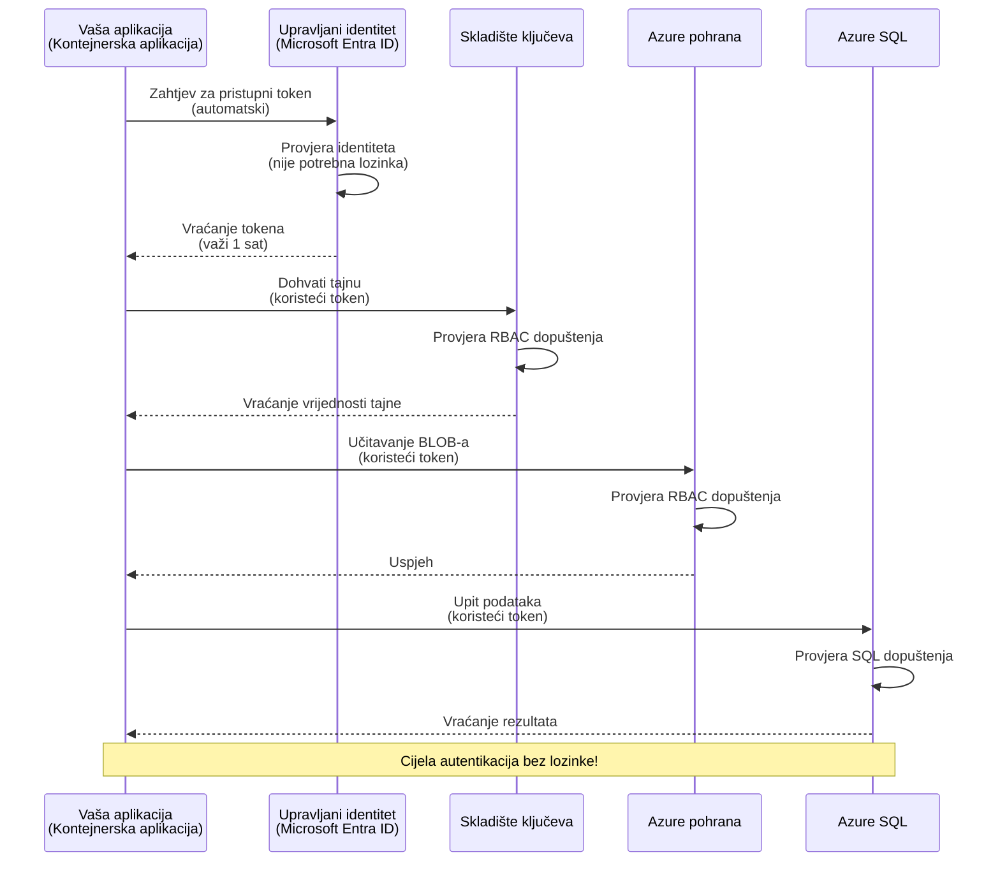
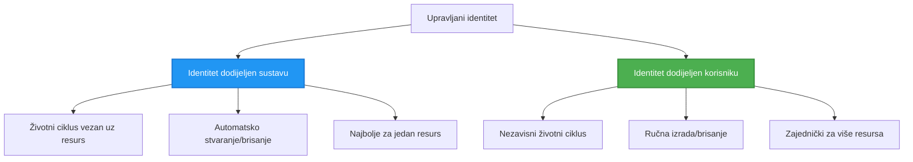

# Obrasci autentifikacije i upravljani identitet

⏱️ **Procijenjeno vrijeme**: 45-60 minuta | 💰 **Trošak**: Besplatno (nema dodatnih naknada) | ⭐ **Složenost**: Srednje

**📚 Put učenja:**
- ← Prethodno: [Upravljanje konfiguracijom](configuration.md) - Upravljanje varijablama okoline i tajnama
- 🎯 **Nalazite se ovdje**: Autentifikacija i sigurnost (Upravljani identitet, Key Vault, sigurnosni obrasci)
- → Sljedeće: [Prvi projekt](first-project.md) - Izgradite svoju prvu AZD aplikaciju
- 🏠 [Početak tečaja](../../README.md)

---

## Što ćete naučiti

Nakon završetka ovog poglavlja:
- Razumjet ćete obrasce autentifikacije u Azureu (ključevi, veze, upravljani identitet)
- Implementirat ćete **Upravljen identitet** za autentifikaciju bez lozinki
- Osigurati ćete tajne integracijom s **Azure Key Vault**
- Konfigurirati **kontrolu pristupa temeljenu na ulogama (RBAC)** za AZD implementacije
- Primijeniti najbolje sigurnosne prakse u Container Apps i Azure uslugama
- Migrirati s autentifikacije na temelju ključeva na autentifikaciju temeljenu na identitetu

## Zašto je upravljani identitet važan

### Problem: Tradicionalna autentifikacija

**Prije upravljanog identiteta:**
```javascript
// ❌ SIGURNOSNI RIZIK: Unaprijed zadane tajne u kodu
const connectionString = "Server=mydb.database.windows.net;User=admin;Password=P@ssw0rd123";
const storageKey = "xK7mN9pQ2wR5tY8uI0oP3aS6dF1gH4jK...";
const cosmosKey = "C2x7B9n4M1p8Q5w3E6r0T2y5U8i1O4p7...";
```

**Problemi:**
- 🔴 **Izdvojene tajne** u kodu, konfiguracijskim datotekama, varijablama okoline
- 🔴 **Rotacija vjerodajnica** zahtijeva promjene koda i ponovnu implementaciju
- 🔴 **Noćne more revizije** - tko je što i kada pristupao?
- 🔴 **Prolijevanje** - tajne razbacane po više sustava
- 🔴 **Rizici usklađenosti** - ne prolazi sigurnosne revizije

### Rješenje: Upravljani identitet

**Nakon upravljanog identiteta:**
```javascript
// ✅ SIGURNO: Nema tajni u kodu
const credential = new DefaultAzureCredential();
const client = new BlobServiceClient(
  "https://mystorageaccount.blob.core.windows.net",
  credential  // Azure automatski upravlja autentifikacijom
);
```

**Prednosti:**
- ✅ **Nula tajni** u kodu ili konfiguraciji
- ✅ **Automatska rotacija** - Azure to obrađuje
- ✅ **Potpuni revizijski zapis** u Microsoft Entra ID zapisnicima
- ✅ **Centralizirana sigurnost** - upravljajte kroz Azure Portal
- ✅ **Spreman za usklađenost** - ispunjava sigurnosne standarde

**Analogija**: Tradicionalna autentifikacija je poput nošenja više fizičkih ključeva za različita vrata. Upravljani identitet je kao sigurnosna iskaznica koja automatski daje pristup na temelju tko ste — bez ključeva za gubitak, kopiranje ili rotaciju.

---

## Pregled arhitekture

### Tijek autentifikacije s upravljanim identitetom



### Vrste upravljanih identiteta



| Značajka | Dodijeljen sustavu | Dodijeljen korisniku |
|---------|-------------------|---------------------|
| **Životni ciklus** | Povezan s resursom | Neovisan |
| **Kreiranje** | Automatski s resursom | Ručno kreiranje |
| **Brisanje** | Briše se s resursom | Ostaje nakon brisanja resursa |
| **Dijeljenje** | Samo jedan resurs | Više resursa |
| **Primjena** | Jednostavni scenariji | Kompleksni višeresursni scenariji |
| **AZD zadano** | ✅ Preporučeno | Opcionalno |

---

## Preduvjeti

### Potrebni alati

Već biste trebali imati instalirano iz prethodnih lekcija:

```bash
# Provjerite Azure Developer CLI
azd version
# ✅ Očekivano: azd verzija 1.0.0 ili novija

# Provjerite Azure CLI
az --version
# ✅ Očekivano: azure-cli 2.50.0 ili novija
```

### Azure zahtjevi

- Aktivna Azure pretplata
- Dozvole za:
  - Kreiranje upravljanih identiteta
  - Dodjeljivanje RBAC uloga
  - Kreiranje Key Vault resursa
  - Implementaciju Container Apps

### Prethodno znanje

Trebali biste imati završeno:
- [Vodič za instalaciju](installation.md) - Postavljanje AZD-a
- [Osnove AZD-a](azd-basics.md) - Temeljni koncepti
- [Upravljanje konfiguracijom](configuration.md) - Varijable okoline

---

## Lekcija 1: Razumijevanje obrazaca autentifikacije

### Obrazac 1: Veze (naslijeđeno - Izbjegavati)

**Kako funkcionira:**
```bash
# Niz za povezivanje sadrži vjerodajnice
STORAGE_CONNECTION_STRING="DefaultEndpointsProtocol=https;AccountName=myaccount;AccountKey=xK7mN9pQ2wR5..."
COSMOS_CONNECTION_STRING="AccountEndpoint=https://myaccount.documents.azure.com:443/;AccountKey=C2x7..."
SQL_CONNECTION_STRING="Server=myserver.database.windows.net;User=admin;Password=P@ssw0rd..."
```

**Problemi:**
- ❌ Tajne vidljive u varijablama okoline
- ❌ Zapisane u sustavima implementacije
- ❌ Teško za rotaciju
- ❌ Nema revizijskog zapisa pristupa

**Kada koristiti:** Samo za lokalni razvoj, nikada u produkciji.

---

### Obrazac 2: Reference na Key Vault (bolje)

**Kako funkcionira:**
```bicep
// Store secret in Key Vault
resource keyVault 'Microsoft.KeyVault/vaults@2023-02-01' = {
  name: 'mykv'
  properties: {
    enableRbacAuthorization: true
  }
}

// Reference in Container App
env: [
  {
    name: 'STORAGE_KEY'
    secretRef: 'storage-key'  // References Key Vault
  }
]
```

**Prednosti:**
- ✅ Tajne sigurno pohranjene u Key Vaultu
- ✅ Centralizirano upravljanje tajnama
- ✅ Rotacija bez promjena koda

**Ograničenja:**
- ⚠️ Još uvijek se koriste ključevi/lozinke
- ⚠️ Potrebno upravljanje pristupom Key Vaultu

**Kada koristiti:** Korak prijelaza s veza na upravljani identitet.

---

### Obrazac 3: Upravljani identitet (najbolja praksa)

**Kako funkcionira:**
```bicep
// Enable managed identity
resource containerApp 'Microsoft.App/containerApps@2023-05-01' = {
  name: 'myapp'
  identity: {
    type: 'SystemAssigned'  // Automatically creates identity
  }
}

// Grant permissions
resource roleAssignment 'Microsoft.Authorization/roleAssignments@2022-04-01' = {
  scope: storageAccount
  properties: {
    roleDefinitionId: storageBlobDataContributorRole
    principalId: containerApp.identity.principalId
  }
}
```

**Kod aplikacije:**
```javascript
// Nema potrebe za tajnama!
const { DefaultAzureCredential } = require('@azure/identity');
const { BlobServiceClient } = require('@azure/storage-blob');

const credential = new DefaultAzureCredential();
const blobServiceClient = new BlobServiceClient(
  'https://mystorageaccount.blob.core.windows.net',
  credential
);
```

**Prednosti:**
- ✅ Nula tajni u kodu/konfiguraciji
- ✅ Automatska rotacija vjerodajnica
- ✅ Potpuni revizijski zapis
- ✅ Dozvole temeljene na RBAC-u
- ✅ Spreman za usklađenost

**Kada koristiti:** Uvijek, za proizvodne aplikacije.

---

### Obrazac 4: Servisni principijali (CI/CD i automatizacija)

Upravljani identitet je zlatni standard *za resurse unutar Azurea*. Ali što s onim što radi **izvan** Azurea — poput CI/CD cjevovoda na agentu za izgradnju, ili skripte na vašem laptopu koja ne može koristiti interaktivnu prijavu? Tamo dolazi **servisni principijal**: ne-ljudski identitet sa svojim vjerodajnicama s kojima se automatizirani proces može prijaviti.

**Kako funkcionira:**

Kreirajte servisni principijal saćeran na grupu resursa (najmanji privilegij):

```bash
az ad sp create-for-rbac \
  --name "myapp-cicd" \
  --role contributor \
  --scopes /subscriptions/<sub-id>/resourceGroups/<rg-name>
```

Ovo ispisuje client ID, client secret i tenant ID. azd se njima može neinteraktivno prijaviti:

```bash
azd auth login \
  --client-id "<appId>" \
  --client-secret "<password>" \
  --tenant-id "<tenant>"
```

**Preferirajte federirane vjerodajnice (OIDC) umjesto tajni.** Umjesto dugotrajne client secret lozinke, konfigurirajte federiranu vjerodajnicu da cjevovod razmjenjuje kratkotrajni token — nema tajni za curenje ili rotaciju:

```bash
azd auth login \
  --client-id "<appId>" \
  --federated-credential-provider "github" \
  --tenant-id "<tenant>"
```

> `azd pipeline config` to postavlja automatski za vas. Pogledajte CI/CD vodiče u [Poglavlju 8](../chapter-08-production/production-ai-practices.md).

**Prednosti:**
- ✅ Radi izvan Azurea (agenti za izgradnju, on-prem, drugi cloudovi)
- ✅ Može se ograničiti na jednu grupu resursa s jednom ulogom
- ✅ Federirani (OIDC) varijanta ne koristi pohranjenu tajnu

**Nedostaci:**
- ⚠️ Varijanta s tajnom zahtijeva pažljivo pohranjivanje i rotaciju
- ⚠️ Procurena tajna daje sva prava koja SP ima — držite dozvole uskim

**Kada koristiti:** CI/CD cjevovodi i automatizacija koja ne može koristiti upravljani identitet. Uvijek preferirajte **federiranu/OIDC** varijantu preko client secreta i preferirajte upravljani identitet kad god radno opterećenje radi unutar Azurea.

**Sigurno pohranjivanje vjerodajnica:**
- Nikada ne pohranjujte tajne u repozitorije — koristite skladište tajni u cjevovodu (GitHub Actions secrets, Azure DevOps varijabilne skupine/Key Vault).
- Ograničite SP na najmanju potrebnu ulogu i grupu resursa.
- Postavite datum isteka i rotirajte ili potpuno eliminirajte tajnu pomoću OIDC.

---

## Lekcija 2: Implementacija upravljanog identiteta s AZD-om

### Korak-po-korak implementacija

Izgradimo sigurnu Container App koju koristi upravljani identitet za pristup Azure Storage i Key Vaultu.

### Struktura projekta

```
secure-app/
├── azure.yaml                 # AZD configuration
├── infra/
│   ├── main.bicep            # Main infrastructure
│   ├── core/
│   │   ├── identity.bicep    # Managed identity setup
│   │   ├── keyvault.bicep    # Key Vault configuration
│   │   └── storage.bicep     # Storage with RBAC
│   └── app/
│       └── container-app.bicep
└── src/
    ├── app.js                # Application code
    ├── package.json
    └── Dockerfile
```

### 1. Konfigurirajte AZD (azure.yaml)

```yaml
name: secure-app
metadata:
  template: secure-app@1.0.0

services:
  api:
    project: ./src
    language: js
    host: containerapp

# Enable managed identity (AZD handles this automatically)
```

### 2. Infrastruktura: Omogućite upravljani identitet

**Datoteka: `infra/main.bicep`**

```bicep
targetScope = 'subscription'

param environmentName string
param location string = 'eastus'

var tags = { 'azd-env-name': environmentName }

// Resource group
resource rg 'Microsoft.Resources/resourceGroups@2021-04-01' = {
  name: 'rg-${environmentName}'
  location: location
  tags: tags
}

// Storage Account
module storage './core/storage.bicep' = {
  name: 'storage'
  scope: rg
  params: {
    name: 'st${uniqueString(rg.id)}'
    location: location
    tags: tags
  }
}

// Key Vault
module keyVault './core/keyvault.bicep' = {
  name: 'keyvault'
  scope: rg
  params: {
    name: 'kv-${uniqueString(rg.id)}'
    location: location
    tags: tags
  }
}

// Container App with Managed Identity
module containerApp './app/container-app.bicep' = {
  name: 'container-app'
  scope: rg
  params: {
    name: 'ca-${environmentName}'
    location: location
    tags: tags
    storageAccountName: storage.outputs.name
    keyVaultName: keyVault.outputs.name
  }
}

// Grant Container App access to Storage
module storageRoleAssignment './core/role-assignment.bicep' = {
  name: 'storage-role'
  scope: rg
  params: {
    principalId: containerApp.outputs.identityPrincipalId
    roleDefinitionId: 'ba92f5b4-2d11-453d-a403-e96b0029c9fe'  // Storage Blob Data Contributor
    targetResourceId: storage.outputs.id
  }
}

// Grant Container App access to Key Vault
module kvRoleAssignment './core/role-assignment.bicep' = {
  name: 'kv-role'
  scope: rg
  params: {
    principalId: containerApp.outputs.identityPrincipalId
    roleDefinitionId: '4633458b-17de-408a-b874-0445c86b69e6'  // Key Vault Secrets User
    targetResourceId: keyVault.outputs.id
  }
}

// Outputs
output AZURE_STORAGE_ACCOUNT_NAME string = storage.outputs.name
output AZURE_KEY_VAULT_NAME string = keyVault.outputs.name
output APP_URL string = containerApp.outputs.url
```

### 3. Container App s dodijeljenim upravljanim identitetom sustava

**Datoteka: `infra/app/container-app.bicep`**

```bicep
param name string
param location string
param tags object = {}
param storageAccountName string
param keyVaultName string

resource containerApp 'Microsoft.App/containerApps@2023-05-01' = {
  name: name
  location: location
  tags: tags
  identity: {
    type: 'SystemAssigned'  // 🔑 Enable managed identity
  }
  properties: {
    configuration: {
      ingress: {
        external: true
        targetPort: 3000
      }
    }
    template: {
      containers: [
        {
          name: 'api'
          image: 'myregistry.azurecr.io/api:latest'
          resources: {
            cpu: json('0.5')
            memory: '1Gi'
          }
          env: [
            {
              name: 'AZURE_STORAGE_ACCOUNT_NAME'
              value: storageAccountName
            }
            {
              name: 'AZURE_KEY_VAULT_NAME'
              value: keyVaultName
            }
            // 🔑 No secrets - managed identity handles authentication!
          ]
        }
      ]
    }
  }
}

// Output the identity for RBAC assignments
output identityPrincipalId string = containerApp.identity.principalId
output id string = containerApp.id
output url string = 'https://${containerApp.properties.configuration.ingress.fqdn}'
```

### 4. Modul za dodjelu RBAC uloga

**Datoteka: `infra/core/role-assignment.bicep`**

```bicep
param principalId string
param roleDefinitionId string  // Azure built-in role ID
param targetResourceId string

resource roleAssignment 'Microsoft.Authorization/roleAssignments@2022-04-01' = {
  name: guid(principalId, roleDefinitionId, targetResourceId)
  scope: resourceId('Microsoft.Resources/resourceGroups', resourceGroup().name)
  properties: {
    roleDefinitionId: subscriptionResourceId('Microsoft.Authorization/roleDefinitions', roleDefinitionId)
    principalId: principalId
    principalType: 'ServicePrincipal'
  }
}

output id string = roleAssignment.id
```

### 5. Kod aplikacije s upravljanim identitetom

**Datoteka: `src/app.js`**

```javascript
const express = require('express');
const { DefaultAzureCredential } = require('@azure/identity');
const { BlobServiceClient } = require('@azure/storage-blob');
const { SecretClient } = require('@azure/keyvault-secrets');

const app = express();
const PORT = process.env.PORT || 3000;

// 🔑 Inicijalizacija vjerodajnica (radi automatski s upravljanim identitetom)
const credential = new DefaultAzureCredential();

// Postavljanje Azure Storagea
const storageAccountName = process.env.AZURE_STORAGE_ACCOUNT_NAME;
const blobServiceClient = new BlobServiceClient(
  `https://${storageAccountName}.blob.core.windows.net`,
  credential  // Nema potrebe za ključevima!
);

// Postavljanje Key Vaulta
const keyVaultName = process.env.AZURE_KEY_VAULT_NAME;
const secretClient = new SecretClient(
  `https://${keyVaultName}.vault.azure.net`,
  credential  // Nema potrebe za ključevima!
);

// Provjera zdravlja
app.get('/health', (req, res) => {
  res.json({ status: 'healthy', authentication: 'managed-identity' });
});

// Učitaj datoteku u blob spremište
app.post('/upload', async (req, res) => {
  try {
    const containerClient = blobServiceClient.getContainerClient('uploads');
    await containerClient.createIfNotExists();
    
    const blobName = `file-${Date.now()}.txt`;
    const blockBlobClient = containerClient.getBlockBlobClient(blobName);
    
    await blockBlobClient.upload('Hello from managed identity!', 30);
    
    res.json({
      success: true,
      blobName: blobName,
      message: 'File uploaded using managed identity!'
    });
  } catch (error) {
    console.error('Upload error:', error);
    res.status(500).json({ error: error.message });
  }
});

// Dohvati tajnu iz Key Vaulta
app.get('/secret/:name', async (req, res) => {
  try {
    const secretName = req.params.name;
    const secret = await secretClient.getSecret(secretName);
    
    res.json({
      name: secretName,
      value: secret.value,
      message: 'Secret retrieved using managed identity!'
    });
  } catch (error) {
    console.error('Secret error:', error);
    res.status(500).json({ error: error.message });
  }
});

// Popis spremnika blobova (pokazuje pristup za čitanje)
app.get('/containers', async (req, res) => {
  try {
    const containers = [];
    for await (const container of blobServiceClient.listContainers()) {
      containers.push(container.name);
    }
    
    res.json({
      containers: containers,
      count: containers.length,
      message: 'Containers listed using managed identity!'
    });
  } catch (error) {
    console.error('List error:', error);
    res.status(500).json({ error: error.message });
  }
});

app.listen(PORT, () => {
  console.log(`Secure API listening on port ${PORT}`);
  console.log('Authentication: Managed Identity (passwordless)');
});
```

**Datoteka: `src/package.json`**

```json
{
  "name": "secure-app",
  "version": "1.0.0",
  "dependencies": {
    "express": "^4.18.2",
    "@azure/identity": "^4.0.0",
    "@azure/storage-blob": "^12.17.0",
    "@azure/keyvault-secrets": "^4.7.0"
  },
  "scripts": {
    "start": "node app.js"
  }
}
```

### 6. Implementirajte i testirajte

```bash
# Inicijaliziraj AZD okruženje
azd init

# Postavi infrastrukturu i aplikaciju
azd up

# Dohvati URL aplikacije
APP_URL=$(azd env get-values | grep APP_URL | cut -d '=' -f2 | tr -d '"')

# Testiraj provjeru zdravlja
curl $APP_URL/health
```

**✅ Očekivani ishod:**
```json
{
  "status": "healthy",
  "authentication": "managed-identity"
}
```

**Test prijenosa blob-a:**
```bash
curl -X POST $APP_URL/upload
```

**✅ Očekivani ishod:**
```json
{
  "success": true,
  "blobName": "file-1700404800000.txt",
  "message": "File uploaded using managed identity!"
}
```

**Test prikaza kontejnera:**
```bash
curl $APP_URL/containers
```

**✅ Očekivani ishod:**
```json
{
  "containers": ["uploads"],
  "count": 1,
  "message": "Containers listed using managed identity!"
}
```

---

## Uobičajene Azure RBAC uloge

### Ugrađeni ID-ovi uloga za upravljani identitet

| Usluga | Naziv uloge | ID uloge | Dozvole |
|---------|-------------|----------|---------|
| **Storage** | Storage Blob Data Reader | `2a2b9908-6b94-4a3d-8e5a-a7d8f8cc8a12` | Čitanje blobova i spremnika |
| **Storage** | Storage Blob Data Contributor | `ba92f5b4-2d11-453d-a403-e96b0029c9fe` | Čitanje, pisanje, brisanje blobova |
| **Storage** | Storage Queue Data Contributor | `974c5e8b-45b9-4653-ba55-5f855dd0fb88` | Čitanje, pisanje, brisanje poruka reda |
| **Key Vault** | Key Vault Secrets User | `4633458b-17de-408a-b874-0445c86b69e6` | Čitanje tajni |
| **Key Vault** | Key Vault Secrets Officer | `b86a8fe4-44ce-4948-aee5-eccb2c155cd7` | Čitanje, pisanje, brisanje tajni |
| **Cosmos DB** | Cosmos DB Built-in Data Reader | `00000000-0000-0000-0000-000000000001` | Čitanje podataka Cosmos DB-a |
| **Cosmos DB** | Cosmos DB Built-in Data Contributor | `00000000-0000-0000-0000-000000000002` | Čitanje, pisanje podataka Cosmos DB-a |
| **SQL Database** | SQL DB Contributor | `9b7fa17d-e63e-47b0-bb0a-15c516ac86ec` | Upravljanje SQL bazama podataka |
| **Service Bus** | Azure Service Bus Data Owner | `090c5cfd-751d-490a-894a-3ce6f1109419` | Slanje, primanje, upravljanje porukama |

### Kako pronaći ID-ove uloga

```bash
# Popis svih ugrađenih uloga
az role definition list --query "[].{Name:roleName, ID:name}" --output table

# Pretraži određenu ulogu
az role definition list --query "[?contains(roleName, 'Storage Blob')].{Name:roleName, ID:name}" --output table

# Dobij detalje o ulozi
az role definition list --name "Storage Blob Data Contributor"
```

---

## Praktične vježbe

### Vježba 1: Omogućite upravljani identitet za postojeću aplikaciju ⭐⭐ (Srednje)

**Cilj**: Dodati upravljani identitet postojećoj implementaciji Container App-a

**Scenarij**: Imate Container App koji koristi veze. Pretvorite ga u upravljani identitet.

**Početna točka**: Container App s ovom konfiguracijom:

```bicep
// ❌ Current: Using connection string
env: [
  {
    name: 'STORAGE_CONNECTION_STRING'
    secretRef: 'storage-connection'
  }
]
```

**Koraci**:

1. **Omogućite upravljani identitet u Bicep-u:**

```bicep
resource containerApp 'Microsoft.App/containerApps@2023-05-01' = {
  name: 'myapp'
  identity: {
    type: 'SystemAssigned'  // Add this
  }
  // ... rest of configuration
}
```

2. **Dodijelite pristup Storage-u:**

```bicep
// Get storage account reference
resource storageAccount 'Microsoft.Storage/storageAccounts@2023-01-01' existing = {
  name: storageAccountName
}

// Assign role
resource roleAssignment 'Microsoft.Authorization/roleAssignments@2022-04-01' = {
  name: guid(containerApp.id, 'ba92f5b4-2d11-453d-a403-e96b0029c9fe', storageAccount.id)
  scope: storageAccount
  properties: {
    roleDefinitionId: subscriptionResourceId('Microsoft.Authorization/roleDefinitions', 'ba92f5b4-2d11-453d-a403-e96b0029c9fe')
    principalId: containerApp.identity.principalId
    principalType: 'ServicePrincipal'
  }
}
```

3. **Ažurirajte kod aplikacije:**

**Prije (veza):**
```javascript
const { BlobServiceClient } = require('@azure/storage-blob');

const blobServiceClient = BlobServiceClient.fromConnectionString(
  process.env.STORAGE_CONNECTION_STRING
);
```

**Poslije (upravljani identitet):**
```javascript
const { DefaultAzureCredential } = require('@azure/identity');
const { BlobServiceClient } = require('@azure/storage-blob');

const credential = new DefaultAzureCredential();
const blobServiceClient = new BlobServiceClient(
  `https://${process.env.STORAGE_ACCOUNT_NAME}.blob.core.windows.net`,
  credential
);
```

4. **Ažurirajte varijable okoline:**

```bicep
env: [
  {
    name: 'STORAGE_ACCOUNT_NAME'
    value: storageAccountName  // Just the name, no secrets!
  }
  // Remove STORAGE_CONNECTION_STRING
]
```

5. **Implementirajte i testirajte:**

```bash
# Ponovno rasporedi
azd up

# Testiraj da još uvijek radi
curl https://myapp.azurecontainerapps.io/upload
```

**✅ Kriteriji uspjeha:**
- ✅ Aplikacija se implementira bez grešaka
- ✅ Operacije na Storage-u rade (upload, listanje, preuzimanje)
- ✅ Nema veza u varijablama okoline
- ✅ Identitet je vidljiv u Azure Portalu pod "Identity" panelom

**Provjera:**

```bash
# Provjerite je li upravljani identitet omogućen
az containerapp show \
  --name myapp \
  --resource-group rg-myapp \
  --query "identity.type"
# ✅ Očekivano: "SystemAssigned"

# Provjerite dodjelu uloge
az role assignment list \
  --assignee $(az containerapp show --name myapp --resource-group rg-myapp --query "identity.principalId" -o tsv) \
  --scope /subscriptions/{sub-id}/resourceGroups/rg-myapp/providers/Microsoft.Storage/storageAccounts/mystorageaccount
# ✅ Očekivano: Prikazuje ulogu "Storage Blob Data Contributor"
```

**Vrijeme**: 20-30 minuta

---

### Vježba 2: Višestruki pristup uslugama s korisnički dodijeljenim identitetom ⭐⭐⭐ (Napredno)

**Cilj**: Kreirati korisnički dodijeljeni identitet dijeljen između više Container App-ova

**Scenarij**: Imate 3 mikrousluge kojima je potreban pristup istom Storage računu i Key Vaultu.

**Koraci**:

1. **Kreirajte korisnički dodijeljeni identitet:**

**Datoteka: `infra/core/identity.bicep`**

```bicep
param name string
param location string
param tags object = {}

resource userAssignedIdentity 'Microsoft.ManagedIdentity/userAssignedIdentities@2023-01-31' = {
  name: name
  location: location
  tags: tags
}

output id string = userAssignedIdentity.id
output principalId string = userAssignedIdentity.properties.principalId
output clientId string = userAssignedIdentity.properties.clientId
```

2. **Dodijelite uloge korisničkom identitetu:**

```bicep
// In main.bicep
module userIdentity './core/identity.bicep' = {
  name: 'user-identity'
  scope: rg
  params: {
    name: 'id-${environmentName}'
    location: location
    tags: tags
  }
}

// Grant Storage access
resource storageRoleAssignment 'Microsoft.Authorization/roleAssignments@2022-04-01' = {
  name: guid(userIdentity.outputs.principalId, 'storage-contributor')
  scope: storageAccount
  properties: {
    roleDefinitionId: subscriptionResourceId('Microsoft.Authorization/roleDefinitions', 'ba92f5b4-2d11-453d-a403-e96b0029c9fe')
    principalId: userIdentity.outputs.principalId
    principalType: 'ServicePrincipal'
  }
}

// Grant Key Vault access
resource kvRoleAssignment 'Microsoft.Authorization/roleAssignments@2022-04-01' = {
  name: guid(userIdentity.outputs.principalId, 'kv-secrets-user')
  scope: keyVault
  properties: {
    roleDefinitionId: subscriptionResourceId('Microsoft.Authorization/roleDefinitions', '4633458b-17de-408a-b874-0445c86b69e6')
    principalId: userIdentity.outputs.principalId
    principalType: 'ServicePrincipal'
  }
}
```

3. **Dodijelite identitet višestrukim Container App-ovima:**

```bicep
resource apiGateway 'Microsoft.App/containerApps@2023-05-01' = {
  name: 'api-gateway'
  identity: {
    type: 'UserAssigned'
    userAssignedIdentities: {
      '${userIdentity.outputs.id}': {}
    }
  }
  // ... rest of config
}

resource productService 'Microsoft.App/containerApps@2023-05-01' = {
  name: 'product-service'
  identity: {
    type: 'UserAssigned'
    userAssignedIdentities: {
      '${userIdentity.outputs.id}': {}
    }
  }
  // ... rest of config
}

resource orderService 'Microsoft.App/containerApps@2023-05-01' = {
  name: 'order-service'
  identity: {
    type: 'UserAssigned'
    userAssignedIdentities: {
      '${userIdentity.outputs.id}': {}
    }
  }
  // ... rest of config
}
```

4. **Kod aplikacije (sve usluge koriste isti obrazac):**

```javascript
const { DefaultAzureCredential, ManagedIdentityCredential } = require('@azure/identity');

// Za identitet koji dodjeljuje korisnik, navedite ID klijenta
const credential = new ManagedIdentityCredential(
  process.env.AZURE_CLIENT_ID  // ID klijenta identiteta dodijeljenog korisniku
);

// Ili upotrijebite DefaultAzureCredential (automatski prepoznaje)
const credential = new DefaultAzureCredential();

const blobServiceClient = new BlobServiceClient(
  `https://${process.env.STORAGE_ACCOUNT_NAME}.blob.core.windows.net`,
  credential
);
```

5. **Implementirajte i provjerite:**

```bash
azd up

# Testirajte mogu li sve usluge pristupiti pohrani
curl https://api-gateway.azurecontainerapps.io/upload
curl https://product-service.azurecontainerapps.io/upload
curl https://order-service.azurecontainerapps.io/upload
```

**✅ Kriteriji uspjeha:**
- ✅ Jedan identitet dijeli se na 3 usluge
- ✅ Sve usluge mogu pristupiti Storage-u i Key Vaultu
- ✅ Identitet ostaje ako obrišete jednu uslugu
- ✅ Centralizirano upravljanje dozvolama

**Prednosti korisnički dodijeljenog identiteta:**
- Jedan identitet za upravljanje
- Dosljedne dozvole među uslugama
- Preživljava brisanje usluge
- Bolje za složene arhitekture

**Vrijeme**: 30-40 minuta

---

### Vježba 3: Implementacija rotacije tajni u Key Vaultu ⭐⭐⭐ (Napredno)

**Cilj**: Pohraniti API ključeve trećih strana u Key Vault i pristupati im pomoću upravljanog identiteta

**Scenarij**: Vaša aplikacija treba pozivati vanjski API (OpenAI, Stripe, SendGrid) koji zahtijeva API ključeve.

**Koraci**:

1. **Kreirajte Key Vault s RBAC-om:**

**Datoteka: `infra/core/keyvault.bicep`**

```bicep
param name string
param location string
param tags object = {}

resource keyVault 'Microsoft.KeyVault/vaults@2023-02-01' = {
  name: name
  location: location
  tags: tags
  properties: {
    enableRbacAuthorization: true  // Use RBAC instead of access policies
    sku: {
      family: 'A'
      name: 'standard'
    }
    tenantId: subscription().tenantId
    enableSoftDelete: true
    softDeleteRetentionInDays: 90
  }
}

// Allow Container App to read secrets
output id string = keyVault.id
output name string = keyVault.name
output uri string = keyVault.properties.vaultUri
```

2. **Pohranite tajne u Key Vault:**

```bash
# Dohvati naziv Key Vaulta
KV_NAME=$(azd env get-values | grep AZURE_KEY_VAULT_NAME | cut -d '=' -f2 | tr -d '"')

# Spremi API ključeve trećih strana
az keyvault secret set \
  --vault-name $KV_NAME \
  --name "OpenAI-ApiKey" \
  --value "sk-proj-xxxxxxxxxxxxx"

az keyvault secret set \
  --vault-name $KV_NAME \
  --name "Stripe-ApiKey" \
  --value "sk_live_xxxxxxxxxxxxx"

az keyvault secret set \
  --vault-name $KV_NAME \
  --name "SendGrid-ApiKey" \
  --value "SG.xxxxxxxxxxxxx"
```

3. **Kod aplikacije za dohvat tajni:**

**Datoteka: `src/config.js`**

```javascript
const { DefaultAzureCredential } = require('@azure/identity');
const { SecretClient } = require('@azure/keyvault-secrets');

class Config {
  constructor() {
    this.credential = new DefaultAzureCredential();
    this.secretClient = new SecretClient(
      `https://${process.env.AZURE_KEY_VAULT_NAME}.vault.azure.net`,
      this.credential
    );
    this.cache = {};
  }

  async getSecret(secretName) {
    // Prvo provjerite predmemoriju
    if (this.cache[secretName]) {
      return this.cache[secretName];
    }

    try {
      const secret = await this.secretClient.getSecret(secretName);
      this.cache[secretName] = secret.value;
      console.log(`✅ Retrieved secret: ${secretName}`);
      return secret.value;
    } catch (error) {
      console.error(`❌ Failed to get secret ${secretName}:`, error.message);
      throw error;
    }
  }

  async getOpenAIKey() {
    return this.getSecret('OpenAI-ApiKey');
  }

  async getStripeKey() {
    return this.getSecret('Stripe-ApiKey');
  }

  async getSendGridKey() {
    return this.getSecret('SendGrid-ApiKey');
  }
}

module.exports = new Config();
```

4. **Koristite tajne u aplikaciji:**

**Datoteka: `src/app.js`**

```javascript
const express = require('express');
const config = require('./config');
const { OpenAI } = require('openai');

const app = express();

// Inicijaliziraj OpenAI s ključem iz Key Vault-a
let openaiClient;

async function initializeServices() {
  const openaiKey = await config.getOpenAIKey();
  openaiClient = new OpenAI({ apiKey: openaiKey });
  console.log('✅ Services initialized with secrets from Key Vault');
}

// Pozovi pri pokretanju
initializeServices().catch(console.error);

app.post('/chat', async (req, res) => {
  try {
    const completion = await openaiClient.chat.completions.create({
      model: 'gpt-4.1',
      messages: [{ role: 'user', content: 'Hello!' }]
    });
    
    res.json({
      response: completion.choices[0].message.content,
      authentication: 'Key from Key Vault via Managed Identity'
    });
  } catch (error) {
    res.status(500).json({ error: error.message });
  }
});

app.listen(3000, () => {
  console.log('Secure API with Key Vault integration running');
});
```

5. **Implementirajte i testirajte:**

```bash
azd up

# Testirajte rade li API ključevi
curl -X POST https://myapp.azurecontainerapps.io/chat \
  -H "Content-Type: application/json" \
  -d '{"message":"Hello AI"}'
```

**✅ Kriteriji uspjeha:**
- ✅ Nema API ključeva u kodu ili varijablama okruženja
- ✅ Aplikacija dohvaća ključeve iz Key Vaulta
- ✅ API-ji trećih strana rade ispravno
- ✅ Moguće je rotirati ključeve bez promjena u kodu

**Rotacija tajne:**

```bash
# Ažurirajte tajnu u Key Vaultu
az keyvault secret set \
  --vault-name $KV_NAME \
  --name "OpenAI-ApiKey" \
  --value "sk-proj-NEW_KEY_HERE"

# Ponovno pokrenite aplikaciju da preuzme novi ključ
az containerapp revision restart \
  --name myapp \
  --resource-group rg-myapp
```

**Vrijeme**: 25-35 minuta

---

## Provjera znanja

### 1. Obrasci autentikacije ✓

Testirajte svoje razumijevanje:

- [ ] **P1**: Koja su tri glavna obrasca autentikacije? 
  - **O**: Connection strings (nasljedno), Key Vault reference (prijelazno), Managed Identity (najbolje)

- [ ] **P2**: Zašto je managed identity bolja od connection stringova?
  - **O**: Nema tajni u kodu, automatska rotacija, potpuni zapis audita, RBAC dozvole

- [ ] **P3**: Kada biste koristili user-assigned identity umjesto system-assigned?
  - **O**: Kada dijelite identitet preko više resursa ili kada je životni ciklus identiteta neovisan o životnom ciklusu resursa

**Provjera u praksi:**
```bash
# Provjerite koju vrstu identiteta vaša aplikacija koristi
az containerapp show \
  --name myapp \
  --resource-group rg-myapp \
  --query "identity.type"

# Nabrojite sve dodjele uloga za identitet
az role assignment list \
  --assignee $(az containerapp show --name myapp --resource-group rg-myapp --query "identity.principalId" -o tsv)
```

---

### 2. RBAC i dozvole ✓

Testirajte svoje razumijevanje:

- [ ] **P1**: Koji je role ID za "Storage Blob Data Contributor"?
  - **O**: `ba92f5b4-2d11-453d-a403-e96b0029c9fe`

- [ ] **P2**: Koje dozvole daje "Key Vault Secrets User"?
  - **O**: Read-only pristup tajnama (ne može kreirati, mijenjati ili brisati)

- [ ] **P3**: Kako dozvoliti Container App pristup Azure SQL-u?
  - **O**: Dodijelite ulogu "SQL DB Contributor" ili konfigurirajte Microsoft Entra ID autentikaciju za SQL

**Provjera u praksi:**
```bash
# Pronađi određenu ulogu
az role definition list --name "Storage Blob Data Contributor"

# Provjeri koje su uloge dodijeljene tvom identitetu
PRINCIPAL_ID=$(az containerapp show --name myapp --resource-group rg-myapp --query "identity.principalId" -o tsv)
az role assignment list --assignee $PRINCIPAL_ID --output table
```

---

### 3. Integracija Key Vaulta ✓

Testirajte svoje razumijevanje:

- [ ] **P1**: Kako omogućiti RBAC za Key Vault umjesto access policies?
  - **O**: Postavite `enableRbacAuthorization: true` u Bicep

- [ ] **P2**: Koja Azure SDK biblioteka upravlja autentikacijom managed identity?
  - **O**: `@azure/identity` s klasom `DefaultAzureCredential`

- [ ] **P3**: Koliko dugo Key Vault tajne ostaju u cacheu?
  - **O**: Ovisi o aplikaciji; implementirajte vlastitu strategiju keširanja

**Provjera u praksi:**
```bash
# Test pristupa Key Vaultu
az keyvault secret show \
  --vault-name $KV_NAME \
  --name "OpenAI-ApiKey" \
  --query "value"

# Provjeri je li RBAC omogućen
az keyvault show \
  --name $KV_NAME \
  --query "properties.enableRbacAuthorization"
# ✅ Očekivano: istina
```

---

## Sigurnosne najbolje prakse

### ✅ RADITE:

1. **Uvijek koristite managed identity u produkciji**
   ```bicep
   identity: {
     type: 'SystemAssigned'
   }
   ```

2. **Koristite RBAC uloge s najmanjom privilegijom**
   - Koristite "Reader" uloge kad je moguće
   - Izbjegavajte "Owner" ili "Contributor" osim ako nije nužno

3. **Pohranjujte treće ključeve u Key Vault**
   ```javascript
   const apiKey = await secretClient.getSecret('ThirdPartyApiKey');
   ```

4. **Omogućite zapisivanje audita**
   ```bicep
   diagnosticSettings: {
     logs: [{ category: 'AuditEvent', enabled: true }]
   }
   ```

5. **Koristite različite identitete za razvoj/test/prod**
   ```bash
   azd env new dev
   azd env new staging
   azd env new prod
   ```

6. **Redovno rotirajte tajne**
   - Postavite datume isteka za Key Vault tajne
   - Automatizirajte rotaciju pomoću Azure Functions

### ❌ NEMOJTE:

1. **Nikada ne hardkodirajte tajne**
   ```javascript
   // ❌ LOŠE
   const apiKey = "sk-proj-xxxxxxxxxxxxx";
   ```

2. **Nemojte koristiti connection strings u produkciji**
   ```javascript
   // ❌ LOŠE
   BlobServiceClient.fromConnectionString(process.env.STORAGE_CONNECTION_STRING)
   ```

3. **Nemojte dodjeljivati prekomjerne dozvole**
   ```bicep
   // ❌ BAD - too much access
   roleDefinitionId: 'Owner'
   
   // ✅ GOOD - least privilege
   roleDefinitionId: 'Storage Blob Data Reader'
   ```

4. **Nemojte zapisivati tajne u logove**
   ```javascript
   // ❌ LOŠE
   console.log('API Key:', apiKey);
   
   // ✅ DOBRO
   console.log('API Key retrieved successfully');
   ```

5. **Nemojte dijeliti produkcijske identitete između okruženja**
   ```bicep
   // ❌ BAD - same identity for dev and prod
   // ✅ GOOD - separate identities per environment
   ```

---

## Vodič za rješavanje problema

### Problem: "Unauthorized" prilikom pristupa Azure Storage

**Simptomi:**
```
Error: Unauthorized (403)
AuthorizationPermissionMismatch: This request is not authorized to perform this operation
```

**Dijagnoza:**

```bash
# Provjerite je li upravljani identitet omogućen
az containerapp show \
  --name myapp \
  --resource-group rg-myapp \
  --query "identity.type"
# ✅ Očekivano: "SystemAssigned" ili "UserAssigned"

# Provjerite dodjele uloga
PRINCIPAL_ID=$(az containerapp show --name myapp --resource-group rg-myapp --query "identity.principalId" -o tsv)
az role assignment list --assignee $PRINCIPAL_ID

# Očekivano: Trebalo bi vidjeti ulogu "Storage Blob Data Contributor" ili sličnu ulogu
```

**Rješenja:**

1. **Dodijelite ispravnu RBAC ulogu:**
```bash
STORAGE_ID=$(az storage account show --name mystorageaccount --resource-group rg-myapp --query "id" -o tsv)
az role assignment create \
  --assignee $PRINCIPAL_ID \
  --role "Storage Blob Data Contributor" \
  --scope $STORAGE_ID
```

2. **Pričekajte propagaciju (može potrajati 5-10 minuta):**
```bash
# Provjerite status dodjele uloge
az role assignment list --assignee $PRINCIPAL_ID --scope $STORAGE_ID
```

3. **Provjerite koristi li aplikacija ispravne vjerodajnice:**
```javascript
// Pobrinite se da koristite DefaultAzureCredential
const credential = new DefaultAzureCredential();
```

---

### Problem: Pristup Key Vault-u odbijen

**Simptomi:**
```
Error: Forbidden (403)
The user, group or application does not have secrets get permission
```

**Dijagnoza:**

```bash
# Provjeri je li RBAC za Key Vault omogućen
az keyvault show \
  --name $KV_NAME \
  --query "properties.enableRbacAuthorization"
# ✅ Očekivano: istina

# Provjeri dodjele uloga
az role assignment list \
  --assignee $PRINCIPAL_ID \
  --scope /subscriptions/{sub-id}/resourceGroups/rg-myapp/providers/Microsoft.KeyVault/vaults/$KV_NAME
```

**Rješenja:**

1. **Omogućite RBAC na Key Vaultu:**
```bash
az keyvault update \
  --name $KV_NAME \
  --enable-rbac-authorization true
```

2. **Dodijelite ulogu Key Vault Secrets User:**
```bash
KV_ID=$(az keyvault show --name $KV_NAME --query "id" -o tsv)
az role assignment create \
  --assignee $PRINCIPAL_ID \
  --role "Key Vault Secrets User" \
  --scope $KV_ID
```

---

### Problem: DefaultAzureCredential ne radi lokalno

**Simptomi:**
```
Error: DefaultAzureCredential failed to retrieve a token
CredentialUnavailableError: No credential available
```

**Dijagnoza:**

```bash
# Provjerite jeste li prijavljeni
az account show

# Provjerite Azure CLI autentikaciju
az ad signed-in-user show
```

**Rješenja:**

1. **Prijavite se u Azure CLI:**
```bash
az login
```

2. **Postavite Azure pretplatu:**
```bash
az account set --subscription "Your Subscription Name"
```

3. **Za lokalni razvoj koristite varijable okruženja:**
```bash
export AZURE_TENANT_ID="your-tenant-id"
export AZURE_CLIENT_ID="your-client-id"
export AZURE_CLIENT_SECRET="your-client-secret"
```

4. **Ili koristite drugu vjerodajnicu lokalno:**
```javascript
const { DefaultAzureCredential, AzureCliCredential } = require('@azure/identity');

// Koristite AzureCliCredential za lokalni razvoj
const credential = process.env.NODE_ENV === 'production' 
  ? new DefaultAzureCredential()
  : new AzureCliCredential();
```

---

### Problem: Dodjela uloge traje predugo za propagaciju

**Simptomi:**
- Uloga dodijeljena uspješno
- Još uvijek se pojavljuju 403 greške
- Povremeni pristup (ponekad radi, ponekad ne)

**Objašnjenje:**
Azure RBAC promjene mogu potrajati 5-10 minuta da se globalno propagiraju.

**Rješenje:**

```bash
# Pričekajte i pokušajte ponovno
echo "Waiting for RBAC propagation..."
sleep 300  # Pričekajte 5 minuta

# Testirajte pristup
curl https://myapp.azurecontainerapps.io/upload

# Ako i dalje ne uspijeva, ponovno pokrenite aplikaciju
az containerapp revision restart \
  --name myapp \
  --resource-group rg-myapp
```

---

## Troškovi

### Troškovi Managed Identity

| Resurs | Trošak |
|----------|------|
| **Managed Identity** | 🆓 **BESPLATNO** - Nema naplate |
| **RBAC dodjele uloga** | 🆓 **BESPLATNO** - Nema naplate |
| **Microsoft Entra ID zahtjevi za tokene** | 🆓 **BESPLATNO** - Uključeno |
| **Key Vault operacije** | $0.03 na 10,000 operacija |
| **Pohrana u Key Vaultu** | $0.024 po tajni mjesečno |

**Managed identity štedi novac:**
- ✅ Eliminira Key Vault operacije za autentikaciju usluga
- ✅ Smanjuje sigurnosne incidente (nema procurenih vjerodajnica)
- ✅ Smanjuje operativne troškove (nema ručne rotacije)

**Primjer usporedbe troškova (mjesečno):**

| Scenarij | Connection Strings | Managed Identity | Ušteda |
|----------|-------------------|-----------------|---------|
| Mala aplikacija (1M zahtjeva) | ~$50 (Key Vault + operacije) | ~$0 | $50/mjesečno |
| Srednja aplikacija (10M zahtjeva) | ~$200 | ~$0 | $200/mjesečno |
| Velika aplikacija (100M zahtjeva) | ~$1,500 | ~$0 | $1,500/mjesečno |

---

## Saznajte više

### službena dokumentacija
- [Azure Managed Identity](https://learn.microsoft.com/entra/identity/managed-identities-azure-resources/overview)
- [Azure RBAC](https://learn.microsoft.com/azure/role-based-access-control/overview)
- [Azure Key Vault](https://learn.microsoft.com/azure/key-vault/general/overview)
- [DefaultAzureCredential](https://learn.microsoft.com/dotnet/api/azure.identity.defaultazurecredential)

### SDK dokumentacija
- [@azure/identity (Node.js)](https://www.npmjs.com/package/@azure/identity)
- [Azure.Identity (C#)](https://www.nuget.org/packages/Azure.Identity/)
- [azure-identity (Python)](https://pypi.org/project/azure-identity/)

### Sljedeći koraci u ovom tečaju
- ← Prethodno: [Configuration Management](configuration.md)
- → Sljedeće: [First Project](first-project.md)
- 🏠 [Početna stranica tečaja](../../README.md)

### Povezani primjeri
- [Microsoft Foundry Models Chat Example](../../../../examples/azure-openai-chat) - Koristi managed identity za Microsoft Foundry Models
- [Microservices Example](../../../../examples/microservices) - Obrasci autentikacije za višestruke servise

---

## Sažetak

**Naučili ste:**
- ✅ Tri obrasca autentikacije (connection strings, Key Vault, managed identity)
- ✅ Kako omogućiti i konfigurirati managed identity u AZD-u
- ✅ RBAC dodjele uloga za Azure servise
- ✅ Integraciju Key Vaulta za tajne trećih strana
- ✅ Razliku između user-assigned i system-assigned identiteta
- ✅ Najbolje sigurnosne prakse i rješavanje problema

**Ključne poruke:**
1. **Uvijek koristite managed identity u produkciji** - Nema tajni, automatska rotacija
2. **Koristite RBAC uloge s najmanjom potrebnom privilegijom** - Dodijelite samo potrebne dozvole
3. **Pohranjujte ključeve trećih strana u Key Vault** - Centralizirano upravljanje tajnama
4. **Koristite odvojene identitete po okruženju** - Izolacija za razvoj, test, produkciju
5. **Omogućite zapisivanje audita** - Pratite tko je pristupao čemu

**Sljedeći koraci:**
1. Završite praktične vježbe gore
2. Migrirajte postojeću aplikaciju s connection stringova na managed identity
3. Izgradite svoj prvi AZD projekt sa sigurnošću od prvog dana: [First Project](first-project.md)

---

<!-- CO-OP TRANSLATOR DISCLAIMER START -->
**Napomena**:
Ovaj dokument je preveden korištenjem AI prevoditeljskog servisa [Co-op Translator](https://github.com/Azure/co-op-translator). Iako težimo točnosti, imajte na umu da automatski prijevodi mogu sadržavati greške ili netočnosti. Izvorni dokument na izvornom jeziku treba smatrati autoritativnim izvorom. Za važne informacije preporuča se profesionalni ljudski prijevod. Nismo odgovorni za bilo kakva nesporazumevanja ili pogrešne interpretacije koje proizlaze iz korištenja ovog prijevoda.
<!-- CO-OP TRANSLATOR DISCLAIMER END -->