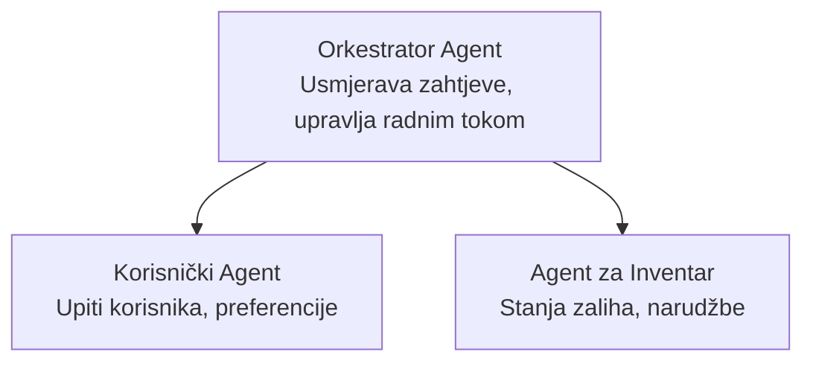

# Poglavlje 5: Višeagentna AI rješenja

**📚 Tečaj**: [AZD za početnike](../../README.md) | **⏱️ Trajanje**: 2-3 sata | **⭐ Kompleksnost**: Napredno

---

## Pregled

Ovo poglavlje pokriva napredne obrasce višeagentne arhitekture, orkestraciju agenata i AI implementacije spremne za proizvodnju za složene scenarije.

> Potvrđeno s `azd 1.25.6` u lipnju 2026.

## Ciljevi učenja

Nakon što završite ovo poglavlje, moći ćete:
- Razumjeti obrasce višeagentne arhitekture
- Implementirati koordinirane sustave AI agenata
- Provesti komunikaciju između agenata
- Izgraditi proizvodno spremna višeagentna rješenja

---

## 📚 Lekcije

| # | Lekcija | Opis | Vrijeme |
|---|---------|-------|---------|
| 1 | [Osnove više agenata](multi-agent-basics.md) | Praktično: implementirajte radnu višeagentnu aplikaciju s `azd up` | 45 min |
| 2 | [Obrasci koordinacije](../chapter-06-pre-deployment/coordination-patterns.md) | Strategije orkestracije agenata (nastavlja se u poglavlju 6) | 30 min |
| 3 | [Implementacija ARM predloška](../../examples/retail-multiagent-arm-template/README.md) | Primjer implementacije s jednim klikom | 30 min |

> **Počnite s lekcijom 1.** To je jedina potpuno praktična, implementabilna lekcija u ovom poglavlju. Lekcija 2 je u Poglavlju 6 (dijeli se s planiranjem prije implementacije), a [Višeagentno rješenje za maloprodaju](../../examples/retail-scenario.md) je arhitektonski nacrt — referenca za dizajn, ne šablona za jednim naredbom.

---

## 🚀 Brzi početak

```bash
# Opcija 1: Implementirajte iz predloška
azd init --template agent-openai-python-prompty
azd up

# Opcija 2: Implementirajte iz manifest agenta (zahtijeva azure.ai.agents ekstenziju)
azd extension install azure.ai.agents
azd ai agent init -m agent-manifest.yaml
azd up
```

> **Koji pristup koristiti?** Upotrijebite `azd init --template` da započnete od gotovog primjera. Upotrijebite `azd ai agent init` kada imate vlastiti manifest agenta. Pogledajte [AZD AI CLI referencu](../chapter-08-production/production-ai-practices.md#azd-ai-cli-commands-and-extensions) za potpune detalje.

---

## 🤖 Višeagentna arhitektura



---

## 🎯 Istaknuto rješenje: Višeagentno za maloprodaju

[Višeagentno rješenje za maloprodaju](../../examples/retail-scenario.md) demonstrira:

- **Agent za kupce**: rukuje interakcijama s korisnicima i njihovim preferencijama
- **Agent za inventar**: upravlja zalihama i obradom narudžbi
- **Orkestrator**: koordinira između agenata
- **Zajednička memorija**: upravljanje kontekstom između agenata

### Korištene usluge

| Usluga | Namjena |
|--------|---------|
| Microsoft Foundry modeli | Razumijevanje jezika |
| Azure AI Search | Katalog proizvoda |
| Cosmos DB | Stanje i memorija agenata |
| Container Apps | Hosting agenata |
| Application Insights | Nadgledanje |

---

## 🔗 Navigacija

| Smjer | Poglavlje |
|-------|-----------|
| **Prethodno** | [Poglavlje 4: Infrastruktura](../chapter-04-infrastructure/README.md) |
| **Sljedeće** | [Poglavlje 6: Priprema za implementaciju](../chapter-06-pre-deployment/README.md) |

---

## 📖 Povezani resursi

- [Vodič za AI agente](../chapter-02-ai-development/agents.md)
- [Prakse proizvodne AI](../chapter-08-production/production-ai-practices.md)
- [Rješavanje problema s AI](../chapter-07-troubleshooting/ai-troubleshooting.md)

---

<!-- CO-OP TRANSLATOR DISCLAIMER START -->
**Napomena**:
Ovaj dokument je preveden korištenjem AI prevoditeljskog servisa [Co-op Translator](https://github.com/Azure/co-op-translator). Iako težimo točnosti, imajte na umu da automatski prijevodi mogu sadržavati greške ili netočnosti. Izvorni dokument na izvornom jeziku treba smatrati autoritativnim izvorom. Za važne informacije preporuča se profesionalni ljudski prijevod. Nismo odgovorni za bilo kakva nesporazumevanja ili pogrešne interpretacije koje proizlaze iz korištenja ovog prijevoda.
<!-- CO-OP TRANSLATOR DISCLAIMER END -->