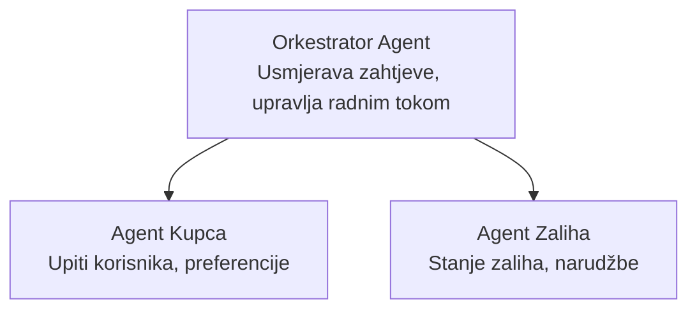

# Poglavlje 5: Višeagentska AI rješenja

**📚 Tečaj**: [AZD za početnike](../../README.md) | **⏱️ Trajanje**: 2-3 sata | **⭐ Kompleksnost**: Napredno

---

## Pregled

Ovo poglavlje pokriva napredne obrasce višeagentske arhitekture, orkestraciju agenata i AI implementacije spremne za produkciju u složenim scenarijima.

## Ciljevi učenja

Ovime ćete:
- Razumjeti obrasce višeagentske arhitekture
- Implementirati koordinirane AI sustave agenata
- Provesti komunikaciju između agenata
- Izgraditi produkcijski spremna višeagentska rješenja

---

## 📚 Lekcije

| # | Lekcija | Opis | Vrijeme |
|---|---------|-------|---------|
| 1 | [Višeagentsko rješenje za maloprodaju](../../examples/retail-scenario.md) | Potpuni vodič kroz implementaciju | 90 min |
| 2 | [Obrasci koordinacije](../chapter-06-pre-deployment/coordination-patterns.md) | Strategije orkestracije agenata | 30 min |
| 3 | [Implementacija ARM predloška](../../examples/retail-multiagent-arm-template/README.md) | Implementacija jednim klikom | 30 min |

---

## 🚀 Brzi početak

```bash
# Opcija 1: Implementiraj iz predloška
azd init --template agent-openai-python-prompty
azd up

# Opcija 2: Implementiraj iz agenta manifest (zahtijeva azure.ai.agents proširenje)
azd extension install azure.ai.agents
azd ai agent init -m agent-manifest.yaml
azd up
```

> **Koji pristup?** Koristite `azd init --template` za početak s radnim uzorkom. Koristite `azd ai agent init` kada imate vlastiti manifest agenta. Pogledajte [AZD AI CLI referencu](../chapter-08-production/production-ai-practices.md#azd-ai-cli-commands-and-extensions) za potpune detalje.

---

## 🤖 Višeagentska arhitektura


---

## 🎯 Predstavljeno rješenje: Višeagentska maloprodaja

[Rješenje za višeagente u maloprodaji](../../examples/retail-scenario.md) demonstrira:

- **Agent za korisnike**: Upravljanje korisničkom interakcijom i preferencijama
- **Agent za inventar**: Upravljanje zalihama i obradom narudžbi
- **Orkestrator**: Koordinacija između agenata
- **Zajednička memorija**: Upravljanje kontekstom između agenata

### Korištene usluge

| Usluga | Namjena |
|--------|----------|
| Microsoft Foundry modeli | Razumijevanje jezika |
| Azure AI pretraživanje | Katalog proizvoda |
| Cosmos DB | Stanje i memorija agenata |
| Container Apps | Hostanje agenata |
| Application Insights | Nadgledanje |

---

## 🔗 Navigacija

| Smjer | Poglavlje |
|--------|----------|
| **Prethodno** | [Poglavlje 4: Infrastruktura](../chapter-04-infrastructure/README.md) |
| **Sljedeće** | [Poglavlje 6: Pred implementaciju](../chapter-06-pre-deployment/README.md) |

---

## 📖 Povezani resursi

- [Vodič za AI agente](../chapter-02-ai-development/agents.md)
- [Prakse AI za produkciju](../chapter-08-production/production-ai-practices.md)
- [Rješavanje problema AI](../chapter-07-troubleshooting/ai-troubleshooting.md)

---

<!-- CO-OP TRANSLATOR DISCLAIMER START -->
**Odricanje od odgovornosti**:  
Ovaj dokument je preveden korištenjem AI usluge za prijevod [Co-op Translator](https://github.com/Azure/co-op-translator). Iako težimo točnosti, molimo imajte na umu da automatski prijevodi mogu sadržavati pogreške ili netočnosti. Izvorni dokument na izvornom jeziku smatra se ovlaštenim i službenim izvorom. Za kritične informacije preporučuje se profesionalni ljudski prijevod. Nismo odgovorni za bilo kakva nesporazume ili kriva tumačenja koja proizlaze iz korištenja ovog prijevoda.
<!-- CO-OP TRANSLATOR DISCLAIMER END -->