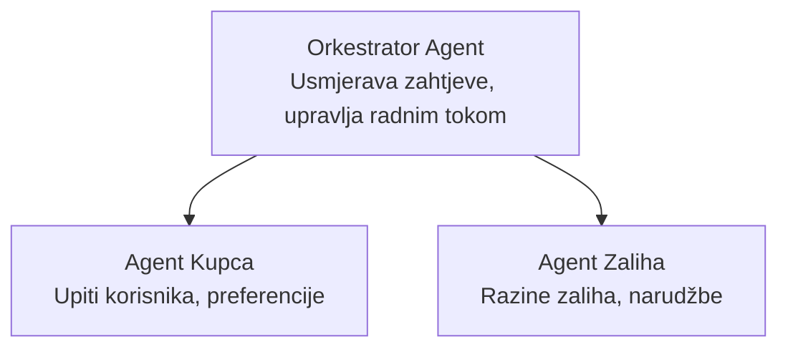

# Poglavlje 5: Višeagentna AI rješenja

**📚 Tečaj**: [AZD za početnike](../../README.md) | **⏱️ Trajanje**: 2-3 sata | **⭐ Složenost**: Napredno

---

## Pregled

Ovo poglavlje pokriva napredne obrasce arhitekture s više agenata, orkestraciju agenata i implementacije AI spremne za proizvodnju za složene scenarije.

> Validirano za `azd 1.27.1` u srpnju 2026.

## Ciljevi učenja

Završetkom ovog poglavlja ćete:
- Razumjeti obrasce arhitekture s više agenata
- Implementirati koordinirane AI sustave agenata
- Provesti komunikaciju agent-agent
- Izgraditi proizvodna višenagentna rješenja

---

## 📚 Lekcije

| # | Lekcija | Opis | Vrijeme |
|---|--------|-------------|------|
| 1 | [Osnove više agenata](multi-agent-basics.md) | Praktično: implementirajte funkcionalnu aplikaciju s više agenata s `azd up` | 45 min |
| 2 | [Obrasci koordinacije](../chapter-06-pre-deployment/coordination-patterns.md) | Strategije orkestracije agenata (nastavlja se u Poglavlju 6) | 30 min |
| 3 | [Implementacija ARM predloška](../../examples/retail-multiagent-arm-template/README.md) | Primjer implementacije jednim klikom | 30 min |

> **Započnite s Lekcijom 1.** To je jedina u potpunosti praktična, implementabilna lekcija u ovom poglavlju. Lekcija 2 je u Poglavlju 6 (zajednička s predplaniranjem implementacije), a [Višeagentno maloprodajno rješenje](../../examples/retail-scenario.md) je arhitektonski nacrt—dizajnerska referenca, a ne predložak jednim naredbom.

---

## 🚀 Brzi početak

```bash
# Opcija 1: Implementiraj iz predloška
azd init --template agent-openai-python-prompty
azd up

# Opcija 2: Implementiraj iz manifesta agenta (zahtijeva azure.ai.agents proširenje)
azd extension install azure.ai.agents
azd ai agent init -m agent-manifest.yaml
azd up
```

> **Koji pristup?** Koristite `azd init --template` za početak s funkcionalnim primjerom. Koristite `azd ai agent init` kada imate svoj manifest agenta. Pogledajte [AZD AI CLI referencu](../chapter-08-production/production-ai-practices.md#azd-ai-cli-commands-and-extensions) za potpune detalje.

---

## 🤖 Višeagentna arhitektura



---

## 🎯 Istaknuto rješenje: Višeagentna maloprodaja

[Višeagentno maloprodajno rješenje](../../examples/retail-scenario.md) prikazuje:

- **Agent kupca**: Upravljanje interakcijama korisnika i preferencijama
- **Agent zaliha**: Upravljanje skladištem i obradom narudžbi
- **Orkestrator**: Koordinira između agenata
- **Zajednička memorija**: Upravljanje kontekstom između agenata

### Korištene usluge

| Usluga | Svrha |
|---------|---------|
| Microsoft Foundry Models | Razumijevanje jezika |
| Azure AI Search | Katalog proizvoda |
| Cosmos DB | Stanje i memorija agenata |
| Container Apps | Hosting agenata |
| Application Insights | Praćenje |

---

## 🔗 Navigacija

| Smjer | Poglavlje |
|-----------|---------|
| **Prethodno** | [Poglavlje 4: Infrastruktura](../chapter-04-infrastructure/README.md) |
| **Sljedeće** | [Poglavlje 6: Predimplementacija](../chapter-06-pre-deployment/README.md) |

---

## 📖 Povezani resursi

- [Vodič za AI agente](../chapter-02-ai-development/agents.md)
- [Prakse AI u proizvodnji](../chapter-08-production/production-ai-practices.md)
- [Rješavanje problema s AI](../chapter-07-troubleshooting/ai-troubleshooting.md)

---

<!-- CO-OP TRANSLATOR DISCLAIMER START -->
**Napomena**:
Ovaj dokument je preveden korištenjem AI prevoditeljskog servisa [Co-op Translator](https://github.com/Azure/co-op-translator). Iako težimo točnosti, imajte na umu da automatski prijevodi mogu sadržavati greške ili netočnosti. Izvorni dokument na izvornom jeziku treba smatrati autoritativnim izvorom. Za važne informacije preporuča se profesionalni ljudski prijevod. Nismo odgovorni za bilo kakva nesporazumevanja ili pogrešne interpretacije koje proizlaze iz korištenja ovog prijevoda.
<!-- CO-OP TRANSLATOR DISCLAIMER END -->