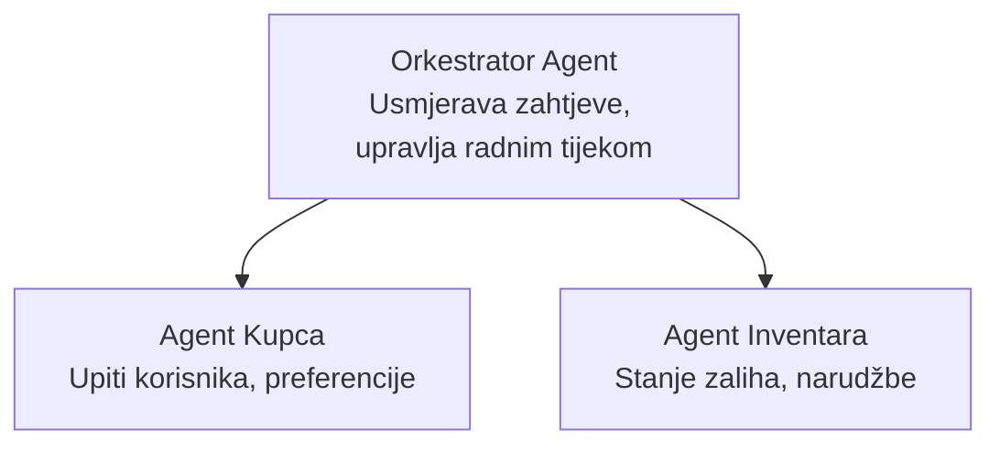

# Poglavlje 5: Višeagentska AI rješenja

**📚 Tečaj**: [AZD za početnike](../../README.md) | **⏱️ Trajanje**: 2-3 sata | **⭐ Složenost**: Napredno

---

## Pregled

Ovo poglavlje pokriva napredne obrasce višeagentske arhitekture, orkestraciju agenata i AI implementacije spremne za produkciju u složenim scenarijima.

> Potvrđeno uz `azd 1.23.12` u ožujku 2026.

## Ciljevi učenja

Dovršetkom ovog poglavlja ćete:
- Razumjeti obrasce višeagentske arhitekture
- Implementirati koordinirane sustave AI agenata
- Provesti komunikaciju agent-agent
- Izgraditi proizvodna višeagentska rješenja

---

## 📚 Lekcije

| # | Lekcija | Opis | Vrijeme |
|---|---------|------|---------|
| 1 | [Višeagentsko rješenje za maloprodaju](../../examples/retail-scenario.md) | Potpuni vodič za implementaciju | 90 min |
| 2 | [Obrasci koordinacije](../chapter-06-pre-deployment/coordination-patterns.md) | Strategije orkestracije agenata | 30 min |
| 3 | [Implementacija ARM predloška](../../examples/retail-multiagent-arm-template/README.md) | Implementacija jednim klikom | 30 min |

---

## 🚀 Brzi početak

```bash
# Opcija 1: Implementirajte iz predloška
azd init --template agent-openai-python-prompty
azd up

# Opcija 2: Implementirajte iz manifesta agenta (zahtijeva azure.ai.agents proširenje)
azd extension install azure.ai.agents
azd ai agent init -m agent-manifest.yaml
azd up
```

> **Koji pristup?** Koristite `azd init --template` za početak s radnim primjerom. Koristite `azd ai agent init` kad imate vlastiti manifest agenta. Pogledajte [AZD AI CLI referencu](../chapter-08-production/production-ai-practices.md#azd-ai-cli-commands-and-extensions) za potpune detalje.

---

## 🤖 Višeagentska arhitektura


---

## 🎯 Istaknuto rješenje: Višeagentsko maloprodajno rješenje

[Višeagentsko maloprodajno rješenje](../../examples/retail-scenario.md) demonstrira:

- **Agent za korisnike**: Rukuje interakcijama s korisnikom i preferencijama
- **Agent za zalihe**: Upravljanje zalihama i obradom narudžbi
- **Orkestrator**: Koordinira između agenata
- **Dijeljena memorija**: Upravljanje kontekstom među agentima

### Korištene usluge

| Usluga | Svrha |
|--------|-------|
| Microsoft Foundry modeli | Razumijevanje jezika |
| Azure AI Search | Katalog proizvoda |
| Cosmos DB | Stanje i memorija agenta |
| Container Apps | Hostiranje agenata |
| Application Insights | Praćenje |

---

## 🔗 Navigacija

| Smjer | Poglavlje |
|-------|-----------|
| **Prethodno** | [Poglavlje 4: Infrastruktura](../chapter-04-infrastructure/README.md) |
| **Sljedeće** | [Poglavlje 6: Prije implementacije](../chapter-06-pre-deployment/README.md) |

---

## 📖 Povezani resursi

- [Vodič za AI agente](../chapter-02-ai-development/agents.md)
- [AI prakse za produkciju](../chapter-08-production/production-ai-practices.md)
- [Rješavanje problema s AI](../chapter-07-troubleshooting/ai-troubleshooting.md)

---

<!-- CO-OP TRANSLATOR DISCLAIMER START -->
**Izjava o odricanju od odgovornosti**:  
Ovaj dokument je preveden pomoću AI prevoditeljskog servisa [Co-op Translator](https://github.com/Azure/co-op-translator). Iako nastojimo osigurati točnost, imajte na umu da automatski prijevodi mogu sadržavati pogreške ili netočnosti. Izvorni dokument na izvornom jeziku treba smatrati autoritativnim izvorom. Za važne informacije preporučuje se profesionalni ljudski prijevod. Ne snosimo odgovornost za bilo kakva nesporazuma ili pogrešna tumačenja koja proizlaze iz upotrebe ovog prijevoda.
<!-- CO-OP TRANSLATOR DISCLAIMER END -->