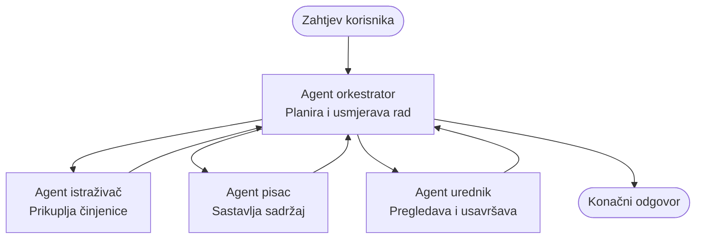

# Osnove višestrukih agenata - Postavite vaš prvi koordinirani AI sustav

**Navigacija poglavljem:**
- **📚 Početna stranica tečaja**: [AZD Za početnike](../../README.md)
- **📖 Trenutno poglavlje**: Poglavlje 5 - AI rješenja s više agenata
- **⬅️ Prethodno**: [Poglavlje 4: Infrastruktura](../chapter-04-infrastructure/README.md)
- **➡️ Sljedeće**: [Obrasci koordinacije](../chapter-06-pre-deployment/coordination-patterns.md)

> Validirano s `azd 1.27.1` u srpnju 2026.

## Uvod

U ranijim poglavljima ste postavili jednu aplikaciju—i u Poglavlju 2 ste postavili jednog AI agenta. Ova lekcija donosi sljedeći korak: postavljanje **sustava s više agenata**, gdje nekoliko specijaliziranih agenata surađuje kako bi riješilo problem koji nijedan pojedinačni agent sam ne bi mogao dobro riješiti.

Dobra vijest za početnike: **ne trebate nove naredbe.** Rješenje s više agenata još je uvijek azd projekt. Pokrenut ćete `azd init`, `azd up`, testirati i `azd down`—točno onaj tijek rada koji već znate. Ono što se mijenja je *oblik* aplikacije iznutra.

## Ciljevi učenja

Do kraja ove lekcije moći ćete:
- Razumjeti što znači "više agenata" i kada je vrijedno dodatne složenosti
- Prepoznati uobičajene uloge u sustavu s više agenata (orkestrator + specijalisti)
- Postaviti pravi, funkcionalni multi-agent predložak s `azd up`
- Razumjeti Azure resurse koji podržavaju multi-agent aplikaciju
- Znati kako sigurno provjeriti, prilagoditi i ukloniti rješenje

## Ishodi učenja

Nakon dovršetka ove lekcije moći ćete:
- Objasniti razliku između jednog agenta i sustava s više agenata
- Odabrati između jednog agenta s alatima i pravog multi-agent dizajna
- Postaviti i testirati multi-agent predložak od početka do kraja s azd
- Identificirati gdje svaki agent radi i kako komuniciraju
- Očistiti sve resurse kako biste izbjegli stalne troškove

---

## Što je sustav s više agenata?

Pojedinačni AI agent je jedan model s nizom uputa i (po želji) nekim alatima. To dobro funkcionira za fokusirane zadatke. Ali kako zadatak raste—istraživanje, zatim pisanje, zatim uređivanje, zatim provjera činjenica—stavljanje svega u jedan prompt čini agenta sporijim, manje pouzdanim i teže za otklanjanje pogrešaka.

**Sustav s više agenata** razbija posao na specijaliste koji svaki odrađuju jedan zadatak dobro, koordinirani od strane orkestratora:



### Dvije uloge koje ćete uvijek vidjeti

| Uloga | Zadatak | Primjer |
|------|--------|---------|
| **Orkestrator** | Odlučuje *što će se sljedeće dogoditi* i usmjerava posao između agenata | "Prvo istraži, zatim napiši, pa uređuj" |
| **Specijalist** | Obavlja jedan fokusirani posao i vraća rezultat | "Istraživač" koji samo prikuplja činjenice |

### Trebate li zapravo više agenata?

Počnite jednostavno. Dosegnite za multi-agent **samo** ako je istina jedna od ovih:

- ✅ Zadatak ima **jasne faze** koje koriste različite upute (istraživanje vs. pisanje vs. pregled)
- ✅ Želite da specijalisti rade **paralelno** radi uštede vremena
- ✅ Različiti koraci trebaju **različite alate ili izvore podataka**
- ✅ Trebate da svaki korak bude **neovisno testiran i moguće debugirati**

Ako je vaš zadatak jedinstveno pitanje i odgovor ili jednostavan poziv alata, **jedan agent s alatima** (Poglavlje 2) je jednostavniji, jeftiniji i lakši za upravljanje.

> **Savjet za početnike:** "Više agenata" nije nužno "bolje." Svaki agent dodaje latenciju, trošak i novo što treba pratiti. Dodajte agente samo kada se problem jasno dijeli na dijelove.

---

## Dva načina izgradnje multi-agenta na Azureu

| Pristup | Što je to | Najbolje za |
|---------|-----------|-------------|
| **Jedan agent + alati** | Jedan Foundry agent koji poziva funkcije/alatke | Jednostavni tijekovi rada, početak rada |
| **Više koordiniranih agenata** | Više agenata s orkestratorom | Jasne faze, paralelni rad, specijalizacija |

Ova lekcija se fokusira na drugi pristup koristeći **gotov predložak**, tako da možete vidjeti pravi multi-agent sustav u radu prije nego što izgradite svoj vlastiti.

---

## Praktično: Postavite funkcionalnu multi-agent aplikaciju

Postavit ćemo **Contoso Kreativni Pisac**, službeni Azure primjer koji koristi više agenata (istraživač, pisac, urednik) koordiniranih za proizvodnju članka. To je izvrstan prvi multi-agent appjer jer su uloge lako razumljive.

### Korak 1: Inicijalizirajte predložak

```bash
# Kreirajte radnu mapu
mkdir creative-writer && cd creative-writer

# Inicijalizirajte iz službenog višestrukog agentnog predloška
azd init --template contoso-creative-writer
```

> Uvijek pregledajte više multi-agent predložaka u [Awesome AZD AI galeriji](https://azure.github.io/awesome-azd/?tags=ai). Druge opcije prilagođene početnicima uključuju `get-started-with-ai-agents` i `azure-ai-travel-agents`.

### Korak 2: Autentifikacija

```bash
# Potrebno za azd radne tokove
azd auth login
```

### Korak 3: Izradite okruženje

```bash
azd env new dev
```

### Korak 4: Pregledajte, zatim postavite

```bash
# Pogledajte što će biti stvoreno prije nego što išta potrošite (preporučeno)
azd provision --preview

# Osigurajte infrastrukturu i rasporedite sve agente u jednom koraku
azd up
```

`azd up` će zatražiti pretplatu i regiju, zatim će osigurati Azure resurse i postaviti aplikaciju. AI implementacije mogu trajati duže od obične web aplikacije—ako postavljate veće modele, možete produžiti timeout implementacije:

```bash
azd deploy --timeout 1800
```

> **Upozorenje o troškovima i kapacitetu:** Multi-agent aplikacije postavljaju AI modele koji troše kvote i generiraju troškove. Ako `azd up` zakaže zbog kvote modela, pogledajte [AI rješavanje problema](../chapter-07-troubleshooting/ai-troubleshooting.md) za popravke regije i kvote, te Poglavlje 6 [Planiranje kapaciteta](../chapter-06-pre-deployment/capacity-planning.md).

---

## Razumijevanje što ste postavili

Tipična multi-agent aplikacija poput ove osigurava skup Azure resursa koji se izravno podudaraju s odgovornostima na gornjem dijagramu:

| Resurs | Zašto postoji |
|--------|--------------|
| **Microsoft Foundry / modeli** | Domaćin je jezičnih modela koje svaki agent koristi |
| **Azure AI Pretraživanje** | Daje istraživaču podatke na koje se može osloniti |
| **Container Apps** (ili App Service) | Domaćin je orkestrator i kôd agenata |
| **Cosmos DB** (u nekim primjerima) | Pohranjuje zajedničko stanje/memoriju koja se prenosi među agentima |
| **Application Insights** | Prati zahtjeve *preko* agenata kako biste mogli debugirati tijek |

### Kako agenti komuniciraju međusobno

U većini azd multi-agent primjera, **orkestrator radi u vašem aplikacijskom kodu** (na primjer, koristeći okvir poput Semantic Kernel ili Microsoft Agent Framework). Orkestrator poziva jednog po jednog specijaliziranog agenta, prenosi rezultate i sastavlja konačni odgovor. Agenti dijele kontekst putem:

- **Pozivi funkcija/alata** — orkestrator pokreće specijalistu i prima rezultat natrag
- **Zajednička memorija** — baza podataka (često Cosmos DB) drži stanje koje oba agenta mogu čitati
- **Poruke/događaji** — za labavu koheziju, agenti komuniciraju putem reda ili Service Bus-a

> **Zašto je ovo važno za debugiranje:** jer je svaki korak zaseban, Application Insights vam pokazuje *koji* agent je bio spor ili nije uspio. To je glavni razlog zašto uopće dijeliti posao među agentima.

---

## Provjerite implementaciju

Potvrdite da sustav stvarno radi prije nego nastavite:

```bash
# Prikaži postavljene krajnje točke
azd show

# Otvori nadzornu ploču za praćenje aplikacije
azd monitor

# Prati zapise ako nešto izgleda neispravno
azd monitor --logs
```

Zatim otvorite URL aplikacije iz `azd show` i isprobajte zahtjev koji aktivira sve agente (za Kreativnog Pisca zamolite da napiše kratki članak na neku temu). U pretraživanju transakcija Application Insights trebali biste vidjeti da se zahtjev raspodijelio kroz korake istraživača, pisca i urednika.

**Kriteriji uspjeha:**
- ✅ `azd show` prikazuje dostupnu krajnju točku
- ✅ Zahtjev proizvodi rezultat koji je očito prošao kroz više faza
- ✅ Application Insights pokazuje tragove za više koraka agenata

---

## Prilagodba: Dodajte ili prilagodite agenta

Budući da je svaki agent samo upute plus alati, prilagođavanje je pristupačno:

1. **Pronađite definicije agenata** u predlošku (često u mapama `prompts/`, `agents/` ili skup datoteka `*.prompty`).
2. **Podesite upute agenta** — na primjer, recite uređivačkom agentu da primjenjuje određeni ton ili broj riječi.
3. **Ponovno postavite samo kôd** (infrastruktura ostaje nepromijenjena):

   ```bash
   azd deploy
   ```

Za dalje i za izgradnju agenata iz *vlastitog* manifesta koristite proširenje za agente i njihov puni životni ciklus:

```bash
azd extension install azure.ai.agents
azd ai agent init -m agent-manifest.yaml
azd up
azd ai agent invoke      # test, s vremenskim odzivom
```

Pogledajte [Poglavlje 2: Agenti](../chapter-02-ai-development/agents.md) i [AZD AI CLI referencu](../chapter-08-production/production-ai-practices.md#azd-ai-cli-commands-and-extensions) za kompletan životni ciklus agenata (`invoke`, `eval generate`, `optimize`, `delete`).

---

## Čišćenje

Multi-agent aplikacije pokreću više naplatnih usluga. Uklonite sve čim završite:

```bash
azd down --force --purge
```

Zastavica `--purge` također uklanja soft-deleted AI resurse (kao račune Foundry/Azure AI usluga) kako ne bi blokirali buduće postavljanje ili stvarali dodatne troškove.

---

## Napomena o proizvodnim multi-agent sustavima

[Retail Multi-Agent Solution](../../examples/retail-scenario.md) u ovom repozitoriju je **arhitektonski plan**, ne predložak s jednim klikom—dokumentira kako bi se proizvodni maloprodajni sustav *izgradio* (i jasno navodi da je potpuna izgradnja značajan napor). Koristite ga kao referencu dizajna *nakon* što ste postavili funkcionalni primjer ovdje. Za proizvodne aspekte (otpornost, troškove, praćenje, upravljanje) nastavite na [Poglavlje 8: Proizvodne AI prakse](../chapter-08-production/production-ai-practices.md).

---

## Sažetak

- Sustav s više agenata dijeli posao među specijalistima koje koordinira orkestrator.
- Koristite ga samo kad zadatak ima jasne faze, paralelizam ili različite alate po koraku—inače prednost dajte jednom agentu.
- Azd workflow ostaje isti: `azd init` → `azd up` → test → `azd down`.
- Pravi predložak poput `contoso-creative-writer` omogućava vam danas vidjeti i prilagoditi funkcionalnu multi-agent aplikaciju.
- Application Insights praćenje preko agenata jedan je od najvećih praktičnih benefita multi-agent dizajna.

---

## 🔗 Navigacija

| Smjer | Lekcija |
|-------|---------|
| **Prethodno** | [Poglavlje 4: Infrastruktura](../chapter-04-infrastructure/README.md) |
| **Sljedeće** | [Obrasci koordinacije](../chapter-06-pre-deployment/coordination-patterns.md) |

## 📖 Povezani resursi

- [Vodič za AI agente](../chapter-02-ai-development/agents.md)
- [Obrasci koordinacije](../chapter-06-pre-deployment/coordination-patterns.md)
- [Proizvodne AI prakse](../chapter-08-production/production-ai-practices.md)
- [Rješavanje problema s AI](../chapter-07-troubleshooting/ai-troubleshooting.md)

---

<!-- CO-OP TRANSLATOR DISCLAIMER START -->
**Napomena**:
Ovaj dokument je preveden korištenjem AI prevoditeljskog servisa [Co-op Translator](https://github.com/Azure/co-op-translator). Iako težimo točnosti, imajte na umu da automatski prijevodi mogu sadržavati greške ili netočnosti. Izvorni dokument na izvornom jeziku treba smatrati autoritativnim izvorom. Za važne informacije preporuča se profesionalni ljudski prijevod. Nismo odgovorni za bilo kakva nesporazumevanja ili pogrešne interpretacije koje proizlaze iz korištenja ovog prijevoda.
<!-- CO-OP TRANSLATOR DISCLAIMER END -->