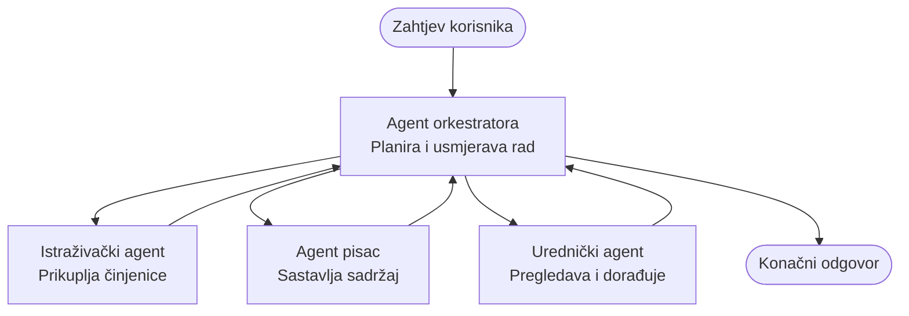

# Osnove više-agentskih sustava - Implementirajte svoj prvi koordinirani AI sustav

**Navigacija poglavljima:**
- **📚 Početna stranica tečaja**: [AZD za početnike](../../README.md)
- **📖 Trenutno poglavlje**: Poglavlje 5 - Više-agentska AI rješenja
- **⬅️ Prethodno**: [Poglavlje 4: Infrastruktura](../chapter-04-infrastructure/README.md)
- **➡️ Sljedeće**: [Obrasci koordinacije](../chapter-06-pre-deployment/coordination-patterns.md)

> Potvrđeno za `azd 1.25.6` u lipnju 2026.

## Uvod

U ranijim poglavljima ste implementirali jednu aplikaciju — i u Poglavlju 2 ste implementirali jednog AI agenta. Ova lekcija ide korak dalje: implementira **više-agentski sustav**, gdje nekoliko specijaliziranih agenata surađuje kako bi riješilo problem koji jedan agent ne bi mogao dobro riješiti sam.

Dobra vijest za početnike: **ne trebate nove naredbe.** Više-agentsko rješenje i dalje je azd projekt. Radit ćete `azd init`, `azd up`, testirati i `azd down` — točno onaj tijek rada koji već znate. Ono što se mijenja je *oblik* aplikacije iznutra.

## Ciljevi učenja

Na kraju ove lekcije ćete:
- Razumjeti što znači "više-agentski" i kada vrijedi dodatna složenost
- Prepoznati uobičajene uloge u više-agentskom sustavu (orchestrator + specijalisti)
- Implementirati pravu, radnu multi-agent predložak s `azd up`
- Razumjeti Azure resurse koji podupiru više-agentsku aplikaciju
- Znati kako provjeriti, prilagoditi i sigurno ukloniti rješenje

## Ishodi učenja

Nakon dovršetka ove lekcije moći ćete:
- Objasniti razliku između jednog agenta i više-agentskog sustava
- Odabrati između jednog agenta s alatima i pravog više-agentskog dizajna
- Implementirati i testirati multi-agent predložak od kraja do kraja pomoću azd
- Identificirati gdje svaki agent radi i kako komuniciraju
- Očistiti sve resurse kako biste izbjegli trajne troškove

---

## Što je više-agentski sustav?

Jedan AI agent je jedan model s nizom uputa i (po želji) nekim alatima. To dobro funkcionira za fokusirane zadatke. Ali kako zadatak raste — istraživanje, zatim pisanje, zatim uređivanje, zatim provjera činjenica — stavljanje svega u jedan prompt čini agenta sporijim, manje pouzdanim i težim za otklanjanje pogrešaka.

Više-agentski sustav razbija posao na specijaliste koji svaki rade jedan posao dobro, koordinirani od strane orchestratora:



### Dvije uloge koje ćete uvijek vidjeti

| Role | Job | Example |
|------|-----|---------|
| **Orchestrator** | Odlučuje *što se događa sljedeće* i usmjerava posao između agenata | "Prvo istraživanje, zatim pisanje, pa uređivanje" |
| **Specialist** | Obavlja jedan fokusiran posao i vraća rezultat | "istraživač" koji samo prikuplja činjenice |

### Trebate li zapravo više agenata?

Počnite jednostavno. S težite prema više-agentskom pristupu **samo** kada je jedno od sljedećeg točno:

- ✅ Zadatak ima **različite faze** koje imaju koristi od različitih uputa (istraživanje nasuprot pisanju nasuprot recenziji)
- ✅ Želite da se specijalisti izvršavaju **paralelno** kako biste uštedjeli vrijeme
- ✅ Različiti koraci trebaju **različite alate ili izvore podataka**
- ✅ Trebate da svaki korak bude **neovisno testabilan i za otklanjanje pogrešaka**

Ako je vaš zadatak jedno pitanje-i-odgovor ili jednostavan poziv alata, **jedan agent s alatima** (Poglavlje 2) je jednostavniji, jeftiniji i lakše ga je upravljati.

> **Savjet za početnike:** "Više agenata" ne znači "bolje." Svaki agent dodaje latenciju, trošak i novu stvar za nadzor. Dodajte agente samo kada se problem jasno podijeli na dijelove.

---

## Dva načina izgradnje više-agentskog sustava na Azureu

| Approach | What it is | Best for |
|----------|-----------|----------|
| **Single agent + tools** | One Foundry agent that calls functions/tools | Simple workflows, getting started |
| **Multiple coordinated agents** | Several agents with an orchestrator | Distinct stages, parallel work, specialization |

Ova lekcija se fokusira na drugi pristup koristeći **predložak spreman za korištenje**, tako da možete vidjeti pravi više-agentski sustav u radu prije nego što izgradite vlastiti.

---

## Praktično: Implementirajte radnu više-agentsku aplikaciju

Implementirat ćemo **Contoso Creative Writer**, službeni Azure uzorak koji koristi više agenata (istraživač, pisac, urednik) koordiniranih kako bi proizveli članak. To je izvrstan prvi više-agentski projekt jer su uloge lako razumljive.

### Korak 1: Inicijalizirajte predložak

```bash
# Kreirajte radnu mapu
mkdir creative-writer && cd creative-writer

# Inicijalizirajte iz službenog predloška za više agenata
azd init --template contoso-creative-writer
```

> Pregledajte više multi-agent predložaka u bilo kojem trenutku u [Awesome AZD AI galeriji](https://azure.github.io/awesome-azd/?tags=ai). Druge opcije prilagođene početnicima uključuju `get-started-with-ai-agents` i `azure-ai-travel-agents`.

### Korak 2: Autentifikacija

```bash
# Potrebno za azd radne tokove
azd auth login
```

### Korak 3: Stvorite okruženje

```bash
azd env new dev
```

### Korak 4: Pregledajte, zatim implementirajte

```bash
# Pogledajte što će biti stvoreno prije nego što išta potrošite (preporučeno)
azd provision --preview

# Postavite infrastrukturu i rasporedite sve agente u jednom koraku
azd up
```

`azd up` će tražiti pretplatu i regiju, zatim provisionirati Azure resurse i implementirati aplikaciju. AI implementacije mogu potrajati dulje od jednostavne web aplikacije — ako implementirate veće modele, možete produžiti timeout implementacije:

```bash
azd deploy --timeout 1800
```

> **Upozorenje o troškovima i kapacitetu:** Više-agentske aplikacije implementiraju AI modele koji troše kvotu i stvaraju troškove. Ako `azd up` ne uspije zbog kvote za modele, pogledajte [AI Troubleshooting](../chapter-07-troubleshooting/ai-troubleshooting.md) za popravke regije i kvota, i Poglavlje 6 [Planiranje kapaciteta](../chapter-06-pre-deployment/capacity-planning.md).

---

## Razumijevanje onoga što ste implementirali

Tipična više-agentska aplikacija poput ove provisionira skup Azure resursa koji se izravno mapiraju na odgovornosti u gornjem dijagramu:

| Resource | Why it's there |
|----------|----------------|
| **Microsoft Foundry / Models** | Domaćin je jezičnih modela koje svaki agent koristi |
| **Azure AI Search** | Daje istraživačkom agentu utemeljene podatke za pretraživanje |
| **Container Apps** (or App Service) | Domaćin je orchestratora i koda agenata |
| **Cosmos DB** (u nekim uzorcima) | Pohranjuje zajedničko stanje/pamćenje koje se prenosi između agenata |
| **Application Insights** | Prati zahtjeve *preko* agenata kako biste mogli otkloniti pogreške u tijeku |

### Kako agenti međusobno komuniciraju

U većini azd multi-agent uzoraka, **orchestrator se izvršava u vašem aplikacijskom kodu** (na primjer, koristeći okvir poput Semantic Kernel ili Microsoft Agent Framework). Orchestrator poziva svakog specijalističkog agenta redom, prosljeđuje rezultate i sastavlja konačan odgovor. Agenti dijele kontekst putem:

- **Poziva funkcija/alata** — orchestrator poziva specijalistu i vraća rezultat
- **Zajedničke memorije** — baza podataka (često Cosmos DB) drži stanje koje oba agenta mogu čitati
- **Poruka/događaja** — za rjeđe povezivanje, agenti komuniciraju putem reda ili Service Bus-a

> **Zašto je ovo važno za otklanjanje pogrešaka:** budući da je svaki korak zaseban, Application Insights vam pokazuje *koji* je agent bio spor ili nije uspio. To je glavni razlog zašto podijeliti posao među agentima.

---

## Provjerite implementaciju

Potvrdite da sustav stvarno radi prije nego nastavite:

```bash
# Prikaži postavljene krajnje točke
azd show

# Otvori nadzornu ploču za praćenje aplikacije
azd monitor

# Prati logove ako nešto ne izgleda u redu
azd monitor --logs
```

Zatim otvorite URL aplikacije iz `azd show` i isprobajte zahtjev koji aktivira sve agente (za Creative Writer, zatražite da napiše kratak članak o nekoj temi). U Application Insights **transaction search**, trebali biste vidjeti kako se zahtjev razgranava preko koraka istraživača, pisca i urednika.

**Kriteriji uspjeha:**
- ✅ `azd show` navodi dostupnu krajnju točku
- ✅ Zahtjev proizvodi rezultat koji jasno prolazi kroz više faza
- ✅ Application Insights pokazuje tragove za više od jednog koraka agenta

---

## Prilagodba: Dodajte ili prilagodite agenta

Budući da je svaki agent samo upute plus alati, prilagodba je pristupačna:

1. **Pronađite definicije agenata** u predlošku (često skup datoteka `prompts/`, `agents/` ili `*.prompty`).
2. **Podesite upute agenta** — na primjer, recite uredničkom agentu da provodi određeni ton ili broj riječi.
3. **Ponovo implementirajte samo kod** (infrastruktura ostaje nepromijenjena):

   ```bash
   azd deploy
   ```

Za daljnji razvoj i izradu agenata iz vlastitog manifesta, koristite agent ekstenziju i njen puni životni ciklus:

```bash
azd extension install azure.ai.agents
azd ai agent init -m agent-manifest.yaml
azd up
azd ai agent invoke      # test, s vremenom odziva
```

Pogledajte [Poglavlje 2: Agenti](../chapter-02-ai-development/agents.md) i [AZD AI CLI referencu](../chapter-08-production/production-ai-practices.md#azd-ai-cli-commands-and-extensions) za potpuni životni ciklus agenata (`invoke`, `eval generate`, `optimize`, `delete`).

---

## Očistite resurse

Više-agentske aplikacije pokreću više naplatnih servisa. Uklonite sve kada završite:

```bash
azd down --force --purge
```

Zastavica `--purge` također uklanja soft-deleteane AI resurse (poput Foundry/Azure AI Services računa) kako ne bi blokirali buduću ponovnu implementaciju ili nastavili stvarati troškove.

---

## Napomena o produkcijskim više-agentskim sustavima

[Retail Multi-Agent Solution](../../examples/retail-scenario.md) u ovom repozitoriju je **arhitekturni nacrt**, a ne predložak jednim naredbom — dokumentira kako bi se produkcijski retail sustav *mogao* izgraditi (i jasno naznačuje da je potpuna izgradnja opsežan pothvat). Koristite ga kao referencu za dizajn *nakon* što ste implementirali radni primjer ovdje. Za produkcijska pitanja (otpornost, troškovi, nadzor, upravljanje), nastavite na [Poglavlje 8: Prakse AI u produkciji](../chapter-08-production/production-ai-practices.md).

---

## Sažetak

- Više-agentski sustav dijeli posao među specijalistima koje koordinira orchestrator.
- Koristite ga samo kada zadatak ima različite faze, paralelizam ili različite alate po koraku — inače preferirajte jednog agenta.
- Azd tijek rada se ne mijenja: `azd init` → `azd up` → test → `azd down`.
- Pravi predložak poput `contoso-creative-writer` omogućuje vam da danas vidite i prilagodite radnu više-agentsku aplikaciju.
- Tracing u Application Insights preko agenata je jedna od najvećih praktičnih prednosti više-agentskog dizajna.

---

## 🔗 Navigacija

| Smjer | Lekcija |
|-----------|--------|
| **Prethodno** | [Poglavlje 4: Infrastruktura](../chapter-04-infrastructure/README.md) |
| **Sljedeće** | [Obrasci koordinacije](../chapter-06-pre-deployment/coordination-patterns.md) |

## 📖 Povezani resursi

- [Vodič za AI agente](../chapter-02-ai-development/agents.md)
- [Obrasci koordinacije](../chapter-06-pre-deployment/coordination-patterns.md)
- [Prakse AI u produkciji](../chapter-08-production/production-ai-practices.md)
- [Rješavanje problema s AI](../chapter-07-troubleshooting/ai-troubleshooting.md)

---

<!-- CO-OP TRANSLATOR DISCLAIMER START -->
**Napomena**:
Ovaj dokument je preveden korištenjem AI prevoditeljskog servisa [Co-op Translator](https://github.com/Azure/co-op-translator). Iako težimo točnosti, imajte na umu da automatski prijevodi mogu sadržavati greške ili netočnosti. Izvorni dokument na izvornom jeziku treba smatrati autoritativnim izvorom. Za važne informacije preporuča se profesionalni ljudski prijevod. Nismo odgovorni za bilo kakva nesporazumevanja ili pogrešne interpretacije koje proizlaze iz korištenja ovog prijevoda.
<!-- CO-OP TRANSLATOR DISCLAIMER END -->