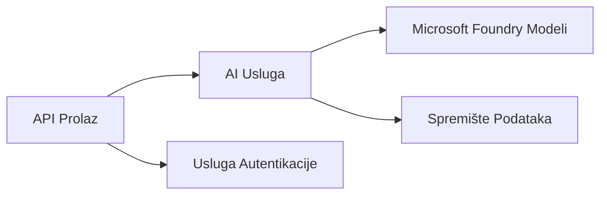
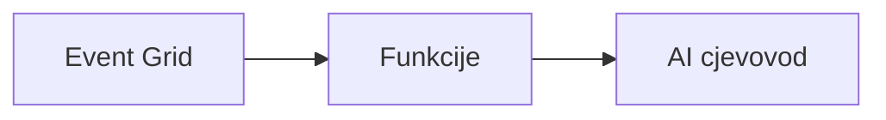

# Poglavlje 8: Proizvodni i Enterprise Obrasci

**📚 Tečaj**: [AZD za početnike](../../README.md) | **⏱️ Trajanje**: 2-3 sata | **⭐ Kompleksnost**: Napredno

---

## Pregled

Ovo poglavlje pokriva obrasce za implementaciju spremnu za tvrtke, pojačavanje sigurnosti, nadzor i optimizaciju troškova za produkcijske AI radne opterećenja.

> Validirano na `azd 1.25.6` u lipnju 2026.

## Ciljevi učenja

Kroz završetak ovog poglavlja, naučit ćete:
- Implementirati višeregionalne otpornosti aplikacije
- Provesti sigurnosne obrasce za poduzeća
- Konfigurirati sveobuhvatan nadzor
- Optimizirati troškove u velikim razmjerima
- Postaviti CI/CD pipeline s AZD-om

---

## 📚 Lekcije

| # | Lekcija | Opis | Vrijeme |
|---|---------|--------|--------|
| 1 | [Proizvodne AI prakse](production-ai-practices.md) | Obrasci implementacije za tvrtke | 90 min |

---

## 🚀 Kontrolni popis za proizvodnju

- [ ] Višeregionalna implementacija za otpornost
- [ ] Upravljani identitet za autentifikaciju (bez ključeva)
- [ ] Application Insights za nadzor
- [ ] Konfigurirani proračuni i upozorenja za troškove
- [ ] Omogućen sigurnosni skeniranje
- [ ] Integracija CI/CD pipelinea
- [ ] Plan za oporavak od katastrofa

---

## 🏗️ Obrasci arhitekture

### Obrazac 1: Microservices AI



### Obrazac 2: Event-Driven AI



---

## 🔐 Najbolje sigurnosne prakse

```bicep
// Use managed identity
identity: {
  type: 'SystemAssigned'
}

// Private endpoints for AI services
properties: {
  publicNetworkAccess: 'Disabled'
  networkAcls: {
    defaultAction: 'Deny'
  }
}
```

---

## 💰 Optimizacija troškova

| Strategija | Ušteda |
|------------|---------|
| Skaliranje na nulu (Container Apps) | 60-80% |
| Korištenje potrošačkih razina za razvoj | 50-70% |
| Zakazano skaliranje | 30-50% |
| Rezervirani kapacitet | 20-40% |

```bash
# Postavi obavijesti o proračunu
az consumption budget create \
  --budget-name "AI-Budget" \
  --amount 500 \
  --category Cost \
  --time-grain Monthly
```

---

## 📊 Postavljanje nadzora

```bash
# Strujanje zapisa
azd monitor --logs

# Provjerite Application Insights
azd monitor --overview

# Prikaži metrike
az monitor metrics list --resource <resource-id>
```

---

## 🔗 Navigacija

| Smjer | Poglavlje |
|--------|-----------|
| **Prethodno** | [Poglavlje 7: Otklanjanje poteškoća](../chapter-07-troubleshooting/README.md) |
| **Završetak tečaja** | [Početna stranica tečaja](../../README.md) |

---

## 📖 Povezani izvori

- [Vodič za AI agente](../chapter-02-ai-development/agents.md)
- [Application Insights](../chapter-06-pre-deployment/application-insights.md)
- [Višestruka rješenja agenata](../chapter-05-multi-agent/README.md)
- [Primjer mikroservisa](../../examples/microservices/README.md)

---

<!-- CO-OP TRANSLATOR DISCLAIMER START -->
**Napomena**:
Ovaj dokument je preveden korištenjem AI prevoditeljskog servisa [Co-op Translator](https://github.com/Azure/co-op-translator). Iako težimo točnosti, imajte na umu da automatski prijevodi mogu sadržavati greške ili netočnosti. Izvorni dokument na izvornom jeziku treba smatrati autoritativnim izvorom. Za važne informacije preporuča se profesionalni ljudski prijevod. Nismo odgovorni za bilo kakva nesporazumevanja ili pogrešne interpretacije koje proizlaze iz korištenja ovog prijevoda.
<!-- CO-OP TRANSLATOR DISCLAIMER END -->