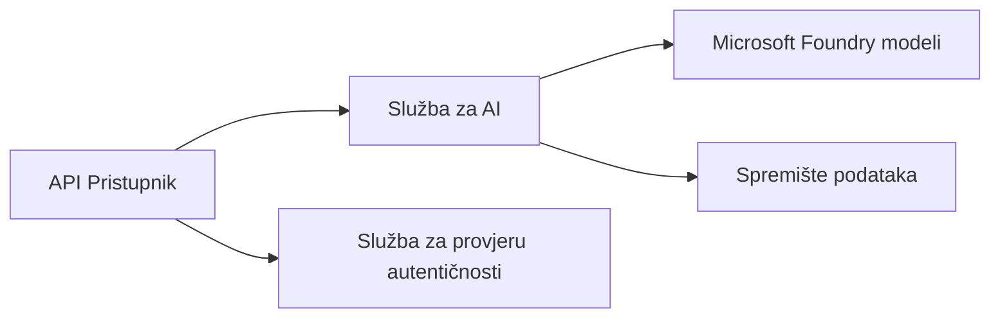
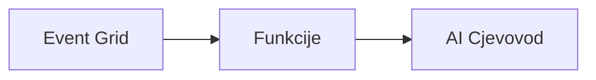

# Poglavlje 8: Obrasci za produkciju i poduzeća

**📚 Tečaj**: [AZD za početnike](../../README.md) | **⏱️ Trajanje**: 2-3 sata | **⭐ Složenost**: Napredno

---

## Pregled

Ovo poglavlje pokriva obrasce implementacije prikladne za poduzeća, učvršćivanje sigurnosti, nadzor i optimizaciju troškova za produkcijske AI radne opterećenja.

## Ciljevi učenja

Nakon završetka ovog poglavlja, moći ćete:
- Implementirati višeregionalne aplikacije otpornosti
- Primijeniti sigurnosne obrasce za poduzeća
- Konfigurirati sveobuhvatan nadzor
- Optimizirati troškove u velikoj razini
- Postaviti CI/CD tokove rada s AZD-om

---

## 📚 Lekcije

| # | Lekcija | Opis | Vrijeme |
|---|---------|------|---------|
| 1 | [Produkcijske AI prakse](production-ai-practices.md) | Obrasci implementacije za poduzeća | 90 min |

---

## 🚀 Provjera za produkciju

- [ ] Višeregionalna implementacija za otpornost
- [ ] Upravljani identitet za autentifikaciju (bez ključeva)
- [ ] Application Insights za nadzor
- [ ] Postavljeni proračuni i upozorenja o troškovima
- [ ] Omogućen sigurnosni skeniranje
- [ ] Integracija CI/CD toka rada
- [ ] Plan za oporavak od katastrofe

---

## 🏗️ Arhitektonski obrasci

### Obrazac 1: Microservices AI


### Obrazac 2: Event-Driven AI


---

## 🔐 Najbolje sigurnosne prakse

```bicep
// Use managed identity
identity: {
  type: 'SystemAssigned'
}

// Private endpoints for AI services
properties: {
  publicNetworkAccess: 'Disabled'
  networkAcls: {
    defaultAction: 'Deny'
  }
}
```

---

## 💰 Optimizacija troškova

| Strategija | Uštede |
|------------|---------|
| Skala na nulu (Container Apps) | 60-80% |
| Korištenje potrošačkih razina za razvoj | 50-70% |
| Raspoređeno skaliranje | 30-50% |
| Rezervirani kapacitet | 20-40% |

```bash
# Postavi upozorenja za proračun
az consumption budget create \
  --budget-name "AI-Budget" \
  --amount 500 \
  --category Cost \
  --time-grain Monthly
```

---

## 📊 Postavljanje nadzora

```bash
# Prijenos dnevnika
azd monitor --logs

# Provjeri Application Insights
azd monitor

# Prikaži metrike
az monitor metrics list --resource <resource-id>
```

---

## 🔗 Navigacija

| Smjer | Poglavlje |
|--------|----------|
| **Prethodno** | [Poglavlje 7: Rješavanje problema](../chapter-07-troubleshooting/README.md) |
| **Završetak tečaja** | [Početna stranica tečaja](../../README.md) |

---

## 📖 Povezani resursi

- [Vodič za AI agente](../chapter-02-ai-development/agents.md)
- [Application Insights](../chapter-06-pre-deployment/application-insights.md)
- [Višeagentska rješenja](../chapter-05-multi-agent/README.md)
- [Primjer mikroservisa](../../examples/microservices/README.md)

---

<!-- CO-OP TRANSLATOR DISCLAIMER START -->
**Izjava o odricanju odgovornosti**:  
Ovaj je dokument preveden korištenjem AI prevoditeljske usluge [Co-op Translator](https://github.com/Azure/co-op-translator). Iako nastojimo postići točnost, imajte na umu da automatski prijevodi mogu sadržavati pogreške ili netočnosti. Izvorni dokument na izvornom jeziku treba smatrati autoritativnim izvorom. Za važne informacije preporučuje se profesionalni ljudski prijevod. Ne snosimo odgovornost za bilo kakva nesporazume ili kriva tumačenja koja proizađu iz korištenja ovog prijevoda.
<!-- CO-OP TRANSLATOR DISCLAIMER END -->