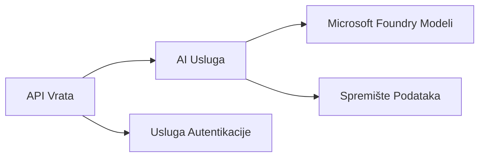

# Poglavlje 8: Obrasci za proizvodnju i poduzeća

**📚 Tečaj**: [AZD Za početnike](../../README.md) | **⏱️ Trajanje**: 2-3 sata | **⭐ Složenost**: Napredno

---

## Pregled

Ovo poglavlje pokriva obrasce za implementaciju spremne za poduzeća, jačanje sigurnosti, nadzor i optimizaciju troškova za proizvodne AI radne zadatke.

> Validirano s `azd 1.27.1` u srpnju 2026.

## Ciljevi učenja

Završetkom ovog poglavlja ćete:
- Implementirati višeregionalne aplikacije otporne na kvarove
- Provesti sigurnosne obrasce za poduzeća
- Konfigurirati sveobuhvatni nadzor
- Optimizirati troškove u velikom obujmu
- Postaviti CI/CD pipelineove s AZD-om

---

## 📚 Lekcije

| # | Lekcija | Opis | Vrijeme |
|---|--------|-------------|------|
| 1 | [Proizvodne AI prakse](production-ai-practices.md) | Obrasci implementacije za poduzeća | 90 min |

---

## 🚀 Kontrolna lista za proizvodnju

- [ ] Višeregionalna implementacija za otpornost
- [ ] Upravljani identitet za autentifikaciju (bez ključeva)
- [ ] Application Insights za nadzor
- [ ] Postavljeni budžeti i upozorenja za troškove
- [ ] Omogućeno sigurnosno skeniranje
- [ ] Integracija CI/CD pipelinea
- [ ] Plan oporavka od katastrofe

---

## 🏗️ Obrasci arhitekture

### Obrazac 1: Mikroservisi AI



### Obrazac 2: AI upravljan događajima


---

## 🔐 Najbolje sigurnosne prakse

```bicep
// Use managed identity
identity: {
  type: 'SystemAssigned'
}

// Private endpoints for AI services
properties: {
  publicNetworkAccess: 'Disabled'
  networkAcls: {
    defaultAction: 'Deny'
  }
}
```

---

## 💰 Optimizacija troškova

| Strategija | Ušteda |
|----------|---------|
| Skaliranje do nule (Container Apps) | 60-80% |
| Korištenje potrošačkih slojeva za razvoj | 50-70% |
| Raspoređeno skaliranje | 30-50% |
| Rezervirani kapacitet | 20-40% |

```bash
# Postavi upozorenja za proračun
az consumption budget create \
  --budget-name "AI-Budget" \
  --amount 500 \
  --category Cost \
  --time-grain Monthly
```

---

## 📊 Postavljanje nadzora

```bash
# Streamajte dnevnike
azd monitor --logs

# Provjerite Application Insights
azd monitor --overview

# Pogledajte metrike
az monitor metrics list --resource <resource-id>
```

---

## 🔗 Navigacija

| Smjer | Poglavlje |
|-----------|---------|
| **Prethodno** | [Poglavlje 7: Rješavanje problema](../chapter-07-troubleshooting/README.md) |
| **Tečaj završen** | [Početna stranica tečaja](../../README.md) |

---

## 📖 Povezani izvori

- [Vodič za AI agente](../chapter-02-ai-development/agents.md)
- [Application Insights](../chapter-06-pre-deployment/application-insights.md)
- [Rješenja s više agenata](../chapter-05-multi-agent/README.md)
- [Primjer mikroservisa](../../examples/microservices/README.md)

---

<!-- CO-OP TRANSLATOR DISCLAIMER START -->
**Napomena**:
Ovaj dokument je preveden korištenjem AI prevoditeljskog servisa [Co-op Translator](https://github.com/Azure/co-op-translator). Iako težimo točnosti, imajte na umu da automatski prijevodi mogu sadržavati greške ili netočnosti. Izvorni dokument na izvornom jeziku treba smatrati autoritativnim izvorom. Za važne informacije preporuča se profesionalni ljudski prijevod. Nismo odgovorni za bilo kakva nesporazumevanja ili pogrešne interpretacije koje proizlaze iz korištenja ovog prijevoda.
<!-- CO-OP TRANSLATOR DISCLAIMER END -->