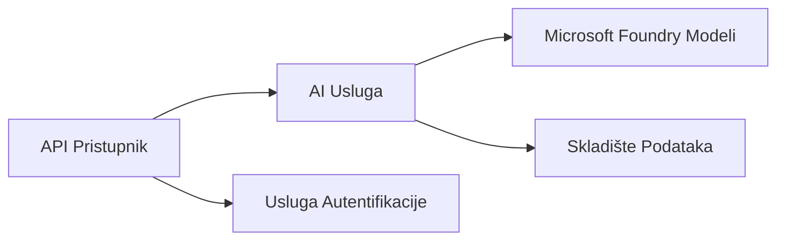

# Poglavlje 8: Obrasci proizvodnje i poduzeća

**📚 Tečaj**: [AZD za početnike](../../README.md) | **⏱️ Trajanje**: 2-3 sata | **⭐ Složenost**: Napredno

---

## Pregled

Ovo poglavlje pokriva obrasce implementacije spremne za poduzeća, pojačavanje sigurnosti, nadzor i optimizaciju troškova za proizvodne AI zadatke.

> Validirano s `azd 1.23.12` u ožujku 2026.

## Ciljevi učenja

Dovršetkom ovog poglavlja ćete:
- Implementirati više regija za otpornosti aplikacija
- Primijeniti sigurnosne obrasce za poduzeća
- Konfigurirati sveobuhvatan nadzor
- Optimizirati troškove u velikom obujmu
- Postaviti CI/CD pipelineove s AZD-om

---

## 📚 Lekcije

| # | Lekcija | Opis | Vrijeme |
|---|---------|-------|---------|
| 1 | [Prakse proizvodnje umjetne inteligencije](production-ai-practices.md) | Obrasci implementacije za poduzeća | 90 min |

---

## 🚀 Kontrolni popis za proizvodnju

- [ ] Implementacija u više regija za otpornost
- [ ] Upravljani identitet za autentifikaciju (bez ključeva)
- [ ] Application Insights za nadzor
- [ ] Konfigurirani budžeti i upozorenja za troškove
- [ ] Omogućen sigurnosni skeniranje
- [ ] Integracija CI/CD pipelineova
- [ ] Plan za oporavak od katastrofa

---

## 🏗️ Arhitektonski obrasci

### Obrazac 1: Mikroservisi AI


### Obrazac 2: AI temeljena na događajima


---

## 🔐 Najbolje sigurnosne prakse

```bicep
// Use managed identity
identity: {
  type: 'SystemAssigned'
}

// Private endpoints for AI services
properties: {
  publicNetworkAccess: 'Disabled'
  networkAcls: {
    defaultAction: 'Deny'
  }
}
```

---

## 💰 Optimizacija troškova

| Strategija | Ušteda |
|------------|---------|
| Skaliranje na nulu (Container Apps) | 60-80% |
| Korištenje modela potrošnje za razvoj | 50-70% |
| Planirano skaliranje | 30-50% |
| Rezervirani kapacitet | 20-40% |

```bash
# Postavi upozorenja o proračunu
az consumption budget create \
  --budget-name "AI-Budget" \
  --amount 500 \
  --category Cost \
  --time-grain Monthly
```

---

## 📊 Postavljanje nadzora

```bash
# Strujanje zapisa
azd monitor --logs

# Provjerite Application Insights
azd monitor --overview

# Pregledajte metrike
az monitor metrics list --resource <resource-id>
```

---

## 🔗 Navigacija

| Smjer | Poglavlje |
|--------|----------|
| **Prethodno** | [Poglavlje 7: Rješavanje problema](../chapter-07-troubleshooting/README.md) |
| **Tečaj završen** | [Početna stranica tečaja](../../README.md) |

---

## 📖 Povezani resursi

- [Vodič za AI agente](../chapter-02-ai-development/agents.md)
- [Application Insights](../chapter-06-pre-deployment/application-insights.md)
- [Rješenja za više agenata](../chapter-05-multi-agent/README.md)
- [Primjer mikroservisa](../../examples/microservices/README.md)

---

<!-- CO-OP TRANSLATOR DISCLAIMER START -->
**Odricanje od odgovornosti**:  
Ovaj je dokument preveden pomoću AI usluge za prijevod [Co-op Translator](https://github.com/Azure/co-op-translator). Iako nastojimo biti točni, imajte na umu da automatski prijevodi mogu sadržavati pogreške ili netočnosti. Izvorni dokument na izvornom jeziku treba smatrati autoritativnim izvorom. Za kritične informacije preporučuje se profesionalni ljudski prijevod. Nismo odgovorni za bilo kakva nerazumijevanja ili pogrešne interpretacije koje proizlaze iz korištenja ovog prijevoda.
<!-- CO-OP TRANSLATOR DISCLAIMER END -->