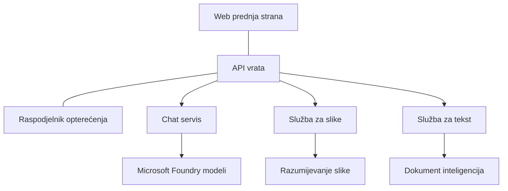

# Najbolje prakse za produkcijsko AI opterećenje s AZD-om

**Navigacija poglavljima:**
- **📚 Početna stranica tečaja**: [AZD za početnike](../../README.md)
- **📖 Trenutno poglavlje**: Poglavlje 8 - Produkcijski i poduzetnički obrasci
- **⬅️ Prethodno poglavlje**: [Poglavlje 7: Rješavanje problema](../chapter-07-troubleshooting/debugging.md)
- **⬅️ Također povezano**: [AI radionica](ai-workshop-lab.md)
- **🎯 Završetak tečaja**: [AZD za početnike](../../README.md)

## Pregled

Ovaj vodič pruža sveobuhvatne najbolje prakse za implementaciju produkcijski spremnih AI opterećenja korištenjem Azure Developer CLI-ja (AZD). Na temelju povratnih informacija iz Microsoft Foundry Discord zajednice i stvarnih implementacija kod korisnika, ove prakse rješavaju najčešće izazove u produkcijskim AI sustavima.

## Ključni izazovi koji se rješavaju

Na temelju rezultata naše ankete u zajednici, ovo su glavni izazovi s kojima se programeri susreću:

- **45%** ima poteškoća s AI implementacijama koje uključuju više usluga
- **38%** ima problema s upravljanjem vjerodajnicama i tajnama  
- **35%** smatra da su produkcijska spremnost i skaliranje izazovni
- **32%** treba bolje strategije optimizacije troškova
- **29%** zahtijeva poboljšani nadzor i rješavanje problema

## Arhitektonski obrasci za produkcijsko AI

### Obrazac 1: Microservices AI arhitektura

**Kada koristiti**: Složene AI aplikacije s više mogućnosti


**Implementacija s AZD-om**:

```yaml
# azure.yaml
name: enterprise-ai-platform
services:
  web:
    project: ./web
    host: staticwebapp
  api-gateway:
    project: ./api-gateway
    host: containerapp
  chat-service:
    project: ./services/chat
    host: containerapp
  vision-service:
    project: ./services/vision
    host: containerapp
  text-service:
    project: ./services/text
    host: containerapp
```

### Obrazac 2: Na događaje orijentirano AI procesiranje

**Kada koristiti**: Obrada u serijama, analiza dokumenata, asinkroni tijekovi rada

```bicep
// Event Hub for AI processing pipeline
resource eventHub 'Microsoft.EventHub/namespaces@2023-01-01-preview' = {
  name: eventHubNamespaceName
  location: location
  sku: {
    name: 'Standard'
    tier: 'Standard'
    capacity: 1
  }
}

// Service Bus for reliable message processing
resource serviceBus 'Microsoft.ServiceBus/namespaces@2022-10-01-preview' = {
  name: serviceBusNamespaceName
  location: location
  sku: {
    name: 'Premium'
    tier: 'Premium'
    capacity: 1
  }
}

// Function App for processing
resource functionApp 'Microsoft.Web/sites@2023-01-01' = {
  name: functionAppName
  location: location
  kind: 'functionapp,linux'
  properties: {
    siteConfig: {
      appSettings: [
        {
          name: 'FUNCTIONS_EXTENSION_VERSION'
          value: '~4'
        }
        {
          name: 'AZURE_OPENAI_ENDPOINT'
          value: '@Microsoft.KeyVault(VaultName=${keyVault.name};SecretName=openai-endpoint)'
        }
      ]
    }
  }
}
```

## Razmišljanje o zdravlju AI agenta

Kada se tradicionalna web aplikacija pokvari, simptomi su poznati: stranica se ne učitava, API vraća pogrešku ili implementacija ne uspije. AI aplikacije mogu se pokvariti na sve te načine — ali mogu se i "ponašati" suptilnije, bez očitih poruka o pogrešci.

Ovaj odjeljak pomaže vam izgraditi mentalni model za nadziranje AI opterećenja kako biste znali gdje tražiti kada nešto ne izgleda u redu.

### Kako se zdravlje agenta razlikuje od zdravlja tradicionalne aplikacije

Tradicionalna aplikacija ili radi ili ne radi. AI agent može izgledati kao da radi, ali proizvoditi loše rezultate. Razmislite o zdravlju agenta u dva sloja:

| Sloj | Što pratiti | Gdje tražiti |
|-------|--------------|---------------|
| **Zdravlje infrastrukture** | Radi li usluga? Jesu li resursi provisionirani? Jesu li krajnje točke dostupne? | `azd monitor`, zdravlje resursa u Azure portalu, logovi kontejnera/aplikacije |
| **Zdravlje ponašanja** | Odaziva li se agent točno? Jesu li odgovori pravovremeni? Je li model ispravno pozvan? | Application Insights tragovi, metrike latencije poziva modela, logovi kvalitete odgovora |

Zdravlje infrastrukture je poznato—isto je za svaku azd aplikaciju. Zdravlje ponašanja je novi sloj koji AI opterećenja unose.

### Gdje tražiti kad se AI aplikacije ne ponašaju kako se očekuje

Ako vaša AI aplikacija ne proizvodi očekivane rezultate, evo konceptualnog kontrolnog popisa:

1. **Počnite s osnovama.** Radi li aplikacija? Može li doći do svojih ovisnosti? Provjerite `azd monitor` i zdravlje resursa kao kod bilo koje aplikacije.
2. **Provjerite vezu s modelom.** Vaša aplikacija uspješno poziva AI model? Neuspjeli ili istekli pozivi modelu najčešći su uzrok problema AI aplikacija i pojavit će se u logovima vaše aplikacije.
3. **Pogledajte što je model primio.** AI odgovori ovise o ulazu (prompt i kontekst koji je dohvaćen). Ako je izlaz pogrešan, obično je i ulaz pogrešan. Provjerite šalje li vaša aplikacija ispravne podatke modelu.
4. **Pregledajte latenciju odgovora.** Pozivi AI modelu sporiji su od uobičajenih API poziva. Ako aplikacija djeluje sporo, provjerite jesu li se vrijeme odgovora modela povećala—to može ukazivati na ograničenja, limite kapaciteta ili zagušenje na razini regije.
5. **Pratite signale troškova.** Neočekivani skokovi u korištenju tokena ili API pozivima mogu ukazivati na petlju, pogrešno konfigurirani prompt ili pretjerano ponavljanje pokušaja.

Ne morate odmah ovladati alatima za promatranje. Ključna je poanta da AI aplikacije imaju dodatni sloj ponašanja za praćenje, a ugrađeni nadzor u azd-u (`azd monitor`) pruža vam početnu točku za istraživanje oba sloja.

---

## Najbolje sigurnosne prakse

### 1. Zero-Trust sigurnosni model

**Strategija implementacije**:
- Nema komunikacije između usluga bez autentifikacije
- Svi API pozivi koriste upravljane identitete
- Izolacija mreže s privatnim krajnjim točkama
- Kontrola pristupa na načelu najmanje privilegije

```bicep
// Managed Identity for each service
resource chatServiceIdentity 'Microsoft.ManagedIdentity/userAssignedIdentities@2023-01-31' = {
  name: 'chat-service-identity'
  location: location
}

// Role assignments with minimal permissions
resource openAIUserRole 'Microsoft.Authorization/roleAssignments@2022-04-01' = {
  scope: openAIAccount
  name: guid(openAIAccount.id, chatServiceIdentity.id, openAIUserRoleDefinitionId)
  properties: {
    roleDefinitionId: subscriptionResourceId('Microsoft.Authorization/roleDefinitions', '5e0bd9bd-7b93-4f28-af87-19fc36ad61bd')
    principalId: chatServiceIdentity.properties.principalId
    principalType: 'ServicePrincipal'
  }
}
```

### 2. Sigurno upravljanje tajnama

**Obrazac integracije Key Vault-a**:

```bicep
// Key Vault with proper access policies
resource keyVault 'Microsoft.KeyVault/vaults@2023-02-01' = {
  name: keyVaultName
  location: location
  properties: {
    tenantId: tenant().tenantId
    sku: {
      family: 'A'
      name: 'premium'  // Use premium for production
    }
    enableRbacAuthorization: true  // Use RBAC instead of access policies
    enablePurgeProtection: true    // Prevent accidental deletion
    enableSoftDelete: true
    softDeleteRetentionInDays: 90
  }
}

// Store all AI service credentials
resource openAIKeySecret 'Microsoft.KeyVault/vaults/secrets@2023-02-01' = {
  parent: keyVault
  name: 'openai-api-key'
  properties: {
    value: openAIAccount.listKeys().key1
    attributes: {
      enabled: true
    }
  }
}
```

### 3. Mrežna sigurnost

**Konfiguracija privatnih krajnjih točaka**:

```bicep
// Virtual Network for AI services
resource virtualNetwork 'Microsoft.Network/virtualNetworks@2023-04-01' = {
  name: vnetName
  location: location
  properties: {
    addressSpace: {
      addressPrefixes: ['10.0.0.0/16']
    }
    subnets: [
      {
        name: 'ai-services-subnet'
        properties: {
          addressPrefix: '10.0.1.0/24'
          privateEndpointNetworkPolicies: 'Disabled'
        }
      }
      {
        name: 'app-services-subnet'
        properties: {
          addressPrefix: '10.0.2.0/24'
          delegations: [
            {
              name: 'Microsoft.Web/serverFarms'
              properties: {
                serviceName: 'Microsoft.Web/serverFarms'
              }
            }
          ]
        }
      }
    ]
  }
}

// Private endpoints for all AI services
resource openAIPrivateEndpoint 'Microsoft.Network/privateEndpoints@2023-04-01' = {
  name: '${openAIAccountName}-pe'
  location: location
  properties: {
    subnet: {
      id: virtualNetwork.properties.subnets[0].id
    }
    privateLinkServiceConnections: [
      {
        name: 'openai-connection'
        properties: {
          privateLinkServiceId: openAIAccount.id
          groupIds: ['account']
        }
      }
    ]
  }
}
```

## Performanse i skaliranje

### 1. Strategije automatskog skaliranja

**Automatsko skaliranje Container Apps**:

```bicep
resource containerApp 'Microsoft.App/containerApps@2023-05-01' = {
  name: containerAppName
  location: location
  properties: {
    configuration: {
      ingress: {
        external: true
        targetPort: 8000
        transport: 'http'
      }
    }
    template: {
      scale: {
        minReplicas: 2  // Always have 2 instances minimum
        maxReplicas: 50 // Scale up to 50 for high load
        rules: [
          {
            name: 'http-scaling'
            http: {
              metadata: {
                concurrentRequests: '20'  // Scale when >20 concurrent requests
              }
            }
          }
          {
            name: 'cpu-scaling'
            custom: {
              type: 'cpu'
              metadata: {
                type: 'Utilization'
                value: '70'  // Scale when CPU >70%
              }
            }
          }
        ]
      }
    }
  }
}
```

### 2. Strategije keširanja

**Redis cache za AI odgovore**:

```bicep
// Redis Premium for production workloads
resource redisCache 'Microsoft.Cache/redis@2023-04-01' = {
  name: redisCacheName
  location: location
  properties: {
    sku: {
      name: 'Premium'
      family: 'P'
      capacity: 1
    }
    enableNonSslPort: false
    minimumTlsVersion: '1.2'
    redisConfiguration: {
      'maxmemory-policy': 'allkeys-lru'
    }
    // Enable clustering for high availability
    redisVersion: '6.0'
    shardCount: 2
  }
}

// Cache configuration in application
var cacheConnectionString = '${redisCache.properties.hostName}:6380,password=${redisCache.listKeys().primaryKey},ssl=True,abortConnect=False'
```

### 3. Uravnoteženje opterećenja i upravljanje prometom

**Application Gateway s WAF-om**:

```bicep
// Application Gateway with Web Application Firewall
resource applicationGateway 'Microsoft.Network/applicationGateways@2023-04-01' = {
  name: appGatewayName
  location: location
  properties: {
    sku: {
      name: 'WAF_v2'
      tier: 'WAF_v2'
      capacity: 2
    }
    webApplicationFirewallConfiguration: {
      enabled: true
      firewallMode: 'Prevention'
      ruleSetType: 'OWASP'
      ruleSetVersion: '3.2'
    }
    // Backend pools for AI services
    backendAddressPools: [
      {
        name: 'ai-services-pool'
        properties: {
          backendAddresses: [
            {
              fqdn: '${containerApp.properties.configuration.ingress.fqdn}'
            }
          ]
        }
      }
    ]
  }
}
```

## 💰 Optimizacija troškova

### 1. Pravilno dimenzioniranje resursa

**Konfiguracije specifične za okruženje**:

```bash
# Razvojno okruženje
azd env new development
azd env set AZURE_OPENAI_SKU "S0"
azd env set AZURE_OPENAI_CAPACITY 10
azd env set AZURE_SEARCH_SKU "basic"
azd env set CONTAINER_CPU 0.5
azd env set CONTAINER_MEMORY 1.0

# Produkcijsko okruženje
azd env new production
azd env set AZURE_OPENAI_SKU "S0"
azd env set AZURE_OPENAI_CAPACITY 100
azd env set AZURE_SEARCH_SKU "standard"
azd env set CONTAINER_CPU 2.0
azd env set CONTAINER_MEMORY 4.0
```

### 2. Praćenje troškova i proračuni

```bicep
// Cost management and budgets
resource budget 'Microsoft.Consumption/budgets@2023-05-01' = {
  name: 'ai-workload-budget'
  properties: {
    timePeriod: {
      startDate: '2024-01-01'
      endDate: '2024-12-31'
    }
    timeGrain: 'Monthly'
    amount: 2000  // $2000 monthly budget
    category: 'Cost'
    notifications: {
      warning: {
        enabled: true
        operator: 'GreaterThan'
        threshold: 80
        contactEmails: [
          'finance@company.com'
          'engineering@company.com'
        ]
        contactRoles: [
          'Owner'
          'Contributor'
        ]
      }
      critical: {
        enabled: true
        operator: 'GreaterThan'
        threshold: 95
        contactEmails: [
          'cto@company.com'
        ]
      }
    }
  }
}
```

### 3. Optimizacija korištenja tokena

**Upravljanje troškovima OpenAI-ja**:

```typescript
// Optimizacija tokena na razini aplikacije
class TokenOptimizer {
  private readonly maxTokens = 4000;
  private readonly reserveTokens = 500;
  
  optimizePrompt(userInput: string, context: string): string {
    const availableTokens = this.maxTokens - this.reserveTokens;
    const estimatedTokens = this.estimateTokens(userInput + context);
    
    if (estimatedTokens > availableTokens) {
      // Skraćivanje konteksta, ne korisničkog unosa
      context = this.truncateContext(context, availableTokens - this.estimateTokens(userInput));
    }
    
    return `${context}\n\nUser: ${userInput}`;
  }
  
  private estimateTokens(text: string): number {
    // Približna procjena: 1 token ≈ 4 znaka
    return Math.ceil(text.length / 4);
  }
}
```

## Nadgledanje i uvid

### 1. Sveobuhvatni Application Insights

```bicep
// Application Insights with advanced features
resource applicationInsights 'Microsoft.Insights/components@2020-02-02' = {
  name: applicationInsightsName
  location: location
  kind: 'web'
  properties: {
    Application_Type: 'web'
    WorkspaceResourceId: logAnalyticsWorkspace.id
    SamplingPercentage: 100  // Full sampling for AI apps
    DisableIpMasking: false  // Enable for security
  }
}

// Custom metrics for AI operations
resource aiMetricAlerts 'Microsoft.Insights/metricAlerts@2018-03-01' = {
  name: 'ai-high-error-rate'
  location: 'global'
  properties: {
    description: 'Alert when AI service error rate is high'
    severity: 2
    enabled: true
    scopes: [
      applicationInsights.id
    ]
    evaluationFrequency: 'PT1M'
    windowSize: 'PT5M'
    criteria: {
      'odata.type': 'Microsoft.Azure.Monitor.SingleResourceMultipleMetricCriteria'
      allOf: [
        {
          name: 'high-error-rate'
          metricName: 'requests/failed'
          operator: 'GreaterThan'
          threshold: 10
          timeAggregation: 'Count'
        }
      ]
    }
  }
}
```

### 2. AI-specifično nadgledanje

**Prilagođeni nadzorne ploče za AI metrike**:

```json
// Dashboard configuration for AI workloads
{
  "dashboard": {
    "name": "AI Application Monitoring",
    "tiles": [
      {
        "name": "OpenAI Request Volume",
        "query": "requests | where name contains 'openai' | summarize count() by bin(timestamp, 5m)"
      },
      {
        "name": "AI Response Latency",
        "query": "requests | where name contains 'openai' | summarize avg(duration) by bin(timestamp, 5m)"
      },
      {
        "name": "Token Usage",
        "query": "customMetrics | where name == 'openai_tokens_used' | summarize sum(value) by bin(timestamp, 1h)"
      },
      {
        "name": "Cost per Hour",
        "query": "customMetrics | where name == 'openai_cost' | summarize sum(value) by bin(timestamp, 1h)"
      }
    ]
  }
}
```

### 3. Provjere zdravlja i praćenje dostupnosti

```bicep
// Application Insights availability tests
resource availabilityTest 'Microsoft.Insights/webtests@2022-06-15' = {
  name: 'ai-app-availability-test'
  location: location
  tags: {
    'hidden-link:${applicationInsights.id}': 'Resource'
  }
  properties: {
    SyntheticMonitorId: 'ai-app-availability-test'
    Name: 'AI Application Availability Test'
    Description: 'Tests AI application endpoints'
    Enabled: true
    Frequency: 300  // 5 minutes
    Timeout: 120    // 2 minutes
    Kind: 'ping'
    Locations: [
      {
        Id: 'us-east-2-azr'
      }
      {
        Id: 'us-west-2-azr'
      }
    ]
    Configuration: {
      WebTest: '''
        <WebTest Name="AI Health Check" 
                 Id="8d2de8d2-a2b0-4c2e-9a0d-8f9c9a0b8c8d" 
                 Enabled="True" 
                 CssProjectStructure="" 
                 CssIteration="" 
                 Timeout="120" 
                 WorkItemIds="" 
                 xmlns="http://microsoft.com/schemas/VisualStudio/TeamTest/2010" 
                 Description="" 
                 CredentialUserName="" 
                 CredentialPassword="" 
                 PreAuthenticate="True" 
                 Proxy="default" 
                 StopOnError="False" 
                 RecordedResultFile="" 
                 ResultsLocale="">
          <Items>
            <Request Method="GET" 
                     Guid="a5f10126-e4cd-570d-961c-cea43999a200" 
                     Version="1.1" 
                     Url="${webApp.properties.defaultHostName}/health" 
                     ThinkTime="0" 
                     Timeout="120" 
                     ParseDependentRequests="True" 
                     FollowRedirects="True" 
                     RecordResult="True" 
                     Cache="False" 
                     ResponseTimeGoal="0" 
                     Encoding="utf-8" 
                     ExpectedHttpStatusCode="200" 
                     ExpectedResponseUrl="" 
                     ReportingName="" 
                     IgnoreHttpStatusCode="False" />
          </Items>
        </WebTest>
      '''
    }
  }
}
```

## Oporavak od katastrofa i visoka dostupnost

### 1. Implementacija u više regija

```yaml
# azure.yaml - Multi-region configuration
name: ai-app-multiregion
services:
  api-primary:
    project: ./api
    host: containerapp
    env:
      - AZURE_REGION=eastus
  api-secondary:
    project: ./api
    host: containerapp
    env:
      - AZURE_REGION=westus2
```

```bicep
// Traffic Manager for global load balancing
resource trafficManager 'Microsoft.Network/trafficManagerProfiles@2022-04-01' = {
  name: trafficManagerProfileName
  location: 'global'
  properties: {
    profileStatus: 'Enabled'
    trafficRoutingMethod: 'Priority'
    dnsConfig: {
      relativeName: trafficManagerProfileName
      ttl: 30
    }
    monitorConfig: {
      protocol: 'HTTPS'
      port: 443
      path: '/health'
      intervalInSeconds: 30
      toleratedNumberOfFailures: 3
      timeoutInSeconds: 10
    }
    endpoints: [
      {
        name: 'primary-endpoint'
        type: 'Microsoft.Network/trafficManagerProfiles/azureEndpoints'
        properties: {
          targetResourceId: primaryAppService.id
          endpointStatus: 'Enabled'
          priority: 1
        }
      }
      {
        name: 'secondary-endpoint'
        type: 'Microsoft.Network/trafficManagerProfiles/azureEndpoints'
        properties: {
          targetResourceId: secondaryAppService.id
          endpointStatus: 'Enabled'
          priority: 2
        }
      }
    ]
  }
}
```

### 2. Izrada sigurnosnih kopija i oporavak podataka

```bicep
// Backup configuration for critical data
resource backupVault 'Microsoft.DataProtection/backupVaults@2023-05-01' = {
  name: backupVaultName
  location: location
  identity: {
    type: 'SystemAssigned'
  }
  properties: {
    storageSettings: [
      {
        datastoreType: 'VaultStore'
        type: 'LocallyRedundant'
      }
    ]
  }
}

// Backup policy for AI models and data
resource backupPolicy 'Microsoft.DataProtection/backupVaults/backupPolicies@2023-05-01' = {
  parent: backupVault
  name: 'ai-data-backup-policy'
  properties: {
    policyRules: [
      {
        backupParameters: {
          backupType: 'Full'
          objectType: 'AzureBackupParams'
        }
        trigger: {
          schedule: {
            repeatingTimeIntervals: [
              'R/2024-01-01T02:00:00+00:00/P1D'  // Daily at 2 AM
            ]
          }
          objectType: 'ScheduleBasedTriggerContext'
        }
        dataStore: {
          datastoreType: 'VaultStore'
          objectType: 'DataStoreInfoBase'
        }
        name: 'BackupDaily'
        objectType: 'AzureBackupRule'
      }
    ]
  }
}
```

## DevOps i CI/CD integracija

### 1. GitHub Actions tijek rada

```yaml
# .github/workflows/deploy-ai-app.yml
name: Deploy AI Application

on:
  push:
    branches: [main]
  pull_request:
    branches: [main]

jobs:
  test:
    runs-on: ubuntu-latest
    steps:
      - uses: actions/checkout@v4
      
      - name: Setup Python
        uses: actions/setup-python@v4
        with:
          python-version: '3.11'
          
      - name: Install dependencies
        run: |
          pip install -r requirements.txt
          pip install pytest
          
      - name: Run tests
        run: pytest tests/
        
      - name: AI Safety Tests
        run: |
          python scripts/test_ai_safety.py
          python scripts/validate_prompts.py

  deploy-staging:
    needs: test
    if: github.event_name == 'pull_request'
    runs-on: ubuntu-latest
    steps:
      - uses: actions/checkout@v4
      
      - name: Setup AZD
        uses: Azure/setup-azd@v1.0.0
        
      - name: Login to Azure
        uses: azure/login@v1
        with:
          creds: ${{ secrets.AZURE_CREDENTIALS }}
          
      - name: Deploy to Staging
        run: |
          azd env select staging
          azd deploy

  deploy-production:
    needs: test
    if: github.ref == 'refs/heads/main'
    runs-on: ubuntu-latest
    steps:
      - uses: actions/checkout@v4
      
      - name: Setup AZD
        uses: Azure/setup-azd@v1.0.0
        
      - name: Login to Azure
        uses: azure/login@v1
        with:
          creds: ${{ secrets.AZURE_CREDENTIALS }}
          
      - name: Deploy to Production
        run: |
          azd env select production
          azd deploy
          
      - name: Run Production Health Checks
        run: |
          python scripts/health_check.py --env production
```

### 2. Validacija infrastrukture

```bash
# scripts/validate_infrastructure.sh
#!/bin/bash

echo "Validating AI infrastructure deployment..."

# Provjeri jesu li svi potrebni servisi pokrenuti
services=("openai" "search" "storage" "keyvault")
for service in "${services[@]}"; do
    echo "Checking $service..."
    if ! az resource list --resource-type "Microsoft.CognitiveServices/accounts" --query "[?contains(name, '$service')]" -o tsv; then
        echo "ERROR: $service not found"
        exit 1
    fi
done

# Validiraj OpenAI model implementacije
echo "Validating OpenAI model deployments..."
models=$(az cognitiveservices account deployment list --name $AZURE_OPENAI_NAME --resource-group $AZURE_RESOURCE_GROUP --query "[].name" -o tsv)
if [[ ! $models == *"gpt-35-turbo"* ]]; then
    echo "ERROR: Required model gpt-35-turbo not deployed"
    exit 1
fi

# Testiraj povezivost AI servisa
echo "Testing AI service connectivity..."
python scripts/test_connectivity.py

echo "Infrastructure validation completed successfully!"
```

## Kontrolni popis za produkcijsku spremnost

### Sigurnost ✅
- [ ] Sve usluge koriste upravljane identitete
- [ ] Tajne pohranjene u Key Vault-u
- [ ] Konfigurirane privatne krajnje točke
- [ ] Implementirane mrežne sigurnosne grupe
- [ ] RBAC s principom najmanjih privilegija
- [ ] WAF omogućen na javnim krajnjim točkama

### Performanse ✅
- [ ] Konfigurirano automatsko skaliranje
- [ ] Implementirano keširanje
- [ ] Postavljeno uravnoteženje opterećenja
- [ ] CDN za statički sadržaj
- [ ] Pooling veza baze podataka
- [ ] Optimizacija korištenja tokena

### Nadgledanje ✅
- [ ] Konfiguriran Application Insights
- [ ] Definirane prilagođene metrike
- [ ] Postavljeni alerti
- [ ] Kreirana nadzorna ploča
- [ ] Implementirane provjere zdravlja
- [ ] Politike zadržavanja logova

### Pouzdanost ✅
- [ ] Deploy u više regija
- [ ] Plan sigurnosnih kopija i oporavka
- [ ] Implementirani circuit breaker-i
- [ ] Konfigurirane politike ponovnog pokušaja
- [ ] Graceful degradation
- [ ] Krajnje točke za provjeru zdravlja

### Upravljanje troškovima ✅
- [ ] Konfigurirane obavijesti o proračunu
- [ ] Pravilno dimenzioniranje resursa
- [ ] Primijenjeni popusti za razvoj/testiranje
- [ ] Kupljene rezervirane instance
- [ ] Nadzorna ploča za praćenje troškova
- [ ] Redoviti pregledi troškova

### Usklađenost ✅
- [ ] Ispunjeni zahtjevi za rezidenciju podataka
- [ ] Omogućeno evidentiranje audita
- [ ] Primijenjene politike usklađenosti
- [ ] Implementirane sigurnosne smjernice
- [ ] Redovite sigurnosne provjere
- [ ] Plan odgovora na incidente

## Benchmarkovi performansi

### Tipične produkcijske metrike

| Metrička vrijednost | Cilj | Nadgledanje |
|--------|--------|------------|
| **Vrijeme odziva** | < 2 sekunde | Application Insights |
| **Dostupnost** | 99,9% | Praćenje dostupnosti |
| **Stopa pogrešaka** | < 0,1% | Logovi aplikacije |
| **Korištenje tokena** | < 500 USD/mjesečno | Upravljanje troškovima |
| **Istovremeni korisnici** | 1000+ | Testiranje opterećenja |
| **Vrijeme oporavka** | < 1 sat | Testovi oporavka od katastrofa |

### Test opterećenja

```bash
# Skripta za testiranje opterećenja za AI aplikacije
python scripts/load_test.py \
  --endpoint https://your-ai-app.azurewebsites.net \
  --concurrent-users 100 \
  --duration 300 \
  --ramp-up 60
```

## 🤝 Najbolje prakse zajednice

Na temelju povratnih informacija Microsoft Foundry Discord zajednice:

### Glavne preporuke iz zajednice:

1. **Započnite s malim, postupno skalirajte**: Počnite s osnovnim SKU-ovima i skalirajte prema stvarnoj upotrebi
2. **Nadzirite sve**: Postavite sveobuhvatni nadzor od prvog dana
3. **Automatizirajte sigurnost**: Koristite infrastrukturu kao kod za dosljednu sigurnost
4. **Temeljito testirajte**: Uključite AI-specifična testiranja u svoj pipeline
5. **Planirajte troškove**: Pratite korištenje tokena i rano postavite obavijesti o proračunu

### Uobičajene pogreške kojih se treba kloniti:

- ❌ Ugradnja API ključeva u kod
- ❌ Nepostavljanje odgovarajućeg nadzora
- ❌ Zanemarivanje optimizacije troškova
- ❌ Ne testiranje scenarija neuspjeha
- ❌ Implementacija bez provjere zdravlja

## AZD AI CLI naredbe i proširenja

AZD sadrži rastući skup AI-specifičnih naredbi i proširenja koja pojednostavljuju produkcijske AI tijekove rada. Ovi alati premošćuju jaz između lokalnog razvoja i produkcijske implementacije AI opterećenja.

### AZD proširenja za AI

AZD koristi sustav proširenja za dodavanje AI-specifičnih mogućnosti. Instalirajte i upravljajte proširenjima pomoću:

```bash
# Prikaži sve dostupne ekstenzije (uključujući AI)
azd extension list

# Instaliraj ekstenziju Foundry agenata
azd extension install azure.ai.agents

# Instaliraj ekstenziju za fino podešavanje
azd extension install azure.ai.finetune

# Instaliraj ekstenziju za prilagođene modele
azd extension install azure.ai.models

# Nadogradi sve instalirane ekstenzije
azd extension upgrade --all
```

**Dostupna AI proširenja:**

| Proširenje | Svrha | Status |
|-----------|---------|--------|
| `azure.ai.agents` | Upravljanje Foundry Agent uslugom | Pregled |
| `azure.ai.finetune` | Finetuning Foundry modela | Pregled |
| `azure.ai.models` | Prilagođeni Foundry modeli | Pregled |
| `azure.coding-agent` | Konfiguracija coding agenta | Dostupno |

### Inicijalizacija projekata agenata s `azd ai agent init`

Naredba `azd ai agent init` postavlja produkcijski spreman AI agent projekt integriran s Microsoft Foundry Agent Service:

```bash
# Inicijalizirajte novi projekt agenta iz manifesta agenta
azd ai agent init -m <manifest-path-or-uri>

# Inicijalizirajte i usmjerite na određeni Foundry projekt
azd ai agent init -m agent-manifest.yaml --project-id <foundry-project-id>

# Inicijalizirajte s prilagođenim izvorom direktorija
azd ai agent init -m agent-manifest.yaml --src ./agents/my-agent

# Ciljajte Container Apps kao domaćina
azd ai agent init -m agent-manifest.yaml --host containerapp
```

**Ključne opcije:**

| Opcija | Opis |
|------|-------------|
| `-m, --manifest` | Put ili URI do manifest datoteke agenta za dodavanje u projekt |
| `-p, --project-id` | Postojeći Microsoft Foundry Project ID za azd okruženje |
| `-s, --src` | Direktorij za preuzimanje definicije agenta (zadano `src/<agent-id>`) |
| `--host` | Prekriži zadani host (npr. `containerapp`) |
| `-e, --environment` | Azd okruženje za korištenje |

**Savjet za produkciju**: Koristite `--project-id` da se izravno povežete s postojećim Foundry projektom, čime vaša agentova logika i cloud resursi budu povezani od početka.

### Protokol konteksta modela (MCP) s `azd mcp`

AZD uključuje ugrađenu podršku za MCP server (Alpha), koji omogućuje AI agentima i alatima da komuniciraju s vašim Azure resursima kroz standardizirani protokol:

```bash
# Pokrenite MCP poslužitelj za svoj projekt
azd mcp start

# Upravljajte pristankom na alate za MCP operacije
azd mcp consent
```

MCP server izlaže kontekst vašeg azd projekta — okruženja, usluge i Azure resurse — AI-potpomognutim alatima za razvoj. To omogućuje:

- **AI-podržanu implementaciju**: Dopustite coding agentima da upituju stanje vašeg projekta i pokreću implementacije
- **Otkriće resursa**: AI alati mogu otkriti koje Azure resurse vaš projekt koristi
- **Upravljanje okruženjima**: Agenti mogu prelaziti između razvojnih, testnih i produkcijskih okruženja

### Generiranje infrastrukture s `azd infra generate`

Za produkcijska AI opterećenja, možete generirati i prilagoditi infrastrukturu kao kod, umjesto oslanjanja na automatsko provisioniranje:

```bash
# Generirajte Bicep/Terraform datoteke iz definicije vašeg projekta
azd infra generate
```

Ovo zapisuje IaC na disk tako da možete:
- Pregledati i revidirati infrastrukturu prije implementacije
- Dodavati prilagođene sigurnosne politike (mrežna pravila, privatne krajnje točke)
- Integrirati s postojećim procesima pregleda IaC-a
- Upravljati promjenama infrastrukture zasebno od koda aplikacije

### Priključci za životni ciklus produkcije

AZD hook-ovi omogućuju umetanje prilagođene logike u svaku fazu životnog ciklusa implementacije—kritično za produkcijske AI tijekove rada:

```yaml
# azure.yaml - Production hooks example
name: ai-production-app
hooks:
  preprovision:
    shell: sh
    run: scripts/validate-quotas.sh    # Check AI model quota before provisioning
  postprovision:
    shell: sh
    run: scripts/configure-networking.sh  # Set up private endpoints
  predeploy:
    shell: sh
    run: scripts/run-ai-safety-tests.sh  # Run prompt safety checks
  postdeploy:
    shell: sh
    run: scripts/smoke-test.sh           # Verify agent responses post-deploy
services:
  agent-api:
    project: ./src/agent
    host: containerapp
    hooks:
      predeploy:
        shell: sh
        run: scripts/validate-model-access.sh  # Per-service hook
```

```bash
# Ručno pokrenite određeni hook tijekom razvoja
azd hooks run predeploy
```

**Preporučeni produkcijski hook-ovi za AI opterećenja:**

| Hook | Slučaj uporabe |
|------|----------|
| `preprovision` | Provjera kvota pretplate za kapacitet AI modela |
| `postprovision` | Konfiguracija privatnih krajnjih točaka, implementacija težina modela |
| `predeploy` | Pokretanje AI sigurnosnih testova, validacija predložaka prompta |
| `postdeploy` | Smoke testovi odgovora agenta, provjera povezivosti modela |

### Konfiguracija CI/CD pipelinea

Koristite `azd pipeline config` za povezivanje projekta s GitHub Actions ili Azure Pipelines uz sigurnu Azure autentifikaciju:

```bash
# Konfigurirajte CI/CD cjevovod (interaktivno)
azd pipeline config

# Konfigurirajte s određenim pružateljem usluge
azd pipeline config --provider github
```

Ova naredba:
- Stvara servisnog principal-a s pristupom načela najmanjih privilegija
- Konfigurira federirane vjerodajnice (bez pohranjenih tajni)
- Generira ili ažurira definicijsku datoteku pipeline-a
- Postavlja potrebne varijable okruženja u vašem CI/CD sustavu

**Produkcijski tijek rada s pipeline konfiguracijom:**

```bash
# 1. Postavite proizvodno okruženje
azd env new production
azd env set AZURE_OPENAI_CAPACITY 100

# 2. Konfigurirajte pipeline
azd pipeline config --provider github

# 3. Pipeline pokreće azd deploy pri svakom pushu na main
```

### Dodavanje komponenti naredbom `azd add`

Postupno dodajte Azure usluge postojećem projektu:

```bash
# Dodajte novu komponentu usluge interaktivno
azd add
```

Ovo je osobito korisno za proširenje produkcijskih AI aplikacija—na primjer, dodavanje servisa za pretraživanje vektora, nove agent krajnje točke ili komponentu za praćenje postojećoj implementaciji.

## Dodatni resursi
- **Okvir za dobro arhitektonski dizajniran Azure**: [Smjernice za AI radno opterećenje](https://learn.microsoft.com/azure/well-architected/ai/)
- **Microsoft Foundry dokumentacija**: [Službena dokumentacija](https://learn.microsoft.com/azure/ai-studio/)
- **Predlošci zajednice**: [Azure uzorci](https://github.com/Azure-Samples)
- **Zajednica na Discordu**: [#Azure kanal](https://discord.gg/microsoft-azure)
- **Agentove vještine za Azure**: [microsoft/github-copilot-for-azure na skills.sh](https://skills.sh/microsoft/github-copilot-for-azure) - 37 otvorenih agentovih vještina za Azure AI, Foundry, implementaciju, optimizaciju troškova i dijagnostiku. Instalirajte u svoj uređivač:
  ```bash
  npx skills add microsoft/github-copilot-for-azure
  ```

---

**Navigacija poglavljem:**
- **📚 Početna tečaja**: [AZD Za početnike](../../README.md)
- **📖 Trenutno poglavlje**: Poglavlje 8 - Obrasci za produkciju i poduzeća
- **⬅️ Prethodno poglavlje**: [Poglavlje 7: Otklanjanje poteškoća](../chapter-07-troubleshooting/debugging.md)
- **⬅️ Također povezano**: [AI radionica laboratorij](ai-workshop-lab.md)
- **� Završetak tečaja**: [AZD Za početnike](../../README.md)

**Zapamtite**: AI radna opterećenja u produkciji zahtijevaju pažljivo planiranje, nadzor i kontinuiranu optimizaciju. Započnite s ovim obrascima i prilagodite ih svojim specifičnim zahtjevima.

---

<!-- CO-OP TRANSLATOR DISCLAIMER START -->
**Izjava o odricanju odgovornosti**:  
Ovaj dokument je preveden korištenjem AI usluge prevođenja [Co-op Translator](https://github.com/Azure/co-op-translator). Iako težimo točnosti, imajte na umu da automatski prijevodi mogu sadržavati pogreške ili netočnosti. Izvorni dokument na izvornom jeziku treba se smatrati autoritativnim izvorom. Za kritične informacije preporučuje se profesionalni ljudski prijevod. Nismo odgovorni za bilo kakve nesporazume ili pogrešna tumačenja nastala korištenjem ovog prijevoda.
<!-- CO-OP TRANSLATOR DISCLAIMER END -->