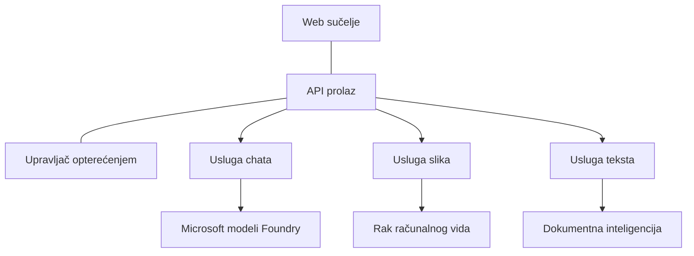

# Najbolje prakse za proizvodne AI radne opterećenja s AZD

**Navigacija kroz poglavlja:**
- **📚 Početna stranica tečaja**: [AZD For Beginners](../../README.md)
- **📖 Trenutno poglavlje**: Poglavlje 8 - Proizvodni i Enterprise obrasci
- **⬅️ Prethodno poglavlje**: [Poglavlje 7: Otklanjanje poteškoća](../chapter-07-troubleshooting/debugging.md)
- **⬅️ Također povezano**: [AI Workshop Lab](ai-workshop-lab.md)
- **🎯 Završetak tečaja**: [AZD For Beginners](../../README.md)

## Pregled

Ovaj vodič pruža sveobuhvatne najbolje prakse za implementaciju proizvodnih AI radnih opterećenja koristeći Azure Developer CLI (AZD). Temelji se na povratnim informacijama iz zajednice Microsoft Foundry Discord i stvarnim implementacijama kupaca te obrađuje najčešće izazove u proizvodnim AI sustavima.

## Ključni izazovi koji se rješavaju

Temeljem rezultata naše zajedničke ankete, ovo su glavni izazovi s kojima se developeri susreću:

- **45%** ima poteškoće s multi-servisnim AI implementacijama  
- **38%** ima problema s upravljanjem vjerodajnicama i tajnama  
- **35%** smatra da je spremnost za proizvodnju i skaliranje teško  
- **32%** trebaju bolju strategiju optimizacije troškova  
- **29%** zahtijevaju poboljšano praćenje i otklanjanje poteškoća  

## Arhitektonski obrasci za proizvodni AI

### Obrazac 1: Microservices AI arhitektura

**Kada koristiti**: Složene AI aplikacije s više funkcionalnosti



**AZD implementacija**:

```yaml
# azure.yaml
name: enterprise-ai-platform
services:
  web:
    project: ./web
    host: staticwebapp
  api-gateway:
    project: ./api-gateway
    host: containerapp
  chat-service:
    project: ./services/chat
    host: containerapp
  vision-service:
    project: ./services/vision
    host: containerapp
  text-service:
    project: ./services/text
    host: containerapp
```

### Obrazac 2: Obrada AI događaja na zahtjev

**Kada koristiti**: Obrada serija podataka, analiza dokumenata, asinhroni radni tokovi

```bicep
// Event Hub for AI processing pipeline
resource eventHub 'Microsoft.EventHub/namespaces@2023-01-01-preview' = {
  name: eventHubNamespaceName
  location: location
  sku: {
    name: 'Standard'
    tier: 'Standard'
    capacity: 1
  }
}

// Service Bus for reliable message processing
resource serviceBus 'Microsoft.ServiceBus/namespaces@2022-10-01-preview' = {
  name: serviceBusNamespaceName
  location: location
  sku: {
    name: 'Premium'
    tier: 'Premium'
    capacity: 1
  }
}

// Function App for processing
resource functionApp 'Microsoft.Web/sites@2023-01-01' = {
  name: functionAppName
  location: location
  kind: 'functionapp,linux'
  properties: {
    siteConfig: {
      appSettings: [
        {
          name: 'FUNCTIONS_EXTENSION_VERSION'
          value: '~4'
        }
        {
          name: 'AZURE_OPENAI_ENDPOINT'
          value: '@Microsoft.KeyVault(VaultName=${keyVault.name};SecretName=openai-endpoint)'
        }
      ]
    }
  }
}
```

## Razmišljanje o zdravlju AI agenta

Kada se tradicionalna web aplikacija pokvari, simptomi su poznati: stranica se ne učitava, API vraća grešku ili implementacija ne uspije. AI-powered aplikacije mogu se pokvariti na sve te načine—ali mogu imati i suptilnije kvarove koji ne proizvode očite poruke o grešci.

Ovaj odjeljak pomaže vam izgraditi mentalni model za nadzor AI radnih opterećenja kako biste znali gdje pogledati kad nešto ne izgleda u redu.

### Kako se zdravlje agenta razlikuje od zdravlja tradicionalne aplikacije

Tradicionalna aplikacija ili radi ili ne radi. AI agent može izgledati kao da radi, ali proizvoditi loše rezultate. Razmotrite zdravlje agenta u dva sloja:

| Sloj | Što pratiti | Gdje gledati |
|-------|--------------|---------------|
| **Zdravlje infrastrukture** | Radi li servis? Jesu li resursi osigurani? Jesu li endpointi dostupni? | `azd monitor`, zdravlje resursa na Azure portalu, logovi kontejnera/aplikacije |
| **Zdravlje ponašanja** | Odgovara li agent točno? Jesu li odgovori pravovremeni? Je li model pravilno pozvan? | Traces u Application Insights, metrike latencije poziva modela, logovi kvalitete odgovora |

Zdravlje infrastrukture je poznato—isto za bilo koju azd aplikaciju. Zdravlje ponašanja je novi sloj koji AI radna opterećenja uvode.

### Gdje gledati kada se AI aplikacije ne ponašaju očekivano

Ako vaša AI aplikacija ne proizvodi očekivane rezultate, evo konceptualnog popisa za provjeru:

1. **Počnite s osnovama.** Radi li aplikacija? Može li doseći svoje ovisnosti? Provjerite `azd monitor` i zdravlje resursa kao i za bilo koju aplikaciju.  
2. **Provjerite vezu s modelom.** Vaša aplikacija mora uspješno pozvati AI model. Neuspjeli ili timeout pozivi modela najčešći su uzrok problema AI aplikacija i prikazuju se u logovima aplikacije.  
3. **Pogledajte što je model primio.** AI odgovori ovise o unosu (prompt i bilo koji dohvaćeni kontekst). Ako je izlaz pogrešan, ulaz je obično pogrešan. Provjerite šalje li vaša aplikacija ispravne podatke modelu.  
4. **Pregledajte latenciju odgovora.** Pozivi AI modelu sporiji su od uobičajenih API poziva. Ako vam se aplikacija čini spora, provjerite je li se vrijeme odgovora modela povećalo—to može ukazivati na throttling, limite kapaciteta ili regionalnu zagušenost.  
5. **Pratite signale troškova.** Neočekivani skokovi u upotrebi tokena ili API pozivima mogu ukazivati na petlju, krivo konfiguriran prompt ili prekomjerne ponovne pokušaje.

Ne morate odmah savladati alate za opažanje. Ključna poruka je da AI aplikacije imaju dodatni sloj ponašanja koji treba pratiti, a ugrađeni monitor azda (`azd monitor`) daje početnu točku za istraživanje oba sloja.

---

## Najbolje sigurnosne prakse

### 1. Zero-Trust sigurnosni model

**Strategija implementacije**:
- Nema komunikacije između servisa bez autentifikacije  
- Svi API pozivi koriste managed identities  
- Mrežna izolacija s privatnim endpointima  
- Kontrole pristupa s najmanjim privilegijama  

```bicep
// Managed Identity for each service
resource chatServiceIdentity 'Microsoft.ManagedIdentity/userAssignedIdentities@2023-01-31' = {
  name: 'chat-service-identity'
  location: location
}

// Role assignments with minimal permissions
resource openAIUserRole 'Microsoft.Authorization/roleAssignments@2022-04-01' = {
  scope: openAIAccount
  name: guid(openAIAccount.id, chatServiceIdentity.id, openAIUserRoleDefinitionId)
  properties: {
    roleDefinitionId: subscriptionResourceId('Microsoft.Authorization/roleDefinitions', '5e0bd9bd-7b93-4f28-af87-19fc36ad61bd')
    principalId: chatServiceIdentity.properties.principalId
    principalType: 'ServicePrincipal'
  }
}
```

### 2. Sigurno upravljanje tajnama

**Obrazac integracije Key Vauta**:

```bicep
// Key Vault with proper access policies
resource keyVault 'Microsoft.KeyVault/vaults@2023-02-01' = {
  name: keyVaultName
  location: location
  properties: {
    tenantId: tenant().tenantId
    sku: {
      family: 'A'
      name: 'premium'  // Use premium for production
    }
    enableRbacAuthorization: true  // Use RBAC instead of access policies
    enablePurgeProtection: true    // Prevent accidental deletion
    enableSoftDelete: true
    softDeleteRetentionInDays: 90
  }
}

// Store all AI service credentials
resource openAIKeySecret 'Microsoft.KeyVault/vaults/secrets@2023-02-01' = {
  parent: keyVault
  name: 'openai-api-key'
  properties: {
    value: openAIAccount.listKeys().key1
    attributes: {
      enabled: true
    }
  }
}
```

### 3. Mrežna sigurnost

**Konfiguracija privatnog endpointa**:

```bicep
// Virtual Network for AI services
resource virtualNetwork 'Microsoft.Network/virtualNetworks@2023-04-01' = {
  name: vnetName
  location: location
  properties: {
    addressSpace: {
      addressPrefixes: ['10.0.0.0/16']
    }
    subnets: [
      {
        name: 'ai-services-subnet'
        properties: {
          addressPrefix: '10.0.1.0/24'
          privateEndpointNetworkPolicies: 'Disabled'
        }
      }
      {
        name: 'app-services-subnet'
        properties: {
          addressPrefix: '10.0.2.0/24'
          delegations: [
            {
              name: 'Microsoft.Web/serverFarms'
              properties: {
                serviceName: 'Microsoft.Web/serverFarms'
              }
            }
          ]
        }
      }
    ]
  }
}

// Private endpoints for all AI services
resource openAIPrivateEndpoint 'Microsoft.Network/privateEndpoints@2023-04-01' = {
  name: '${openAIAccountName}-pe'
  location: location
  properties: {
    subnet: {
      id: virtualNetwork.properties.subnets[0].id
    }
    privateLinkServiceConnections: [
      {
        name: 'openai-connection'
        properties: {
          privateLinkServiceId: openAIAccount.id
          groupIds: ['account']
        }
      }
    ]
  }
}
```

## Performanse i skaliranje

### 1. Strategije automatskog skaliranja

**Automatsko skaliranje Container aplikacija**:

```bicep
resource containerApp 'Microsoft.App/containerApps@2023-05-01' = {
  name: containerAppName
  location: location
  properties: {
    configuration: {
      ingress: {
        external: true
        targetPort: 8000
        transport: 'http'
      }
    }
    template: {
      scale: {
        minReplicas: 2  // Always have 2 instances minimum
        maxReplicas: 50 // Scale up to 50 for high load
        rules: [
          {
            name: 'http-scaling'
            http: {
              metadata: {
                concurrentRequests: '20'  // Scale when >20 concurrent requests
              }
            }
          }
          {
            name: 'cpu-scaling'
            custom: {
              type: 'cpu'
              metadata: {
                type: 'Utilization'
                value: '70'  // Scale when CPU >70%
              }
            }
          }
        ]
      }
    }
  }
}
```

### 2. Strategije keširanja

**Redis Cache za AI odgovore**:

```bicep
// Redis Premium for production workloads
resource redisCache 'Microsoft.Cache/redis@2023-04-01' = {
  name: redisCacheName
  location: location
  properties: {
    sku: {
      name: 'Premium'
      family: 'P'
      capacity: 1
    }
    enableNonSslPort: false
    minimumTlsVersion: '1.2'
    redisConfiguration: {
      'maxmemory-policy': 'allkeys-lru'
    }
    // Enable clustering for high availability
    redisVersion: '6.0'
    shardCount: 2
  }
}

// Cache configuration in application
var cacheConnectionString = '${redisCache.properties.hostName}:6380,password=${redisCache.listKeys().primaryKey},ssl=True,abortConnect=False'
```

### 3. Load balancing i upravljanje prometom

**Application Gateway s WAF-om**:

```bicep
// Application Gateway with Web Application Firewall
resource applicationGateway 'Microsoft.Network/applicationGateways@2023-04-01' = {
  name: appGatewayName
  location: location
  properties: {
    sku: {
      name: 'WAF_v2'
      tier: 'WAF_v2'
      capacity: 2
    }
    webApplicationFirewallConfiguration: {
      enabled: true
      firewallMode: 'Prevention'
      ruleSetType: 'OWASP'
      ruleSetVersion: '3.2'
    }
    // Backend pools for AI services
    backendAddressPools: [
      {
        name: 'ai-services-pool'
        properties: {
          backendAddresses: [
            {
              fqdn: '${containerApp.properties.configuration.ingress.fqdn}'
            }
          ]
        }
      }
    ]
  }
}
```

## 💰 Optimizacija troškova

### 1. Pravilno dimenzioniranje resursa

**Okolišne specifične konfiguracije**:

```bash
# Razvojno okruženje
azd env new development
azd env set AZURE_OPENAI_SKU "S0"
azd env set AZURE_OPENAI_CAPACITY 10
azd env set AZURE_SEARCH_SKU "basic"
azd env set CONTAINER_CPU 0.5
azd env set CONTAINER_MEMORY 1.0

# Produkcijsko okruženje
azd env new production
azd env set AZURE_OPENAI_SKU "S0"
azd env set AZURE_OPENAI_CAPACITY 100
azd env set AZURE_SEARCH_SKU "standard"
azd env set CONTAINER_CPU 2.0
azd env set CONTAINER_MEMORY 4.0
```

### 2. Praćenje troškova i budžeti

```bicep
// Cost management and budgets
resource budget 'Microsoft.Consumption/budgets@2023-05-01' = {
  name: 'ai-workload-budget'
  properties: {
    timePeriod: {
      startDate: '2024-01-01'
      endDate: '2024-12-31'
    }
    timeGrain: 'Monthly'
    amount: 2000  // $2000 monthly budget
    category: 'Cost'
    notifications: {
      warning: {
        enabled: true
        operator: 'GreaterThan'
        threshold: 80
        contactEmails: [
          'finance@company.com'
          'engineering@company.com'
        ]
        contactRoles: [
          'Owner'
          'Contributor'
        ]
      }
      critical: {
        enabled: true
        operator: 'GreaterThan'
        threshold: 95
        contactEmails: [
          'cto@company.com'
        ]
      }
    }
  }
}
```

### 3. Optimizacija upotrebe tokena

**Upravljanje troškovima OpenAI-ja**:

```typescript
// Optimizacija tokena na razini aplikacije
class TokenOptimizer {
  private readonly maxTokens = 4000;
  private readonly reserveTokens = 500;
  
  optimizePrompt(userInput: string, context: string): string {
    const availableTokens = this.maxTokens - this.reserveTokens;
    const estimatedTokens = this.estimateTokens(userInput + context);
    
    if (estimatedTokens > availableTokens) {
      // Skraćivanje konteksta, ne korisničkog unosa
      context = this.truncateContext(context, availableTokens - this.estimateTokens(userInput));
    }
    
    return `${context}\n\nUser: ${userInput}`;
  }
  
  private estimateTokens(text: string): number {
    // Gruba procjena: 1 token ≈ 4 znaka
    return Math.ceil(text.length / 4);
  }
}
```

## Nadzor i opažanje

### 1. Sveobuhvatni Application Insights

```bicep
// Application Insights with advanced features
resource applicationInsights 'Microsoft.Insights/components@2020-02-02' = {
  name: applicationInsightsName
  location: location
  kind: 'web'
  properties: {
    Application_Type: 'web'
    WorkspaceResourceId: logAnalyticsWorkspace.id
    SamplingPercentage: 100  // Full sampling for AI apps
    DisableIpMasking: false  // Enable for security
  }
}

// Custom metrics for AI operations
resource aiMetricAlerts 'Microsoft.Insights/metricAlerts@2018-03-01' = {
  name: 'ai-high-error-rate'
  location: 'global'
  properties: {
    description: 'Alert when AI service error rate is high'
    severity: 2
    enabled: true
    scopes: [
      applicationInsights.id
    ]
    evaluationFrequency: 'PT1M'
    windowSize: 'PT5M'
    criteria: {
      'odata.type': 'Microsoft.Azure.Monitor.SingleResourceMultipleMetricCriteria'
      allOf: [
        {
          name: 'high-error-rate'
          metricName: 'requests/failed'
          operator: 'GreaterThan'
          threshold: 10
          timeAggregation: 'Count'
        }
      ]
    }
  }
}
```

### 2. AI-specifični nadzor

**Prilagođene nadzorne ploče za AI metrike**:

```json
// Dashboard configuration for AI workloads
{
  "dashboard": {
    "name": "AI Application Monitoring",
    "tiles": [
      {
        "name": "OpenAI Request Volume",
        "query": "requests | where name contains 'openai' | summarize count() by bin(timestamp, 5m)"
      },
      {
        "name": "AI Response Latency",
        "query": "requests | where name contains 'openai' | summarize avg(duration) by bin(timestamp, 5m)"
      },
      {
        "name": "Token Usage",
        "query": "customMetrics | where name == 'openai_tokens_used' | summarize sum(value) by bin(timestamp, 1h)"
      },
      {
        "name": "Cost per Hour",
        "query": "customMetrics | where name == 'openai_cost' | summarize sum(value) by bin(timestamp, 1h)"
      }
    ]
  }
}
```

### 3. Provjere zdravlja i nadzor dostupnosti

```bicep
// Application Insights availability tests
resource availabilityTest 'Microsoft.Insights/webtests@2022-06-15' = {
  name: 'ai-app-availability-test'
  location: location
  tags: {
    'hidden-link:${applicationInsights.id}': 'Resource'
  }
  properties: {
    SyntheticMonitorId: 'ai-app-availability-test'
    Name: 'AI Application Availability Test'
    Description: 'Tests AI application endpoints'
    Enabled: true
    Frequency: 300  // 5 minutes
    Timeout: 120    // 2 minutes
    Kind: 'ping'
    Locations: [
      {
        Id: 'us-east-2-azr'
      }
      {
        Id: 'us-west-2-azr'
      }
    ]
    Configuration: {
      WebTest: '''
        <WebTest Name="AI Health Check" 
                 Id="8d2de8d2-a2b0-4c2e-9a0d-8f9c9a0b8c8d" 
                 Enabled="True" 
                 CssProjectStructure="" 
                 CssIteration="" 
                 Timeout="120" 
                 WorkItemIds="" 
                 xmlns="http://microsoft.com/schemas/VisualStudio/TeamTest/2010" 
                 Description="" 
                 CredentialUserName="" 
                 CredentialPassword="" 
                 PreAuthenticate="True" 
                 Proxy="default" 
                 StopOnError="False" 
                 RecordedResultFile="" 
                 ResultsLocale="">
          <Items>
            <Request Method="GET" 
                     Guid="a5f10126-e4cd-570d-961c-cea43999a200" 
                     Version="1.1" 
                     Url="${webApp.properties.defaultHostName}/health" 
                     ThinkTime="0" 
                     Timeout="120" 
                     ParseDependentRequests="True" 
                     FollowRedirects="True" 
                     RecordResult="True" 
                     Cache="False" 
                     ResponseTimeGoal="0" 
                     Encoding="utf-8" 
                     ExpectedHttpStatusCode="200" 
                     ExpectedResponseUrl="" 
                     ReportingName="" 
                     IgnoreHttpStatusCode="False" />
          </Items>
        </WebTest>
      '''
    }
  }
}
```

## Oporavak od katastrofe i visoka dostupnost

### 1. Implementacija u više regija

```yaml
# azure.yaml - Multi-region configuration
name: ai-app-multiregion
services:
  api-primary:
    project: ./api
    host: containerapp
    env:
      - AZURE_REGION=eastus
  api-secondary:
    project: ./api
    host: containerapp
    env:
      - AZURE_REGION=westus2
```

```bicep
// Traffic Manager for global load balancing
resource trafficManager 'Microsoft.Network/trafficManagerProfiles@2022-04-01' = {
  name: trafficManagerProfileName
  location: 'global'
  properties: {
    profileStatus: 'Enabled'
    trafficRoutingMethod: 'Priority'
    dnsConfig: {
      relativeName: trafficManagerProfileName
      ttl: 30
    }
    monitorConfig: {
      protocol: 'HTTPS'
      port: 443
      path: '/health'
      intervalInSeconds: 30
      toleratedNumberOfFailures: 3
      timeoutInSeconds: 10
    }
    endpoints: [
      {
        name: 'primary-endpoint'
        type: 'Microsoft.Network/trafficManagerProfiles/azureEndpoints'
        properties: {
          targetResourceId: primaryAppService.id
          endpointStatus: 'Enabled'
          priority: 1
        }
      }
      {
        name: 'secondary-endpoint'
        type: 'Microsoft.Network/trafficManagerProfiles/azureEndpoints'
        properties: {
          targetResourceId: secondaryAppService.id
          endpointStatus: 'Enabled'
          priority: 2
        }
      }
    ]
  }
}
```

### 2. Backup i oporavak podataka

```bicep
// Backup configuration for critical data
resource backupVault 'Microsoft.DataProtection/backupVaults@2023-05-01' = {
  name: backupVaultName
  location: location
  identity: {
    type: 'SystemAssigned'
  }
  properties: {
    storageSettings: [
      {
        datastoreType: 'VaultStore'
        type: 'LocallyRedundant'
      }
    ]
  }
}

// Backup policy for AI models and data
resource backupPolicy 'Microsoft.DataProtection/backupVaults/backupPolicies@2023-05-01' = {
  parent: backupVault
  name: 'ai-data-backup-policy'
  properties: {
    policyRules: [
      {
        backupParameters: {
          backupType: 'Full'
          objectType: 'AzureBackupParams'
        }
        trigger: {
          schedule: {
            repeatingTimeIntervals: [
              'R/2024-01-01T02:00:00+00:00/P1D'  // Daily at 2 AM
            ]
          }
          objectType: 'ScheduleBasedTriggerContext'
        }
        dataStore: {
          datastoreType: 'VaultStore'
          objectType: 'DataStoreInfoBase'
        }
        name: 'BackupDaily'
        objectType: 'AzureBackupRule'
      }
    ]
  }
}
```

## DevOps i CI/CD integracija

### 1. GitHub Actions workflow

```yaml
# .github/workflows/deploy-ai-app.yml
name: Deploy AI Application

on:
  push:
    branches: [main]
  pull_request:
    branches: [main]

jobs:
  test:
    runs-on: ubuntu-latest
    steps:
      - uses: actions/checkout@v4
      
      - name: Setup Python
        uses: actions/setup-python@v4
        with:
          python-version: '3.11'
          
      - name: Install dependencies
        run: |
          pip install -r requirements.txt
          pip install pytest
          
      - name: Run tests
        run: pytest tests/
        
      - name: AI Safety Tests
        run: |
          python scripts/test_ai_safety.py
          python scripts/validate_prompts.py

  deploy-staging:
    needs: test
    if: github.event_name == 'pull_request'
    runs-on: ubuntu-latest
    steps:
      - uses: actions/checkout@v4
      
      - name: Setup AZD
        uses: Azure/setup-azd@v2
        
      - name: Login to Azure
        uses: azure/login@v1
        with:
          creds: ${{ secrets.AZURE_CREDENTIALS }}
          
      - name: Deploy to Staging
        run: |
          azd env select staging
          azd deploy

  deploy-production:
    needs: test
    if: github.ref == 'refs/heads/main'
    runs-on: ubuntu-latest
    steps:
      - uses: actions/checkout@v4
      
      - name: Setup AZD
        uses: Azure/setup-azd@v2
        
      - name: Login to Azure
        uses: azure/login@v1
        with:
          creds: ${{ secrets.AZURE_CREDENTIALS }}
          
      - name: Deploy to Production
        run: |
          azd env select production
          azd deploy
          
      - name: Run Production Health Checks
        run: |
          python scripts/health_check.py --env production
```

### 2. Validacija infrastrukture

```bash
# scripts/validate_infrastructure.sh
#!/bin/bash

echo "Validating AI infrastructure deployment..."

# Provjerite rade li svi potrebni servisi
services=("openai" "search" "storage" "keyvault")
for service in "${services[@]}"; do
    echo "Checking $service..."
    if ! az resource list --resource-type "Microsoft.CognitiveServices/accounts" --query "[?contains(name, '$service')]" -o tsv; then
        echo "ERROR: $service not found"
        exit 1
    fi
done

# Provjerite implementacije OpenAI modela
echo "Validating OpenAI model deployments..."
models=$(az cognitiveservices account deployment list --name $AZURE_OPENAI_NAME --resource-group $AZURE_RESOURCE_GROUP --query "[].name" -o tsv)
if [[ ! $models == *"gpt-4.1-mini"* ]]; then
  echo "ERROR: Required model gpt-4.1-mini not deployed"
    exit 1
fi

# Testirajte povezivost AI servisa
echo "Testing AI service connectivity..."
python scripts/test_connectivity.py

echo "Infrastructure validation completed successfully!"
```

## Kontrolni popis spremnosti za proizvodnju

### Sigurnost ✅
- [ ] Svi servisi koriste managed identities  
- [ ] Tajne pohranjene u Key Vault  
- [ ] Konfigurirani privatni endpointi  
- [ ] Implementirane mrežne sigurnosne grupe  
- [ ] RBAC s najmanjim privilegijama  
- [ ] WAF omogućen na javnim endpointima  

### Performanse ✅
- [ ] Konfigurirano automatsko skaliranje  
- [ ] Implementirano keširanje  
- [ ] Postavljeno load balancing  
- [ ] CDN za statični sadržaj  
- [ ] Pooling veza baze podataka  
- [ ] Optimizacija upotrebe tokena  

### Nadzor ✅
- [ ] Konfiguriran Application Insights  
- [ ] Definirane prilagođene metrike  
- [ ] Postavljeni alerti  
- [ ] Kreirane nadzorne ploče  
- [ ] Implementirane provjere zdravlja  
- [ ] Politike zadržavanja logova  

### Pouzdanost ✅
- [ ] Implementacija u više regija  
- [ ] Plan backup-a i oporavka  
- [ ] Implementirani circuit breakeri  
- [ ] Konfigurirane politike ponovnih pokušaja  
- [ ] Prijelaz u režim lijepog opadanja  
- [ ] Endpointi za provjeru zdravlja  

### Upravljanje troškovima ✅
- [ ] Konfigurirani alerti budžeta  
- [ ] Pravilno dimenzioniranje resursa  
- [ ] Primijenjeni rabati za razvoj/testiranje  
- [ ] Kupljene rezervirane instance  
- [ ] Nadzorne ploče za troškove  
- [ ] Redoviti pregledi troškova  

### Usklađenost ✅
- [ ] Zadovoljavanje zahtjeva za rezidencijom podataka  
- [ ] Omogućeno auditiranje logova  
- [ ] Primijenjene usklađenosti politike  
- [ ] Implementirane sigurnosne početne vrijednosti  
- [ ] Redovite sigurnosne procjene  
- [ ] Plan za odgovor na incidente  

## Benchmark performansi

### Tipične metrike za proizvodnju

| Metrika | Cilj | Nadzor |
|--------|--------|------------|
| **Vrijeme odgovora** | < 2 sekunde | Application Insights |
| **Dostupnost** | 99.9% | Praćenje dostupnosti |
| **Stopa grešaka** | < 0.1% | Logovi aplikacije |
| **Upotreba tokena** | < $500/mjesečno | Upravljanje troškovima |
| **Korisnici u isto vrijeme** | 1000+ | Testiranje opterećenja |
| **Vrijeme oporavka** | < 1 sat | Testovi oporavka od katastrofe |

### Testiranje opterećenja

```bash
# Skripta za testiranje opterećenja za AI aplikacije
python scripts/load_test.py \
  --endpoint https://your-ai-app.azurewebsites.net \
  --concurrent-users 100 \
  --duration 300 \
  --ramp-up 60
```

## 🤝 Najbolje prakse zajednice

Na temelju povratnih informacija iz Microsoft Foundry Discord zajednice:

### Najvažniji savjeti iz zajednice:

1. **Počnite skromno, skalirajte postupno**: Započnite s osnovnim SKU-ovima i povećavajte na temelju stvarne upotrebe  
2. **Nadzirite sve**: Postavite sveobuhvatni nadzor od prvog dana  
3. **Automatizirajte sigurnost**: Koristite infrastrukturu kao kod za dosljednu sigurnost  
4. **Detaljno testirajte**: Uključite AI-specifična testiranja u svoj pipeline  
5. **Planirajte troškove**: Pratite upotrebu tokena i postavite budžet alarme ranije  

### Uobičajene zamke koje treba izbjegavati:

- ❌ Hardkodiranje API ključeva u kod  
- ❌ Ne postavljanje pravilnog nadzora  
- ❌ Ignoriranje optimizacije troškova  
- ❌ Nepokretanje testiranja scenarija grešaka  
- ❌ Implementacija bez provjere zdravlja  

## AZD AI CLI naredbe i ekstenzije

AZD uključuje rastući skup AI-specifičnih naredbi i ekstenzija koje pojednostavljuju proizvodne AI radne tokove. Ovi alati premošćuju jaz između lokalnog razvoja i produkcijske implementacije AI radnih opterećenja.

### AZD ekstenzije za AI

AZD koristi sustav ekstenzija za dodavanje AI-specifičnih mogućnosti. Instalirajte i upravljajte ekstenzijama s:

```bash
# Popis svih dostupnih ekstenzija (uključujući AI)
azd extension list

# Pregledajte detalje instalirane ekstenzije
azd extension show azure.ai.agents

# Instalirajte ekstenziju za agente Foundry
azd extension install azure.ai.agents

# Instalirajte ekstenziju za fino podešavanje
azd extension install azure.ai.finetune

# Instalirajte ekstenziju za prilagođene modele
azd extension install azure.ai.models

# Nadogradite sve instalirane ekstenzije
azd extension upgrade --all
```

**Dostupne AI ekstenzije:**

| Ekstenzija | Svrha | Status |
|-----------|---------|--------|
| `azure.ai.agents` | Upravljanje Foundry agent servisom | Preview |
| `azure.ai.skills` | Ponovno upotrebljive agentove vještine | Preview |
| `azure.ai.connections` | Foundry konekcije (izvori podataka, alati) | Preview |
| `azure.ai.finetune` | Fine-tuning Foundry modela | Preview |
| `azure.ai.models` | Prilagođeni Foundry modeli | Preview |
| `azure.coding-agent` | Konfiguracija coding agenta | Dostupno |

> Ekstenzija `azure.ai.agents` brzo se razvija. Ovaj tečaj je potvrđen za verziju `0.1.40-preview`. Pokrenite `azd extension upgrade --all` za preuzimanje najnovijeg skupa naredbi, i `azd extension show azure.ai.agents` za potvrdu instalirane verzije.

**Što su novije ekstenzije `skills` i `connections`?**

Dvije preview ekstenzije pojavile su se uz alat agent i vrijedi ih razumjeti čak i kao početnik:

- **`azure.ai.skills`** — **vještina** je ponovno upotrebljiva sposobnost (pakirani alat ili ponašanje) koju možete dodijeliti jednom ili više agenata umjesto da je svaki put iznova implementirate. Promislite o tome kao o zajedničkom građevnom bloku: jednom definirajte "pretraživanje dokumenata" ili "provjeru narudžbe" vještinu, pa je ponovno koristite preko agenata. To održava sustave s više agenata (Poglavlje 5) konzistentnima i izbjegava kopiranje i lijepljenje.
- **`azure.ai.connections`** — **konekcija** je upravljana veza vašeg Foundry projekta prema vanjskom resursu koji agenti trebaju — izvor podataka (kao Azure AI Search), endpoint alata ili drugi servis. Konekcije centraliziraju *gdje* i *kako* agenti pristupaju podacima, tako da vjerodajnice i endpointi žive na jednom upravljanom mjestu umjesto da su razbacani kroz kod.

Za prvo postavljanje agenata ne trebate ove – držite se `azure.ai.agents` dok učite. Koristite `skills` kada duplicirate isti alat preko agenata, a `connections` kada više agenata dijeli isti izvor podataka.

### Inicijalizacija agenata s `azd ai agent init`

Naredba `azd ai agent init` generira proizvodno spreman AI agent projekt integriran s Microsoft Foundry Agent servisom:

```bash
# Inicijalizirajte novi agent projekt iz agent manifest
azd ai agent init -m <manifest-path-or-uri>

# Inicijalizirajte i ciljate određeni Foundry projekt
azd ai agent init -m agent-manifest.yaml --project-id <foundry-project-id>

# Inicijalizirajte s prilagođenim direktorijem izvora
azd ai agent init -m agent-manifest.yaml --src ./agents/my-agent

# Ciljajte Container Apps kao domaćina
azd ai agent init -m agent-manifest.yaml --host containerapp
```

**Ključne zastavice:**

| Zastavica | Opis |
|------|-------------|
| `-m, --manifest` | Put ili URI do manifesta agenta koji ćete dodati u projekt |
| `-p, --project-id` | Postojeći Microsoft Foundry Project ID za vaše azd okruženje |
| `-s, --src` | Direktorij za preuzimanje definicije agenta (zadano `src/<agent-id>`) |
| `--host` | Prekoračenje zadanog hosta (npr. `containerapp`) |
| `-e, --environment` | azd okruženje za korištenje |

**Savjet za proizvodnju**: Koristite `--project-id` za izravno povezivanje s postojećim Foundry projektom, čime držite vaš agent kod i oblačne resurse povezane od početka.

### Upravljanje životnim ciklusom agenta

Pored `init`, ekstenzija `azure.ai.agents` pruža naredbe za cijeli životni ciklus hostanog agenta—testiranje, evaluaciju, optimizaciju i umirovljenje:

```bash
# Pozovi implementiranog agenta i pogledaj vrijeme odziva poslužitelja
# (ukupna latencija i vrijeme prvog bajta)
azd ai agent invoke

# Prikaži konfiguraciju aktivne točke prije promjene
azd ai agent endpoint show

# Generiraj skup podataka za evaluaciju agenta
azd ai agent eval generate --dataset ./eval/dataset.jsonl

# Optimiziraj upute agenta prema tvojim evaluacijskim podacima
# (zahtijeva optimization_model u projektu agenta)
azd ai agent optimize

# Preuzmi implementirani izvorni kod agenta temeljenog na kodu
# (s provjerom SHA-256)
azd ai agent code download

# Izbriši hostanog agenta i sve njegove verzije
# (--force prekida aktivne sesije)
azd ai agent delete --force
```

**Životni ciklus na prvi pogled:**

| Faza | Naredba | Korištenje u proizvodnji |
|-------|---------|----------------|
| Testiranje | `azd ai agent invoke` | Validacija odgovora i mjerenje latencije prije puštanja |
| Inspekcija | `azd ai agent endpoint show` | Pregled autentifikacije i konfiguracije endpointa; rana detekcija prekida |
| Mjerenje | `azd ai agent eval generate` | Izgradnja ponovljivog skupa evaluacije iz stvarnih tragova |
| Poboljšanje | `azd ai agent optimize` | Podešavanje uputa protiv izmjerene kvalitete |
| Oporavak | `azd ai agent code download` | Dohvat točno implementiranog izvornog koda za reviziju/rollback |
| Umirovljenje | `azd ai agent delete --force` | Čisto uklanjanje agenta i njegovih verzija |

> Ovo su preview naredbe i mogu se mijenjati između izdanja ekstenzija. Pokrenite `azd ai agent --help` za pogled točnih dostupnih podnaredbi u vašoj verziji.

### Model Context Protocol (MCP) s `azd mcp`
AZD uključuje ugrađenu podršku za MCP poslužitelj (Alfa), što omogućuje AI agentima i alatima interakciju s vašim Azure resursima putem standardiziranog protokola:

```bash
# Pokrenite MCP poslužitelj za vaš projekt
azd mcp start

# Pregledajte trenutna pravila pristanka Copilota za izvršavanje alata
azd copilot consent list
```

MCP poslužitelj izlaže kontekst vašeg azd projekta—okruženja, usluge i Azure resurse—alatima za razvoj s podrškom za AI. To omogućuje:

- **Implantacija uz pomoć AI:** Dopustite agentima za kodiranje da upitaju stanje vašeg projekta i pokrenu implantacije
- **Otkrivanje resursa:** AI alati mogu otkriti koje Azure resurse vaš projekt koristi
- **Upravljanje okruženjem:** Agenti mogu prebacivati između razvojnih/testnih/produkcijskih okruženja

### Generiranje infrastrukture s `azd infra generate`

Za produkcijske AI radne zadatke možete generirati i prilagoditi Infrastrukturu kao Kod umjesto oslanjanja na automatski provisioning:

```bash
# Generirajte Bicep/Terraform datoteke iz definicije vašeg projekta
azd infra generate
```

Ovo zapisuje IaC na disk kako biste mogli:
- Pregledati i revidirati infrastrukturu prije implementacije
- Dodati prilagođene sigurnosne politike (mrežna pravila, privatne krajnje točke)
- Integrirati s postojećim procesima pregleda IaC
- Verzijski kontrolirati promjene infrastrukture odvojeno od koda aplikacije

### Produkcijski lifecycle hookovi

AZD hookovi vam omogućuju da ubacite prilagođenu logiku u svaku fazu lifecycle-a implantacije—kritično za produkcijske AI tokove rada:

```yaml
# azure.yaml - Production hooks example
name: ai-production-app
hooks:
  preprovision:
    shell: sh
    run: scripts/validate-quotas.sh    # Check AI model quota before provisioning
  postprovision:
    shell: sh
    run: scripts/configure-networking.sh  # Set up private endpoints
  predeploy:
    shell: sh
    run: scripts/run-ai-safety-tests.sh  # Run prompt safety checks
  postdeploy:
    shell: sh
    run: scripts/smoke-test.sh           # Verify agent responses post-deploy
services:
  agent-api:
    project: ./src/agent
    host: containerapp
    hooks:
      predeploy:
        shell: sh
        run: scripts/validate-model-access.sh  # Per-service hook
```

```bash
# Pokrenite određeni hook ručno tijekom razvoja
azd hooks run predeploy
```

**Preporučeni produkcijski hookovi za AI radne zadatke:**

| Hook | Namjena |
|------|----------|
| `preprovision` | Validacija kvota pretplate za kapacitet AI modela |
| `postprovision` | Konfiguracija privatnih krajnjih točaka, implantacija težina modela |
| `predeploy` | Pokretanje AI testova sigurnosti, validacija prompt predložaka |
| `postdeploy` | Brzi test odgovora agenata, provjera povezivosti modela |

### Konfiguracija CI/CD pipeline-a

Koristite `azd pipeline config` za povezivanje vašeg projekta s GitHub Actions ili Azure Pipelines uz sigurnu Azure autentikaciju:

```bash
# Konfigurirajte CI/CD pipeline (interaktivno)
azd pipeline config

# Konfigurirajte s određenim pružateljem usluge
azd pipeline config --provider github
```

Ova naredba:
- Kreira servisni principal s pristupom s najmanjim privilegijama
- Konfigurira federirane vjerodajnice (bez pohranjenih tajni)
- Generira ili ažurira datoteku definicije pipeline-a
- Postavlja potrebne varijable okruženja u vašem CI/CD sustavu

#### Korak po korak: vaš prvi GitHub Actions pipeline

Evo cjelovitog vodiča od radnog azd projekta do automatiziranih implantacija pri svakom pushu.

**1. Provjerite da je vaš projekt na GitHubu**

```bash
git init
git add .
git commit -m "Initial azd project"
gh repo create my-ai-app --private --source=. --push
```

**2. Pokrenite pipeline config**

```bash
azd pipeline config --provider github
```

azd će interaktivno:
- Pitati koju Azure pretplatu i okruženje ciljate
- Kreirati Entra **registraciju aplikacije + servisni principal** za pipeline
- Postaviti **federirane vjerodajnice (OIDC)**—tako da se GitHub autentificira na Azure s kratkotrajnim tokenima i **bez pohranjenih tajni**
- Gurnuti potrebne **varijable** u vaš GitHub repozitorij (`AZURE_CLIENT_ID`, `AZURE_TENANT_ID`, `AZURE_SUBSCRIPTION_ID`, `AZURE_ENV_NAME`, `AZURE_LOCATION`)

**3. Razumjeti generirani workflow**

azd dodaje `.github/workflows/azure-dev.yml`. Ključni dijelovi izgledaju ovako:

```yaml
# .github/workflows/azure-dev.yml
on:
  push:
    branches: [ main ]
  workflow_dispatch:        # lets you run it manually too

permissions:
  id-token: write           # required for OIDC federated login
  contents: read

jobs:
  build:
    runs-on: ubuntu-latest
    env:
      AZURE_CLIENT_ID: ${{ vars.AZURE_CLIENT_ID }}
      AZURE_TENANT_ID: ${{ vars.AZURE_TENANT_ID }}
      AZURE_SUBSCRIPTION_ID: ${{ vars.AZURE_SUBSCRIPTION_ID }}
      AZURE_ENV_NAME: ${{ vars.AZURE_ENV_NAME }}
      AZURE_LOCATION: ${{ vars.AZURE_LOCATION }}
    steps:
      - uses: actions/checkout@v4
      - name: Install azd
        uses: Azure/setup-azd@v2
      - name: Log in with OIDC
        run: azd auth login --client-id "$AZURE_CLIENT_ID" --federated-credential-provider "github" --tenant-id "$AZURE_TENANT_ID"
      - name: Provision infrastructure
        run: azd provision --no-prompt
      - name: Deploy application
        run: azd deploy --no-prompt
```

**4. Provjerite radi li**

```bash
# Gurnite promjenu da pokrenete pipeline
git commit -am "Trigger pipeline" --allow-empty
git push
```

Otvorite karticu **Actions** u vašem GitHub repozitoriju i pratite kako workflow automatski izvodi `azd provision` i `azd deploy`.

> **Zašto su federirane vjerodajnice važne:** stariji pipelineovi su pohranjivali klijentovu tajnu u GitHubu. OIDC federirane vjerodajnice u potpunosti uklanjaju tu tajnu—GitHub traži kratkotrajan token u vrijeme izvođenja, što je sigurnije i nema potrebe za rotiranjem ili curenjem. Ovo je zadana konfiguracija `azd pipeline config`.

> **Tajni podaci vs. varijable:** neosjetljivi identifikatori (`AZURE_CLIENT_ID`, itd.) idu u repozitorijske **varijable**. Ako vaša aplikacija stvarno treba tajnu za vrijeme builda, dodajte ju kao GitHub **tajnu** i referencirajte je s `${{ secrets.NAME }}`—ali preferirajte Key Vault + upravljanu identitetu u runtime-u (pogledajte [Poglavlje 3](../chapter-03-configuration/authsecurity.md)).

**Produkcijski tok rada s pipeline config:**

```bash
# 1. Postavite produkcijsko okruženje
azd env new production
azd env set AZURE_OPENAI_CAPACITY 100

# 2. Konfigurirajte pipeline
azd pipeline config --provider github

# 3. Pipeline pokreće azd deploy pri svakom guranju u main
```

#### Korak po korak: Azure DevOps Pipelines

Preferirate Azure DevOps umjesto GitHub Actions? azd ga nativno podržava s `azdo` providerom. Proces je gotovo identičan—azd generira pipeline datoteku, kreira servisnu konekciju i postavlja autentikaciju.

**1. Provjerite imate li Azure DevOps projekt**

Trebate organizaciju i projekt na `https://dev.azure.com/<your-org>`. Generirajte Personal Access Token (PAT) s dozvolama **Build (Read & execute)**, **Code (Read & write)** i **Service Connections (Read, query & manage)**—azd će vas tražiti te podatke.

**2. Konfigurirajte pipeline**

```bash
azd pipeline config --provider azdo
```

azd će:
- Pitati za vašu Azure DevOps organizaciju i projekt
- Kreirati (ili ponovno iskoristiti) **servisnu konekciju** do Azure koristeći servisni principal
- Konfigurirati **federaciju identiteta opterećenja (OIDC)** tako da se ne pohranjuje klijentova tajna
- Komitirati `azure-dev.yml` definiciju pipeline-a u vaš repozitorij

**3. Pregledajte generirani `azure-dev.yml`**

azd zapisuje pipeline koji provisionira i deploya na svaki push na granu `main`:

```yaml
# azure-dev.yml
trigger:
  - main

pool:
  vmImage: ubuntu-latest

steps:
  - task: setup-azd@1
    displayName: Install azd

  - script: azd provision --no-prompt
    displayName: Provision Infrastructure
    env:
      AZURE_SUBSCRIPTION_ID: $(AZURE_SUBSCRIPTION_ID)
      AZURE_ENV_NAME: $(AZURE_ENV_NAME)
      AZURE_LOCATION: $(AZURE_LOCATION)

  - script: azd deploy --no-prompt
    displayName: Deploy Application
    env:
      AZURE_SUBSCRIPTION_ID: $(AZURE_SUBSCRIPTION_ID)
      AZURE_ENV_NAME: $(AZURE_ENV_NAME)
      AZURE_LOCATION: $(AZURE_LOCATION)
```

**4. Otkud varijable dolaze**

azd pohranjuje vrijednosti okruženja (`AZURE_ENV_NAME`, `AZURE_LOCATION`, `AZURE_SUBSCRIPTION_ID`) kao **grupu varijabli** u Azure DevOpsu kako bi pipeline mogao čitati te vrijednosti. Možete ih pogledati i uređivati pod **Pipelines → Library**.

> **Isti OIDC benefit kao GitHub:** `azdo` provider također prema zadanim postavkama konfigurira federaciju identiteta opterećenja, tako da nema pohranjene klijentove tajne u servisnoj konekciji—Azure DevOps razmjenjuje kratkotrajan token u runtime-u. Koristite `--auth-type client-credentials` samo ako vaša organizacija još ne može koristiti OIDC.

**5. Pokrenite ga**

```bash
git commit -am "Add Azure DevOps pipeline" --allow-empty
git push
```

Otvorite **Pipelines** u Azure DevOpsu da pratite izvođenje `azd provision` i `azd deploy`.

### Dodavanje komponenti s `azd add`

Postepeno dodajte Azure usluge postojećem projektu:

```bash
# Dodajte novu komponentu usluge interaktivno
azd add
```

Ovo je posebno korisno za proširenje produkcijskih AI aplikacija—na primjer, dodavanje vektorskog pretraživanja, nove krajnje točke agenta ili komponente za nadzor postojeće implantacije.

## Dodatni resursi

- **Azure Well-Architected Framework**: [Smjernice za AI radna opterećenja](https://learn.microsoft.com/azure/well-architected/ai/)
- **Microsoft Foundry Dokumentacija**: [Službena dokumentacija](https://learn.microsoft.com/azure/ai-studio/)
- **Community Templates**: [Azure primjeri](https://github.com/Azure-Samples)
- **Discord zajednica**: [#Azure kanal](https://discord.gg/microsoft-azure)
- **Agent Skills for Azure**: [microsoft/github-copilot-for-azure na skills.sh](https://skills.sh/microsoft/github-copilot-for-azure) - 37 otvorenih AI vještina za Azure, Foundry, implantaciju, optimizaciju troškova i dijagnostiku. Instalirajte u vašem editoru:
  ```bash
  npx skills add microsoft/github-copilot-for-azure
  ```

---

**Navigacija kroz poglavlja:**
- **📚 Početak tečaja:** [AZD Za početnike](../../README.md)
- **📖 Trenutno poglavlje:** Poglavlje 8 - Produkcijski & Enterprise obrasci
- **⬅️ Prethodno poglavlje:** [Poglavlje 7: Otklanjanje poteškoća](../chapter-07-troubleshooting/debugging.md)
- **⬅️ Također povezano:** [AI radionica](ai-workshop-lab.md)
- **� Završetak tečaja:** [AZD Za početnike](../../README.md)

**Zapamtite:** Produkcijska AI radna opterećenja zahtijevaju pažljivo planiranje, nadzor i kontinuiranu optimizaciju. Počnite s ovim obrascima i prilagodite ih svojim specifičnim potrebama.

---

<!-- CO-OP TRANSLATOR DISCLAIMER START -->
**Napomena**:
Ovaj dokument je preveden korištenjem AI prevoditeljskog servisa [Co-op Translator](https://github.com/Azure/co-op-translator). Iako težimo točnosti, imajte na umu da automatski prijevodi mogu sadržavati greške ili netočnosti. Izvorni dokument na izvornom jeziku treba smatrati autoritativnim izvorom. Za važne informacije preporuča se profesionalni ljudski prijevod. Nismo odgovorni za bilo kakva nesporazumevanja ili pogrešne interpretacije koje proizlaze iz korištenja ovog prijevoda.
<!-- CO-OP TRANSLATOR DISCLAIMER END -->