<!--
CO_OP_TRANSLATOR_METADATA:
{
  "original_hash": "e13ff6e1197e0a7462ed0aede7df9f23",
  "translation_date": "2025-11-23T20:35:54+00:00",
  "source_file": "docs/getting-started/authsecurity.md",
  "language_code": "hr"
}
-->
# Obrasci autentifikacije i upravljani identitet

⏱️ **Procijenjeno vrijeme**: 45-60 minuta | 💰 **Utjecaj na troškove**: Besplatno (nema dodatnih troškova) | ⭐ **Složenost**: Srednje

**📚 Put učenja:**
- ← Prethodno: [Upravljanje konfiguracijom](configuration.md) - Upravljanje varijablama okruženja i tajnama
- 🎯 **Ovdje ste**: Autentifikacija i sigurnost (Upravljani identitet, Key Vault, sigurnosni obrasci)
- → Sljedeće: [Prvi projekt](first-project.md) - Izgradite svoju prvu AZD aplikaciju
- 🏠 [Početna stranica tečaja](../../README.md)

---

## Što ćete naučiti

Završetkom ove lekcije, naučit ćete:
- Razumjeti Azure obrasce autentifikacije (ključevi, stringovi za povezivanje, upravljani identitet)
- Implementirati **Upravljani identitet** za autentifikaciju bez lozinki
- Osigurati tajne pomoću integracije s **Azure Key Vault**
- Konfigurirati **kontrolu pristupa temeljenu na ulogama (RBAC)** za AZD implementacije
- Primijeniti sigurnosne najbolje prakse u Container Apps i Azure uslugama
- Migrirati s autentifikacije temeljene na ključevima na autentifikaciju temeljenu na identitetu

## Zašto je upravljani identitet važan

### Problem: Tradicionalna autentifikacija

**Prije upravljanog identiteta:**
```javascript
// ❌ SIGURNOSNI RIZIK: Hardkodirane tajne u kodu
const connectionString = "Server=mydb.database.windows.net;User=admin;Password=P@ssw0rd123";
const storageKey = "xK7mN9pQ2wR5tY8uI0oP3aS6dF1gH4jK...";
const cosmosKey = "C2x7B9n4M1p8Q5w3E6r0T2y5U8i1O4p7...";
```

**Problemi:**
- 🔴 **Izložene tajne** u kodu, konfiguracijskim datotekama, varijablama okruženja
- 🔴 **Rotacija vjerodajnica** zahtijeva promjene koda i ponovno postavljanje
- 🔴 **Noćna mora audita** - tko je pristupio čemu i kada?
- 🔴 **Raspršenost** - tajne razbacane po različitim sustavima
- 🔴 **Rizici usklađenosti** - ne prolazi sigurnosne audite

### Rješenje: Upravljani identitet

**Nakon upravljanog identiteta:**
```javascript
// ✅ SIGURNO: Nema tajni u kodu
const credential = new DefaultAzureCredential();
const client = new BlobServiceClient(
  "https://mystorageaccount.blob.core.windows.net",
  credential  // Azure automatski upravlja autentifikacijom
);
```

**Prednosti:**
- ✅ **Bez tajni** u kodu ili konfiguraciji
- ✅ **Automatska rotacija** - Azure se brine o tome
- ✅ **Potpuni audit trag** u Azure AD zapisima
- ✅ **Centralizirana sigurnost** - upravljanje u Azure Portalu
- ✅ **Spremno za usklađenost** - zadovoljava sigurnosne standarde

**Analogija**: Tradicionalna autentifikacija je poput nošenja više fizičkih ključeva za različita vrata. Upravljani identitet je poput sigurnosne iskaznice koja automatski omogućuje pristup na temelju vašeg identiteta—nema ključeva za izgubiti, kopirati ili rotirati.

---

## Pregled arhitekture

### Tok autentifikacije s upravljanim identitetom

```mermaid
sequenceDiagram
    participant App as Vaša aplikacija<br/>(Kontejner aplikacija)
    participant MI as Upravljani identitet<br/>(Azure AD)
    participant KV as Key Vault
    participant Storage as Azure Storage
    participant DB as Azure SQL
    
    App->>MI: Zatraži pristupni token<br/>(automatski)
    MI->>MI: Provjeri identitet<br/>(nije potrebna lozinka)
    MI-->>App: Vrati token<br/>(vrijedi 1 sat)
    
    App->>KV: Dohvati tajnu<br/>(koristeći token)
    KV->>KV: Provjeri RBAC dozvole
    KV-->>App: Vrati vrijednost tajne
    
    App->>Storage: Prenesi blob<br/>(koristeći token)
    Storage->>Storage: Provjeri RBAC dozvole
    Storage-->>App: Uspješno
    
    App->>DB: Upit za podatke<br/>(koristeći token)
    DB->>DB: Provjeri SQL dozvole
    DB-->>App: Vrati rezultate
    
    Note over App,DB: Sva autentifikacija bez lozinke!
```


### Vrste upravljanih identiteta

```mermaid
graph TB
    MI[Upravljani identitet]
    SystemAssigned[Identitet dodijeljen sustavom]
    UserAssigned[Identitet dodijeljen korisnikom]
    
    MI --> SystemAssigned
    MI --> UserAssigned
    
    SystemAssigned --> SA1[Životni ciklus vezan uz resurs]
    SystemAssigned --> SA2[Automatsko stvaranje/brisanje]
    SystemAssigned --> SA3[Najbolje za jedan resurs]
    
    UserAssigned --> UA1[Neovisan životni ciklus]
    UserAssigned --> UA2[Ručno stvaranje/brisanje]
    UserAssigned --> UA3[Dijeljen između resursa]
    
    style SystemAssigned fill:#2196F3,stroke:#1976D2,stroke-width:2px,color:#fff
    style UserAssigned fill:#4CAF50,stroke:#388E3C,stroke-width:2px,color:#fff
```


| Značajka | Sistemom dodijeljen | Korisnički dodijeljen |
|----------|---------------------|-----------------------|
| **Životni ciklus** | Povezan s resursom | Neovisan |
| **Stvaranje** | Automatski s resursom | Ručno stvaranje |
| **Brisanje** | Briše se s resursom | Ostaje nakon brisanja resursa |
| **Dijeljenje** | Samo jedan resurs | Više resursa |
| **Upotreba** | Jednostavni scenariji | Složeni scenariji s više resursa |
| **AZD zadano** | ✅ Preporučeno | Opcionalno |

---

## Preduvjeti

### Potrebni alati

Već biste trebali imati instalirane ove alate iz prethodnih lekcija:

```bash
# Provjerite Azure Developer CLI
azd version
# ✅ Očekivano: azd verzija 1.0.0 ili novija

# Provjerite Azure CLI
az --version
# ✅ Očekivano: azure-cli 2.50.0 ili novija
```

### Azure zahtjevi

- Aktivna Azure pretplata
- Dozvole za:
  - Stvaranje upravljanih identiteta
  - Dodjelu RBAC uloga
  - Stvaranje Key Vault resursa
  - Implementaciju Container Apps

### Preduvjeti znanja

Trebali biste završiti:
- [Vodič za instalaciju](installation.md) - AZD postavljanje
- [Osnove AZD-a](azd-basics.md) - Temeljni koncepti
- [Upravljanje konfiguracijom](configuration.md) - Varijable okruženja

---

## Lekcija 1: Razumijevanje obrazaca autentifikacije

### Obrazac 1: Stringovi za povezivanje (zastarjelo - izbjegavati)

**Kako funkcionira:**
```bash
# Niz za povezivanje sadrži vjerodajnice
STORAGE_CONNECTION_STRING="DefaultEndpointsProtocol=https;AccountName=myaccount;AccountKey=xK7mN9pQ2wR5..."
COSMOS_CONNECTION_STRING="AccountEndpoint=https://myaccount.documents.azure.com:443/;AccountKey=C2x7..."
SQL_CONNECTION_STRING="Server=myserver.database.windows.net;User=admin;Password=P@ssw0rd..."
```

**Problemi:**
- ❌ Tajne vidljive u varijablama okruženja
- ❌ Zabilježene u sustavima implementacije
- ❌ Teško za rotirati
- ❌ Nema audit traga pristupa

**Kada koristiti:** Samo za lokalni razvoj, nikada u produkciji.

---

### Obrazac 2: Reference na Key Vault (bolje)

**Kako funkcionira:**
```bicep
// Store secret in Key Vault
resource keyVault 'Microsoft.KeyVault/vaults@2023-02-01' = {
  name: 'mykv'
  properties: {
    enableRbacAuthorization: true
  }
}

// Reference in Container App
env: [
  {
    name: 'STORAGE_KEY'
    secretRef: 'storage-key'  // References Key Vault
  }
]
```

**Prednosti:**
- ✅ Tajne sigurno pohranjene u Key Vault
- ✅ Centralizirano upravljanje tajnama
- ✅ Rotacija bez promjena koda

**Ograničenja:**
- ⚠️ Još uvijek koristi ključeve/lozinke
- ⚠️ Potrebno upravljati pristupom Key Vaultu

**Kada koristiti:** Prijelazni korak od stringova za povezivanje prema upravljanom identitetu.

---

### Obrazac 3: Upravljani identitet (najbolja praksa)

**Kako funkcionira:**
```bicep
// Enable managed identity
resource containerApp 'Microsoft.App/containerApps@2023-05-01' = {
  name: 'myapp'
  identity: {
    type: 'SystemAssigned'  // Automatically creates identity
  }
}

// Grant permissions
resource roleAssignment 'Microsoft.Authorization/roleAssignments@2022-04-01' = {
  scope: storageAccount
  properties: {
    roleDefinitionId: storageBlobDataContributorRole
    principalId: containerApp.identity.principalId
  }
}
```

**Kod aplikacije:**
```javascript
// Nema potrebnih tajni!
const { DefaultAzureCredential } = require('@azure/identity');
const { BlobServiceClient } = require('@azure/storage-blob');

const credential = new DefaultAzureCredential();
const blobServiceClient = new BlobServiceClient(
  'https://mystorageaccount.blob.core.windows.net',
  credential
);
```

**Prednosti:**
- ✅ Bez tajni u kodu/konfiguraciji
- ✅ Automatska rotacija vjerodajnica
- ✅ Potpuni audit trag
- ✅ RBAC temeljene dozvole
- ✅ Spremno za usklađenost

**Kada koristiti:** Uvijek, za produkcijske aplikacije.

---

## Lekcija 2: Implementacija upravljanog identiteta s AZD-om

### Korak-po-korak implementacija

Izgradimo sigurnu Container App koja koristi upravljani identitet za pristup Azure Storageu i Key Vaultu.

### Struktura projekta

```
secure-app/
├── azure.yaml                 # AZD configuration
├── infra/
│   ├── main.bicep            # Main infrastructure
│   ├── core/
│   │   ├── identity.bicep    # Managed identity setup
│   │   ├── keyvault.bicep    # Key Vault configuration
│   │   └── storage.bicep     # Storage with RBAC
│   └── app/
│       └── container-app.bicep
└── src/
    ├── app.js                # Application code
    ├── package.json
    └── Dockerfile
```

### 1. Konfigurirajte AZD (azure.yaml)

```yaml
name: secure-app
metadata:
  template: secure-app@1.0.0

services:
  api:
    project: ./src
    language: js
    host: containerapp

# Enable managed identity (AZD handles this automatically)
```

### 2. Infrastruktura: Omogućite upravljani identitet

**Datoteka: `infra/main.bicep`**

```bicep
targetScope = 'subscription'

param environmentName string
param location string = 'eastus'

var tags = { 'azd-env-name': environmentName }

// Resource group
resource rg 'Microsoft.Resources/resourceGroups@2021-04-01' = {
  name: 'rg-${environmentName}'
  location: location
  tags: tags
}

// Storage Account
module storage './core/storage.bicep' = {
  name: 'storage'
  scope: rg
  params: {
    name: 'st${uniqueString(rg.id)}'
    location: location
    tags: tags
  }
}

// Key Vault
module keyVault './core/keyvault.bicep' = {
  name: 'keyvault'
  scope: rg
  params: {
    name: 'kv-${uniqueString(rg.id)}'
    location: location
    tags: tags
  }
}

// Container App with Managed Identity
module containerApp './app/container-app.bicep' = {
  name: 'container-app'
  scope: rg
  params: {
    name: 'ca-${environmentName}'
    location: location
    tags: tags
    storageAccountName: storage.outputs.name
    keyVaultName: keyVault.outputs.name
  }
}

// Grant Container App access to Storage
module storageRoleAssignment './core/role-assignment.bicep' = {
  name: 'storage-role'
  scope: rg
  params: {
    principalId: containerApp.outputs.identityPrincipalId
    roleDefinitionId: 'ba92f5b4-2d11-453d-a403-e96b0029c9fe'  // Storage Blob Data Contributor
    targetResourceId: storage.outputs.id
  }
}

// Grant Container App access to Key Vault
module kvRoleAssignment './core/role-assignment.bicep' = {
  name: 'kv-role'
  scope: rg
  params: {
    principalId: containerApp.outputs.identityPrincipalId
    roleDefinitionId: '4633458b-17de-408a-b874-0445c86b69e6'  // Key Vault Secrets User
    targetResourceId: keyVault.outputs.id
  }
}

// Outputs
output AZURE_STORAGE_ACCOUNT_NAME string = storage.outputs.name
output AZURE_KEY_VAULT_NAME string = keyVault.outputs.name
output APP_URL string = containerApp.outputs.url
```

### 3. Container App sa sistemom dodijeljenim identitetom

**Datoteka: `infra/app/container-app.bicep`**

```bicep
param name string
param location string
param tags object = {}
param storageAccountName string
param keyVaultName string

resource containerApp 'Microsoft.App/containerApps@2023-05-01' = {
  name: name
  location: location
  tags: tags
  identity: {
    type: 'SystemAssigned'  // 🔑 Enable managed identity
  }
  properties: {
    configuration: {
      ingress: {
        external: true
        targetPort: 3000
      }
    }
    template: {
      containers: [
        {
          name: 'api'
          image: 'myregistry.azurecr.io/api:latest'
          resources: {
            cpu: json('0.5')
            memory: '1Gi'
          }
          env: [
            {
              name: 'AZURE_STORAGE_ACCOUNT_NAME'
              value: storageAccountName
            }
            {
              name: 'AZURE_KEY_VAULT_NAME'
              value: keyVaultName
            }
            // 🔑 No secrets - managed identity handles authentication!
          ]
        }
      ]
    }
  }
}

// Output the identity for RBAC assignments
output identityPrincipalId string = containerApp.identity.principalId
output id string = containerApp.id
output url string = 'https://${containerApp.properties.configuration.ingress.fqdn}'
```

### 4. Modul za dodjelu RBAC uloga

**Datoteka: `infra/core/role-assignment.bicep`**

```bicep
param principalId string
param roleDefinitionId string  // Azure built-in role ID
param targetResourceId string

resource roleAssignment 'Microsoft.Authorization/roleAssignments@2022-04-01' = {
  name: guid(principalId, roleDefinitionId, targetResourceId)
  scope: resourceId('Microsoft.Resources/resourceGroups', resourceGroup().name)
  properties: {
    roleDefinitionId: subscriptionResourceId('Microsoft.Authorization/roleDefinitions', roleDefinitionId)
    principalId: principalId
    principalType: 'ServicePrincipal'
  }
}

output id string = roleAssignment.id
```

### 5. Kod aplikacije s upravljanim identitetom

**Datoteka: `src/app.js`**

```javascript
const express = require('express');
const { DefaultAzureCredential } = require('@azure/identity');
const { BlobServiceClient } = require('@azure/storage-blob');
const { SecretClient } = require('@azure/keyvault-secrets');

const app = express();
const PORT = process.env.PORT || 3000;

// 🔑 Inicijalizirajte vjerodajnicu (radi automatski s upravljanim identitetom)
const credential = new DefaultAzureCredential();

// Postavljanje Azure Storage
const storageAccountName = process.env.AZURE_STORAGE_ACCOUNT_NAME;
const blobServiceClient = new BlobServiceClient(
  `https://${storageAccountName}.blob.core.windows.net`,
  credential  // Nisu potrebni ključevi!
);

// Postavljanje Key Vault
const keyVaultName = process.env.AZURE_KEY_VAULT_NAME;
const secretClient = new SecretClient(
  `https://${keyVaultName}.vault.azure.net`,
  credential  // Nisu potrebni ključevi!
);

// Provjera zdravlja
app.get('/health', (req, res) => {
  res.json({ status: 'healthy', authentication: 'managed-identity' });
});

// Prenesite datoteku u blob storage
app.post('/upload', async (req, res) => {
  try {
    const containerClient = blobServiceClient.getContainerClient('uploads');
    await containerClient.createIfNotExists();
    
    const blobName = `file-${Date.now()}.txt`;
    const blockBlobClient = containerClient.getBlockBlobClient(blobName);
    
    await blockBlobClient.upload('Hello from managed identity!', 30);
    
    res.json({
      success: true,
      blobName: blobName,
      message: 'File uploaded using managed identity!'
    });
  } catch (error) {
    console.error('Upload error:', error);
    res.status(500).json({ error: error.message });
  }
});

// Dohvatite tajnu iz Key Vault
app.get('/secret/:name', async (req, res) => {
  try {
    const secretName = req.params.name;
    const secret = await secretClient.getSecret(secretName);
    
    res.json({
      name: secretName,
      value: secret.value,
      message: 'Secret retrieved using managed identity!'
    });
  } catch (error) {
    console.error('Secret error:', error);
    res.status(500).json({ error: error.message });
  }
});

// Popis spremnika blobova (demonstrira pristup za čitanje)
app.get('/containers', async (req, res) => {
  try {
    const containers = [];
    for await (const container of blobServiceClient.listContainers()) {
      containers.push(container.name);
    }
    
    res.json({
      containers: containers,
      count: containers.length,
      message: 'Containers listed using managed identity!'
    });
  } catch (error) {
    console.error('List error:', error);
    res.status(500).json({ error: error.message });
  }
});

app.listen(PORT, () => {
  console.log(`Secure API listening on port ${PORT}`);
  console.log('Authentication: Managed Identity (passwordless)');
});
```

**Datoteka: `src/package.json`**

```json
{
  "name": "secure-app",
  "version": "1.0.0",
  "dependencies": {
    "express": "^4.18.2",
    "@azure/identity": "^4.0.0",
    "@azure/storage-blob": "^12.17.0",
    "@azure/keyvault-secrets": "^4.7.0"
  },
  "scripts": {
    "start": "node app.js"
  }
}
```

### 6. Implementirajte i testirajte

```bash
# Inicijaliziraj AZD okruženje
azd init

# Implementiraj infrastrukturu i aplikaciju
azd up

# Dohvati URL aplikacije
APP_URL=$(azd env get-values | grep APP_URL | cut -d '=' -f2 | tr -d '"')

# Testiraj provjeru zdravlja
curl $APP_URL/health
```

**✅ Očekivani rezultat:**
```json
{
  "status": "healthy",
  "authentication": "managed-identity"
}
```

**Testirajte učitavanje blobova:**
```bash
curl -X POST $APP_URL/upload
```

**✅ Očekivani rezultat:**
```json
{
  "success": true,
  "blobName": "file-1700404800000.txt",
  "message": "File uploaded using managed identity!"
}
```

**Testirajte popis kontejnera:**
```bash
curl $APP_URL/containers
```

**✅ Očekivani rezultat:**
```json
{
  "containers": ["uploads"],
  "count": 1,
  "message": "Containers listed using managed identity!"
}
```

---

## Uobičajene Azure RBAC uloge

### Ugrađeni ID-ovi uloga za upravljani identitet

| Usluga | Naziv uloge | ID uloge | Dozvole |
|--------|-------------|----------|---------|
| **Storage** | Storage Blob Data Reader | `2a2b9908-6b94-4a3d-8e5a-a7d8f8cc8a12` | Čitanje blobova i kontejnera |
| **Storage** | Storage Blob Data Contributor | `ba92f5b4-2d11-453d-a403-e96b0029c9fe` | Čitanje, pisanje, brisanje blobova |
| **Storage** | Storage Queue Data Contributor | `974c5e8b-45b9-4653-ba55-5f855dd0fb88` | Čitanje, pisanje, brisanje poruka u redovima |
| **Key Vault** | Key Vault Secrets User | `4633458b-17de-408a-b874-0445c86b69e6` | Čitanje tajni |
| **Key Vault** | Key Vault Secrets Officer | `b86a8fe4-44ce-4948-aee5-eccb2c155cd7` | Čitanje, pisanje, brisanje tajni |
| **Cosmos DB** | Cosmos DB Built-in Data Reader | `00000000-0000-0000-0000-000000000001` | Čitanje podataka iz Cosmos DB-a |
| **Cosmos DB** | Cosmos DB Built-in Data Contributor | `00000000-0000-0000-0000-000000000002` | Čitanje, pisanje podataka u Cosmos DB |
| **SQL Database** | SQL DB Contributor | `9b7fa17d-e63e-47b0-bb0a-15c516ac86ec` | Upravljanje SQL bazama podataka |
| **Service Bus** | Azure Service Bus Data Owner | `090c5cfd-751d-490a-894a-3ce6f1109419` | Slanje, primanje, upravljanje porukama |

### Kako pronaći ID-ove uloga

```bash
# Popis svih ugrađenih uloga
az role definition list --query "[].{Name:roleName, ID:name}" --output table

# Pretraži određenu ulogu
az role definition list --query "[?contains(roleName, 'Storage Blob')].{Name:roleName, ID:name}" --output table

# Dohvati detalje o ulozi
az role definition list --name "Storage Blob Data Contributor"
```

---

## Praktične vježbe

### Vježba 1: Omogućite upravljani identitet za postojeću aplikaciju ⭐⭐ (Srednje)

**Cilj**: Dodajte upravljani identitet postojećoj implementaciji Container App-a

**Scenarij**: Imate Container App koji koristi stringove za povezivanje. Pretvorite ga u upravljani identitet.

**Početna točka**: Container App s ovom konfiguracijom:

```bicep
// ❌ Current: Using connection string
env: [
  {
    name: 'STORAGE_CONNECTION_STRING'
    secretRef: 'storage-connection'
  }
]
```

**Koraci**:

1. **Omogućite upravljani identitet u Bicep-u:**

```bicep
resource containerApp 'Microsoft.App/containerApps@2023-05-01' = {
  name: 'myapp'
  identity: {
    type: 'SystemAssigned'  // Add this
  }
  // ... rest of configuration
}
```

2. **Dodijelite pristup Storageu:**

```bicep
// Get storage account reference
resource storageAccount 'Microsoft.Storage/storageAccounts@2023-01-01' existing = {
  name: storageAccountName
}

// Assign role
resource roleAssignment 'Microsoft.Authorization/roleAssignments@2022-04-01' = {
  name: guid(containerApp.id, 'ba92f5b4-2d11-453d-a403-e96b0029c9fe', storageAccount.id)
  scope: storageAccount
  properties: {
    roleDefinitionId: subscriptionResourceId('Microsoft.Authorization/roleDefinitions', 'ba92f5b4-2d11-453d-a403-e96b0029c9fe')
    principalId: containerApp.identity.principalId
    principalType: 'ServicePrincipal'
  }
}
```

3. **Ažurirajte kod aplikacije:**

**Prije (string za povezivanje):**
```javascript
const { BlobServiceClient } = require('@azure/storage-blob');

const blobServiceClient = BlobServiceClient.fromConnectionString(
  process.env.STORAGE_CONNECTION_STRING
);
```

**Poslije (upravljani identitet):**
```javascript
const { DefaultAzureCredential } = require('@azure/identity');
const { BlobServiceClient } = require('@azure/storage-blob');

const credential = new DefaultAzureCredential();
const blobServiceClient = new BlobServiceClient(
  `https://${process.env.STORAGE_ACCOUNT_NAME}.blob.core.windows.net`,
  credential
);
```

4. **Ažurirajte varijable okruženja:**

```bicep
env: [
  {
    name: 'STORAGE_ACCOUNT_NAME'
    value: storageAccountName  // Just the name, no secrets!
  }
  // Remove STORAGE_CONNECTION_STRING
]
```

5. **Implementirajte i testirajte:**

```bash
# Ponovno implementiraj
azd up

# Testiraj da li još uvijek radi
curl https://myapp.azurecontainerapps.io/upload
```

**✅ Kriteriji uspjeha:**
- ✅ Aplikacija se implementira bez grešaka
- ✅ Operacije Storagea funkcioniraju (učitavanje, popis, preuzimanje)
- ✅ Nema stringova za povezivanje u varijablama okruženja
- ✅ Identitet vidljiv u Azure Portalu pod "Identity" karticom

**Provjera:**

```bash
# Provjerite je li omogućena upravljana identitet
az containerapp show \
  --name myapp \
  --resource-group rg-myapp \
  --query "identity.type"
# ✅ Očekivano: "SystemAssigned"

# Provjerite dodjelu uloga
az role assignment list \
  --assignee $(az containerapp show --name myapp --resource-group rg-myapp --query "identity.principalId" -o tsv) \
  --scope /subscriptions/{sub-id}/resourceGroups/rg-myapp/providers/Microsoft.Storage/storageAccounts/mystorageaccount
# ✅ Očekivano: Prikazuje ulogu "Storage Blob Data Contributor"
```

**Vrijeme**: 20-30 minuta

---

### Vježba 2: Pristup više usluga s korisnički dodijeljenim identitetom ⭐⭐⭐ (Napredno)

**Cilj**: Stvorite korisnički dodijeljen identitet koji se dijeli između više Container App-ova

**Scenarij**: Imate 3 mikroservisa koji svi trebaju pristupiti istom Storage računu i Key Vaultu.

**Koraci**:

1. **Stvorite korisnički dodijeljen identitet:**

**Datoteka: `infra/core/identity.bicep`**

```bicep
param name string
param location string
param tags object = {}

resource userAssignedIdentity 'Microsoft.ManagedIdentity/userAssignedIdentities@2023-01-31' = {
  name: name
  location: location
  tags: tags
}

output id string = userAssignedIdentity.id
output principalId string = userAssignedIdentity.properties.principalId
output clientId string = userAssignedIdentity.properties.clientId
```

2. **Dodijelite uloge korisnički dodijeljenom identitetu:**

```bicep
// In main.bicep
module userIdentity './core/identity.bicep' = {
  name: 'user-identity'
  scope: rg
  params: {
    name: 'id-${environmentName}'
    location: location
    tags: tags
  }
}

// Grant Storage access
resource storageRoleAssignment 'Microsoft.Authorization/roleAssignments@2022-04-01' = {
  name: guid(userIdentity.outputs.principalId, 'storage-contributor')
  scope: storageAccount
  properties: {
    roleDefinitionId: subscriptionResourceId('Microsoft.Authorization/roleDefinitions', 'ba92f5b4-2d11-453d-a403-e96b0029c9fe')
    principalId: userIdentity.outputs.principalId
    principalType: 'ServicePrincipal'
  }
}

// Grant Key Vault access
resource kvRoleAssignment 'Microsoft.Authorization/roleAssignments@2022-04-01' = {
  name: guid(userIdentity.outputs.principalId, 'kv-secrets-user')
  scope: keyVault
  properties: {
    roleDefinitionId: subscriptionResourceId('Microsoft.Authorization/roleDefinitions', '4633458b-17de-408a-b874-0445c86b69e6')
    principalId: userIdentity.outputs.principalId
    principalType: 'ServicePrincipal'
  }
}
```

3. **Dodijelite identitet više Container App-ova:**

```bicep
resource apiGateway 'Microsoft.App/containerApps@2023-05-01' = {
  name: 'api-gateway'
  identity: {
    type: 'UserAssigned'
    userAssignedIdentities: {
      '${userIdentity.outputs.id}': {}
    }
  }
  // ... rest of config
}

resource productService 'Microsoft.App/containerApps@2023-05-01' = {
  name: 'product-service'
  identity: {
    type: 'UserAssigned'
    userAssignedIdentities: {
      '${userIdentity.outputs.id}': {}
    }
  }
  // ... rest of config
}

resource orderService 'Microsoft.App/containerApps@2023-05-01' = {
  name: 'order-service'
  identity: {
    type: 'UserAssigned'
    userAssignedIdentities: {
      '${userIdentity.outputs.id}': {}
    }
  }
  // ... rest of config
}
```

4. **Kod aplikacije (sve usluge koriste isti obrazac):**

```javascript
const { DefaultAzureCredential, ManagedIdentityCredential } = require('@azure/identity');

// Za korisnički dodijeljeni identitet, navedite ID klijenta
const credential = new ManagedIdentityCredential(
  process.env.AZURE_CLIENT_ID  // ID klijenta korisnički dodijeljenog identiteta
);

// Ili koristite DefaultAzureCredential (automatski otkriva)
const credential = new DefaultAzureCredential();

const blobServiceClient = new BlobServiceClient(
  `https://${process.env.STORAGE_ACCOUNT_NAME}.blob.core.windows.net`,
  credential
);
```

5. **Implementirajte i provjerite:**

```bash
azd up

# Testirajte mogu li sve usluge pristupiti pohrani
curl https://api-gateway.azurecontainerapps.io/upload
curl https://product-service.azurecontainerapps.io/upload
curl https://order-service.azurecontainerapps.io/upload
```

**✅ Kriteriji uspjeha:**
- ✅ Jedan identitet dijeljen između 3 usluge
- ✅ Sve usluge mogu pristupiti Storageu i Key Vaultu
- ✅ Identitet ostaje ako izbrišete jednu uslugu
- ✅ Centralizirano upravljanje dozvolama

**Prednosti korisnički dodijeljenog identiteta:**
- Jedan identitet za upravljanje
- Dosljedne dozvole između usluga
- Preživljava brisanje usluge
- Bolje za složene arhitekture

**Vrijeme**: 30-40 minuta

---

### Vježba 3: Implementacija rotacije tajni u Key Vaultu ⭐⭐⭐ (Napredno)

**Cilj**: Pohranite API ključeve trećih strana u Key Vault i pristupite im pomoću upravljanog identiteta

**Scenarij**: Vaša aplikacija treba pozvati vanjski API (OpenAI, Stripe, SendGrid) koji zahtijeva API ključeve.

**Koraci**:

1. **Stvorite Key Vault s RBAC-om:**

**Datoteka: `infra/core/keyvault.bicep`**

```bicep
param name string
param location string
param tags object = {}

resource keyVault 'Microsoft.KeyVault/vaults@2023-02-01' = {
  name: name
  location: location
  tags: tags
  properties: {
    enableRbacAuthorization: true  // Use RBAC instead of access policies
    sku: {
      family: 'A'
      name: 'standard'
    }
    tenantId: subscription().tenantId
    enableSoftDelete: true
    softDeleteRetentionInDays: 90
  }
}

// Allow Container App to read secrets
output id string = keyVault.id
output name string = keyVault.name
output uri string = keyVault.properties.vaultUri
```

2. **Pohranite tajne u Key Vault:**

```bash
# Dohvati ime Key Vaulta
KV_NAME=$(azd env get-values | grep AZURE_KEY_VAULT_NAME | cut -d '=' -f2 | tr -d '"')

# Pohrani API ključeve treće strane
az keyvault secret set \
  --vault-name $KV_NAME \
  --name "OpenAI-ApiKey" \
  --value "sk-proj-xxxxxxxxxxxxx"

az keyvault secret set \
  --vault-name $KV_NAME \
  --name "Stripe-ApiKey" \
  --value "sk_live_xxxxxxxxxxxxx"

az keyvault secret set \
  --vault-name $KV_NAME \
  --name "SendGrid-ApiKey" \
  --value "SG.xxxxxxxxxxxxx"
```

3. **Kod aplikacije za dohvaćanje tajni:**

**Datoteka: `src/config.js`**

```javascript
const { DefaultAzureCredential } = require('@azure/identity');
const { SecretClient } = require('@azure/keyvault-secrets');

class Config {
  constructor() {
    this.credential = new DefaultAzureCredential();
    this.secretClient = new SecretClient(
      `https://${process.env.AZURE_KEY_VAULT_NAME}.vault.azure.net`,
      this.credential
    );
    this.cache = {};
  }

  async getSecret(secretName) {
    // Provjerite predmemoriju prvo
    if (this.cache[secretName]) {
      return this.cache[secretName];
    }

    try {
      const secret = await this.secretClient.getSecret(secretName);
      this.cache[secretName] = secret.value;
      console.log(`✅ Retrieved secret: ${secretName}`);
      return secret.value;
    } catch (error) {
      console.error(`❌ Failed to get secret ${secretName}:`, error.message);
      throw error;
    }
  }

  async getOpenAIKey() {
    return this.getSecret('OpenAI-ApiKey');
  }

  async getStripeKey() {
    return this.getSecret('Stripe-ApiKey');
  }

  async getSendGridKey() {
    return this.getSecret('SendGrid-ApiKey');
  }
}

module.exports = new Config();
```

4. **Koristite tajne u aplikaciji:**

**Datoteka: `src/app.js`**

```javascript
const express = require('express');
const config = require('./config');
const { OpenAI } = require('openai');

const app = express();

// Inicijaliziraj OpenAI s ključem iz Key Vaulta
let openaiClient;

async function initializeServices() {
  const openaiKey = await config.getOpenAIKey();
  openaiClient = new OpenAI({ apiKey: openaiKey });
  console.log('✅ Services initialized with secrets from Key Vault');
}

// Pozovi pri pokretanju
initializeServices().catch(console.error);

app.post('/chat', async (req, res) => {
  try {
    const completion = await openaiClient.chat.completions.create({
      model: 'gpt-4',
      messages: [{ role: 'user', content: 'Hello!' }]
    });
    
    res.json({
      response: completion.choices[0].message.content,
      authentication: 'Key from Key Vault via Managed Identity'
    });
  } catch (error) {
    res.status(500).json({ error: error.message });
  }
});

app.listen(3000, () => {
  console.log('Secure API with Key Vault integration running');
});
```

5. **Implementirajte i testirajte:**

```bash
azd up

# Testirajte da API ključevi rade
curl -X POST https://myapp.azurecontainerapps.io/chat \
  -H "Content-Type: application/json" \
  -d '{"message":"Hello AI"}'
```

**✅ Kriteriji uspjeha:**
- ✅ Nema API ključeva u kodu ili varijablama okruženja
- ✅ Aplikacija dohvaća ključeve iz Key Vaulta
- ✅ Vanjski API-ji rade ispravno
- ✅ Možete rotirati ključeve bez promjena koda

**Rotirajte tajnu:**

```bash
# Ažuriraj tajnu u Key Vaultu
az keyvault secret set \
  --vault-name $KV_NAME \
  --name "OpenAI-ApiKey" \
  --value "sk-proj-NEW_KEY_HERE"

# Ponovno pokreni aplikaciju kako bi preuzela novi ključ
az containerapp revision restart \
  --name myapp \
  --resource-group rg-myapp
```

**Vrijeme**: 25-35 minuta

---

## Provjera znanja

### 1. Obrasci autentifikacije ✓

Testirajte svoje razumijevanje:

- [ ] **P1**: Koja su tri glavna obrasca autentifikacije? 
  - **O**: Stringovi za povezivanje (zastarjelo), reference na Key Vault (prijelaz), upravljani identitet (najbolje)

- [ ] **P2**: Zašto je upravljani identitet bolji od stringova za povezivanje?
  - **O**: Nema tajni u kodu, automatska rotacija, potpuni audit trag, RBAC dozvole

- [ ] **P3**: Kada biste koristili korisnički dodijeljen identitet umjesto sistemom dodijeljenog?
  - **O**: Kada dijelite identitet između više resursa ili kada je životni ciklus identiteta neovisan o životnom ciklusu resursa

**Praktična provjera:**
```bash
# Provjerite koju vrstu identiteta vaša aplikacija koristi
az containerapp show \
  --name myapp \
  --resource-group rg-myapp \
  --query "identity.type"

# Popis svih dodjela uloga za identitet
az role assignment list \
  --assignee $(az containerapp show --name myapp --resource-group rg-myapp --query "identity.principalId" -o tsv)
```

---

### 2. RBAC i dozvole ✓

Testirajte svoje razumijevanje:

- [ ] **P1**: Koji je ID uloge za "Storage Blob Data Contributor"?
  - **O**: `ba92f5b4-2d11-453d-a403-e96b0029c9fe`

- [ ] **P2**: Koje dozvole pruža "Key Vault Secrets User"?
  - **O**: Samo za čitanje tajni (ne može stvarati, ažurirati ili brisati)

- [ ] **P3**: Kako dodijeliti Container App-u pristup Azure SQL-u?
  - **O**: Dodijelite ulogu "SQL DB Contributor" ili konfigurirajte Azure AD autentifikaciju za SQL

**Praktična provjera:**
```bash
# Pronađi specifičnu ulogu
az role definition list --name "Storage Blob Data Contributor"

# Provjeri koje su uloge dodijeljene tvom identitetu
PRINCIPAL_ID=$(az containerapp show --name myapp --resource-group rg-myapp --query "identity.principalId" -o tsv)
az role assignment list --assignee $PRINCIPAL_ID --output table
```

---

### 3. Integracija s Key Vaultom ✓

Testirajte svoje razumijevanje:
- [ ] **P1**: Kako omogućiti RBAC za Key Vault umjesto pristupnih politika?
  - **O**: Postavite `enableRbacAuthorization: true` u Bicep

- [ ] **P2**: Koja Azure SDK biblioteka upravlja autentifikacijom putem upravljanog identiteta?
  - **O**: `@azure/identity` s klasom `DefaultAzureCredential`

- [ ] **P3**: Koliko dugo tajne iz Key Vaulta ostaju u predmemoriji?
  - **O**: Ovisi o aplikaciji; implementirajte vlastitu strategiju predmemoriranja

**Praktična provjera:**
```bash
# Testiraj pristup Key Vaultu
az keyvault secret show \
  --vault-name $KV_NAME \
  --name "OpenAI-ApiKey" \
  --query "value"

# Provjeri je li RBAC omogućen
az keyvault show \
  --name $KV_NAME \
  --query "properties.enableRbacAuthorization"
# ✅ Očekivano: istina
```

---

## Najbolje prakse za sigurnost

### ✅ TREBA:

1. **Uvijek koristiti upravljani identitet u produkciji**
   ```bicep
   identity: {
     type: 'SystemAssigned'
   }
   ```

2. **Koristiti RBAC uloge s najmanjim privilegijama**
   - Koristite uloge "Reader" kad god je moguće
   - Izbjegavajte uloge "Owner" ili "Contributor" osim ako je nužno

3. **Pohraniti ključeve trećih strana u Key Vault**
   ```javascript
   const apiKey = await secretClient.getSecret('ThirdPartyApiKey');
   ```

4. **Omogućiti zapisivanje audita**
   ```bicep
   diagnosticSettings: {
     logs: [{ category: 'AuditEvent', enabled: true }]
   }
   ```

5. **Koristiti različite identitete za razvoj/testiranje/produkciju**
   ```bash
   azd env new dev
   azd env new staging
   azd env new prod
   ```

6. **Redovito rotirati tajne**
   - Postavite datume isteka za tajne u Key Vaultu
   - Automatizirajte rotaciju pomoću Azure Functions

### ❌ NE TREBA:

1. **Nikada ne hardkodirati tajne**
   ```javascript
   // ❌ LOŠE
   const apiKey = "sk-proj-xxxxxxxxxxxxx";
   ```

2. **Ne koristiti connection stringove u produkciji**
   ```javascript
   // ❌ LOŠE
   BlobServiceClient.fromConnectionString(process.env.STORAGE_CONNECTION_STRING)
   ```

3. **Ne dodjeljivati prekomjerne dozvole**
   ```bicep
   // ❌ BAD - too much access
   roleDefinitionId: 'Owner'
   
   // ✅ GOOD - least privilege
   roleDefinitionId: 'Storage Blob Data Reader'
   ```

4. **Ne zapisivati tajne u logove**
   ```javascript
   // ❌ LOŠE
   console.log('API Key:', apiKey);
   
   // ✅ DOBRO
   console.log('API Key retrieved successfully');
   ```

5. **Ne dijeliti produkcijske identitete između okruženja**
   ```bicep
   // ❌ BAD - same identity for dev and prod
   // ✅ GOOD - separate identities per environment
   ```

---

## Vodič za rješavanje problema

### Problem: "Unauthorized" prilikom pristupa Azure Storageu

**Simptomi:**
```
Error: Unauthorized (403)
AuthorizationPermissionMismatch: This request is not authorized to perform this operation
```

**Dijagnoza:**

```bash
# Provjerite je li upravljani identitet omogućen
az containerapp show \
  --name myapp \
  --resource-group rg-myapp \
  --query "identity.type"
# ✅ Očekivano: "SystemAssigned" ili "UserAssigned"

# Provjerite dodjele uloga
PRINCIPAL_ID=$(az containerapp show --name myapp --resource-group rg-myapp --query "identity.principalId" -o tsv)
az role assignment list --assignee $PRINCIPAL_ID

# Očekivano: Trebali biste vidjeti "Storage Blob Data Contributor" ili sličnu ulogu
```

**Rješenja:**

1. **Dodijelite odgovarajuću RBAC ulogu:**
```bash
STORAGE_ID=$(az storage account show --name mystorageaccount --resource-group rg-myapp --query "id" -o tsv)
az role assignment create \
  --assignee $PRINCIPAL_ID \
  --role "Storage Blob Data Contributor" \
  --scope $STORAGE_ID
```

2. **Pričekajte propagaciju (može potrajati 5-10 minuta):**
```bash
# Provjerite status dodjele uloge
az role assignment list --assignee $PRINCIPAL_ID --scope $STORAGE_ID
```

3. **Provjerite koristi li aplikacijski kod ispravne vjerodajnice:**
```javascript
// Provjerite koristite li DefaultAzureCredential
const credential = new DefaultAzureCredential();
```

---

### Problem: Odbijen pristup Key Vaultu

**Simptomi:**
```
Error: Forbidden (403)
The user, group or application does not have secrets get permission
```

**Dijagnoza:**

```bash
# Provjerite je li omogućeno RBAC za Key Vault
az keyvault show \
  --name $KV_NAME \
  --query "properties.enableRbacAuthorization"
# ✅ Očekivano: true

# Provjerite dodjele uloga
az role assignment list \
  --assignee $PRINCIPAL_ID \
  --scope /subscriptions/{sub-id}/resourceGroups/rg-myapp/providers/Microsoft.KeyVault/vaults/$KV_NAME
```

**Rješenja:**

1. **Omogućite RBAC na Key Vaultu:**
```bash
az keyvault update \
  --name $KV_NAME \
  --enable-rbac-authorization true
```

2. **Dodijelite ulogu Key Vault Secrets User:**
```bash
KV_ID=$(az keyvault show --name $KV_NAME --query "id" -o tsv)
az role assignment create \
  --assignee $PRINCIPAL_ID \
  --role "Key Vault Secrets User" \
  --scope $KV_ID
```

---

### Problem: DefaultAzureCredential ne radi lokalno

**Simptomi:**
```
Error: DefaultAzureCredential failed to retrieve a token
CredentialUnavailableError: No credential available
```

**Dijagnoza:**

```bash
# Provjerite jeste li prijavljeni
az account show

# Provjerite autentifikaciju Azure CLI
az ad signed-in-user show
```

**Rješenja:**

1. **Prijavite se na Azure CLI:**
```bash
az login
```

2. **Postavite Azure pretplatu:**
```bash
az account set --subscription "Your Subscription Name"
```

3. **Za lokalni razvoj koristite varijable okruženja:**
```bash
export AZURE_TENANT_ID="your-tenant-id"
export AZURE_CLIENT_ID="your-client-id"
export AZURE_CLIENT_SECRET="your-client-secret"
```

4. **Ili koristite drugačije vjerodajnice lokalno:**
```javascript
const { DefaultAzureCredential, AzureCliCredential } = require('@azure/identity');

// Koristite AzureCliCredential za lokalni razvoj
const credential = process.env.NODE_ENV === 'production' 
  ? new DefaultAzureCredential()
  : new AzureCliCredential();
```

---

### Problem: Dodjela uloge predugo se propagira

**Simptomi:**
- Uloga uspješno dodijeljena
- I dalje se pojavljuju 403 greške
- Povremeni pristup (ponekad radi, ponekad ne)

**Objašnjenje:**
Promjene u Azure RBAC-u mogu potrajati 5-10 minuta da se globalno propagiraju.

**Rješenje:**

```bash
# Pričekaj i pokušaj ponovno
echo "Waiting for RBAC propagation..."
sleep 300  # Pričekaj 5 minuta

# Testiraj pristup
curl https://myapp.azurecontainerapps.io/upload

# Ako i dalje ne radi, ponovno pokreni aplikaciju
az containerapp revision restart \
  --name myapp \
  --resource-group rg-myapp
```

---

## Razmatranje troškova

### Troškovi upravljanog identiteta

| Resurs | Trošak |
|--------|-------|
| **Upravljani identitet** | 🆓 **BESPLATNO** - Bez naknade |
| **Dodjele RBAC uloga** | 🆓 **BESPLATNO** - Bez naknade |
| **Zahtjevi za Azure AD token** | 🆓 **BESPLATNO** - Uključeno |
| **Operacije Key Vaulta** | $0.03 po 10,000 operacija |
| **Pohrana u Key Vaultu** | $0.024 po tajni mjesečno |

**Upravljani identitet štedi novac:**
- ✅ Eliminira operacije Key Vaulta za autentifikaciju između servisa
- ✅ Smanjuje sigurnosne incidente (nema propuštenih vjerodajnica)
- ✅ Smanjuje operativne troškove (nema ručne rotacije)

**Primjer usporedbe troškova (mjesečno):**

| Scenarij | Connection Strings | Upravljani identitet | Ušteda |
|----------|-------------------|---------------------|--------|
| Mala aplikacija (1M zahtjeva) | ~$50 (Key Vault + operacije) | ~$0 | $50/mjesečno |
| Srednja aplikacija (10M zahtjeva) | ~$200 | ~$0 | $200/mjesečno |
| Velika aplikacija (100M zahtjeva) | ~$1,500 | ~$0 | $1,500/mjesečno |

---

## Saznajte više

### Službena dokumentacija
- [Azure Managed Identity](https://learn.microsoft.com/entra/identity/managed-identities-azure-resources/overview)
- [Azure RBAC](https://learn.microsoft.com/azure/role-based-access-control/overview)
- [Azure Key Vault](https://learn.microsoft.com/azure/key-vault/general/overview)
- [DefaultAzureCredential](https://learn.microsoft.com/dotnet/api/azure.identity.defaultazurecredential)

### SDK dokumentacija
- [@azure/identity (Node.js)](https://www.npmjs.com/package/@azure/identity)
- [Azure.Identity (C#)](https://www.nuget.org/packages/Azure.Identity/)
- [azure-identity (Python)](https://pypi.org/project/azure-identity/)

### Sljedeći koraci u ovom tečaju
- ← Prethodno: [Upravljanje konfiguracijom](configuration.md)
- → Sljedeće: [Prvi projekt](first-project.md)
- 🏠 [Početna stranica tečaja](../../README.md)

### Povezani primjeri
- [Primjer Azure OpenAI Chat](../../../../examples/azure-openai-chat) - Koristi upravljani identitet za Azure OpenAI
- [Primjer mikroservisa](../../../../examples/microservices) - Obrasci autentifikacije za više servisa

---

## Sažetak

**Naučili ste:**
- ✅ Tri obrasca autentifikacije (connection strings, Key Vault, upravljani identitet)
- ✅ Kako omogućiti i konfigurirati upravljani identitet u AZD-u
- ✅ Dodjele RBAC uloga za Azure servise
- ✅ Integraciju Key Vaulta za tajne trećih strana
- ✅ Razliku između korisnički dodijeljenih i sustavno dodijeljenih identiteta
- ✅ Najbolje prakse za sigurnost i rješavanje problema

**Ključni zaključci:**
1. **Uvijek koristiti upravljani identitet u produkciji** - Bez tajni, automatska rotacija
2. **Koristiti RBAC uloge s najmanjim privilegijama** - Dodijeliti samo potrebne dozvole
3. **Pohraniti ključeve trećih strana u Key Vault** - Centralizirano upravljanje tajnama
4. **Razdvojiti identitete po okruženju** - Izolacija za razvoj, testiranje i produkciju
5. **Omogućiti zapisivanje audita** - Praćenje tko je pristupio čemu

**Sljedeći koraci:**
1. Dovršite praktične vježbe iznad
2. Migrirajte postojeću aplikaciju s connection stringova na upravljani identitet
3. Izgradite svoj prvi AZD projekt sa sigurnošću od prvog dana: [Prvi projekt](first-project.md)

---

<!-- CO-OP TRANSLATOR DISCLAIMER START -->
**Izjava o odricanju odgovornosti**:  
Ovaj dokument je preveden pomoću AI usluge za prevođenje [Co-op Translator](https://github.com/Azure/co-op-translator). Iako nastojimo osigurati točnost, imajte na umu da automatski prijevodi mogu sadržavati pogreške ili netočnosti. Izvorni dokument na izvornom jeziku treba smatrati autoritativnim izvorom. Za ključne informacije preporučuje se profesionalni prijevod od strane čovjeka. Ne preuzimamo odgovornost za nesporazume ili pogrešna tumačenja koja proizlaze iz korištenja ovog prijevoda.
<!-- CO-OP TRANSLATOR DISCLAIMER END -->