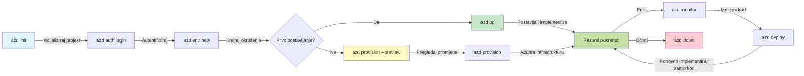
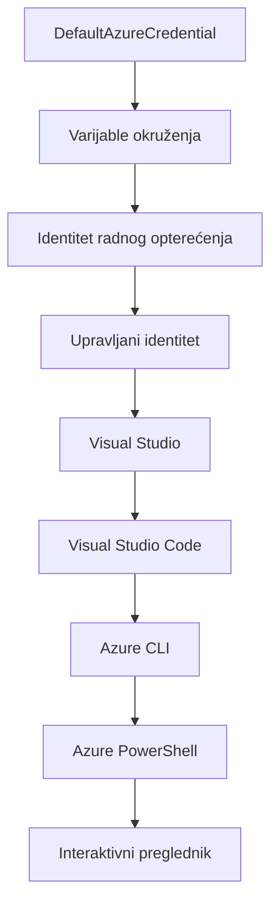

<!--
CO_OP_TRANSLATOR_METADATA:
{
  "original_hash": "e855e899d2705754fe85b04190edd0f0",
  "translation_date": "2025-11-23T19:04:55+00:00",
  "source_file": "docs/getting-started/azd-basics.md",
  "language_code": "hr"
}
-->
# AZD Osnove - Razumijevanje Azure Developer CLI

# AZD Osnove - Ključni pojmovi i temelji

**Navigacija poglavljem:**
- **📚 Početna stranica tečaja**: [AZD za početnike](../../README.md)
- **📖 Trenutno poglavlje**: Poglavlje 1 - Osnove i brzi početak
- **⬅️ Prethodno**: [Pregled tečaja](../../README.md#-chapter-1-foundation--quick-start)
- **➡️ Sljedeće**: [Instalacija i postavljanje](installation.md)
- **🚀 Sljedeće poglavlje**: [Poglavlje 2: Razvoj temeljen na umjetnoj inteligenciji](../microsoft-foundry/microsoft-foundry-integration.md)

## Uvod

Ova lekcija uvodi vas u Azure Developer CLI (azd), moćan alat naredbenog retka koji ubrzava vaš put od lokalnog razvoja do implementacije na Azure. Naučit ćete osnovne pojmove, ključne značajke i kako azd pojednostavljuje implementaciju aplikacija temeljenih na oblaku.

## Ciljevi učenja

Na kraju ove lekcije, moći ćete:
- Razumjeti što je Azure Developer CLI i njegovu glavnu svrhu
- Naučiti osnovne pojmove poput predložaka, okruženja i usluga
- Istražiti ključne značajke uključujući razvoj temeljen na predlošcima i infrastrukturu kao kod
- Razumjeti strukturu i tijek rada azd projekata
- Biti spremni instalirati i konfigurirati azd za svoje razvojno okruženje

## Ishodi učenja

Nakon završetka ove lekcije, moći ćete:
- Objasniti ulogu azd-a u modernim radnim tijekovima razvoja oblaka
- Identificirati komponente strukture azd projekta
- Opisati kako predlošci, okruženja i usluge međusobno djeluju
- Razumjeti prednosti infrastrukture kao koda s azd-om
- Prepoznati različite azd naredbe i njihove svrhe

## Što je Azure Developer CLI (azd)?

Azure Developer CLI (azd) je alat naredbenog retka osmišljen za ubrzavanje vašeg puta od lokalnog razvoja do implementacije na Azure. Pojednostavljuje proces izgradnje, implementacije i upravljanja aplikacijama temeljenim na oblaku na Azureu.

### 🎯 Zašto koristiti AZD? Usporedba iz stvarnog svijeta

Usporedimo implementaciju jednostavne web aplikacije s bazom podataka:

#### ❌ BEZ AZD-a: Ručna implementacija na Azure (30+ minuta)

```bash
# Korak 1: Kreirajte grupu resursa
az group create --name myapp-rg --location eastus

# Korak 2: Kreirajte plan usluge aplikacije
az appservice plan create --name myapp-plan \
  --resource-group myapp-rg \
  --sku B1 --is-linux

# Korak 3: Kreirajte web aplikaciju
az webapp create --name myapp-web-unique123 \
  --resource-group myapp-rg \
  --plan myapp-plan \
  --runtime "NODE:18-lts"

# Korak 4: Kreirajte Cosmos DB račun (10-15 minuta)
az cosmosdb create --name myapp-cosmos-unique123 \
  --resource-group myapp-rg \
  --kind MongoDB

# Korak 5: Kreirajte bazu podataka
az cosmosdb mongodb database create \
  --account-name myapp-cosmos-unique123 \
  --resource-group myapp-rg \
  --name tododb

# Korak 6: Kreirajte kolekciju
az cosmosdb mongodb collection create \
  --account-name myapp-cosmos-unique123 \
  --resource-group myapp-rg \
  --database-name tododb \
  --name todos

# Korak 7: Dohvatite vezni niz
CONN_STR=$(az cosmosdb keys list \
  --name myapp-cosmos-unique123 \
  --resource-group myapp-rg \
  --type connection-strings \
  --query "connectionStrings[0].connectionString" -o tsv)

# Korak 8: Konfigurirajte postavke aplikacije
az webapp config appsettings set \
  --name myapp-web-unique123 \
  --resource-group myapp-rg \
  --settings MONGODB_URI="$CONN_STR"

# Korak 9: Omogućite zapisivanje
az webapp log config --name myapp-web-unique123 \
  --resource-group myapp-rg \
  --application-logging filesystem \
  --detailed-error-messages true

# Korak 10: Postavite Application Insights
az monitor app-insights component create \
  --app myapp-insights \
  --location eastus \
  --resource-group myapp-rg

# Korak 11: Povežite App Insights s web aplikacijom
INSTRUMENTATION_KEY=$(az monitor app-insights component show \
  --app myapp-insights \
  --resource-group myapp-rg \
  --query "instrumentationKey" -o tsv)

az webapp config appsettings set \
  --name myapp-web-unique123 \
  --resource-group myapp-rg \
  --settings APPINSIGHTS_INSTRUMENTATIONKEY="$INSTRUMENTATION_KEY"

# Korak 12: Izgradite aplikaciju lokalno
npm install
npm run build

# Korak 13: Kreirajte paket za implementaciju
zip -r app.zip . -x "*.git*" "node_modules/*"

# Korak 14: Implementirajte aplikaciju
az webapp deployment source config-zip \
  --resource-group myapp-rg \
  --name myapp-web-unique123 \
  --src app.zip

# Korak 15: Pričekajte i molite se da radi 🙏
# (Nema automatizirane validacije, potrebno ručno testiranje)
```

**Problemi:**
- ❌ 15+ naredbi koje treba zapamtiti i izvršiti redom
- ❌ 30-45 minuta ručnog rada
- ❌ Lako je napraviti pogreške (tipfeleri, pogrešni parametri)
- ❌ Izloženi nizovi za povezivanje u povijesti terminala
- ❌ Nema automatskog vraćanja ako nešto ne uspije
- ❌ Teško za ponoviti za članove tima
- ❌ Svaki put drugačije (nije reproducibilno)

#### ✅ S AZD-om: Automatizirana implementacija (5 naredbi, 10-15 minuta)

```bash
# Korak 1: Inicijalizirajte iz predloška
azd init --template todo-nodejs-mongo

# Korak 2: Autentificirajte se
azd auth login

# Korak 3: Kreirajte okruženje
azd env new dev

# Korak 4: Pregledajte promjene (opcionalno, ali preporučeno)
azd provision --preview

# Korak 5: Implementirajte sve
azd up

# ✨ Gotovo! Sve je implementirano, konfigurirano i nadzirano
```

**Prednosti:**
- ✅ **5 naredbi** naspram 15+ ručnih koraka
- ✅ **10-15 minuta** ukupnog vremena (uglavnom čekanje na Azure)
- ✅ **Nula pogrešaka** - automatizirano i testirano
- ✅ **Sigurno upravljanje tajnama** putem Key Vault-a
- ✅ **Automatsko vraćanje** u slučaju neuspjeha
- ✅ **Potpuno reproducibilno** - isti rezultat svaki put
- ✅ **Pripremljeno za tim** - svatko može implementirati s istim naredbama
- ✅ **Infrastruktura kao kod** - verzionirani Bicep predlošci
- ✅ **Ugrađeno praćenje** - Application Insights automatski konfiguriran

### 📊 Smanjenje vremena i pogrešaka

| Metrika | Ručna implementacija | AZD implementacija | Poboljšanje |
|:-------|:---------------------|:-------------------|:------------|
| **Naredbe** | 15+ | 5 | 67% manje |
| **Vrijeme** | 30-45 min | 10-15 min | 60% brže |
| **Stopa pogrešaka** | ~40% | <5% | 88% smanjenje |
| **Dosljednost** | Niska (ručno) | 100% (automatizirano) | Savršeno |
| **Uvođenje tima** | 2-4 sata | 30 minuta | 75% brže |
| **Vrijeme vraćanja** | 30+ min (ručno) | 2 min (automatizirano) | 93% brže |

## Ključni pojmovi

### Predlošci
Predlošci su temelj azd-a. Sadrže:
- **Kod aplikacije** - Vaš izvorni kod i ovisnosti
- **Definicije infrastrukture** - Azure resursi definirani u Bicep-u ili Terraform-u
- **Konfiguracijske datoteke** - Postavke i varijable okruženja
- **Skripte za implementaciju** - Automatizirani tijekovi implementacije

### Okruženja
Okruženja predstavljaju različite ciljeve implementacije:
- **Razvoj** - Za testiranje i razvoj
- **Staging** - Predprodukcijsko okruženje
- **Produkcija** - Živo produkcijsko okruženje

Svako okruženje održava vlastite:
- Azure resursne grupe
- Konfiguracijske postavke
- Stanje implementacije

### Usluge
Usluge su građevni blokovi vaše aplikacije:
- **Frontend** - Web aplikacije, SPA-ovi
- **Backend** - API-ji, mikroservisi
- **Baza podataka** - Rješenja za pohranu podataka
- **Pohrana** - Pohrana datoteka i blobova

## Ključne značajke

### 1. Razvoj temeljen na predlošcima
```bash
# Pregledajte dostupne predloške
azd template list

# Inicijalizirajte iz predloška
azd init --template <template-name>
```

### 2. Infrastruktura kao kod
- **Bicep** - Azureov jezik specifičan za domenu
- **Terraform** - Alat za infrastrukturu u više oblaka
- **ARM predlošci** - Predlošci za Azure Resource Manager

### 3. Integrirani tijekovi rada
```bash
# Dovršite tijek rada za implementaciju
azd up            # Postavljanje + Implementacija ovo je bez intervencije za prvi put postavljanje

# 🧪 NOVO: Pregledajte promjene infrastrukture prije implementacije (SIGURNO)
azd provision --preview    # Simulirajte implementaciju infrastrukture bez promjena

azd provision     # Kreirajte Azure resurse ako ažurirate infrastrukturu koristite ovo
azd deploy        # Implementirajte kod aplikacije ili ponovno implementirajte kod aplikacije nakon ažuriranja
azd down          # Očistite resurse
```

#### 🛡️ Sigurno planiranje infrastrukture s pregledom
Naredba `azd provision --preview` mijenja igru za sigurne implementacije:
- **Analiza probnog rada** - Prikazuje što će se stvoriti, izmijeniti ili izbrisati
- **Nulti rizik** - Nema stvarnih promjena u vašem Azure okruženju
- **Suradnja tima** - Dijelite rezultate pregleda prije implementacije
- **Procjena troškova** - Razumijevanje troškova resursa prije obveze

```bash
# Primjer tijeka rada za pregled
azd provision --preview           # Pogledajte što će se promijeniti
# Pregledajte izlaz, razgovarajte s timom
azd provision                     # Primijenite promjene s povjerenjem
```

### 📊 Vizualizacija: AZD tijek razvoja


**Objašnjenje tijeka rada:**
1. **Init** - Početak s predloškom ili novim projektom
2. **Auth** - Autentifikacija s Azureom
3. **Okruženje** - Stvaranje izoliranog okruženja za implementaciju
4. **Pregled** - 🆕 Uvijek pregledajte promjene infrastrukture prvo (sigurna praksa)
5. **Provision** - Stvaranje/ažuriranje Azure resursa
6. **Deploy** - Slanje vašeg koda aplikacije
7. **Monitor** - Praćenje performansi aplikacije
8. **Iteracija** - Izmjene i ponovna implementacija koda
9. **Čišćenje** - Uklanjanje resursa kada završite

### 4. Upravljanje okruženjima
```bash
# Kreiraj i upravljaj okruženjima
azd env new <environment-name>
azd env select <environment-name>
azd env list
```

## 📁 Struktura projekta

Tipična struktura azd projekta:
```
my-app/
├── .azd/                    # azd configuration
│   └── config.json
├── .azure/                  # Azure deployment artifacts
├── .devcontainer/          # Development container config
├── .github/workflows/      # GitHub Actions
├── .vscode/               # VS Code settings
├── infra/                 # Infrastructure code
│   ├── main.bicep        # Main infrastructure template
│   ├── main.parameters.json
│   └── modules/          # Reusable modules
├── src/                  # Application source code
│   ├── api/             # Backend services
│   └── web/             # Frontend application
├── azure.yaml           # azd project configuration
└── README.md
```

## 🔧 Konfiguracijske datoteke

### azure.yaml
Glavna konfiguracijska datoteka projekta:
```yaml
name: my-awesome-app
metadata:
  template: my-template@1.0.0

services:
  web:
    project: ./src/web
    language: js
    host: appservice
  api:
    project: ./src/api
    language: js
    host: appservice

hooks:
  preprovision:
    shell: pwsh
    run: echo "Preparing to provision..."
```

### .azure/config.json
Konfiguracija specifična za okruženje:
```json
{
  "version": 1,
  "defaultEnvironment": "dev",
  "environments": {
    "dev": {
      "subscriptionId": "your-subscription-id",
      "location": "eastus"
    }
  }
}
```

## 🎪 Uobičajeni tijekovi rada s praktičnim vježbama

> **💡 Savjet za učenje:** Slijedite ove vježbe redom kako biste postupno izgradili svoje AZD vještine.

### 🎯 Vježba 1: Inicijalizirajte svoj prvi projekt

**Cilj:** Stvoriti AZD projekt i istražiti njegovu strukturu

**Koraci:**
```bash
# Koristite provjerenu predložak
azd init --template todo-nodejs-mongo

# Istražite generirane datoteke
ls -la  # Pregledajte sve datoteke, uključujući skrivene

# Ključne datoteke kreirane:
# - azure.yaml (glavna konfiguracija)
# - infra/ (kod infrastrukture)
# - src/ (kod aplikacije)
```

**✅ Uspjeh:** Imate azure.yaml, infra/ i src/ direktorije

---

### 🎯 Vježba 2: Implementacija na Azure

**Cilj:** Dovršiti implementaciju od početka do kraja

**Koraci:**
```bash
# 1. Autentificiraj se
az login && azd auth login

# 2. Kreiraj okruženje
azd env new dev
azd env set AZURE_LOCATION eastus

# 3. Pregledaj promjene (PREPORUČENO)
azd provision --preview

# 4. Implementiraj sve
azd up

# 5. Provjeri implementaciju
azd show    # Pogledaj URL svoje aplikacije
```

**Očekivano vrijeme:** 10-15 minuta  
**✅ Uspjeh:** URL aplikacije otvara se u pregledniku

---

### 🎯 Vježba 3: Višestruka okruženja

**Cilj:** Implementirati na razvojno i staging okruženje

**Koraci:**
```bash
# Već imamo razvoj, kreiraj testiranje
azd env new staging
azd env set AZURE_LOCATION westus2
azd up

# Prebaci se između njih
azd env list
azd env select dev
```

**✅ Uspjeh:** Dvije odvojene resursne grupe u Azure portalu

---

### 🛡️ Čista ploča: `azd down --force --purge`

Kada trebate potpuno resetirati:

```bash
azd down --force --purge
```

**Što radi:**
- `--force`: Bez potvrda
- `--purge`: Briše sve lokalne podatke i Azure resurse

**Koristite kada:**
- Implementacija nije uspjela do kraja
- Prebacujete projekte
- Trebate svježi početak

---

## 🎪 Referenca originalnog tijeka rada

### Početak novog projekta
```bash
# Metoda 1: Koristite postojeći predložak
azd init --template todo-nodejs-mongo

# Metoda 2: Započnite od nule
azd init

# Metoda 3: Koristite trenutni direktorij
azd init .
```

### Razvojni ciklus
```bash
# Postavite razvojno okruženje
azd auth login
azd env new dev
azd env select dev

# Implementirajte sve
azd up

# Napravite promjene i ponovno implementirajte
azd deploy

# Očistite kada završite
azd down --force --purge # naredba u Azure Developer CLI je **tvrd reset** za vaše okruženje—posebno korisno kada rješavate probleme s neuspjelim implementacijama, čistite napuštene resurse ili se pripremate za novu implementaciju.
```

## Razumijevanje `azd down --force --purge`
Naredba `azd down --force --purge` moćan je način za potpuno uklanjanje vašeg azd okruženja i svih povezanih resursa. Evo što svaka zastavica radi:
```
--force
```
- Preskače potvrde.
- Korisno za automatizaciju ili skriptiranje gdje ručni unos nije izvediv.
- Osigurava da se uklanjanje nastavi bez prekida, čak i ako CLI otkrije nedosljednosti.

```
--purge
```
Briše **sve povezane metapodatke**, uključujući:
Stanje okruženja
Lokalnu `.azure` mapu
Keširane informacije o implementaciji
Sprječava azd da "pamti" prethodne implementacije, što može uzrokovati probleme poput neusklađenih resursnih grupa ili zastarjelih referenci registra.

### Zašto koristiti oboje?
Kada zapnete s `azd up` zbog zaostalog stanja ili djelomičnih implementacija, ova kombinacija osigurava **čistu ploču**.

Posebno je korisno nakon ručnog brisanja resursa u Azure portalu ili pri promjeni predložaka, okruženja ili konvencija imenovanja resursnih grupa.

### Upravljanje višestrukim okruženjima
```bash
# Kreiraj okruženje za testiranje
azd env new staging
azd env select staging
azd up

# Vrati se na razvojno okruženje
azd env select dev

# Usporedi okruženja
azd env list
```

## 🔐 Autentifikacija i vjerodajnice

Razumijevanje autentifikacije ključno je za uspješne azd implementacije. Azure koristi više metoda autentifikacije, a azd koristi isti lanac vjerodajnica kao i drugi Azure alati.

### Azure CLI autentifikacija (`az login`)

Prije korištenja azd-a, trebate se autentificirati s Azureom. Najčešća metoda je korištenje Azure CLI:

```bash
# Interaktivna prijava (otvara preglednik)
az login

# Prijava s određenim zakupcem
az login --tenant <tenant-id>

# Prijava s glavnim servisnim računom
az login --service-principal -u <app-id> -p <password> --tenant <tenant-id>

# Provjera trenutnog statusa prijave
az account show

# Popis dostupnih pretplata
az account list --output table

# Postavljanje zadane pretplate
az account set --subscription <subscription-id>
```

### Tijek autentifikacije
1. **Interaktivna prijava**: Otvara vaš zadani preglednik za autentifikaciju
2. **Tijek koda uređaja**: Za okruženja bez pristupa pregledniku
3. **Servisni principal**: Za automatizaciju i CI/CD scenarije
4. **Upravljani identitet**: Za aplikacije hostane na Azureu

### DefaultAzureCredential lanac

`DefaultAzureCredential` je vrsta vjerodajnice koja pruža pojednostavljeno iskustvo autentifikacije automatskim pokušajem više izvora vjerodajnica u određenom redoslijedu:

#### Redoslijed lanca vjerodajnica

#### 1. Varijable okruženja
```bash
# Postavite varijable okruženja za servisni principal
export AZURE_CLIENT_ID="<app-id>"
export AZURE_CLIENT_SECRET="<password>"
export AZURE_TENANT_ID="<tenant-id>"
```

#### 2. Identitet radnog opterećenja (Kubernetes/GitHub Actions)
Automatski se koristi u:
- Azure Kubernetes Service (AKS) s identitetom radnog opterećenja
- GitHub Actions s OIDC federacijom
- Ostali scenariji federiranog identiteta

#### 3. Upravljani identitet
Za Azure resurse poput:
- Virtualnih strojeva
- App Service
- Azure Functions
- Container Instances

```bash
# Provjerite radi li se o Azure resursu s upravljanim identitetom
az account show --query "user.type" --output tsv
# Vraća: "servicePrincipal" ako se koristi upravljani identitet
```

#### 4. Integracija s razvojnim alatima
- **Visual Studio**: Automatski koristi prijavljeni račun
- **VS Code**: Koristi vjerodajnice iz Azure Account ekstenzije
- **Azure CLI**: Koristi vjerodajnice iz `az login` (najčešće za lokalni razvoj)

### Postavljanje AZD autentifikacije

```bash
# Metoda 1: Koristite Azure CLI (Preporučeno za razvoj)
az login
azd auth login  # Koristi postojeće Azure CLI vjerodajnice

# Metoda 2: Izravna azd autentifikacija
azd auth login --use-device-code  # Za okruženja bez korisničkog sučelja

# Metoda 3: Provjera statusa autentifikacije
azd auth login --check-status

# Metoda 4: Odjava i ponovna autentifikacija
azd auth logout
azd auth login
```

### Najbolje prakse za autentifikaciju

#### Za lokalni razvoj
```bash
# 1. Prijavite se pomoću Azure CLI
az login

# 2. Provjerite ispravnu pretplatu
az account show
az account set --subscription "Your Subscription Name"

# 3. Koristite azd s postojećim vjerodajnicama
azd auth login
```

#### Za CI/CD pipeline
```yaml
# GitHub Actions example
- name: Azure Login
  uses: azure/login@v1
  with:
    creds: ${{ secrets.AZURE_CREDENTIALS }}

- name: Deploy with azd
  run: |
    azd auth login --client-id ${{ secrets.AZURE_CLIENT_ID }} \
                    --client-secret ${{ secrets.AZURE_CLIENT_SECRET }} \
                    --tenant-id ${{ secrets.AZURE_TENANT_ID }}
    azd up --no-prompt
```

#### Za produkcijska okruženja
- Koristite **upravljani identitet** kada radite na Azure resursima
- Koristite **servisni principal** za automatizacijske scenarije
- Izbjegavajte pohranjivanje vjerodajnica u kodu ili konfiguracijskim datotekama
- Koristite **Azure Key Vault** za osjetljive konfiguracije

### Uobičajeni problemi s autentifikacijom i rješenja

#### Problem: "Nije pronađena pretplata"
```bash
# Rješenje: Postavite zadanu pretplatu
az account list --output table
az account set --subscription "<subscription-id>"
azd env set AZURE_SUBSCRIPTION_ID "<subscription-id>"
```

#### Problem: "Nedovoljna dopuštenja"
```bash
# Rješenje: Provjerite i dodijelite potrebne uloge
az role assignment list --assignee $(az account show --query user.name --output tsv)

# Uobičajene potrebne uloge:
# - Suradnik (za upravljanje resursima)
# - Administrator korisničkog pristupa (za dodjelu uloga)
```

#### Problem: "Token je istekao"
```bash
# Rješenje: Ponovno se autentificirajte
az logout
az login
azd auth logout
azd auth login
```

### Autentifikacija u različitim scenarijima

#### Lokalni razvoj
```bash
# Račun za osobni razvoj
az login
azd auth login
```

#### Razvoj u timu
```bash
# Koristite specifičnog stanara za organizaciju
az login --tenant contoso.onmicrosoft.com
azd auth login
```

#### Višetenantski scenariji
```bash
# Prebacivanje između najmoprimaca
az login --tenant tenant1.onmicrosoft.com
# Implementacija na najmoprimca 1
azd up

az login --tenant tenant2.onmicrosoft.com  
# Implementacija na najmoprimca 2
azd up
```

### Sigurnosna razmatranja

1. **Pohrana vjerodajnica**: Nikada ne pohranjujte vjerodajnice u izvorni kod
2. **Ograničenje opsega**: Koristite princip najmanjih privilegija za servisne principale
3. **Rotacija tokena**: Redovito rotirajte tajne servisnih principala
4. **Trag revizije**: Pratite aktivnosti autentifikacije i implementacije
5. **Sigurnost mreže**: Koristite privatne krajnje točke kad god je to moguće

### Rješavanje problema s autentifikacijom

```bash
# Otklonite poteškoće s autentifikacijom
azd auth login --check-status
az account show
az account get-access-token

# Uobičajene dijagnostičke naredbe
whoami                          # Trenutni korisnički kontekst
az ad signed-in-user show      # Detalji korisnika Azure AD
az group list                  # Testirajte pristup resursima
```

## Razumijevanje `azd down --force --purge`

### Otkrivanje
```bash
azd template list              # Pregledaj predloške
azd template show <template>   # Detalji predloška
azd init --help               # Opcije inicijalizacije
```

### Upravljanje projektima
```bash
azd show                     # Pregled projekta
azd env show                 # Trenutno okruženje
azd config list             # Postavke konfiguracije
```

### Praćenje
```bash
azd monitor                  # Otvorite Azure portal
azd pipeline config          # Postavite CI/CD
azd logs                     # Pregledajte zapisnike aplikacije
```

## Najbolje prakse

### 1. Koristite smislena imena
```bash
# Dobro
azd env new production-east
azd init --template web-app-secure

# Izbjegavati
azd env new env1
azd init --template template1
```

### 2. Iskoristite predloške
- Počnite s postojećim predlošcima
- Prilagodite ih svojim potrebama
- Stvorite predloške za ponovnu upotrebu unutar svoje organizacije

### 3. Izolacija okruženja
- Koristite odvojena okruženja za razvoj/staging/produkciju
- Nikada ne implementirajte izravno u produkciju s lokalnog stroja
- Koristite CI/CD pipeline za produkcijske implementacije

### 4. Upravljanje konfiguracijom
- Koristite varijable okruženja za osjetljive podatke
- Držite konfiguraciju pod verzijskom kontrolom
- Dokumentirajte postavke specifične za okruženje

## Napredak u učenju

### Početnik (1-2 tjedna)
1. Instalirajte azd i autentificirajte se
2. Implementirajte jednostavan predložak
3. Razumijte strukturu projekta
4. Naučite osnovne naredbe (up, down, deploy)

### Srednji nivo (3-4 tjedna)
1. Prilagodite predloške
2. Upravljajte višestrukim okruženjima
3. Razumijte infrastrukturu kao kod
4. Postavite CI/CD pipeline

### Napredni nivo (5+ tjedana)
1. Stvorite prilagođene predloške
2. Napredni infrastrukturni obrasci
3. Implementacije u više regija
4. Konfiguracije na razini poduzeća

## Sljedeći koraci

**📖 Nastavite s učenjem u Poglavlju 1:**
- [Instalacija i postavljanje](installation.md) - Instalirajte i konfigurirajte azd
- [Vaš prvi projekt](first-project.md) - Praktični vodič
- [Vodič za konfiguraciju](configuration.md) - Napredne opcije konfiguracije

**🎯 Spremni za sljedeće poglavlje?**
- [Poglavlje 2: AI-prvi razvoj](../microsoft-foundry/microsoft-foundry-integration.md) - Počnite graditi AI aplikacije

## Dodatni resursi

- [Pregled Azure Developer CLI](https://learn.microsoft.com/en-us/azure/developer/azure-developer-cli/)
- [Galerija predložaka](https://azure.github.io/awesome-azd/)
- [Primjeri iz zajednice](https://github.com/Azure-Samples)

---

## 🙋 Često postavljana pitanja

### Opća pitanja

**P: Koja je razlika između AZD i Azure CLI?**

O: Azure CLI (`az`) služi za upravljanje pojedinačnim Azure resursima. AZD (`azd`) je za upravljanje cijelim aplikacijama:

```bash
# Azure CLI - Upravljanje resursima na niskoj razini
az webapp create --name myapp --resource-group rg
az sql server create --name myserver --resource-group rg
# ...potrebno je mnogo više naredbi

# AZD - Upravljanje na razini aplikacije
azd up  # Implementira cijelu aplikaciju sa svim resursima
```

**Razmislite ovako:**
- `az` = Rad s pojedinačnim Lego kockicama
- `azd` = Rad s kompletnim Lego setovima

---

**P: Trebam li znati Bicep ili Terraform za korištenje AZD-a?**

O: Ne! Počnite s predlošcima:
```bash
# Koristite postojeći predložak - nije potrebno znanje o IaC-u
azd init --template todo-nodejs-mongo
azd up
```

Kasnije možete naučiti Bicep za prilagodbu infrastrukture. Predlošci pružaju radne primjere za učenje.

---

**P: Koliko košta pokretanje AZD predložaka?**

O: Troškovi ovise o predlošku. Većina razvojnih predložaka košta $50-150/mjesečno:

```bash
# Pregledajte troškove prije implementacije
azd provision --preview

# Uvijek očistite kada ne koristite
azd down --force --purge  # Uklanja sve resurse
```

**Savjet:** Koristite besplatne razine gdje je to moguće:
- App Service: F1 (besplatna) razina
- Azure OpenAI: 50.000 tokena/mjesečno besplatno
- Cosmos DB: 1000 RU/s besplatna razina

---

**P: Mogu li koristiti AZD s postojećim Azure resursima?**

O: Da, ali lakše je početi ispočetka. AZD najbolje funkcionira kada upravlja cijelim životnim ciklusom. Za postojeće resurse:

```bash
# Opcija 1: Uvoz postojećih resursa (napredno)
azd init
# Zatim izmijenite infra/ kako biste referencirali postojeće resurse

# Opcija 2: Započnite ispočetka (preporučeno)
azd init --template matching-your-stack
azd up  # Stvara novo okruženje
```

---

**P: Kako mogu podijeliti svoj projekt s timom?**

O: Pohranite AZD projekt u Git (ali NE .azure mapu):

```bash
# Već u .gitignore prema zadanim postavkama
.azure/        # Sadrži tajne i podatke o okruženju
*.env          # Varijable okruženja

# Članovi tima tada:
git clone <your-repo>
azd auth login
azd env new <their-name>-dev
azd up
```

Svi dobivaju identičnu infrastrukturu iz istih predložaka.

---

### Pitanja o rješavanju problema

**P: "azd up" nije uspio do kraja. Što da radim?**

O: Provjerite grešku, ispravite je, a zatim pokušajte ponovno:

```bash
# Pregledajte detaljne zapise
azd show

# Uobičajeni popravci:

# 1. Ako je kvota premašena:
azd env set AZURE_LOCATION "westus2"  # Pokušajte s drugom regijom

# 2. Ako postoji sukob imena resursa:
azd down --force --purge  # Očistite sve
azd up  # Pokušajte ponovno

# 3. Ako je autorizacija istekla:
az login
azd auth login
azd up
```

**Najčešći problem:** Pogrešno odabrana Azure pretplata
```bash
az account list --output table
az account set --subscription "<correct-subscription>"
```

---

**P: Kako mogu implementirati samo promjene u kodu bez ponovnog postavljanja infrastrukture?**

O: Koristite `azd deploy` umjesto `azd up`:

```bash
azd up          # Prvi put: priprema + implementacija (sporo)

# Napravite promjene u kodu...

azd deploy      # Sljedeći put: samo implementacija (brzo)
```

Usporedba brzine:
- `azd up`: 10-15 minuta (postavlja infrastrukturu)
- `azd deploy`: 2-5 minuta (samo kod)

---

**P: Mogu li prilagoditi predloške infrastrukture?**

O: Da! Uredite Bicep datoteke u `infra/`:

```bash
# Nakon azd init
cd infra/
code main.bicep  # Uredi u VS Code

# Pregledaj promjene
azd provision --preview

# Primijeni promjene
azd provision
```

**Savjet:** Počnite s malim promjenama - prvo promijenite SKUs:
```bicep
// infra/main.bicep
sku: {
  name: 'B1'  // Change to 'P1V2' for production
}
```

---

**P: Kako mogu izbrisati sve što je AZD stvorio?**

O: Jedna naredba uklanja sve resurse:

```bash
azd down --force --purge

# Ovo briše:
# - Sve Azure resurse
# - Grupu resursa
# - Stanje lokalnog okruženja
# - Predmemorirane podatke o implementaciji
```

**Uvijek pokrenite ovo kada:**
- Završite testiranje predloška
- Prelazite na drugi projekt
- Želite početi ispočetka

**Ušteda troškova:** Brisanje neiskorištenih resursa = $0 troškova

---

**P: Što ako sam slučajno izbrisao resurse u Azure Portalu?**

O: AZD stanje može se poremetiti. Pristupite s čistim početkom:

```bash
# 1. Uklonite lokalno stanje
azd down --force --purge

# 2. Započnite ispočetka
azd up

# Alternativa: Dopustite AZD da otkrije i popravi
azd provision  # Stvorit će nedostajuće resurse
```

---

### Napredna pitanja

**P: Mogu li koristiti AZD u CI/CD pipelineovima?**

O: Da! Primjer za GitHub Actions:

```yaml
# .github/workflows/deploy.yml
name: Deploy with AZD

on:
  push:
    branches: [main]

jobs:
  deploy:
    runs-on: ubuntu-latest
    steps:
      - uses: actions/checkout@v2
      
      - name: Install azd
        run: curl -fsSL https://aka.ms/install-azd.sh | bash
      
      - name: Azure Login
        run: |
          azd auth login \
            --client-id ${{ secrets.AZURE_CLIENT_ID }} \
            --client-secret ${{ secrets.AZURE_CLIENT_SECRET }} \
            --tenant-id ${{ secrets.AZURE_TENANT_ID }}
      
      - name: Deploy
        run: azd up --no-prompt
```

---

**P: Kako upravljati tajnama i osjetljivim podacima?**

O: AZD se automatski integrira s Azure Key Vaultom:

```bash
# Tajne se pohranjuju u Key Vault, ne u kod
azd env set DATABASE_PASSWORD "$(openssl rand -base64 32)"

# AZD automatski:
# 1. Kreira Key Vault
# 2. Pohranjuje tajnu
# 3. Dodjeljuje pristup aplikaciji putem Upravljanog Identiteta
# 4. Uključuje tijekom izvođenja
```

**Nikada ne pohranjujte:**
- `.azure/` mapu (sadrži podatke o okruženju)
- `.env` datoteke (lokalne tajne)
- Povezne stringove

---

**P: Mogu li implementirati u više regija?**

O: Da, stvorite okruženje za svaku regiju:

```bash
# Istočnoameričko okruženje
azd env new prod-eastus
azd env set AZURE_LOCATION eastus
azd up

# Zapadnoeuropsko okruženje
azd env new prod-westeurope
azd env set AZURE_LOCATION westeurope
azd up

# Svako okruženje je neovisno
azd env list
```

Za prave aplikacije s više regija, prilagodite Bicep predloške za implementaciju u više regija istovremeno.

---

**P: Gdje mogu dobiti pomoć ako zapnem?**

1. **AZD dokumentacija:** https://learn.microsoft.com/azure/developer/azure-developer-cli/
2. **GitHub Issues:** https://github.com/Azure/azure-dev/issues
3. **Discord:** [Azure Discord](https://discord.gg/microsoft-azure) - kanal #azure-developer-cli
4. **Stack Overflow:** Oznaka `azure-developer-cli`
5. **Ovaj tečaj:** [Vodič za rješavanje problema](../troubleshooting/common-issues.md)

**Savjet:** Prije postavljanja pitanja, pokrenite:
```bash
azd show       # Prikazuje trenutno stanje
azd version    # Prikazuje vašu verziju
```
Uključite ove informacije u svoje pitanje za bržu pomoć.

---

## 🎓 Što dalje?

Sada razumijete osnove AZD-a. Odaberite svoj put:

### 🎯 Za početnike:
1. **Dalje:** [Instalacija i postavljanje](installation.md) - Instalirajte AZD na svoj uređaj
2. **Zatim:** [Vaš prvi projekt](first-project.md) - Implementirajte svoju prvu aplikaciju
3. **Vježbajte:** Dovršite sve 3 vježbe u ovoj lekciji

### 🚀 Za AI developere:
1. **Preskočite na:** [Poglavlje 2: AI-prvi razvoj](../microsoft-foundry/microsoft-foundry-integration.md)
2. **Implementirajte:** Počnite s `azd init --template get-started-with-ai-chat`
3. **Učite:** Gradite dok implementirate

### 🏗️ Za iskusne developere:
1. **Pregledajte:** [Vodič za konfiguraciju](configuration.md) - Napredne postavke
2. **Istražite:** [Infrastruktura kao kod](../deployment/provisioning.md) - Detaljno o Bicepu
3. **Gradite:** Stvorite prilagođene predloške za svoj stack

---

**Navigacija kroz poglavlja:**
- **📚 Početna stranica tečaja**: [AZD za početnike](../../README.md)
- **📖 Trenutno poglavlje**: Poglavlje 1 - Osnove i brzi početak  
- **⬅️ Prethodno**: [Pregled tečaja](../../README.md#-chapter-1-foundation--quick-start)
- **➡️ Sljedeće**: [Instalacija i postavljanje](installation.md)
- **🚀 Sljedeće poglavlje**: [Poglavlje 2: AI-prvi razvoj](../microsoft-foundry/microsoft-foundry-integration.md)

---

<!-- CO-OP TRANSLATOR DISCLAIMER START -->
**Izjava o odricanju odgovornosti**:  
Ovaj dokument je preveden pomoću AI usluge za prevođenje [Co-op Translator](https://github.com/Azure/co-op-translator). Iako nastojimo osigurati točnost, imajte na umu da automatski prijevodi mogu sadržavati pogreške ili netočnosti. Izvorni dokument na izvornom jeziku treba smatrati autoritativnim izvorom. Za ključne informacije preporučuje se profesionalni prijevod od strane čovjeka. Ne preuzimamo odgovornost za nesporazume ili pogrešna tumačenja koja proizlaze iz korištenja ovog prijevoda.
<!-- CO-OP TRANSLATOR DISCLAIMER END -->